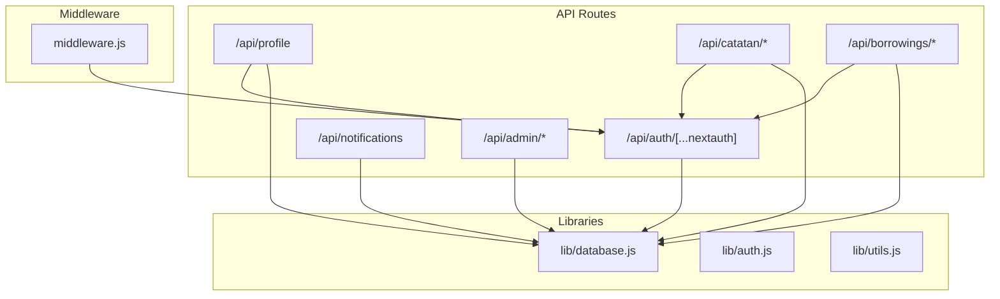
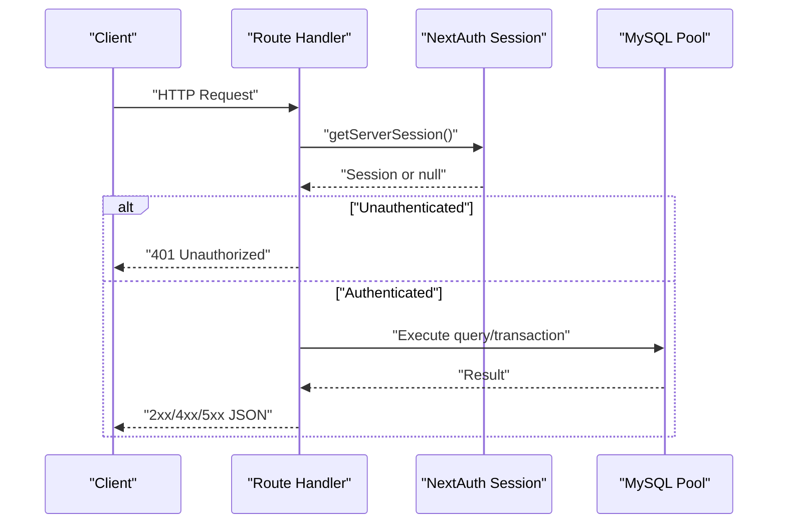
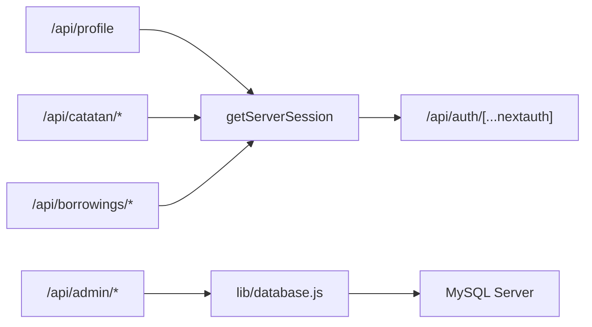

# API Reference

<cite>
**Referenced Files in This Document**
- [auth route](file://app/api/auth/[...nextauth]/route.js)
- [profile route](file://app/api/profile/route.js)
- [notifications route](file://app/api/notifications/route.js)
- [admin create student route](file://app/api/admin/create-student/route.js)
- [admin create teacher route](file://app/api/admin/create-teacher/route.js)
- [admin guru route](file://app/api/admin/guru/route.js)
- [admin guru [id] route](file://app/api/admin/guru/[id]/route.js)
- [admin jadwal route](file://app/api/admin/jadwal/route.js)
- [admin kelas route](file://app/api/admin/kelas/route.js)
- [admin laporan route](file://app/api/admin/laporan/route.js)
- [admin list students route](file://app/api/admin/list-students/route.js)
- [admin list teachers route](file://app/api/admin/list-teachers/route.js)
- [admin list borrowings route](file://app/api/admin/list-borrowings/route.js)
- [admin siswa route](file://app/api/admin/siswa/route.js)
- [admin siswa [id] route](file://app/api/admin/siswa/[id]/route.js)
- [catatan route](file://app/api/catatan/route.js)
- [catatan create route](file://app/api/catatan/create/route.js)
- [catatan [id] route](file://app/api/catatan/[id]/route.js)
- [borrowings route](file://app/api/borrowings/route.js)
- [borrowings pending route](file://app/api/borrowings/pending/route.js)
- [borrowings approve[id] route](file://app/api/borrowings/approve[id]/route.js)
- [borrowings reject[id] route](file://app/api/borrowings/reject[id]/route.js)
- [borrowings today route](file://app/api/borrowings/today/route.js)
- [borrowings riwayat route](file://app/api/borrowings/riwayat/route.js)
- [database library](file://lib/database.js)
- [auth library](file://lib/auth.js)
- [utils library](file://lib/utils.js)
- [middleware](file://middleware.js)
- [database schema](file://databasebk.sql)
</cite>

## Table of Contents
1. [Introduction](#introduction)
2. [Project Structure](#project-structure)
3. [Core Components](#core-components)
4. [Architecture Overview](#architecture-overview)
5. [Detailed Component Analysis](#detailed-component-analysis)
6. [Dependency Analysis](#dependency-analysis)
7. [Performance Considerations](#performance-considerations)
8. [Troubleshooting Guide](#troubleshooting-guide)
9. [Conclusion](#conclusion)
10. [Appendices](#appendices)

## Introduction
This document provides a comprehensive API reference for the E-BK application’s RESTful endpoints. It covers authentication, user management, booking/consultation scheduling, note management, notifications, and administrative operations. For each endpoint, we specify HTTP methods, URL patterns, request/response schemas, authentication requirements, error handling, and role-specific access controls. Practical examples are included using curl and JavaScript fetch.

## Project Structure
The API surface is organized under app/api with modular routes grouped by domain (e.g., admin, auth, borrowings, catatan, notifications, profile, siswa). Authentication relies on NextAuth.js sessions resolved server-side via getServerSession. Database queries are executed through a shared MySQL connection pool abstraction.

**Diagram sources**
- [auth route:1-200](file://app/api/auth/[...nextauth]/route.js#L1-L200)
- [profile route:1-80](file://app/api/profile/route.js#L1-L80)
- [notifications route:1-20](file://app/api/notifications/route.js#L1-L20)
- [catatan route:1-49](file://app/api/catatan/route.js#L1-L49)
- [borrowings route:1-81](file://app/api/borrowings/route.js#L1-L81)
- [admin siswa route:1-140](file://app/api/admin/siswa/route.js#L1-L140)
- [database library:1-200](file://lib/database.js#L1-L200)
- [middleware:1-200](file://middleware.js#L1-L200)

**Section sources**
- [auth route:1-200](file://app/api/auth/[...nextauth]/route.js#L1-L200)
- [profile route:1-80](file://app/api/profile/route.js#L1-L80)
- [notifications route:1-20](file://app/api/notifications/route.js#L1-L20)
- [catatan route:1-49](file://app/api/catatan/route.js#L1-L49)
- [borrowings route:1-81](file://app/api/borrowings/route.js#L1-L81)
- [admin siswa route:1-140](file://app/api/admin/siswa/route.js#L1-L140)
- [database library:1-200](file://lib/database.js#L1-L200)
- [middleware:1-200](file://middleware.js#L1-L200)

## Core Components
- Authentication and Session Management
  - NextAuth.js handles sign-in/sign-out and session persistence. Server-side routes resolve the current session via getServerSession and authOptions.
  - Authorization checks enforce role-based access (e.g., only "guru" or "siswa" can access specific endpoints).
- Database Access
  - A MySQL connection pool abstraction is used across routes for safe concurrent operations and transaction support.
- Utilities
  - Shared libraries provide database connections, authentication helpers, and utility functions.

Key implementation references:
- [auth route:1-200](file://app/api/auth/[...nextauth]/route.js#L1-L200)
- [profile route:1-80](file://app/api/profile/route.js#L1-L80)
- [database library:1-200](file://lib/database.js#L1-L200)
- [auth library:1-200](file://lib/auth.js#L1-L200)

**Section sources**
- [auth route:1-200](file://app/api/auth/[...nextauth]/route.js#L1-L200)
- [profile route:1-80](file://app/api/profile/route.js#L1-L80)
- [database library:1-200](file://lib/database.js#L1-L200)
- [auth library:1-200](file://lib/auth.js#L1-L200)

## Architecture Overview
The API follows a layered architecture:
- Route handlers expose REST endpoints under app/api.
- Each handler resolves the session, validates roles, and performs database operations via lib/database.js.
- Middleware enforces global policies (e.g., authentication gating).

**Diagram sources**
- [profile route:7-21](file://app/api/profile/route.js#L7-L21)
- [auth route:1-200](file://app/api/auth/[...nextauth]/route.js#L1-L200)
- [database library:1-200](file://lib/database.js#L1-L200)

## Detailed Component Analysis

### Authentication APIs
- Purpose: Manage user sessions and authentication state.
- Base Path: /api/auth/[...nextauth]
- Notes:
  - Uses NextAuth.js. No manual JWT handling shown in the referenced route.
  - Server-side session resolution via getServerSession in other routes.

Access patterns:
- Client signs in/out via NextAuth providers configured elsewhere.
- Server routes use getServerSession(authOptions) to authorize requests.

**Section sources**
- [auth route:1-200](file://app/api/auth/[...nextauth]/route.js#L1-L200)
- [profile route:1-11](file://app/api/profile/route.js#L1-L11)

### Profile Management
- Base Path: /api/profile
- Methods:
  - GET
    - Description: Retrieve current user profile.
    - Auth: Required (session).
    - Response: { user: { id, name, email, role, avatar_url } }
    - Errors: 401 Unauthorized, 500 Server error.
  - PUT
    - Description: Update name and email.
    - Auth: Required (session).
    - Body: { name, email }.
    - Response: { success: true }.
    - Errors: 401 Unauthorized, 500 Server error.
  - POST (Avatar Upload)
    - Description: Upload avatar image.
    - Auth: Required (session).
    - Body: multipart/form-data with field "avatar".
    - Response: { avatar_url }.
    - Errors: 400 Bad Request (no file), 401 Unauthorized, 500 Server error.

Example: curl
- curl -H "Authorization: Bearer <TOKEN>" -X GET https://example.com/api/profile
- curl -H "Authorization: Bearer <TOKEN>" -X POST -F "avatar=@image.jpg" https://example.com/api/profile

Example: fetch
- fetch("/api/profile", { method: "GET", credentials: "include" })
- fetch("/api/profile", { method: "POST", body: formData, credentials: "include" })

**Section sources**
- [profile route:7-79](file://app/api/profile/route.js#L7-L79)

### Notifications
- Base Path: /api/notifications
- Methods:
  - GET
    - Description: List all notifications ordered by creation time.
    - Response: Array of notification records.
  - POST
    - Description: Create a new notification.
    - Body: { user_id, message }.
    - Response: { message: "Notifikasi dikirim!" }.

Example: curl
- curl -X GET https://example.com/api/notifications
- curl -X POST -H "Content-Type: application/json" -d '{"user_id":1,"message":"Hello"}' https://example.com/api/notifications

**Section sources**
- [notifications route:1-20](file://app/api/notifications/route.js#L1-L20)

### Admin: User Management
- Base Path: /api/admin
- Student Creation
  - POST /api/admin/create-student
    - Body: { name, username, email, password, class_id }.
    - Role: Creates a new student user with role "siswa".
    - Response: { message }.
    - Errors: 500 Internal Server Error on failure.
- Teacher Creation
  - POST /api/admin/create-teacher
    - Body: { name, username, email, password }.
    - Role: Creates a new teacher user with role "guru".
    - Response: { message }.
    - Errors: 500 Internal Server Error on failure.
- Students Listing and CRUD
  - GET /api/admin/siswa
    - Description: List all active students with class info.
    - Response: { data: [...] }.
  - POST /api/admin/siswa
    - Body: { name, email, phone, password, nis, tanggal_lahir, alamat, kelas_id, emergency_contact }.
    - Validation: name, email, password, nis required; duplicates checked; optional kelas_id validated.
    - Response: { success: true, message, user_id }.
    - Errors: 400 Bad Request (validation/duplicate), 500 Internal Server Error.
  - PUT /api/admin/siswa/[id]
    - Description: Update student profile.
    - Body: Same as POST, with optional password to update.
    - Validation: email/NIS uniqueness (excluding self); optional kelas_id validated.
    - Response: { success: true, message }.
    - Errors: 400 Bad Request, 404 Not Found, 500 Internal Server Error.
  - DELETE /api/admin/siswa/[id]
    - Description: Delete a student.
    - Response: { success: true, message }.
    - Errors: 400/404/500.
- Teachers Listing and CRUD
  - GET /api/admin/guru
    - Description: List active teachers with profile details.
    - Response: { data: [...] }.
  - POST /api/admin/guru
    - Body: { name, email, password, phone, nip, mata_pelajaran, jabatan, bio }.
    - Validation: name, email, password, nip required; uniqueness checked; atomic insert into users and guru_profile.
    - Response: { message, id }.
    - Errors: 400 Bad Request, 500 Internal Server Error.
  - PUT /api/admin/guru/[id]
    - Description: Update teacher profile.
    - Body: Same as POST; supports optional password update.
    - Validation: email/NIP uniqueness (excluding self); atomic update.
    - Response: { message }.
    - Errors: 400/500.
  - DELETE /api/admin/guru/[id]
    - Description: Delete a teacher.
    - Response: { message }.
    - Errors: 400/404/500.

Example: curl
- curl -X POST -H "Content-Type: application/json" -d '{"name":"John","email":"john@example.com","password":"Passw0rd!","nis":"12345"}' https://example.com/api/admin/siswa
- curl -X PUT -H "Content-Type: application/json" -d '{"name":"John","email":"john.updated@example.com","nis":"12345"}' https://example.com/api/admin/siswa/123
- curl -X DELETE https://example.com/api/admin/siswa/123

**Section sources**
- [admin create student route:1-22](file://app/api/admin/create-student/route.js#L1-L22)
- [admin create teacher route:1-22](file://app/api/admin/create-teacher/route.js#L1-L22)
- [admin siswa route:12-139](file://app/api/admin/siswa/route.js#L12-L139)
- [admin siswa [id] route](file://app/api/admin/siswa/[id]/route.js#L12-L149)
- [admin guru route:8-91](file://app/api/admin/guru/route.js#L8-L91)
- [admin guru [id] route](file://app/api/admin/guru/[id]/route.js#L9-L99)

### Admin: Scheduling and Consultation Requests
- Base Path: /api/admin/jadwal
- Methods:
  - GET
    - Description: List all consultation schedules with student/teacher names and status.
    - Response: Array of schedule records.
  - PATCH /api/admin/jadwal
    - Description: Approve/reject a schedule by updating status.
    - Body: { status }.
    - Response: { message: "Status updated" }.
    - Errors: 500 Internal Server Error.

Additional Consultation Request Management (non-admin routes):
- Base Path: /api/borrowings/*
- POST
  - Description: Student submits a consultation request.
  - Auth: Required (role "siswa").
  - Body: { guru_id, tanggal, jam, alasan }.
  - Validation: guru exists; no conflicting non-rejected booking at same time/date.
  - Response: { success: true, message }.
  - Errors: 400 Bad Request, 401 Unauthorized, 404 Not Found, 409 Conflict, 500 Internal Server Error.
- GET /api/borrowings/pending
  - Description: Teacher views pending requests assigned to them.
  - Auth: Required (role "guru").
  - Response: { data: [...] }.
  - Errors: 401 Unauthorized, 500 Internal Server Error.
- GET /api/borrowings/today
  - Description: Today’s consultations for the authenticated user (role-dependent).
  - Auth: Required.
  - Response: Consultation records filtered by today’s date and user role.
  - Errors: 401 Unauthorized, 500 Internal Server Error.
- GET /api/borrowings/riwayat
  - Description: View historical requests for the authenticated user.
  - Auth: Required.
  - Response: Consultation records with status history.
  - Errors: 401 Unauthorized, 500 Internal Server Error.
- POST /api/borrowings/approve/[id]
  - Description: Approve a pending request.
  - Auth: Required (role "guru").
  - Response: { success: true, message }.
  - Errors: 401/404/500.
- POST /api/borrowings/reject/[id]
  - Description: Reject a pending request.
  - Auth: Required (role "guru").
  - Response: { success: true, message }.
  - Errors: 401/404/500.

Example: curl
- curl -H "Authorization: Bearer <TOKEN>" -X POST -H "Content-Type: application/json" -d '{"guru_id":2,"tanggal":"2025-06-15","jam":"10:00","alasan":"Konseling"}' https://example.com/api/borrowings
- curl -H "Authorization: Bearer <TOKEN>" -X GET https://example.com/api/borrowings/pending
- curl -H "Authorization: Bearer <TOKEN>" -X PATCH -H "Content-Type: application/json" -d '{"status":"approved"}' https://example.com/api/admin/jadwal

**Section sources**
- [admin jadwal route:1-38](file://app/api/admin/jadwal/route.js#L1-L38)
- [borrowings route:8-80](file://app/api/borrowings/route.js#L8-L80)
- [borrowings pending route:6-36](file://app/api/borrowings/pending/route.js#L6-L36)
- [borrowings approve[id] route](file://app/api/borrowings/approve[id]/route.js#L1-L200)
- [borrowings reject[id] route](file://app/api/borrowings/reject[id]/route.js#L1-L200)
- [borrowings today route:1-200](file://app/api/borrowings/today/route.js#L1-L200)
- [borrowings riwayat route:1-200](file://app/api/borrowings/riwayat/route.js#L1-L200)

### Notes (Catatan)
- Base Path: /api/catatan/*
- GET /api/catatan
  - Description: List notes with optional student filter for teachers.
  - Auth: Required.
  - Query: student_id (optional; only for "guru" to filter a specific student).
  - Response: { success: true, data: [...] }.
  - Errors: 401 Unauthorized, 500 Server Error.
- POST /api/catatan/create
  - Description: Create a note record.
  - Body: { student_id, teacher_id, judul, isi, kategori }.
  - Response: { success: true }.
  - Errors: 500 Internal Server Error.
- PUT /api/catatan/[id]
  - Description: Update a note (only allowed for the owning teacher).
  - Auth: Required (role "guru").
  - Body: { judul, isi, kategori }.
  - Response: { success: true, message }.
  - Errors: 401 Unauthorized, 500 Server error.
- DELETE /api/catatan/[id]
  - Description: Delete a note (only allowed for the owning teacher).
  - Auth: Required (role "guru").
  - Response: { success: true, message }.
  - Errors: 401 Unauthorized, 500 Server error.

Example: curl
- curl -H "Authorization: Bearer <TOKEN>" -X GET "https://example.com/api/catatan?student_id=123"
- curl -X POST -H "Content-Type: application/json" -d '{"student_id":123,"teacher_id":2,"judul":"Meeting","isi":"Notes...","kategori":"Personal"}' https://example.com/api/catatan/create

**Section sources**
- [catatan route:5-48](file://app/api/catatan/route.js#L5-L48)
- [catatan create route:4-23](file://app/api/catatan/create/route.js#L4-L23)
- [catatan [id] route](file://app/api/catatan/[id]/route.js#L5-L44)

### Additional Admin Endpoints
- /api/admin/kelas
  - Description: Class management operations (listing, creation, updates).
  - Implementation: Refer to [admin kelas route:1-200](file://app/api/admin/kelas/route.js#L1-L200).
- /api/admin/laporan
  - Description: Reporting endpoints (summary, filters).
  - Implementation: Refer to [admin laporan route:1-200](file://app/api/admin/laporan/route.js#L1-L200).
- /api/admin/list-students
  - Description: Lists students with additional metadata.
  - Implementation: Refer to [admin list students route:1-200](file://app/api/admin/list-students/route.js#L1-L200).
- /api/admin/list-teachers
  - Description: Lists teachers with additional metadata.
  - Implementation: Refer to [admin list teachers route:1-200](file://app/api/admin/list-teachers/route.js#L1-L200).
- /api/admin/list-borrowings
  - Description: Lists consultation requests with status and filters.
  - Implementation: Refer to [admin list borrowings route:1-200](file://app/api/admin/list-borrowings/route.js#L1-L200).

**Section sources**
- [admin kelas route:1-200](file://app/api/admin/kelas/route.js#L1-L200)
- [admin laporan route:1-200](file://app/api/admin/laporan/route.js#L1-L200)
- [admin list students route:1-200](file://app/api/admin/list-students/route.js#L1-L200)
- [admin list teachers route:1-200](file://app/api/admin/list-teachers/route.js#L1-L200)
- [admin list borrowings route:1-200](file://app/api/admin/list-borrowings/route.js#L1-L200)

## Dependency Analysis
- Route Handlers depend on:
  - NextAuth.js for session resolution.
  - lib/database.js for database operations.
- Middleware integrates with authentication providers and session management.
- Some routes use a MySQL pool abstraction; others use a simpler query function.

**Diagram sources**
- [profile route:1-80](file://app/api/profile/route.js#L1-L80)
- [catatan route:1-49](file://app/api/catatan/route.js#L1-L49)
- [borrowings route:1-81](file://app/api/borrowings/route.js#L1-L81)
- [admin siswa route:1-140](file://app/api/admin/siswa/route.js#L1-L140)
- [database library:1-200](file://lib/database.js#L1-L200)
- [auth route:1-200](file://app/api/auth/[...nextauth]/route.js#L1-L200)

**Section sources**
- [profile route:1-80](file://app/api/profile/route.js#L1-L80)
- [catatan route:1-49](file://app/api/catatan/route.js#L1-L49)
- [borrowings route:1-81](file://app/api/borrowings/route.js#L1-L81)
- [admin siswa route:1-140](file://app/api/admin/siswa/route.js#L1-L140)
- [database library:1-200](file://lib/database.js#L1-L200)
- [auth route:1-200](file://app/api/auth/[...nextauth]/route.js#L1-L200)

## Performance Considerations
- Use transactions for multi-table inserts/updates (e.g., admin teacher/student creation).
- Prefer prepared statements and parameterized queries to avoid SQL injection and improve plan reuse.
- Apply appropriate ORDER BY and LIMIT clauses for paginated lists.
- Indexes on frequently filtered columns (e.g., users.role, jadwal_konseling.teacher_id/date/time) can improve query performance.
- Avoid N+1 queries by joining related tables in single queries where possible.

## Troubleshooting Guide
Common errors and resolutions:
- 401 Unauthorized
  - Cause: Missing or invalid session.
  - Resolution: Ensure client includes session cookies or bearer token as applicable; re-authenticate.
  - References:
    - [profile route:10-10](file://app/api/profile/route.js#L10-L10)
    - [catatan [id] route](file://app/api/catatan/[id]/route.js#L8-L9)
- 400 Bad Request
  - Cause: Validation failures (missing fields, duplicates).
  - Resolution: Verify required fields and uniqueness constraints.
  - References:
    - [admin guru route:37-39](file://app/api/admin/guru/route.js#L37-L39)
    - [admin siswa route:63-68](file://app/api/admin/siswa/route.js#L63-L68)
- 404 Not Found
  - Cause: Resource not found (e.g., user deletion target).
  - Resolution: Confirm resource ID and role filters.
  - References:
    - [admin siswa [id] route](file://app/api/admin/siswa/[id]/route.js#L134-L136)
- 409 Conflict
  - Cause: Schedule conflict for consultation request.
  - Resolution: Choose another time or date.
  - References:
    - [borrowings route:54-59](file://app/api/borrowings/route.js#L54-L59)
- 500 Internal Server Error
  - Cause: Unexpected server errors during query execution.
  - Resolution: Check server logs and retry; ensure database connectivity.
  - References:
    - [admin guru route:85-88](file://app/api/admin/guru/route.js#L85-L88)
    - [catatan create route:16-22](file://app/api/catatan/create/route.js#L16-L22)

**Section sources**
- [profile route:10-20](file://app/api/profile/route.js#L10-L20)
- [catatan [id] route](file://app/api/catatan/[id]/route.js#L8-L24)
- [admin guru route:37-39](file://app/api/admin/guru/route.js#L37-L39)
- [admin siswa route:63-68](file://app/api/admin/siswa/route.js#L63-L68)
- [admin siswa [id] route](file://app/api/admin/siswa/[id]/route.js#L134-L136)
- [borrowings route:54-59](file://app/api/borrowings/route.js#L54-L59)
- [catatan create route:16-22](file://app/api/catatan/create/route.js#L16-L22)

## Conclusion
The E-BK API provides a clear set of REST endpoints covering authentication, user management, scheduling, notes, and notifications. Role-based access control ensures appropriate permissions, while database transactions maintain data consistency. The reference above consolidates endpoint definitions, schemas, and operational guidance for building integrations and troubleshooting.

## Appendices

### Authentication and Authorization
- Session Resolution
  - Use getServerSession(authOptions) to obtain the current user session in server routes.
  - Enforce role checks before processing sensitive operations.
- NextAuth Integration
  - Configure providers and callbacks in the NextAuth route; server routes consume sessions via getServerSession.

References:
- [auth route:1-200](file://app/api/auth/[...nextauth]/route.js#L1-L200)
- [profile route:1-11](file://app/api/profile/route.js#L1-L11)

**Section sources**
- [auth route:1-200](file://app/api/auth/[...nextauth]/route.js#L1-L200)
- [profile route:1-11](file://app/api/profile/route.js#L1-L11)

### Data Validation Rules
- Required Fields
  - Students: name, email, password, nis.
  - Teachers: name, email, password, nip.
  - Consultation Requests: guru_id, tanggal, jam, alasan.
- Uniqueness
  - Email and NIS must be unique per entity; exceptions apply for self updates.
- Optional Fields
  - phone, kelas_id, emergency_contact, mata_pelajaran, jabatan, bio.

References:
- [admin siswa route:62-68](file://app/api/admin/siswa/route.js#L62-L68)
- [admin guru route:36-39](file://app/api/admin/guru/route.js#L36-L39)
- [borrowings route:22-28](file://app/api/borrowings/route.js#L22-L28)

**Section sources**
- [admin siswa route:62-68](file://app/api/admin/siswa/route.js#L62-L68)
- [admin guru route:36-39](file://app/api/admin/guru/route.js#L36-L39)
- [borrowings route:22-28](file://app/api/borrowings/route.js#L22-L28)

### Pagination, Filtering, and Search
- Filtering
  - /api/catatan supports optional student_id query parameter for teachers.
  - /api/borrowings/today filters by today’s date and user role.
- Pagination
  - Not implemented in the referenced routes; consider adding limit/offset or cursor-based pagination in future versions.
- Sorting
  - Many endpoints sort by timestamps (created_at, requested_at) in descending order.

References:
- [catatan route:12-39](file://app/api/catatan/route.js#L12-L39)
- [borrowings today route:1-200](file://app/api/borrowings/today/route.js#L1-L200)

**Section sources**
- [catatan route:12-39](file://app/api/catatan/route.js#L12-L39)
- [borrowings today route:1-200](file://app/api/borrowings/today/route.js#L1-L200)

### Rate Limiting
- Not implemented in the referenced routes. Consider integrating rate limiting middleware or external services for production deployments.

[No sources needed since this section provides general guidance]

### API Versioning and Backward Compatibility
- Current Implementation
  - No explicit versioning scheme observed in route paths.
- Recommendations
  - Adopt URL versioning (/v1/...) or header-based versioning for future-proofing.
  - Maintain backward compatibility by deprecating endpoints gracefully and providing migration timelines.

[No sources needed since this section provides general guidance]

### Database Schema Overview
- Users and Roles
  - Users table stores id, name, email, role, role_id, and profile linkage via foreign keys.
- Consultation Requests
  - borrowings/jadwal_konseling tables track scheduling, status, and relationships to users.
- Notes
  - catatan_siswa table stores student notes linked to teacher and student.
- Notifications
  - notifications table stores user_id and message with timestamps.

References:
- [database schema:1-200](file://databasebk.sql#L1-L200)

**Section sources**
- [database schema:1-200](file://databasebk.sql#L1-L200)