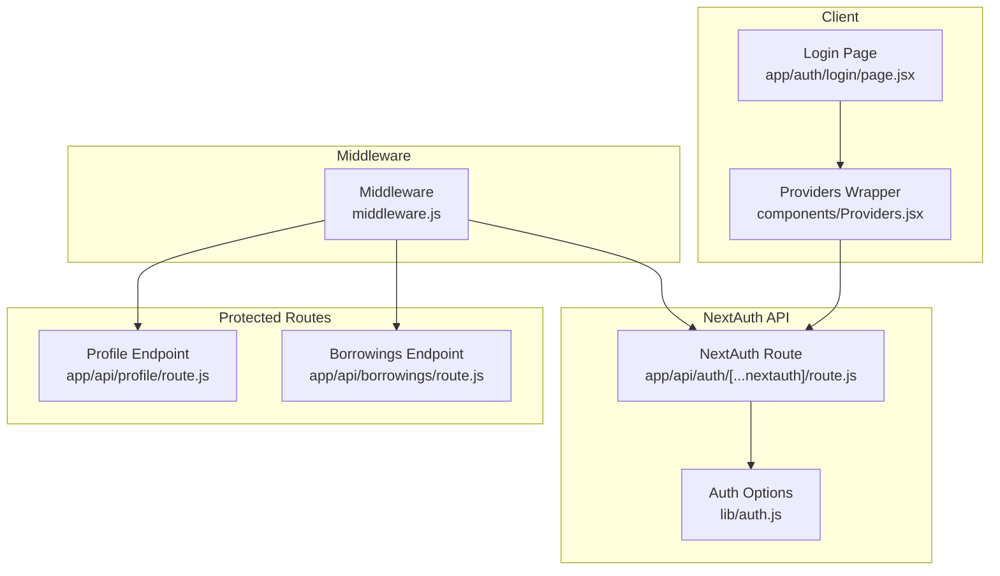
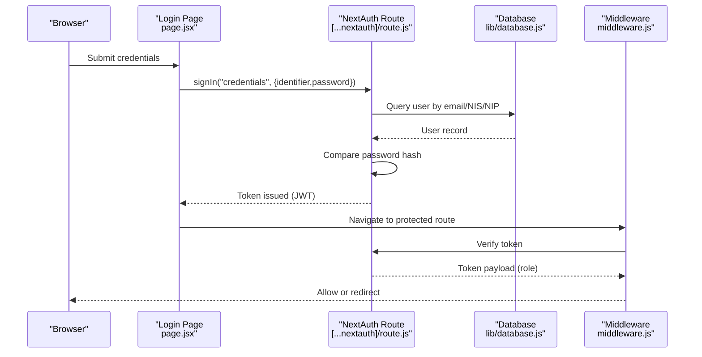
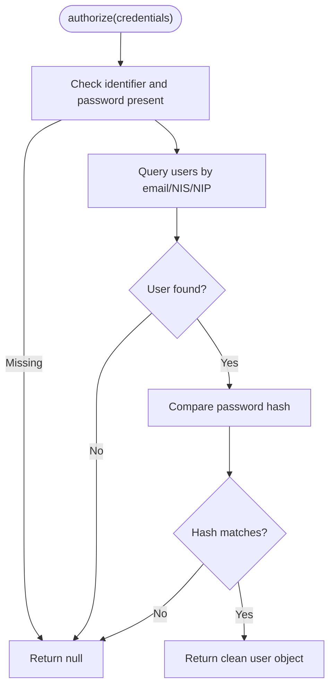
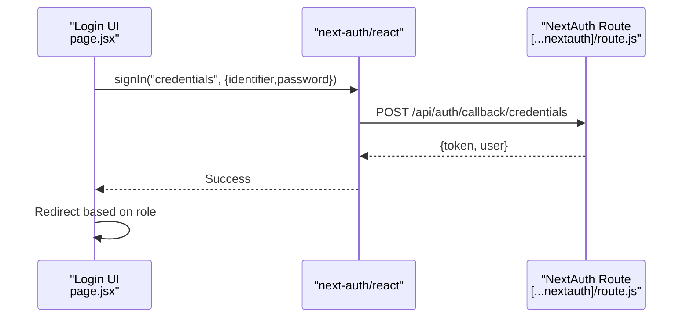
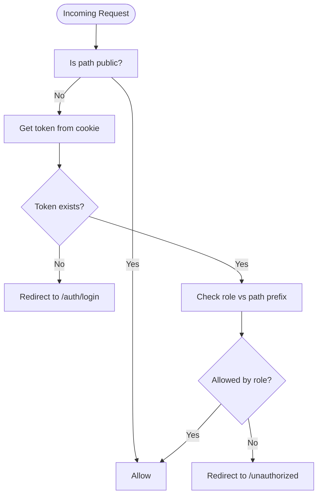
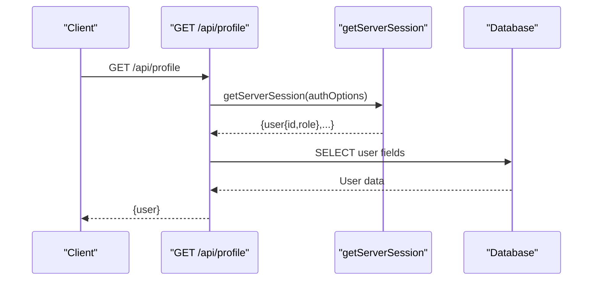
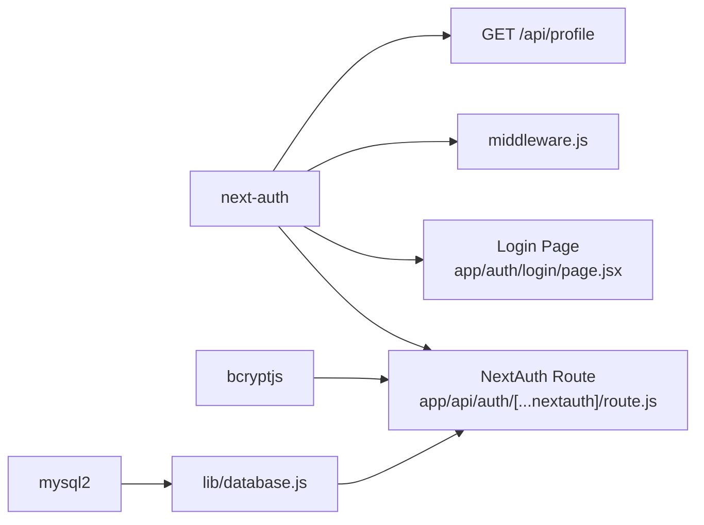

# Authentication API

<cite>
**Referenced Files in This Document**
- [route.js](file://app/api/auth/[...nextauth]/route.js)
- [auth.js](file://lib/auth.js)
- [middleware.js](file://middleware.js)
- [page.jsx](file://app/auth/login/page.jsx)
- [Providers.jsx](file://components/Providers.jsx)
- [layout.js](file://app/layout.js)
- [route.js](file://app/api/profile/route.js)
- [route.js](file://app/api/borrowings/route.js)
- [package.json](file://package.json)
- [database.js](file://lib/database.js)
</cite>

## Table of Contents
1. [Introduction](#introduction)
2. [Project Structure](#project-structure)
3. [Core Components](#core-components)
4. [Architecture Overview](#architecture-overview)
5. [Detailed Component Analysis](#detailed-component-analysis)
6. [Dependency Analysis](#dependency-analysis)
7. [Performance Considerations](#performance-considerations)
8. [Troubleshooting Guide](#troubleshooting-guide)
9. [Conclusion](#conclusion)

## Introduction
This document describes the authentication API built with NextAuth.js for the application. It covers the OAuth-like credentials-based login flow, session management via JWT, middleware-based role-based access control, and the server-side session retrieval endpoint. It also documents request/response schemas, token handling, session persistence, and security headers. Examples illustrate login, session verification, and logout procedures, along with integration patterns for protected routes.

## Project Structure
Authentication spans several areas:
- NextAuth.js configuration and provider logic under the API route for authentication
- Client-side login page using NextAuth React SDK
- Middleware enforcing authentication and role checks
- Server-side session retrieval endpoint
- Provider wrapper enabling client-side session awareness

**Diagram sources**
- [route.js:1-102](file://app/api/auth/[...nextauth]/route.js#L1-L102)
- [auth.js:1-77](file://lib/auth.js#L1-L77)
- [middleware.js:1-53](file://middleware.js#L1-L53)
- [page.jsx:1-110](file://app/auth/login/page.jsx#L1-L110)
- [Providers.jsx:1-14](file://components/Providers.jsx#L1-L14)
- [route.js:1-80](file://app/api/profile/route.js#L1-L80)
- [route.js:1-81](file://app/api/borrowings/route.js#L1-L81)

**Section sources**
- [route.js:1-102](file://app/api/auth/[...nextauth]/route.js#L1-L102)
- [auth.js:1-77](file://lib/auth.js#L1-L77)
- [middleware.js:1-53](file://middleware.js#L1-L53)
- [page.jsx:1-110](file://app/auth/login/page.jsx#L1-L110)
- [Providers.jsx:1-14](file://components/Providers.jsx#L1-L14)
- [layout.js:1-31](file://app/layout.js#L1-L31)
- [route.js:1-80](file://app/api/profile/route.js#L1-L80)
- [route.js:1-81](file://app/api/borrowings/route.js#L1-L81)

## Core Components
- NextAuth.js credentials provider with flexible identifier matching (email, NIS, NIP)
- JWT-based session strategy with callbacks enriching tokens and sessions
- Client-side session provider and login UI
- Middleware enforcing authentication and role-based routing
- Server-side session retrieval endpoint using getServerSession

Key capabilities:
- Credentials-based login with bcrypt password comparison
- JWT token storage in cookies by default (strategy: "jwt")
- Role-based access control enforced in middleware
- Protected endpoints validating session and role

**Section sources**
- [route.js:6-97](file://app/api/auth/[...nextauth]/route.js#L6-L97)
- [auth.js:6-75](file://lib/auth.js#L6-L75)
- [page.jsx:8-52](file://app/auth/login/page.jsx#L8-L52)
- [middleware.js:11-42](file://middleware.js#L11-L42)
- [route.js:7-21](file://app/api/profile/route.js#L7-L21)

## Architecture Overview
The authentication flow integrates client and server components:
- Client logs in via credentials provider
- NextAuth.js validates credentials against the database
- JWT token is created and stored
- Middleware enforces authentication and role checks
- Protected endpoints use getServerSession for server-side validation

**Diagram sources**
- [page.jsx:13-31](file://app/auth/login/page.jsx#L13-L31)
- [route.js:16-50](file://app/api/auth/[...nextauth]/route.js#L16-L50)
- [database.js:13-21](file://lib/database.js#L13-L21)
- [middleware.js:19-23](file://middleware.js#L19-L23)

## Detailed Component Analysis

### NextAuth.js Credentials Provider and Callbacks
- Provider accepts an identifier field supporting email, NIS, or NIP and a password
- authorize queries users across base table and related profiles, compares bcrypt hashes, and returns a clean user object
- JWT callback stores user fields in the token during sign-in and updates token on session update triggers
- Session callback ensures the session object always includes id, name, email, role, and avatar_url

**Diagram sources**
- [route.js:16-50](file://app/api/auth/[...nextauth]/route.js#L16-L50)

**Section sources**
- [route.js:6-97](file://app/api/auth/[...nextauth]/route.js#L6-L97)

### Session Management and Token Handling
- Session strategy is JWT
- Token includes id, name, email, role, avatar_url
- Session object mirrors token fields for client/server access
- Token refresh occurs implicitly on subsequent requests; explicit refresh is not implemented

Security considerations:
- Secret configured via NEXTAUTH_SECRET
- Cookies used by default for JWT transport (secure flags depend on deployment)

**Section sources**
- [route.js:54-97](file://app/api/auth/[...nextauth]/route.js#L54-L97)
- [auth.js:51-72](file://lib/auth.js#L51-L72)

### Client-Side Login Flow
- Uses next-auth/react signIn with credentials provider
- Handles errors and redirects to role-specific dashboards after successful login
- Fetches current session to determine role

**Diagram sources**
- [page.jsx:13-51](file://app/auth/login/page.jsx#L13-L51)
- [route.js:100-101](file://app/api/auth/[...nextauth]/route.js#L100-L101)

**Section sources**
- [page.jsx:8-52](file://app/auth/login/page.jsx#L8-L52)

### Middleware-Based Authentication and RBAC
- Protects routes by requiring a valid JWT token
- Enforces role-based access:
  - /admin requires role "admin"
  - /guru requires role "guru"
  - /siswa requires role "siswa"
- Public paths allowed: root, login, register, and /api/auth
- Unauthorized access to protected roles redirects to /unauthorized

**Diagram sources**
- [middleware.js:11-42](file://middleware.js#L11-L42)

**Section sources**
- [middleware.js:4-42](file://middleware.js#L4-L42)

### Server-Side Session Retrieval Endpoint
- GET /api/profile returns the current user’s profile data using getServerSession
- Requires authenticated session; otherwise returns 401 Unauthorized
- Uses shared authOptions for consistency

**Diagram sources**
- [route.js:7-21](file://app/api/profile/route.js#L7-L21)
- [route.js:6-97](file://app/api/auth/[...nextauth]/route.js#L6-L97)

**Section sources**
- [route.js:1-80](file://app/api/profile/route.js#L1-L80)

### Protected Endpoints Using Server Sessions
- Example: Borrowings endpoint validates session and role before processing requests
- Demonstrates consistent use of getServerSession and role checks

**Section sources**
- [route.js:8-17](file://app/api/borrowings/route.js#L8-L17)

### Client Session Provider Integration
- Providers wrapper enables useSession and related hooks across the app
- Ensures session state is available to client components

**Section sources**
- [Providers.jsx:6-12](file://components/Providers.jsx#L6-L12)
- [layout.js:20-26](file://app/layout.js#L20-L26)

## Dependency Analysis
External libraries and integrations:
- next-auth for authentication and session management
- bcryptjs for password hashing
- mysql2 for database connectivity
- react-hot-toast for client feedback

**Diagram sources**
- [package.json:11-33](file://package.json#L11-L33)
- [route.js:1-4](file://app/api/auth/[...nextauth]/route.js#L1-L4)
- [database.js:1-23](file://lib/database.js#L1-L23)
- [page.jsx:3-4](file://app/auth/login/page.jsx#L3-L4)
- [middleware.js](file://middleware.js#L1)
- [route.js:1-3](file://app/api/profile/route.js#L1-L3)

**Section sources**
- [package.json:11-33](file://package.json#L11-L33)

## Performance Considerations
- JWT strategy avoids server-side session storage overhead
- Password hashing uses bcrypt; consider cost factor tuning for environment
- Middleware performs token extraction per request; caching token state in client reduces repeated fetches
- Database queries use prepared statements to prevent injection

## Troubleshooting Guide
Common issues and resolutions:
- Login fails with incorrect credentials:
  - Ensure identifier and password are provided
  - Confirm bcrypt password comparison succeeds
- Unauthorized access errors:
  - Verify NEXTAUTH_SECRET is set
  - Ensure client is signed in and token is present
- Role mismatch:
  - Confirm user role stored in database matches expected role
  - Check middleware role checks align with route prefixes
- Session retrieval failures:
  - Confirm getServerSession receives the same authOptions used by the NextAuth route
- CORS and cookie issues:
  - Ensure deployment domain and cookie settings match environment (secure, sameSite flags)

**Section sources**
- [route.js:16-50](file://app/api/auth/[...nextauth]/route.js#L16-L50)
- [middleware.js:19-23](file://middleware.js#L19-L23)
- [route.js:9-10](file://app/api/profile/route.js#L9-L10)

## Conclusion
The authentication system leverages NextAuth.js with a credentials provider, JWT sessions, and middleware-driven RBAC. It provides a clear login flow, robust session management, and straightforward integration points for protected routes. By adhering to the documented schemas and patterns, developers can extend the system with additional providers, refine token handling, and maintain secure, role-aware access across the application.