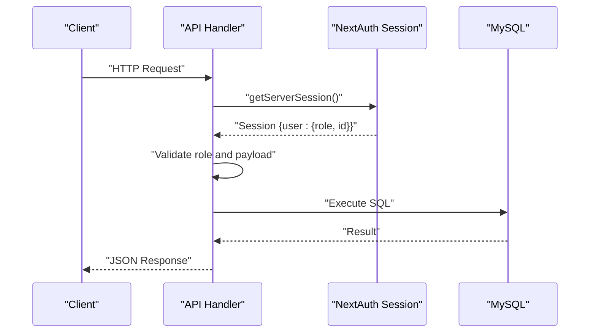
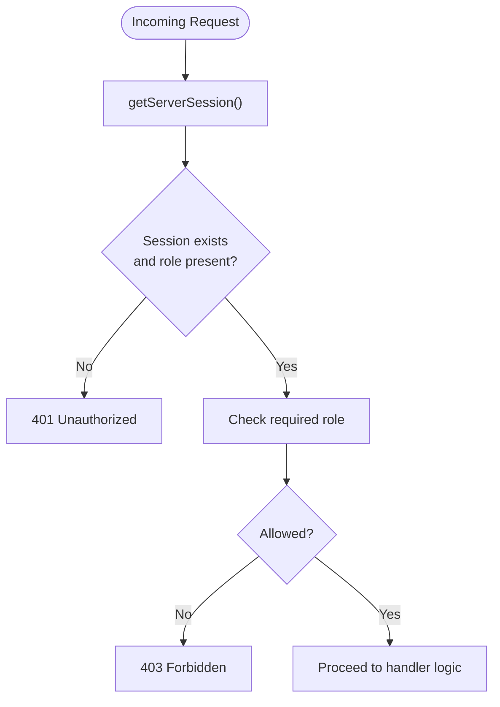
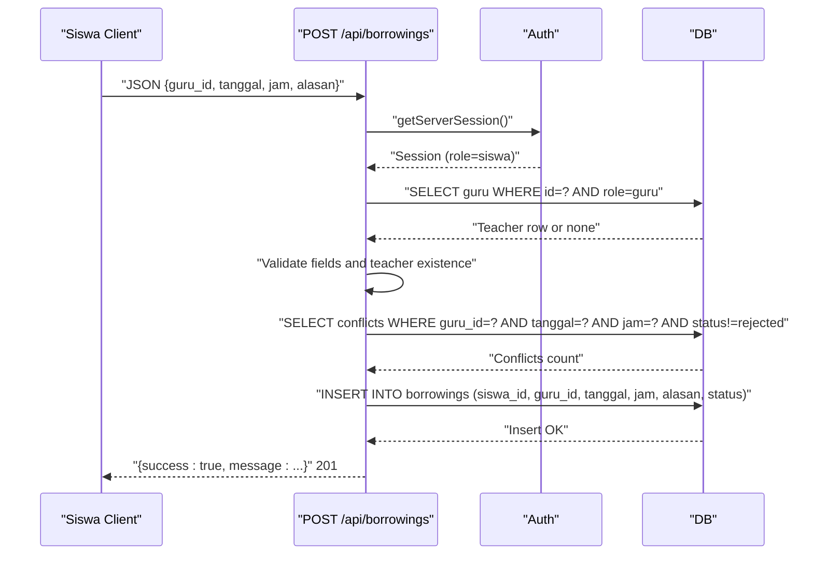
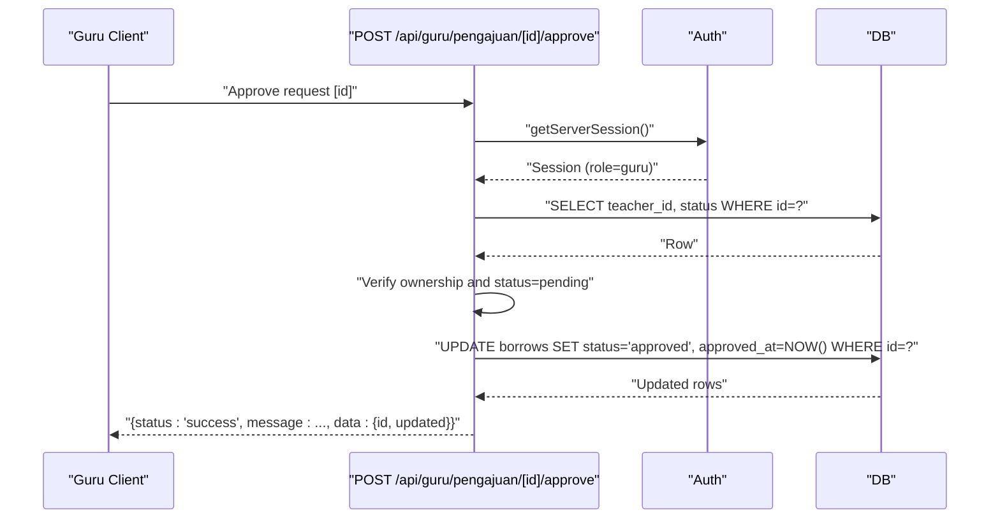
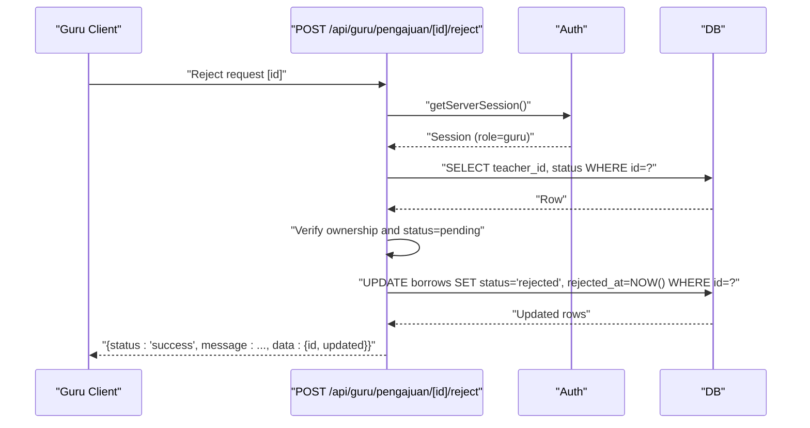
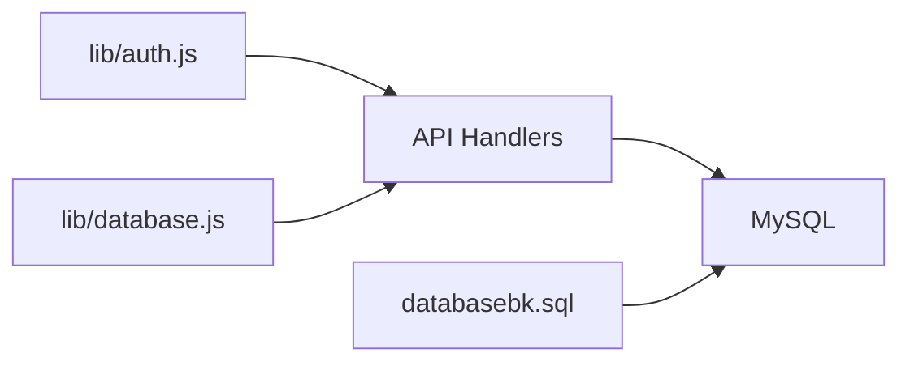

# Booking System API

<cite>
**Referenced Files in This Document**
- [route.js](file://app/api/borrowings/route.js)
- [route.js](file://app/api/borrowings/today/route.js)
- [route.js](file://app/api/borrowings/riwayat/route.js)
- [route.js](file://app/api/guru/pengajuan/[id]/approve/route.js)
- [route.js](file://app/api/guru/pengajuan/[id]/reject/route.js)
- [route.js](file://app/api/siswa/pengajuan/route.js)
- [auth.js](file://lib/auth.js)
- [database.js](file://lib/database.js)
- [databasebk.sql](file://databasebk.sql)
</cite>

## Table of Contents
1. [Introduction](#introduction)
2. [Project Structure](#project-structure)
3. [Core Components](#core-components)
4. [Architecture Overview](#architecture-overview)
5. [Detailed Component Analysis](#detailed-component-analysis)
6. [Dependency Analysis](#dependency-analysis)
7. [Performance Considerations](#performance-considerations)
8. [Troubleshooting Guide](#troubleshooting-guide)
9. [Conclusion](#conclusion)
10. [Appendices](#appendices)

## Introduction
This document provides comprehensive API documentation for the counseling booking system. It covers appointment request creation, approval/rejection workflows, today’s schedule retrieval, and booking history management. It specifies request/response schemas, authentication and role-based access control, permission validation, conflict detection, availability checks, scheduling constraints, examples, and pagination/filtering behavior.

## Project Structure
The API surface relevant to the booking system is organized under the Next.js app router. Key endpoints include:
- Student creates a booking request
- Teacher approves or rejects a pending request
- Teacher retrieves today’s schedule
- Student retrieves booking history

```mermaid
graph TB
subgraph "Client"
Siswa["Siswa"]
Guru["Guru"]
end
subgraph "API Routes"
Create["POST /api/borrowings"]
Approve["POST /api/guru/pengajuan/[id]/approve"]
Reject["POST /api/guru/pengajuan/[id]/reject"]
Today["GET /api/borrowings/today"]
History["GET /api/borrowings/riwayat"]
end
subgraph "Auth"
Auth["NextAuth Session"]
end
subgraph "Database"
DB["MySQL Pool"]
end
Siswa --> Create
Guru --> Approve
Guru --> Reject
Guru --> Today
Siswa --> History
Create --> Auth
Approve --> Auth
Reject --> Auth
Today --> Auth
History --> Auth
Create --> DB
Approve --> DB
Reject --> DB
Today --> DB
History --> DB
```

**Diagram sources**
- [route.js:1-81](file://app/api/borrowings/route.js#L1-L81)
- [route.js:1-73](file://app/api/guru/pengajuan/[id]/approve/route.js#L1-L73)
- [route.js:1-73](file://app/api/guru/pengajuan/[id]/reject/route.js#L1-L73)
- [route.js:1-45](file://app/api/borrowings/today/route.js#L1-L45)
- [route.js:1-38](file://app/api/borrowings/riwayat/route.js#L1-L38)
- [auth.js:1-77](file://lib/auth.js#L1-L77)
- [database.js:1-23](file://lib/database.js#L1-L23)

**Section sources**
- [route.js:1-81](file://app/api/borrowings/route.js#L1-L81)
- [route.js:1-73](file://app/api/guru/pengajuan/[id]/approve/route.js#L1-L73)
- [route.js:1-73](file://app/api/guru/pengajuan/[id]/reject/route.js#L1-L73)
- [route.js:1-45](file://app/api/borrowings/today/route.js#L1-L45)
- [route.js:1-38](file://app/api/borrowings/riwayat/route.js#L1-L38)
- [auth.js:1-77](file://lib/auth.js#L1-L77)
- [database.js:1-23](file://lib/database.js#L1-L23)

## Core Components
- Authentication and session management via NextAuth JWT strategy
- Role-based access control enforced per endpoint
- MySQL database with two relevant tables for bookings:
  - borrows: modern structured booking with richer fields
  - borrowings: legacy flat booking with date/time fields
- Conflict detection and availability checks during request creation

Key roles:
- siswa: can create booking requests and view history
- guru: can approve/reject pending requests and view today’s schedule
- admin: not covered by the endpoints documented here

**Section sources**
- [auth.js:1-77](file://lib/auth.js#L1-L77)
- [databasebk.sql:70-126](file://databasebk.sql#L70-L126)
- [route.js:1-81](file://app/api/borrowings/route.js#L1-L81)
- [route.js:1-79](file://app/api/siswa/pengajuan/route.js#L1-L79)

## Architecture Overview
The system uses a layered architecture:
- Presentation: Next.js app router API handlers
- Authentication: NextAuth with JWT callback injection of role
- Persistence: MySQL via a pooled connection manager
- Business logic: request validation, permission checks, conflict detection, and SQL queries



**Diagram sources**
- [auth.js:55-72](file://lib/auth.js#L55-L72)
- [route.js:8-17](file://app/api/borrowings/route.js#L8-L17)
- [database.js:13-21](file://lib/database.js#L13-L21)

## Detailed Component Analysis

### Authentication and Authorization
- Provider: Credentials provider with email/password
- Session strategy: JWT with role injected into token/session
- Access control: Role checked per endpoint; Unauthorized responses returned otherwise



**Diagram sources**
- [auth.js:14-44](file://lib/auth.js#L14-L44)
- [auth.js:55-72](file://lib/auth.js#L55-L72)
- [route.js:12-17](file://app/api/borrowings/route.js#L12-L17)

**Section sources**
- [auth.js:1-77](file://lib/auth.js#L1-L77)
- [route.js:8-17](file://app/api/borrowings/route.js#L8-L17)

### Endpoint: Create Booking Request (Student)
- Method: POST
- Path: /api/borrowings
- Purpose: Submit a counseling booking request
- Authentication: Required, role siswa
- Request body schema:
  - guru_id: integer (required)
  - tanggal: date string (YYYY-MM-DD) (required)
  - jam: time string (HH:mm:ss) (required)
  - alasan: text (required, trimmed)
- Validation:
  - All fields required
  - Target teacher must exist and be role guru
  - No existing pending booking for the same teacher
  - No conflicting booking at the same date/time for the teacher (excluding rejected)
- Response:
  - 201 Created on success
  - 400 Bad Request on missing fields
  - 401 Unauthorized if not authenticated or wrong role
  - 403 Forbidden if attempting to book self
  - 404 Not Found if teacher not found
  - 409 Conflict if teacher already booked at that slot
  - 500 Internal Server Error on failure



**Diagram sources**
- [route.js:8-71](file://app/api/borrowings/route.js#L8-L71)
- [database.js:13-21](file://lib/database.js#L13-L21)

**Section sources**
- [route.js:8-71](file://app/api/borrowings/route.js#L8-L71)

### Endpoint: Approve Booking Request (Teacher)
- Method: POST
- Path: /api/guru/pengajuan/[id]/approve
- Purpose: Approve a pending booking request assigned to the authenticated teacher
- Authentication: Required, role guru
- Permissions:
  - Request must belong to the logged-in teacher
  - Status must be pending
- Response:
  - 200 OK on success with affected flag
  - 401 Unauthorized if not authenticated or wrong role
  - 403 Forbidden if not owner of the request
  - 404 Not Found if request does not exist
  - 400 Bad Request if not pending
  - 500 Internal Server Error on failure



**Diagram sources**
- [route.js:7-66](file://app/api/guru/pengajuan/[id]/approve/route.js#L7-L66)
- [database.js:13-21](file://lib/database.js#L13-L21)

**Section sources**
- [route.js:7-66](file://app/api/guru/pengajuan/[id]/approve/route.js#L7-L66)

### Endpoint: Reject Booking Request (Teacher)
- Method: POST
- Path: /api/guru/pengajuan/[id]/reject
- Purpose: Reject a pending booking request assigned to the authenticated teacher
- Authentication: Required, role guru
- Permissions:
  - Request must belong to the logged-in teacher
  - Status must be pending
- Response:
  - 200 OK on success with affected flag
  - 401 Unauthorized if not authenticated or wrong role
  - 403 Forbidden if not owner of the request
  - 404 Not Found if request does not exist
  - 400 Bad Request if not pending
  - 500 Internal Server Error on failure



**Diagram sources**
- [route.js:7-66](file://app/api/guru/pengajuan/[id]/reject/route.js#L7-L66)
- [database.js:13-21](file://lib/database.js#L13-L21)

**Section sources**
- [route.js:7-66](file://app/api/guru/pengajuan/[id]/reject/route.js#L7-L66)

### Endpoint: Today’s Schedule (Teacher)
- Method: GET
- Path: /api/borrowings/today
- Purpose: Retrieve all bookings for the authenticated teacher for the current calendar day
- Authentication: Required, role guru
- Filtering:
  - Matches guru_id and date=today (local date)
- Response:
  - 200 OK with array of booking records
  - 401 Unauthorized if not authenticated or wrong role
  - 500 Internal Server Error on failure

Response record fields:
- id: integer
- tanggal: date
- jam: time
- alasan: text
- status: enum pending, approved, rejected, completed
- created_at: timestamp
- siswa_name: string
- siswa_nis: string
- kelas_nama: string

Notes:
- Pagination: Not implemented; returns all matches ordered by time ascending
- Filtering parameters: None beyond date; teacher ID is implicit from session

**Section sources**
- [route.js:7-37](file://app/api/borrowings/today/route.js#L7-L37)

### Endpoint: Booking History (Student)
- Method: GET
- Path: /api/borrowings/riwayat
- Purpose: Retrieve booking history for the authenticated student
- Authentication: Required, role siswa
- Sorting:
  - Ordered by created_at descending
- Response:
  - 200 OK with array of booking records
  - 401 Unauthorized if not authenticated or wrong role
  - 500 Internal Server Error on failure

Response record fields:
- id: integer
- tanggal: date
- jam: time
- alasan: text
- status: enum pending, approved, rejected, completed
- created_at: timestamp
- guru_name: string

Notes:
- Pagination: Not implemented; returns all historical records
- Filtering parameters: None; student ID is implicit from session

**Section sources**
- [route.js:7-30](file://app/api/borrowings/riwayat/route.js#L7-L30)

### Alternative Modern Booking API (Student)
There is also a modern borrows table with richer fields. The student submission endpoint for this model is:
- Method: POST
- Path: /api/siswa/pengajuan
- Purpose: Submit a structured counseling request using the borrows table
- Authentication: Required, role siswa
- Validation:
  - teacher_id must exist and be role guru
  - No pending request exists for the student
- Response:
  - 201 Created on success
  - 400 Bad Request on missing fields
  - 401 Unauthorized if not authenticated or wrong role
  - 403 Forbidden if attempting to book self
  - 404 Not Found if teacher not found
  - 409 Conflict if pending request exists
  - 500 Internal Server Error on failure

**Section sources**
- [route.js:7-78](file://app/api/siswa/pengajuan/route.js#L7-L78)

## Dependency Analysis
- Authentication depends on NextAuth with a credentials provider and JWT session strategy
- Handlers depend on a shared database client that wraps mysql2/promise with a convenience query function
- Handlers enforce role-based access control and perform validation prior to SQL execution
- Database schema supports both legacy and modern booking models



**Diagram sources**
- [auth.js:1-77](file://lib/auth.js#L1-L77)
- [database.js:1-23](file://lib/database.js#L1-L23)
- [databasebk.sql:70-126](file://databasebk.sql#L70-L126)

**Section sources**
- [auth.js:1-77](file://lib/auth.js#L1-L77)
- [database.js:1-23](file://lib/database.js#L1-L23)
- [databasebk.sql:70-126](file://databasebk.sql#L70-L126)

## Performance Considerations
- Indexes exist on users(role), borrowings(guru_id), borrowings(siswa_id), and borrows indices to support lookups and joins
- Queries use equality filters and ordering; consider adding composite indexes if frequently filtered by (teacher_id, date) or (student_id, status)
- Current endpoints return full lists without pagination; for large datasets, introduce limit/offset or cursor-based pagination

[No sources needed since this section provides general guidance]

## Troubleshooting Guide
Common errors and resolutions:
- 401 Unauthorized
  - Cause: Missing or invalid session
  - Resolution: Ensure credentials are correct and session established
- 403 Forbidden
  - Cause: Attempting to approve/reject a request not assigned to the teacher
  - Resolution: Verify ownership of the request
- 404 Not Found
  - Cause: Request ID does not exist
  - Resolution: Confirm request ID and existence
- 409 Conflict
  - Cause: Pending request exists (student) or time slot conflict (teacher)
  - Resolution: Wait for resolution or choose another slot
- 500 Internal Server Error
  - Cause: Database or server error
  - Resolution: Check server logs and retry

**Section sources**
- [route.js:36-41](file://app/api/borrowings/route.js#L36-L41)
- [route.js:54-59](file://app/api/borrowings/route.js#L54-L59)
- [route.js:42-52](file://app/api/siswa/pengajuan/route.js#L42-L52)
- [route.js:28-47](file://app/api/guru/pengajuan/[id]/approve/route.js#L28-L47)
- [route.js:28-47](file://app/api/guru/pengajuan/[id]/reject/route.js#L28-L47)

## Conclusion
The booking system provides a clear, role-based API for students to request counseling and for teachers to manage those requests. It enforces authentication, validates inputs, prevents conflicts, and exposes schedule and history endpoints. Future enhancements could include pagination, richer filtering, and expanded scheduling fields aligned with the modern borrows table.

[No sources needed since this section summarizes without analyzing specific files]

## Appendices

### Request/Response Schemas

- Create Booking Request (Legacy)
  - Request: { guru_id: number, tanggal: string, jam: string, alasan: string }
  - Response (success): { success: boolean, message: string }
  - Response (conflict): { error: string }

- Approve/Reject Booking Request
  - Request: none (uses path param id)
  - Response (success): { status: string, message: string, data: { id: number, updated: boolean } }

- Today’s Schedule
  - Response: { data: Array<{ id, tanggal, jam, alasan, status, created_at, siswa_name, siswa_nis, kelas_nama }> }

- Booking History
  - Response: { data: Array<{ id, tanggal, jam, alasan, status, created_at, guru_name }> }

- Modern Student Booking (borrows)
  - Request: { teacher_id: number, reason: string }
  - Response (success): { success: boolean, message: string }

**Section sources**
- [route.js:19-28](file://app/api/borrowings/route.js#L19-L28)
- [route.js:68-71](file://app/api/borrowings/route.js#L68-L71)
- [route.js:59-66](file://app/api/guru/pengajuan/[id]/approve/route.js#L59-L66)
- [route.js:59-66](file://app/api/guru/pengajuan/[id]/reject/route.js#L59-L66)
- [route.js:17-37](file://app/api/borrowings/today/route.js#L17-L37)
- [route.js:14-28](file://app/api/borrowings/riwayat/route.js#L14-L28)
- [route.js:18-26](file://app/api/siswa/pengajuan/route.js#L18-L26)
- [route.js:63-66](file://app/api/siswa/pengajuan/route.js#L63-L66)

### Authentication and Roles
- Roles: admin, guru, siswa
- Session includes role; handlers check role per endpoint
- Login uses credentials provider with bcrypt-compare

**Section sources**
- [auth.js:14-44](file://lib/auth.js#L14-L44)
- [auth.js:55-72](file://lib/auth.js#L55-L72)
- [databasebk.sql:22-35](file://databasebk.sql#L22-L35)

### Conflict Detection and Availability Checking
- Student creation:
  - Confirms target teacher exists and is role guru
  - Prevents multiple pending requests per student
  - Checks for conflicts at same date/time for the teacher (excluding rejected)
- Approval/Rejection:
  - Ensures request belongs to the teacher and status is pending

**Section sources**
- [route.js:30-41](file://app/api/borrowings/route.js#L30-L41)
- [route.js:43-59](file://app/api/borrowings/route.js#L43-L59)
- [route.js:30-42](file://app/api/siswa/pengajuan/route.js#L30-L42)
- [route.js:18-47](file://app/api/guru/pengajuan/[id]/approve/route.js#L18-L47)
- [route.js:18-47](file://app/api/guru/pengajuan/[id]/reject/route.js#L18-L47)

### Examples

- Create Booking Request
  - Method: POST /api/borrowings
  - Body: { guru_id: 5, tanggal: "2025-06-15", jam: "14:30:00", alasan: "Counseling needed" }
  - Expected: 201 Created

- Approve Booking Request
  - Method: POST /api/guru/pengajuan/[id]/approve
  - Path: /api/guru/pengajuan/123/approve
  - Expected: 200 OK with updated flag

- Reject Booking Request
  - Method: POST /api/guru/pengajuan/[id]/reject
  - Path: /api/guru/pengajuan/123/reject
  - Expected: 200 OK with updated flag

- Today’s Schedule
  - Method: GET /api/borrowings/today
  - Expected: 200 OK with today’s bookings

- Booking History
  - Method: GET /api/borrowings/riwayat
  - Expected: 200 OK with historical bookings

**Section sources**
- [route.js:8-71](file://app/api/borrowings/route.js#L8-L71)
- [route.js:7-66](file://app/api/guru/pengajuan/[id]/approve/route.js#L7-L66)
- [route.js:7-66](file://app/api/guru/pengajuan/[id]/reject/route.js#L7-L66)
- [route.js:7-37](file://app/api/borrowings/today/route.js#L7-L37)
- [route.js:7-30](file://app/api/borrowings/riwayat/route.js#L7-L30)