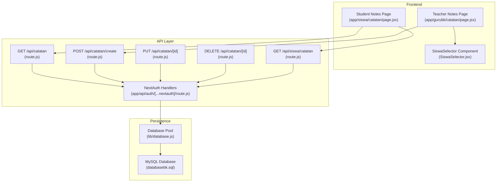
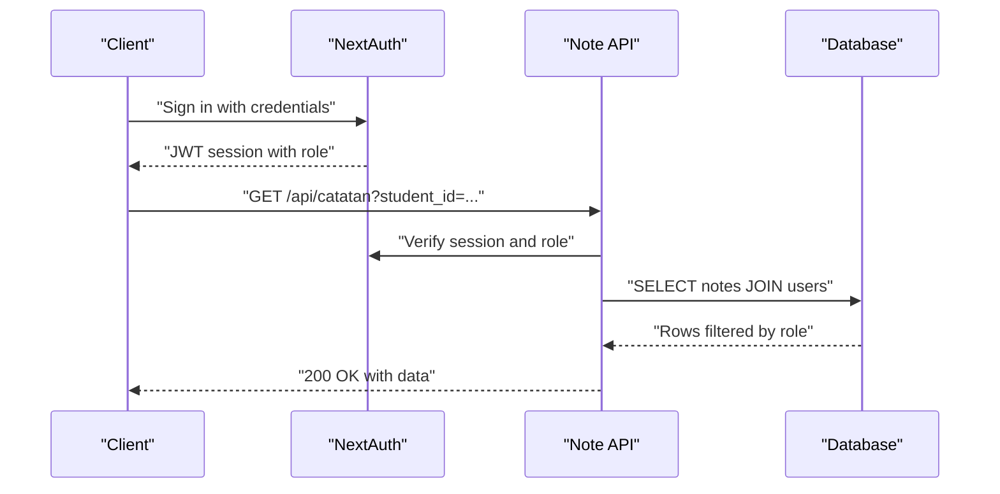
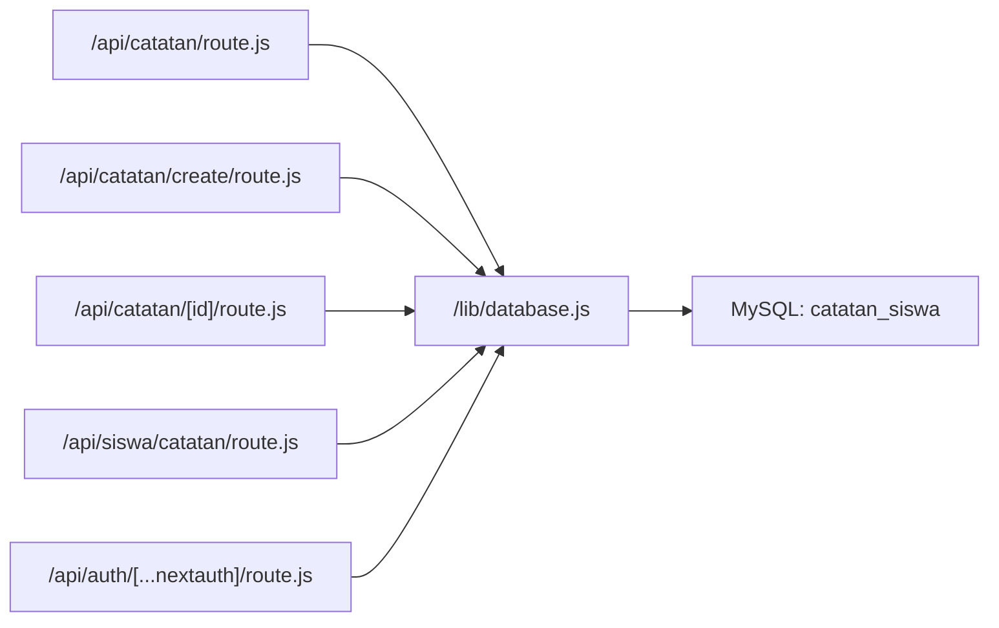

# Note Management API

<cite>
**Referenced Files in This Document**
- [route.js](file://app/api/catatan/route.js)
- [route.js](file://app/api/catatan/create/route.js)
- [route.js](file://app/api/catatan/[id]/route.js)
- [route.js](file://app/api/siswa/catatan/route.js)
- [route.js](file://app/api/auth/[...nextauth]/route.js)
- [auth.js](file://lib/auth.js)
- [database.js](file://lib/database.js)
- [page.jsx](file://app/gurubk/catatan/page.jsx)
- [SiswaSelector.jsx](file://app/gurubk/catatan/components/SiswaSelector.jsx)
- [page.jsx](file://app/siswa/catatan/page.jsx)
- [databasebk.sql](file://databasebk.sql)
</cite>

## Table of Contents
1. [Introduction](#introduction)
2. [Project Structure](#project-structure)
3. [Core Components](#core-components)
4. [Architecture Overview](#architecture-overview)
5. [Detailed Component Analysis](#detailed-component-analysis)
6. [Dependency Analysis](#dependency-analysis)
7. [Performance Considerations](#performance-considerations)
8. [Troubleshooting Guide](#troubleshooting-guide)
9. [Conclusion](#conclusion)

## Introduction
This document describes the Note Management API used for student progress tracking. It covers endpoints for creating, retrieving, updating, and deleting notes, along with authentication, role-based access control, categorization, and audit considerations. It also documents the frontend flows for note creation and viewing, and outlines current limitations such as lack of built-in search and versioning.

## Project Structure
The note management system consists of:
- API routes under `/app/api/catatan` for CRUD operations
- Authentication via NextAuth with JWT sessions
- Database schema for storing notes and related entities
- Frontend pages for teachers and students to create and view notes

**Diagram sources**
- [route.js:1-49](file://app/api/catatan/route.js#L1-L49)
- [route.js:1-24](file://app/api/catatan/create/route.js#L1-L24)
- [route.js:1-45](file://app/api/catatan/[id]/route.js#L1-L45)
- [route.js:1-38](file://app/api/siswa/catatan/route.js#L1-L38)
- [route.js:1-101](file://app/api/auth/[...nextauth]/route.js#L1-L101)
- [database.js:1-23](file://lib/database.js#L1-L23)
- [databasebk.sql:127-140](file://databasebk.sql#L127-L140)
- [page.jsx:1-128](file://app/gurubk/catatan/page.jsx#L1-L128)
- [page.jsx:1-41](file://app/siswa/catatan/page.jsx#L1-L41)
- [SiswaSelector.jsx:1-78](file://app/gurubk/catatan/components/SiswaSelector.jsx#L1-L78)

**Section sources**
- [route.js:1-49](file://app/api/catatan/route.js#L1-L49)
- [route.js:1-24](file://app/api/catatan/create/route.js#L1-L24)
- [route.js:1-45](file://app/api/catatan/[id]/route.js#L1-L45)
- [route.js:1-38](file://app/api/siswa/catatan/route.js#L1-L38)
- [route.js:1-101](file://app/api/auth/[...nextauth]/route.js#L1-L101)
- [database.js:1-23](file://lib/database.js#L1-L23)
- [databasebk.sql:127-140](file://databasebk.sql#L127-L140)
- [page.jsx:1-128](file://app/gurubk/catatan/page.jsx#L1-L128)
- [page.jsx:1-41](file://app/siswa/catatan/page.jsx#L1-L41)
- [SiswaSelector.jsx:1-78](file://app/gurubk/catatan/components/SiswaSelector.jsx#L1-L78)

## Core Components
- Authentication and Session Management
  - Uses NextAuth with JWT strategy and credentials provider
  - Session includes role-based claims for access control
- Database Access
  - MySQL via mysql2/promise pool
  - Centralized query wrapper for consistent error handling
- Note Storage Schema
  - Table supports student_id, teacher_id, title, content, category, timestamps

Key implementation references:
- Authentication configuration and callbacks
  - [route.js:6-96](file://app/api/auth/[...nextauth]/route.js#L6-L96)
  - [auth.js:6-77](file://lib/auth.js#L6-L77)
- Database pool and query helper
  - [database.js:1-23](file://lib/database.js#L1-L23)
- Note schema definition
  - [databasebk.sql:127-140](file://databasebk.sql#L127-L140)

**Section sources**
- [route.js:6-96](file://app/api/auth/[...nextauth]/route.js#L6-L96)
- [auth.js:6-77](file://lib/auth.js#L6-L77)
- [database.js:1-23](file://lib/database.js#L1-L23)
- [databasebk.sql:127-140](file://databasebk.sql#L127-L140)

## Architecture Overview
The system enforces role-based access control at the API level:
- Students can only view their own notes
- Teachers (BK) can create notes for selected students and update/delete their own notes
- Admins are supported by the user role model but not directly used in note endpoints

**Diagram sources**
- [route.js:5-48](file://app/api/catatan/route.js#L5-L48)
- [route.js:16-49](file://app/api/auth/[...nextauth]/route.js#L16-L49)

**Section sources**
- [route.js:5-48](file://app/api/catatan/route.js#L5-L48)
- [route.js:16-49](file://app/api/auth/[...nextauth]/route.js#L16-L49)

## Detailed Component Analysis

### Authentication and Authorization
- Provider: Credentials with flexible identifier (email/NIS/NIP)
- Session strategy: JWT with role claim propagated to session
- Unauthorized responses return 401 with error message

Implementation highlights:
- [route.js:16-49](file://app/api/auth/[...nextauth]/route.js#L16-L49)
- [auth.js:55-72](file://lib/auth.js#L55-L72)

**Section sources**
- [route.js:16-49](file://app/api/auth/[...nextauth]/route.js#L16-L49)
- [auth.js:55-72](file://lib/auth.js#L55-L72)

### Note Listing (All Users)
- Endpoint: GET /api/catatan
- Query parameters:
  - student_id (optional): filters notes by a specific student
- Role restrictions:
  - Student: sees only their own notes
  - Teacher: sees their own notes; optionally filtered by student_id
- Response: success flag and data array of notes with teacher name

Request
- Method: GET
- URL: /api/catatan
- Query parameters:
  - student_id (optional)

Response
- 200 OK: { success: true, data: [note...] }
- 401 Unauthorized: { error: "Unauthorized" }
- 500 Server Error: { error: "Server Error" }

Access control logic
- Student: WHERE student_id = current_user_id
- Teacher: WHERE teacher_id = current_user_id AND (student_id = ? if provided)

**Section sources**
- [route.js:5-48](file://app/api/catatan/route.js#L5-L48)

### Note Creation
- Endpoint: POST /api/catatan/create
- Request body fields:
  - student_id: target student
  - teacher_id: creator (teacher)
  - judul: title
  - isi: content
  - kategori: category
- Response: { success: true } on success

Request
- Method: POST
- URL: /api/catatan/create
- Content-Type: application/json
- Body: { student_id, teacher_id, judul, isi, kategori }

Response
- 200 OK: { success: true }
- 500 Internal Server Error: { success: false, message: "Internal Server Error" }

Frontend flow (teacher)
- Select student via SiswaSelector
- Submit form to create endpoint
- Clear form on success

**Section sources**
- [route.js:4-23](file://app/api/catatan/create/route.js#L4-L23)
- [page.jsx:15-43](file://app/gurubk/catatan/page.jsx#L15-L43)
- [SiswaSelector.jsx:8-42](file://app/gurubk/catatan/components/SiswaSelector.jsx#L8-L42)

### Note Retrieval by Student
- Endpoint: GET /api/siswa/catatan
- Role restriction: Student only
- Response: { catatan: [note...] }

Request
- Method: GET
- URL: /api/siswa/catatan

Response
- 200 OK: { catatan: [note...] }
- 401 Unauthorized: { error: "Unauthorized" }
- 500 Server Error: { error: "Server error" }

**Section sources**
- [route.js:5-37](file://app/api/siswa/catatan/route.js#L5-L37)

### Note Update and Deletion
- Endpoint: PUT /api/catatan/[id] and DELETE /api/catatan/[id]
- Role restriction: Teacher only
- Update requires: judul, isi, kategori
- Delete removes the note by ID and teacher ownership check

Request (Update)
- Method: PUT
- URL: /api/catatan/[id]
- Content-Type: application/json
- Body: { judul, isi, kategori }

Response (Update)
- 200 OK: { success: true, message: "Catatan diperbarui" }
- 401 Unauthorized: { error: "Unauthorized" }
- 500 Server Error: { error: "Server error" }

Request (Delete)
- Method: DELETE
- URL: /api/catatan/[id]

Response (Delete)
- 200 OK: { success: true, message: "Catatan dihapus" }
- 401 Unauthorized: { error: "Unauthorized" }
- 500 Server Error: { error: "Server error" }

**Section sources**
- [route.js:5-44](file://app/api/catatan/[id]/route.js#L5-L44)

### Data Model and Categories
- Table: catatan_siswa
- Fields:
  - id, student_id, teacher_id, judul, isi, kategori, created_at, updated_at
- Categories observed in UI:
  - pribadi, perilaku, kehadiran, akademik, lainnya

**Section sources**
- [databasebk.sql:127-140](file://databasebk.sql#L127-L140)
- [page.jsx:102-114](file://app/gurubk/catatan/page.jsx#L102-L114)

### Search Capabilities
- No dedicated note search endpoint exists in the current codebase
- Students can be searched via a separate endpoint used by the teacher UI
  - [SiswaSelector.jsx:17-36](file://app/gurubk/catatan/components/SiswaSelector.jsx#L17-L36)

**Section sources**
- [SiswaSelector.jsx:17-36](file://app/gurubk/catatan/components/SiswaSelector.jsx#L17-L36)

### Attachments and Formatting
- No file attachment handling is present in the note endpoints
- Content is stored as plain text (isi field)
- No rich text formatting is enforced or processed

**Section sources**
- [route.js:7-13](file://app/api/catatan/create/route.js#L7-L13)
- [databasebk.sql:378-384](file://databasebk.sql#L378-L384)

### Audit Trail and Versioning
- No explicit audit log table is queried by note endpoints
- No note version history is maintained in the current schema
- The existing audit_log table is not used by note APIs

**Section sources**
- [databasebk.sql:171-183](file://databasebk.sql#L171-L183)
- [route.js:15-41](file://app/api/catatan/route.js#L15-L41)

## Dependency Analysis

**Diagram sources**
- [route.js:1-3](file://app/api/catatan/route.js#L1-L3)
- [route.js:2-2](file://app/api/catatan/create/route.js#L2-L2)
- [route.js:1-3](file://app/api/catatan/[id]/route.js#L1-L3)
- [route.js:1-3](file://app/api/siswa/catatan/route.js#L1-L3)
- [route.js:1-4](file://app/api/auth/[...nextauth]/route.js#L1-L4)
- [database.js:1-11](file://lib/database.js#L1-L11)
- [databasebk.sql:127-140](file://databasebk.sql#L127-L140)

**Section sources**
- [route.js:1-3](file://app/api/catatan/route.js#L1-L3)
- [route.js:2-2](file://app/api/catatan/create/route.js#L2-L2)
- [route.js:1-3](file://app/api/catatan/[id]/route.js#L1-L3)
- [route.js:1-3](file://app/api/siswa/catatan/route.js#L1-L3)
- [route.js:1-4](file://app/api/auth/[...nextauth]/route.js#L1-L4)
- [database.js:1-11](file://lib/database.js#L1-L11)
- [databasebk.sql:127-140](file://databasebk.sql#L127-L140)

## Performance Considerations
- Database pooling is configured with connection limits; ensure concurrent requests are bounded
- Queries join users to fetch teacher names; consider indexing foreign keys for performance
- Sorting by created_at desc is applied in listing queries

Recommendations:
- Add indexes on catatan_siswa.student_id and catatan_siswa.teacher_id if not present
- Consider pagination for listing endpoints when data grows large

**Section sources**
- [database.js:3-11](file://lib/database.js#L3-L11)
- [databasebk.sql:199-211](file://databasebk.sql#L199-L211)
- [route.js:39-39](file://app/api/catatan/route.js#L39-L39)

## Troubleshooting Guide
Common issues and resolutions:
- Unauthorized Access
  - Ensure the user is authenticated and role claim is present in the session
  - Verify NextAuth callbacks propagate role to session
  - References:
    - [route.js:77-88](file://app/api/auth/[...nextauth]/route.js#L77-L88)
    - [route.js:8-10](file://app/api/catatan/route.js#L8-L10)
- Missing or Invalid Request Body
  - Confirm POST body includes required fields for note creation
  - Reference: [route.js:7-13](file://app/api/catatan/create/route.js#L7-L13)
- Database Errors
  - Inspect centralized query wrapper for thrown errors
  - Reference: [database.js:17-20](file://lib/database.js#L17-L20)
- CORS and Environment Variables
  - Ensure NEXTAUTH_SECRET and database credentials are set
  - Reference: [route.js:95-95](file://app/api/auth/[...nextauth]/route.js#L95-L95), [database.js:3-11](file://lib/database.js#L3-L11)

**Section sources**
- [route.js:77-88](file://app/api/auth/[...nextauth]/route.js#L77-L88)
- [route.js:8-10](file://app/api/catatan/route.js#L8-L10)
- [route.js:7-13](file://app/api/catatan/create/route.js#L7-L13)
- [database.js:17-20](file://lib/database.js#L17-L20)
- [route.js:95-95](file://app/api/auth/[...nextauth]/route.js#L95-L95)

## Conclusion
The Note Management API provides a focused set of endpoints for creating, listing, and managing student notes with role-based access control. While it currently lacks search, attachments, rich formatting, and audit/versioning, it offers a solid foundation that can be extended to support those features as requirements evolve.