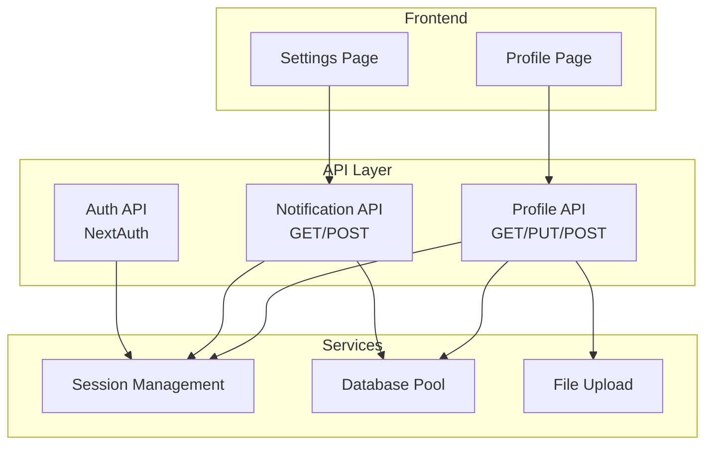
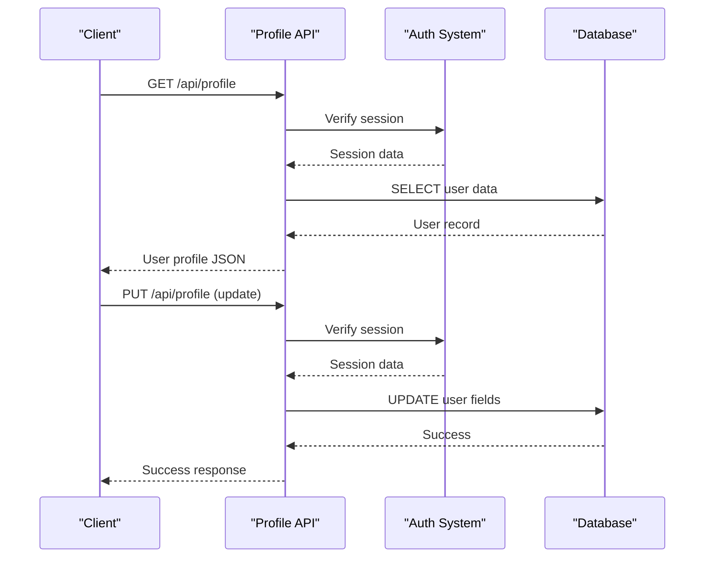
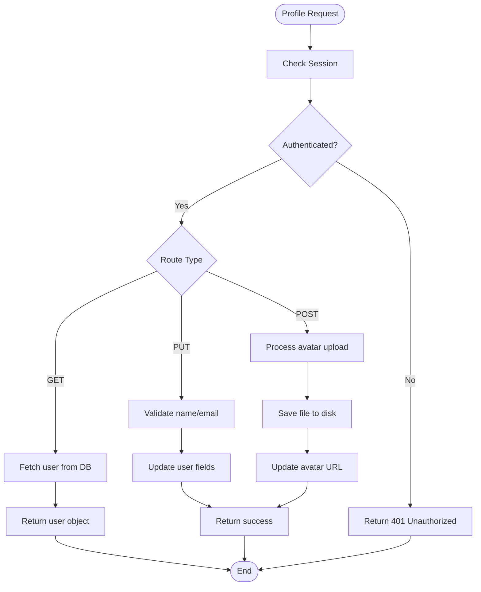
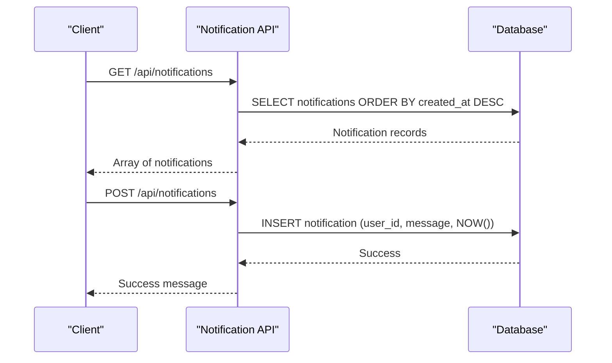
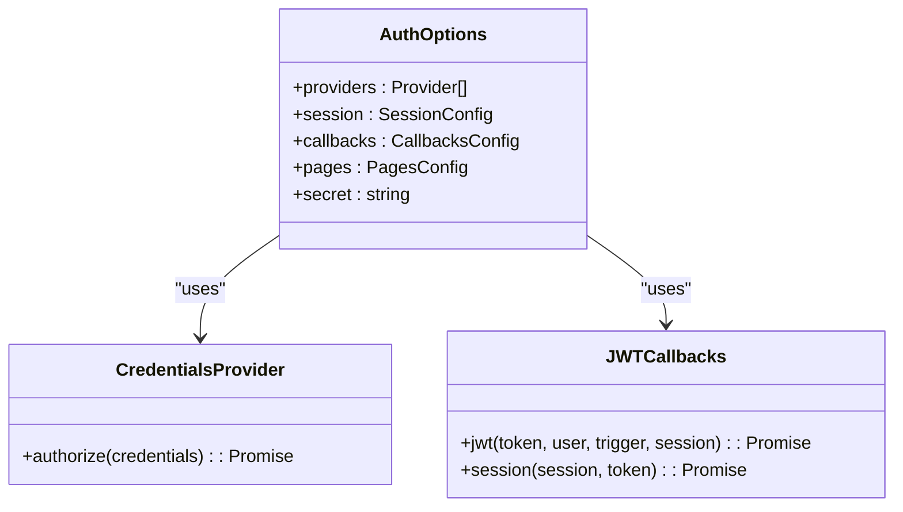
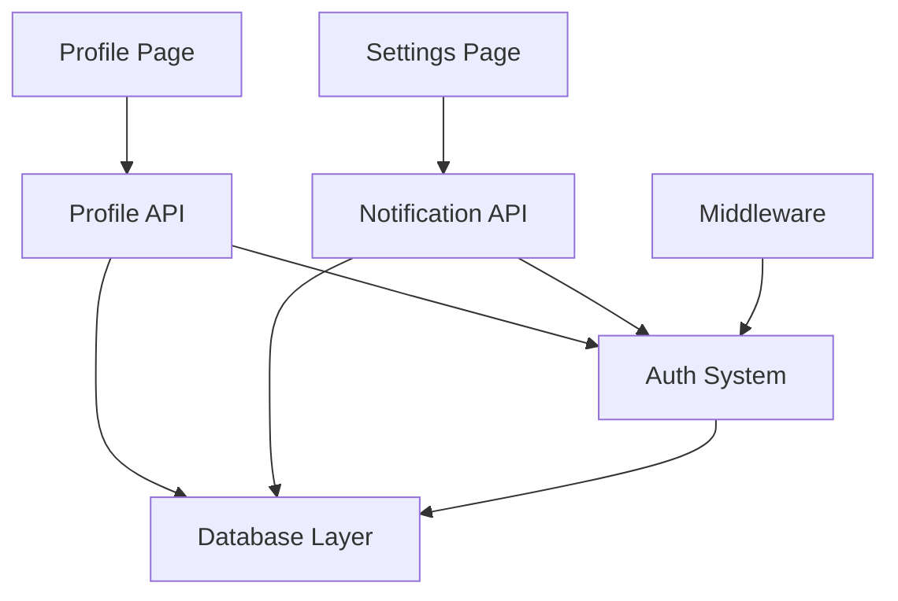

# Profile & Notifications API

<cite>
**Referenced Files in This Document**
- [app/api/profile/route.js](file://app/api/profile/route.js)
- [app/api/notifications/route.js](file://app/api/notifications/route.js)
- [lib/auth.js](file://lib/auth.js)
- [lib/database.js](file://lib/database.js)
- [app/api/auth/[...nextauth]/route.js](file://app/api/auth/[...nextauth]/route.js)
- [databasebk.sql](file://databasebk.sql)
- [app/profile/page.jsx](file://app/profile/page.jsx)
- [app/settings/page.jsx](file://app/settings/page.jsx)
- [middleware.js](file://middleware.js)
- [package.json](file://package.json)
</cite>

## Table of Contents
1. [Introduction](#introduction)
2. [Project Structure](#project-structure)
3. [Core Components](#core-components)
4. [Architecture Overview](#architecture-overview)
5. [Detailed Component Analysis](#detailed-component-analysis)
6. [Dependency Analysis](#dependency-analysis)
7. [Performance Considerations](#performance-considerations)
8. [Troubleshooting Guide](#troubleshooting-guide)
9. [Conclusion](#conclusion)
10. [Appendices](#appendices)

## Introduction
This document provides comprehensive API documentation for user profile management and notification services. It covers profile update operations, user information retrieval, and notification management endpoints. The documentation specifies request/response schemas, authentication requirements, validation rules, and subscription management capabilities. It also documents notification types, delivery channels, and user preference settings, along with examples for profile updates, notification subscriptions, and retrieval. Additional topics include notification scheduling, batch processing, and delivery status tracking.

## Project Structure
The API endpoints are organized under the Next.js App Router structure:
- Profile management: `/app/api/profile/route.js`
- Notification management: `/app/api/notifications/route.js`
- Authentication: `/app/api/auth/[...nextauth]/route.js` and `/lib/auth.js`
- Database abstraction: `/lib/database.js`
- Frontend integration examples: `/app/profile/page.jsx`, `/app/settings/page.jsx`
- Middleware protection: `/middleware.js`
- Database schema: `/databasebk.sql`

**Diagram sources**
- [app/api/profile/route.js:1-80](file://app/api/profile/route.js#L1-L80)
- [app/api/notifications/route.js:1-20](file://app/api/notifications/route.js#L1-L20)
- [lib/database.js:1-23](file://lib/database.js#L1-L23)

**Section sources**
- [app/api/profile/route.js:1-80](file://app/api/profile/route.js#L1-L80)
- [app/api/notifications/route.js:1-20](file://app/api/notifications/route.js#L1-L20)
- [lib/database.js:1-23](file://lib/database.js#L1-L23)

## Core Components
This section outlines the primary components involved in profile and notification management:

- Profile Management API: Handles user profile retrieval, updates, and avatar uploads.
- Notification Management API: Manages notification creation and retrieval.
- Authentication System: Provides JWT-based session management with role-based access control.
- Database Layer: Abstracts MySQL connections and query execution.
- Frontend Integration: Demonstrates client-side usage of the APIs.

Key responsibilities:
- Profile API: Validates session, retrieves user data, updates basic profile fields, and handles avatar uploads.
- Notification API: Retrieves all notifications and creates new notifications for users.
- Auth System: Manages user sessions, validates credentials, and enforces role-based routing.
- Database Abstraction: Ensures safe query execution and connection pooling.

**Section sources**
- [app/api/profile/route.js:7-80](file://app/api/profile/route.js#L7-L80)
- [app/api/notifications/route.js:4-20](file://app/api/notifications/route.js#L4-L20)
- [lib/auth.js:6-77](file://lib/auth.js#L6-L77)
- [lib/database.js:13-21](file://lib/database.js#L13-L21)

## Architecture Overview
The system follows a layered architecture with clear separation of concerns:
- Presentation Layer: Next.js App Router routes and frontend components.
- Application Layer: API handlers for profile and notifications.
- Domain Layer: Authentication logic and session management.
- Infrastructure Layer: Database connectivity and file storage.

**Diagram sources**
- [app/api/profile/route.js:7-43](file://app/api/profile/route.js#L7-L43)
- [lib/auth.js:55-72](file://lib/auth.js#L55-L72)

**Section sources**
- [app/api/profile/route.js:1-80](file://app/api/profile/route.js#L1-L80)
- [lib/auth.js:6-77](file://lib/auth.js#L6-L77)

## Detailed Component Analysis

### Profile Management API
The Profile Management API provides endpoints for retrieving, updating, and uploading user profiles.

Endpoints:
- GET /api/profile: Retrieve current user profile
- PUT /api/profile: Update user profile fields
- POST /api/profile: Upload avatar image

Authentication:
- Requires a valid JWT session token
- Session data includes user ID, role, and profile information

Request/Response Schemas:

GET /api/profile
- Request: No body required
- Response: User object containing id, name, email, role, avatar_url

PUT /api/profile
- Request body: { name: string, email: string }
- Response: { success: boolean }

POST /api/profile (Avatar Upload)
- Request: multipart/form-data with field "avatar"
- Response: { avatar_url: string }

Validation Rules:
- Profile updates require authenticated session
- Avatar uploads require a valid file attachment
- Email uniqueness is enforced at database level

**Diagram sources**
- [app/api/profile/route.js:7-79](file://app/api/profile/route.js#L7-L79)

**Section sources**
- [app/api/profile/route.js:7-79](file://app/api/profile/route.js#L7-L79)
- [app/profile/page.jsx:35-89](file://app/profile/page.jsx#L35-L89)

### Notification Management API
The Notification Management API handles notification retrieval and creation.

Endpoints:
- GET /api/notifications: Retrieve all notifications ordered by creation date
- POST /api/notifications: Create a new notification for a user

Request/Response Schemas:

GET /api/notifications
- Request: No body required
- Response: Array of notification objects

POST /api/notifications
- Request body: { user_id: number, message: string }
- Response: { message: string }

Notification Schema:
- id: auto-increment integer
- user_id: foreign key to users table
- message: text content
- is_read: boolean flag (default false)
- created_at: timestamp

**Diagram sources**
- [app/api/notifications/route.js:4-19](file://app/api/notifications/route.js#L4-L19)

**Section sources**
- [app/api/notifications/route.js:4-19](file://app/api/notifications/route.js#L4-L19)
- [databasebk.sql:143-152](file://databasebk.sql#L143-L152)

### Authentication System
The authentication system uses NextAuth.js with JWT strategy and custom callbacks for session management.

Key Features:
- Credentials provider with email/password authentication
- Multi-identifier support (email, NIS, NIP)
- Role-based session data
- Token refresh on profile updates

Session Structure:
- id: user identifier
- name: user name
- email: user email
- role: user role (admin, guru, siswa)
- avatar_url: profile image URL

**Diagram sources**
- [lib/auth.js:6-77](file://lib/auth.js#L6-L77)
- [app/api/auth/[...nextauth]/route.js:6-96](file://app/api/auth/[...nextauth]/route.js#L6-L96)

**Section sources**
- [lib/auth.js:6-77](file://lib/auth.js#L6-L77)
- [app/api/auth/[...nextauth]/route.js:6-96](file://app/api/auth/[...nextauth]/route.js#L6-L96)

### Database Layer
The database layer provides a MySQL connection pool and a unified query interface.

Connection Pool Configuration:
- Host, user, password, database from environment variables
- Connection limits and queue settings
- Automatic retry on connection failures

Query Interface:
- Async wrapper around mysql2/promise
- Centralized error handling
- Consistent return format (rows array)

**Section sources**
- [lib/database.js:3-21](file://lib/database.js#L3-L21)
- [databasebk.sql:25-38](file://databasebk.sql#L25-L38)

## Dependency Analysis
The system exhibits clear dependency relationships:

**Diagram sources**
- [app/api/profile/route.js:1-3](file://app/api/profile/route.js#L1-L3)
- [app/api/notifications/route.js:1-2](file://app/api/notifications/route.js#L1-L2)
- [lib/auth.js:1-4](file://lib/auth.js#L1-L4)

Key Dependencies:
- Profile API depends on Auth System for session validation
- Both APIs depend on Database Layer for persistence
- Frontend components depend on API endpoints
- Middleware enforces authentication across protected routes

**Section sources**
- [middleware.js:11-42](file://middleware.js#L11-L42)
- [package.json:11-33](file://package.json#L11-L33)

## Performance Considerations
- Connection Pooling: Database connections are pooled to handle concurrent requests efficiently
- Session Validation: Minimal overhead through JWT verification
- File Uploads: Avatar uploads are synchronous; consider asynchronous processing for large files
- Query Optimization: Database indexes exist for users table (role, email, nis)
- Caching: No caching layer implemented; consider Redis for frequently accessed user data

## Troubleshooting Guide
Common Issues and Solutions:

Authentication Errors:
- 401 Unauthorized: Verify JWT token presence and validity
- Session mismatch: Ensure client-side session updates after profile changes
- Role restrictions: Check middleware role-based access control

Database Errors:
- Connection failures: Verify environment variables and database availability
- Query errors: Check SQL syntax and parameter binding
- Constraint violations: Validate unique constraints (email, NIS, NIP)

File Upload Issues:
- Missing file: Ensure multipart/form-data with "avatar" field
- Permission errors: Verify write permissions for uploads directory
- File size limits: Consider implementing size validation

Notification Delivery:
- Status tracking: Use is_read flag for delivery confirmation
- Batch processing: Implement worker queues for high-volume notifications
- Scheduling: Add scheduled_at field to notifications table for future delivery

**Section sources**
- [app/api/profile/route.js:17-20](file://app/api/profile/route.js#L17-L20)
- [app/api/notifications/route.js:18-19](file://app/api/notifications/route.js#L18-L19)
- [middleware.js:19-23](file://middleware.js#L19-L23)

## Conclusion
The Profile & Notifications API provides a robust foundation for user profile management and notification services. The system leverages NextAuth.js for secure authentication, maintains clean separation of concerns through layered architecture, and offers extensible endpoints for future enhancements. Key areas for improvement include implementing comprehensive validation, adding caching mechanisms, and developing asynchronous processing for file uploads and notifications.

## Appendices

### API Reference Summary

Profile Management Endpoints:
- GET /api/profile: Retrieve user profile
- PUT /api/profile: Update user profile fields
- POST /api/profile: Upload avatar image

Notification Management Endpoints:
- GET /api/notifications: Retrieve all notifications
- POST /api/notifications: Create new notification

Authentication Requirements:
- JWT token required for all protected endpoints
- Role-based access control for protected routes
- Session updates on profile changes

### Example Usage Patterns

Profile Update Example:
- Client sends PUT request with { name, email }
- Server validates session and updates database
- Client receives success response

Notification Subscription Example:
- Client sends POST request with { user_id, message }
- Server creates notification record
- Client receives success confirmation

Delivery Status Tracking:
- Monitor is_read flag for notification acknowledgment
- Implement polling or WebSocket for real-time updates

**Section sources**
- [app/profile/page.jsx:46-65](file://app/profile/page.jsx#L46-L65)
- [app/settings/page.jsx:70-83](file://app/settings/page.jsx#L70-L83)