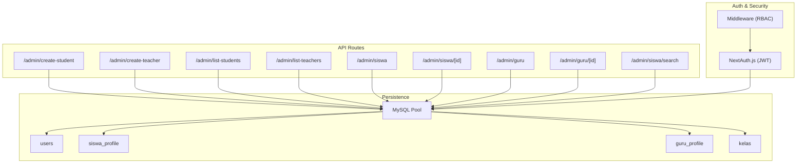
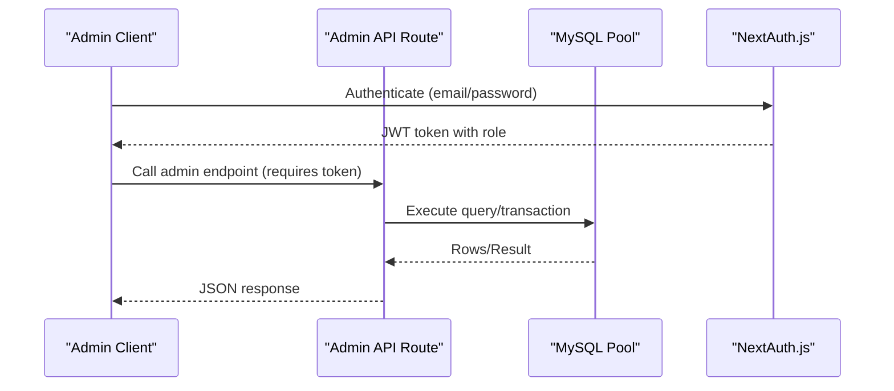
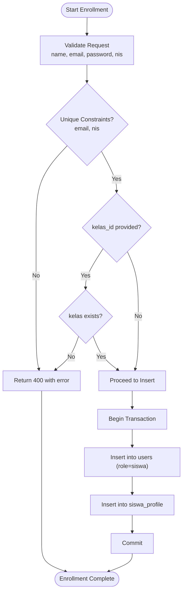
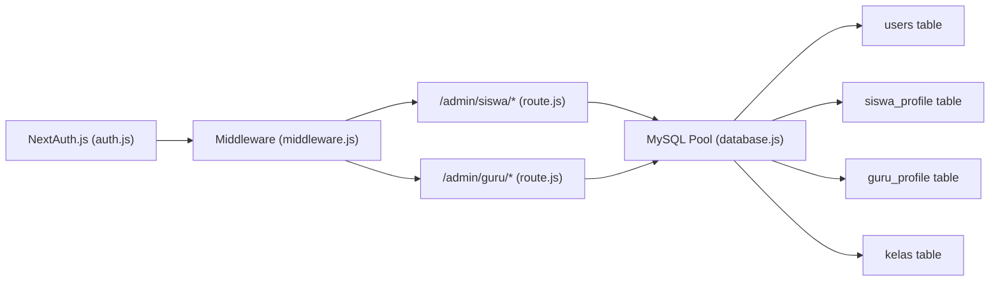

# User Management API

<cite>
**Referenced Files in This Document**
- [route.js](file://app/api/admin/create-student/route.js)
- [route.js](file://app/api/admin/create-teacher/route.js)
- [route.js](file://app/api/admin/list-students/route.js)
- [route.js](file://app/api/admin/list-teachers/route.js)
- [route.js](file://app/api/admin/siswa/route.js)
- [route.js](file://app/api/admin/siswa/[id]/route.js)
- [route.js](file://app/api/admin/guru/route.js)
- [route.js](file://app/api/admin/guru/[id]/route.js)
- [route.js](file://app/api/siswa/search/route.js)
- [auth.js](file://lib/auth.js)
- [middleware.js](file://middleware.js)
- [database.js](file://lib/database.js)
- [databasebk.sql](file://databasebk.sql)
</cite>

## Table of Contents
1. [Introduction](#introduction)
2. [Project Structure](#project-structure)
3. [Core Components](#core-components)
4. [Architecture Overview](#architecture-overview)
5. [Detailed Component Analysis](#detailed-component-analysis)
6. [Dependency Analysis](#dependency-analysis)
7. [Performance Considerations](#performance-considerations)
8. [Troubleshooting Guide](#troubleshooting-guide)
9. [Conclusion](#conclusion)
10. [Appendices](#appendices)

## Introduction
This document provides comprehensive API documentation for administrative user management endpoints focused on students and teachers. It covers creation, listing, retrieval, updates, deletions, and search/filtering capabilities. Authentication and authorization requirements are specified, along with validation rules, request/response schemas, and operational workflows such as enrollment and role assignment. Privacy and data protection considerations are addressed alongside permission controls and account lifecycle management.

## Project Structure
The administrative user management APIs are implemented as Next.js App Router API routes under the app/api/admin namespace. Supporting infrastructure includes:
- Authentication via NextAuth.js with JWT strategy
- Middleware enforcing role-based access control
- MySQL database abstraction with a connection pool
- Database schema defining users, profiles, and related entities

**Diagram sources**
- [route.js](file://app/api/admin/create-student/route.js)
- [route.js](file://app/api/admin/create-teacher/route.js)
- [route.js](file://app/api/admin/list-students/route.js)
- [route.js](file://app/api/admin/list-teachers/route.js)
- [route.js](file://app/api/admin/siswa/route.js)
- [route.js](file://app/api/admin/siswa/[id]/route.js)
- [route.js](file://app/api/admin/guru/route.js)
- [route.js](file://app/api/admin/guru/[id]/route.js)
- [route.js](file://app/api/siswa/search/route.js)
- [auth.js](file://lib/auth.js)
- [middleware.js](file://middleware.js)
- [database.js](file://lib/database.js)
- [databasebk.sql](file://databasebk.sql)

**Section sources**
- [auth.js:1-77](file://lib/auth.js#L1-L77)
- [middleware.js:1-53](file://middleware.js#L1-L53)
- [database.js:1-23](file://lib/database.js#L1-L23)
- [databasebk.sql:24-636](file://databasebk.sql#L24-L636)

## Core Components
- Authentication and Session Management
  - NextAuth.js with Credentials provider and JWT strategy
  - Token includes role, enabling middleware-based RBAC
- Authorization Middleware
  - Enforces role-specific protected routes (/admin, /guru, /siswa)
- Database Abstraction
  - MySQL connection pool and helper query function
- User Profiles
  - Unified users table with role and profile tables for student and teacher details

Key responsibilities:
- Admin-only endpoints enforce role checks via middleware
- Student and teacher creation validates uniqueness and inserts into users and respective profile tables
- Listing endpoints join users with profiles and optional class data
- Search endpoint filters students by name or NIS

**Section sources**
- [auth.js:1-77](file://lib/auth.js#L1-L77)
- [middleware.js:1-53](file://middleware.js#L1-L53)
- [database.js:1-23](file://lib/database.js#L1-L23)
- [databasebk.sql:24-636](file://databasebk.sql#L24-L636)

## Architecture Overview
The admin user management API follows a layered architecture:
- Presentation Layer: Next.js App Router API handlers
- Application Layer: Request parsing, validation, transaction handling
- Persistence Layer: MySQL via connection pool with foreign key constraints
- Security Layer: NextAuth.js JWT tokens and middleware RBAC

**Diagram sources**
- [auth.js:1-77](file://lib/auth.js#L1-L77)
- [middleware.js:1-53](file://middleware.js#L1-L53)
- [database.js:1-23](file://lib/database.js#L1-L23)

## Detailed Component Analysis

### Authentication and Authorization
- Authentication Provider
  - Credentials provider validates email/password against hashed passwords stored in users
  - JWT callback attaches role and profile attributes to the token
- Middleware Protection
  - Blocks unauthenticated access to protected paths
  - Redirects unauthorized users attempting to access role-specific areas

Operational notes:
- Tokens are validated server-side using the configured secret
- Role checks occur per-route group (/admin, /guru, /siswa)

**Section sources**
- [auth.js:1-77](file://lib/auth.js#L1-L77)
- [middleware.js:1-53](file://middleware.js#L1-L53)

### Student Management

#### Create Student (POST /admin/create-student)
- Purpose: Create a new student account
- Request Body
  - name: string (required)
  - username: string (optional)
  - email: string (required)
  - password: string (required)
  - class_id: integer (optional)
- Behavior
  - Hashes password using bcrypt
  - Inserts into users with role "siswa" and role_id 3
  - Returns success message
- Responses
  - 200 OK: { message: string }
  - 500 Internal Server Error: { error: string }

Validation and constraints:
- Password is hashed before storage
- Unique constraints apply to email and username in users table

**Section sources**
- [route.js:1-22](file://app/api/admin/create-student/route.js#L1-L22)
- [databasebk.sql:257-264](file://databasebk.sql#L257-L264)

#### Bulk Student Creation (POST /admin/siswa)
- Purpose: Add multiple students in a single operation
- Request Body
  - name: string (required)
  - email: string (required)
  - phone: string (optional)
  - password: string (required)
  - nis: string (required)
  - tanggal_lahir: date (optional)
  - alamat: text (optional)
  - kelas_id: integer (optional)
  - emergency_contact: string (optional)
- Behavior
  - Validates presence of required fields
  - Checks uniqueness of email and NIS
  - Validates kelas_id if provided
  - Starts transaction, inserts into users, then into siswa_profile
- Responses
  - 201 Created: { success: boolean, message: string, user_id: integer }
  - 400 Bad Request: { error: string }
  - 500 Internal Server Error: { error: string }

**Section sources**
- [route.js:52-140](file://app/api/admin/siswa/route.js#L52-L140)
- [databasebk.sql:268-281](file://databasebk.sql#L268-L281)

#### List Students (GET /admin/list-students)
- Purpose: Retrieve paginated or filtered student listings
- Response Fields
  - id: integer
  - nama: string
  - nis: string
  - kelas: string
  - email: string
  - phone: string
  - avatar_url: string
  - is_active: boolean
  - created_at: datetime
- Behavior
  - Joins siswa_profile with users and optional kelas
  - Orders by user id descending
- Responses
  - 200 OK: Array of student records
  - 500 Internal Server Error: { error: string }

**Section sources**
- [route.js:1-29](file://app/api/admin/list-students/route.js#L1-L29)
- [databasebk.sql:42-52](file://databasebk.sql#L42-L52)

#### Get Student by ID (GET /admin/siswa/[id])
- Purpose: Fetch a specific student’s profile
- Path Parameter
  - id: integer (required)
- Responses
  - 200 OK: Student record
  - 404 Not Found: { error: string }
  - 500 Internal Server Error: { error: string }

Note: This endpoint is not present in the current repository snapshot. The implementation for updating/deleting students exists at PUT/DELETE /admin/siswa/[id].

**Section sources**
- [route.js:1-150](file://app/api/admin/siswa/[id]/route.js#L1-L150)

#### Update Student (PUT /admin/siswa/[id])
- Purpose: Modify student details and profile
- Path Parameter
  - id: integer (required)
- Request Body
  - name: string (required)
  - email: string (required)
  - phone: string (optional)
  - password: string (optional)
  - nis: string (required)
  - tanggal_lahir: date (optional)
  - alamat: text (optional)
  - kelas_id: integer (optional)
  - emergency_contact: string (optional)
- Behavior
  - Validates completeness and uniqueness constraints
  - Optionally hashes new password
  - Updates users and/or inserts/updates siswa_profile within a transaction
- Responses
  - 200 OK: { success: boolean, message: string }
  - 400 Bad Request: { error: string }
  - 500 Internal Server Error: { error: string }

**Section sources**
- [route.js:12-116](file://app/api/admin/siswa/[id]/route.js#L12-L116)
- [databasebk.sql:42-52](file://databasebk.sql#L42-L52)

#### Delete Student (DELETE /admin/siswa/[id])
- Purpose: Remove a student account
- Path Parameter
  - id: integer (required)
- Behavior
  - Deletes from users where role is "siswa"
  - Uses cascade deletion for profile
- Responses
  - 200 OK: { success: boolean, message: string }
  - 404 Not Found: { error: string }
  - 500 Internal Server Error: { error: string }

**Section sources**
- [route.js:121-150](file://app/api/admin/siswa/[id]/route.js#L121-L150)
- [databasebk.sql:42-52](file://databasebk.sql#L42-L52)

#### Student Enrollment Workflow
- Enrollment involves assigning a student to a class
- Required fields for enrollment include nis and optional kelas_id
- Validation ensures kelas_id exists if provided
- Enrollment data is persisted in siswa_profile

**Diagram sources**
- [route.js:52-140](file://app/api/admin/siswa/route.js#L52-L140)
- [databasebk.sql:268-281](file://databasebk.sql#L268-L281)

### Teacher Management

#### Create Teacher (POST /admin/create-teacher)
- Purpose: Create a new teacher account
- Request Body
  - name: string (required)
  - username: string (optional)
  - email: string (required)
  - password: string (required)
- Behavior
  - Hashes password using bcrypt
  - Inserts into users with role "guru" and role_id 2
- Responses
  - 200 OK: { message: string }
  - 500 Internal Server Error: { error: string }

**Section sources**
- [route.js:1-22](file://app/api/admin/create-teacher/route.js#L1-L22)
- [databasebk.sql:257-264](file://databasebk.sql#L257-L264)

#### Bulk Teacher Creation (POST /admin/guru)
- Purpose: Add multiple teachers in a single operation
- Request Body
  - name: string (required)
  - email: string (required)
  - password: string (required)
  - phone: string (optional)
  - nip: string (required)
  - mata_pelajaran: string (optional)
  - jabatan: string (optional)
  - bio: text (optional)
- Behavior
  - Validates presence of required fields
  - Checks uniqueness of email and nip
  - Starts transaction, inserts into users, then into guru_profile
- Responses
  - 201 Created: { message: string, id: integer }
  - 400 Bad Request: { error: string }
  - 500 Internal Server Error: { error: string }

**Section sources**
- [route.js:30-92](file://app/api/admin/guru/route.js#L30-L92)
- [databasebk.sql:285-296](file://databasebk.sql#L285-L296)

#### List Teachers (GET /admin/list-teachers)
- Purpose: Retrieve teacher listings
- Response Fields
  - id: integer
  - nip: string
  - mata_pelajaran: string
  - jabatan: string
  - name: string
  - email: string
  - phone: string
  - avatar_url: string
  - is_active: boolean
  - created_at: datetime
- Behavior
  - Joins guru_profile with users
  - Orders by user id descending
- Responses
  - 200 OK: Array of teacher records
  - 500 Internal Server Error: { error: string }

**Section sources**
- [route.js:1-29](file://app/api/admin/list-teachers/route.js#L1-L29)
- [databasebk.sql:57-65](file://databasebk.sql#L57-L65)

#### Update Teacher (PUT /admin/guru/[id])
- Purpose: Modify teacher details and profile
- Path Parameter
  - id: integer (required)
- Request Body
  - name: string (required)
  - email: string (required)
  - phone: string (optional)
  - password: string (optional)
  - nip: string (required)
  - mata_pelajaran: string (optional)
  - jabatan: string (optional)
  - bio: string (optional)
- Behavior
  - Validates completeness and uniqueness constraints
  - Optionally hashes new password
  - Updates users and/or inserts/updates guru_profile within a transaction
- Responses
  - 200 OK: { message: string }
  - 400 Bad Request: { error: string }
  - 500 Internal Server Error: { error: string }

**Section sources**
- [route.js:9-79](file://app/api/admin/guru/[id]/route.js#L9-L79)
- [databasebk.sql:57-65](file://databasebk.sql#L57-L65)

#### Delete Teacher (DELETE /admin/guru/[id])
- Purpose: Remove a teacher account
- Path Parameter
  - id: integer (required)
- Behavior
  - Deletes from users where role is "guru"
  - Uses cascade deletion for profile
- Responses
  - 200 OK: { message: string }
  - 404 Not Found: { error: string }
  - 500 Internal Server Error: { error: string }

**Section sources**
- [route.js:81-100](file://app/api/admin/guru/[id]/route.js#L81-L100)
- [databasebk.sql:57-65](file://databasebk.sql#L57-L65)

### Search and Filtering

#### Student Search (GET /admin/siswa/search)
- Purpose: Search students by name or NIS
- Query Parameters
  - search: string (required)
- Response
  - Array of matching student records with id, name, nis, and class
- Behavior
  - Filters up to 10 results using LIKE on name and NIS
- Responses
  - 200 OK: Array of student objects
  - 500 Internal Server Error: { error: string }

**Section sources**
- [route.js:1-20](file://app/api/siswa/search/route.js#L1-L20)

### Request/Response Schemas

#### Student Creation (POST /admin/siswa)
- Request
  - name: string (required)
  - email: string (required)
  - phone: string (optional)
  - password: string (required)
  - nis: string (required)
  - tanggal_lahir: string (date, optional)
  - alamat: string (text, optional)
  - kelas_id: integer (optional)
  - emergency_contact: string (optional)
- Response
  - success: boolean
  - message: string
  - user_id: integer

#### Teacher Creation (POST /admin/guru)
- Request
  - name: string (required)
  - email: string (required)
  - password: string (required)
  - phone: string (optional)
  - nip: string (required)
  - mata_pelajaran: string (optional)
  - jabatan: string (optional)
  - bio: string (optional)
- Response
  - message: string
  - id: integer

#### Student Update (PUT /admin/siswa/[id])
- Request
  - name: string (required)
  - email: string (required)
  - phone: string (optional)
  - password: string (optional)
  - nis: string (required)
  - tanggal_lahir: string (date, optional)
  - alamat: string (text, optional)
  - kelas_id: integer (optional)
  - emergency_contact: string (optional)
- Response
  - success: boolean
  - message: string

#### Teacher Update (PUT /admin/guru/[id])
- Request
  - name: string (required)
  - email: string (required)
  - phone: string (optional)
  - password: string (optional)
  - nip: string (required)
  - mata_pelajaran: string (optional)
  - jabatan: string (optional)
  - bio: string (optional)
- Response
  - message: string

#### Student Deletion (DELETE /admin/siswa/[id])
- Response
  - success: boolean
  - message: string

#### Teacher Deletion (DELETE /admin/guru/[id])
- Response
  - message: string

#### Student Listing (GET /admin/list-students)
- Response
  - Array of objects with fields: id, nama, nis, kelas, email, phone, avatar_url, is_active, created_at

#### Teacher Listing (GET /admin/list-teachers)
- Response
  - Array of objects with fields: id, nip, mata_pelajaran, jabatan, name, email, phone, avatar_url, is_active, created_at

#### Student Search (GET /admin/siswa/search)
- Query
  - search: string (required)
- Response
  - Array of objects with fields: id, name, nis, kelas

**Section sources**
- [route.js:52-140](file://app/api/admin/siswa/route.js#L52-L140)
- [route.js:30-92](file://app/api/admin/guru/route.js#L30-L92)
- [route.js:12-116](file://app/api/admin/siswa/[id]/route.js#L12-L116)
- [route.js:9-79](file://app/api/admin/guru/[id]/route.js#L9-L79)
- [route.js:121-150](file://app/api/admin/siswa/[id]/route.js#L121-L150)
- [route.js:81-100](file://app/api/admin/guru/[id]/route.js#L81-L100)
- [route.js:1-29](file://app/api/admin/list-students/route.js#L1-L29)
- [route.js:1-29](file://app/api/admin/list-teachers/route.js#L1-L29)
- [route.js:1-20](file://app/api/siswa/search/route.js#L1-L20)

### Authentication and Authorization Requirements
- All admin endpoints require a valid JWT token issued by NextAuth.js
- Middleware enforces role-based access:
  - /admin requires role "admin"
  - /guru requires role "guru"
  - /siswa requires role "siswa"
- Unauthorized access attempts redirect to /unauthorized

**Section sources**
- [middleware.js:1-53](file://middleware.js#L1-L53)
- [auth.js:1-77](file://lib/auth.js#L1-L77)

### Validation Rules
- Required Fields
  - Student creation: name, email, password, nis
  - Teacher creation: name, email, password, nip
  - Update operations: id, name, email, and appropriate identifiers (nis for student, nip for teacher)
- Uniqueness
  - Email must be unique across users
  - NIS must be unique for students
  - NIP must be unique for teachers
- Optional Fields
  - phone, tanggal_lahir, alamat, kelas_id, emergency_contact for students
  - phone, mata_pelajaran, jabatan, bio for teachers
- Class Assignment
  - kelas_id must reference an existing class if provided

**Section sources**
- [route.js:62-100](file://app/api/admin/siswa/route.js#L62-L100)
- [route.js:36-56](file://app/api/admin/guru/route.js#L36-L56)
- [route.js:24-58](file://app/api/admin/siswa/[id]/route.js#L24-L58)
- [route.js:16-39](file://app/api/admin/guru/[id]/route.js#L16-L39)
- [databasebk.sql:257-264](file://databasebk.sql#L257-L264)
- [databasebk.sql:268-281](file://databasebk.sql#L268-L281)
- [databasebk.sql:285-296](file://databasebk.sql#L285-L296)

### User Status Management
- Account Activation/Deactivation
  - users table includes is_active flag
  - Listing endpoints filter by is_active = 1 to show only active users
- Implications
  - Deactivation prevents login and listing visibility
  - No explicit deactivation endpoint is exposed in the analyzed routes

**Section sources**
- [databasebk.sql:257-264](file://databasebk.sql#L257-L264)
- [route.js:16-18](file://app/api/admin/guru/route.js#L16-L18)
- [route.js:6-21](file://app/api/admin/list-students/route.js#L6-L21)

### Data Privacy Considerations
- Passwords are hashed using bcrypt before storage
- Personal data fields (phone, address, emergency contact) are stored in dedicated profile tables
- Unique identifiers (NIS, NIP) are enforced to minimize cross-user data leakage
- Access to admin endpoints is restricted by role-based middleware

**Section sources**
- [route.js:9-15](file://app/api/admin/create-student/route.js#L9-L15)
- [route.js:9-15](file://app/api/admin/create-teacher/route.js#L9-L15)
- [route.js:102-120](file://app/api/admin/siswa/route.js#L102-L120)
- [route.js:59-76](file://app/api/admin/guru/route.js#L59-L76)
- [databasebk.sql:257-264](file://databasebk.sql#L257-L264)
- [databasebk.sql:268-281](file://databasebk.sql#L268-L281)
- [databasebk.sql:285-296](file://databasebk.sql#L285-L296)

## Dependency Analysis
The following diagram shows key dependencies among components involved in user management:

**Diagram sources**
- [auth.js:1-77](file://lib/auth.js#L1-L77)
- [middleware.js:1-53](file://middleware.js#L1-L53)
- [route.js:1-140](file://app/api/admin/siswa/route.js#L1-L140)
- [route.js:1-92](file://app/api/admin/guru/route.js#L1-L92)
- [database.js:1-23](file://lib/database.js#L1-L23)
- [databasebk.sql:24-636](file://databasebk.sql#L24-L636)

**Section sources**
- [auth.js:1-77](file://lib/auth.js#L1-L77)
- [middleware.js:1-53](file://middleware.js#L1-L53)
- [database.js:1-23](file://lib/database.js#L1-L23)
- [databasebk.sql:24-636](file://databasebk.sql#L24-L636)

## Performance Considerations
- Connection Pooling
  - MySQL pool reduces overhead and improves throughput for concurrent requests
- Indexes
  - Database includes indexes on role, email, username, NIS, and NIP to optimize lookups
- Transactions
  - Multi-table inserts/updates are wrapped in transactions to maintain consistency
- Pagination and Limits
  - Search endpoints limit results to reduce payload size

Recommendations:
- Monitor pool usage and adjust limits based on load
- Consider adding pagination to listing endpoints for very large datasets
- Use prepared statements consistently (already used in analyzed routes)

**Section sources**
- [database.js:1-23](file://lib/database.js#L1-L23)
- [databasebk.sql:406-420](file://databasebk.sql#L406-L420)

## Troubleshooting Guide
Common Issues and Resolutions:
- Authentication Failures
  - Ensure credentials match hashed passwords in users
  - Verify NEXTAUTH_SECRET is configured
- Authorization Errors
  - Confirm user role matches the protected route group
  - Check middleware matcher configuration
- Duplicate Entries
  - Email, NIS, and NIP must be unique; handle 400 errors accordingly
- Transaction Rollbacks
  - Operations that fail during validation or constraint checks roll back changes automatically
- Database Connectivity
  - Verify DB_HOST, DB_USER, DB_PASS, DB_NAME environment variables
  - Ensure MySQL service is reachable

**Section sources**
- [auth.js:1-77](file://lib/auth.js#L1-L77)
- [middleware.js:1-53](file://middleware.js#L1-L53)
- [route.js:73-100](file://app/api/admin/siswa/route.js#L73-L100)
- [route.js:44-56](file://app/api/admin/guru/route.js#L44-L56)
- [route.js:32-58](file://app/api/admin/siswa/[id]/route.js#L32-L58)
- [route.js:23-39](file://app/api/admin/guru/[id]/route.js#L23-L39)
- [database.js:1-23](file://lib/database.js#L1-L23)

## Conclusion
The administrative user management API provides robust CRUD operations for students and teachers, integrated with secure authentication and role-based access control. It enforces strong validation rules, maintains data integrity through transactions, and supports essential workflows such as enrollment and search. Administrators can manage user accounts, assign roles, and control visibility through activation flags while adhering to privacy best practices.

## Appendices

### API Reference Summary

- Student Endpoints
  - POST /admin/create-student
  - POST /admin/siswa
  - GET /admin/list-students
  - GET /admin/siswa/[id] (not present in snapshot)
  - PUT /admin/siswa/[id]
  - DELETE /admin/siswa/[id]
  - GET /admin/siswa/search

- Teacher Endpoints
  - POST /admin/create-teacher
  - POST /admin/guru
  - GET /admin/list-teachers
  - PUT /admin/guru/[id]
  - DELETE /admin/guru/[id]

- Authentication
  - NextAuth.js JWT with role claims
  - Middleware RBAC enforcement

**Section sources**
- [route.js:1-22](file://app/api/admin/create-student/route.js#L1-L22)
- [route.js:1-22](file://app/api/admin/create-teacher/route.js#L1-L22)
- [route.js:1-29](file://app/api/admin/list-students/route.js#L1-L29)
- [route.js:1-29](file://app/api/admin/list-teachers/route.js#L1-L29)
- [route.js:1-140](file://app/api/admin/siswa/route.js#L1-L140)
- [route.js:1-150](file://app/api/admin/siswa/[id]/route.js#L1-L150)
- [route.js:1-92](file://app/api/admin/guru/route.js#L1-L92)
- [route.js:1-100](file://app/api/admin/guru/[id]/route.js#L1-L100)
- [route.js:1-20](file://app/api/siswa/search/route.js#L1-L20)
- [auth.js:1-77](file://lib/auth.js#L1-L77)
- [middleware.js:1-53](file://middleware.js#L1-L53)