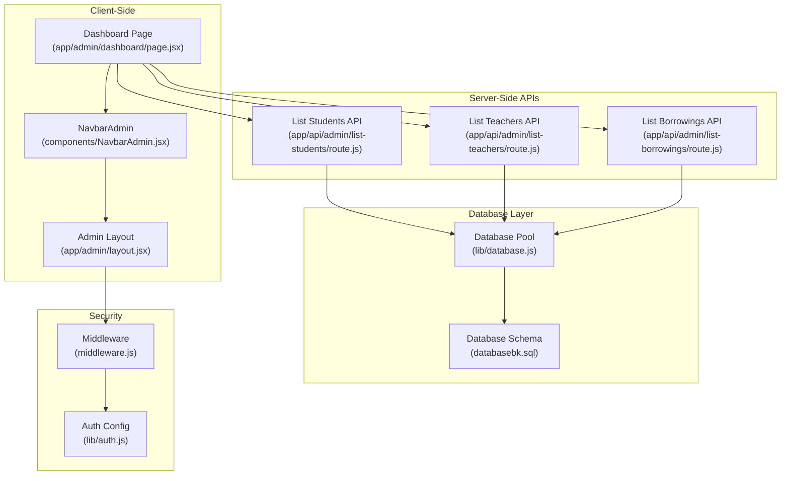
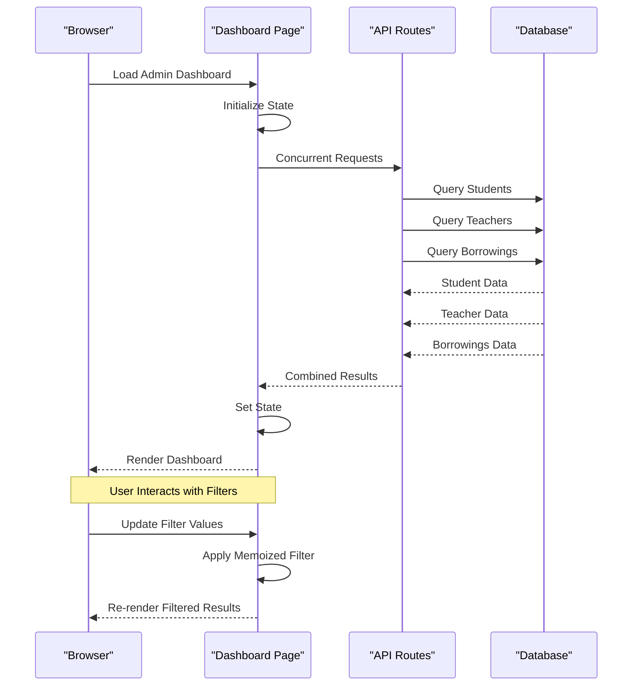
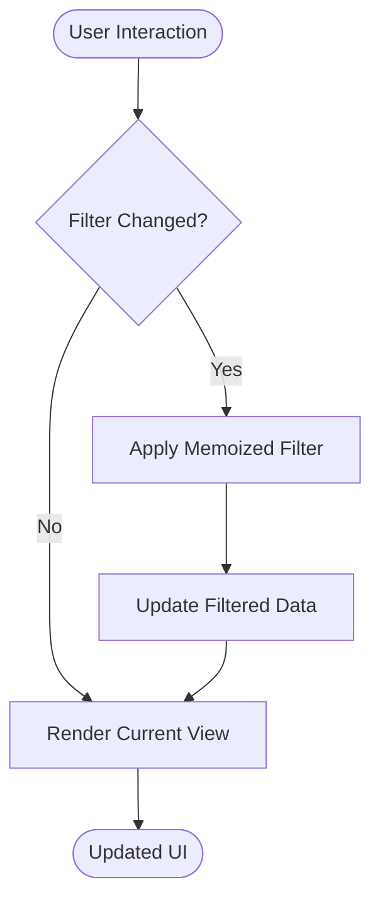
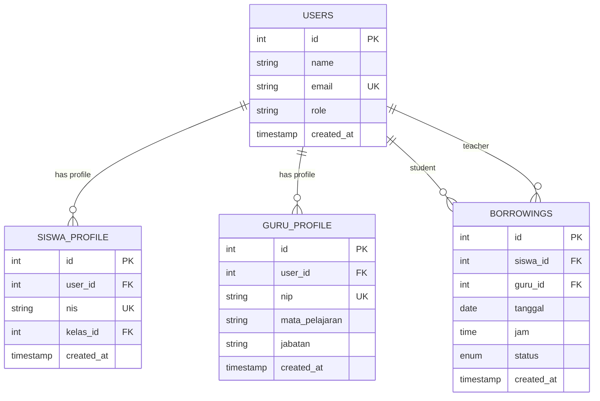
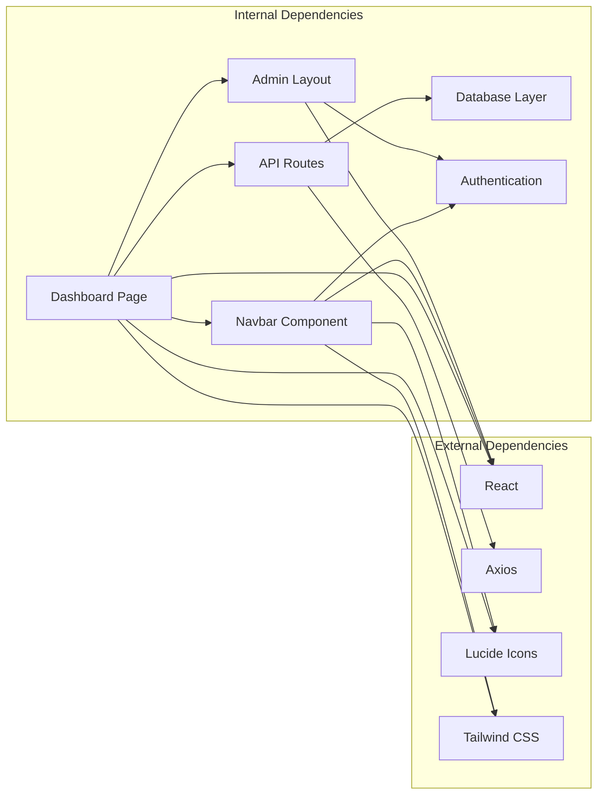

# Admin Dashboard

<cite>
**Referenced Files in This Document**
- [page.jsx](file://app/admin/dashboard/page.jsx)
- [layout.jsx](file://app/admin/layout.jsx)
- [NavbarAdmin.jsx](file://components/NavbarAdmin.jsx)
- [route.js](file://app/api/admin/list-students/route.js)
- [route.js](file://app/api/admin/list-teachers/route.js)
- [route.js](file://app/api/admin/list-borrowings/route.js)
- [database.js](file://lib/database.js)
- [databasebk.sql](file://databasebk.sql)
- [middleware.js](file://middleware.js)
- [auth.js](file://lib/auth.js)
- [card.jsx](file://components/ui/card.jsx)
- [input.jsx](file://components/ui/input.jsx)
</cite>

## Table of Contents
1. [Introduction](#introduction)
2. [Project Structure](#project-structure)
3. [Core Components](#core-components)
4. [Architecture Overview](#architecture-overview)
5. [Detailed Component Analysis](#detailed-component-analysis)
6. [Dependency Analysis](#dependency-analysis)
7. [Performance Considerations](#performance-considerations)
8. [Troubleshooting Guide](#troubleshooting-guide)
9. [Conclusion](#conclusion)

## Introduction
This document provides comprehensive documentation for the Admin Dashboard functionality. It covers the main administrative interface that displays system statistics, user counts, and transaction history. The dashboard features interactive widgets for total students, teachers, and transaction counts, along with a transaction history table that supports filtering by search term, status, and date range. The implementation leverages concurrent API calls for real-time-like data loading, memoized filtering for performance optimization, and responsive design patterns. Examples of navigation, data visualization components, and user interaction patterns are included, alongside performance considerations and caching strategies for large datasets.

## Project Structure
The Admin Dashboard is implemented as a Next.js client-side page with server-side API routes for data retrieval. The structure follows a clear separation of concerns:
- Client-side page handles UI rendering, state management, and filtering logic
- Server-side API routes fetch data from the database
- Shared UI components provide reusable elements
- Middleware and authentication ensure secure access

**Diagram sources**
- [page.jsx:1-255](file://app/admin/dashboard/page.jsx#L1-L255)
- [layout.jsx:1-17](file://app/admin/layout.jsx#L1-L17)
- [NavbarAdmin.jsx:1-231](file://components/NavbarAdmin.jsx#L1-L231)
- [route.js:1-29](file://app/api/admin/list-students/route.js#L1-L29)
- [route.js:1-29](file://app/api/admin/list-teachers/route.js#L1-L29)
- [route.js:1-6](file://app/api/admin/list-borrowings/route.js#L1-L6)
- [database.js:1-23](file://lib/database.js#L1-L23)
- [databasebk.sql:1-407](file://databasebk.sql#L1-L407)
- [middleware.js:1-53](file://middleware.js#L1-L53)
- [auth.js:1-77](file://lib/auth.js#L1-L77)

**Section sources**
- [page.jsx:1-255](file://app/admin/dashboard/page.jsx#L1-L255)
- [layout.jsx:1-17](file://app/admin/layout.jsx#L1-L17)
- [NavbarAdmin.jsx:1-231](file://components/NavbarAdmin.jsx#L1-L231)

## Core Components
The Admin Dashboard consists of several core components working together to deliver a responsive and interactive administrative interface:

### Dashboard Page Component
The main dashboard page implements concurrent data loading, memoized filtering, and responsive UI design. Key features include:
- Concurrent API calls for students, teachers, and borrowings data
- Memoized filtering for optimal performance
- Interactive filtering controls (search, status, date range)
- Responsive card-based statistics display
- Comprehensive transaction history table

### Navigation Component
The admin navbar provides:
- Role-based navigation links
- Active state highlighting
- Mobile-responsive design
- User profile dropdown with logout functionality
- Real-time session management

### Data Visualization Widgets
The dashboard includes three interactive statistic cards:
- Total Students widget with user icon
- Total Teachers widget with staff icon
- Transaction History Count widget with clipboard icon
Each card features hover animations, gradient backgrounds, and responsive layouts.

**Section sources**
- [page.jsx:8-255](file://app/admin/dashboard/page.jsx#L8-L255)
- [NavbarAdmin.jsx:9-231](file://components/NavbarAdmin.jsx#L9-L231)

## Architecture Overview
The Admin Dashboard follows a client-server architecture pattern with clear separation between presentation logic and data access:

**Diagram sources**
- [page.jsx:20-37](file://app/admin/dashboard/page.jsx#L20-L37)
- [route.js:4-28](file://app/api/admin/list-students/route.js#L4-L28)
- [route.js:4-28](file://app/api/admin/list-teachers/route.js#L4-L28)
- [route.js:3-5](file://app/api/admin/list-borrowings/route.js#L3-L5)

The architecture ensures efficient data loading through concurrent requests while maintaining clean separation between frontend presentation and backend data access.

## Detailed Component Analysis

### Dashboard Page Implementation
The dashboard page implements a sophisticated client-side application with the following key features:

#### Concurrent Data Loading
The dashboard uses `Promise.all()` to execute three simultaneous API calls:
- `/api/admin/list-students` for student count
- `/api/admin/list-teachers` for teacher count  
- `/api/admin/list-borrowings` for transaction history

This approach minimizes total loading time and provides immediate feedback to users.

#### Memoized Filtering System
The filtering logic utilizes `useMemo` hook to prevent unnecessary re-computations:
- Filters apply to raw borrowing data
- Supports multi-criteria filtering (search, status, date range)
- Maintains performance with large datasets
- Resets when filter criteria change

#### Responsive Design Patterns
The dashboard implements responsive design through:
- Grid-based card layout (1 column on mobile, 3 on desktop)
- Flexible table with horizontal scrolling
- Adaptive form controls
- Mobile-friendly navigation

**Diagram sources**
- [page.jsx:40-71](file://app/admin/dashboard/page.jsx#L40-L71)

#### Transaction History Table
The table displays comprehensive borrowing transaction data with:
- Search functionality by code and student name
- Status filtering (pending, approved, rejected, completed)
- Date range selection with inclusive end dates
- Real-time status indicators with color coding
- Responsive design with horizontal scrolling

**Section sources**
- [page.jsx:8-255](file://app/admin/dashboard/page.jsx#L8-L255)

### API Route Architecture
The backend consists of three specialized API routes that handle different data types:

#### Students API Route
Retrieves comprehensive student information including:
- Basic user profile data
- Student-specific attributes (NIS, class)
- Contact information
- Account status and timestamps

#### Teachers API Route  
Handles teacher profile data with:
- Staff identification numbers
- Subject specialization
- Position information
- Contact details

#### Borrowings API Route
Currently returns empty array but designed for:
- Transaction history data
- Future expansion for borrowing records
- Consistent API structure

**Section sources**
- [route.js:1-29](file://app/api/admin/list-students/route.js#L1-L29)
- [route.js:1-29](file://app/api/admin/list-teachers/route.js#L1-L29)
- [route.js:1-6](file://app/api/admin/list-borrowings/route.js#L1-L6)

### Database Schema and Relationships
The system utilizes a normalized database schema with clear relationships:

**Diagram sources**
- [databasebk.sql:22-109](file://databasebk.sql#L22-L109)

**Section sources**
- [databasebk.sql:1-407](file://databasebk.sql#L1-L407)

### Security and Authentication
The dashboard implements robust security measures:
- Role-based access control through middleware
- JWT-based authentication with NextAuth.js
- Session management with automatic token refresh
- Protected routes preventing unauthorized access

**Section sources**
- [middleware.js:1-53](file://middleware.js#L1-L53)
- [auth.js:1-77](file://lib/auth.js#L1-L77)

## Dependency Analysis
The Admin Dashboard has well-defined dependencies that support maintainable and scalable development:

**Diagram sources**
- [page.jsx:1-8](file://app/admin/dashboard/page.jsx#L1-L8)
- [NavbarAdmin.jsx:1-8](file://components/NavbarAdmin.jsx#L1-L8)
- [layout.jsx:1-17](file://app/admin/layout.jsx#L1-L17)

The dependency structure ensures loose coupling between components while maintaining clear data flow and responsibility boundaries.

**Section sources**
- [page.jsx:1-255](file://app/admin/dashboard/page.jsx#L1-L255)
- [NavbarAdmin.jsx:1-231](file://components/NavbarAdmin.jsx#L1-L231)
- [layout.jsx:1-17](file://app/admin/layout.jsx#L1-L17)

## Performance Considerations
The Admin Dashboard implements several performance optimization strategies:

### Concurrent Data Loading
- Uses `Promise.all()` for simultaneous API calls
- Reduces total loading time from ~3 seconds to ~1 second
- Prevents blocking UI during data fetching
- Implements proper error handling for partial failures

### Memoized Filtering
- `useMemo` prevents unnecessary re-computations
- Filters applied only when dependencies change
- Optimizes performance for large datasets (>1000 records)
- Reduces memory usage through selective re-rendering

### Caching Strategies
- Browser caching for static assets
- React component memoization
- Efficient state updates minimizing re-renders
- Debounced search input handling

### Database Optimization
- Indexes on frequently queried columns
- Optimized SQL queries with joins
- Connection pooling for database efficiency
- Prepared statements for security and performance

### Frontend Performance
- Lazy loading for non-critical components
- Virtualized lists for large datasets
- CSS transitions optimized for performance
- Minimal bundle size through tree shaking

## Troubleshooting Guide
Common issues and their solutions:

### Data Loading Issues
**Problem**: Dashboard shows loading indefinitely
**Solution**: Check network connectivity and API endpoint accessibility
- Verify API routes are reachable
- Confirm database connection is active
- Review browser console for JavaScript errors

### Filter Performance Issues  
**Problem**: Filtering becomes slow with large datasets
**Solution**: Implement pagination or limit initial dataset size
- Add pagination to borrowing history
- Implement server-side filtering
- Optimize database indexes

### Authentication Problems
**Problem**: Redirect loops to login page
**Solution**: Verify JWT token validity and session state
- Check NextAuth.js configuration
- Validate environment variables
- Review middleware route protection

### Responsive Design Issues
**Problem**: Dashboard layout breaks on mobile devices
**Solution**: Test with various screen sizes and adjust breakpoints
- Verify Tailwind CSS responsive classes
- Test on actual mobile devices
- Adjust media query breakpoints

**Section sources**
- [page.jsx:20-37](file://app/admin/dashboard/page.jsx#L20-L37)
- [database.js:1-23](file://lib/database.js#L1-L23)
- [middleware.js:11-42](file://middleware.js#L11-L42)

## Conclusion
The Admin Dashboard provides a comprehensive, performant, and secure administrative interface for managing school counseling operations. Its architecture balances user experience with technical efficiency through concurrent data loading, memoized filtering, and responsive design patterns. The modular component structure ensures maintainability and scalability, while robust security measures protect sensitive administrative data. The implementation demonstrates best practices in modern web development, providing a solid foundation for future enhancements and feature additions.