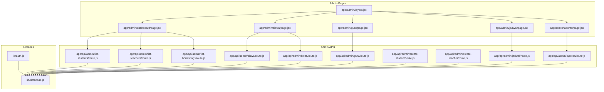
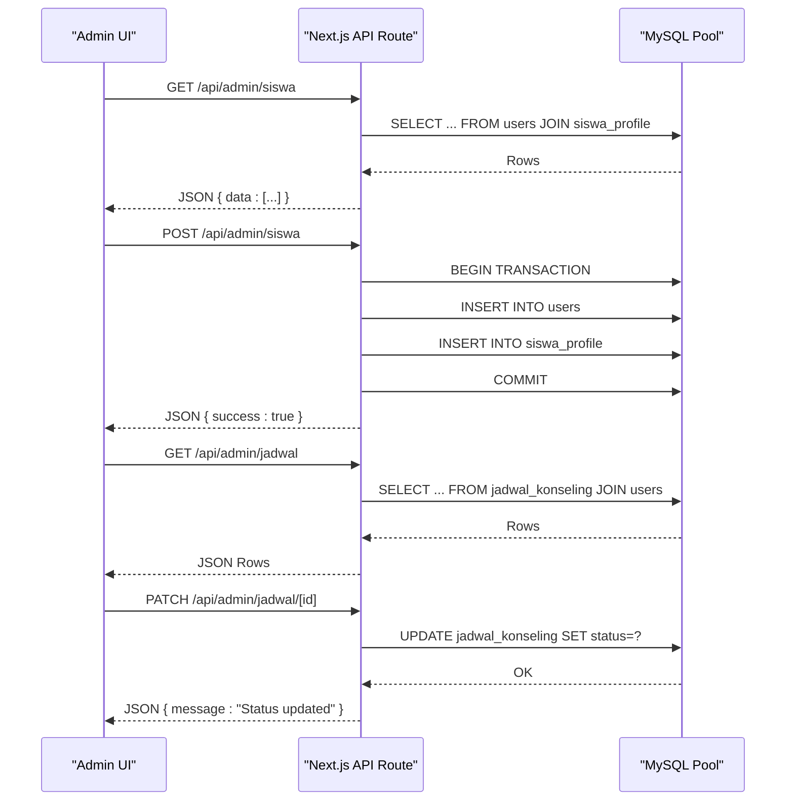
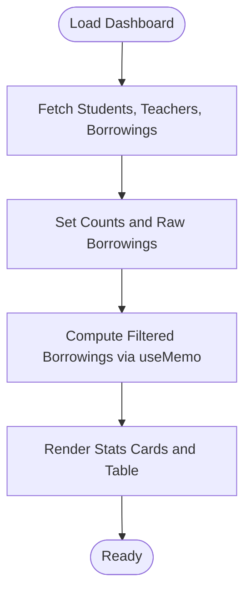
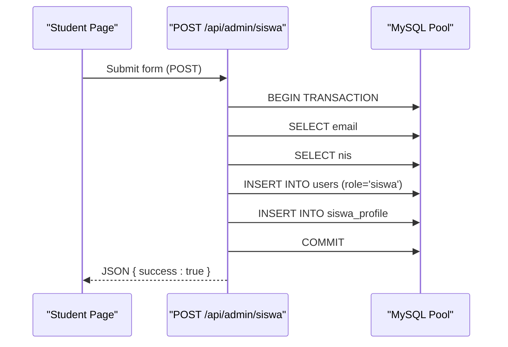
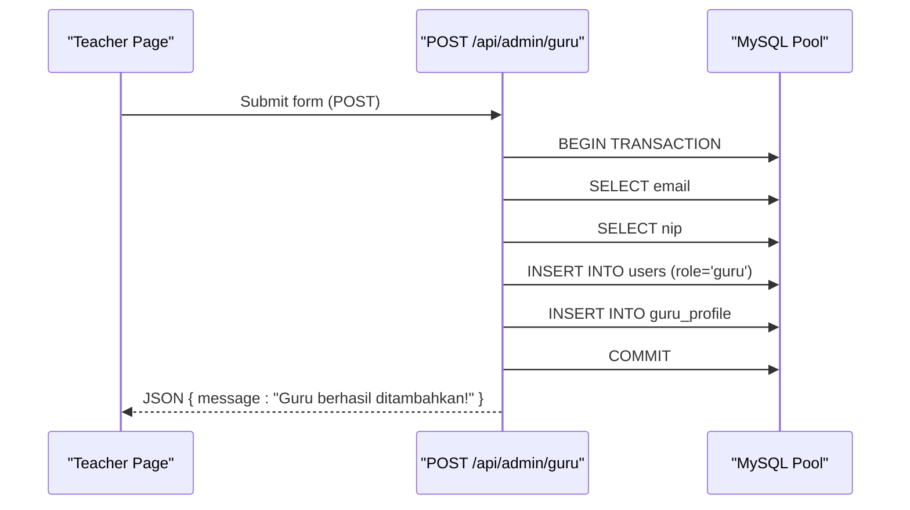
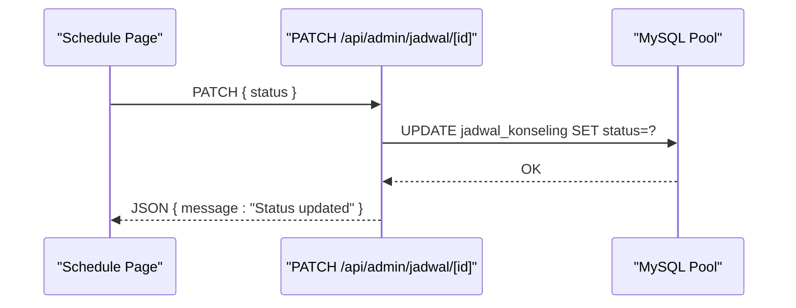
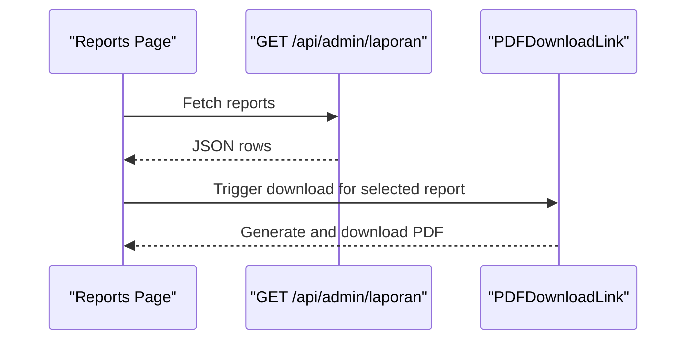
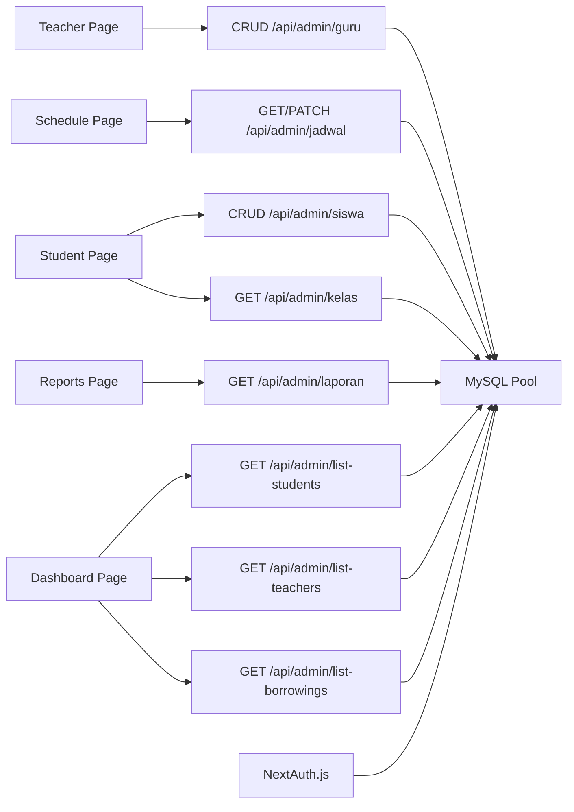

# Admin Portal

<cite>
**Referenced Files in This Document**
- [app/admin/layout.jsx](file://app/admin/layout.jsx)
- [app/admin/dashboard/page.jsx](file://app/admin/dashboard/page.jsx)
- [app/admin/siswa/page.jsx](file://app/admin/siswa/page.jsx)
- [app/admin/guru/page.jsx](file://app/admin/guru/page.jsx)
- [app/admin/jadwal/page.jsx](file://app/admin/jadwal/page.jsx)
- [app/admin/laporan/page.jsx](file://app/admin/laporan/page.jsx)
- [app/api/admin/siswa/route.js](file://app/api/admin/siswa/route.js)
- [app/api/admin/guru/route.js](file://app/api/admin/guru/route.js)
- [app/api/admin/jadwal/route.js](file://app/api/admin/jadwal/route.js)
- [app/api/admin/laporan/route.js](file://app/api/admin/laporan/route.js)
- [app/api/admin/list-students/route.js](file://app/api/admin/list-students/route.js)
- [app/api/admin/list-teachers/route.js](file://app/api/admin/list-teachers/route.js)
- [app/api/admin/create-student/route.js](file://app/api/admin/create-student/route.js)
- [app/api/admin/create-teacher/route.js](file://app/api/admin/create-teacher/route.js)
- [app/api/admin/kelas/route.js](file://app/api/admin/kelas/route.js)
- [app/api/admin/list-borrowings/route.js](file://app/api/admin/list-borrowings/route.js)
- [lib/database.js](file://lib/database.js)
- [lib/auth.js](file://lib/auth.js)
</cite>

## Table of Contents
1. [Introduction](#introduction)
2. [Project Structure](#project-structure)
3. [Core Components](#core-components)
4. [Architecture Overview](#architecture-overview)
5. [Detailed Component Analysis](#detailed-component-analysis)
6. [Dependency Analysis](#dependency-analysis)
7. [Performance Considerations](#performance-considerations)
8. [Troubleshooting Guide](#troubleshooting-guide)
9. [Conclusion](#conclusion)
10. [Appendices](#appendices)

## Introduction
This document describes the Admin Portal functionality for the E-BK application. It covers the administrative interface for managing users (students and counselors/teachers), scheduling, reports, and system monitoring. It documents user management workflows (student enrollment, teacher assignment, and account administration), dashboard analytics, class and schedule management, report generation, and system monitoring capabilities. It also outlines API endpoints for administrative operations, data validation rules, permission controls, administrative workflows, bulk operations, and system maintenance procedures, along with security considerations and audit trail requirements.

## Project Structure
The Admin Portal is organized as a set of client-side pages under app/admin and a set of server-side API routes under app/api/admin. Shared UI components and authentication configuration support the admin experience.

**Diagram sources**
- [app/admin/layout.jsx:1-17](file://app/admin/layout.jsx#L1-L17)
- [app/admin/dashboard/page.jsx:1-255](file://app/admin/dashboard/page.jsx#L1-L255)
- [app/admin/siswa/page.jsx:1-338](file://app/admin/siswa/page.jsx#L1-L338)
- [app/admin/guru/page.jsx:1-278](file://app/admin/guru/page.jsx#L1-L278)
- [app/admin/jadwal/page.jsx:1-215](file://app/admin/jadwal/page.jsx#L1-L215)
- [app/admin/laporan/page.jsx:1-195](file://app/admin/laporan/page.jsx#L1-L195)
- [app/api/admin/siswa/route.js:1-140](file://app/api/admin/siswa/route.js#L1-L140)
- [app/api/admin/guru/route.js:1-92](file://app/api/admin/guru/route.js#L1-L92)
- [app/api/admin/jadwal/route.js:1-38](file://app/api/admin/jadwal/route.js#L1-L38)
- [app/api/admin/laporan/route.js:1-29](file://app/api/admin/laporan/route.js#L1-L29)
- [app/api/admin/list-students/route.js:1-29](file://app/api/admin/list-students/route.js#L1-L29)
- [app/api/admin/list-teachers/route.js:1-29](file://app/api/admin/list-teachers/route.js#L1-L29)
- [app/api/admin/create-student/route.js:1-22](file://app/api/admin/create-student/route.js#L1-L22)
- [app/api/admin/create-teacher/route.js:1-22](file://app/api/admin/create-teacher/route.js#L1-L22)
- [app/api/admin/kelas/route.js:1-16](file://app/api/admin/kelas/route.js#L1-L16)
- [app/api/admin/list-borrowings/route.js:1-6](file://app/api/admin/list-borrowings/route.js#L1-L6)
- [lib/database.js:1-23](file://lib/database.js#L1-L23)
- [lib/auth.js:1-77](file://lib/auth.js#L1-L77)

**Section sources**
- [app/admin/layout.jsx:1-17](file://app/admin/layout.jsx#L1-L17)
- [app/admin/dashboard/page.jsx:1-255](file://app/admin/dashboard/page.jsx#L1-L255)
- [app/admin/siswa/page.jsx:1-338](file://app/admin/siswa/page.jsx#L1-L338)
- [app/admin/guru/page.jsx:1-278](file://app/admin/guru/page.jsx#L1-L278)
- [app/admin/jadwal/page.jsx:1-215](file://app/admin/jadwal/page.jsx#L1-L215)
- [app/admin/laporan/page.jsx:1-195](file://app/admin/laporan/page.jsx#L1-L195)
- [app/api/admin/siswa/route.js:1-140](file://app/api/admin/siswa/route.js#L1-L140)
- [app/api/admin/guru/route.js:1-92](file://app/api/admin/guru/route.js#L1-L92)
- [app/api/admin/jadwal/route.js:1-38](file://app/api/admin/jadwal/route.js#L1-L38)
- [app/api/admin/laporan/route.js:1-29](file://app/api/admin/laporan/route.js#L1-L29)
- [app/api/admin/list-students/route.js:1-29](file://app/api/admin/list-students/route.js#L1-L29)
- [app/api/admin/list-teachers/route.js:1-29](file://app/api/admin/list-teachers/route.js#L1-L29)
- [app/api/admin/create-student/route.js:1-22](file://app/api/admin/create-student/route.js#L1-L22)
- [app/api/admin/create-teacher/route.js:1-22](file://app/api/admin/create-teacher/route.js#L1-L22)
- [app/api/admin/kelas/route.js:1-16](file://app/api/admin/kelas/route.js#L1-L16)
- [app/api/admin/list-borrowings/route.js:1-6](file://app/api/admin/list-borrowings/route.js#L1-L6)
- [lib/database.js:1-23](file://lib/database.js#L1-L23)
- [lib/auth.js:1-77](file://lib/auth.js#L1-L77)

## Core Components
- Admin Layout: Provides a shared admin layout with navigation and consistent spacing.
- Dashboard: Aggregates system stats (student count, counselor count, transaction history), and filters borrowing records by search term, status, and date range.
- Student Management: CRUD operations for students, including enrollment, class assignment, and optional password updates.
- Counselor/Teacher Management: CRUD operations for counselors/teachers, including NIP validation and optional password updates.
- Schedule Management: Lists counseling schedules, supports filtering, and allows approval/rejection actions.
- Report Generation: Displays counseling reports with summary, detail, and follow-up sections, and supports PDF export per report.
- Authentication and Authorization: JWT-based session strategy with role propagation via NextAuth.js.

**Section sources**
- [app/admin/layout.jsx:1-17](file://app/admin/layout.jsx#L1-L17)
- [app/admin/dashboard/page.jsx:1-255](file://app/admin/dashboard/page.jsx#L1-L255)
- [app/admin/siswa/page.jsx:1-338](file://app/admin/siswa/page.jsx#L1-L338)
- [app/admin/guru/page.jsx:1-278](file://app/admin/guru/page.jsx#L1-L278)
- [app/admin/jadwal/page.jsx:1-215](file://app/admin/jadwal/page.jsx#L1-L215)
- [app/admin/laporan/page.jsx:1-195](file://app/admin/laporan/page.jsx#L1-L195)
- [lib/auth.js:1-77](file://lib/auth.js#L1-L77)

## Architecture Overview
The Admin Portal follows a client-server pattern:
- Client pages under app/admin fetch data from app/api/admin endpoints.
- Backend routes use a MySQL connection pool and enforce validation and referential checks.
- Authentication integrates with NextAuth.js using JWT sessions and role claims.

**Diagram sources**
- [app/admin/siswa/page.jsx:32-88](file://app/admin/siswa/page.jsx#L32-L88)
- [app/api/admin/siswa/route.js:12-47](file://app/api/admin/siswa/route.js#L12-L47)
- [app/api/admin/siswa/route.js:52-140](file://app/api/admin/siswa/route.js#L52-L140)
- [app/admin/jadwal/page.jsx:14-45](file://app/admin/jadwal/page.jsx#L14-L45)
- [app/api/admin/jadwal/route.js:5-25](file://app/api/admin/jadwal/route.js#L5-L25)
- [app/api/admin/jadwal/route.js:27-38](file://app/api/admin/jadwal/route.js#L27-L38)

## Detailed Component Analysis

### Admin Layout
- Purpose: Wraps admin pages with a consistent layout and navigation bar.
- Responsibilities: Sets metadata, renders NavbarAdmin, and applies base styling and spacing.

**Section sources**
- [app/admin/layout.jsx:1-17](file://app/admin/layout.jsx#L1-L17)

### Dashboard Analytics
- Data aggregation: Loads student and teacher counts and raw borrowing records concurrently.
- Filtering: Supports search by code/name, status filter, and date range.
- Rendering: Displays cards for totals and a table of borrowing records with status badges and formatted dates.

**Diagram sources**
- [app/admin/dashboard/page.jsx:20-71](file://app/admin/dashboard/page.jsx#L20-L71)

**Section sources**
- [app/admin/dashboard/page.jsx:1-255](file://app/admin/dashboard/page.jsx#L1-L255)

### Student Management
- Features:
  - List students with class and contact info.
  - Search by name/NIS/email and filter by class.
  - Add/edit student with required fields and optional password update.
  - Delete student with confirmation.
- Validation and constraints:
  - Required fields: name, email, password (on create), NIS.
  - Duplicate checks: email and NIS uniqueness.
  - Optional class ID must reference existing class.
  - Password hashing enforced.
- Data model joins: users joined with siswa_profile and kelas.

**Diagram sources**
- [app/admin/siswa/page.jsx:54-88](file://app/admin/siswa/page.jsx#L54-L88)
- [app/api/admin/siswa/route.js:52-140](file://app/api/admin/siswa/route.js#L52-L140)

**Section sources**
- [app/admin/siswa/page.jsx:1-338](file://app/admin/siswa/page.jsx#L1-L338)
- [app/api/admin/siswa/route.js:1-140](file://app/api/admin/siswa/route.js#L1-L140)
- [app/api/admin/kelas/route.js:1-16](file://app/api/admin/kelas/route.js#L1-L16)

### Counselor/Teacher Management
- Features:
  - List counselors with profile details.
  - Search by name/email/NIP/subject.
  - Add/edit counselor with required fields and optional password update.
  - Delete counselor with confirmation.
- Validation and constraints:
  - Required fields: name, email, password (on create), NIP.
  - Duplicate checks: email and NIP uniqueness.
  - Password hashing enforced.

**Diagram sources**
- [app/admin/guru/page.jsx:42-92](file://app/admin/guru/page.jsx#L42-L92)
- [app/api/admin/guru/route.js:30-92](file://app/api/admin/guru/route.js#L30-L92)

**Section sources**
- [app/admin/guru/page.jsx:1-278](file://app/admin/guru/page.jsx#L1-L278)
- [app/api/admin/guru/route.js:1-92](file://app/api/admin/guru/route.js#L1-L92)

### Schedule Management
- Features:
  - List scheduled counseling sessions with student, counselor, datetime, duration, location, and status.
  - Search by student/counselor/location.
  - Filter by status.
  - Approve or cancel pending sessions.
- Workflow:
  - Fetch all schedules.
  - Apply client-side filters.
  - On action, PATCH status to approved or cancelled.

**Diagram sources**
- [app/admin/jadwal/page.jsx:31-45](file://app/admin/jadwal/page.jsx#L31-L45)
- [app/api/admin/jadwal/route.js:27-38](file://app/api/admin/jadwal/route.js#L27-L38)

**Section sources**
- [app/admin/jadwal/page.jsx:1-215](file://app/admin/jadwal/page.jsx#L1-L215)
- [app/api/admin/jadwal/route.js:1-38](file://app/api/admin/jadwal/route.js#L1-L38)

### Report Generation
- Features:
  - List counseling reports with summary, detail, and follow-up.
  - Search by student or summary content.
  - Filter by counselor and month.
  - Export individual reports to PDF.
- Rendering:
  - Uses @react-pdf/renderer to build PDF documents with structured sections.

**Diagram sources**
- [app/admin/laporan/page.jsx:61-98](file://app/admin/laporan/page.jsx#L61-L98)
- [app/api/admin/laporan/route.js:5-29](file://app/api/admin/laporan/route.js#L5-L29)

**Section sources**
- [app/admin/laporan/page.jsx:1-195](file://app/admin/laporan/page.jsx#L1-L195)
- [app/api/admin/laporan/route.js:1-29](file://app/api/admin/laporan/route.js#L1-L29)

### Additional Administrative Utilities
- Create Student (alternative endpoint): Inserts a new student user with hashed password.
- Create Teacher (alternative endpoint): Inserts a new counselor user with hashed password.
- Class Management: List and create classes.
- Borrowings Listing: Placeholder endpoint returning empty array.

**Section sources**
- [app/api/admin/create-student/route.js:1-22](file://app/api/admin/create-student/route.js#L1-L22)
- [app/api/admin/create-teacher/route.js:1-22](file://app/api/admin/create-teacher/route.js#L1-L22)
- [app/api/admin/kelas/route.js:1-16](file://app/api/admin/kelas/route.js#L1-L16)
- [app/api/admin/list-borrowings/route.js:1-6](file://app/api/admin/list-borrowings/route.js#L1-L6)

## Dependency Analysis
- Frontend pages depend on:
  - Next.js fetch/axios for API calls.
  - react-hot-toast for user feedback.
  - lucide-react icons for UI.
- Backend routes depend on:
  - mysql2/promise pool for database operations.
  - bcryptjs for password hashing.
  - NextResponse for standardized HTTP responses.
- Authentication:
  - NextAuth.js with JWT strategy and role propagation.

**Diagram sources**
- [app/admin/dashboard/page.jsx:20-37](file://app/admin/dashboard/page.jsx#L20-L37)
- [app/admin/siswa/page.jsx:32-52](file://app/admin/siswa/page.jsx#L32-L52)
- [app/admin/guru/page.jsx:29-40](file://app/admin/guru/page.jsx#L29-L40)
- [app/admin/jadwal/page.jsx:14-29](file://app/admin/jadwal/page.jsx#L14-L29)
- [app/admin/laporan/page.jsx:68-81](file://app/admin/laporan/page.jsx#L68-L81)
- [app/api/admin/siswa/route.js:12-47](file://app/api/admin/siswa/route.js#L12-L47)
- [app/api/admin/guru/route.js:8-25](file://app/api/admin/guru/route.js#L8-L25)
- [app/api/admin/jadwal/route.js:5-25](file://app/api/admin/jadwal/route.js#L5-L25)
- [app/api/admin/laporan/route.js:5-29](file://app/api/admin/laporan/route.js#L5-L29)
- [lib/database.js:1-23](file://lib/database.js#L1-L23)
- [lib/auth.js:1-77](file://lib/auth.js#L1-L77)

**Section sources**
- [lib/database.js:1-23](file://lib/database.js#L1-L23)
- [lib/auth.js:1-77](file://lib/auth.js#L1-L77)

## Performance Considerations
- Client-side filtering: useMemo is used to avoid recomputation when filters change, improving responsiveness.
- Concurrent loads: Dashboard uses Promise.all to fetch multiple datasets efficiently.
- Pagination: Current pages render full lists; consider adding pagination for large datasets to reduce payload sizes.
- Database queries: Ensure indexes exist on frequently filtered columns (e.g., users.email, siswa_profile.nis, guru_profile.nip, jadwal_konseling.status).
- Network: Prefer lightweight JSON payloads and avoid unnecessary re-renders by leveraging controlled components and stable keys.

[No sources needed since this section provides general guidance]

## Troubleshooting Guide
- Authentication failures:
  - Verify NEXTAUTH_SECRET is configured and consistent.
  - Ensure users exist with matching credentials and roles.
- Database connectivity:
  - Confirm DB_HOST, DB_USER, DB_PASS, DB_NAME environment variables are set.
  - Check pool limits and connection timeouts.
- Validation errors:
  - Duplicate email/NIP/NIS will cause 400 responses with error messages.
  - Missing required fields trigger validation errors.
- API response handling:
  - Always check res.ok and parse JSON before accessing fields.
  - Use toast for user-friendly error messaging.

**Section sources**
- [lib/auth.js:1-77](file://lib/auth.js#L1-L77)
- [lib/database.js:1-23](file://lib/database.js#L1-L23)
- [app/api/admin/siswa/route.js:62-68](file://app/api/admin/siswa/route.js#L62-L68)
- [app/api/admin/guru/route.js:36-39](file://app/api/admin/guru/route.js#L36-L39)
- [app/admin/siswa/page.jsx:78-87](file://app/admin/siswa/page.jsx#L78-L87)
- [app/admin/guru/page.jsx:80-91](file://app/admin/guru/page.jsx#L80-L91)

## Conclusion
The Admin Portal provides a comprehensive administrative interface for managing students, counselors/teachers, schedules, and reports. It leverages Next.js API routes with robust validation, transactional integrity, and clear separation of concerns. The frontend offers responsive filtering and reporting with PDF export capabilities. Security is addressed through JWT-based authentication and role-aware operations.

[No sources needed since this section summarizes without analyzing specific files]

## Appendices

### API Endpoints Reference
- GET /api/admin/list-students
  - Description: Returns a list of students with profile and class details.
  - Response: Array of student records.
- GET /api/admin/list-teachers
  - Description: Returns a list of counselors/teachers with profile details.
  - Response: Array of teacher records.
- GET /api/admin/siswa
  - Description: Returns all active students with class names.
  - Response: { data: [...] }.
- POST /api/admin/siswa
  - Body: name, email, phone, password, nis, tanggal_lahir, alamat, kelas_id, emergency_contact.
  - Validation: name, email, password, nis required; unique email and nis; optional kelas_id must exist.
  - Response: { success: true, message, user_id } on success.
- PUT /api/admin/siswa/[id]
  - Body: Same as POST; optional password omitted if empty.
  - Response: Success message on update.
- DELETE /api/admin/siswa/[id]
  - Response: Success message on deletion.
- GET /api/admin/kelas
  - Description: Returns all classes with id and name.
  - Response: Array of classes.
- POST /api/admin/kelas
  - Body: { nama }.
  - Response: { message }.
- GET /api/admin/guru
  - Description: Returns all active counselors/teachers.
  - Response: { data: [...] }.
- POST /api/admin/guru
  - Body: name, email, password, phone, nip, mata_pelajaran, jabatan, bio.
  - Validation: name, email, password, nip required; unique email and nip.
  - Response: { message, id }.
- PUT /api/admin/guru/[id]
  - Body: Same as POST; optional password omitted if empty.
  - Response: Success message on update.
- DELETE /api/admin/guru/[id]
  - Response: Success message on deletion.
- GET /api/admin/jadwal
  - Description: Returns all counseling schedules with student and counselor names.
  - Response: Array of schedules.
- PATCH /api/admin/jadwal/[id]
  - Body: { status }.
  - Response: { message: "Status updated" }.
- GET /api/admin/laporan
  - Description: Returns all counseling reports with associated schedule and user names.
  - Response: Array of reports.
- GET /api/admin/list-borrowings
  - Description: Placeholder endpoint returning empty array.
  - Response: [].

**Section sources**
- [app/api/admin/list-students/route.js:1-29](file://app/api/admin/list-students/route.js#L1-L29)
- [app/api/admin/list-teachers/route.js:1-29](file://app/api/admin/list-teachers/route.js#L1-L29)
- [app/api/admin/siswa/route.js:12-47](file://app/api/admin/siswa/route.js#L12-L47)
- [app/api/admin/siswa/route.js:52-140](file://app/api/admin/siswa/route.js#L52-L140)
- [app/api/admin/kelas/route.js:1-16](file://app/api/admin/kelas/route.js#L1-L16)
- [app/api/admin/guru/route.js:8-25](file://app/api/admin/guru/route.js#L8-L25)
- [app/api/admin/guru/route.js:30-92](file://app/api/admin/guru/route.js#L30-L92)
- [app/api/admin/jadwal/route.js:5-25](file://app/api/admin/jadwal/route.js#L5-L25)
- [app/api/admin/jadwal/route.js:27-38](file://app/api/admin/jadwal/route.js#L27-L38)
- [app/api/admin/laporan/route.js:5-29](file://app/api/admin/laporan/route.js#L5-L29)
- [app/api/admin/list-borrowings/route.js:1-6](file://app/api/admin/list-borrowings/route.js#L1-L6)

### Administrative Workflows and Examples
- Student Enrollment:
  - Navigate to Student Management, fill required fields, optionally select class, submit.
  - On success, the list refreshes automatically.
- Teacher Assignment:
  - Navigate to Teacher Management, add or edit counselor details, save.
  - Use counselor assignments in scheduling workflows.
- Schedule Approval:
  - Go to Schedule Management, filter by status, click approve or cancel for pending entries.
- Report Generation:
  - Open Reports, apply filters, and download PDF for a single report or use the “Download PDF” button on the page header.

**Section sources**
- [app/admin/siswa/page.jsx:54-88](file://app/admin/siswa/page.jsx#L54-L88)
- [app/admin/guru/page.jsx:42-92](file://app/admin/guru/page.jsx#L42-L92)
- [app/admin/jadwal/page.jsx:31-45](file://app/admin/jadwal/page.jsx#L31-L45)
- [app/admin/laporan/page.jsx:114-126](file://app/admin/laporan/page.jsx#L114-L126)

### Security Considerations and Audit Trail
- Role-based Access:
  - Authentication stores role in JWT token and session; restrict UI and API access accordingly.
- Data Validation:
  - Backend validates required fields and enforces uniqueness constraints.
- Password Handling:
  - Passwords are hashed before storage.
- Audit Trail:
  - Consider logging administrative actions (e.g., inserts/updates/deletes) with timestamps and actor identifiers for compliance and auditing.

**Section sources**
- [lib/auth.js:55-71](file://lib/auth.js#L55-L71)
- [app/api/admin/siswa/route.js:62-100](file://app/api/admin/siswa/route.js#L62-L100)
- [app/api/admin/guru/route.js:36-56](file://app/api/admin/guru/route.js#L36-L56)