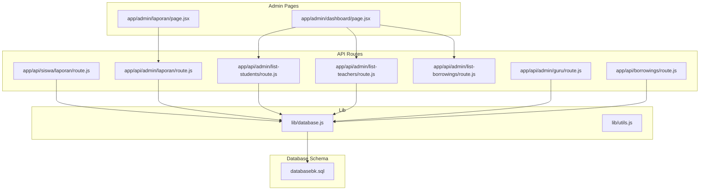
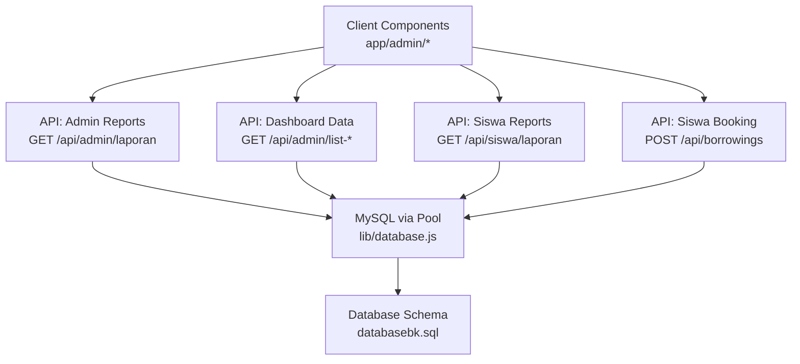
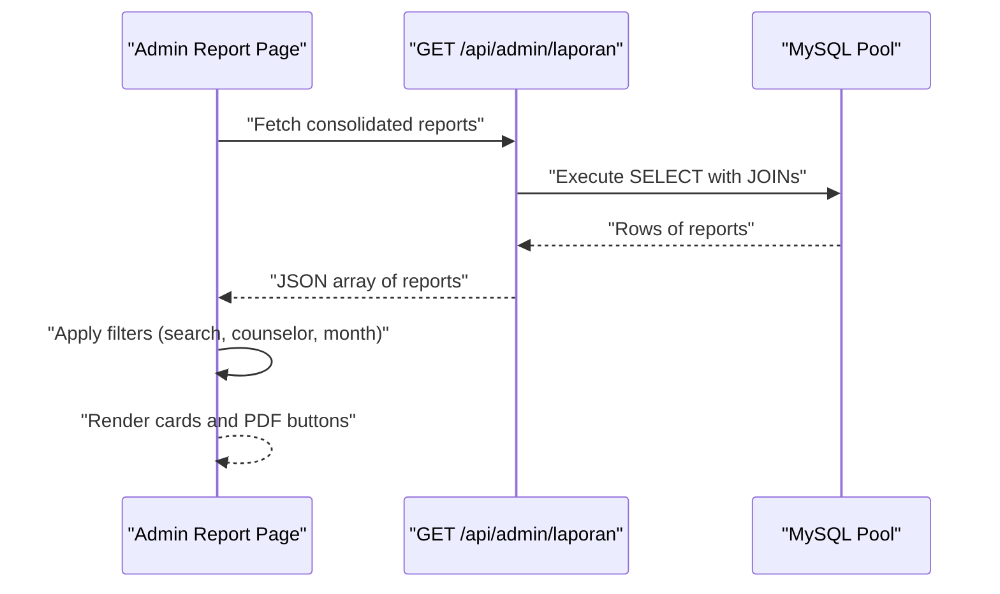
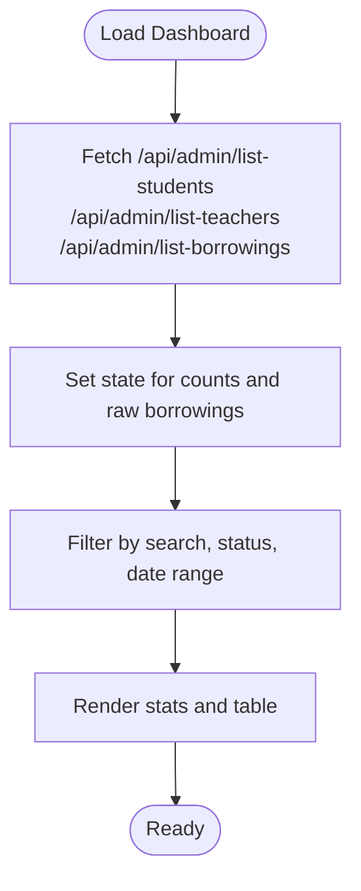
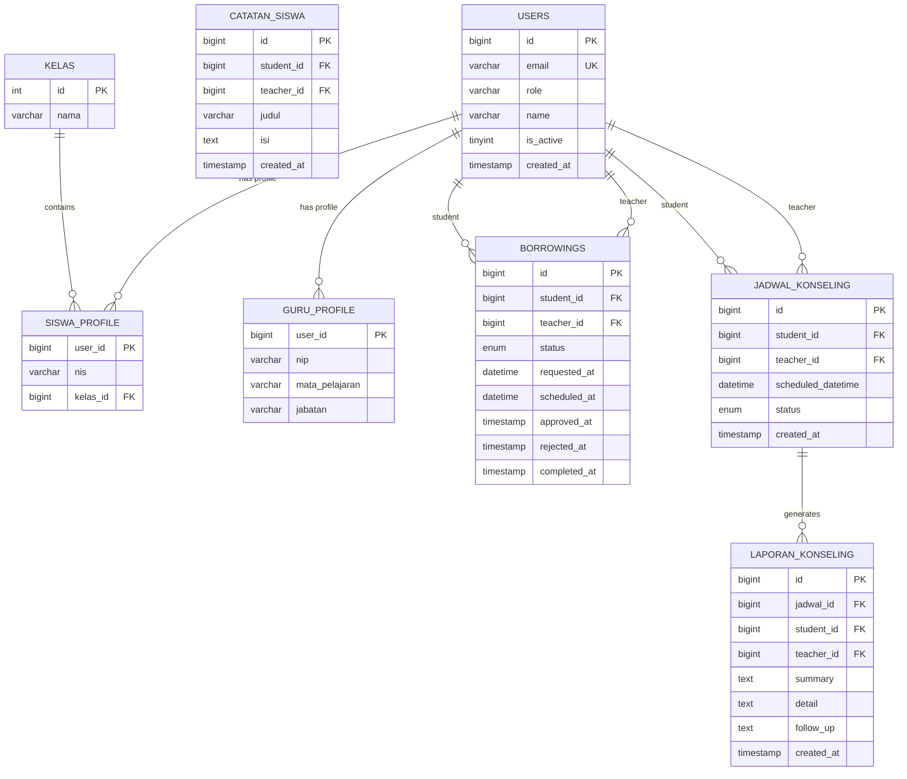
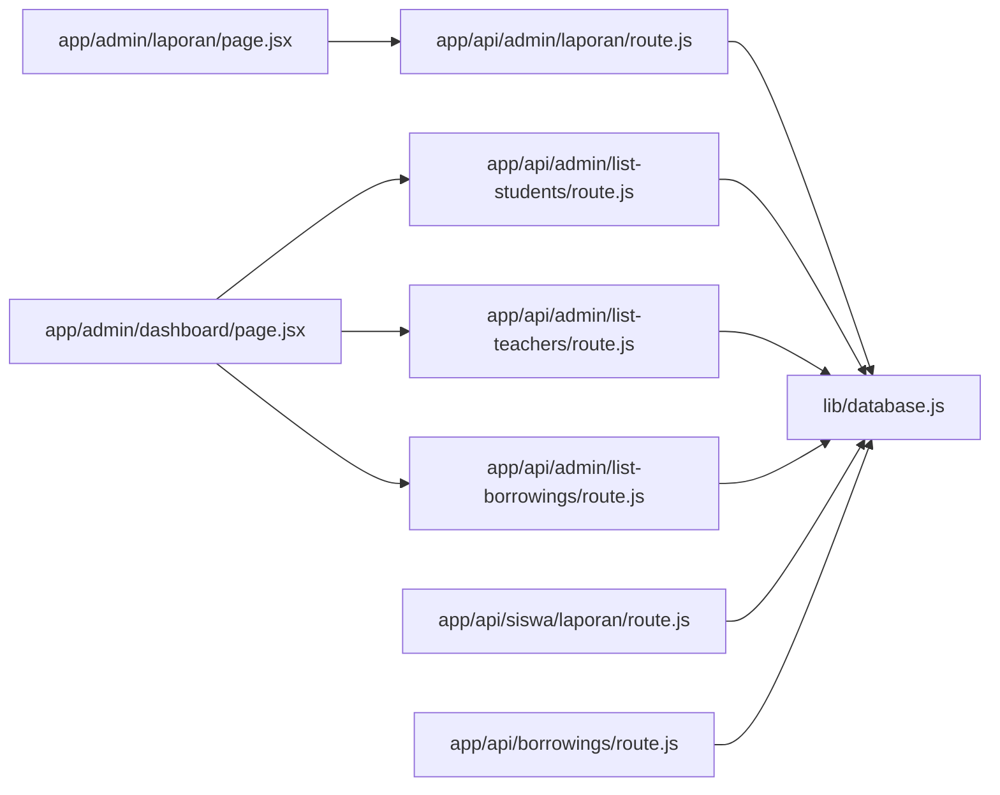

# Reporting & Analytics

<cite>
**Referenced Files in This Document**
- [app/admin/laporan/page.jsx](file://app/admin/laporan/page.jsx)
- [app/api/admin/laporan/route.js](file://app/api/admin/laporan/route.js)
- [app/admin/dashboard/page.jsx](file://app/admin/dashboard/page.jsx)
- [app/api/admin/list-students/route.js](file://app/api/admin/list-students/route.js)
- [app/api/admin/list-teachers/route.js](file://app/api/admin/list-teachers/route.js)
- [app/api/admin/guru/route.js](file://app/api/admin/guru/route.js)
- [app/api/admin/list-borrowings/route.js](file://app/api/admin/list-borrowings/route.js)
- [app/api/borrowings/route.js](file://app/api/borrowings/route.js)
- [app/api/siswa/laporan/route.js](file://app/api/siswa/laporan/route.js)
- [lib/database.js](file://lib/database.js)
- [lib/utils.js](file://lib/utils.js)
- [databasebk.sql](file://databasebk.sql)
</cite>

## Table of Contents
1. [Introduction](#introduction)
2. [Project Structure](#project-structure)
3. [Core Components](#core-components)
4. [Architecture Overview](#architecture-overview)
5. [Detailed Component Analysis](#detailed-component-analysis)
6. [Dependency Analysis](#dependency-analysis)
7. [Performance Considerations](#performance-considerations)
8. [Troubleshooting Guide](#troubleshooting-guide)
9. [Conclusion](#conclusion)
10. [Appendices](#appendices)

## Introduction
This document describes the Reporting and Analytics system for the school counseling platform. It focuses on:
- API endpoints for generating administrative reports (user statistics, appointment trends, counselor performance metrics, and system usage analytics)
- Report generation workflows, data aggregation, and export formats (PDF)
- Dashboard analytics integration, filtering, and presentation
- Guidance for extending the system to support CSV/Excel exports, automated scheduling, and advanced visualizations
- Performance optimization, caching strategies, and security considerations for sensitive data access

## Project Structure
The reporting and analytics functionality spans:
- Frontend pages under app/admin for dashboards and report listings
- API routes under app/api/admin and app/api/siswa for data retrieval and user-specific reports
- Database utilities under lib for connection pooling and query helpers
- Database schema under databasebk.sql defining core entities and relationships

**Diagram sources**
- [app/admin/laporan/page.jsx:1-195](file://app/admin/laporan/page.jsx#L1-L195)
- [app/admin/dashboard/page.jsx:1-255](file://app/admin/dashboard/page.jsx#L1-L255)
- [app/api/admin/laporan/route.js:1-29](file://app/api/admin/laporan/route.js#L1-L29)
- [app/api/admin/list-students/route.js:1-29](file://app/api/admin/list-students/route.js#L1-L29)
- [app/api/admin/list-teachers/route.js:1-29](file://app/api/admin/list-teachers/route.js#L1-L29)
- [app/api/admin/guru/route.js:1-92](file://app/api/admin/guru/route.js#L1-L92)
- [app/api/admin/list-borrowings/route.js:1-6](file://app/api/admin/list-borrowings/route.js#L1-L6)
- [app/api/siswa/laporan/route.js:1-51](file://app/api/siswa/laporan/route.js#L1-L51)
- [app/api/borrowings/route.js:1-81](file://app/api/borrowings/route.js#L1-L81)
- [lib/database.js:1-23](file://lib/database.js#L1-L23)
- [lib/utils.js:1-7](file://lib/utils.js#L1-L7)
- [databasebk.sql:1-200](file://databasebk.sql#L1-L200)

**Section sources**
- [app/admin/laporan/page.jsx:1-195](file://app/admin/laporan/page.jsx#L1-L195)
- [app/admin/dashboard/page.jsx:1-255](file://app/admin/dashboard/page.jsx#L1-L255)
- [app/api/admin/laporan/route.js:1-29](file://app/api/admin/laporan/route.js#L1-L29)
- [app/api/admin/list-students/route.js:1-29](file://app/api/admin/list-students/route.js#L1-L29)
- [app/api/admin/list-teachers/route.js:1-29](file://app/api/admin/list-teachers/route.js#L1-L29)
- [app/api/admin/guru/route.js:1-92](file://app/api/admin/guru/route.js#L1-L92)
- [app/api/admin/list-borrowings/route.js:1-6](file://app/api/admin/list-borrowings/route.js#L1-L6)
- [app/api/siswa/laporan/route.js:1-51](file://app/api/siswa/laporan/route.js#L1-L51)
- [app/api/borrowings/route.js:1-81](file://app/api/borrowings/route.js#L1-L81)
- [lib/database.js:1-23](file://lib/database.js#L1-L23)
- [lib/utils.js:1-7](file://lib/utils.js#L1-L7)
- [databasebk.sql:1-200](file://databasebk.sql#L1-L200)

## Core Components
- Admin Report Listing (PDF-ready): A client-side page that fetches consolidated counseling reports via an API, applies local filters (search, counselor, month), and renders printable PDFs per report or as a batch download.
- Admin Dashboard: Aggregates counts for students and counselors and displays borrowing history with client-side filtering and status badges.
- API Layer: Provides endpoints for:
  - Consolidated reports (admin)
  - Student and teacher lists (admin)
  - Counselor management (admin)
  - Borrowing requests (siswa)
  - Student-specific counseling reports (siswa)
- Database Utilities: Connection pooling and a convenience query helper.
- Database Schema: Defines entities such as users, profiles, borrowings, schedules, and counseling reports.

Key implementation references:
- Admin report listing and PDF rendering: [app/admin/laporan/page.jsx:61-195](file://app/admin/laporan/page.jsx#L61-L195)
- Admin consolidated reports endpoint: [app/api/admin/laporan/route.js:5-29](file://app/api/admin/laporan/route.js#L5-L29)
- Admin dashboard stats and filtering: [app/admin/dashboard/page.jsx:8-37](file://app/admin/dashboard/page.jsx#L8-L37), [app/admin/dashboard/page.jsx:40-71](file://app/admin/dashboard/page.jsx#L40-L71)
- Student and teacher listing endpoints: [app/api/admin/list-students/route.js:4-28](file://app/api/admin/list-students/route.js#L4-L28), [app/api/admin/list-teachers/route.js:4-28](file://app/api/admin/list-teachers/route.js#L4-L28)
- Counselor management endpoint: [app/api/admin/guru/route.js:8-25](file://app/api/admin/guru/route.js#L8-L25)
- Borrowing request endpoint (siswa): [app/api/borrowings/route.js:8-80](file://app/api/borrowings/route.js#L8-L80)
- Student-specific reports endpoint: [app/api/siswa/laporan/route.js:7-50](file://app/api/siswa/laporan/route.js#L7-L50)
- Database utilities: [lib/database.js:3-21](file://lib/database.js#L3-L21)

**Section sources**
- [app/admin/laporan/page.jsx:61-195](file://app/admin/laporan/page.jsx#L61-L195)
- [app/api/admin/laporan/route.js:5-29](file://app/api/admin/laporan/route.js#L5-L29)
- [app/admin/dashboard/page.jsx:8-37](file://app/admin/dashboard/page.jsx#L8-L37)
- [app/admin/dashboard/page.jsx:40-71](file://app/admin/dashboard/page.jsx#L40-L71)
- [app/api/admin/list-students/route.js:4-28](file://app/api/admin/list-students/route.js#L4-L28)
- [app/api/admin/list-teachers/route.js:4-28](file://app/api/admin/list-teachers/route.js#L4-L28)
- [app/api/admin/guru/route.js:8-25](file://app/api/admin/guru/route.js#L8-L25)
- [app/api/borrowings/route.js:8-80](file://app/api/borrowings/route.js#L8-L80)
- [app/api/siswa/laporan/route.js:7-50](file://app/api/siswa/laporan/route.js#L7-L50)
- [lib/database.js:3-21](file://lib/database.js#L3-L21)

## Architecture Overview
The system follows a layered architecture:
- Presentation layer: Next.js client components render dashboards and report lists with filtering and PDF export.
- API layer: Route handlers expose REST endpoints backed by MySQL via a connection pool.
- Data access layer: A shared database utility encapsulates connection pooling and query execution.
- Data model: The schema defines normalized entities for users, profiles, borrowings, schedules, and reports.

**Diagram sources**
- [app/admin/laporan/page.jsx:68-81](file://app/admin/laporan/page.jsx#L68-L81)
- [app/admin/dashboard/page.jsx:20-37](file://app/admin/dashboard/page.jsx#L20-L37)
- [app/api/admin/laporan/route.js:5-29](file://app/api/admin/laporan/route.js#L5-L29)
- [app/api/admin/list-students/route.js:4-28](file://app/api/admin/list-students/route.js#L4-L28)
- [app/api/admin/list-teachers/route.js:4-28](file://app/api/admin/list-teachers/route.js#L4-L28)
- [app/api/siswa/laporan/route.js:7-50](file://app/api/siswa/laporan/route.js#L7-L50)
- [app/api/borrowings/route.js:8-80](file://app/api/borrowings/route.js#L8-L80)
- [lib/database.js:3-21](file://lib/database.js#L3-L21)
- [databasebk.sql:1-200](file://databasebk.sql#L1-L200)

## Detailed Component Analysis

### Admin Report Listing (PDF)
- Fetches consolidated reports from the admin reports endpoint.
- Applies client-side filters: free-text search, counselor selection, and month/year.
- Renders report cards with summary, detail, and follow-up sections.
- Generates PDFs per report and as a batch download using @react-pdf/renderer.

**Diagram sources**
- [app/admin/laporan/page.jsx:68-98](file://app/admin/laporan/page.jsx#L68-L98)
- [app/api/admin/laporan/route.js:5-29](file://app/api/admin/laporan/route.js#L5-L29)

**Section sources**
- [app/admin/laporan/page.jsx:61-195](file://app/admin/laporan/page.jsx#L61-L195)
- [app/api/admin/laporan/route.js:5-29](file://app/api/admin/laporan/route.js#L5-L29)

### Admin Dashboard Analytics
- Loads student and teacher counts and borrowing history concurrently.
- Filters borrowing history by search term, status, and date range using useMemo for performance.
- Presents summarized stats and a searchable, filterable table.

**Diagram sources**
- [app/admin/dashboard/page.jsx:20-37](file://app/admin/dashboard/page.jsx#L20-L37)
- [app/admin/dashboard/page.jsx:40-71](file://app/admin/dashboard/page.jsx#L40-L71)

**Section sources**
- [app/admin/dashboard/page.jsx:8-37](file://app/admin/dashboard/page.jsx#L8-L37)
- [app/admin/dashboard/page.jsx:40-71](file://app/admin/dashboard/page.jsx#L40-L71)

### API Endpoints for Reporting and Analytics

#### Consolidated Counseling Reports (Admin)
- Endpoint: GET /api/admin/laporan
- Purpose: Return a unified list of counseling reports with associated schedule datetime, student name, and counselor name.
- Data aggregation: Single SQL query joining laporan_konseling, jadwal_konseling, users (student), and users (counselor).
- Output: Array of report records ordered by creation time.

**Section sources**
- [app/api/admin/laporan/route.js:5-29](file://app/api/admin/laporan/route.js#L5-L29)

#### Student and Teacher Lists (Admin)
- GET /api/admin/list-students: Returns student profiles with user details and class linkage.
- GET /api/admin/list-teachers: Returns counselor profiles with user details and subject/position.

**Section sources**
- [app/api/admin/list-students/route.js:4-28](file://app/api/admin/list-students/route.js#L4-L28)
- [app/api/admin/list-teachers/route.js:4-28](file://app/api/admin/list-teachers/route.js#L4-L28)

#### Counselor Management (Admin)
- GET /api/admin/guru: Returns active counselors with profile details.
- POST /api/admin/guru: Creates a new counselor with validation, hashing, and transactional inserts.

**Section sources**
- [app/api/admin/guru/route.js:8-25](file://app/api/admin/guru/route.js#L8-L25)
- [app/api/admin/guru/route.js:30-92](file://app/api/admin/guru/route.js#L30-L92)

#### Borrowing Requests (Siswa)
- POST /api/borrowings: Allows a logged-in student to submit a counseling booking request, validates availability, and persists the pending request.

**Section sources**
- [app/api/borrowings/route.js:8-80](file://app/api/borrowings/route.js#L8-L80)

#### Student-Specific Reports (Siswa)
- GET /api/siswa/laporan: Returns all counseling reports authored by the current student, joined with counselor names.

**Section sources**
- [app/api/siswa/laporan/route.js:7-50](file://app/api/siswa/laporan/route.js#L7-L50)

### Data Model and Relationships
The schema defines core entities and relationships used by the reporting system.

**Diagram sources**
- [databasebk.sql:24-183](file://databasebk.sql#L24-L183)

**Section sources**
- [databasebk.sql:24-183](file://databasebk.sql#L24-L183)

## Dependency Analysis
- Client components depend on API routes for data and on @react-pdf/renderer for PDF generation.
- API routes depend on lib/database.js for database connectivity.
- The admin report listing depends on the consolidated reports endpoint; the dashboard depends on student/teacher/borrowing endpoints.
- The schema defines foreign keys ensuring referential integrity across entities.

**Diagram sources**
- [app/admin/laporan/page.jsx:68-81](file://app/admin/laporan/page.jsx#L68-L81)
- [app/admin/dashboard/page.jsx:20-37](file://app/admin/dashboard/page.jsx#L20-L37)
- [app/api/admin/laporan/route.js:5-29](file://app/api/admin/laporan/route.js#L5-L29)
- [app/api/admin/list-students/route.js:4-28](file://app/api/admin/list-students/route.js#L4-L28)
- [app/api/admin/list-teachers/route.js:4-28](file://app/api/admin/list-teachers/route.js#L4-L28)
- [app/api/admin/list-borrowings/route.js:3-5](file://app/api/admin/list-borrowings/route.js#L3-L5)
- [app/api/siswa/laporan/route.js:7-50](file://app/api/siswa/laporan/route.js#L7-L50)
- [app/api/borrowings/route.js:8-80](file://app/api/borrowings/route.js#L8-L80)
- [lib/database.js:3-21](file://lib/database.js#L3-L21)

**Section sources**
- [app/admin/laporan/page.jsx:68-81](file://app/admin/laporan/page.jsx#L68-L81)
- [app/admin/dashboard/page.jsx:20-37](file://app/admin/dashboard/page.jsx#L20-L37)
- [app/api/admin/laporan/route.js:5-29](file://app/api/admin/laporan/route.js#L5-L29)
- [app/api/admin/list-students/route.js:4-28](file://app/api/admin/list-students/route.js#L4-L28)
- [app/api/admin/list-teachers/route.js:4-28](file://app/api/admin/list-teachers/route.js#L4-L28)
- [app/api/admin/list-borrowings/route.js:3-5](file://app/api/admin/list-borrowings/route.js#L3-L5)
- [app/api/siswa/laporan/route.js:7-50](file://app/api/siswa/laporan/route.js#L7-L50)
- [app/api/borrowings/route.js:8-80](file://app/api/borrowings/route.js#L8-L80)
- [lib/database.js:3-21](file://lib/database.js#L3-L21)

## Performance Considerations
- Database connection pooling: The pool is configured with a fixed limit and queue behavior to manage concurrent connections efficiently.
- Client-side filtering: useMemo is used to prevent unnecessary recomputation during dashboard filtering.
- Query optimization: The consolidated reports endpoint uses a single JOIN query to minimize round-trips.
- Recommendations for larger datasets:
  - Add database indexes on frequently filtered columns (e.g., jadwal_konseling.scheduled_datetime, laporan_konseling.created_at, users.role).
  - Paginate report listings on the server to reduce payload sizes.
  - Introduce server-side filtering parameters for date ranges and counselor filters.
  - Cache frequently accessed aggregates (counts, recent summaries) with TTL.

**Section sources**
- [lib/database.js:3-11](file://lib/database.js#L3-L11)
- [app/admin/dashboard/page.jsx:40-71](file://app/admin/dashboard/page.jsx#L40-L71)
- [app/api/admin/laporan/route.js:7-22](file://app/api/admin/laporan/route.js#L7-L22)

## Troubleshooting Guide
- Database errors: The query helper wraps errors and logs them; inspect the thrown error for SQL-related issues.
- Unauthorized access: Several endpoints check session roles; ensure proper authentication and role assignment.
- PDF generation failures: Verify that report data is present and structured as expected by the PDF renderer component.
- Empty borrowing history: The borrowing list endpoint currently returns an empty array; implement backend logic to serve borrowing records.

Common checks:
- Confirm environment variables for database credentials are set.
- Validate that the database schema matches the expected structure.
- Ensure client-side components handle loading and error states gracefully.

**Section sources**
- [lib/database.js:13-21](file://lib/database.js#L13-L21)
- [app/api/siswa/laporan/route.js:11-16](file://app/api/siswa/laporan/route.js#L11-L16)
- [app/api/borrowings/route.js:12-17](file://app/api/borrowings/route.js#L12-L17)
- [app/api/admin/list-borrowings/route.js:3-5](file://app/api/admin/list-borrowings/route.js#L3-L5)

## Conclusion
The Reporting and Analytics system provides:
- A consolidated view of counseling reports with PDF export
- Administrative dashboards for user counts and borrowing history
- Role-based endpoints for counselors and students
- A robust foundation for extending analytics, exporting to CSV/Excel, implementing automated scheduling, and integrating advanced visualizations

Future enhancements should focus on server-side pagination, caching, and richer analytics endpoints aligned with the existing schema.

## Appendices

### API Reference Summary
- GET /api/admin/laporan
  - Description: Returns consolidated counseling reports with schedule datetime, student, and counselor names.
  - Response: Array of report objects.
  - Section sources
    - [app/api/admin/laporan/route.js:5-29](file://app/api/admin/laporan/route.js#L5-L29)

- GET /api/admin/list-students
  - Description: Returns student profiles with user details and class linkage.
  - Response: Array of student records.
  - Section sources
    - [app/api/admin/list-students/route.js:4-28](file://app/api/admin/list-students/route.js#L4-L28)

- GET /api/admin/list-teachers
  - Description: Returns counselor profiles with user details and subject/position.
  - Response: Array of teacher records.
  - Section sources
    - [app/api/admin/list-teachers/route.js:4-28](file://app/api/admin/list-teachers/route.js#L4-L28)

- GET /api/admin/guru
  - Description: Returns active counselors with profile details.
  - Response: Object containing counselor data.
  - Section sources
    - [app/api/admin/guru/route.js:8-25](file://app/api/admin/guru/route.js#L8-L25)

- POST /api/admin/guru
  - Description: Creates a new counselor with validation and transactional inserts.
  - Request body: Includes name, email, password, phone, nip, mata_pelajaran, jabatan, bio.
  - Response: Success message and new user id.
  - Section sources
    - [app/api/admin/guru/route.js:30-92](file://app/api/admin/guru/route.js#L30-L92)

- POST /api/borrowings
  - Description: Allows a student to submit a counseling booking request.
  - Request body: Includes guru_id, tanggal, jam, alasan.
  - Response: Success or error with status code.
  - Section sources
    - [app/api/borrowings/route.js:8-80](file://app/api/borrowings/route.js#L8-L80)

- GET /api/siswa/laporan
  - Description: Returns all counseling reports authored by the current student.
  - Response: Object with success flag and data array.
  - Section sources
    - [app/api/siswa/laporan/route.js:7-50](file://app/api/siswa/laporan/route.js#L7-L50)

### Export Formats and Extensions
- Current support: PDF export per report and batch download via @react-pdf/renderer.
- Recommended extensions:
  - CSV/Excel: Add new API endpoints returning structured data for export.
  - Real-time updates: Integrate WebSocket or polling for live dashboards.
  - Historical analysis: Add server-side aggregation endpoints grouped by date ranges and counselor.

[No sources needed since this section provides general guidance]