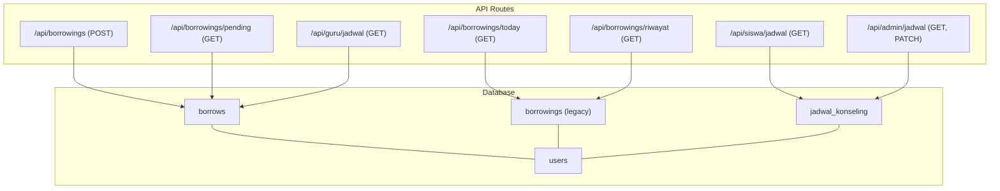
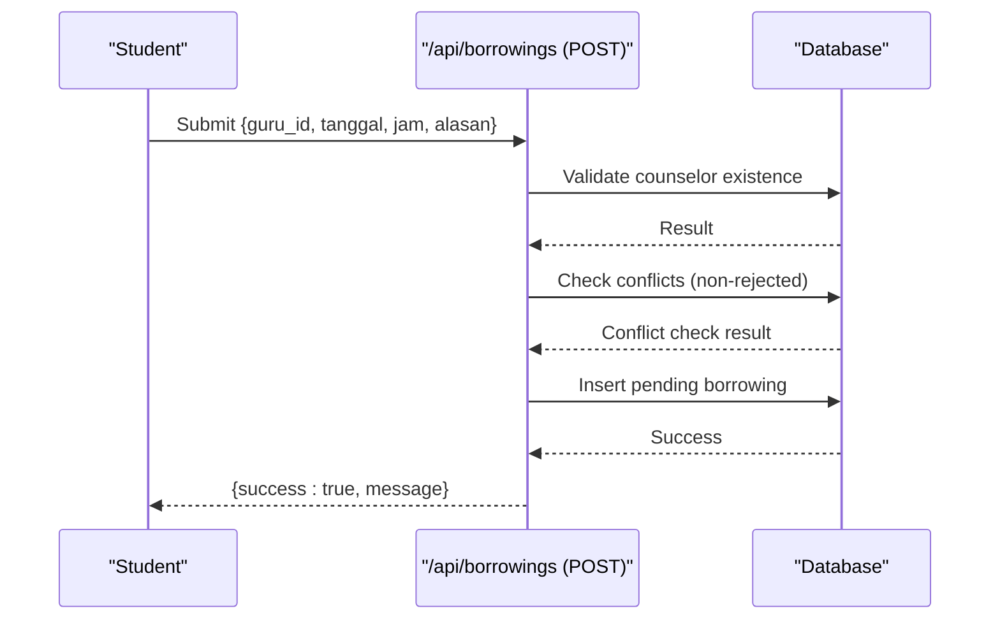
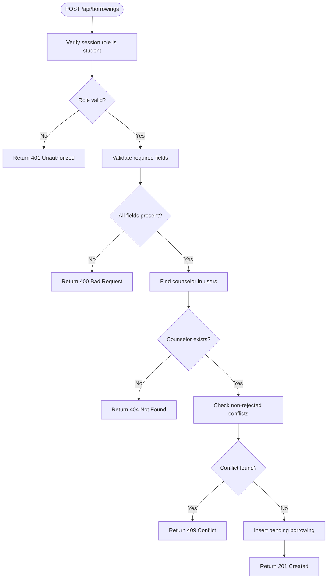
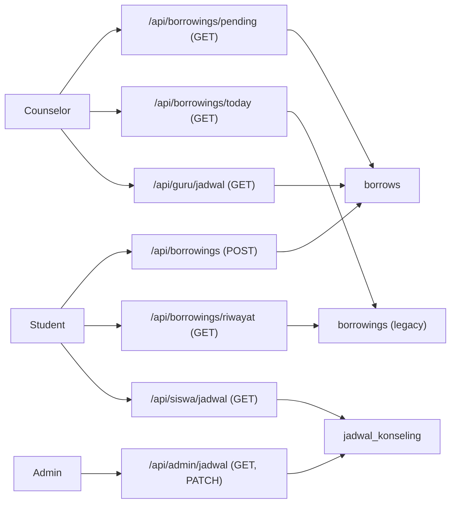
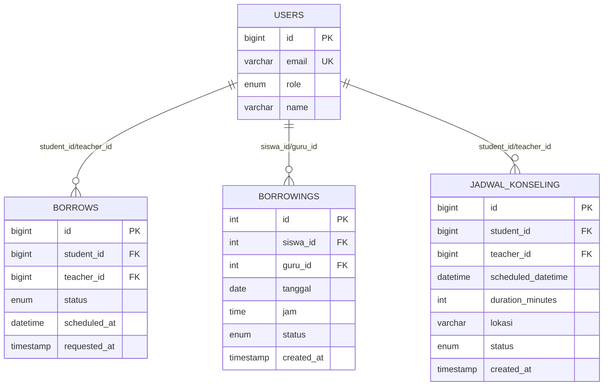

# Schedule Management

<cite>
**Referenced Files in This Document**
- [app/api/admin/jadwal/route.js](file://app/api/admin/jadwal/route.js)
- [app/api/borrowings/route.js](file://app/api/borrowings/route.js)
- [app/api/borrowings/pending/route.js](file://app/api/borrowings/pending/route.js)
- [app/api/borrowings/today/route.js](file://app/api/borrowings/today/route.js)
- [app/api/borrowings/riwayat/route.js](file://app/api/borrowings/riwayat/route.js)
- [app/api/guru/jadwal/route.js](file://app/api/guru/jadwal/route.js)
- [app/api/siswa/jadwal/route.js](file://app/api/siswa/jadwal/route.js)
- [lib/database.js](file://lib/database.js)
- [databasebk.sql](file://databasebk.sql)
</cite>

## Table of Contents
1. [Introduction](#introduction)
2. [Project Structure](#project-structure)
3. [Core Components](#core-components)
4. [Architecture Overview](#architecture-overview)
5. [Detailed Component Analysis](#detailed-component-analysis)
6. [Dependency Analysis](#dependency-analysis)
7. [Performance Considerations](#performance-considerations)
8. [Troubleshooting Guide](#troubleshooting-guide)
9. [Conclusion](#conclusion)
10. [Appendices](#appendices)

## Introduction
This document explains the Schedule Management functionality for the school counseling system. It covers the APIs for managing counseling schedules, including request submission, approval/rejection workflows, and schedule retrieval for students and counselors. It also documents conflict detection logic, availability checks, and integration points with the borrowing system. Where applicable, it outlines patterns for import/export, batch operations, calendar integration, conflict resolution, resource optimization, and real-time synchronization.

## Project Structure
The schedule management feature spans several API routes grouped by role and purpose:
- Borrowing requests and approvals: submit, pending review, today’s schedule, and history
- Counselor-specific schedule retrieval
- Student-specific schedule retrieval
- Admin overview of schedules
- Shared database utilities and schema

**Diagram sources**
- [app/api/borrowings/route.js:1-81](file://app/api/borrowings/route.js#L1-L81)
- [app/api/borrowings/pending/route.js:1-37](file://app/api/borrowings/pending/route.js#L1-L37)
- [app/api/borrowings/today/route.js:1-45](file://app/api/borrowings/today/route.js#L1-L45)
- [app/api/borrowings/riwayat/route.js:1-38](file://app/api/borrowings/riwayat/route.js#L1-L38)
- [app/api/guru/jadwal/route.js:1-48](file://app/api/guru/jadwal/route.js#L1-L48)
- [app/api/siswa/jadwal/route.js:1-44](file://app/api/siswa/jadwal/route.js#L1-L44)
- [app/api/admin/jadwal/route.js:1-38](file://app/api/admin/jadwal/route.js#L1-L38)
- [databasebk.sql:68-89](file://databasebk.sql#L68-L89)
- [databasebk.sql:324-338](file://databasebk.sql#L324-L338)
- [databasebk.sql:92-106](file://databasebk.sql#L92-L106)

**Section sources**
- [app/api/borrowings/route.js:1-81](file://app/api/borrowings/route.js#L1-L81)
- [app/api/borrowings/pending/route.js:1-37](file://app/api/borrowings/pending/route.js#L1-L37)
- [app/api/borrowings/today/route.js:1-45](file://app/api/borrowings/today/route.js#L1-L45)
- [app/api/borrowings/riwayat/route.js:1-38](file://app/api/borrowings/riwayat/route.js#L1-L38)
- [app/api/guru/jadwal/route.js:1-48](file://app/api/guru/jadwal/route.js#L1-L48)
- [app/api/siswa/jadwal/route.js:1-44](file://app/api/siswa/jadwal/route.js#L1-L44)
- [app/api/admin/jadwal/route.js:1-38](file://app/api/admin/jadwal/route.js#L1-L38)
- [databasebk.sql:68-89](file://databasebk.sql#L68-L89)
- [databasebk.sql:324-338](file://databasebk.sql#L324-L338)
- [databasebk.sql:92-106](file://databasebk.sql#L92-L106)

## Core Components
- Borrowing Request Submission: Validates requester role, ensures a valid counselor exists, checks for time conflicts excluding rejected entries, and inserts a pending request.
- Pending Requests for Counselors: Lists pending requests assigned to the logged-in counselor.
- Today’s Schedule for Counselors: Retrieves all borrowing entries for the counselor’s date.
- History for Students: Retrieves past borrowing records for the logged-in student.
- Counselor Schedule Retrieval: Fetches approved, scheduled borrowing entries for the counselor.
- Student Schedule Retrieval: Fetches personal counseling schedules.
- Admin Overview: Lists all counseling schedules with related user details and status.
- Database Utilities: Provides a shared MySQL connection pool and a convenience query wrapper.

Key data structures and constraints:
- Borrowing request table supports type, title, description, status lifecycle, timestamps, and optional scheduling fields.
- Legacy borrowing table stores date/time slots per counselor per day.
- Counseling schedule table stores scheduled datetime, duration, location, and status.

**Section sources**
- [app/api/borrowings/route.js:8-81](file://app/api/borrowings/route.js#L8-L81)
- [app/api/borrowings/pending/route.js:6-36](file://app/api/borrowings/pending/route.js#L6-L36)
- [app/api/borrowings/today/route.js:7-44](file://app/api/borrowings/today/route.js#L7-L44)
- [app/api/borrowings/riwayat/route.js:7-37](file://app/api/borrowings/riwayat/route.js#L7-L37)
- [app/api/guru/jadwal/route.js:7-47](file://app/api/guru/jadwal/route.js#L7-L47)
- [app/api/siswa/jadwal/route.js:5-43](file://app/api/siswa/jadwal/route.js#L5-L43)
- [app/api/admin/jadwal/route.js:5-38](file://app/api/admin/jadwal/route.js#L5-L38)
- [lib/database.js:1-23](file://lib/database.js#L1-L23)
- [databasebk.sql:68-89](file://databasebk.sql#L68-L89)
- [databasebk.sql:324-338](file://databasebk.sql#L324-L338)
- [databasebk.sql:92-106](file://databasebk.sql#L92-L106)

## Architecture Overview
The system separates concerns by role and operation:
- Student-facing endpoints handle request submission and schedule viewing.
- Counselor-facing endpoints handle pending review, daily schedule, and approved schedule retrieval.
- Admin endpoint aggregates schedules for oversight.
- Database schema supports both modern borrowing requests and legacy date/time slot entries.

**Diagram sources**
- [app/api/borrowings/route.js:8-81](file://app/api/borrowings/route.js#L8-L81)
- [databasebk.sql:324-338](file://databasebk.sql#L324-L338)

## Detailed Component Analysis

### Borrowing Request Submission (Student)
Purpose:
- Allow students to request counseling sessions by specifying a counselor, date, time, and reason.
- Enforce role-based access and input validation.
- Detect scheduling conflicts with non-rejected entries.
- Persist the request with a pending status.

Processing logic:
- Session validation restricts access to students.
- Input validation ensures required fields are present.
- Counselor existence is verified via users table.
- Conflict detection queries non-rejected borrowing entries for the same counselor at the same date/time.
- On success, insert a new borrowing record with pending status.

Conflict detection algorithm:
- Query borrowing records filtered by counselor ID, date, and time.
- Exclude records with rejected status to avoid blocking legitimate future requests.
- If any matching record exists, return a conflict error.

Availability checking:
- The conflict check acts as an availability gate; only when no non-rejected conflicts exist is the request accepted.

**Diagram sources**
- [app/api/borrowings/route.js:8-81](file://app/api/borrowings/route.js#L8-L81)
- [databasebk.sql:324-338](file://databasebk.sql#L324-L338)

**Section sources**
- [app/api/borrowings/route.js:8-81](file://app/api/borrowings/route.js#L8-L81)
- [databasebk.sql:324-338](file://databasebk.sql#L324-L338)

### Pending Requests (Counselor)
Purpose:
- Retrieve all pending borrowing requests assigned to the logged-in counselor.
- Join with student and class information for richer context.

Processing logic:
- Session validation restricts access to counselors.
- Query borrowing records filtered by teacher ID and status pending.
- Join with users, student profile, and class tables to enrich response.

**Section sources**
- [app/api/borrowings/pending/route.js:6-36](file://app/api/borrowings/pending/route.js#L6-L36)
- [databasebk.sql:68-89](file://databasebk.sql#L68-L89)

### Today’s Schedule (Counselor)
Purpose:
- Retrieve borrowing entries for the counselor’s date.
- Uses local date to align with WIB timezone.

Processing logic:
- Session validation restricts access to counselors.
- Build today’s date string and query borrowing records for the counselor and date.
- Join with student, student profile, and class tables.

**Section sources**
- [app/api/borrowings/today/route.js:7-44](file://app/api/borrowings/today/route.js#L7-L44)
- [databasebk.sql:324-338](file://databasebk.sql#L324-L338)

### History (Student)
Purpose:
- Retrieve historical borrowing records for the logged-in student.

Processing logic:
- Session validation restricts access to students.
- Query borrowing records for the student ID ordered by creation time descending.

**Section sources**
- [app/api/borrowings/riwayat/route.js:7-37](file://app/api/borrowings/riwayat/route.js#L7-L37)
- [databasebk.sql:324-338](file://databasebk.sql#L324-L338)

### Counselor Schedule Retrieval
Purpose:
- Fetch approved, scheduled borrowing entries for the counselor.

Processing logic:
- Session validation restricts access to counselors.
- Query borrowing records for the teacher ID where status is approved and scheduled_at is not null.
- Join with users to fetch student details.

**Section sources**
- [app/api/guru/jadwal/route.js:7-47](file://app/api/guru/jadwal/route.js#L7-L47)
- [databasebk.sql:68-89](file://databasebk.sql#L68-L89)

### Student Schedule Retrieval
Purpose:
- Fetch personal counseling schedules for the logged-in student.

Processing logic:
- Session validation restricts access to students.
- Query jadwal_konseling for the student ID ordered by scheduled datetime descending.
- Left join with users to fetch counselor name.

**Section sources**
- [app/api/siswa/jadwal/route.js:5-43](file://app/api/siswa/jadwal/route.js#L5-L43)
- [databasebk.sql:92-106](file://databasebk.sql#L92-L106)

### Admin Overview
Purpose:
- List all counseling schedules with related user details and status.

Processing logic:
- Query jadwal_konseling joined with users for both student and counselor names.
- Order by scheduled datetime descending.

Status update:
- PATCH endpoint updates the status of a schedule entry.

**Section sources**
- [app/api/admin/jadwal/route.js:5-38](file://app/api/admin/jadwal/route.js#L5-L38)
- [databasebk.sql:92-106](file://databasebk.sql#L92-L106)

### Database Utilities
Purpose:
- Provide a shared MySQL connection pool and a convenience query wrapper.

Features:
- Connection pooling with configurable limits.
- Centralized error handling for queries.

**Section sources**
- [lib/database.js:1-23](file://lib/database.js#L1-L23)

## Dependency Analysis
The following diagram shows how API routes depend on the database schema and each other conceptually.

**Diagram sources**
- [app/api/borrowings/route.js:1-81](file://app/api/borrowings/route.js#L1-L81)
- [app/api/borrowings/pending/route.js:1-37](file://app/api/borrowings/pending/route.js#L1-L37)
- [app/api/borrowings/today/route.js:1-45](file://app/api/borrowings/today/route.js#L1-L45)
- [app/api/borrowings/riwayat/route.js:1-38](file://app/api/borrowings/riwayat/route.js#L1-L38)
- [app/api/guru/jadwal/route.js:1-48](file://app/api/guru/jadwal/route.js#L1-L48)
- [app/api/siswa/jadwal/route.js:1-44](file://app/api/siswa/jadwal/route.js#L1-L44)
- [app/api/admin/jadwal/route.js:1-38](file://app/api/admin/jadwal/route.js#L1-L38)
- [databasebk.sql:68-89](file://databasebk.sql#L68-L89)
- [databasebk.sql:324-338](file://databasebk.sql#L324-L338)
- [databasebk.sql:92-106](file://databasebk.sql#L92-L106)

**Section sources**
- [app/api/borrowings/route.js:1-81](file://app/api/borrowings/route.js#L1-L81)
- [app/api/borrowings/pending/route.js:1-37](file://app/api/borrowings/pending/route.js#L1-L37)
- [app/api/borrowings/today/route.js:1-45](file://app/api/borrowings/today/route.js#L1-L45)
- [app/api/borrowings/riwayat/route.js:1-38](file://app/api/borrowings/riwayat/route.js#L1-L38)
- [app/api/guru/jadwal/route.js:1-48](file://app/api/guru/jadwal/route.js#L1-L48)
- [app/api/siswa/jadwal/route.js:1-44](file://app/api/siswa/jadwal/route.js#L1-L44)
- [app/api/admin/jadwal/route.js:1-38](file://app/api/admin/jadwal/route.js#L1-L38)
- [databasebk.sql:68-89](file://databasebk.sql#L68-L89)
- [databasebk.sql:324-338](file://databasebk.sql#L324-L338)
- [databasebk.sql:92-106](file://databasebk.sql#L92-L106)

## Performance Considerations
- Indexes: The schema includes indexes on frequently queried columns (e.g., users role, borrowing student/teacher/status, jadwal student/teacher). These support efficient filtering and joins in the API routes.
- Connection Pooling: The database utility provides a connection pool to manage concurrent queries efficiently.
- Query Scope: Routes limit result sets using filters (role, status, date) to reduce payload sizes and improve responsiveness.

Recommendations:
- Add composite indexes for common filter combinations (e.g., borrowing teacher+status, jadwal student+status).
- Consider pagination for admin overview and history endpoints to cap response sizes.
- Normalize repeated joins (student profile/class) to reduce query complexity where appropriate.

**Section sources**
- [databasebk.sql:198-211](file://databasebk.sql#L198-L211)
- [lib/database.js:3-11](file://lib/database.js#L3-L11)

## Troubleshooting Guide
Common issues and resolutions:
- Unauthorized Access: Several routes enforce role-based access. Ensure the session matches the required role (student, counselor, admin). Return status 401 Unauthorized indicates incorrect permissions.
- Validation Failures: Missing required fields trigger a 400 Bad Request. Verify client sends guru_id, tanggal, jam, and alasan.
- Counselor Not Found: If the counselor ID does not exist or is not a user with role guru, expect a 404 Not Found.
- Conflict Detected: If another non-rejected borrowing exists at the same date/time for the counselor, a 409 Conflict is returned. Adjust timing or wait until the conflicting booking is resolved.
- Server Errors: Internal errors return 500 with an error message. Check server logs and database connectivity.

**Section sources**
- [app/api/borrowings/route.js:12-28](file://app/api/borrowings/route.js#L12-L28)
- [app/api/borrowings/route.js:36-41](file://app/api/borrowings/route.js#L36-L41)
- [app/api/borrowings/route.js:54-59](file://app/api/borrowings/route.js#L54-L59)
- [app/api/borrowings/route.js:73-79](file://app/api/borrowings/route.js#L73-L79)
- [app/api/borrowings/pending/route.js:9-11](file://app/api/borrowings/pending/route.js#L9-L11)
- [app/api/borrowings/today/route.js:9-11](file://app/api/borrowings/today/route.js#L9-L11)
- [app/api/borrowings/riwayat/route.js:9-11](file://app/api/borrowings/riwayat/route.js#L9-L11)
- [app/api/guru/jadwal/route.js:11-13](file://app/api/guru/jadwal/route.js#L11-L13)
- [app/api/siswa/jadwal/route.js:10-14](file://app/api/siswa/jadwal/route.js#L10-L14)
- [app/api/admin/jadwal/route.js:22-24](file://app/api/admin/jadwal/route.js#L22-L24)

## Conclusion
The Schedule Management subsystem integrates student request submission, counselor review and scheduling, and admin oversight. It leverages role-based access control, conflict detection against non-rejected entries, and a normalized database schema. While the current implementation focuses on CRUD-like operations and basic conflict checks, extending it with import/export, batch scheduling, calendar sync, and advanced resource optimization would further enhance operational efficiency.

## Appendices

### API Definitions

- POST /api/borrowings
  - Purpose: Submit a counseling request.
  - Authentication: Student required.
  - Body: { guru_id, tanggal, jam, alasan }.
  - Responses:
    - 201 Created on success.
    - 400 Bad Request on validation failure.
    - 401 Unauthorized if not a student.
    - 404 Not Found if counselor not found.
    - 409 Conflict if a non-rejected conflict exists.
    - 500 Internal Server Error on failure.

- GET /api/borrowings/pending
  - Purpose: List pending requests assigned to the counselor.
  - Authentication: Counselor required.
  - Responses:
    - 200 OK with data array.
    - 401 Unauthorized otherwise.
    - 500 Internal Server Error on failure.

- GET /api/borrowings/today
  - Purpose: List borrowing entries for the counselor’s date.
  - Authentication: Counselor required.
  - Responses:
    - 200 OK with data array.
    - 401 Unauthorized otherwise.
    - 500 Internal Server Error on failure.

- GET /api/borrowings/riwayat
  - Purpose: List historical borrowing records for the student.
  - Authentication: Student required.
  - Responses:
    - 200 OK with data array.
    - 401 Unauthorized otherwise.
    - 500 Internal Server Error on failure.

- GET /api/guru/jadwal
  - Purpose: Retrieve approved, scheduled borrowing entries for the counselor.
  - Authentication: Counselor required.
  - Responses:
    - 200 OK with { success: true, jadwal }.
    - 401 Unauthorized otherwise.
    - 500 Internal Server Error on failure.

- GET /api/siswa/jadwal
  - Purpose: Retrieve personal counseling schedules for the student.
  - Authentication: Student required.
  - Responses:
    - 200 OK with { success: true, jadwal }.
    - 401 Unauthorized otherwise.
    - 500 Internal Server Error on failure.

- GET /api/admin/jadwal
  - Purpose: List all counseling schedules with user details.
  - Authentication: Admin required.
  - Responses:
    - 200 OK with array of schedules.
    - 500 Internal Server Error on failure.

- PATCH /api/admin/jadwal
  - Purpose: Update the status of a schedule entry.
  - Authentication: Admin required.
  - Path Params: { id }.
  - Body: { status }.
  - Responses:
    - 200 OK with { message: "Status updated" }.
    - 500 Internal Server Error on failure.

**Section sources**
- [app/api/borrowings/route.js:8-81](file://app/api/borrowings/route.js#L8-L81)
- [app/api/borrowings/pending/route.js:6-36](file://app/api/borrowings/pending/route.js#L6-L36)
- [app/api/borrowings/today/route.js:7-44](file://app/api/borrowings/today/route.js#L7-L44)
- [app/api/borrowings/riwayat/route.js:7-37](file://app/api/borrowings/riwayat/route.js#L7-L37)
- [app/api/guru/jadwal/route.js:7-47](file://app/api/guru/jadwal/route.js#L7-L47)
- [app/api/siswa/jadwal/route.js:5-43](file://app/api/siswa/jadwal/route.js#L5-L43)
- [app/api/admin/jadwal/route.js:5-38](file://app/api/admin/jadwal/route.js#L5-L38)

### Data Model Overview

**Diagram sources**
- [databasebk.sql:25-38](file://databasebk.sql#L25-L38)
- [databasebk.sql:301-321](file://databasebk.sql#L301-L321)
- [databasebk.sql:326-338](file://databasebk.sql#L326-L338)
- [databasebk.sql:94-106](file://databasebk.sql#L94-L106)