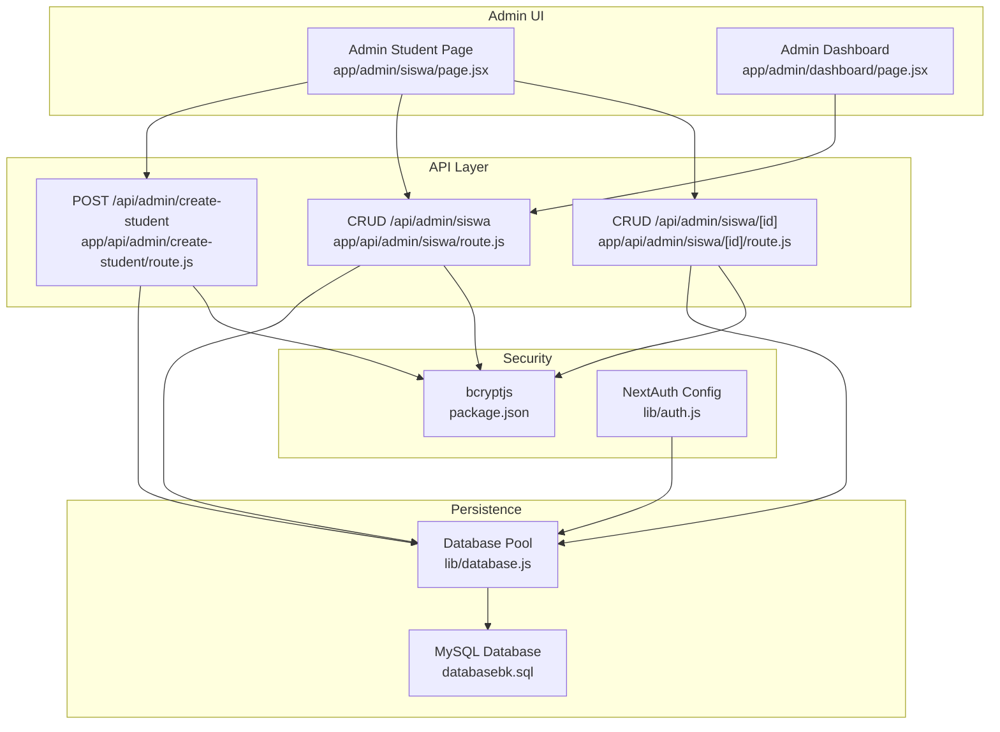
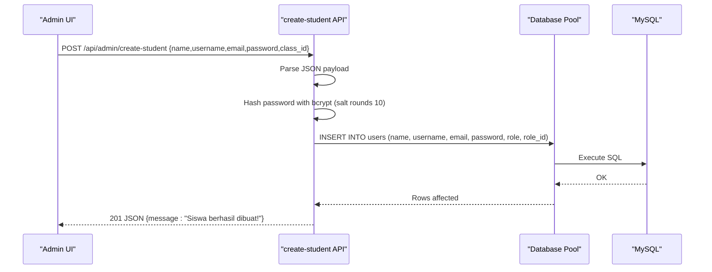
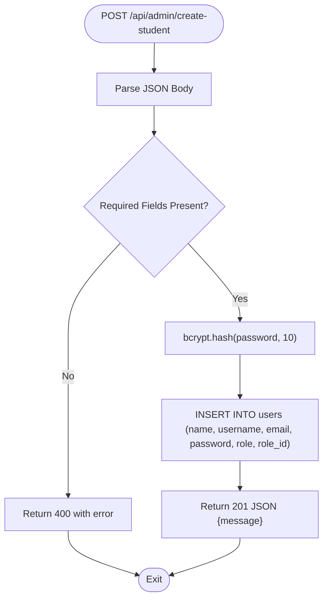
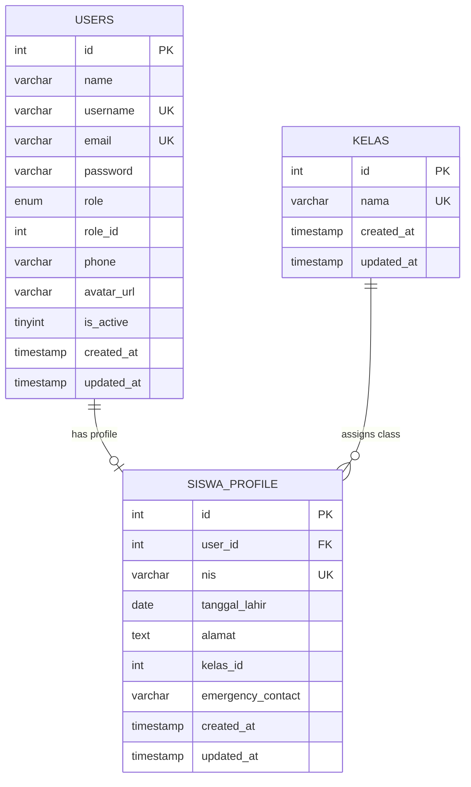
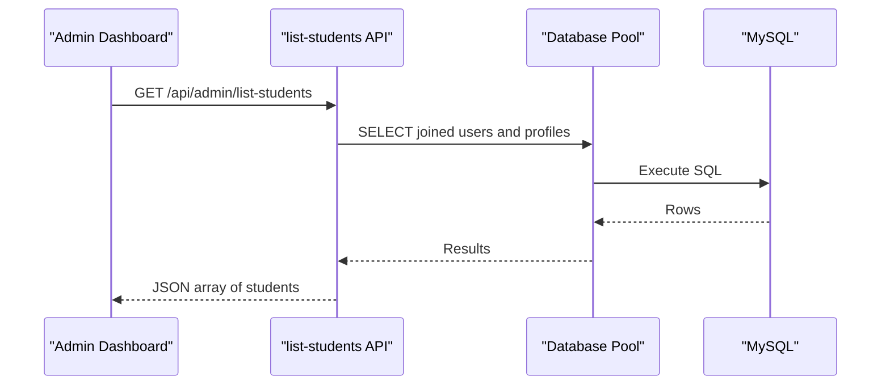
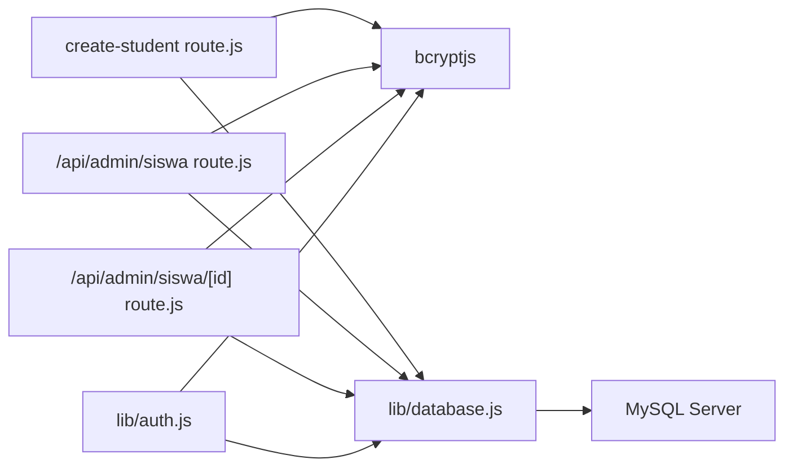

# Student Enrollment

<cite>
**Referenced Files in This Document**
- [route.js](file://app/api/admin/create-student/route.js)
- [database.js](file://lib/database.js)
- [databasebk.sql](file://databasebk.sql)
- [route.js](file://app/api/admin/siswa/route.js)
- [route.js](file://app/api/admin/siswa/[id]/route.js)
- [page.jsx](file://app/admin/siswa/page.jsx)
- [page.jsx](file://app/admin/dashboard/page.jsx)
- [auth.js](file://lib/auth.js)
- [package.json](file://package.json)
</cite>

## Table of Contents
1. [Introduction](#introduction)
2. [Project Structure](#project-structure)
3. [Core Components](#core-components)
4. [Architecture Overview](#architecture-overview)
5. [Detailed Component Analysis](#detailed-component-analysis)
6. [Dependency Analysis](#dependency-analysis)
7. [Performance Considerations](#performance-considerations)
8. [Troubleshooting Guide](#troubleshooting-guide)
9. [Conclusion](#conclusion)
10. [Appendices](#appendices)

## Introduction
This document describes the Student Enrollment system focusing on the administrative process to create student accounts. It specifies the API endpoint for creating students, required request parameters, password hashing, database insertion behavior, validation rules, error handling, and integration patterns with the admin dashboard interface.

## Project Structure
The enrollment feature spans frontend and backend components:
- Frontend: Admin student management page handles form submission and displays lists.
- Backend: API routes manage student creation, updates, deletions, and listings.
- Persistence: MySQL database with normalized tables for users and student profiles.
- Security: Password hashing via bcrypt and authentication via NextAuth.

**Diagram sources**
- [page.jsx:1-338](file://app/admin/siswa/page.jsx#L1-L338)
- [page.jsx:1-255](file://app/admin/dashboard/page.jsx#L1-L255)
- [route.js:1-22](file://app/api/admin/create-student/route.js#L1-L22)
- [route.js:1-140](file://app/api/admin/siswa/route.js#L1-L140)
- [route.js:1-150](file://app/api/admin/siswa/[id]/route.js#L1-L150)
- [database.js:1-23](file://lib/database.js#L1-L23)
- [databasebk.sql:251-264](file://databasebk.sql#L251-L264)
- [auth.js:1-77](file://lib/auth.js#L1-L77)
- [package.json:11-34](file://package.json#L11-L34)

**Section sources**
- [page.jsx:1-338](file://app/admin/siswa/page.jsx#L1-L338)
- [page.jsx:1-255](file://app/admin/dashboard/page.jsx#L1-L255)
- [route.js:1-22](file://app/api/admin/create-student/route.js#L1-L22)
- [route.js:1-140](file://app/api/admin/siswa/route.js#L1-L140)
- [route.js:1-150](file://app/api/admin/siswa/[id]/route.js#L1-L150)
- [database.js:1-23](file://lib/database.js#L1-L23)
- [databasebk.sql:251-264](file://databasebk.sql#L251-L264)
- [auth.js:1-77](file://lib/auth.js#L1-L77)
- [package.json:11-34](file://package.json#L11-L34)

## Core Components
- API Endpoint: POST /api/admin/create-student
- Request Payload: name, username, email, password, class_id
- Password Hashing: bcrypt with salt rounds 10
- Database Insertion: users table with role='siswa' and role_id=3
- Validation: Unique constraints enforced at database level (email, username)
- Error Handling: Centralized try/catch returning JSON errors with appropriate status codes
- Success Response: JSON message indicating successful creation

Note: The frontend student management page uses a different endpoint (/api/admin/siswa) for listing and CRUD operations. The create-student endpoint is intended for direct creation flows.

**Section sources**
- [route.js:5-21](file://app/api/admin/create-student/route.js#L5-L21)
- [database.js:13-21](file://lib/database.js#L13-L21)
- [databasebk.sql:251-264](file://databasebk.sql#L251-L264)

## Architecture Overview
The system follows a layered architecture:
- Presentation: React client-side pages render forms and lists.
- API: Route handlers process requests, validate inputs, and orchestrate database operations.
- Persistence: MySQL stores user and student profile data.
- Security: bcrypt hashes passwords; NextAuth manages authentication sessions.

**Diagram sources**
- [route.js:5-21](file://app/api/admin/create-student/route.js#L5-L21)
- [database.js:13-21](file://lib/database.js#L13-L21)
- [databasebk.sql:251-264](file://databasebk.sql#L251-L264)

## Detailed Component Analysis

### API: POST /api/admin/create-student
Purpose: Create a new student account with validated inputs and secure password storage.

Processing Logic:
- Extract name, username, email, password, class_id from request body
- Hash password using bcrypt with 10 salt rounds
- Insert into users table with role='siswa' and role_id=3
- Return success message on completion

Validation and Constraints:
- Unique constraints enforced at database level for email and username
- Role and role_id are set server-side during insertion

Error Handling:
- Try/catch around the entire operation
- Returns JSON error with 500 status on failure

Success Response:
- JSON object with message field

**Diagram sources**
- [route.js:5-21](file://app/api/admin/create-student/route.js#L5-L21)

**Section sources**
- [route.js:5-21](file://app/api/admin/create-student/route.js#L5-L21)
- [database.js:13-21](file://lib/database.js#L13-L21)
- [databasebk.sql:251-264](file://databasebk.sql#L251-L264)

### Database Schema and Constraints
Key tables and constraints relevant to student enrollment:
- users: enforces unique email and username; role defaults to 'siswa' with role_id default 3
- siswa_profile: maintains student-specific attributes linked to users via foreign key

**Diagram sources**
- [databasebk.sql:251-264](file://databasebk.sql#L251-L264)
- [databasebk.sql:269-281](file://databasebk.sql#L269-L281)
- [databasebk.sql:448-452](file://databasebk.sql#L448-L452)

**Section sources**
- [databasebk.sql:251-264](file://databasebk.sql#L251-L264)
- [databasebk.sql:269-281](file://databasebk.sql#L269-L281)
- [databasebk.sql:448-452](file://databasebk.sql#L448-L452)

### Admin Dashboard Integration
The admin dashboard integrates with the student management API to present counts and filtered lists. While the create-student endpoint is separate, the dashboard relies on list-students and other admin APIs to visualize enrolled students.

**Diagram sources**
- [page.jsx:20-37](file://app/admin/dashboard/page.jsx#L20-L37)
- [route.js:4-28](file://app/api/admin/list-students/route.js#L4-L28)

**Section sources**
- [page.jsx:1-255](file://app/admin/dashboard/page.jsx#L1-L255)
- [route.js:1-29](file://app/api/admin/list-students/route.js#L1-L29)

## Dependency Analysis
External libraries and their roles:
- bcryptjs: Password hashing for secure credential storage
- mysql2/promise: Asynchronous MySQL driver and connection pooling
- next/server: Next.js server runtime for API responses
- next-auth: Authentication provider and session management

**Diagram sources**
- [route.js:1-3](file://app/api/admin/create-student/route.js#L1-L3)
- [route.js:3-5](file://app/api/admin/siswa/route.js#L3-L5)
- [route.js:3-5](file://app/api/admin/siswa/[id]/route.js#L3-L5)
- [database.js:1-1](file://lib/database.js#L1-L1)
- [auth.js:1-4](file://lib/auth.js#L1-L4)
- [package.json:11-34](file://package.json#L11-L34)

**Section sources**
- [package.json:11-34](file://package.json#L11-L34)
- [route.js:1-3](file://app/api/admin/create-student/route.js#L1-L3)
- [route.js:3-5](file://app/api/admin/siswa/route.js#L3-L5)
- [route.js:3-5](file://app/api/admin/siswa/[id]/route.js#L3-L5)
- [database.js:1-1](file://lib/database.js#L1-L1)
- [auth.js:1-4](file://lib/auth.js#L1-L4)

## Performance Considerations
- Connection pooling: The database library creates a pool to manage concurrent connections efficiently.
- Indexes: Database schema includes indexes on role, email, username, and other frequently queried columns to improve lookup performance.
- Transaction safety: Student CRUD endpoints wrap operations in transactions to maintain data consistency.

[No sources needed since this section provides general guidance]

## Troubleshooting Guide
Common error scenarios and resolutions:
- Duplicate email or username: Database unique constraints trigger constraint violation errors. Ensure uniqueness before submission.
- Missing required fields: Validation checks return 400 errors when essential fields are absent.
- Database connectivity issues: Errors thrown by the database pool propagate to the API, resulting in 500 responses.
- Authentication failures: Incorrect credentials lead to null authorization in NextAuth.

Practical steps:
- Verify environment variables for database credentials.
- Confirm bcryptjs is installed and imported correctly.
- Check network connectivity to the MySQL server.
- Review logs for detailed error messages returned by the API.

**Section sources**
- [route.js:18-20](file://app/api/admin/create-student/route.js#L18-L20)
- [database.js:17-20](file://lib/database.js#L17-L20)
- [databasebk.sql:251-264](file://databasebk.sql#L251-L264)
- [auth.js:14-42](file://lib/auth.js#L14-L42)

## Conclusion
The Student Enrollment system provides a secure and robust pathway for administrators to create student accounts. By enforcing unique constraints, hashing passwords, and maintaining normalized database tables, the system ensures data integrity and security. The admin dashboard integrates seamlessly with the underlying APIs to present actionable insights and manage student records effectively.

[No sources needed since this section summarizes without analyzing specific files]

## Appendices

### API Reference: POST /api/admin/create-student
- Method: POST
- Path: /api/admin/create-student
- Content-Type: application/json
- Required fields:
  - name (string)
  - username (string)
  - email (string)
  - password (string)
  - class_id (integer, optional)
- Success response:
  - Status: 201 Created
  - Body: JSON object with message field
- Error responses:
  - Status: 500 Internal Server Error
  - Body: JSON object with error field

**Section sources**
- [route.js:5-21](file://app/api/admin/create-student/route.js#L5-L21)

### Password Hashing Details
- Library: bcryptjs
- Rounds: 10
- Mechanism: Hash password synchronously before insertion into the users table

**Section sources**
- [route.js:9-9](file://app/api/admin/create-student/route.js#L9-L9)
- [route.js:103-103](file://app/api/admin/siswa/route.js#L103-L103)
- [route.js:61-62](file://app/api/admin/siswa/[id]/route.js#L61-L62)

### Database Insertion Behavior
- Target table: users
- Automatic role assignment: role='siswa'
- Automatic role_id assignment: role_id=3
- Additional fields: name, username, email, password (hashed)

**Section sources**
- [route.js:11-15](file://app/api/admin/create-student/route.js#L11-L15)
- [databasebk.sql:251-264](file://databasebk.sql#L251-L264)

### Validation Rules
- Unique constraints:
  - email: unique index in users table
  - username: unique index in users table
- Optional class_id linkage to kelas table via foreign key in siswa_profile

**Section sources**
- [databasebk.sql:251-264](file://databasebk.sql#L251-L264)
- [databasebk.sql:269-281](file://databasebk.sql#L269-L281)

### Integration Patterns with Admin Dashboard
- Admin student page:
  - Loads student and class lists concurrently
  - Submits new student data to /api/admin/siswa
  - Displays success/error notifications
- Admin dashboard:
  - Fetches student counts and borrowing history
  - Uses filtering and search to refine displayed data

**Section sources**
- [page.jsx:32-52](file://app/admin/siswa/page.jsx#L32-L52)
- [page.jsx:54-88](file://app/admin/siswa/page.jsx#L54-L88)
- [page.jsx:20-37](file://app/admin/dashboard/page.jsx#L20-L37)