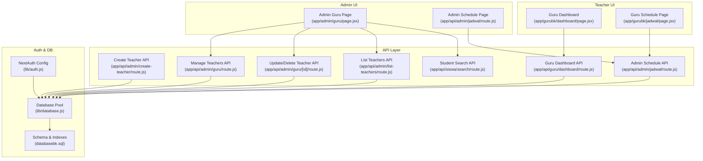
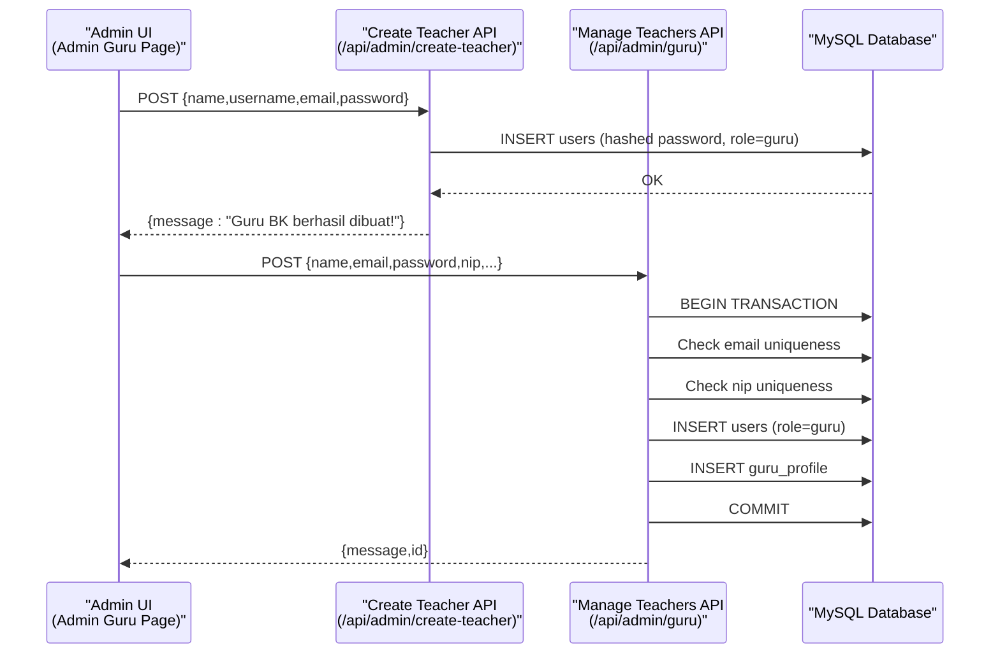
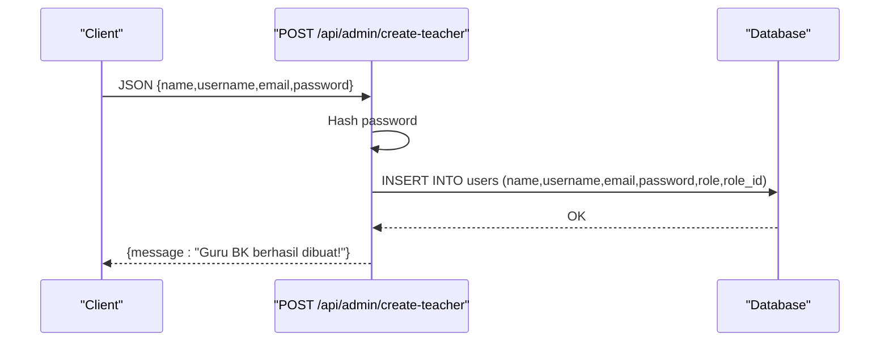
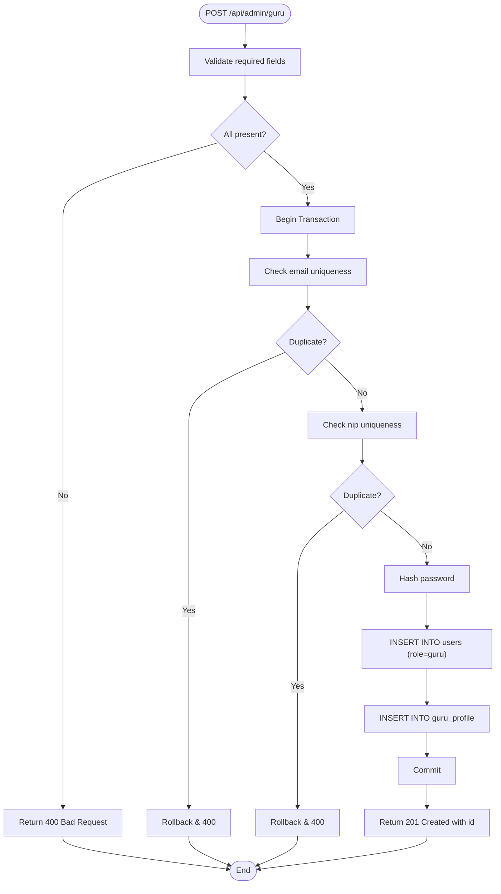
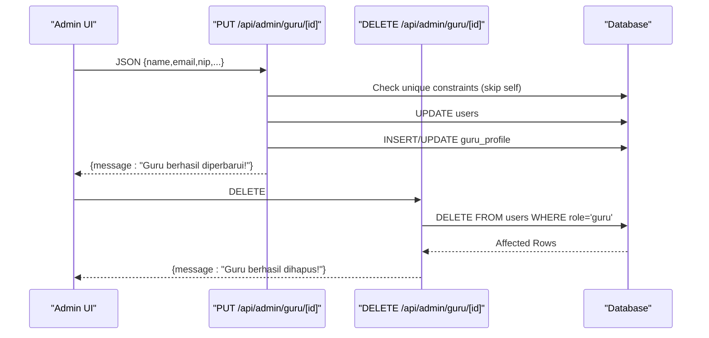
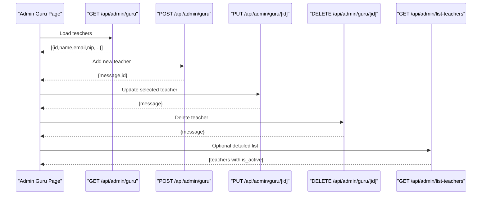
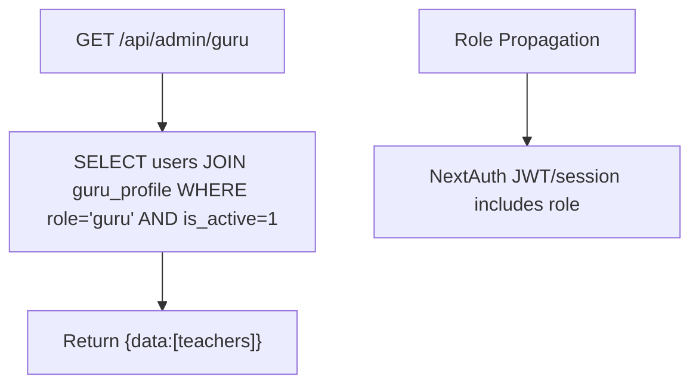
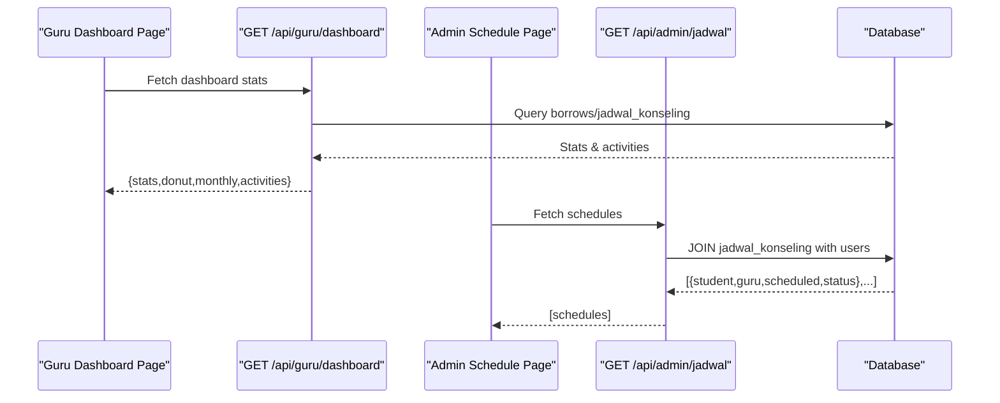
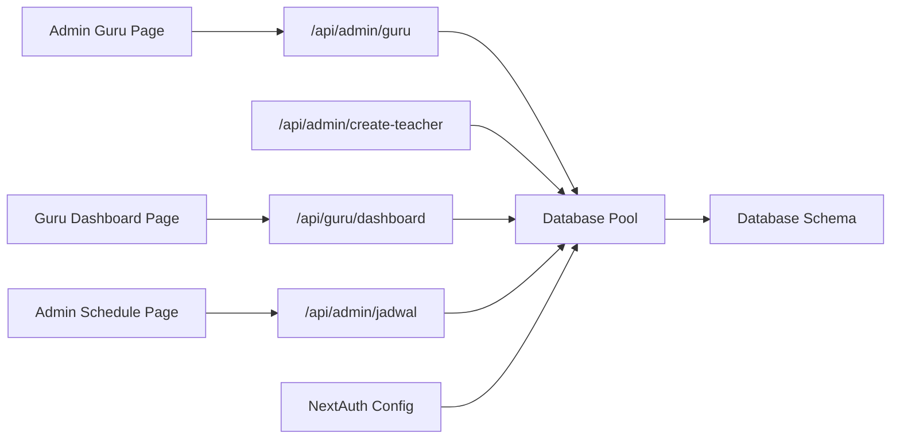

# Teacher Assignment

<cite>
**Referenced Files in This Document**
- [route.js](file://app/api/admin/create-teacher/route.js)
- [page.jsx](file://app/admin/guru/page.jsx)
- [route.js](file://app/api/admin/guru/route.js)
- [route.js](file://app/api/admin/guru/[id]/route.js)
- [route.js](file://app/api/admin/list-teachers/route.js)
- [database.js](file://lib/database.js)
- [auth.js](file://lib/auth.js)
- [databasebk.sql](file://databasebk.sql)
- [SiswaSelector.jsx](file://app/gurubk/catatan/components/SiswaSelector.jsx)
- [route.js](file://app/api/siswa/search/route.js)
- [page.jsx](file://app/gurubk/dashboard/page.jsx)
- [route.js](file://app/api/guru/dashboard/route.js)
- [route.js](file://app/api/admin/jadwal/route.js)
- [page.jsx](file://app/gurubk/jadwal/page.jsx)
</cite>

## Table of Contents
1. [Introduction](#introduction)
2. [Project Structure](#project-structure)
3. [Core Components](#core-components)
4. [Architecture Overview](#architecture-overview)
5. [Detailed Component Analysis](#detailed-component-analysis)
6. [Dependency Analysis](#dependency-analysis)
7. [Performance Considerations](#performance-considerations)
8. [Troubleshooting Guide](#troubleshooting-guide)
9. [Conclusion](#conclusion)
10. [Appendices](#appendices)

## Introduction
This document explains the Teacher Assignment system with a focus on creating and managing “Teacher BK” (Guidance Teacher) accounts. It covers:
- The backend API for creating teacher accounts via /api/admin/create-teacher
- The teacher registration workflow, validation rules, and role assignment
- Integration with the admin dashboard for managing teacher profiles and assignments
- Teacher directory management, account status controls, and permission inheritance
- Examples of successful onboarding, common validation errors, and administrative oversight
- Teacher-student relationship management and scheduling coordination features

## Project Structure
The system spans frontend React pages, Next.js App Router API routes, and a MySQL relational schema. Key areas:
- Admin UI for managing teachers and schedules
- APIs for CRUD operations on teachers and schedules
- Authentication and authorization via NextAuth.js
- Database schema supporting users, teacher profiles, and scheduling

**Diagram sources**
- [page.jsx:1-278](file://app/admin/guru/page.jsx#L1-L278)
- [route.js:1-22](file://app/api/admin/create-teacher/route.js#L1-L22)
- [route.js:1-92](file://app/api/admin/guru/route.js#L1-L92)
- [route.js:1-100](file://app/api/admin/guru/[id]/route.js#L1-L100)
- [route.js:1-29](file://app/api/admin/list-teachers/route.js#L1-L29)
- [route.js:1-139](file://app/api/guru/dashboard/route.js#L1-L139)
- [route.js:1-38](file://app/api/admin/jadwal/route.js#L1-L38)
- [route.js:1-20](file://app/api/siswa/search/route.js#L1-L20)
- [auth.js:1-77](file://lib/auth.js#L1-L77)
- [database.js:1-23](file://lib/database.js#L1-L23)
- [databasebk.sql:1-636](file://databasebk.sql#L1-L636)

**Section sources**
- [page.jsx:1-278](file://app/admin/guru/page.jsx#L1-L278)
- [route.js:1-22](file://app/api/admin/create-teacher/route.js#L1-L22)
- [route.js:1-92](file://app/api/admin/guru/route.js#L1-L92)
- [route.js:1-100](file://app/api/admin/guru/[id]/route.js#L1-L100)
- [route.js:1-29](file://app/api/admin/list-teachers/route.js#L1-L29)
- [route.js:1-139](file://app/api/guru/dashboard/route.js#L1-L139)
- [route.js:1-38](file://app/api/admin/jadwal/route.js#L1-L38)
- [route.js:1-20](file://app/api/siswa/search/route.js#L1-L20)
- [auth.js:1-77](file://lib/auth.js#L1-L77)
- [database.js:1-23](file://lib/database.js#L1-L23)
- [databasebk.sql:1-636](file://databasebk.sql#L1-L636)

## Core Components
- Admin Teacher Management UI: Adds, edits, deletes, and filters teachers; integrates with teacher APIs and student search.
- Teacher Registration API: Creates teacher accounts with hashed passwords and inserts into users and guru_profile tables.
- Teacher Management API: Lists, updates, and deletes teacher records with strict validations and transactions.
- Admin Schedule API: Retrieves and updates scheduling statuses for coordination.
- Guru Dashboard and Schedule Pages: Provide teacher-centric views for activity and schedule.
- Authentication: NextAuth.js handles credential-based login and JWT session propagation.

**Section sources**
- [page.jsx:1-278](file://app/admin/guru/page.jsx#L1-L278)
- [route.js:1-22](file://app/api/admin/create-teacher/route.js#L1-L22)
- [route.js:1-92](file://app/api/admin/guru/route.js#L1-L92)
- [route.js:1-100](file://app/api/admin/guru/[id]/route.js#L1-L100)
- [route.js:1-38](file://app/api/admin/jadwal/route.js#L1-L38)
- [page.jsx:1-158](file://app/gurubk/dashboard/page.jsx#L1-L158)
- [page.jsx:1-94](file://app/gurubk/jadwal/page.jsx#L1-L94)
- [auth.js:1-77](file://lib/auth.js#L1-L77)

## Architecture Overview
The system follows a layered architecture:
- Presentation: Next.js pages for admin and teacher roles
- Application: App Router API handlers implementing CRUD and orchestration
- Persistence: MySQL via a connection pool with transactional integrity
- Security: NextAuth.js for authentication and role-based access

**Diagram sources**
- [page.jsx:42-92](file://app/admin/guru/page.jsx#L42-L92)
- [route.js:5-21](file://app/api/admin/create-teacher/route.js#L5-L21)
- [route.js:30-91](file://app/api/admin/guru/route.js#L30-L91)
- [database.js:1-23](file://lib/database.js#L1-L23)
- [databasebk.sql:25-65](file://databasebk.sql#L25-L65)

## Detailed Component Analysis

### Teacher Account Creation via /api/admin/create-teacher
- Endpoint: POST /api/admin/create-teacher
- Request payload: name, username, email, password
- Behavior:
  - Hashes the password using bcrypt
  - Inserts a new user with role set to “guru”
  - Returns a success message upon completion
- Notes:
  - Uses a lightweight query wrapper for single statements
  - No duplicate checks are performed in this endpoint

**Diagram sources**
- [route.js:5-21](file://app/api/admin/create-teacher/route.js#L5-L21)

**Section sources**
- [route.js:1-22](file://app/api/admin/create-teacher/route.js#L1-L22)

### Teacher Registration Workflow and Validation
- Endpoint: POST /api/admin/guru
- Required fields: name, email, password, nip
- Validation and flow:
  - Checks for missing required fields
  - Starts a transaction
  - Ensures email is unique
  - Ensures nip is unique
  - Hashes password
  - Inserts into users (role=guru)
  - Inserts into guru_profile
  - Commits transaction; returns success with id
- Error handling:
  - Returns 400 for validation failures
  - Returns 500 for internal errors; rolls back on failure

**Diagram sources**
- [route.js:30-91](file://app/api/admin/guru/route.js#L30-L91)

**Section sources**
- [route.js:1-92](file://app/api/admin/guru/route.js#L1-L92)

### Teacher Profile Management (Edit/Delete)
- Update endpoint: PUT /api/admin/guru/[id]
  - Validates completeness
  - Prevents duplicate email/nip (excluding current record)
  - Updates users and guru_profile (insert or update)
- Delete endpoint: DELETE /api/admin/guru/[id]
  - Deletes user; cascading delete removes guru_profile
  - Returns appropriate status codes

**Diagram sources**
- [route.js:9-100](file://app/api/admin/guru/[id]/route.js#L9-L100)

**Section sources**
- [route.js:1-100](file://app/api/admin/guru/[id]/route.js#L1-L100)

### Admin Dashboard Integration for Managing Teachers
- Admin UI page for teachers:
  - Fetches teacher list from GET /api/admin/guru
  - Supports search/filter across name, email, nip, subject
  - Form supports adding new or editing existing teachers
  - Submits to POST /api/admin/guru or PUT /api/admin/guru/[id]
  - Deletion via DELETE /api/admin/guru/[id]
- Additional listing endpoint:
  - GET /api/admin/list-teachers returns teacher details including is_active

**Diagram sources**
- [page.jsx:25-135](file://app/admin/guru/page.jsx#L25-L135)
- [route.js:8-25](file://app/api/admin/guru/route.js#L8-L25)
- [route.js:81-100](file://app/api/admin/guru/[id]/route.js#L81-L100)
- [route.js:4-28](file://app/api/admin/list-teachers/route.js#L4-L28)

**Section sources**
- [page.jsx:1-278](file://app/admin/guru/page.jsx#L1-L278)
- [route.js:1-92](file://app/api/admin/guru/route.js#L1-L92)
- [route.js:1-100](file://app/api/admin/guru/[id]/route.js#L1-L100)
- [route.js:1-29](file://app/api/admin/list-teachers/route.js#L1-L29)

### Teacher Directory Management and Account Status Controls
- Teacher listing and filtering:
  - GET /api/admin/guru returns active teachers joined with guru_profile
  - Filtering by name, email, nip, subject supported in UI
- Account status:
  - users table includes is_active flag
  - Active filter applied in teacher listing queries
- Permission inheritance:
  - Role stored in users.role; NextAuth propagates role in JWT/session

**Diagram sources**
- [route.js:8-25](file://app/api/admin/guru/route.js#L8-L25)
- [auth.js:55-72](file://lib/auth.js#L55-L72)
- [databasebk.sql:25-38](file://databasebk.sql#L25-L38)

**Section sources**
- [route.js:1-92](file://app/api/admin/guru/route.js#L1-L92)
- [auth.js:1-77](file://lib/auth.js#L1-L77)
- [databasebk.sql:1-636](file://databasebk.sql#L1-L636)

### Teacher-Student Relationship Management and Scheduling Coordination
- Student search for notes/scheduling:
  - SiswaSelector component calls GET /api/siswa/search?search=text
  - Returns matching students with name, nis, and class
- Teacher dashboard and schedule:
  - Guru Dashboard page fetches /api/guru/dashboard for stats and recent activities
  - Guru Schedule page lists upcoming schedules
  - Admin Schedule API retrieves consolidated schedule data and allows status updates

**Diagram sources**
- [page.jsx:20-28](file://app/gurubk/dashboard/page.jsx#L20-L28)
- [route.js:7-138](file://app/api/guru/dashboard/route.js#L7-L138)
- [page.jsx:8-20](file://app/gurubk/jadwal/page.jsx#L8-L20)
- [route.js:5-38](file://app/api/admin/jadwal/route.js#L5-L38)

**Section sources**
- [SiswaSelector.jsx:1-78](file://app/gurubk/catatan/components/SiswaSelector.jsx#L1-L78)
- [route.js:1-20](file://app/api/siswa/search/route.js#L1-L20)
- [page.jsx:1-158](file://app/gurubk/dashboard/page.jsx#L1-L158)
- [route.js:1-139](file://app/api/guru/dashboard/route.js#L1-L139)
- [page.jsx:1-94](file://app/gurubk/jadwal/page.jsx#L1-L94)
- [route.js:1-38](file://app/api/admin/jadwal/route.js#L1-L38)

## Dependency Analysis
- Frontend depends on:
  - Next.js App Router for routing and API consumption
  - React state and effects for UI interactions
- Backend depends on:
  - NextAuth.js for session and role propagation
  - MySQL via a connection pool with transaction support
- Database schema enforces:
  - Unique constraints on email and nip
  - Foreign keys with cascade deletes for profile tables
  - Indexes for performance on role, email, and foreign keys

**Diagram sources**
- [page.jsx:25-135](file://app/admin/guru/page.jsx#L25-L135)
- [route.js:1-92](file://app/api/admin/guru/route.js#L1-L92)
- [route.js:1-22](file://app/api/admin/create-teacher/route.js#L1-L22)
- [page.jsx:20-28](file://app/gurubk/dashboard/page.jsx#L20-L28)
- [route.js:1-139](file://app/api/guru/dashboard/route.js#L1-L139)
- [page.jsx:8-20](file://app/gurubk/jadwal/page.jsx#L8-L20)
- [route.js:1-38](file://app/api/admin/jadwal/route.js#L1-L38)
- [auth.js:1-77](file://lib/auth.js#L1-L77)
- [database.js:1-23](file://lib/database.js#L1-L23)
- [databasebk.sql:1-636](file://databasebk.sql#L1-L636)

**Section sources**
- [page.jsx:1-278](file://app/admin/guru/page.jsx#L1-L278)
- [route.js:1-92](file://app/api/admin/guru/route.js#L1-L92)
- [route.js:1-22](file://app/api/admin/create-teacher/route.js#L1-L22)
- [page.jsx:1-158](file://app/gurubk/dashboard/page.jsx#L1-L158)
- [route.js:1-139](file://app/api/guru/dashboard/route.js#L1-L139)
- [page.jsx:1-94](file://app/gurubk/jadwal/page.jsx#L1-L94)
- [route.js:1-38](file://app/api/admin/jadwal/route.js#L1-L38)
- [auth.js:1-77](file://lib/auth.js#L1-L77)
- [database.js:1-23](file://lib/database.js#L1-L23)
- [databasebk.sql:1-636](file://databasebk.sql#L1-L636)

## Performance Considerations
- Use indexes on frequently queried columns (users.role, users.email, guru_profile.nip, foreign keys)
- Batch operations and transactions minimize partial writes
- Pagination or limits on search endpoints prevent excessive result sets
- Keep password hashing cost reasonable to balance security and performance

## Troubleshooting Guide
Common issues and resolutions:
- Duplicate email or nip:
  - Symptom: 400 response indicating duplication
  - Resolution: Change email or nip to a unique value
- Missing required fields:
  - Symptom: 400 response requiring name, email, password, nip
  - Resolution: Fill all required fields in the form
- Transaction rollback:
  - Symptom: Internal server error after validation failure
  - Resolution: Ensure data meets uniqueness and presence rules before submission
- Unauthorized access:
  - Symptom: 401 when accessing protected endpoints
  - Resolution: Authenticate with valid credentials and ensure role is “guru” or authorized role

**Section sources**
- [route.js:36-56](file://app/api/admin/guru/route.js#L36-L56)
- [route.js:16-39](file://app/api/admin/guru/[id]/route.js#L16-L39)
- [route.js:11-13](file://app/api/guru/dashboard/route.js#L11-L13)
- [auth.js:14-42](file://lib/auth.js#L14-L42)

## Conclusion
The Teacher Assignment system provides a robust foundation for creating, managing, and coordinating with teachers. It leverages secure authentication, transactional database operations, and intuitive dashboards for both administrators and teachers. By adhering to validation rules and leveraging the provided APIs, administrators can efficiently onboard teachers and manage their relationships with students and schedules.

## Appendices

### API Definitions and Behaviors
- POST /api/admin/create-teacher
  - Payload: name, username, email, password
  - Response: success message
- POST /api/admin/guru
  - Payload: name, email, password, phone, nip, mata_pelajaran, jabatan, bio
  - Response: success with id
- PUT /api/admin/guru/[id]
  - Payload: name, email, phone, password (optional), nip, mata_pelajaran, jabatan, bio
  - Response: success message
- DELETE /api/admin/guru/[id]
  - Response: success message
- GET /api/admin/guru
  - Response: list of active teachers with profile details
- GET /api/admin/list-teachers
  - Response: teacher details including is_active
- GET /api/admin/jadwal
  - Response: consolidated schedule list
- PATCH /api/admin/jadwal
  - Payload: { status }
  - Response: success message

**Section sources**
- [route.js:1-22](file://app/api/admin/create-teacher/route.js#L1-L22)
- [route.js:1-92](file://app/api/admin/guru/route.js#L1-L92)
- [route.js:1-100](file://app/api/admin/guru/[id]/route.js#L1-L100)
- [route.js:8-25](file://app/api/admin/guru/route.js#L8-L25)
- [route.js:1-29](file://app/api/admin/list-teachers/route.js#L1-L29)
- [route.js:1-38](file://app/api/admin/jadwal/route.js#L1-L38)