# User Listing & Management

<cite>
**Referenced Files in This Document**
- [list-students/route.js](file://app/api/admin/list-students/route.js)
- [list-teachers/route.js](file://app/api/admin/list-teachers/route.js)
- [database.js](file://lib/database.js)
- [dashboard/page.jsx](file://app/admin/dashboard/page.jsx)
- [siswa/page.jsx](file://app/admin/siswa/page.jsx)
- [guru/page.jsx](file://app/admin/guru/page.jsx)
- [databasebk.sql](file://databasebk.sql)
- [siswa/route.js](file://app/api/admin/siswa/route.js)
- [guru/route.js](file://app/api/admin/guru/route.js)
- [create-student/route.js](file://app/api/admin/create-student/route.js)
- [create-teacher/route.js](file://app/api/admin/create-teacher/route.js)
- [siswa/[id]/route.js](file://app/api/admin/siswa/[id]/route.js)
- [guru/[id]/route.js](file://app/api/admin/guru/[id]/route.js)
- [admin/layout.jsx](file://app/admin/layout.jsx)
- [package.json](file://package.json)
</cite>

## Table of Contents
1. [Introduction](#introduction)
2. [Project Structure](#project-structure)
3. [Core Components](#core-components)
4. [Architecture Overview](#architecture-overview)
5. [Detailed Component Analysis](#detailed-component-analysis)
6. [Dependency Analysis](#dependency-analysis)
7. [Performance Considerations](#performance-considerations)
8. [Troubleshooting Guide](#troubleshooting-guide)
9. [Conclusion](#conclusion)
10. [Appendices](#appendices)

## Introduction
This document describes the User Listing and Management system, focusing on:
- Student and teacher listing APIs with current retrieval mechanisms
- Admin dashboard integration for displaying user directories with search and filter
- User record management via create, update, delete operations
- Response formats and current limitations (no pagination, filtering, or sorting)
- Performance considerations and recommended caching strategies for large datasets

## Project Structure
The system spans API routes under app/api/admin, React admin pages under app/admin, and a shared MySQL connection pool under lib/database.js. The database schema is defined in databasebk.sql.

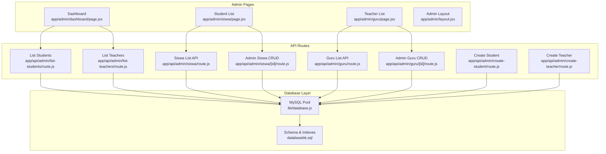

**Diagram sources**
- [dashboard/page.jsx:1-255](file://app/admin/dashboard/page.jsx#L1-L255)
- [siswa/page.jsx:1-338](file://app/admin/siswa/page.jsx#L1-L338)
- [guru/page.jsx:1-278](file://app/admin/guru/page.jsx#L1-L278)
- [list-students/route.js:1-29](file://app/api/admin/list-students/route.js#L1-L29)
- [list-teachers/route.js:1-29](file://app/api/admin/list-teachers/route.js#L1-L29)
- [siswa/route.js:1-140](file://app/api/admin/siswa/route.js#L1-L140)
- [guru/route.js:1-92](file://app/api/admin/guru/route.js#L1-L92)
- [siswa/[id]/route.js](file://app/api/admin/siswa/[id]/route.js#L1-L150)
- [guru/[id]/route.js](file://app/api/admin/guru/[id]/route.js#L1-L100)
- [create-student/route.js:1-22](file://app/api/admin/create-student/route.js#L1-L22)
- [create-teacher/route.js:1-22](file://app/api/admin/create-teacher/route.js#L1-L22)
- [database.js:1-23](file://lib/database.js#L1-L23)
- [databasebk.sql:1-636](file://databasebk.sql#L1-L636)

**Section sources**
- [dashboard/page.jsx:1-255](file://app/admin/dashboard/page.jsx#L1-L255)
- [siswa/page.jsx:1-338](file://app/admin/siswa/page.jsx#L1-L338)
- [guru/page.jsx:1-278](file://app/admin/guru/page.jsx#L1-L278)
- [list-students/route.js:1-29](file://app/api/admin/list-students/route.js#L1-L29)
- [list-teachers/route.js:1-29](file://app/api/admin/list-teachers/route.js#L1-L29)
- [siswa/route.js:1-140](file://app/api/admin/siswa/route.js#L1-L140)
- [guru/route.js:1-92](file://app/api/admin/guru/route.js#L1-L92)
- [database.js:1-23](file://lib/database.js#L1-L23)
- [databasebk.sql:1-636](file://databasebk.sql#L1-L636)

## Core Components
- Student and teacher listing APIs:
  - GET /api/admin/list-students: Returns a flat array of student records with basic profile fields.
  - GET /api/admin/list-teachers: Returns a flat array of teacher records with profile fields.
- Admin CRUD APIs:
  - GET /api/admin/siswa: Lists students with joined class info and active status filter.
  - GET /api/admin/guru: Lists teachers with profile fields.
  - POST /api/admin/siswa: Creates a new student with validation and transaction.
  - PUT /api/admin/siswa/[id]: Updates a student with validation and transaction.
  - DELETE /api/admin/siswa/[id]: Deletes a student.
  - POST /api/admin/guru: Creates a new teacher with validation and transaction.
  - PUT /api/admin/guru/[id]: Updates a teacher with validation and transaction.
  - DELETE /api/admin/guru/[id]: Deletes a teacher.
- Admin dashboard integration:
  - Loads student and teacher lists and renders counts and a searchable/filterable table.
- Database layer:
  - Shared MySQL pool with connection limits and queue behavior.
- Schema and indexes:
  - Users, student/teacher profiles, classes, and indexes optimized for lookups.

**Section sources**
- [list-students/route.js:1-29](file://app/api/admin/list-students/route.js#L1-L29)
- [list-teachers/route.js:1-29](file://app/api/admin/list-teachers/route.js#L1-L29)
- [siswa/route.js:1-140](file://app/api/admin/siswa/route.js#L1-L140)
- [guru/route.js:1-92](file://app/api/admin/guru/route.js#L1-L92)
- [siswa/[id]/route.js](file://app/api/admin/siswa/[id]/route.js#L1-L150)
- [guru/[id]/route.js](file://app/api/admin/guru/[id]/route.js#L1-L100)
- [dashboard/page.jsx:1-255](file://app/admin/dashboard/page.jsx#L1-L255)
- [database.js:1-23](file://lib/database.js#L1-L23)
- [databasebk.sql:1-636](file://databasebk.sql#L1-L636)

## Architecture Overview
The admin UI components fetch data from backend APIs and render interactive tables with local filtering. Backend routes query the database via a shared connection pool and return JSON responses. Transactions are used for create/update operations to maintain data consistency.

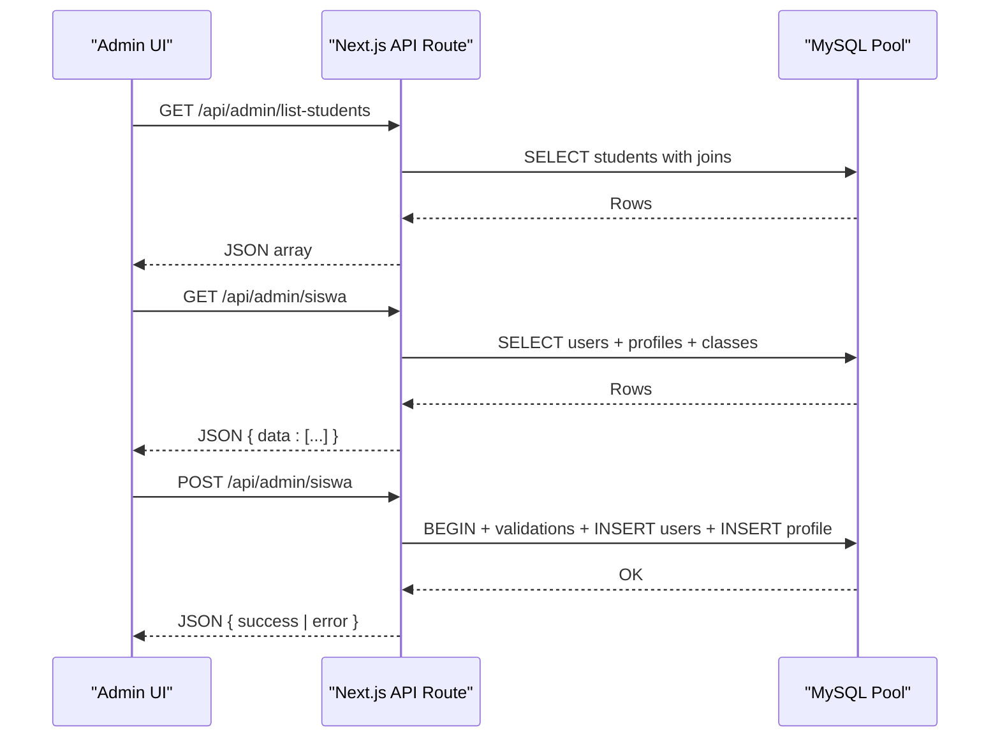

**Diagram sources**
- [list-students/route.js:4-28](file://app/api/admin/list-students/route.js#L4-L28)
- [siswa/route.js:12-47](file://app/api/admin/siswa/route.js#L12-L47)
- [siswa/[id]/route.js](file://app/api/admin/siswa/[id]/route.js#L12-L116)
- [database.js:13-21](file://lib/database.js#L13-L21)

## Detailed Component Analysis

### Student Listing API (/api/admin/list-students)
- Purpose: Retrieve a complete list of students with profile and class info.
- Query: Joins student profile with users and optionally class; orders by user ID descending.
- Response: JSON array of student records.
- Limitations: No pagination, filtering, or sorting parameters are supported.

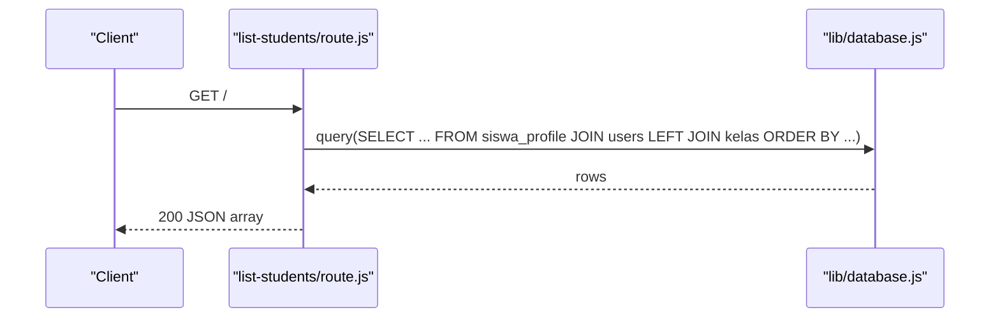

**Diagram sources**
- [list-students/route.js:4-28](file://app/api/admin/list-students/route.js#L4-L28)
- [database.js:13-21](file://lib/database.js#L13-L21)

**Section sources**
- [list-students/route.js:1-29](file://app/api/admin/list-students/route.js#L1-L29)
- [database.js:1-23](file://lib/database.js#L1-L23)

### Teacher Listing API (/api/admin/list-teachers)
- Purpose: Retrieve a complete list of teachers with profile info.
- Query: Joins teacher profile with users; orders by user ID descending.
- Response: JSON array of teacher records.
- Limitations: No pagination, filtering, or sorting parameters are supported.

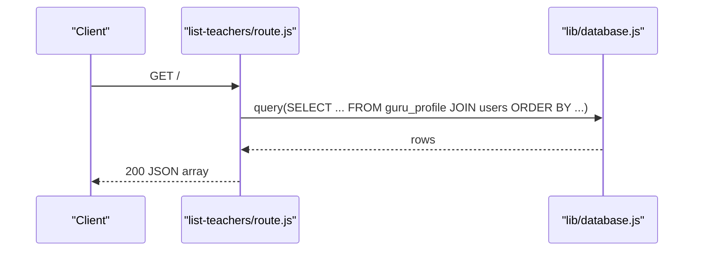

**Diagram sources**
- [list-teachers/route.js:4-28](file://app/api/admin/list-teachers/route.js#L4-L28)
- [database.js:13-21](file://lib/database.js#L13-L21)

**Section sources**
- [list-teachers/route.js:1-29](file://app/api/admin/list-teachers/route.js#L1-L29)
- [database.js:1-23](file://lib/database.js#L1-L23)

### Admin Student CRUD (/api/admin/siswa and /api/admin/siswa/[id])
- GET /api/admin/siswa: Returns a structured array with user and profile fields, filters only active students, ordered by name.
- POST /api/admin/siswa: Validates required fields, checks duplicates, hashes password, inserts into users and profile within a transaction.
- PUT /api/admin/siswa/[id]: Validates and updates user and profile; supports optional password change; handles missing profile by inserting.
- DELETE /api/admin/siswa/[id]: Removes a student by ID with role check.

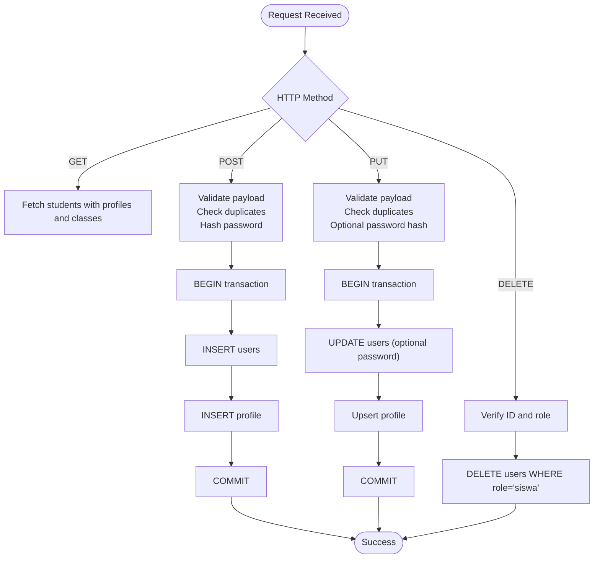

**Diagram sources**
- [siswa/route.js:12-47](file://app/api/admin/siswa/route.js#L12-L47)
- [siswa/[id]/route.js](file://app/api/admin/siswa/[id]/route.js#L12-L116)

**Section sources**
- [siswa/route.js:1-140](file://app/api/admin/siswa/route.js#L1-L140)
- [siswa/[id]/route.js](file://app/api/admin/siswa/[id]/route.js#L1-L150)

### Admin Teacher CRUD (/api/admin/guru and /api/admin/guru/[id])
- GET /api/admin/guru: Returns teacher records with profile fields, filters only active teachers, ordered by name.
- POST /api/admin/guru: Validates required fields, checks duplicates, hashes password, inserts into users and profile within a transaction.
- PUT /api/admin/guru/[id]: Validates and updates user and profile; supports optional password change; handles missing profile by inserting.
- DELETE /api/admin/guru/[id]: Removes a teacher by ID with role check.

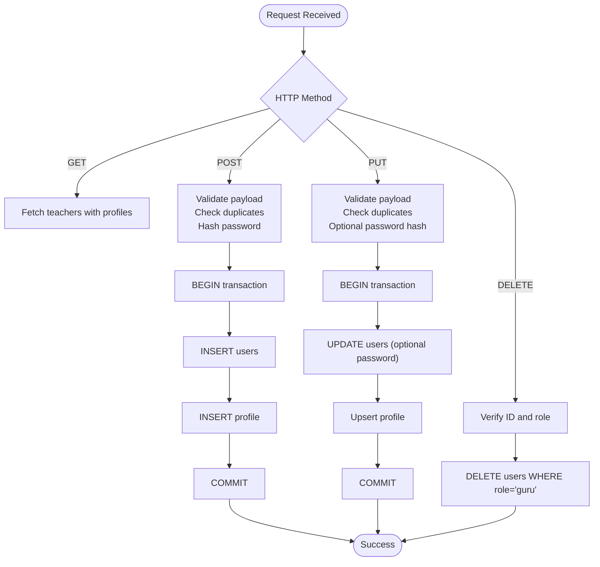

**Diagram sources**
- [guru/route.js:8-25](file://app/api/admin/guru/route.js#L8-L25)
- [guru/[id]/route.js](file://app/api/admin/guru/[id]/route.js#L9-L79)

**Section sources**
- [guru/route.js:1-92](file://app/api/admin/guru/route.js#L1-L92)
- [guru/[id]/route.js](file://app/api/admin/guru/[id]/route.js#L1-L100)

### Admin Dashboard Integration
- Loads student and teacher counts and raw borrowing history concurrently.
- Provides client-side filtering for borrowing history (search, status, date range).
- Renders statistics cards and a searchable/filterable table.

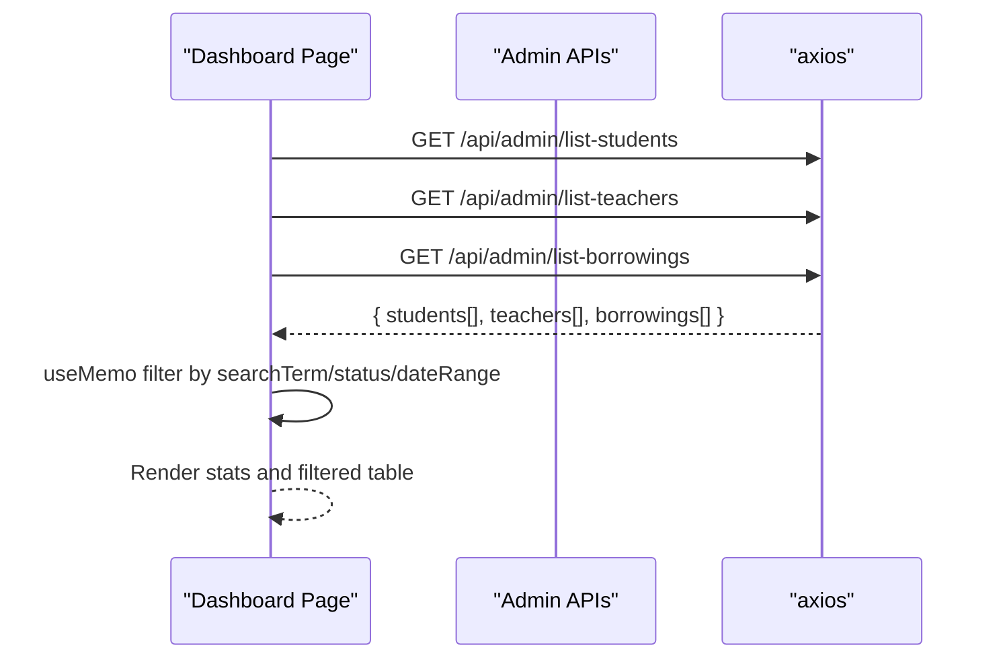

**Diagram sources**
- [dashboard/page.jsx:19-71](file://app/admin/dashboard/page.jsx#L19-L71)

**Section sources**
- [dashboard/page.jsx:1-255](file://app/admin/dashboard/page.jsx#L1-L255)

### Admin Student Management Page
- Loads student list and class list concurrently.
- Supports adding/editing/deleting students via forms and CRUD APIs.
- Client-side filtering by name/NIS/email and class.

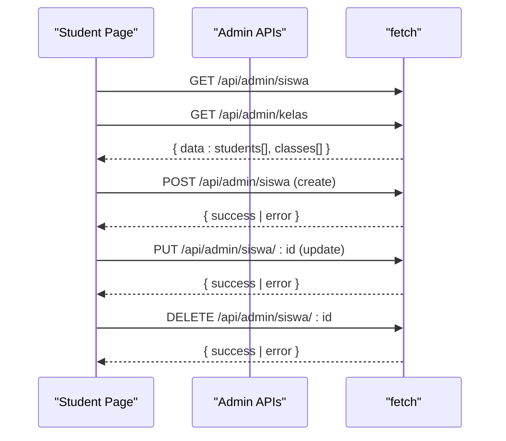

**Diagram sources**
- [siswa/page.jsx:28-52](file://app/admin/siswa/page.jsx#L28-L52)
- [siswa/route.js:12-47](file://app/api/admin/siswa/route.js#L12-L47)
- [siswa/[id]/route.js](file://app/api/admin/siswa/[id]/route.js#L12-L116)

**Section sources**
- [siswa/page.jsx:1-338](file://app/admin/siswa/page.jsx#L1-L338)
- [siswa/route.js:1-140](file://app/api/admin/siswa/route.js#L1-L140)
- [siswa/[id]/route.js](file://app/api/admin/siswa/[id]/route.js#L1-L150)

### Admin Teacher Management Page
- Loads teacher list and supports adding/editing/deleting teachers via forms and CRUD APIs.
- Client-side filtering by name/email/NIP/subject.

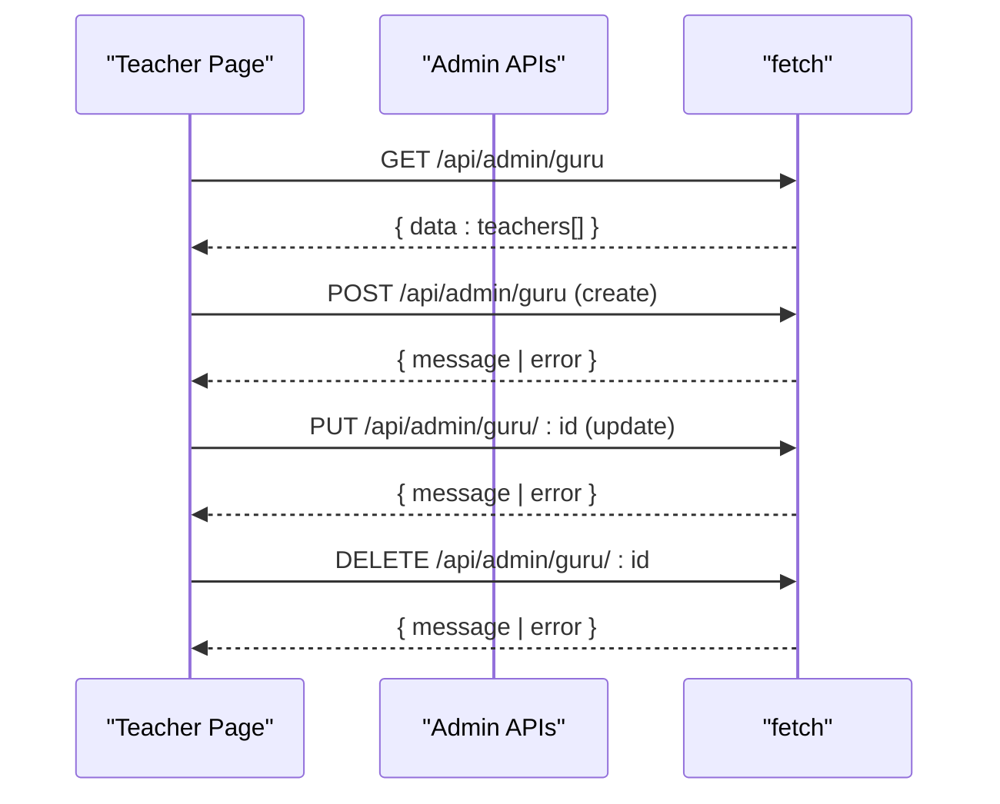

**Diagram sources**
- [guru/page.jsx:25-40](file://app/admin/guru/page.jsx#L25-L40)
- [guru/route.js:8-25](file://app/api/admin/guru/route.js#L8-L25)
- [guru/[id]/route.js](file://app/api/admin/guru/[id]/route.js#L9-L79)

**Section sources**
- [guru/page.jsx:1-278](file://app/admin/guru/page.jsx#L1-L278)
- [guru/route.js:1-92](file://app/api/admin/guru/route.js#L1-L92)
- [guru/[id]/route.js](file://app/api/admin/guru/[id]/route.js#L1-L100)

### Additional Creation Endpoints
- POST /api/admin/create-student: Creates a student user with hashed password.
- POST /api/admin/create-teacher: Creates a teacher user with hashed password.

**Section sources**
- [create-student/route.js:1-22](file://app/api/admin/create-student/route.js#L1-L22)
- [create-teacher/route.js:1-22](file://app/api/admin/create-teacher/route.js#L1-L22)

## Dependency Analysis
- Runtime dependencies include Next.js, mysql2, bcryptjs, axios, react-hot-toast, lucide-react, radix-ui components, and uploadthing.
- Frontend components depend on shared UI primitives and admin layout.
- Backend routes depend on the shared MySQL pool and bcrypt for secure password hashing.

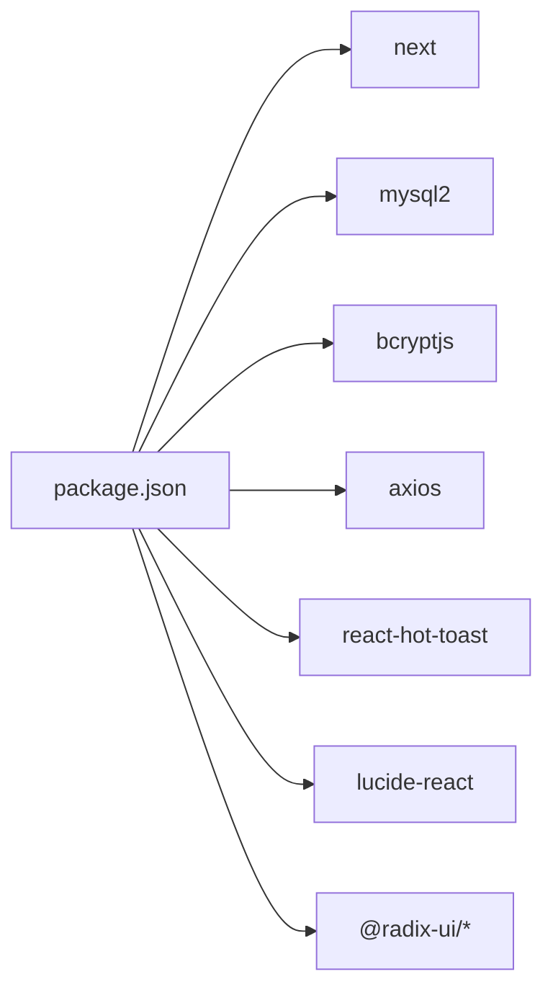

**Diagram sources**
- [package.json:11-33](file://package.json#L11-L33)

**Section sources**
- [package.json:1-44](file://package.json#L1-L44)

## Performance Considerations
Current state:
- Listing APIs return full datasets without pagination or server-side filtering.
- Client-side filtering is used in admin pages for small to moderate datasets.
- Database connections are pooled with a fixed limit.

Recommendations:
- Add pagination parameters (limit/offset or cursor-based) to listing endpoints.
- Introduce server-side filtering and sorting parameters for students and teachers.
- Apply database indexes on frequently filtered/sorted columns (e.g., users.email, users.role, siswa_profile.nis, guru_profile.nip).
- Implement Redis-style caching for static or slowly changing lists (e.g., class lists, teacher lists) with cache invalidation on write operations.
- Use database query result caching for repeated reads of large lists.
- Consider lazy-loading and virtualized tables for large datasets in admin UIs.

[No sources needed since this section provides general guidance]

## Troubleshooting Guide
Common issues and resolutions:
- Duplicate email/NIS/NIP errors during create/update: Ensure uniqueness constraints are respected; the backend validates and returns explicit errors.
- Transaction failures: CRUD routes wrap operations in transactions; rollback on errors prevents partial writes.
- Empty or stale lists in admin UI: Verify API responses and network connectivity; confirm database queries return expected rows.
- Authentication/authorization: Admin pages rely on NextAuth; ensure session is valid when accessing protected routes.

**Section sources**
- [siswa/route.js:73-89](file://app/api/admin/siswa/route.js#L73-L89)
- [guru/route.js:44-56](file://app/api/admin/guru/route.js#L44-L56)
- [siswa/[id]/route.js](file://app/api/admin/siswa/[id]/route.js#L31-L47)
- [guru/[id]/route.js](file://app/api/admin/guru/[id]/route.js#L23-L39)

## Conclusion
The User Listing and Management system currently provides essential CRUD and listing capabilities for students and teachers, with admin dashboards enabling quick access and filtering. To scale effectively, introduce pagination, server-side filtering/sorting, and caching strategies while maintaining data integrity through transactions and robust validation.

[No sources needed since this section summarizes without analyzing specific files]

## Appendices

### API Definitions and Examples

- GET /api/admin/list-students
  - Description: Returns a flat array of student records with profile and class info.
  - Response: Array of student objects.
  - Example response shape: See [list-students/route.js:6-21](file://app/api/admin/list-students/route.js#L6-L21).

- GET /api/admin/list-teachers
  - Description: Returns a flat array of teacher records with profile info.
  - Response: Array of teacher objects.
  - Example response shape: See [list-teachers/route.js:6-21](file://app/api/admin/list-teachers/route.js#L6-L21).

- GET /api/admin/siswa
  - Description: Returns structured student data with class names and active status filter.
  - Response: Object with data array.
  - Example response shape: See [siswa/route.js:26-41](file://app/api/admin/siswa/route.js#L26-L41).

- GET /api/admin/guru
  - Description: Returns teacher data with profile fields.
  - Response: Object with data array.
  - Example response shape: See [guru/route.js:19-20](file://app/api/admin/guru/route.js#L19-L20).

- POST /api/admin/siswa
  - Description: Creates a new student with validation and transaction.
  - Request body: Required fields include name, email, password, nis; optional fields include phone, birth date, address, class, emergency contact.
  - Success response: Object with success flag and user ID.
  - Error responses: Validation or duplicate errors.

- PUT /api/admin/siswa/[id]
  - Description: Updates a student with optional password change and profile upsert.
  - Request body: Same as create plus optional password.
  - Success response: Success message.

- DELETE /api/admin/siswa/[id]
  - Description: Deletes a student by ID.
  - Success response: Deletion confirmation.

- POST /api/admin/guru
  - Description: Creates a new teacher with validation and transaction.
  - Request body: Required fields include name, email, password, nip; optional fields include phone, subject, position, bio.
  - Success response: Message and ID.

- PUT /api/admin/guru/[id]
  - Description: Updates a teacher with optional password change and profile upsert.
  - Request body: Same as create plus optional password.
  - Success response: Update confirmation.

- DELETE /api/admin/guru/[id]
  - Description: Deletes a teacher by ID.
  - Success response: Deletion confirmation.

- POST /api/admin/create-student
  - Description: Creates a student user with hashed password.
  - Request body: name, username, email, password, class_id.
  - Success response: Confirmation message.

- POST /api/admin/create-teacher
  - Description: Creates a teacher user with hashed password.
  - Request body: name, username, email, password.
  - Success response: Confirmation message.

**Section sources**
- [list-students/route.js:1-29](file://app/api/admin/list-students/route.js#L1-L29)
- [list-teachers/route.js:1-29](file://app/api/admin/list-teachers/route.js#L1-L29)
- [siswa/route.js:1-140](file://app/api/admin/siswa/route.js#L1-L140)
- [guru/route.js:1-92](file://app/api/admin/guru/route.js#L1-L92)
- [siswa/[id]/route.js](file://app/api/admin/siswa/[id]/route.js#L1-L150)
- [guru/[id]/route.js](file://app/api/admin/guru/[id]/route.js#L1-L100)
- [create-student/route.js:1-22](file://app/api/admin/create-student/route.js#L1-L22)
- [create-teacher/route.js:1-22](file://app/api/admin/create-teacher/route.js#L1-L22)

### Database Schema Highlights
- Users table stores credentials, roles, and activity status.
- Student and teacher profiles link to users and include additional attributes.
- Classes table supports class assignments.
- Indexes exist for performance on role, email, and other lookup fields.

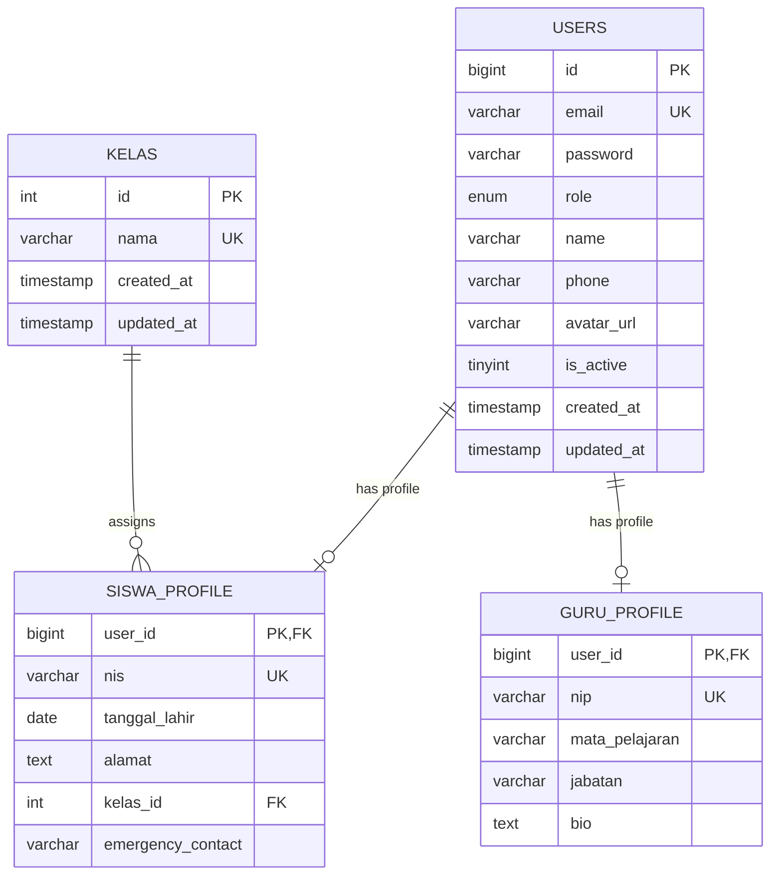

**Diagram sources**
- [databasebk.sql:25-65](file://databasebk.sql#L25-L65)

**Section sources**
- [databasebk.sql:1-636](file://databasebk.sql#L1-L636)