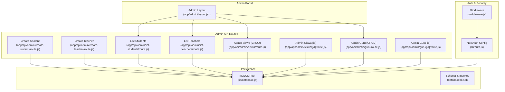
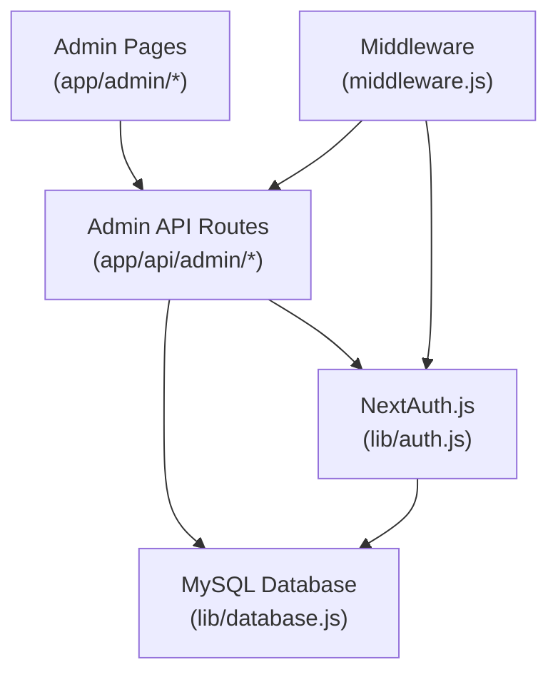
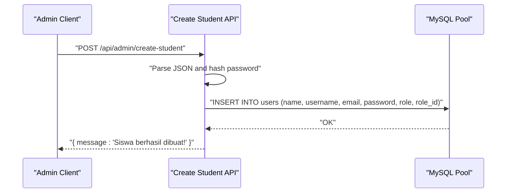
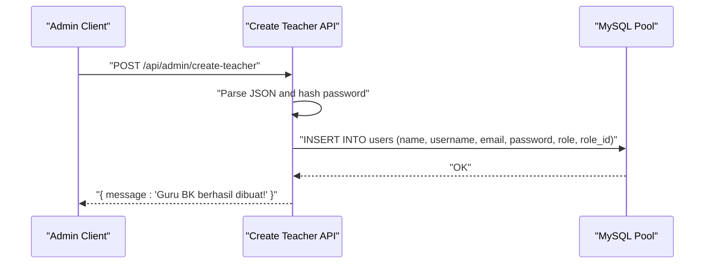
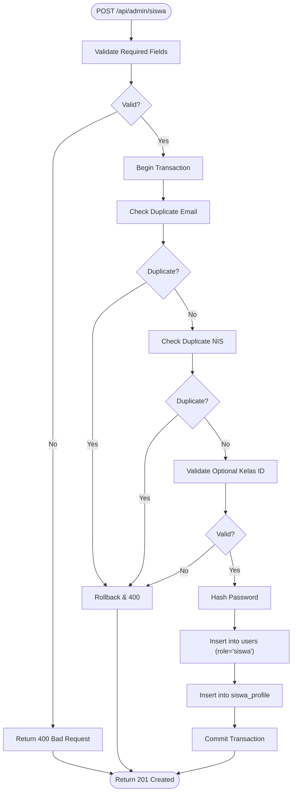
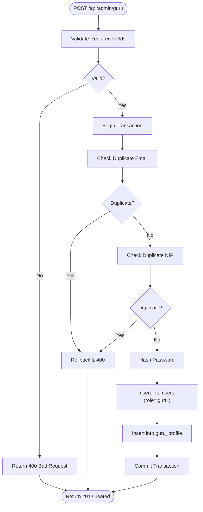
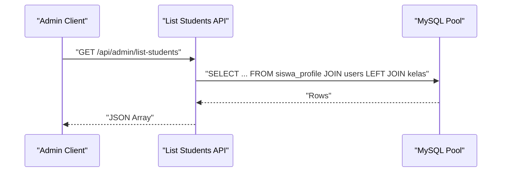
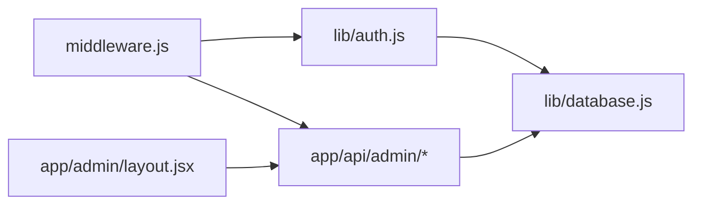
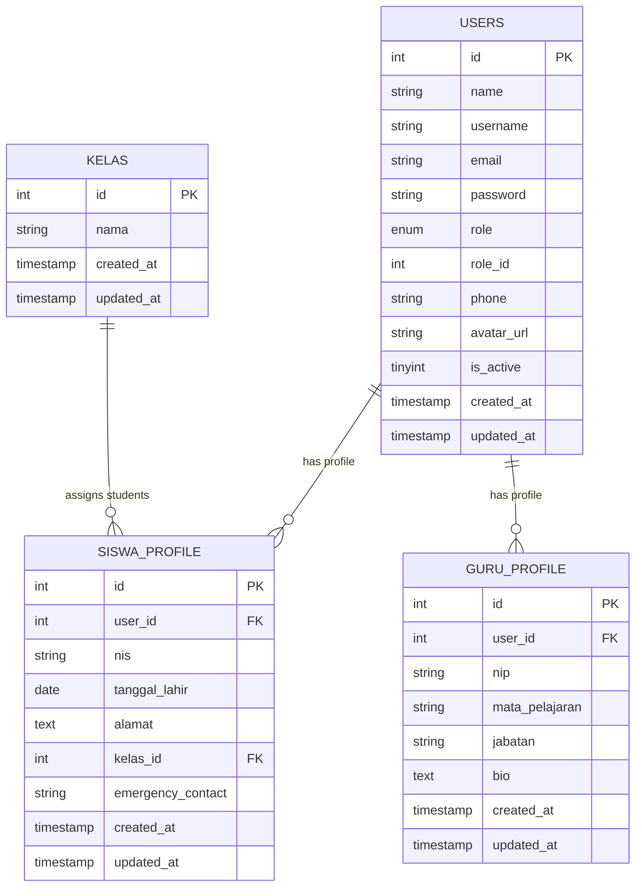

# User Management

<cite>
**Referenced Files in This Document**
- [create-student/route.js](file://app/api/admin/create-student/route.js)
- [create-teacher/route.js](file://app/api/admin/create-teacher/route.js)
- [list-students/route.js](file://app/api/admin/list-students/route.js)
- [list-teachers/route.js](file://app/api/admin/list-teachers/route.js)
- [admin-siswa-route.js](file://app/api/admin/siswa/route.js)
- [admin-siswa-id-route.js](file://app/api/admin/siswa/[id]/route.js)
- [admin-guru-route.js](file://app/api/admin/guru/route.js)
- [admin-guru-id-route.js](file://app/api/admin/guru/[id]/route.js)
- [database.js](file://lib/database.js)
- [auth.js](file://lib/auth.js)
- [middleware.js](file://middleware.js)
- [admin-layout.jsx](file://app/admin/layout.jsx)
- [databasebk.sql](file://databasebk.sql)
</cite>

## Table of Contents
1. [Introduction](#introduction)
2. [Project Structure](#project-structure)
3. [Core Components](#core-components)
4. [Architecture Overview](#architecture-overview)
5. [Detailed Component Analysis](#detailed-component-analysis)
6. [Dependency Analysis](#dependency-analysis)
7. [Performance Considerations](#performance-considerations)
8. [Troubleshooting Guide](#troubleshooting-guide)
9. [Conclusion](#conclusion)
10. [Appendices](#appendices)

## Introduction
This document describes the User Management system in the Admin Portal, focusing on student enrollment, teacher assignment workflows, and user listing APIs. It explains how administrators create student and teacher accounts, validate user information, manage user records, and integrate with the authentication layer. It also covers data validation rules, error handling strategies, security measures, and permission inheritance patterns enforced by middleware.

## Project Structure
The User Management functionality is primarily implemented via Next.js App Router API routes under app/api/admin, backed by a MySQL database and protected by NextAuth.js and middleware. The admin portal UI is wrapped in an admin layout.

**Diagram sources**
- [admin-layout.jsx:1-17](file://app/admin/layout.jsx#L1-L17)
- [create-student/route.js:1-22](file://app/api/admin/create-student/route.js#L1-L22)
- [create-teacher/route.js:1-22](file://app/api/admin/create-teacher/route.js#L1-L22)
- [list-students/route.js:1-29](file://app/api/admin/list-students/route.js#L1-L29)
- [list-teachers/route.js:1-29](file://app/api/admin/list-teachers/route.js#L1-L29)
- [admin-siswa-route.js:1-140](file://app/api/admin/siswa/route.js#L1-L140)
- [admin-siswa-id-route.js:1-150](file://app/api/admin/siswa/[id]/route.js#L1-L150)
- [admin-guru-route.js:1-92](file://app/api/admin/guru/route.js#L1-L92)
- [admin-guru-id-route.js:1-100](file://app/api/admin/guru/[id]/route.js#L1-L100)
- [auth.js:1-77](file://lib/auth.js#L1-L77)
- [middleware.js:1-53](file://middleware.js#L1-L53)
- [database.js:1-23](file://lib/database.js#L1-L23)
- [databasebk.sql:1-407](file://databasebk.sql#L1-L407)

**Section sources**
- [admin-layout.jsx:1-17](file://app/admin/layout.jsx#L1-L17)
- [database.js:1-23](file://lib/database.js#L1-L23)
- [auth.js:1-77](file://lib/auth.js#L1-L77)
- [middleware.js:1-53](file://middleware.js#L1-L53)
- [databasebk.sql:1-407](file://databasebk.sql#L1-L407)

## Core Components
- Student Enrollment API
  - Endpoint: POST /api/admin/create-student
  - Purpose: Create a new student account with hashed password and assign role "siswa".
  - Validation: Requires name, username, email, password, class_id; inserts into users with role and role_id.
  - Response: JSON success message on creation.
  - Error Handling: Returns 500 with error message on failure.

- Teacher Assignment API
  - Endpoint: POST /api/admin/create-teacher
  - Purpose: Create a new teacher account with hashed password and assign role "guru".
  - Validation: Requires name, username, email, password; inserts into users with role and role_id.
  - Response: JSON success message on creation.
  - Error Handling: Returns 500 with error message on failure.

- User Listing APIs
  - Students: GET /api/admin/list-students
    - Joins siswa_profile with users; selects student attributes and optional class name; orders by user ID descending.
  - Teachers: GET /api/admin/list-teachers
    - Joins guru_profile with users; selects teacher attributes; orders by user ID descending.
  - Both endpoints wrap results in JSON and handle errors with 500 responses.

- Admin CRUD APIs
  - Students: GET/POST/PUT/DELETE under /api/admin/siswa and /api/admin/siswa/[id]
    - GET lists active students with joined class info.
    - POST validates required fields, checks duplicates, hashes password, inserts into users and siswa_profile in a transaction.
    - PUT updates user and profile, enforces uniqueness constraints, supports optional fields, and uses transactions.
    - DELETE removes a student by ID with role guard.
  - Teachers: GET/POST/PUT/DELETE under /api/admin/guru and /api/admin/guru/[id]
    - GET lists active teachers with profile fields.
    - POST validates required fields, checks duplicates, hashes password, inserts into users and guru_profile in a transaction.
    - PUT updates user and profile, enforces uniqueness constraints, supports optional fields, and uses transactions.
    - DELETE removes a teacher by ID with role guard.

- Authentication and Middleware
  - NextAuth.js handles credentials-based login, stores JWT claims including role, and exposes session data.
  - Middleware protects routes by requiring a valid JWT token and enforcing role-based access per path prefix (/admin, /guru, /siswa).

**Section sources**
- [create-student/route.js:1-22](file://app/api/admin/create-student/route.js#L1-L22)
- [create-teacher/route.js:1-22](file://app/api/admin/create-teacher/route.js#L1-L22)
- [list-students/route.js:1-29](file://app/api/admin/list-students/route.js#L1-L29)
- [list-teachers/route.js:1-29](file://app/api/admin/list-teachers/route.js#L1-L29)
- [admin-siswa-route.js:1-140](file://app/api/admin/siswa/route.js#L1-L140)
- [admin-siswa-id-route.js:1-150](file://app/api/admin/siswa/[id]/route.js#L1-L150)
- [admin-guru-route.js:1-92](file://app/api/admin/guru/route.js#L1-L92)
- [admin-guru-id-route.js:1-100](file://app/api/admin/guru/[id]/route.js#L1-L100)
- [auth.js:1-77](file://lib/auth.js#L1-L77)
- [middleware.js:1-53](file://middleware.js#L1-L53)

## Architecture Overview
The Admin Portal integrates UI layout, API routes, database persistence, and authentication/security layers.

**Diagram sources**
- [admin-layout.jsx:1-17](file://app/admin/layout.jsx#L1-L17)
- [database.js:1-23](file://lib/database.js#L1-L23)
- [auth.js:1-77](file://lib/auth.js#L1-L77)
- [middleware.js:1-53](file://middleware.js#L1-L53)

## Detailed Component Analysis

### Student Enrollment Workflow
- API: POST /api/admin/create-student
- Steps:
  - Parse request JSON for name, username, email, password, class_id.
  - Hash password with bcrypt.
  - Insert into users with role "siswa" and role_id set accordingly.
  - Return success message.
- Error Handling: Catches exceptions and returns 500 with error message.

**Diagram sources**
- [create-student/route.js:5-21](file://app/api/admin/create-student/route.js#L5-L21)
- [database.js:13-21](file://lib/database.js#L13-L21)

**Section sources**
- [create-student/route.js:1-22](file://app/api/admin/create-student/route.js#L1-L22)
- [database.js:1-23](file://lib/database.js#L1-L23)

### Teacher Assignment Workflow
- API: POST /api/admin/create-teacher
- Steps:
  - Parse request JSON for name, username, email, password.
  - Hash password with bcrypt.
  - Insert into users with role "guru" and role_id set accordingly.
  - Return success message.
- Error Handling: Catches exceptions and returns 500 with error message.

**Diagram sources**
- [create-teacher/route.js:5-21](file://app/api/admin/create-teacher/route.js#L5-L21)
- [database.js:13-21](file://lib/database.js#L13-L21)

**Section sources**
- [create-teacher/route.js:1-22](file://app/api/admin/create-teacher/route.js#L1-L22)
- [database.js:1-23](file://lib/database.js#L1-L23)

### Student Record Management (Admin)
- API: GET/POST/PUT/DELETE /api/admin/siswa and /api/admin/siswa/[id]
- GET: Lists active students with joined class info.
- POST:
  - Validates required fields (name, email, password, nis).
  - Checks duplicate email and NIS.
  - Validates optional kelas_id against kelas table.
  - Hashes password and inserts into users with role "siswa".
  - Inserts profile record into siswa_profile.
  - Uses transaction for atomicity.
- PUT:
  - Validates required fields (id, name, email, nis).
  - Checks duplicate email and NIS excluding current user.
  - Validates optional kelas_id.
  - Updates users and/or inserts/updates siswa_profile.
  - Uses transaction for atomicity.
- DELETE:
  - Deletes user with role "siswa" by ID; returns not found if no affected rows.

**Diagram sources**
- [admin-siswa-route.js:52-129](file://app/api/admin/siswa/route.js#L52-L129)
- [database.js:13-21](file://lib/database.js#L13-L21)

**Section sources**
- [admin-siswa-route.js:1-140](file://app/api/admin/siswa/route.js#L1-L140)
- [admin-siswa-id-route.js:1-150](file://app/api/admin/siswa/[id]/route.js#L1-L150)
- [database.js:1-23](file://lib/database.js#L1-L23)

### Teacher Record Management (Admin)
- API: GET/POST/PUT/DELETE /api/admin/guru and /api/admin/guru/[id]
- GET: Lists active teachers with profile fields.
- POST:
  - Validates required fields (name, email, password, nip).
  - Checks duplicate email and NIP.
  - Hashes password and inserts into users with role "guru".
  - Inserts profile record into guru_profile.
  - Uses transaction for atomicity.
- PUT:
  - Validates required fields (id, name, email, nip).
  - Checks duplicate email and NIP excluding current user.
  - Updates users and/or inserts/updates guru_profile.
  - Uses transaction for atomicity.
- DELETE:
  - Deletes user with role "guru" by ID; returns not found if no affected rows.

**Diagram sources**
- [admin-guru-route.js:30-83](file://app/api/admin/guru/route.js#L30-L83)
- [database.js:13-21](file://lib/database.js#L13-L21)

**Section sources**
- [admin-guru-route.js:1-92](file://app/api/admin/guru/route.js#L1-L92)
- [admin-guru-id-route.js:1-100](file://app/api/admin/guru/[id]/route.js#L1-L100)
- [database.js:1-23](file://lib/database.js#L1-L23)

### User Listing APIs
- Students: GET /api/admin/list-students
  - Selects student profile and user data; joins optional class; sorts by user ID desc.
- Teachers: GET /api/admin/list-teachers
  - Selects teacher profile and user data; sorts by user ID desc.
- Both endpoints return JSON arrays and handle errors with 500 responses.

**Diagram sources**
- [list-students/route.js:4-23](file://app/api/admin/list-students/route.js#L4-L23)
- [database.js:13-21](file://lib/database.js#L13-L21)

**Section sources**
- [list-students/route.js:1-29](file://app/api/admin/list-students/route.js#L1-L29)
- [list-teachers/route.js:1-29](file://app/api/admin/list-teachers/route.js#L1-L29)
- [database.js:1-23](file://lib/database.js#L1-L23)

### Data Validation Rules
- Student Creation (Admin):
  - Required: name, email, password, nis.
  - Unique Constraints: email (users), nis (siswa_profile).
  - Optional: kelas_id validated against kelas table.
- Teacher Creation (Admin):
  - Required: name, email, password, nip.
  - Unique Constraints: email (users), nip (guru_profile).
- Student Update (Admin):
  - Required: id, name, email, nis.
  - Unique Constraints: email (excluding self), nis (excluding self).
  - Optional: kelas_id validated against kelas table.
- Teacher Update (Admin):
  - Required: id, name, email, nip.
  - Unique Constraints: email (excluding self), nip (excluding self).

**Section sources**
- [admin-siswa-route.js:62-100](file://app/api/admin/siswa/route.js#L62-L100)
- [admin-siswa-id-route.js:24-58](file://app/api/admin/siswa/[id]/route.js#L24-L58)
- [admin-guru-route.js:36-56](file://app/api/admin/guru/route.js#L36-L56)
- [admin-guru-id-route.js:16-39](file://app/api/admin/guru/[id]/route.js#L16-L39)

### Error Handling Strategies
- API routes consistently:
  - Wrap operations in try/catch blocks.
  - Return structured JSON with error messages.
  - Use appropriate HTTP status codes (400, 404, 500).
- Transactions:
  - Begin before validations and inserts/updates.
  - Rollback on constraint violations or errors.
  - Commit only after successful completion.
- Database Utility:
  - Centralized query execution with error logging and rethrow.

**Section sources**
- [admin-siswa-route.js:130-137](file://app/api/admin/siswa/route.js#L130-L137)
- [admin-siswa-id-route.js:106-115](file://app/api/admin/siswa/[id]/route.js#L106-L115)
- [admin-guru-route.js:85-91](file://app/api/admin/guru/route.js#L85-L91)
- [admin-guru-id-route.js:72-78](file://app/api/admin/guru/[id]/route.js#L72-L78)
- [database.js:17-21](file://lib/database.js#L17-L21)

### Security Measures
- Authentication:
  - Credentials provider with bcrypt password comparison.
  - JWT strategy storing role, phone, and avatar_url in token/session.
- Authorization:
  - Middleware enforces role-based access control:
    - /admin requires role "admin".
    - /guru requires role "guru".
    - /siswa requires role "siswa".
  - Redirects unauthenticated or unauthorized users to login or unauthorized page.
- Data Protection:
  - Passwords are hashed with bcrypt before storage.
  - Unique constraints prevent duplicate emails/NIPs/NIS.

**Section sources**
- [auth.js:6-77](file://lib/auth.js#L6-L77)
- [middleware.js:11-42](file://middleware.js#L11-L42)

### Permission Inheritance Patterns
- Role-based routing protection ensures that only users with the correct role can access corresponding dashboards and resources.
- NextAuth token/session carries role information, enabling UI and server-side logic to adapt behavior based on role.

**Section sources**
- [middleware.js:25-40](file://middleware.js#L25-L40)
- [auth.js:55-71](file://lib/auth.js#L55-L71)

### Examples and Workflows

#### Bulk User Operations
- Current implementation focuses on single-user creation endpoints. There is no dedicated bulk endpoint for students or teachers in the analyzed routes. To implement bulk operations, extend existing POST handlers to accept arrays and process each item with the same validations and transactions.

#### Account Status Management
- Users include an is_active flag in the schema. While the analyzed routes do not expose explicit status toggling endpoints, future enhancements can add PATCH endpoints to toggle is_active for students and teachers.

#### User Profile Updates
- Students: PUT /api/admin/siswa/[id] supports updating user and profile fields with optional parameters and maintains uniqueness constraints.
- Teachers: PUT /api/admin/guru/[id] supports updating user and profile fields with optional parameters and maintains uniqueness constraints.

**Section sources**
- [admin-siswa-id-route.js:12-116](file://app/api/admin/siswa/[id]/route.js#L12-L116)
- [admin-guru-id-route.js:9-79](file://app/api/admin/guru/[id]/route.js#L9-L79)
- [databasebk.sql:22-35](file://databasebk.sql#L22-L35)

## Dependency Analysis

**Diagram sources**
- [auth.js:1-77](file://lib/auth.js#L1-L77)
- [middleware.js:1-53](file://middleware.js#L1-L53)
- [database.js:1-23](file://lib/database.js#L1-L23)
- [admin-layout.jsx:1-17](file://app/admin/layout.jsx#L1-L17)

**Section sources**
- [auth.js:1-77](file://lib/auth.js#L1-L77)
- [middleware.js:1-53](file://middleware.js#L1-L53)
- [database.js:1-23](file://lib/database.js#L1-L23)
- [admin-layout.jsx:1-17](file://app/admin/layout.jsx#L1-L17)

## Performance Considerations
- Database Pooling: The MySQL pool limits concurrent connections and queues requests, preventing overload.
- Indexes: Schema includes indexes on role, email, username, and unique identifiers to improve lookup performance.
- Transactions: Group related writes to maintain consistency and reduce partial updates.
- Recommendations:
  - Add pagination and filtering to listing endpoints for scalability.
  - Consider caching frequently accessed static data (e.g., class names).
  - Monitor slow queries and add missing indexes as needed.

**Section sources**
- [database.js:3-11](file://lib/database.js#L3-L11)
- [databasebk.sql:175-191](file://databasebk.sql#L175-L191)

## Troubleshooting Guide
- Authentication Failures
  - Verify NEXTAUTH_SECRET is configured.
  - Ensure credentials match stored hashed passwords.
- Authorization Errors
  - Confirm user roles in the database and that middleware path prefixes align with application routes.
- Database Errors
  - Check DB_HOST, DB_USER, DB_PASS, DB_NAME environment variables.
  - Review centralized query error logging for SQL exceptions.
- Duplicate Constraint Violations
  - For students: email or nis already exists.
  - For teachers: email or nip already exists.
- Transaction Rollbacks
  - Occur on duplicate checks or invalid class IDs; ensure frontend handles returned error messages.

**Section sources**
- [auth.js:39-42](file://lib/auth.js#L39-L42)
- [middleware.js:19-23](file://middleware.js#L19-L23)
- [database.js:17-21](file://lib/database.js#L17-L21)
- [admin-siswa-route.js:73-89](file://app/api/admin/siswa/route.js#L73-L89)
- [admin-guru-route.js:44-56](file://app/api/admin/guru/route.js#L44-L56)

## Conclusion
The User Management system provides robust APIs for creating and managing student and teacher accounts, with strong validation, transactional integrity, and role-based security. Administrators can list users, create new accounts, and update profiles while relying on bcrypt hashing and middleware enforcement. Future enhancements could include bulk operations, status toggles, and pagination/filters for improved scalability and usability.

## Appendices

### Data Model Overview

**Diagram sources**
- [databasebk.sql:22-67](file://databasebk.sql#L22-L67)