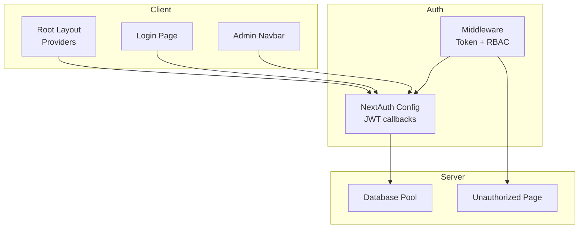
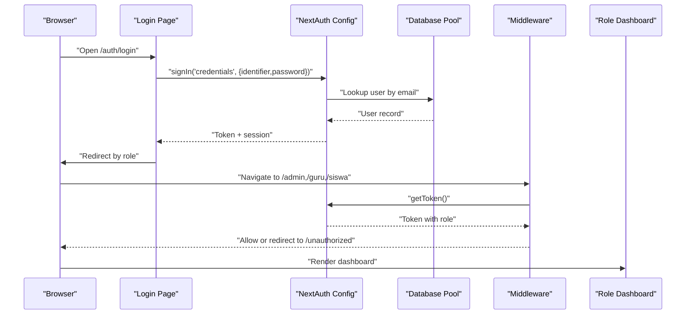
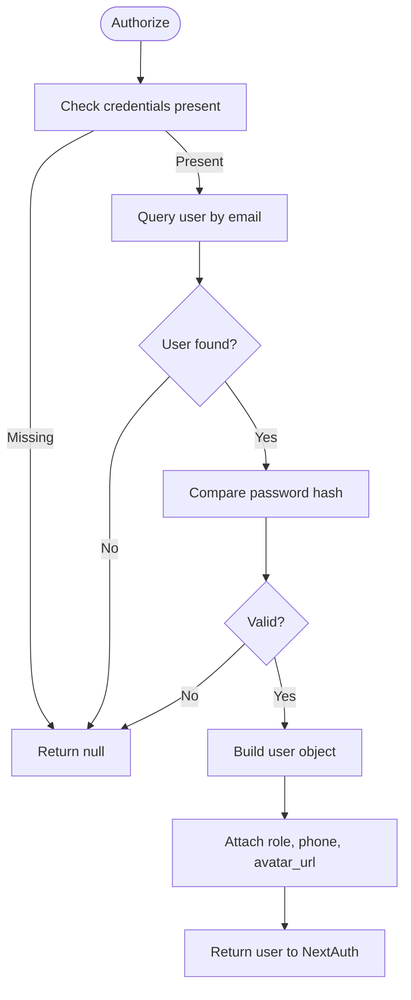
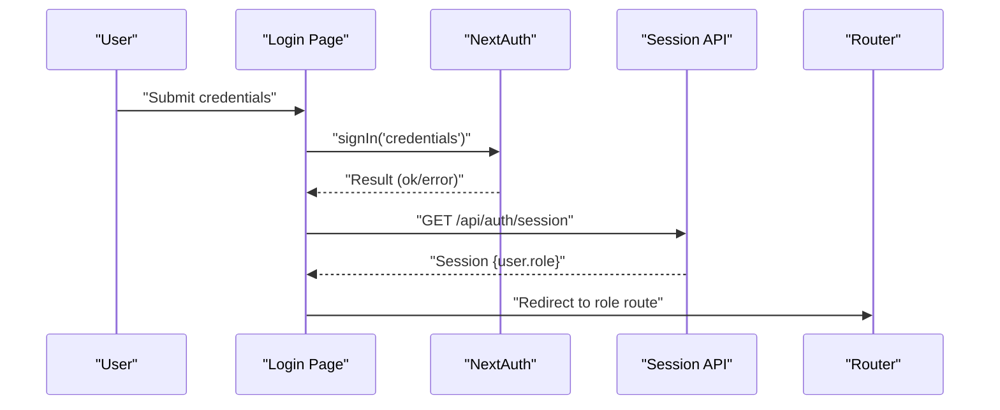
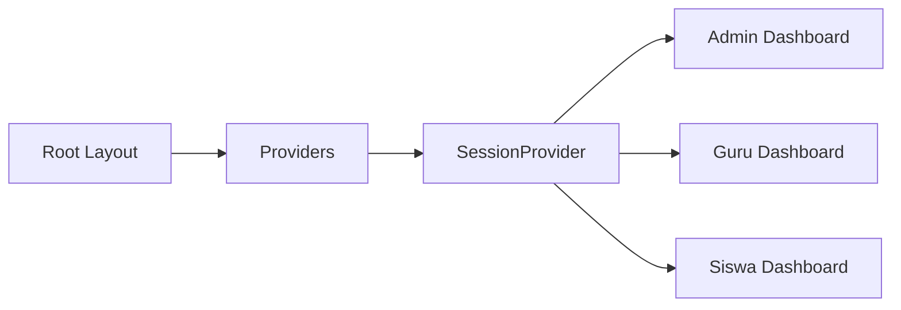
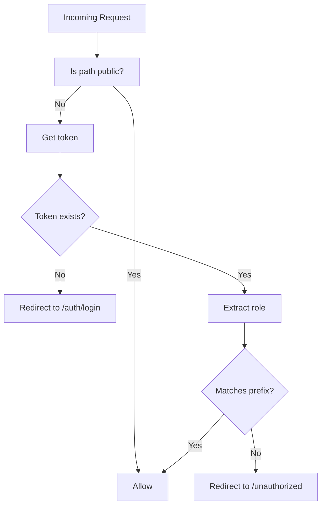
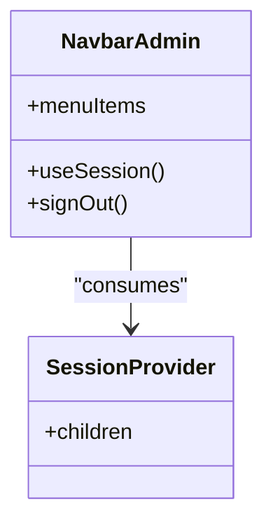
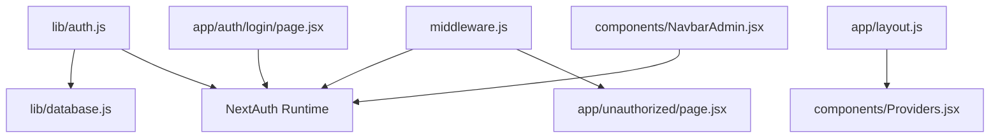

# Authentication & Authorization

<cite>
**Referenced Files in This Document**
- [lib/auth.js](file://lib/auth.js)
- [middleware.js](file://middleware.js)
- [lib/database.js](file://lib/database.js)
- [components/Providers.jsx](file://components/Providers.jsx)
- [app/layout.js](file://app/layout.js)
- [app/auth/login/page.jsx](file://app/auth/login/page.jsx)
- [app/unauthorized/page.jsx](file://app/unauthorized/page.jsx)
- [app/admin/dashboard/page.jsx](file://app/admin/dashboard/page.jsx)
- [app/gurubk/dashboard/page.jsx](file://app/gurubk/dashboard/page.jsx)
- [app/siswa/dashboard/page.jsx](file://app/siswa/dashboard/page.jsx)
- [components/NavbarAdmin.jsx](file://components/NavbarAdmin.jsx)
</cite>

## Table of Contents
1. [Introduction](#introduction)
2. [Project Structure](#project-structure)
3. [Core Components](#core-components)
4. [Architecture Overview](#architecture-overview)
5. [Detailed Component Analysis](#detailed-component-analysis)
6. [Dependency Analysis](#dependency-analysis)
7. [Performance Considerations](#performance-considerations)
8. [Troubleshooting Guide](#troubleshooting-guide)
9. [Conclusion](#conclusion)

## Introduction
This document explains the authentication and authorization system for the E-BK application. It covers NextAuth.js integration with custom JWT callbacks, credential-based authentication flow, session management, role-based access control (RBAC), middleware enforcement, redirects for unauthorized users, and practical guidance for protected routes, role-specific navigation, guards, logout, session persistence, and security best practices tailored for an educational environment.

## Project Structure
The authentication stack spans several layers:
- NextAuth.js configuration and callbacks in a dedicated library module
- Middleware for route protection and role checks
- Client-side providers and pages for login and role redirection
- Role-specific dashboards and navigation components
- Database connectivity for user lookup and validation

**Diagram sources**
- [app/layout.js:1-31](file://app/layout.js#L1-L31)
- [components/Providers.jsx:1-14](file://components/Providers.jsx#L1-L14)
- [lib/auth.js:1-77](file://lib/auth.js#L1-L77)
- [middleware.js:1-53](file://middleware.js#L1-L53)
- [lib/database.js:1-23](file://lib/database.js#L1-L23)
- [app/unauthorized/page.jsx:1-9](file://app/unauthorized/page.jsx#L1-L9)

**Section sources**
- [app/layout.js:1-31](file://app/layout.js#L1-L31)
- [components/Providers.jsx:1-14](file://components/Providers.jsx#L1-L14)
- [lib/auth.js:1-77](file://lib/auth.js#L1-L77)
- [middleware.js:1-53](file://middleware.js#L1-L53)
- [lib/database.js:1-23](file://lib/database.js#L1-L23)
- [app/unauthorized/page.jsx:1-9](file://app/unauthorized/page.jsx#L1-L9)

## Core Components
- NextAuth.js configuration with credentials provider, JWT strategy, and custom callbacks for enriching tokens and sessions with role and profile attributes
- Middleware that enforces session presence and role-based routing
- Client-side providers enabling session-aware components
- Login page performing credential sign-in and role-based redirect
- Role-specific dashboards and navigation components
- Unauthorized page for access-denied scenarios

**Section sources**
- [lib/auth.js:6-75](file://lib/auth.js#L6-L75)
- [middleware.js:11-43](file://middleware.js#L11-L43)
- [components/Providers.jsx:6-12](file://components/Providers.jsx#L6-L12)
- [app/auth/login/page.jsx:8-52](file://app/auth/login/page.jsx#L8-L52)
- [app/admin/dashboard/page.jsx:1-255](file://app/admin/dashboard/page.jsx#L1-L255)
- [app/gurubk/dashboard/page.jsx:1-158](file://app/gurubk/dashboard/page.jsx#L1-L158)
- [app/siswa/dashboard/page.jsx:1-209](file://app/siswa/dashboard/page.jsx#L1-L209)
- [components/NavbarAdmin.jsx:9-163](file://components/NavbarAdmin.jsx#L9-L163)

## Architecture Overview
The system uses a client-server split:
- Client initializes session providers and renders role-aware UI
- NextAuth.js handles credential validation against the database and manages JWT lifecycle
- Middleware intercepts requests to enforce access rules based on token roles
- Protected dashboards render after successful authentication and role verification

**Diagram sources**
- [app/auth/login/page.jsx:13-51](file://app/auth/login/page.jsx#L13-L51)
- [lib/auth.js:14-44](file://lib/auth.js#L14-L44)
- [lib/database.js:13-21](file://lib/database.js#L13-L21)
- [middleware.js:19-42](file://middleware.js#L19-L42)
- [app/admin/dashboard/page.jsx:1-255](file://app/admin/dashboard/page.jsx#L1-L255)

## Detailed Component Analysis

### NextAuth.js Integration and JWT Callbacks
- Provider: Credentials provider validates email/password via database lookup and bcrypt comparison
- Session strategy: JWT-based session management
- Callbacks:
  - jwt: attaches role, phone, and avatar_url to the token upon login
  - session: exposes role and profile fields to the session object for client-side consumption
- Pages override: Sign-in page mapped to the login route
- Secret: Uses environment variable for signing tokens

**Diagram sources**
- [lib/auth.js:14-44](file://lib/auth.js#L14-L44)
- [lib/database.js:13-21](file://lib/database.js#L13-L21)

**Section sources**
- [lib/auth.js:6-75](file://lib/auth.js#L6-L75)
- [lib/database.js:1-23](file://lib/database.js#L1-L23)

### Credential-Based Authentication Flow
- Client-side login form posts credentials to NextAuth
- On success, the client fetches the current session to determine role
- Redirects to role-specific home/dashboard route
- On failure, displays an error toast

**Diagram sources**
- [app/auth/login/page.jsx:13-51](file://app/auth/login/page.jsx#L13-L51)

**Section sources**
- [app/auth/login/page.jsx:8-52](file://app/auth/login/page.jsx#L8-L52)

### Session Management and Client Providers
- Root layout wraps the app with SessionProvider to enable useSession/useRouter hooks
- Client components can access session data and drive UI behavior

**Diagram sources**
- [app/layout.js:20-27](file://app/layout.js#L20-L27)
- [components/Providers.jsx:6-12](file://components/Providers.jsx#L6-L12)

**Section sources**
- [app/layout.js:1-31](file://app/layout.js#L1-L31)
- [components/Providers.jsx:1-14](file://components/Providers.jsx#L1-L14)

### Middleware Implementation and Access Control
- Public paths: homepage, login, register, and auth API are publicly accessible
- Token retrieval: middleware obtains the JWT using the configured secret
- Role checks:
  - Paths under /admin require role admin
  - Paths under /guru require role guru
  - Paths under /siswa require role siswa
- Redirects:
  - Missing token: redirect to login
  - Role mismatch: redirect to unauthorized

**Diagram sources**
- [middleware.js:11-43](file://middleware.js#L11-L43)

**Section sources**
- [middleware.js:4-43](file://middleware.js#L4-L43)
- [app/unauthorized/page.jsx:1-9](file://app/unauthorized/page.jsx#L1-L9)

### Role-Based Access Control and Protected Routes
- Admin-only routes: prefixed with /admin
- Guru-only routes: prefixed with /guru
- Siswa-only routes: prefixed with /siswa
- Middleware matchers restrict evaluation to these prefixes and /auth/*
- Unauthorized page informs users when access is denied

**Section sources**
- [middleware.js:45-52](file://middleware.js#L45-L52)
- [app/unauthorized/page.jsx:1-9](file://app/unauthorized/page.jsx#L1-L9)

### Role-Specific Navigation Patterns
- Admin navigation includes dashboard, student/teacher management, schedules, and reports
- Navigation components use session data to show profile and actions
- Logout triggers NextAuth sign-out and redirects to login

**Diagram sources**
- [components/NavbarAdmin.jsx:9-163](file://components/NavbarAdmin.jsx#L9-L163)
- [components/Providers.jsx:6-12](file://components/Providers.jsx#L6-L12)

**Section sources**
- [components/NavbarAdmin.jsx:9-163](file://components/NavbarAdmin.jsx#L9-L163)
- [components/Providers.jsx:1-14](file://components/Providers.jsx#L1-L14)

### Authentication Guards and Session Validation
- Client-side guard pattern: useSession hook to conditionally render protected UI
- Server-side guard pattern: middleware validates token and role before allowing route access
- Session persistence: JWT stored in cookies by NextAuth; middleware retrieves token for each request

**Section sources**
- [components/NavbarAdmin.jsx:10-11](file://components/NavbarAdmin.jsx#L10-L11)
- [middleware.js:19-23](file://middleware.js#L19-L23)

### Logout Functionality and Session Persistence
- Logout uses NextAuth’s signOut with a callback URL to force re-authentication
- Session cookies are cleared server-side by NextAuth
- After logout, users are redirected to the login page

**Section sources**
- [components/NavbarAdmin.jsx:154-160](file://components/NavbarAdmin.jsx#L154-L160)

### Security Best Practices for the Educational Environment
- Use HTTPS in production to protect cookies and tokens
- Rotate NEXTAUTH_SECRET regularly and keep it secure
- Sanitize and validate all inputs; avoid exposing sensitive fields
- Limit database connections and handle errors gracefully
- Enforce role checks on both client and server boundaries
- Consider adding rate limiting for login attempts
- Store avatars securely and sanitize file uploads
- Audit logs for suspicious activities (failed logins, repeated unauthorized attempts)

## Dependency Analysis

**Diagram sources**
- [lib/auth.js:1-77](file://lib/auth.js#L1-L77)
- [lib/database.js:1-23](file://lib/database.js#L1-L23)
- [middleware.js:1-53](file://middleware.js#L1-L53)
- [app/auth/login/page.jsx:1-110](file://app/auth/login/page.jsx#L1-L110)
- [components/NavbarAdmin.jsx:1-231](file://components/NavbarAdmin.jsx#L1-L231)
- [app/layout.js:1-31](file://app/layout.js#L1-L31)
- [components/Providers.jsx:1-14](file://components/Providers.jsx#L1-L14)
- [app/unauthorized/page.jsx:1-9](file://app/unauthorized/page.jsx#L1-L9)

**Section sources**
- [lib/auth.js:1-77](file://lib/auth.js#L1-L77)
- [lib/database.js:1-23](file://lib/database.js#L1-L23)
- [middleware.js:1-53](file://middleware.js#L1-L53)
- [app/auth/login/page.jsx:1-110](file://app/auth/login/page.jsx#L1-L110)
- [components/NavbarAdmin.jsx:1-231](file://components/NavbarAdmin.jsx#L1-L231)
- [app/layout.js:1-31](file://app/layout.js#L1-L31)
- [components/Providers.jsx:1-14](file://components/Providers.jsx#L1-L14)
- [app/unauthorized/page.jsx:1-9](file://app/unauthorized/page.jsx#L1-L9)

## Performance Considerations
- Prefer JWT strategy for minimal server-state overhead
- Cache frequently accessed dashboards and limit heavy computations on middleware
- Use useMemo/useCallback in client components to prevent unnecessary re-renders
- Optimize database queries and consider connection pooling limits
- Minimize payload sizes in tokens; only include necessary claims

## Troubleshooting Guide
- Login fails silently:
  - Verify NEXTAUTH_SECRET is set and correct
  - Confirm database credentials and connectivity
  - Check browser console for network errors during sign-in
- Redirect loops to login:
  - Ensure cookies are enabled and not blocked
  - Verify NEXTAUTH_SECRET matches between client and server
- Unauthorized access:
  - Confirm token contains the expected role
  - Check middleware matchers and path prefixes
- Avatar not displaying:
  - Ensure avatar URLs are absolute or properly served from public path

**Section sources**
- [lib/auth.js:74-75](file://lib/auth.js#L74-L75)
- [lib/database.js:13-21](file://lib/database.js#L13-L21)
- [middleware.js:19-23](file://middleware.js#L19-L23)
- [components/NavbarAdmin.jsx:35-38](file://components/NavbarAdmin.jsx#L35-L38)

## Conclusion
The E-BK application implements a robust, layered authentication and authorization system centered on NextAuth.js with JWT, credential-based login, and strict middleware-driven RBAC. Client providers enable seamless session-aware UI, while role-specific dashboards and navigation components deliver a tailored experience. By adhering to the outlined best practices and leveraging the provided guards and redirects, the system maintains strong security and usability in an educational setting.