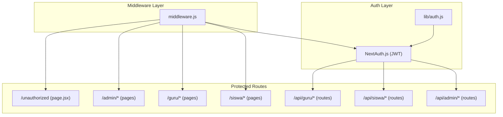
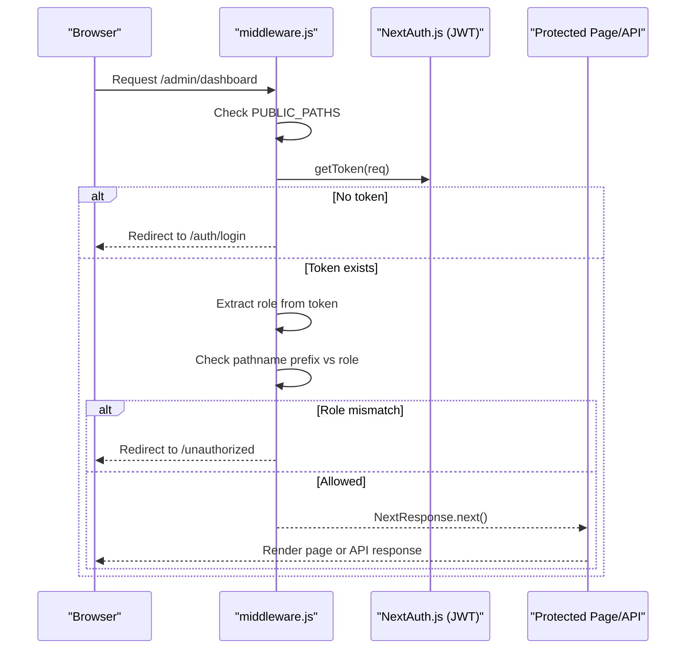
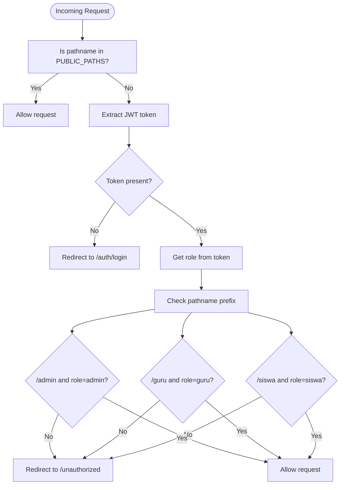
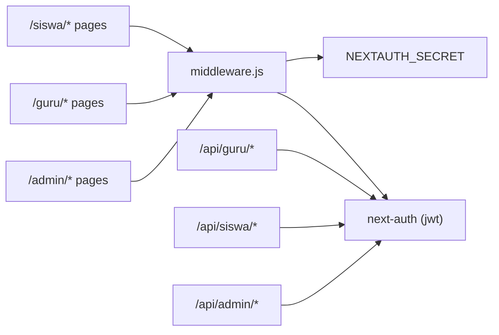

# Middleware & Access Control

<cite>
**Referenced Files in This Document**
- [middleware.js](file://middleware.js)
- [lib/auth.js](file://lib/auth.js)
- [app/api/guru/dashboard/route.js](file://app/api/guru/dashboard/route.js)
- [app/api/siswa/dashboard/route.js](file://app/api/siswa/dashboard/route.js)
- [app/api/admin/create-student/route.js](file://app/api/admin/create-student/route.js)
- [app/unauthorized/page.jsx](file://app/unauthorized/page.jsx)
- [app/admin/dashboard/page.jsx](file://app/admin/dashboard/page.jsx)
- [app/gurubk/dashboard/page.jsx](file://app/gurubk/dashboard/page.jsx)
- [app/siswa/dashboard/page.jsx](file://app/siswa/dashboard/page.jsx)
- [package.json](file://package.json)
</cite>

## Table of Contents
1. [Introduction](#introduction)
2. [Project Structure](#project-structure)
3. [Core Components](#core-components)
4. [Architecture Overview](#architecture-overview)
5. [Detailed Component Analysis](#detailed-component-analysis)
6. [Dependency Analysis](#dependency-analysis)
7. [Performance Considerations](#performance-considerations)
8. [Troubleshooting Guide](#troubleshooting-guide)
9. [Conclusion](#conclusion)

## Introduction
This document explains the middleware-based access control system used to protect routes by role. It covers how middleware intercepts incoming requests, validates sessions via NextAuth.js JWT tokens, enforces role-based routing protection, and redirects unauthorized users. It also documents protected routes for Admin, Guru BK, and Siswa, the redirect patterns for unauthorized access, and how the system integrates with NextAuth.js session data. Finally, it outlines middleware execution order, performance considerations, and debugging techniques for access control issues.

## Project Structure
The access control system spans three layers:
- Middleware: centralized request interception and role checks
- Authentication: NextAuth.js configuration and JWT token augmentation
- Protected UI/API routes: role-specific dashboards and API endpoints

**Diagram sources**
- [middleware.js:11-43](file://middleware.js#L11-L43)
- [lib/auth.js:55-72](file://lib/auth.js#L55-L72)
- [app/unauthorized/page.jsx:1-9](file://app/unauthorized/page.jsx#L1-L9)
- [app/admin/dashboard/page.jsx:1-255](file://app/admin/dashboard/page.jsx#L1-L255)
- [app/gurubk/dashboard/page.jsx:1-158](file://app/gurubk/dashboard/page.jsx#L1-L158)
- [app/siswa/dashboard/page.jsx:1-209](file://app/siswa/dashboard/page.jsx#L1-L209)
- [app/api/guru/dashboard/route.js:1-139](file://app/api/guru/dashboard/route.js#L1-L139)
- [app/api/siswa/dashboard/route.js:1-71](file://app/api/siswa/dashboard/route.js#L1-L71)
- [app/api/admin/create-student/route.js:1-22](file://app/api/admin/create-student/route.js#L1-L22)

**Section sources**
- [middleware.js:11-52](file://middleware.js#L11-L52)
- [lib/auth.js:6-75](file://lib/auth.js#L6-L75)

## Core Components
- Middleware: Validates public paths, extracts JWT token, checks role prefixes, and redirects accordingly.
- NextAuth.js: Provides JWT-based session strategy, augments token/session with role and profile fields.
- Protected UI pages: Role-scoped dashboards under /admin, /guru, and /siswa.
- Protected API endpoints: Role-gated server-side handlers using getServerSession.

Key responsibilities:
- Intercept all requests matched by the middleware matcher
- Allow public paths unauthenticated
- Require a valid JWT token for protected paths
- Enforce role-based access using pathname prefixes
- Redirect to /unauthorized for mismatched roles

**Section sources**
- [middleware.js:4-43](file://middleware.js#L4-L43)
- [lib/auth.js:55-72](file://lib/auth.js#L55-L72)

## Architecture Overview
The middleware runs before route handlers and determines whether to allow navigation or redirect. NextAuth.js manages authentication state and stores role in the JWT token. Protected UI pages and API routes rely on either middleware enforcement or server-side session checks.

**Diagram sources**
- [middleware.js:11-43](file://middleware.js#L11-L43)
- [lib/auth.js:55-72](file://lib/auth.js#L55-L72)

## Detailed Component Analysis

### Middleware: Role-Based Routing Protection
Responsibilities:
- Define public paths that bypass authentication
- Extract JWT token from request headers
- Redirect to login when token is missing
- Enforce role-based protection using pathname prefixes
- Redirect to /unauthorized when role does not match the requested route

Execution flow:
- If pathname is public, allow immediately
- Else, require a valid JWT token
- If token absent, redirect to login
- Else, check role against pathname prefix
  - Admin-only routes require role "admin"
  - Guru-only routes require role "guru"
  - Siswa-only routes require role "siswa"
- On mismatch, redirect to /unauthorized

**Diagram sources**
- [middleware.js:11-43](file://middleware.js#L11-L43)

**Section sources**
- [middleware.js:4-43](file://middleware.js#L4-L43)
- [middleware.js:45-52](file://middleware.js#L45-L52)

### NextAuth.js Session and Role Injection
- Session strategy: JWT
- Token augmentation: role, phone, avatar_url stored in JWT
- Session augmentation: same fields exposed on session.user
- Login page configured to /auth/login

Integration with middleware:
- Middleware reads role from token to enforce route protection
- Protected API endpoints can optionally re-validate via getServerSession

**Section sources**
- [lib/auth.js:55-72](file://lib/auth.js#L55-L72)
- [lib/auth.js:47-49](file://lib/auth.js#L47-L49)

### Protected UI Routes by Role
- Admin
  - Example: /admin/dashboard
  - Purpose: Administrative overview and management
- Guru BK
  - Example: /gurubk/dashboard
  - Purpose: Teacher dashboard, statistics, and activities
- Siswa
  - Example: /siswa/dashboard
  - Purpose: Student dashboard, history, and quick actions

These pages are protected by middleware because their paths match the middleware matcher.

**Section sources**
- [app/admin/dashboard/page.jsx:1-255](file://app/admin/dashboard/page.jsx#L1-L255)
- [app/gurubk/dashboard/page.jsx:1-158](file://app/gurubk/dashboard/page.jsx#L1-L158)
- [app/siswa/dashboard/page.jsx:1-209](file://app/siswa/dashboard/page.jsx#L1-L209)

### Protected API Endpoints by Role
- Guru-only API
  - Example: GET /api/guru/dashboard
  - Server-side guard uses getServerSession and role check
- Siswa-only API
  - Example: GET /api/siswa/dashboard
  - Server-side guard uses getServerSession and role check
- Admin-only API
  - Example: POST /api/admin/create-student
  - Server-side logic creates a new student account; typically protected elsewhere (e.g., middleware or RBAC at controller level)

Note: Some API endpoints may rely on middleware for client-side navigation protection and on server-side guards for robust backend enforcement.

**Section sources**
- [app/api/guru/dashboard/route.js:1-139](file://app/api/guru/dashboard/route.js#L1-L139)
- [app/api/siswa/dashboard/route.js:1-71](file://app/api/siswa/dashboard/route.js#L1-L71)
- [app/api/admin/create-student/route.js:1-22](file://app/api/admin/create-student/route.js#L1-L22)

### Unauthorized Access Redirection
- When a user’s role does not match the requested route prefix, middleware redirects to /unauthorized
- The /unauthorized page displays a simple access denied message

**Section sources**
- [middleware.js:28-40](file://middleware.js#L28-L40)
- [app/unauthorized/page.jsx:1-9](file://app/unauthorized/page.jsx#L1-L9)

### Integration with NextAuth.js Session Data
- Middleware uses getToken to extract role from the JWT
- Protected UI pages and API endpoints can also use getServerSession for server-side checks
- Token/session augmentation ensures role and profile fields are consistently available

**Section sources**
- [middleware.js:19-25](file://middleware.js#L19-L25)
- [lib/auth.js:55-72](file://lib/auth.js#L55-L72)

## Dependency Analysis
- Middleware depends on NextAuth.js for token extraction and relies on environment variable NEXTAUTH_SECRET for token verification
- Protected UI pages depend on middleware enforcement via matcher configuration
- Protected API endpoints depend on getServerSession for server-side validation
- Package dependencies include next-auth and related libraries

**Diagram sources**
- [middleware.js:19-25](file://middleware.js#L19-L25)
- [lib/auth.js:55-72](file://lib/auth.js#L55-L72)
- [package.json:26](file://package.json#L26)

**Section sources**
- [package.json:26](file://package.json#L26)
- [middleware.js:45-52](file://middleware.js#L45-L52)

## Performance Considerations
- Token retrieval cost: getToken performs symmetric decryption using NEXTAUTH_SECRET; keep secret strong and avoid frequent regeneration
- Middleware matcher scope: Narrow matchers reduce unnecessary middleware invocations
- Public paths: Minimize protected checks by listing all public paths explicitly
- Server-side guards: API endpoints using getServerSession incur database/network overhead; cache where appropriate and limit queries
- Redirects: Prefer minimal redirects to avoid extra round trips

## Troubleshooting Guide
Common issues and resolutions:
- Redirect loop to /auth/login
  - Cause: Missing or invalid NEXTAUTH_SECRET
  - Action: Verify NEXTAUTH_SECRET in environment; confirm cookie domain/path; ensure client cookies are sent
- Redirect to /unauthorized despite being logged in
  - Cause: Role mismatch or missing role in token
  - Action: Confirm user role in database; verify JWT callback injects role; check middleware role extraction
- Protected UI loads but API fails
  - Cause: Client-side middleware allows navigation, but server-side guard rejects
  - Action: Add server-side guard using getServerSession; ensure session strategy is JWT
- Slow API responses behind middleware
  - Cause: getServerSession overhead
  - Action: Cache session data server-side; optimize database queries; minimize redundant calls

Debugging techniques:
- Log token presence and role in middleware
- Inspect browser cookies for auth-related keys
- Verify NEXTAUTH_SECRET alignment across environments
- Temporarily relax middleware for testing and re-enable after validation

**Section sources**
- [middleware.js:19-25](file://middleware.js#L19-L25)
- [lib/auth.js:55-72](file://lib/auth.js#L55-L72)

## Conclusion
The middleware-based access control system provides a clean separation of concerns: middleware handles client-side navigation protection using JWT roles, while server-side guards offer robust backend enforcement. By combining explicit middleware matchers, role-aware routing, and NextAuth.js JWT augmentation, the system ensures secure, predictable access control across Admin, Guru BK, and Siswa contexts. Proper configuration of public paths, environment secrets, and server-side guards minimizes friction while maintaining security.