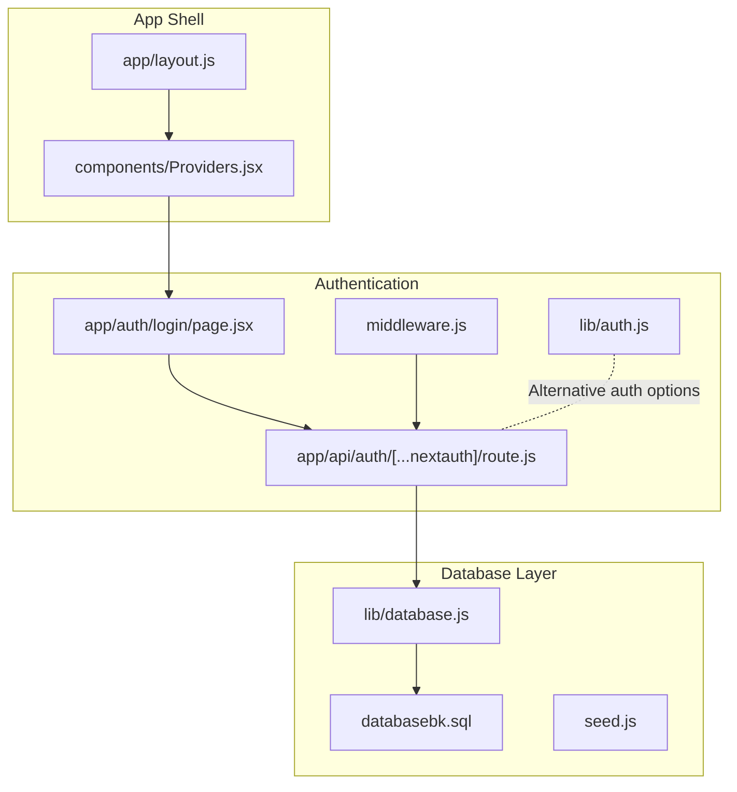
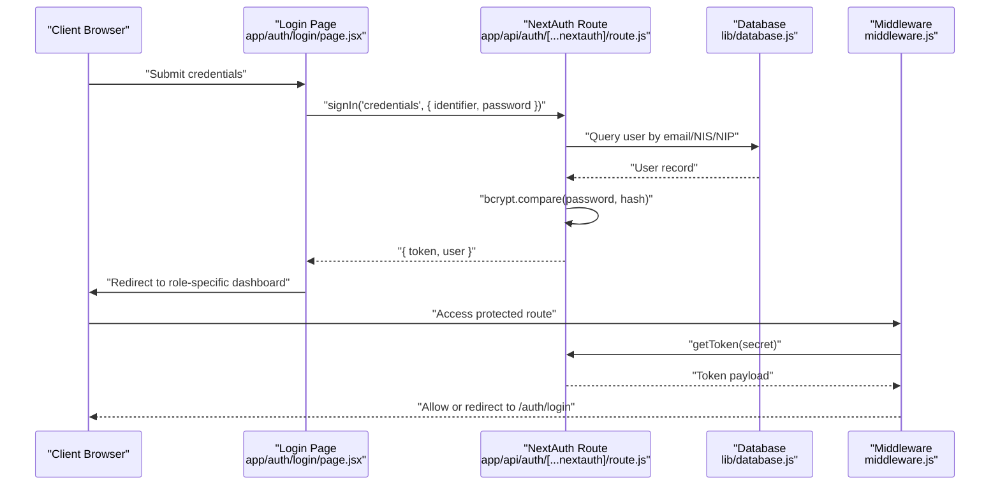
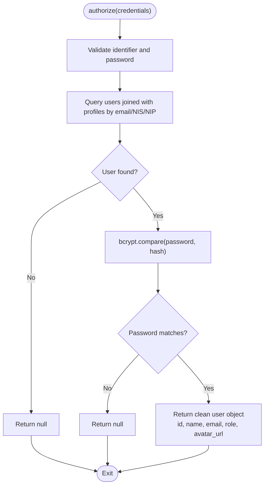
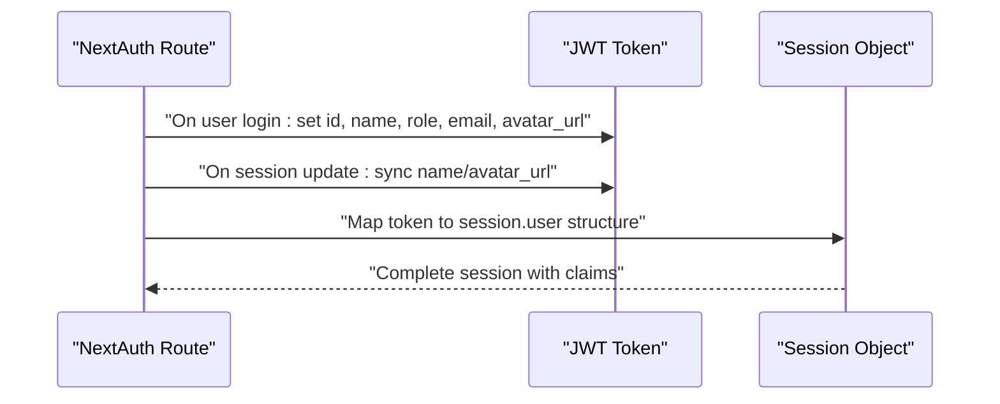
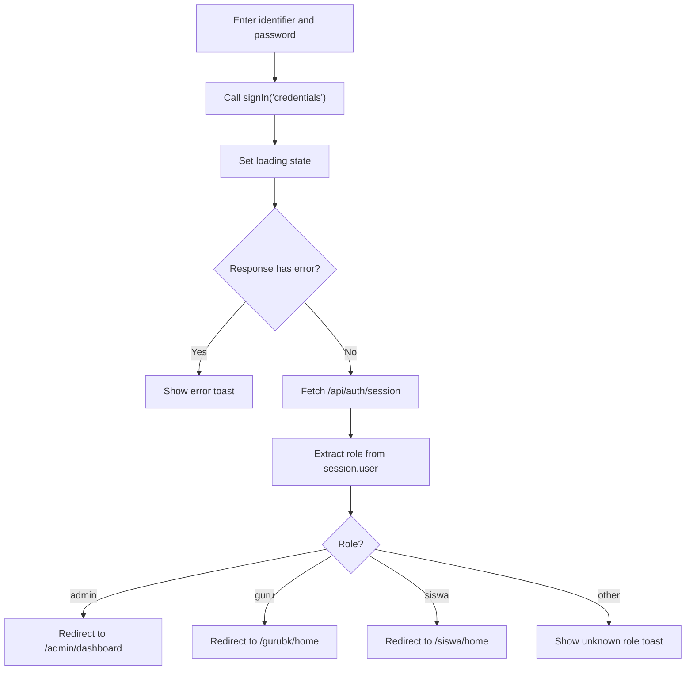
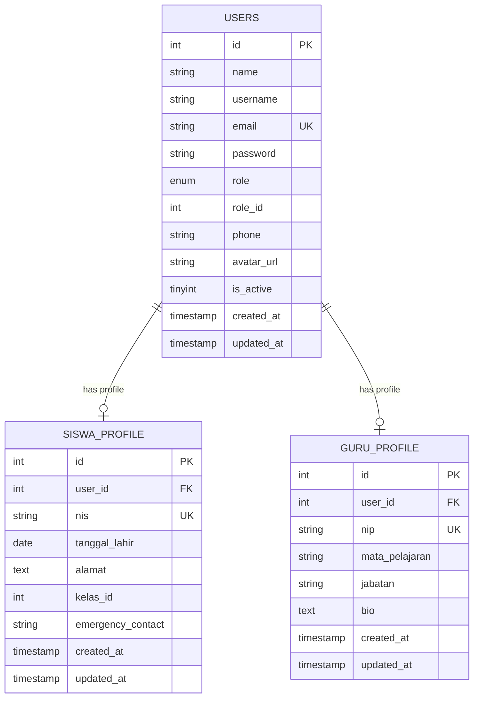
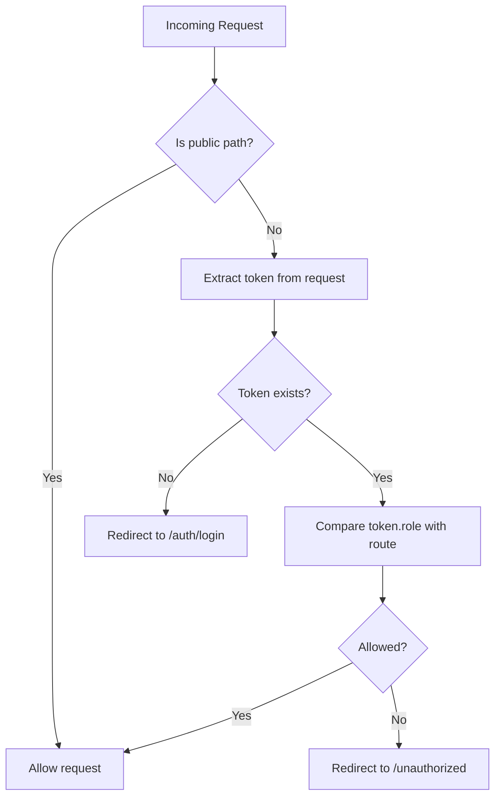
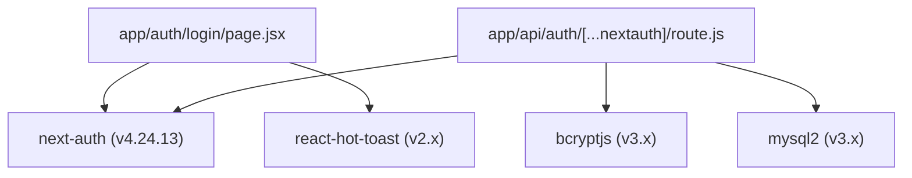

# NextAuth.js Integration

<cite>
**Referenced Files in This Document**
- [lib/auth.js](file://lib/auth.js)
- [app/api/auth/[...nextauth]/route.js](file://app/api/auth/[...nextauth]/route.js)
- [lib/database.js](file://lib/database.js)
- [app/auth/login/page.jsx](file://app/auth/login/page.jsx)
- [components/Providers.jsx](file://components/Providers.jsx)
- [app/layout.js](file://app/layout.js)
- [middleware.js](file://middleware.js)
- [databasebk.sql](file://databasebk.sql)
- [seed.js](file://seed.js)
- [package.json](file://package.json)
</cite>

## Table of Contents
1. [Introduction](#introduction)
2. [Project Structure](#project-structure)
3. [Core Components](#core-components)
4. [Architecture Overview](#architecture-overview)
5. [Detailed Component Analysis](#detailed-component-analysis)
6. [Dependency Analysis](#dependency-analysis)
7. [Performance Considerations](#performance-considerations)
8. [Troubleshooting Guide](#troubleshooting-guide)
9. [Conclusion](#conclusion)

## Introduction
This document explains the NextAuth.js integration in the E-BK application. It covers the credential provider configuration, custom authorize function, JWT token handling, and the complete authentication flow from login form submission to session creation. It also documents the authOptions configuration, callback functions for JWT and session management, security considerations, and integration with the MySQL database. Additionally, it addresses session strategy configuration, token expiration handling, and custom claims implementation.

## Project Structure
The authentication system is implemented using NextAuth.js with a credentials provider and JWT strategy. The key files involved are:
- NextAuth route handler that defines authOptions and provider logic
- Frontend login page that submits credentials via next-auth/react
- Database utilities for MySQL queries
- Middleware for route protection using JWT tokens
- Provider wrapper for session management in the app shell

**Diagram sources**
- [app/layout.js:20-31](file://app/layout.js#L20-L31)
- [components/Providers.jsx:6-13](file://components/Providers.jsx#L6-L13)
- [app/api/auth/[...nextauth]/route.js:1-102](file://app/api/auth/[...nextauth]/route.js#L1-L102)
- [lib/auth.js:6-77](file://lib/auth.js#L6-L77)
- [app/auth/login/page.jsx:8-110](file://app/auth/login/page.jsx#L8-L110)
- [middleware.js:11-53](file://middleware.js#L11-L53)
- [lib/database.js:1-23](file://lib/database.js#L1-L23)
- [databasebk.sql:20-35](file://databasebk.sql#L20-L35)
- [seed.js:1-89](file://seed.js#L1-L89)

**Section sources**
- [package.json:11-34](file://package.json#L11-L34)
- [app/layout.js:20-31](file://app/layout.js#L20-L31)
- [components/Providers.jsx:6-13](file://components/Providers.jsx#L6-L13)
- [app/api/auth/[...nextauth]/route.js:6-97](file://app/api/auth/[...nextauth]/route.js#L6-L97)
- [lib/auth.js:6-77](file://lib/auth.js#L6-L77)
- [app/auth/login/page.jsx:8-110](file://app/auth/login/page.jsx#L8-L110)
- [middleware.js:11-53](file://middleware.js#L11-L53)
- [lib/database.js:1-23](file://lib/database.js#L1-L23)
- [databasebk.sql:20-35](file://databasebk.sql#L20-L35)
- [seed.js:1-89](file://seed.js#L1-L89)

## Core Components
- NextAuth route handler: Defines the credentials provider, authorize function, JWT strategy, callbacks, and pages configuration.
- Frontend login page: Submits credentials to the credentials provider and redirects based on role.
- Database utilities: Provides a MySQL connection pool and a query helper.
- Middleware: Protects routes using JWT tokens extracted from the request.
- Provider wrapper: Wraps the app with SessionProvider for client-side session management.

Key implementation references:
- Credential provider and authorize logic: [app/api/auth/[...nextauth]/route.js:16-50](file://app/api/auth/[...nextauth]/route.js#L16-L50)
- JWT callbacks and session mapping: [app/api/auth/[...nextauth]/route.js:58-90](file://app/api/auth/[...nextauth]/route.js#L58-L90)
- Pages and session strategy: [app/api/auth/[...nextauth]/route.js:54-56](file://app/api/auth/[...nextauth]/route.js#L54-L56), [app/api/auth/[...nextauth]/route.js:92-94](file://app/api/auth/[...nextauth]/route.js#L92-L94)
- Frontend login submission: [app/auth/login/page.jsx:13-31](file://app/auth/login/page.jsx#L13-L31)
- Database query abstraction: [lib/database.js:13-21](file://lib/database.js#L13-L21)
- Middleware token extraction and role checks: [middleware.js:19-42](file://middleware.js#L19-L42)
- Session provider wrapper: [components/Providers.jsx:6-13](file://components/Providers.jsx#L6-L13)

**Section sources**
- [app/api/auth/[...nextauth]/route.js:6-97](file://app/api/auth/[...nextauth]/route.js#L6-L97)
- [app/auth/login/page.jsx:8-110](file://app/auth/login/page.jsx#L8-L110)
- [lib/database.js:1-23](file://lib/database.js#L1-L23)
- [middleware.js:11-53](file://middleware.js#L11-L53)
- [components/Providers.jsx:6-13](file://components/Providers.jsx#L6-L13)

## Architecture Overview
The authentication flow uses a credentials provider with JWT strategy. The frontend login page submits credentials to the NextAuth route, which validates them against the database using bcrypt. On success, a JWT token is created containing user claims, and the client is redirected to the appropriate dashboard based on role.

**Diagram sources**
- [app/auth/login/page.jsx:13-31](file://app/auth/login/page.jsx#L13-L31)
- [app/api/auth/[...nextauth]/route.js:16-50](file://app/api/auth/[...nextauth]/route.js#L16-L50)
- [lib/database.js:13-21](file://lib/database.js#L13-L21)
- [middleware.js:19-42](file://middleware.js#L19-L42)

## Detailed Component Analysis

### NextAuth Route Handler and Credential Provider
The NextAuth route handler defines:
- Credentials provider with identifier and password fields
- authorize function that retrieves a user by email, NIS, or NIP, verifies the password with bcrypt, and returns a clean user object
- JWT strategy for session storage
- callbacks for JWT and session to populate custom claims and ensure consistent session structure
- Pages configuration pointing to the login page

**Diagram sources**
- [app/api/auth/[...nextauth]/route.js:16-50](file://app/api/auth/[...nextauth]/route.js#L16-L50)

**Section sources**
- [app/api/auth/[...nextauth]/route.js:6-97](file://app/api/auth/[...nextauth]/route.js#L6-L97)

### JWT Callbacks and Session Management
The JWT callback stores user data in the token upon login and updates token fields when the session is updated. The session callback ensures the session always has a complete user structure populated from the token.

**Diagram sources**
- [app/api/auth/[...nextauth]/route.js:58-90](file://app/api/auth/[...nextauth]/route.js#L58-L90)

**Section sources**
- [app/api/auth/[...nextauth]/route.js:58-90](file://app/api/auth/[...nextauth]/route.js#L58-L90)

### Frontend Login Form and Submission
The login page captures identifier and password, disables the submit button during loading, and calls signIn with the credentials provider. On success, it fetches the session to determine the user role and redirects accordingly. On failure, it displays an error toast.

**Diagram sources**
- [app/auth/login/page.jsx:13-52](file://app/auth/login/page.jsx#L13-L52)

**Section sources**
- [app/auth/login/page.jsx:8-110](file://app/auth/login/page.jsx#L8-L110)

### Database Integration and Schema
The database schema defines the users table with role and profile joins for students and teachers. The authorize function queries users joined with student and teacher profiles to support login via email, NIS, or NIP. The database utility provides a connection pool and a query helper.

**Diagram sources**
- [databasebk.sql:22-35](file://databasebk.sql#L22-L35)
- [databasebk.sql:40-52](file://databasebk.sql#L40-L52)
- [databasebk.sql:57-67](file://databasebk.sql#L57-L67)

**Section sources**
- [databasebk.sql:20-35](file://databasebk.sql#L20-L35)
- [databasebk.sql:40-52](file://databasebk.sql#L40-L52)
- [databasebk.sql:57-67](file://databasebk.sql#L57-L67)
- [app/api/auth/[...nextauth]/route.js:22-34](file://app/api/auth/[...nextauth]/route.js#L22-L34)
- [lib/database.js:1-23](file://lib/database.js#L1-L23)

### Middleware Protection and Role-Based Access
The middleware protects routes by extracting the JWT token and checking the user's role against the requested path. It allows public paths and redirects unauthenticated users to the login page. It enforces role-based access for admin, guru, and siswa routes.

**Diagram sources**
- [middleware.js:11-43](file://middleware.js#L11-L43)

**Section sources**
- [middleware.js:4-43](file://middleware.js#L4-L43)

### Session Provider Integration
The application wraps its UI with SessionProvider so that client-side hooks like useSession and signIn are available. The Providers component is included in the root layout.

**Section sources**
- [components/Providers.jsx:6-13](file://components/Providers.jsx#L6-L13)
- [app/layout.js:20-31](file://app/layout.js#L20-L31)

## Dependency Analysis
The authentication stack depends on NextAuth.js, bcrypt for password hashing, and mysql2 for database connectivity. The frontend relies on next-auth/react for client-side session management.

**Diagram sources**
- [package.json:11-34](file://package.json#L11-L34)
- [app/auth/login/page.jsx:4-6](file://app/auth/login/page.jsx#L4-L6)
- [app/api/auth/[...nextauth]/route.js:1-5](file://app/api/auth/[...nextauth]/route.js#L1-L5)

**Section sources**
- [package.json:11-34](file://package.json#L11-L34)

## Performance Considerations
- Use bcrypt cost appropriately to balance security and performance.
- Ensure database indexes exist on frequently queried columns (users.email, users.username, siswa_profile.nis, guru_profile.nip).
- Minimize payload in JWT claims to reduce cookie size and network overhead.
- Consider implementing token refresh strategies if long sessions are required.
- Monitor middleware token extraction performance and cache token verification results where feasible.

## Troubleshooting Guide
Common issues and resolutions:
- Invalid credentials: The authorize function returns null when identifier/password are missing, user not found, or password mismatch. The frontend displays an error toast and prevents redirection.
- Missing NEXTAUTH_SECRET: Ensure the secret is configured; otherwise, authentication may fail. The secret is used by middleware to extract tokens.
- Role-based redirects: If middleware redirects to unauthorized, verify the token contains the expected role claim and that the user's role matches the route.
- Database connectivity: Confirm database credentials and that the users table and profile tables exist with proper joins.

**Section sources**
- [app/api/auth/[...nextauth]/route.js:16-50](file://app/api/auth/[...nextauth]/route.js#L16-L50)
- [app/auth/login/page.jsx:25-28](file://app/auth/login/page.jsx#L25-L28)
- [middleware.js:19-42](file://middleware.js#L19-L42)
- [lib/database.js:13-21](file://lib/database.js#L13-L21)

## Conclusion
The E-BK application integrates NextAuth.js with a credentials provider and JWT strategy to authenticate users via email, NIS, or NIP. The authorize function securely validates credentials using bcrypt, and the JWT callbacks manage custom claims and session structure. The middleware enforces role-based access control, while the frontend login page handles submission and redirects. The database schema supports flexible login identifiers and profile associations. Proper configuration of secrets, database connectivity, and middleware ensures secure and reliable authentication.