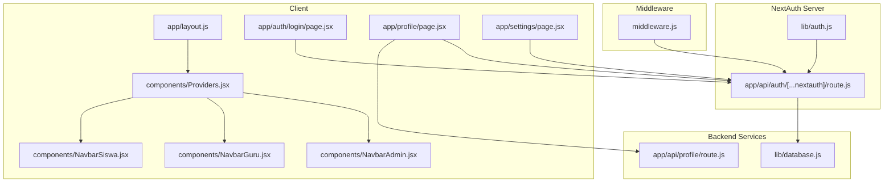
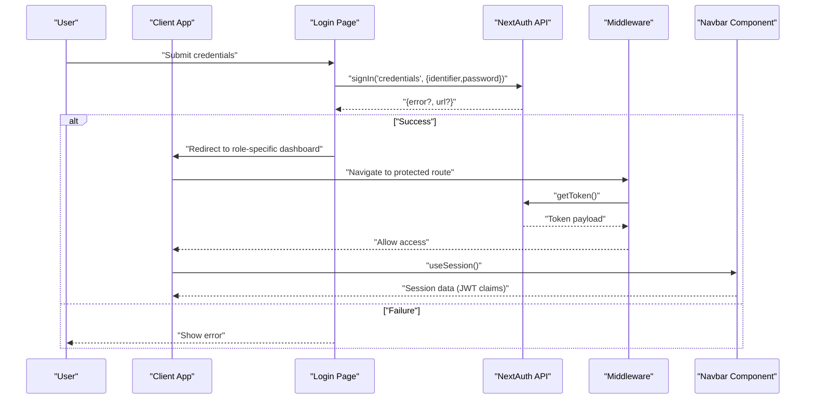
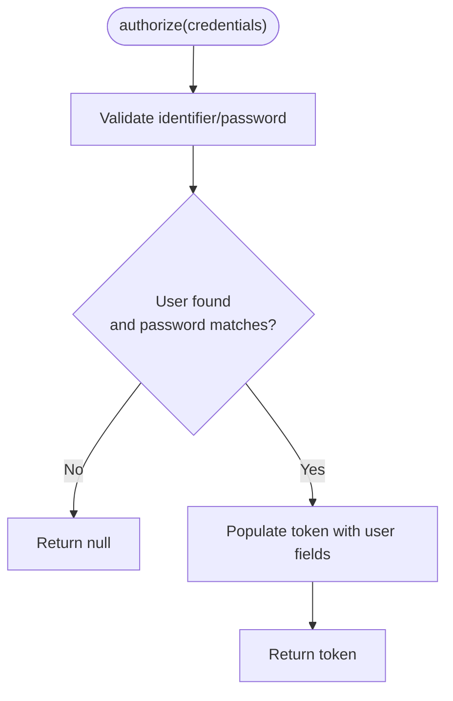
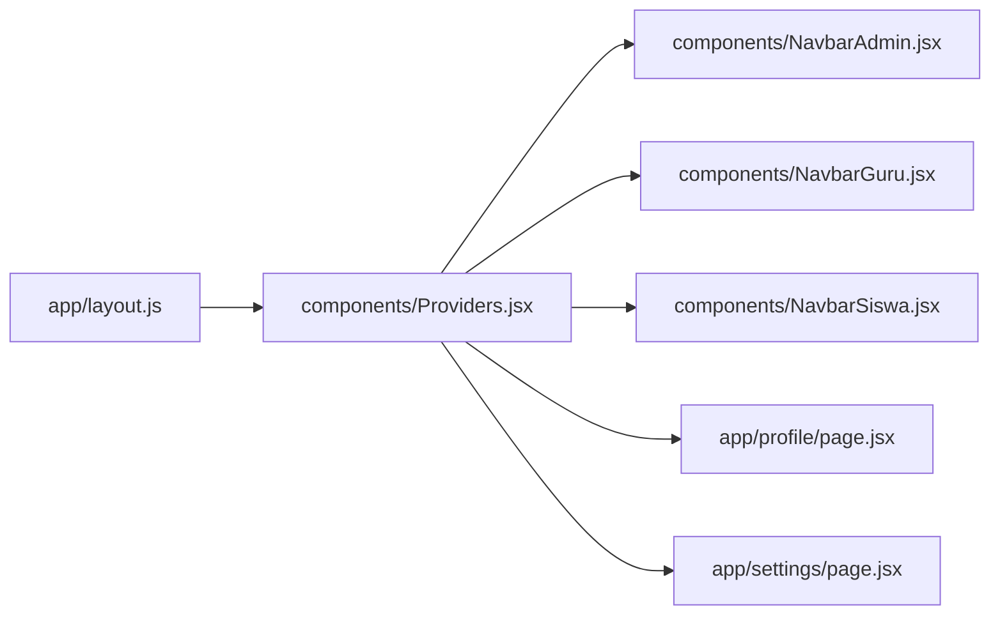
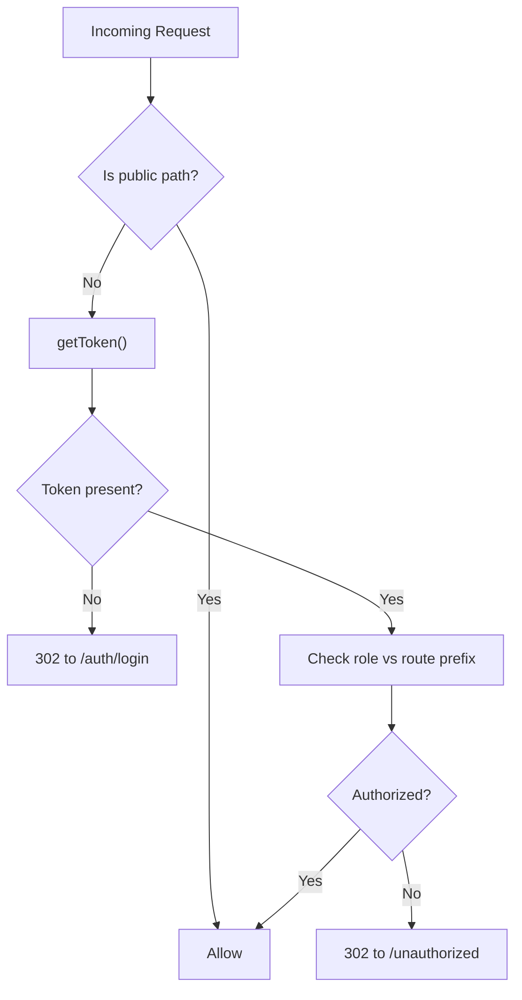
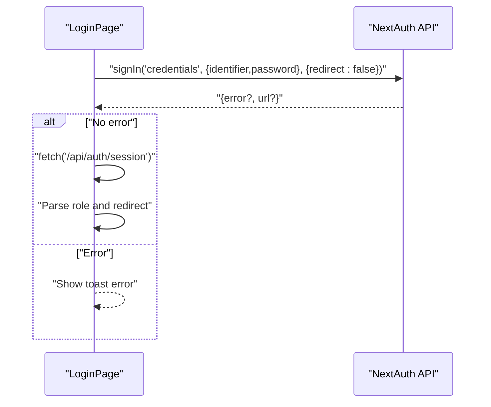
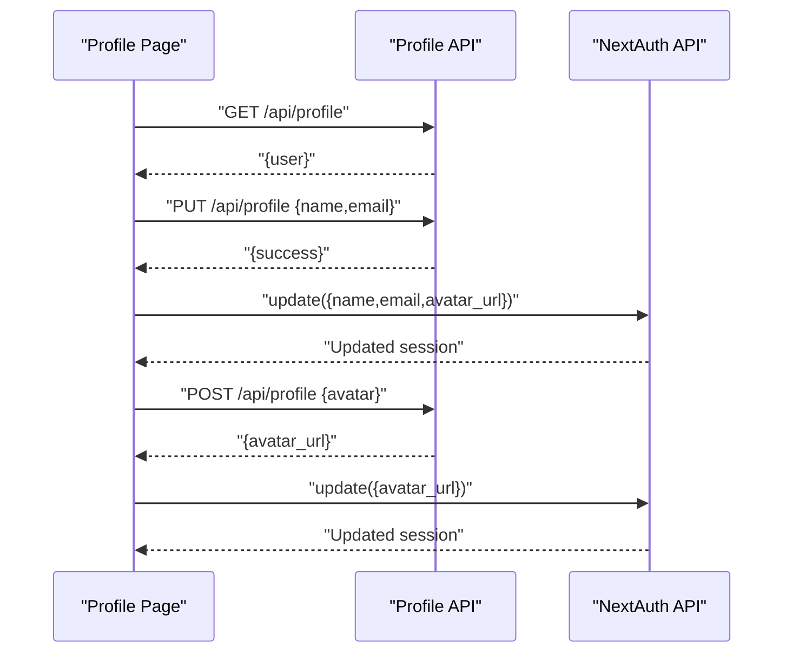
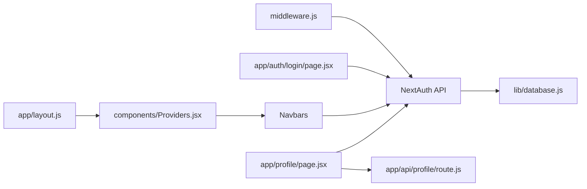

# Session Management

<cite>
**Referenced Files in This Document**
- [lib/auth.js](file://lib/auth.js)
- [components/Providers.jsx](file://components/Providers.jsx)
- [app/layout.js](file://app/layout.js)
- [middleware.js](file://middleware.js)
- [app/api/auth/[...nextauth]/route.js](file://app/api/auth/[...nextauth]/route.js)
- [app/auth/login/page.jsx](file://app/auth/login/page.jsx)
- [components/NavbarAdmin.jsx](file://components/NavbarAdmin.jsx)
- [components/NavbarGuru.jsx](file://components/NavbarGuru.jsx)
- [components/NavbarSiswa.jsx](file://components/NavbarSiswa.jsx)
- [app/admin/layout.jsx](file://app/admin/layout.jsx)
- [app/profile/page.jsx](file://app/profile/page.jsx)
- [app/settings/page.jsx](file://app/settings/page.jsx)
- [lib/database.js](file://lib/database.js)
- [app/api/profile/route.js](file://app/api/profile/route.js)
</cite>

## Table of Contents
1. [Introduction](#introduction)
2. [Project Structure](#project-structure)
3. [Core Components](#core-components)
4. [Architecture Overview](#architecture-overview)
5. [Detailed Component Analysis](#detailed-component-analysis)
6. [Dependency Analysis](#dependency-analysis)
7. [Performance Considerations](#performance-considerations)
8. [Troubleshooting Guide](#troubleshooting-guide)
9. [Conclusion](#conclusion)

## Introduction
This document explains session management in the E-BK application. It covers the NextAuth.js-based authentication and JWT session strategy, the client-side provider setup, and how authentication state is maintained across components. It also documents session persistence during page reloads, automatic cleanup via middleware protection, and practical patterns for accessing user data, updating session state, and handling authentication changes. Security measures, token refresh mechanisms, and React integration patterns are included, along with troubleshooting guidance and best practices.

## Project Structure
The session management spans backend NextAuth configuration, middleware protection, client-side providers, and frontend components that consume the session.



**Diagram sources**
- [app/layout.js:1-31](file://app/layout.js#L1-L31)
- [components/Providers.jsx:1-14](file://components/Providers.jsx#L1-L14)
- [components/NavbarAdmin.jsx:1-231](file://components/NavbarAdmin.jsx#L1-L231)
- [components/NavbarGuru.jsx:1-210](file://components/NavbarGuru.jsx#L1-L210)
- [components/NavbarSiswa.jsx:1-191](file://components/NavbarSiswa.jsx#L1-L191)
- [app/auth/login/page.jsx:1-110](file://app/auth/login/page.jsx#L1-L110)
- [app/profile/page.jsx:1-301](file://app/profile/page.jsx#L1-L301)
- [app/settings/page.jsx:1-126](file://app/settings/page.jsx#L1-L126)
- [app/api/auth/[...nextauth]/route.js:1-101](file://app/api/auth/[...nextauth]/route.js#L1-L101)
- [lib/auth.js:1-77](file://lib/auth.js#L1-L77)
- [middleware.js:1-53](file://middleware.js#L1-L53)
- [lib/database.js:1-23](file://lib/database.js#L1-L23)
- [app/api/profile/route.js:1-80](file://app/api/profile/route.js#L1-L80)

**Section sources**
- [app/layout.js:1-31](file://app/layout.js#L1-L31)
- [components/Providers.jsx:1-14](file://components/Providers.jsx#L1-L14)
- [middleware.js:1-53](file://middleware.js#L1-L53)
- [app/api/auth/[...nextauth]/route.js:1-101](file://app/api/auth/[...nextauth]/route.js#L1-L101)
- [lib/auth.js:1-77](file://lib/auth.js#L1-L77)
- [lib/database.js:1-23](file://lib/database.js#L1-L23)
- [app/api/profile/route.js:1-80](file://app/api/profile/route.js#L1-L80)

## Core Components
- NextAuth configuration with JWT strategy and credential provider
- Client-side SessionProvider wrapper
- Middleware enforcing protected routes and role checks
- Frontend components consuming useSession and performing sign-out
- Profile page integrating session updates and avatar uploads

Key implementation references:
- NextAuth JWT callbacks and session structure: [app/api/auth/[...nextauth]/route.js:57-89](file://app/api/auth/[...nextauth]/route.js#L57-L89)
- Client provider initialization: [components/Providers.jsx:6-13](file://components/Providers.jsx#L6-L13)
- Layout wiring of provider: [app/layout.js:20-29](file://app/layout.js#L20-L29)
- Middleware role gating: [middleware.js:11-43](file://middleware.js#L11-L43)
- Login flow and redirection: [app/auth/login/page.jsx:13-52](file://app/auth/login/page.jsx#L13-L52)
- Session consumption in navbars: [components/NavbarAdmin.jsx:10](file://components/NavbarAdmin.jsx#L10), [components/NavbarGuru.jsx:21](file://components/NavbarGuru.jsx#L21), [components/NavbarSiswa.jsx:14](file://components/NavbarSiswa.jsx#L14)
- Profile updates and session.refresh: [app/profile/page.jsx:46-89](file://app/profile/page.jsx#L46-L89)

**Section sources**
- [app/api/auth/[...nextauth]/route.js:57-89](file://app/api/auth/[...nextauth]/route.js#L57-L89)
- [components/Providers.jsx:6-13](file://components/Providers.jsx#L6-L13)
- [app/layout.js:20-29](file://app/layout.js#L20-L29)
- [middleware.js:11-43](file://middleware.js#L11-L43)
- [app/auth/login/page.jsx:13-52](file://app/auth/login/page.jsx#L13-L52)
- [components/NavbarAdmin.jsx:10](file://components/NavbarAdmin.jsx#L10)
- [components/NavbarGuru.jsx:21](file://components/NavbarGuru.jsx#L21)
- [components/NavbarSiswa.jsx:14](file://components/NavbarSiswa.jsx#L14)
- [app/profile/page.jsx:46-89](file://app/profile/page.jsx#L46-L89)

## Architecture Overview
The system uses NextAuth with JWT strategy. On successful credential submission, a signed JWT is stored client-side. The middleware validates tokens for protected routes and enforces role-based access. Components consume the session via next-auth/react hooks and can update session data server-side and then refresh the client session.



**Diagram sources**
- [app/auth/login/page.jsx:13-52](file://app/auth/login/page.jsx#L13-L52)
- [app/api/auth/[...nextauth]/route.js:57-89](file://app/api/auth/[...nextauth]/route.js#L57-L89)
- [middleware.js:11-43](file://middleware.js#L11-L43)
- [components/NavbarAdmin.jsx:10](file://components/NavbarAdmin.jsx#L10)

## Detailed Component Analysis

### NextAuth Configuration and JWT Strategy
- Provider: Credentials with flexible identifier (email/NIS/NIP)
- Strategy: JWT
- Callbacks:
  - jwt: populate token with user fields; support update-triggered field sync
  - session: ensure session.user has a complete structure derived from token
- Secret: configured via environment variable



**Diagram sources**
- [app/api/auth/[...nextauth]/route.js:16-49](file://app/api/auth/[...nextauth]/route.js#L16-L49)

**Section sources**
- [app/api/auth/[...nextauth]/route.js:6-96](file://app/api/auth/[...nextauth]/route.js#L6-L96)

### Client-Side SessionProvider and Layout Integration
- Providers wraps the app tree with SessionProvider
- Root layout injects Providers at the top level so all pages/components can use useSession



**Diagram sources**
- [app/layout.js:20-29](file://app/layout.js#L20-L29)
- [components/Providers.jsx:6-13](file://components/Providers.jsx#L6-L13)

**Section sources**
- [app/layout.js:20-29](file://app/layout.js#L20-L29)
- [components/Providers.jsx:6-13](file://components/Providers.jsx#L6-L13)

### Middleware Protection and Role-Based Access
- Public paths whitelisted
- Token extraction via next-auth/jwt
- Redirects to login if missing token
- Role checks gate admin/guru/siswa areas



**Diagram sources**
- [middleware.js:11-43](file://middleware.js#L11-L43)

**Section sources**
- [middleware.js:4-43](file://middleware.js#L4-L43)

### Login Flow and Post-Login Redirection
- Uses signIn with credentials provider
- On success, fetches session to determine role and redirects accordingly
- Toast feedback for errors



**Diagram sources**
- [app/auth/login/page.jsx:13-52](file://app/auth/login/page.jsx#L13-L52)

**Section sources**
- [app/auth/login/page.jsx:13-52](file://app/auth/login/page.jsx#L13-L52)

### Client-Side Session Consumption in Components
- Navbars use useSession to render user info and avatar
- Conditional rendering based on role
- Logout via signOut with callbackUrl

```mermaid
classDiagram
class NavbarAdmin {
+useSession()
+signOut()
+render()
}
class NavbarGuru {
+useSession()
+signOut()
+render()
}
class NavbarSiswa {
+useSession()
+signOut()
+render()
}
NavbarAdmin --> SessionHook["useSession()"]
NavbarGuru --> SessionHook
NavbarSiswa --> SessionHook
```

**Diagram sources**
- [components/NavbarAdmin.jsx:10](file://components/NavbarAdmin.jsx#L10)
- [components/NavbarGuru.jsx:21](file://components/NavbarGuru.jsx#L21)
- [components/NavbarSiswa.jsx:14](file://components/NavbarSiswa.jsx#L14)

**Section sources**
- [components/NavbarAdmin.jsx:10](file://components/NavbarAdmin.jsx#L10)
- [components/NavbarGuru.jsx:21](file://components/NavbarGuru.jsx#L21)
- [components/NavbarSiswa.jsx:14](file://components/NavbarSiswa.jsx#L14)

### Session Updates and Profile Integration
- Fetch user data from server endpoint
- Update server profile (name/email)
- Refresh client session via update({ name, email, avatar_url })
- Upload avatar, persist to disk and DB, then refresh session



**Diagram sources**
- [app/profile/page.jsx:35-89](file://app/profile/page.jsx#L35-L89)
- [app/api/profile/route.js:7-79](file://app/api/profile/route.js#L7-L79)
- [app/api/auth/[...nextauth]/route.js:57-89](file://app/api/auth/[...nextauth]/route.js#L57-L89)

**Section sources**
- [app/profile/page.jsx:35-89](file://app/profile/page.jsx#L35-L89)
- [app/api/profile/route.js:7-79](file://app/api/profile/route.js#L7-L79)

### Admin Layout Composition
- Admin pages wrap content with NavbarAdmin and fixed top offset for content area

**Section sources**
- [app/admin/layout.jsx:7-16](file://app/admin/layout.jsx#L7-L16)

## Dependency Analysis
- Client depends on next-auth/react for useSession/signOut/update
- NextAuth server depends on database utilities for user lookup and verification
- Middleware depends on next-auth/jwt for token validation
- Profile page depends on NextAuth session and profile API



**Diagram sources**
- [app/api/auth/[...nextauth]/route.js:1-101](file://app/api/auth/[...nextauth]/route.js#L1-L101)
- [lib/database.js:1-23](file://lib/database.js#L1-L23)
- [middleware.js:1-53](file://middleware.js#L1-L53)
- [app/auth/login/page.jsx:1-110](file://app/auth/login/page.jsx#L1-L110)
- [components/NavbarAdmin.jsx:1-231](file://components/NavbarAdmin.jsx#L1-L231)
- [components/NavbarGuru.jsx:1-210](file://components/NavbarGuru.jsx#L1-L210)
- [components/NavbarSiswa.jsx:1-191](file://components/NavbarSiswa.jsx#L1-L191)
- [app/profile/page.jsx:1-301](file://app/profile/page.jsx#L1-L301)
- [app/api/profile/route.js:1-80](file://app/api/profile/route.js#L1-L80)
- [app/layout.js:1-31](file://app/layout.js#L1-L31)
- [components/Providers.jsx:1-14](file://components/Providers.jsx#L1-L14)

**Section sources**
- [app/api/auth/[...nextauth]/route.js:1-101](file://app/api/auth/[...nextauth]/route.js#L1-L101)
- [lib/database.js:1-23](file://lib/database.js#L1-L23)
- [middleware.js:1-53](file://middleware.js#L1-L53)
- [app/auth/login/page.jsx:1-110](file://app/auth/login/page.jsx#L1-L110)
- [components/NavbarAdmin.jsx:1-231](file://components/NavbarAdmin.jsx#L1-L231)
- [components/NavbarGuru.jsx:1-210](file://components/NavbarGuru.jsx#L1-L210)
- [components/NavbarSiswa.jsx:1-191](file://components/NavbarSiswa.jsx#L1-L191)
- [app/profile/page.jsx:1-301](file://app/profile/page.jsx#L1-L301)
- [app/api/profile/route.js:1-80](file://app/api/profile/route.js#L1-L80)
- [app/layout.js:1-31](file://app/layout.js#L1-L31)
- [components/Providers.jsx:1-14](file://components/Providers.jsx#L1-L14)

## Performance Considerations
- JWT strategy avoids server-side session storage; rely on token size and expiration policies
- Keep session.user minimal; avoid storing large payloads
- Use middleware to short-circuit unauthorized requests early
- Debounce frequent session reads in components; memoize derived values
- Minimize re-renders by extracting only needed fields from session

## Troubleshooting Guide
Common issues and resolutions:
- Unauthorized access after logout or expired token
  - Verify middleware token retrieval and role checks
  - Ensure NEXTAUTH_SECRET is set and consistent
  - Confirm client-side signOut redirects to login
  - References: [middleware.js:11-43](file://middleware.js#L11-L43), [components/NavbarAdmin.jsx:155](file://components/NavbarAdmin.jsx#L155)

- Role mismatch or incorrect redirection
  - Check token role propagation in callbacks
  - Validate login page role routing logic
  - References: [app/api/auth/[...nextauth]/route.js:57-89](file://app/api/auth/[...nextauth]/route.js#L57-L89), [app/auth/login/page.jsx:38-51](file://app/auth/login/page.jsx#L38-L51)

- Session not updating after profile changes
  - Ensure update() is called with changed fields
  - Verify server-side profile updates persisted
  - References: [app/profile/page.jsx:46-89](file://app/profile/page.jsx#L46-L89), [app/api/profile/route.js:23-43](file://app/api/profile/route.js#L23-L43)

- Avatar upload failures
  - Confirm upload directory exists and is writable
  - Validate file presence in multipart/form-data
  - References: [app/api/profile/route.js:45-79](file://app/api/profile/route.js#L45-L79)

- Database connectivity errors
  - Check DB environment variables and connection limits
  - References: [lib/database.js:3-21](file://lib/database.js#L3-L21)

**Section sources**
- [middleware.js:11-43](file://middleware.js#L11-L43)
- [components/NavbarAdmin.jsx:155](file://components/NavbarAdmin.jsx#L155)
- [app/api/auth/[...nextauth]/route.js:57-89](file://app/api/auth/[...nextauth]/route.js#L57-L89)
- [app/auth/login/page.jsx:38-51](file://app/auth/login/page.jsx#L38-L51)
- [app/profile/page.jsx:46-89](file://app/profile/page.jsx#L46-L89)
- [app/api/profile/route.js:23-79](file://app/api/profile/route.js#L23-L79)
- [lib/database.js:3-21](file://lib/database.js#L3-L21)

## Conclusion
The E-BK application implements robust session management using NextAuth with JWT strategy. The client-side SessionProvider ensures global session availability, while middleware enforces secure, role-aware routing. Components consume session data seamlessly, and the profile page demonstrates safe session updates and avatar handling. By following the outlined patterns and troubleshooting steps, teams can maintain secure, reliable authentication across the application.