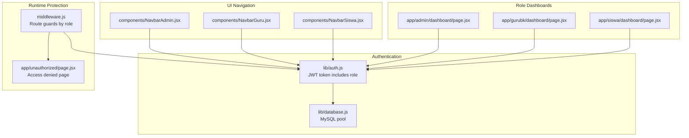
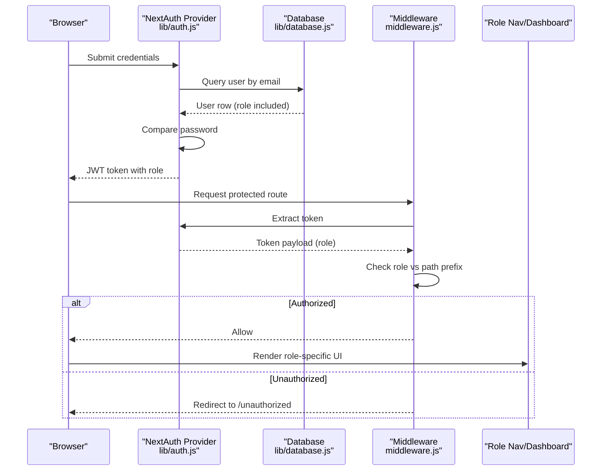
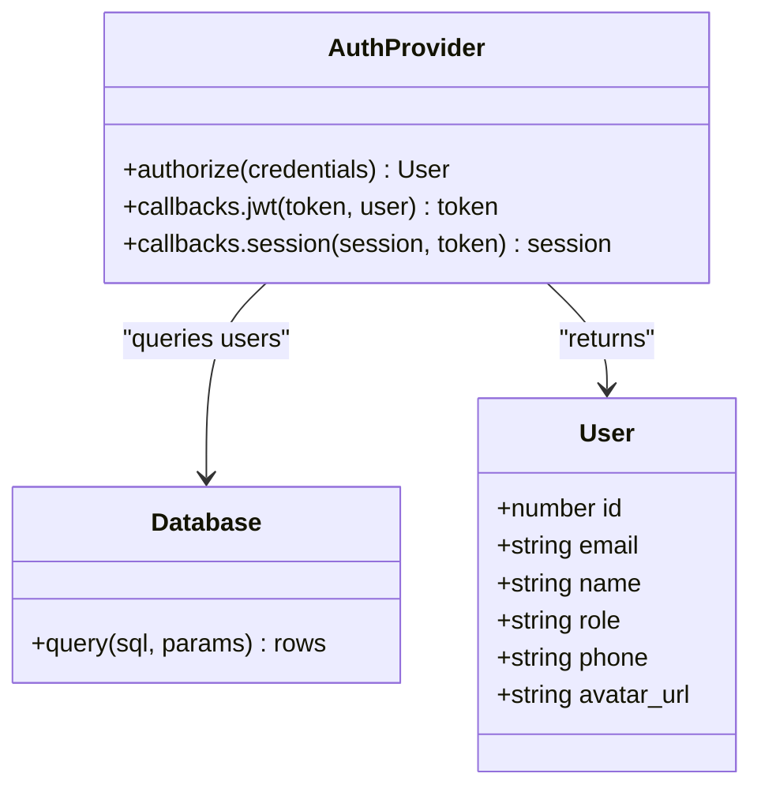
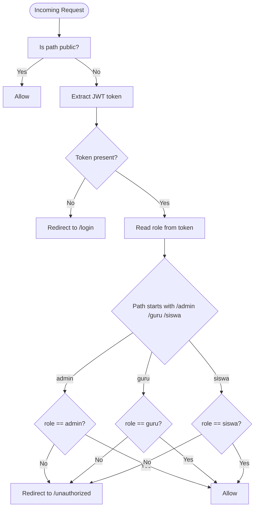
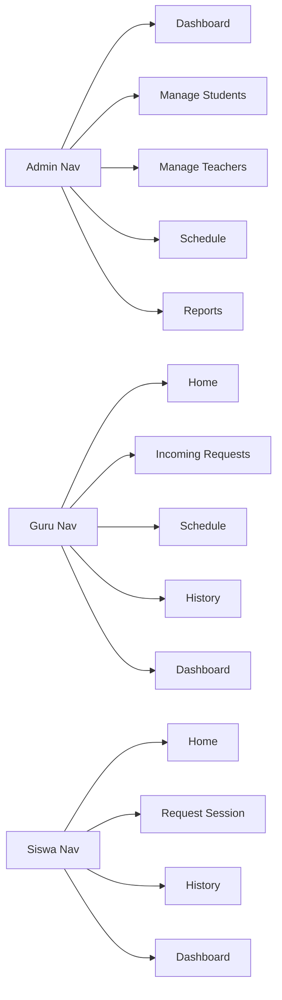
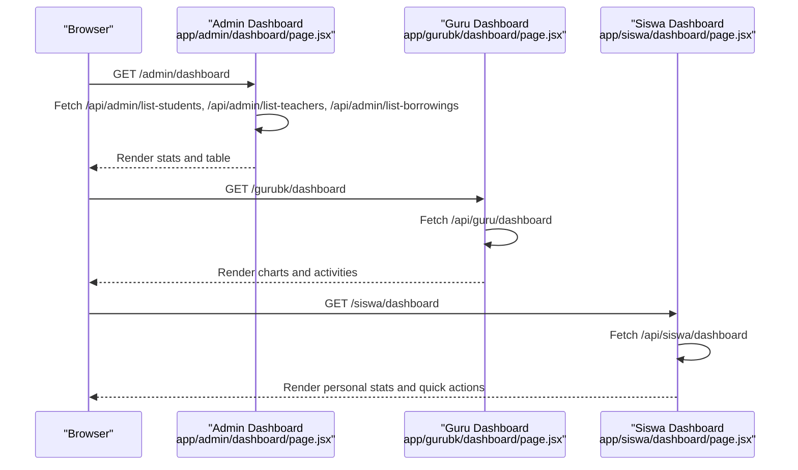
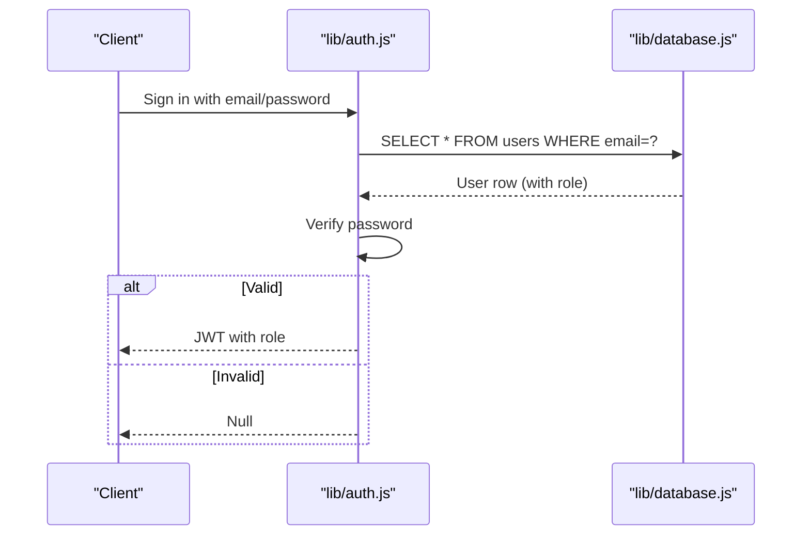
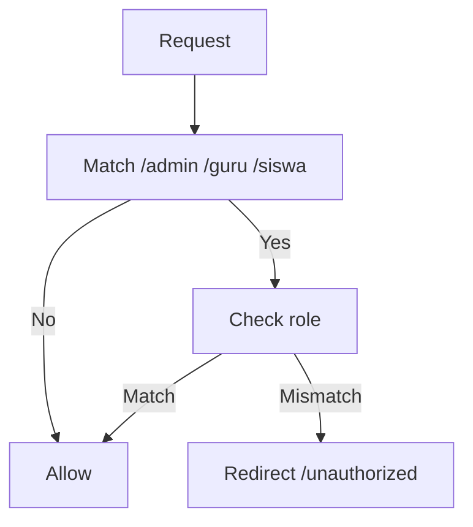
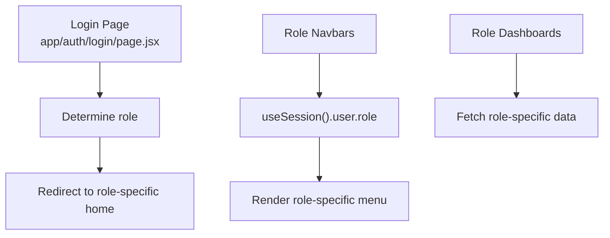
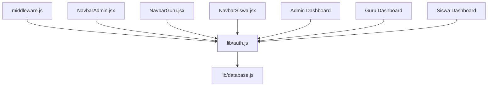

# User Roles & Permissions

<cite>
**Referenced Files in This Document**
- [lib/auth.js](file://lib/auth.js)
- [middleware.js](file://middleware.js)
- [lib/database.js](file://lib/database.js)
- [databasebk.sql](file://databasebk.sql)
- [components/NavbarAdmin.jsx](file://components/NavbarAdmin.jsx)
- [components/NavbarGuru.jsx](file://components/NavbarGuru.jsx)
- [components/NavbarSiswa.jsx](file://components/NavbarSiswa.jsx)
- [app/auth/login/page.jsx](file://app/auth/login/page.jsx)
- [app/unauthorized/page.jsx](file://app/unauthorized/page.jsx)
- [app/admin/dashboard/page.jsx](file://app/admin/dashboard/page.jsx)
- [app/gurubk/dashboard/page.jsx](file://app/gurubk/dashboard/page.jsx)
- [app/siswa/dashboard/page.jsx](file://app/siswa/dashboard/page.jsx)
</cite>

## Table of Contents
1. [Introduction](#introduction)
2. [Project Structure](#project-structure)
3. [Core Components](#core-components)
4. [Architecture Overview](#architecture-overview)
5. [Detailed Component Analysis](#detailed-component-analysis)
6. [Dependency Analysis](#dependency-analysis)
7. [Performance Considerations](#performance-considerations)
8. [Troubleshooting Guide](#troubleshooting-guide)
9. [Conclusion](#conclusion)

## Introduction
This document describes the user role-based permission system used by the application. It defines the three user roles (Admin, Guru BK, Siswa), how roles are assigned and validated, and how access is enforced across the application. It also documents role-specific navigation patterns, dashboard access controls, and feature availability. Guidance is included for implementing role-based conditional rendering, permission checks in components, and dynamic menu generation. Finally, it outlines role hierarchy, permission inheritance, and security implications.

## Project Structure
The permission system spans authentication, middleware protection, role-aware navigation, and role-specific dashboards:
- Authentication stores the user’s role in the JWT token and exposes it via the session.
- Middleware enforces role-based access to protected routes.
- Role-aware navigation components render menus tailored to the logged-in user’s role.
- Role-specific dashboards and pages expose features appropriate to each role.

**Diagram sources**
- [lib/auth.js:1-77](file://lib/auth.js#L1-L77)
- [middleware.js:1-53](file://middleware.js#L1-L53)
- [lib/database.js:1-23](file://lib/database.js#L1-L23)
- [components/NavbarAdmin.jsx:1-231](file://components/NavbarAdmin.jsx#L1-L231)
- [components/NavbarGuru.jsx:1-210](file://components/NavbarGuru.jsx#L1-L210)
- [components/NavbarSiswa.jsx:1-191](file://components/NavbarSiswa.jsx#L1-L191)
- [app/admin/dashboard/page.jsx:1-255](file://app/admin/dashboard/page.jsx#L1-L255)
- [app/gurubk/dashboard/page.jsx:1-158](file://app/gurubk/dashboard/page.jsx#L1-L158)
- [app/siswa/dashboard/page.jsx:1-209](file://app/siswa/dashboard/page.jsx#L1-L209)
- [app/unauthorized/page.jsx:1-9](file://app/unauthorized/page.jsx#L1-L9)

**Section sources**
- [lib/auth.js:1-77](file://lib/auth.js#L1-L77)
- [middleware.js:1-53](file://middleware.js#L1-L53)
- [lib/database.js:1-23](file://lib/database.js#L1-L23)
- [components/NavbarAdmin.jsx:1-231](file://components/NavbarAdmin.jsx#L1-L231)
- [components/NavbarGuru.jsx:1-210](file://components/NavbarGuru.jsx#L1-L210)
- [components/NavbarSiswa.jsx:1-191](file://components/NavbarSiswa.jsx#L1-L191)
- [app/admin/dashboard/page.jsx:1-255](file://app/admin/dashboard/page.jsx#L1-L255)
- [app/gurubk/dashboard/page.jsx:1-158](file://app/gurubk/dashboard/page.jsx#L1-L158)
- [app/siswa/dashboard/page.jsx:1-209](file://app/siswa/dashboard/page.jsx#L1-L209)
- [app/unauthorized/page.jsx:1-9](file://app/unauthorized/page.jsx#L1-L9)

## Core Components
- Authentication provider and session augmentation:
  - The authentication provider extracts role, phone, and avatar from the database user and attaches them to the JWT token and session.
  - The session exposes role to client-side components for UI decisions.
- Middleware route guards:
  - Public paths are whitelisted; all other paths are guarded by role checks.
  - Access to /admin requires role admin; /guru requires role guru; /siswa requires role siswa.
  - Unauthorized access redirects to a dedicated access-denied page.
- Role-aware navigation:
  - Three navbar components render role-appropriate menus and profile actions.
- Role-specific dashboards:
  - Admin dashboard aggregates stats and borrowing history.
  - Guru dashboard shows requests, schedules, and activity charts.
  - Siswa dashboard shows personal stats, upcoming sessions, and quick actions.

**Section sources**
- [lib/auth.js:55-72](file://lib/auth.js#L55-L72)
- [middleware.js:11-43](file://middleware.js#L11-L43)
- [components/NavbarAdmin.jsx:17-23](file://components/NavbarAdmin.jsx#L17-L23)
- [components/NavbarGuru.jsx:28-34](file://components/NavbarGuru.jsx#L28-L34)
- [components/NavbarSiswa.jsx:20-25](file://components/NavbarSiswa.jsx#L20-L25)
- [app/admin/dashboard/page.jsx:8-37](file://app/admin/dashboard/page.jsx#L8-L37)
- [app/gurubk/dashboard/page.jsx:20-28](file://app/gurubk/dashboard/page.jsx#L20-L28)
- [app/siswa/dashboard/page.jsx:7-24](file://app/siswa/dashboard/page.jsx#L7-L24)

## Architecture Overview
The system follows a layered approach:
- Data layer: MySQL database with a users table containing role values.
- Authentication layer: NextAuth.js with a custom credentials provider that loads user data and role from the database, then augments JWT and session with role.
- Runtime protection: Next.js middleware inspects the JWT token to enforce role-based access to protected routes.
- Presentation layer: Role-aware navbars and dashboards render content and navigation based on the user’s role.

**Diagram sources**
- [lib/auth.js:14-44](file://lib/auth.js#L14-L44)
- [lib/database.js:13-21](file://lib/database.js#L13-L21)
- [middleware.js:19-40](file://middleware.js#L19-L40)
- [app/unauthorized/page.jsx:1-9](file://app/unauthorized/page.jsx#L1-L9)

## Detailed Component Analysis

### Authentication and Session Augmentation
- Role assignment:
  - The users table defines role as an enumeration with values admin, guru, and siswa.
  - On successful credential verification, the provider returns a user object that includes role.
- Token and session augmentation:
  - The JWT callback attaches role, phone, and avatar_url to the token.
  - The session callback attaches these fields to the session.user object.
- Security note:
  - The session strategy uses JWT, ensuring role is available client-side for UI decisions without server round-trips.

**Diagram sources**
- [lib/auth.js:14-44](file://lib/auth.js#L14-L44)
- [lib/database.js:13-21](file://lib/database.js#L13-L21)
- [databasebk.sql:25-38](file://databasebk.sql#L25-L38)

**Section sources**
- [lib/auth.js:14-44](file://lib/auth.js#L14-L44)
- [lib/auth.js:55-72](file://lib/auth.js#L55-L72)
- [lib/database.js:13-21](file://lib/database.js#L13-L21)
- [databasebk.sql:25-38](file://databasebk.sql#L25-L38)

### Middleware Role-Based Access Control
- Public paths:
  - Root, login, register, and API auth endpoints are publicly accessible.
- Protected prefixes:
  - Requests to /admin require role admin.
  - Requests to /guru require role guru.
  - Requests to /siswa require role siswa.
- Unauthorized handling:
  - Missing or invalid tokens redirect to login.
  - Role mismatch redirects to /unauthorized.

**Diagram sources**
- [middleware.js:4-43](file://middleware.js#L4-L43)
- [app/unauthorized/page.jsx:1-9](file://app/unauthorized/page.jsx#L1-L9)

**Section sources**
- [middleware.js:4-43](file://middleware.js#L4-L43)
- [app/unauthorized/page.jsx:1-9](file://app/unauthorized/page.jsx#L1-L9)

### Role-Specific Navigation Patterns
- Admin navigation:
  - Displays dashboard, student and teacher management, schedule, and reports.
- Guru navigation:
  - Displays home, incoming requests, schedule, history, and dashboard.
- Siswa navigation:
  - Displays home, request scheduling, history, and dashboard.
- Profile dropdowns:
  - Each navbar includes profile actions and logout.

**Diagram sources**
- [components/NavbarAdmin.jsx:17-23](file://components/NavbarAdmin.jsx#L17-L23)
- [components/NavbarGuru.jsx:28-34](file://components/NavbarGuru.jsx#L28-L34)
- [components/NavbarSiswa.jsx:20-25](file://components/NavbarSiswa.jsx#L20-L25)

**Section sources**
- [components/NavbarAdmin.jsx:17-23](file://components/NavbarAdmin.jsx#L17-L23)
- [components/NavbarGuru.jsx:28-34](file://components/NavbarGuru.jsx#L28-L34)
- [components/NavbarSiswa.jsx:20-25](file://components/NavbarSiswa.jsx#L20-L25)

### Role-Specific Dashboards and Feature Availability
- Admin dashboard:
  - Loads counts and borrowing history via API endpoints.
  - Provides filtering and search for borrowing records.
- Guru dashboard:
  - Fetches statistics, charts, and recent activities.
  - Includes quick access to notes creation.
- Siswa dashboard:
  - Fetches personal stats, upcoming sessions, and latest request status.
  - Provides quick actions to request sessions and view history.

**Diagram sources**
- [app/admin/dashboard/page.jsx:20-37](file://app/admin/dashboard/page.jsx#L20-L37)
- [app/gurubk/dashboard/page.jsx:23-28](file://app/gurubk/dashboard/page.jsx#L23-L28)
- [app/siswa/dashboard/page.jsx:11-24](file://app/siswa/dashboard/page.jsx#L11-L24)

**Section sources**
- [app/admin/dashboard/page.jsx:20-37](file://app/admin/dashboard/page.jsx#L20-L37)
- [app/gurubk/dashboard/page.jsx:23-28](file://app/gurubk/dashboard/page.jsx#L23-L28)
- [app/siswa/dashboard/page.jsx:11-24](file://app/siswa/dashboard/page.jsx#L11-L24)

### Role Assignment During Authentication
- The credentials provider queries the users table by email and compares the provided password against the stored hash.
- On success, the returned user object includes role, which is attached to the JWT token and session by the callbacks.

**Diagram sources**
- [lib/auth.js:14-44](file://lib/auth.js#L14-L44)
- [lib/database.js:13-21](file://lib/database.js#L13-L21)
- [databasebk.sql:25-38](file://databasebk.sql#L25-L38)

**Section sources**
- [lib/auth.js:14-44](file://lib/auth.js#L14-L44)
- [lib/database.js:13-21](file://lib/database.js#L13-L21)
- [databasebk.sql:25-38](file://databasebk.sql#L25-L38)

### Role Validation in Middleware
- The middleware retrieves the JWT token and reads the role claim.
- It enforces strict prefix-based access rules:
  - /admin requires role admin.
  - /guru requires role guru.
  - /siswa requires role siswa.
- Unauthorized attempts are redirected to /unauthorized.

**Diagram sources**
- [middleware.js:11-43](file://middleware.js#L11-L43)

**Section sources**
- [middleware.js:11-43](file://middleware.js#L11-L43)

### Enforcement Throughout the Application
- Client-side enforcement:
  - Navbars and dashboards rely on session.user.role to render role-appropriate UI.
  - Login page determines post-login destination based on role.
- Server-side enforcement:
  - API routes should validate role when performing privileged operations (not shown in the provided files).
  - Database schema supports role-based access via foreign keys and status fields.

**Diagram sources**
- [app/auth/login/page.jsx:32-51](file://app/auth/login/page.jsx#L32-L51)
- [components/NavbarAdmin.jsx:9-11](file://components/NavbarAdmin.jsx#L9-L11)
- [components/NavbarGuru.jsx:20-22](file://components/NavbarGuru.jsx#L20-L22)
- [components/NavbarSiswa.jsx:12-14](file://components/NavbarSiswa.jsx#L12-L14)
- [app/admin/dashboard/page.jsx:8-37](file://app/admin/dashboard/page.jsx#L8-L37)
- [app/gurubk/dashboard/page.jsx:20-28](file://app/gurubk/dashboard/page.jsx#L20-L28)
- [app/siswa/dashboard/page.jsx:7-24](file://app/siswa/dashboard/page.jsx#L7-L24)

**Section sources**
- [app/auth/login/page.jsx:32-51](file://app/auth/login/page.jsx#L32-L51)
- [components/NavbarAdmin.jsx:9-11](file://components/NavbarAdmin.jsx#L9-L11)
- [components/NavbarGuru.jsx:20-22](file://components/NavbarGuru.jsx#L20-L22)
- [components/NavbarSiswa.jsx:12-14](file://components/NavbarSiswa.jsx#L12-L14)
- [app/admin/dashboard/page.jsx:8-37](file://app/admin/dashboard/page.jsx#L8-L37)
- [app/gurubk/dashboard/page.jsx:20-28](file://app/gurubk/dashboard/page.jsx#L20-L28)
- [app/siswa/dashboard/page.jsx:7-24](file://app/siswa/dashboard/page.jsx#L7-L24)

### Role-Based Conditional Rendering and Dynamic Menus
- Conditional rendering:
  - Navbars read session.user.role and render only permitted menu items.
- Dynamic menus:
  - Menu arrays are defined per role and rendered with active-state detection based on current path.
- Practical guidance:
  - To add a new role-specific feature, define a new route under the appropriate prefix (/admin, /guru, /siswa) and ensure middleware allows access for that role.

**Section sources**
- [components/NavbarAdmin.jsx:17-23](file://components/NavbarAdmin.jsx#L17-L23)
- [components/NavbarGuru.jsx:28-34](file://components/NavbarGuru.jsx#L28-L34)
- [components/NavbarSiswa.jsx:20-25](file://components/NavbarSiswa.jsx#L20-L25)

### Permission Checking in Components
- Use the session hook to access role and conditionally render UI.
- Example pattern:
  - If session.user.role === "admin", show admin-only menu items.
  - If session.user.role === "guru", show guru-only features.
  - If session.user.role === "siswa", show student features.

**Section sources**
- [components/NavbarAdmin.jsx:9-11](file://components/NavbarAdmin.jsx#L9-L11)
- [components/NavbarGuru.jsx:20-22](file://components/NavbarGuru.jsx#L20-L22)
- [components/NavbarSiswa.jsx:12-14](file://components/NavbarSiswa.jsx#L12-L14)

### Role Hierarchy, Inheritance, and Security Implications
- Role hierarchy:
  - There is no explicit inheritance model in the codebase; access is determined by exact role match against path prefixes.
- Security implications:
  - Role is embedded in the JWT and exposed to the client; avoid storing sensitive data in the token.
  - Middleware enforces access at the routing level; server-side API endpoints should additionally validate role for write operations.
  - Database constraints ensure referential integrity among users, borrowings, schedules, and notes.

**Section sources**
- [middleware.js:25-40](file://middleware.js#L25-L40)
- [databasebk.sql:68-89](file://databasebk.sql#L68-L89)
- [databasebk.sql:92-106](file://databasebk.sql#L92-L106)
- [databasebk.sql:127-140](file://databasebk.sql#L127-L140)

## Dependency Analysis
- Authentication depends on the database for user lookup and bcrypt for password comparison.
- Middleware depends on NextAuth JWT extraction to enforce access.
- UI components depend on the session to render role-specific content.
- Dashboards depend on API endpoints for role-specific data.

**Diagram sources**
- [lib/auth.js:1-77](file://lib/auth.js#L1-L77)
- [lib/database.js:1-23](file://lib/database.js#L1-L23)
- [middleware.js:1-53](file://middleware.js#L1-L53)
- [components/NavbarAdmin.jsx:1-231](file://components/NavbarAdmin.jsx#L1-L231)
- [components/NavbarGuru.jsx:1-210](file://components/NavbarGuru.jsx#L1-L210)
- [components/NavbarSiswa.jsx:1-191](file://components/NavbarSiswa.jsx#L1-L191)
- [app/admin/dashboard/page.jsx:1-255](file://app/admin/dashboard/page.jsx#L1-L255)
- [app/gurubk/dashboard/page.jsx:1-158](file://app/gurubk/dashboard/page.jsx#L1-L158)
- [app/siswa/dashboard/page.jsx:1-209](file://app/siswa/dashboard/page.jsx#L1-L209)

**Section sources**
- [lib/auth.js:1-77](file://lib/auth.js#L1-L77)
- [lib/database.js:1-23](file://lib/database.js#L1-L23)
- [middleware.js:1-53](file://middleware.js#L1-L53)
- [components/NavbarAdmin.jsx:1-231](file://components/NavbarAdmin.jsx#L1-L231)
- [components/NavbarGuru.jsx:1-210](file://components/NavbarGuru.jsx#L1-L210)
- [components/NavbarSiswa.jsx:1-191](file://components/NavbarSiswa.jsx#L1-L191)
- [app/admin/dashboard/page.jsx:1-255](file://app/admin/dashboard/page.jsx#L1-L255)
- [app/gurubk/dashboard/page.jsx:1-158](file://app/gurubk/dashboard/page.jsx#L1-L158)
- [app/siswa/dashboard/page.jsx:1-209](file://app/siswa/dashboard/page.jsx#L1-L209)

## Performance Considerations
- Keep role checks lightweight by relying on the in-memory JWT token in middleware.
- Avoid heavy computations in middleware; delegate to API endpoints for complex logic.
- Use client-side memoization and efficient filtering in dashboards (as seen in the admin dashboard) to minimize re-renders.

## Troubleshooting Guide
- Login fails or role missing:
  - Verify the users table contains the correct role values and that the credentials provider successfully queries the database.
- Redirect loop to /login:
  - Ensure NEXTAUTH_SECRET is configured and that the JWT token is being extracted properly in middleware.
- Redirect to /unauthorized:
  - Confirm the user’s role matches the expected role for the requested path prefix.
- Role-specific UI not rendering:
  - Check that session.user.role is available in the navbar components and that conditional rendering logic is correct.

**Section sources**
- [lib/auth.js:14-44](file://lib/auth.js#L14-L44)
- [middleware.js:19-40](file://middleware.js#L19-L40)
- [app/unauthorized/page.jsx:1-9](file://app/unauthorized/page.jsx#L1-L9)

## Conclusion
The application implements a straightforward, effective role-based permission system centered on JWT-embedded roles and middleware-driven route guards. Roles are assigned at login and validated across the application to control access to role-specific areas. The UI adapts dynamically to the user’s role, and dashboards surface role-appropriate features. For enhanced security, ensure server-side API endpoints validate roles for write operations and that sensitive data is not stored in the JWT.