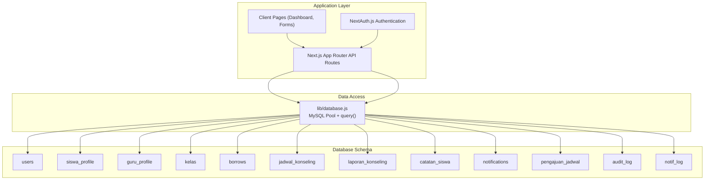
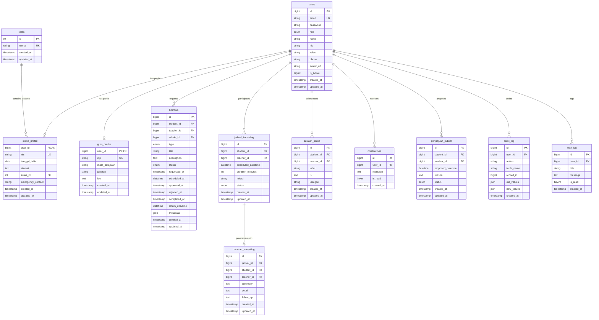
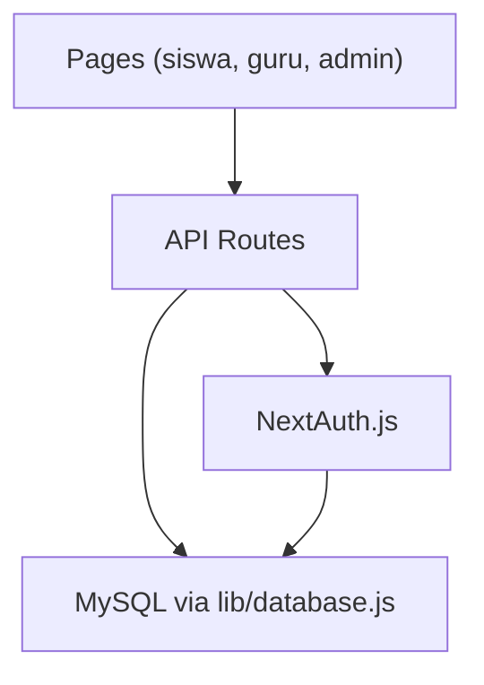
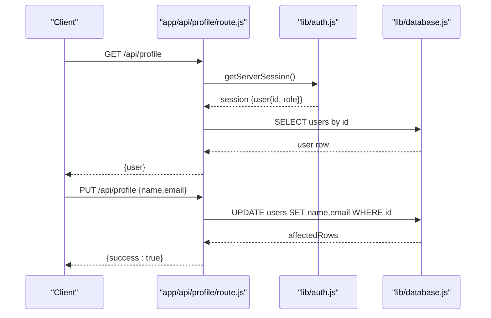
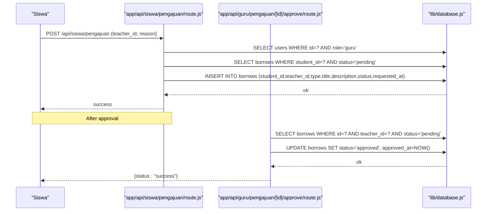
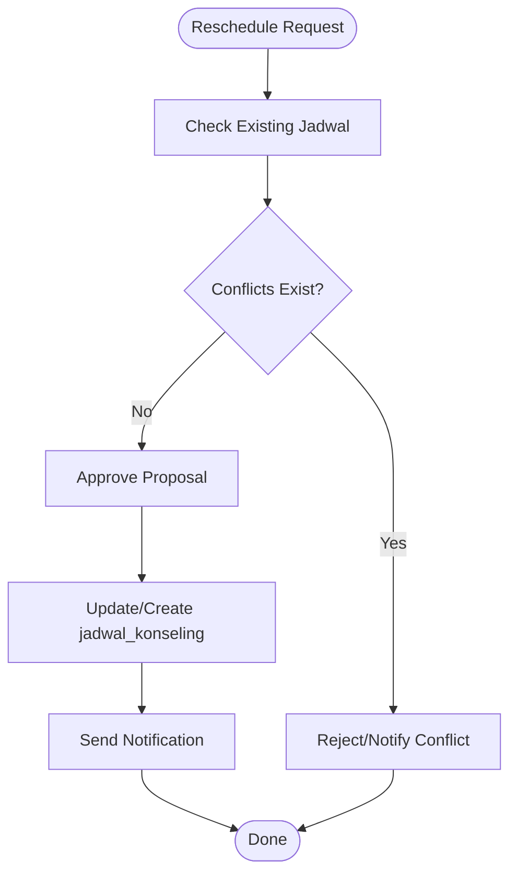
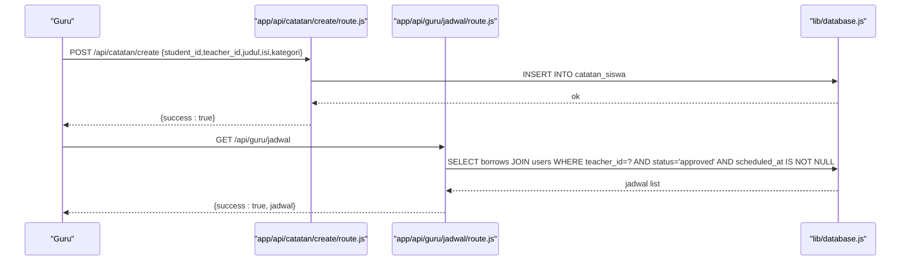
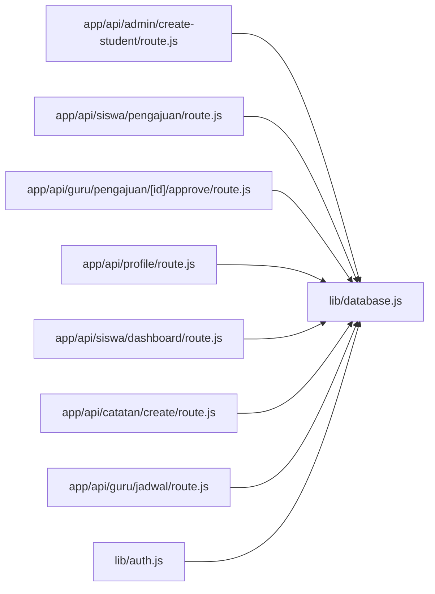

# Data Models

<cite>
**Referenced Files in This Document**
- [databasebk.sql](file://databasebk.sql)
- [lib/database.js](file://lib/database.js)
- [lib/auth.js](file://lib/auth.js)
- [seed.js](file://seed.js)
- [app/api/admin/create-student/route.js](file://app/api/admin/create-student/route.js)
- [app/api/admin/list-students/route.js](file://app/api/admin/list-students/route.js)
- [app/api/siswa/pengajuan/route.js](file://app/api/siswa/pengajuan/route.js)
- [app/api/guru/pengajuan/[id]/approve/route.js](file://app/api/guru/pengajuan/[id]/approve/route.js)
- [app/api/guru/jadwal/route.js](file://app/api/guru/jadwal/route.js)
- [app/api/catatan/create/route.js](file://app/api/catatan/create/route.js)
- [app/api/profile/route.js](file://app/api/profile/route.js)
- [app/api/siswa/dashboard/route.js](file://app/api/siswa/dashboard/route.js)
</cite>

## Table of Contents
1. [Introduction](#introduction)
2. [Project Structure](#project-structure)
3. [Core Components](#core-components)
4. [Architecture Overview](#architecture-overview)
5. [Detailed Component Analysis](#detailed-component-analysis)
6. [Dependency Analysis](#dependency-analysis)
7. [Performance Considerations](#performance-considerations)
8. [Troubleshooting Guide](#troubleshooting-guide)
9. [Conclusion](#conclusion)
10. [Appendices](#appendices)

## Introduction
This document describes the complete data models that underpin the E-BK application’s core functionality. It covers:
- User management model (roles, profiles, authentication)
- Appointment booking model (request workflow, status tracking)
- Scheduling model (availability, conflicts, rescheduling)
- Progress tracking model (notes, reports, follow-up)
It also documents validation rules, business constraints, lifecycle management, typical data patterns, and transformations, and explains how each model supports specific features and user workflows.

## Project Structure
The application uses a MySQL relational schema with Next.js App Router API routes for data access and NextAuth.js for authentication. Data access is centralized via a MySQL connection pool abstraction.

**Diagram sources**
- [lib/database.js:1-23](file://lib/database.js#L1-L23)
- [databasebk.sql:24-183](file://databasebk.sql#L24-L183)

**Section sources**
- [lib/database.js:1-23](file://lib/database.js#L1-L23)
- [databasebk.sql:11-211](file://databasebk.sql#L11-L211)

## Core Components
This section outlines the primary data entities and their relationships.

- Users: Base entity for all identities (admin, guru, siswa). Includes credentials, roles, contact info, and avatar.
- Student Profile: Extends users with student-specific attributes (NIS, date of birth, address, class, emergency contact).
- Teacher Profile: Extends users with teacher-specific attributes (NIP, subject, position, bio).
- Classes: Academic grouping used by student profiles.
- Borrow Requests (borrows): Centralized request/workflow table for counseling sessions, including status and timestamps.
- Counseling Schedule (jadwal_konseling): Actual scheduled meetings linked to requests.
- Counseling Report (laporan_konseling): Post-session summary, details, and follow-up actions.
- Student Notes (catatan_siswa): Teacher-created notes per student.
- Notifications: Application-level notifications per user.
- Schedule Requests (pengajuan_jadwal): Optional proposal for scheduling meetings.
- Audit Log (audit_log): Auditing of user actions.
- Notification Log (notif_log): Historical notification records.

**Diagram sources**
- [databasebk.sql:24-183](file://databasebk.sql#L24-L183)

**Section sources**
- [databasebk.sql:24-183](file://databasebk.sql#L24-L183)

## Architecture Overview
The system follows a layered architecture:
- Presentation: React pages and Next.js App Router pages.
- API: Route handlers under app/api handle CRUD and workflows.
- Authentication: NextAuth.js with JWT strategy and credentials provider.
- Persistence: MySQL via a shared connection pool abstraction.

**Diagram sources**
- [lib/auth.js:6-77](file://lib/auth.js#L6-L77)
- [lib/database.js:1-23](file://lib/database.js#L1-L23)

## Detailed Component Analysis

### User Management Model
- Roles: admin, guru, siswa. Stored in users.role and extended with role_id for legacy alignment.
- Profiles:
  - Student: siswa_profile extends users with NIS, DOB, address, class, emergency contact.
  - Teacher: guru_profile extends users with NIP, subject, position, bio.
- Authentication:
  - NextAuth.js credentials provider validates email/password against hashed passwords.
  - Session carries role, phone, and avatar_url via JWT claims.
- Lifecycle:
  - Creation handled by admin API for students and seed script for initial accounts.
  - Profile updates via API endpoints; avatar uploads stored under public/uploads.

**Diagram sources**
- [app/api/profile/route.js:1-80](file://app/api/profile/route.js#L1-L80)
- [lib/auth.js:55-72](file://lib/auth.js#L55-L72)
- [lib/database.js:13-21](file://lib/database.js#L13-L21)

**Section sources**
- [lib/auth.js:6-77](file://lib/auth.js#L6-L77)
- [app/api/profile/route.js:1-80](file://app/api/profile/route.js#L1-L80)
- [seed.js:15-97](file://seed.js#L15-L97)
- [databasebk.sql:24-65](file://databasebk.sql#L24-L65)

### Appointment Booking Model
- Workflow:
  - Student submits a request (type=konseling, status=pending) linking to a teacher.
  - Teacher approves the request; status transitions to approved.
  - Optional: schedule meeting via jadwal_konseling.
- Status tracking:
  - borrows.status supports pending/approved/rejected/completed.
  - Timestamps track requested_at, approved_at, rejected_at, completed_at.
- Validation and constraints:
  - Students cannot submit multiple pending requests.
  - Only the assigned teacher can approve a pending request.
  - Request creation requires a valid teacher and non-empty reason.

**Diagram sources**
- [app/api/siswa/pengajuan/route.js:1-79](file://app/api/siswa/pengajuan/route.js#L1-L79)
- [app/api/guru/pengajuan/[id]/approve/route.js:1-73](file://app/api/guru/pengajuan/[id]/approve/route.js#L1-L73)
- [lib/database.js:13-21](file://lib/database.js#L13-L21)

**Section sources**
- [app/api/siswa/pengajuan/route.js:1-79](file://app/api/siswa/pengajuan/route.js#L1-L79)
- [app/api/guru/pengajuan/[id]/approve/route.js:1-73](file://app/api/guru/pengajuan/[id]/approve/route.js#L1-L73)
- [databasebk.sql:70-89](file://databasebk.sql#L70-L89)

### Scheduling Model
- Availability and conflicts:
  - jadwal_konseling stores scheduled_datetime and duration_minutes.
  - Conflicts arise if overlapping slots exist for the same teacher or student; enforcement occurs at application level via queries and UI checks.
- Rescheduling:
  - Proposals can be made via pengajuan_jadwal; teacher decides approval/rejection.
  - Approved proposals can update jadwal_konseling or create new entries depending on business rules.
- Tracking:
  - Status supports scheduled/completed/cancelled.
  - Reports are generated after sessions via laporan_konseling.

**Diagram sources**
- [databasebk.sql:94-106](file://databasebk.sql#L94-L106)
- [databasebk.sql:157-168](file://databasebk.sql#L157-L168)

**Section sources**
- [databasebk.sql:94-106](file://databasebk.sql#L94-L106)
- [databasebk.sql:157-168](file://databasebk.sql#L157-L168)

### Progress Tracking Model
- Notes:
  - catatan_siswa captures teacher notes per student with title, content, and optional category.
- Reports:
  - laporan_konseling links to a jadwal_konseling and includes summary, detail, and follow-up.
- Follow-up:
  - Follow-up instructions are stored in laporan_konseling.follow_up and can be surfaced in notifications.

**Diagram sources**
- [app/api/catatan/create/route.js:1-24](file://app/api/catatan/create/route.js#L1-L24)
- [app/api/guru/jadwal/route.js:1-48](file://app/api/guru/jadwal/route.js#L1-L48)
- [lib/database.js:13-21](file://lib/database.js#L13-L21)

**Section sources**
- [app/api/catatan/create/route.js:1-24](file://app/api/catatan/create/route.js#L1-L24)
- [app/api/guru/jadwal/route.js:1-48](file://app/api/guru/jadwal/route.js#L1-L48)
- [databasebk.sql:127-140](file://databasebk.sql#L127-L140)
- [databasebk.sql:109-124](file://databasebk.sql#L109-L124)

## Dependency Analysis
- API routes depend on lib/database.js for SQL execution and on lib/auth.js for session retrieval.
- Data models are interconnected via foreign keys; cascading deletes ensure referential integrity for user removal.
- Indexes support frequent queries on users (role, email), borrows (student, teacher, status), and jadwal_konseling (student, teacher).

**Diagram sources**
- [app/api/admin/create-student/route.js:1-22](file://app/api/admin/create-student/route.js#L1-L22)
- [app/api/siswa/pengajuan/route.js:1-79](file://app/api/siswa/pengajuan/route.js#L1-L79)
- [app/api/guru/pengajuan/[id]/approve/route.js:1-73](file://app/api/guru/pengajuan/[id]/approve/route.js#L1-L73)
- [app/api/profile/route.js:1-80](file://app/api/profile/route.js#L1-L80)
- [app/api/siswa/dashboard/route.js:1-71](file://app/api/siswa/dashboard/route.js#L1-L71)
- [app/api/catatan/create/route.js:1-24](file://app/api/catatan/create/route.js#L1-L24)
- [app/api/guru/jadwal/route.js:1-48](file://app/api/guru/jadwal/route.js#L1-L48)
- [lib/auth.js:6-77](file://lib/auth.js#L6-L77)
- [lib/database.js:1-23](file://lib/database.js#L1-L23)

**Section sources**
- [lib/database.js:1-23](file://lib/database.js#L1-L23)
- [databasebk.sql:201-211](file://databasebk.sql#L201-L211)

## Performance Considerations
- Indexes:
  - users(role), users(email), borrows(student_id, teacher_id, status), jadwal_konseling(student_id, teacher_id), catatan_siswa(student_id, teacher_id) improve query performance.
- Connection pooling:
  - lib/database.js uses a pool with connection limits and queue behavior to manage concurrent requests efficiently.
- Recommendations:
  - Add composite indexes for frequent joins (e.g., borrows(student_id, status)).
  - Consider pagination for large lists (e.g., admin student listing).
  - Normalize frequently accessed denormalized fields (e.g., teacher/student names) to reduce JOIN overhead.

[No sources needed since this section provides general guidance]

## Troubleshooting Guide
- Authentication failures:
  - Ensure bcrypt hashing is applied during user creation and seed scripts.
  - Verify NEXTAUTH_SECRET and database credentials.
- Authorization errors:
  - Role checks in API routes return 401/403 for unauthorized access.
- Data integrity:
  - Foreign key constraints prevent orphaned records; cascading deletes remove dependent rows when a user is deleted.
- Common issues:
  - Duplicate NIS/NIP: Unique constraints enforced at DB level.
  - Pending request conflicts: Application prevents multiple pending submissions per student.

**Section sources**
- [lib/auth.js:14-42](file://lib/auth.js#L14-L42)
- [app/api/siswa/pengajuan/route.js:21-52](file://app/api/siswa/pengajuan/route.js#L21-L52)
- [app/api/guru/pengajuan/[id]/approve/route.js:11-47](file://app/api/guru/pengajuan/[id]/approve/route.js#L11-L47)
- [seed.js:26-52](file://seed.js#L26-L52)
- [databasebk.sql:24-65](file://databasebk.sql#L24-L65)

## Conclusion
The E-BK data models provide a robust foundation for managing users, requests, schedules, notes, and reports. The schema enforces referential integrity, while API routes implement role-based access and workflow validations. With proper indexing and connection pooling, the system scales effectively for school counseling operations.

[No sources needed since this section summarizes without analyzing specific files]

## Appendices

### Data Validation Rules and Business Constraints
- Users:
  - Email uniqueness; role enum; optional avatar_url; is_active flag.
- Student Profile:
  - NIS uniqueness; optional DOB/address/class/emergency contact; class references kelas.
- Teacher Profile:
  - NIP uniqueness; optional subject/position/bio.
- Requests (borrows):
  - Status enum; timestamps; teacher assignment; optional admin assignment; metadata JSON.
- Schedule (jadwal_konseling):
  - Required scheduled_datetime and duration_minutes; status enum; location.
- Reports (laporan_konseling):
  - Links to jadwal_konseling; follow_up text for action items.
- Notes (catatan_siswa):
  - Required title and content; optional category.
- Notifications:
  - Message text; read flag; user association.

**Section sources**
- [databasebk.sql:24-183](file://databasebk.sql#L24-L183)

### Typical Data Patterns and Transformations
- Admin creates student:
  - Hash password, insert into users with role=“siswa”, then insert into siswa_profile.
- Student submits request:
  - Validate teacher exists and no pending request; insert into borrows with status=“pending”.
- Teacher approves:
  - Validate ownership and pending status; update to approved with approved_at timestamp.
- Dashboard aggregation:
  - Count total/completed requests; latest request; upcoming schedule.

**Section sources**
- [app/api/admin/create-student/route.js:5-21](file://app/api/admin/create-student/route.js#L5-L21)
- [app/api/siswa/pengajuan/route.js:30-61](file://app/api/siswa/pengajuan/route.js#L30-L61)
- [app/api/guru/pengajuan/[id]/approve/route.js:18-57](file://app/api/guru/pengajuan/[id]/approve/route.js#L18-L57)
- [app/api/siswa/dashboard/route.js:18-51](file://app/api/siswa/dashboard/route.js#L18-L51)