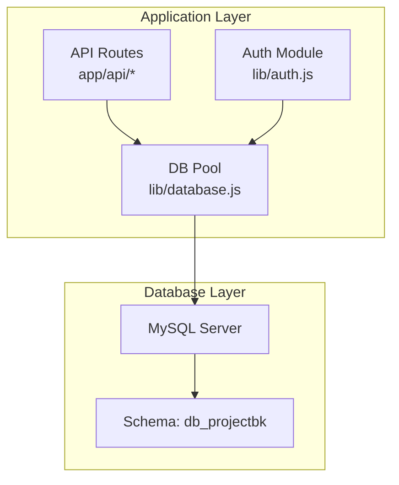
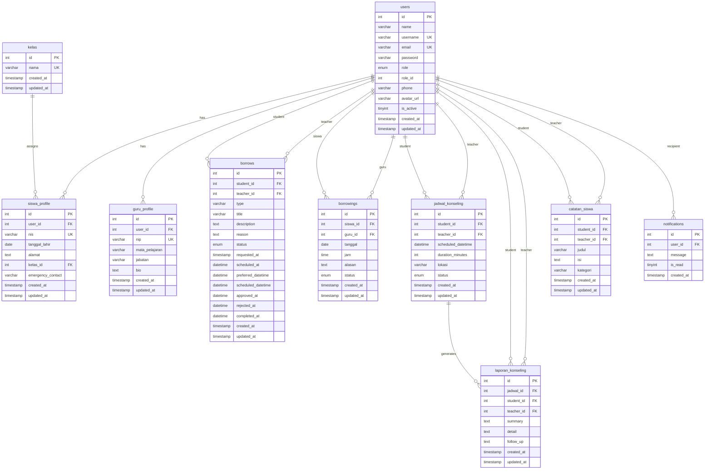
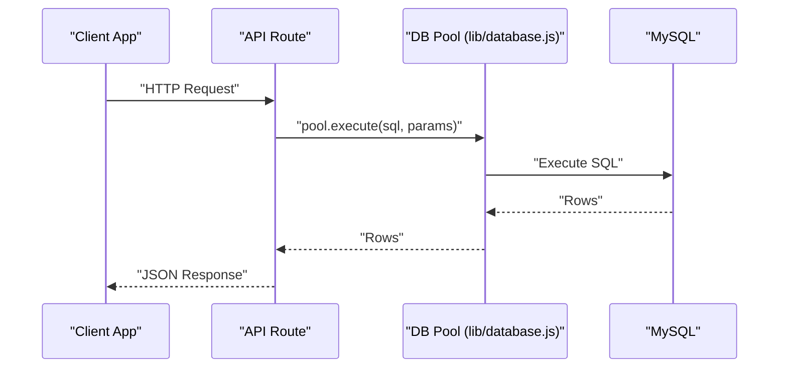
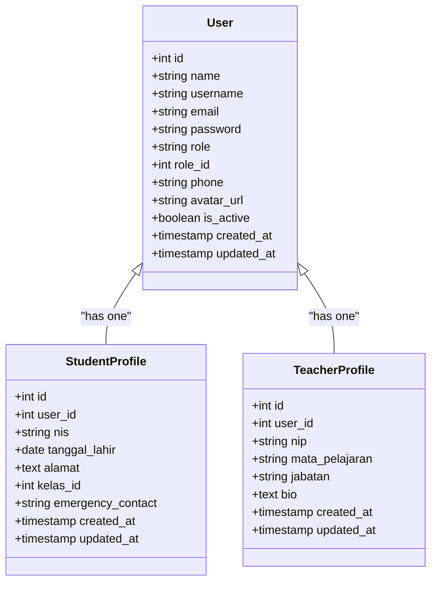
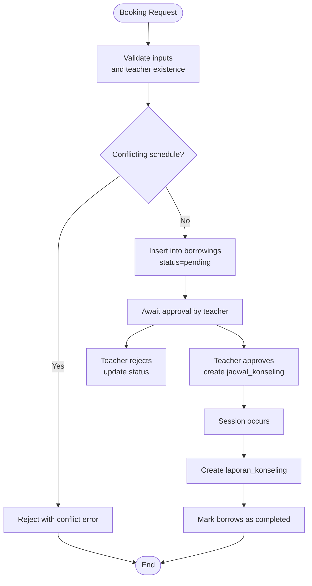
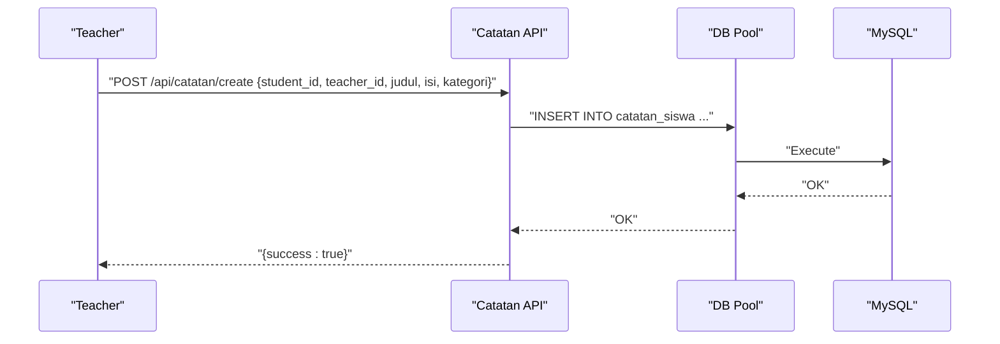
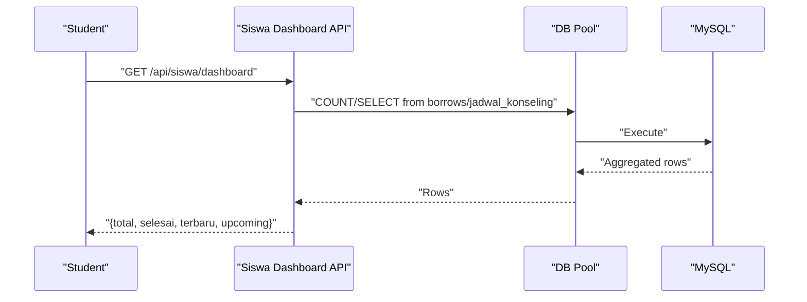
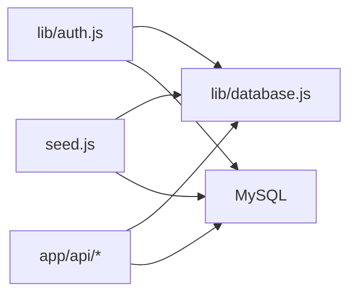

# Database Design

<cite>
**Referenced Files in This Document**
- [databasebk.sql](file://databasebk.sql)
- [lib/database.js](file://lib/database.js)
- [seed.js](file://seed.js)
- [lib/auth.js](file://lib/auth.js)
- [app/api/admin/create-student/route.js](file://app/api/admin/create-student/route.js)
- [app/api/borrowings/route.js](file://app/api/borrowings/route.js)
- [app/api/catatan/create/route.js](file://app/api/catatan/create/route.js)
- [app/api/guru/jadwal/route.js](file://app/api/guru/jadwal/route.js)
- [app/api/siswa/dashboard/route.js](file://app/api/siswa/dashboard/route.js)
- [app/api/guru/dashboard/route.js](file://app/api/guru/dashboard/route.js)
- [app/api/admin/list-students/route.js](file://app/api/admin/list-students/route.js)
- [package.json](file://package.json)
</cite>

## Table of Contents
1. [Introduction](#introduction)
2. [Project Structure](#project-structure)
3. [Core Components](#core-components)
4. [Architecture Overview](#architecture-overview)
5. [Detailed Component Analysis](#detailed-component-analysis)
6. [Dependency Analysis](#dependency-analysis)
7. [Performance Considerations](#performance-considerations)
8. [Troubleshooting Guide](#troubleshooting-guide)
9. [Conclusion](#conclusion)
10. [Appendices](#appendices)

## Introduction
This document describes the database design for the E-BK (School Counseling Management) application. It covers the complete schema, entity-relationship model, constraints, indexing, initialization and seeding, data access patterns, and operational guidelines derived from the repository’s SQL script and API routes. The schema supports user management, student and teacher profiles, appointment booking and scheduling, progress tracking via notes and reports, and notifications.

## Project Structure
The database schema is defined in a single SQL script and complemented by:
- A MySQL connection pool abstraction used by API routes
- A seed script that creates initial users and related profiles
- Authentication integration that queries the users table
- API routes that implement CRUD and reporting operations against the schema

**Diagram sources**
- [lib/database.js:1-23](file://lib/database.js#L1-L23)
- [lib/auth.js:1-77](file://lib/auth.js#L1-L77)

**Section sources**
- [databasebk.sql:1-407](file://databasebk.sql#L1-L407)
- [lib/database.js:1-23](file://lib/database.js#L1-L23)
- [seed.js:1-89](file://seed.js#L1-L89)
- [lib/auth.js:1-77](file://lib/auth.js#L1-L77)

## Core Components
This section documents each table, its fields, data types, constraints, and relationships.

- kelas
  - Purpose: Academic classes used by students.
  - Primary Key: id
  - Unique Constraints: nama
  - Timestamps: created_at, updated_at
  - Indexes: implicit primary key index

- users
  - Purpose: Central identity and authentication table.
  - Fields:
    - id (PK)
    - name (not null)
    - username (unique)
    - email (not null, unique)
    - password (not null)
    - role (enum: admin, guru, siswa)
    - role_id (int)
    - phone
    - avatar_url
    - is_active (tinyint)
    - created_at, updated_at
  - Indexes: role, email, username

- siswa_profile
  - Purpose: Student-specific attributes linked to users.
  - Fields:
    - id (PK)
    - user_id (FK to users.id, cascade delete)
    - nis (not null, unique)
    - tanggal_lahir
    - alamat
    - kelas_id (FK to kelas.id, set null on delete)
    - emergency_contact
    - created_at, updated_at
  - Indexes: implicit primary key index

- guru_profile
  - Purpose: Teacher-specific attributes linked to users.
  - Fields:
    - id (PK)
    - user_id (FK to users.id, cascade delete)
    - nip (not null, unique)
    - mata_pelajaran
    - jabatan
    - bio
    - created_at, updated_at
  - Indexes: implicit primary key index

- borrows (modern booking)
  - Purpose: Modern counseling booking requests and scheduling.
  - Fields:
    - id (PK)
    - student_id (FK to users.id, cascade delete)
    - teacher_id (FK to users.id, cascade delete)
    - type (default: konseling)
    - title
    - description
    - reason
    - status (enum: pending, approved, rejected, completed)
    - requested_at, scheduled_at, preferred_datetime, scheduled_datetime
    - approved_at, rejected_at, completed_at
    - created_at, updated_at
  - Indexes: student_id, teacher_id, status

- borrowings (legacy booking)
  - Purpose: Historical booking entries with date/time fields.
  - Fields:
    - id (PK)
    - siswa_id (FK to users.id, cascade delete)
    - guru_id (FK to users.id, cascade delete)
    - tanggal (not null)
    - jam (not null)
    - alasan (not null)
    - status (enum: pending, approved, rejected, completed)
    - created_at, updated_at
  - Indexes: siswa_id, guru_id

- jadwal_konseling (scheduling)
  - Purpose: Scheduled counseling sessions.
  - Fields:
    - id (PK)
    - student_id (FK to users.id, cascade delete)
    - teacher_id (FK to users.id, cascade delete)
    - scheduled_datetime (not null)
    - duration_minutes (default: 60)
    - lokasi
    - status (enum: scheduled, completed, cancelled)
    - created_at, updated_at
  - Indexes: student_id, teacher_id

- laporan_konseling (progress report)
  - Purpose: Post-session summaries and follow-ups.
  - Fields:
    - id (PK)
    - jadwal_id (FK to jadwal_konseling.id, set null on delete)
    - student_id (FK to users.id, cascade delete)
    - teacher_id (FK to users.id, cascade delete)
    - summary, detail, follow_up
    - created_at, updated_at
  - Indexes: implicit primary key index

- catatan_siswa (student notes)
  - Purpose: Notes created by teachers for students.
  - Fields:
    - id (PK)
    - student_id (FK to users.id, cascade delete)
    - teacher_id (FK to users.id, cascade delete)
    - judul (not null)
    - isi (not null)
    - kategori
    - created_at, updated_at
  - Indexes: student_id, teacher_id

- notifications
  - Purpose: User notifications.
  - Fields:
    - id (PK)
    - user_id (FK to users.id, cascade delete)
    - message (not null)
    - is_read (default: 0)
    - created_at
  - Indexes: implicit primary key index

Entity-Relationship Diagram (ERD)

**Diagram sources**
- [databasebk.sql:11-172](file://databasebk.sql#L11-L172)

**Section sources**
- [databasebk.sql:11-172](file://databasebk.sql#L11-L172)

## Architecture Overview
The application uses a relational MySQL schema accessed via a shared connection pool. Authentication resolves identities against the users table. API routes encapsulate CRUD and analytics operations, joining across multiple tables to serve UI dashboards and administrative views.

**Diagram sources**
- [lib/database.js:13-21](file://lib/database.js#L13-L21)
- [lib/auth.js:20-23](file://lib/auth.js#L20-L23)

**Section sources**
- [lib/database.js:1-23](file://lib/database.js#L1-L23)
- [lib/auth.js:1-77](file://lib/auth.js#L1-L77)

## Detailed Component Analysis

### Users and Profiles
- users table stores credentials and roles. Authentication compares bcrypt hashes against stored password.
- siswa_profile links a user to academic and personal details; deletion cascades to remove the profile.
- guru_profile captures teacher metadata; deletion cascades to remove the profile.

**Diagram sources**
- [databasebk.sql:22-67](file://databasebk.sql#L22-L67)

**Section sources**
- [databasebk.sql:22-67](file://databasebk.sql#L22-L67)
- [lib/auth.js:14-42](file://lib/auth.js#L14-L42)

### Booking and Scheduling
- borrows: modern booking with flexible scheduling fields and status transitions.
- borrowings: legacy booking with date/time fields.
- jadwal_konseling: confirmed sessions with status tracking.
- laporan_konseling: generated after sessions with summary and follow-up.

**Diagram sources**
- [app/api/borrowings/route.js:8-80](file://app/api/borrowings/route.js#L8-L80)
- [databasebk.sql:72-144](file://databasebk.sql#L72-L144)

**Section sources**
- [databasebk.sql:72-144](file://databasebk.sql#L72-L144)
- [app/api/borrowings/route.js:8-80](file://app/api/borrowings/route.js#L8-L80)

### Notes and Progress Tracking
- catatan_siswa: teacher-created notes per student with category support.
- laporan_konseling: structured post-session report linked to a schedule.

**Diagram sources**
- [app/api/catatan/create/route.js:1-24](file://app/api/catatan/create/route.js#L1-L24)
- [databasebk.sql:147-160](file://databasebk.sql#L147-L160)

**Section sources**
- [databasebk.sql:147-160](file://databasebk.sql#L147-L160)
- [app/api/catatan/create/route.js:1-24](file://app/api/catatan/create/route.js#L1-L24)

### Dashboards and Analytics
- Siswa dashboard aggregates counts and recent items from borrows and jadwal_konseling.
- Guru dashboard computes statistics, charts, and recent activity from borrows.

**Diagram sources**
- [app/api/siswa/dashboard/route.js:1-71](file://app/api/siswa/dashboard/route.js#L1-L71)
- [databasebk.sql:72-126](file://databasebk.sql#L72-L126)

**Section sources**
- [app/api/siswa/dashboard/route.js:1-71](file://app/api/siswa/dashboard/route.js#L1-L71)
- [app/api/guru/dashboard/route.js:1-139](file://app/api/guru/dashboard/route.js#L1-L139)

## Dependency Analysis
- API routes depend on lib/database.js for database operations.
- Authentication depends on lib/database.js to fetch user records.
- Seed script depends on mysql2 and bcryptjs to provision initial data.

**Diagram sources**
- [lib/database.js:1-23](file://lib/database.js#L1-L23)
- [lib/auth.js:1-77](file://lib/auth.js#L1-L77)
- [seed.js:1-89](file://seed.js#L1-L89)

**Section sources**
- [lib/database.js:1-23](file://lib/database.js#L1-L23)
- [lib/auth.js:1-77](file://lib/auth.js#L1-L77)
- [seed.js:1-89](file://seed.js#L1-L89)
- [package.json:11-33](file://package.json#L11-L33)

## Performance Considerations
- Indexes
  - Users: role, email, username
  - Student/Teacher bookings: student_id, teacher_id, status
  - Legacy bookings: siswa_id, guru_id
  - Scheduling: student_id, teacher_id
  - Notes: student_id, teacher_id
- Recommendations
  - Add composite indexes for frequent filters (e.g., (teacher_id, status), (student_id, status)).
  - Consider adding indexes on datetime fields used in range queries (e.g., scheduled_at, requested_at).
  - Normalize frequently joined columns if query volume increases.
  - Use pagination for dashboard lists (already applied in some routes).

**Section sources**
- [databasebk.sql:175-191](file://databasebk.sql#L175-L191)
- [app/api/guru/dashboard/route.js:74-85](file://app/api/guru/dashboard/route.js#L74-L85)

## Troubleshooting Guide
- Authentication failures
  - Ensure bcrypt-compare matches stored hash; verify email uniqueness and existence.
  - Check NEXTAUTH_SECRET configuration if JWT session issues occur.
- Booking conflicts
  - Conflicts arise when a teacher has an existing non-rejected booking at the same date/time.
  - Validate that only approved sessions create jadwal_konseling entries.
- Cascading deletes
  - Deleting a user removes related profiles and notes; ensure this is desired for your workflow.
- Seed errors
  - Passwords must be hashed before insertion; the seed script demonstrates hashing and inserts.

**Section sources**
- [lib/auth.js:14-42](file://lib/auth.js#L14-L42)
- [app/api/borrowings/route.js:44-59](file://app/api/borrowings/route.js#L44-L59)
- [seed.js:18-21](file://seed.js#L18-L21)

## Conclusion
The E-BK database schema provides a robust foundation for managing users, student/teacher profiles, booking and scheduling, notes, and reporting. The ERD and indexes reflect practical access patterns observed in the API routes. Initialization and seeding scripts streamline onboarding. Adhering to the outlined constraints and indexes ensures referential integrity and query performance.

## Appendices

### Database Initialization and Seed Data
- Initialization
  - Run the SQL script to create the database and tables.
  - Apply indexes for performance.
- Seed Data
  - The seed script creates:
    - Admin user
    - Teacher (guru) with profile
    - Two students with profiles
  - Passwords are hashed using bcrypt prior to insertion.

**Section sources**
- [databasebk.sql:6-407](file://databasebk.sql#L6-L407)
- [seed.js:15-89](file://seed.js#L15-L89)

### Sample Records and Credentials
- Admin: admin@school.com / admin123
- Guru: guru1@school.com / guru123
- Siswa: siswa1@student.com / siswa123
- Siswa: siswa2@student.com / siswa123

**Section sources**
- [databasebk.sql:393-407](file://databasebk.sql#L393-L407)
- [seed.js:75-79](file://seed.js#L75-L79)

### Data Access Patterns Observed in APIs
- Admin listing students joins siswa_profile, users, and kelas.
- Siswa dashboard aggregates counts and recent items from borrows and jadwal_konseling.
- Guru dashboard computes statistics and charts from borrows filtered by teacher.
- Booking endpoint validates teacher existence and checks for conflicting schedules.

**Section sources**
- [app/api/admin/list-students/route.js:4-28](file://app/api/admin/list-students/route.js#L4-L28)
- [app/api/siswa/dashboard/route.js:18-51](file://app/api/siswa/dashboard/route.js#L18-L51)
- [app/api/guru/dashboard/route.js:21-115](file://app/api/guru/dashboard/route.js#L21-L115)
- [app/api/borrowings/route.js:31-66](file://app/api/borrowings/route.js#L31-L66)

### SQL Examples for Common Operations
- Create a new student (admin endpoint)
  - Insert into users with role and hashed password; optionally insert into siswa_profile.
  - See: [app/api/admin/create-student/route.js:5-21](file://app/api/admin/create-student/route.js#L5-L21)
- Submit a booking (siswa)
  - Validate teacher exists; check for overlapping schedules; insert into borrowings with status pending.
  - See: [app/api/borrowings/route.js:8-80](file://app/api/borrowings/route.js#L8-L80)
- Retrieve guru’s schedule (approved and scheduled)
  - Join borrows with users; filter by teacher_id and status.
  - See: [app/api/guru/jadwal/route.js:17-37](file://app/api/guru/jadwal/route.js#L17-L37)
- Create a note for a student
  - Insert into catatan_siswa with student_id, teacher_id, title, content, and optional category.
  - See: [app/api/catatan/create/route.js:4-13](file://app/api/catatan/create/route.js#L4-L13)
- Admin list students with class info
  - Join siswa_profile with users and kelas; order by user id desc.
  - See: [app/api/admin/list-students/route.js:4-21](file://app/api/admin/list-students/route.js#L4-L21)