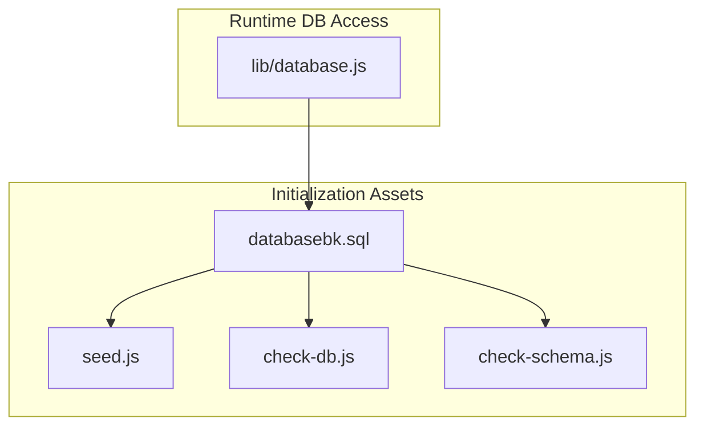
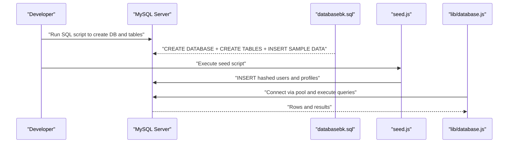
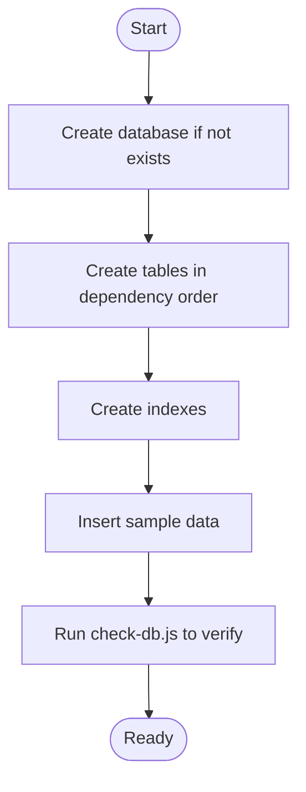
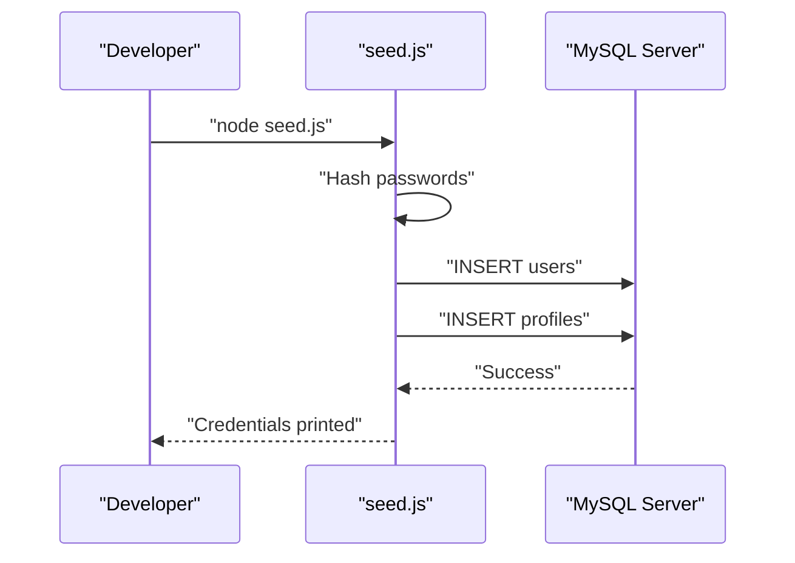
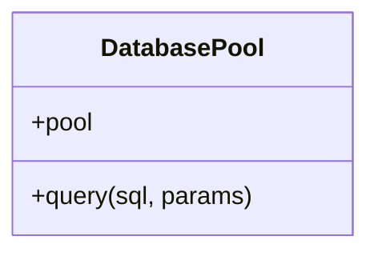
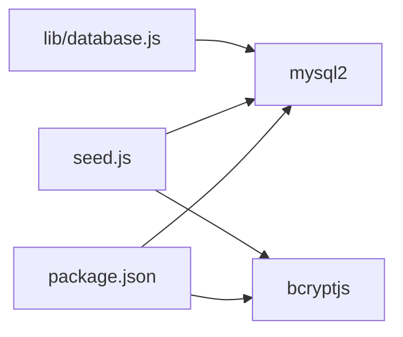

# Database Initialization

<cite>
**Referenced Files in This Document**
- [lib/database.js](file://lib/database.js)
- [databasebk.sql](file://databasebk.sql)
- [seed.js](file://seed.js)
- [check-db.js](file://check-db.js)
- [check-schema.js](file://check-schema.js)
- [package.json](file://package.json)
</cite>

## Table of Contents
1. [Introduction](#introduction)
2. [Project Structure](#project-structure)
3. [Core Components](#core-components)
4. [Architecture Overview](#architecture-overview)
5. [Detailed Component Analysis](#detailed-component-analysis)
6. [Dependency Analysis](#dependency-analysis)
7. [Performance Considerations](#performance-considerations)
8. [Troubleshooting Guide](#troubleshooting-guide)
9. [Conclusion](#conclusion)
10. [Appendices](#appendices)

## Introduction
This document provides end-to-end guidance for initializing the E-BK application database. It covers environment configuration, database creation, schema deployment, initial data seeding, verification steps, error handling, and operational procedures such as backup and restore. The repository includes a ready-to-run SQL script, a seed utility, and diagnostic helpers to streamline setup and maintenance.

## Project Structure
The database initialization assets are organized as follows:
- Schema and seed script: [databasebk.sql](file://databasebk.sql)
- Application database client: [lib/database.js](file://lib/database.js)
- Initial data seeding utility: [seed.js](file://seed.js)
- Diagnostic utilities:
  - [check-db.js](file://check-db.js): lists tables and users, validates connectivity
  - [check-schema.js](file://check-schema.js): describes table schemas and displays users
- Dependencies: [package.json](file://package.json)

**Diagram sources**
- [databasebk.sql](file://databasebk.sql)
- [seed.js](file://seed.js)
- [check-db.js](file://check-db.js)
- [check-schema.js](file://check-schema.js)
- [lib/database.js](file://lib/database.js)

**Section sources**
- [databasebk.sql](file://databasebk.sql)
- [lib/database.js](file://lib/database.js)
- [seed.js](file://seed.js)
- [check-db.js](file://check-db.js)
- [check-schema.js](file://check-schema.js)
- [package.json](file://package.json)

## Core Components
- Database connection pool and query wrapper:
  - Uses environment variables for credentials and target database.
  - Provides a shared pool and a convenience query function with error logging.
  - Reference: [lib/database.js](file://lib/database.js)
- Schema and sample data:
  - Single SQL script creates the database, tables, indexes, and inserts sample data.
  - Reference: [databasebk.sql](file://databasebk.sql)
- Seed utility:
  - Reads environment variables, hashes passwords, and inserts sample users and profiles.
  - Reference: [seed.js](file://seed.js)
- Diagnostics:
  - Validates connectivity and prints table counts and user listings.
  - Describes table schemas and lists users for inspection.
  - References: [check-db.js](file://check-db.js), [check-schema.js](file://check-schema.js)
- Dependencies:
  - Includes mysql2 and bcryptjs for database connectivity and password hashing.
  - Reference: [package.json](file://package.json)

**Section sources**
- [lib/database.js](file://lib/database.js)
- [databasebk.sql](file://databasebk.sql)
- [seed.js](file://seed.js)
- [check-db.js](file://check-db.js)
- [check-schema.js](file://check-schema.js)
- [package.json](file://package.json)

## Architecture Overview
The initialization pipeline integrates CLI-driven schema deployment, runtime database access, and optional diagnostics.

**Diagram sources**
- [databasebk.sql](file://databasebk.sql)
- [seed.js](file://seed.js)
- [lib/database.js](file://lib/database.js)

## Detailed Component Analysis

### Environment Configuration and Permissions
- Required environment variables (from runtime and CLI utilities):
  - DB_HOST: MySQL host address
  - DB_USER: MySQL user
  - DB_PASS: MySQL password
  - DB_NAME: Target database name
- Runtime usage:
  - The application reads these variables to configure the connection pool.
  - Reference: [lib/database.js](file://lib/database.js)
- CLI utilities also read the same variables from the project’s .env file:
  - References: [seed.js](file://seed.js), [check-db.js](file://check-db.js), [check-schema.js](file://check-schema.js)
- Permissions:
  - The database user must have privileges to:
    - Create databases and tables
    - Insert data
    - Describe tables and list tables
  - Ensure the user has sufficient privileges for schema changes and data manipulation.

**Section sources**
- [lib/database.js](file://lib/database.js)
- [seed.js](file://seed.js)
- [check-db.js](file://check-db.js)
- [check-schema.js](file://check-schema.js)

### Database Creation and Schema Deployment
- Execution method:
  - Use the provided SQL script to create the database and tables.
  - Reference: [databasebk.sql](file://databasebk.sql)
- Execution order and dependencies:
  - The script defines tables and foreign keys in a logical order.
  - Indexes are created after table definitions for performance.
  - Sample data insertion occurs after table creation.
- Verification:
  - Use the diagnostic script to list tables and confirm presence of users and classes.
  - Reference: [check-db.js](file://check-db.js)

**Diagram sources**
- [databasebk.sql](file://databasebk.sql)
- [check-db.js](file://check-db.js)

**Section sources**
- [databasebk.sql](file://databasebk.sql)
- [check-db.js](file://check-db.js)

### Initial Data Seeding
- Purpose:
  - Populate the database with sample users and profiles for testing.
- Process:
  - Hashes passwords using bcrypt before insertion.
  - Inserts admin, teacher, and student records along with associated profiles.
- Execution:
  - Run the seed script after schema deployment.
  - Reference: [seed.js](file://seed.js)
- Notes:
  - The script reads environment variables from .env.
  - It logs generated credentials for quick login.

**Diagram sources**
- [seed.js](file://seed.js)

**Section sources**
- [seed.js](file://seed.js)

### Runtime Database Access
- Connection pool:
  - Centralized pool configured with environment variables.
  - Provides a query helper with error logging.
- Usage:
  - Import the pool or query function in application code to execute SQL statements.
- Reference: [lib/database.js](file://lib/database.js)

**Diagram sources**
- [lib/database.js](file://lib/database.js)

**Section sources**
- [lib/database.js](file://lib/database.js)

### Diagnostic Utilities
- check-db.js:
  - Connects to the database and prints:
    - List of existing tables
    - Total number of users
    - Optional user listing if present
  - Useful for verifying successful initialization.
  - Reference: [check-db.js](file://check-db.js)
- check-schema.js:
  - Describes selected tables (users, profiles, classes, borrowing-related tables).
  - Lists all users with key attributes.
  - Reference: [check-schema.js](file://check-schema.js)

**Section sources**
- [check-db.js](file://check-db.js)
- [check-schema.js](file://check-schema.js)

## Dependency Analysis
- External dependencies:
  - mysql2: MySQL driver and promise-based client
  - bcryptjs: Password hashing for seeds
- Internal dependencies:
  - The seed utility depends on the SQL script for schema readiness.
  - The application runtime depends on lib/database.js for database access.

**Diagram sources**
- [package.json](file://package.json)
- [seed.js](file://seed.js)
- [lib/database.js](file://lib/database.js)

**Section sources**
- [package.json](file://package.json)
- [seed.js](file://seed.js)
- [lib/database.js](file://lib/database.js)

## Performance Considerations
- Connection pooling:
  - The pool is configured with reasonable limits and queue behavior.
  - Reference: [lib/database.js](file://lib/database.js)
- Indexes:
  - The SQL script creates indexes to improve query performance on frequently filtered columns.
  - Reference: [databasebk.sql](file://databasebk.sql)
- Recommendations:
  - Monitor pool usage under load.
  - Add indexes for additional query patterns as needed.

[No sources needed since this section provides general guidance]

## Troubleshooting Guide
Common initialization issues and resolutions:
- MySQL service not running:
  - Ensure the MySQL service is started (e.g., via Laragon).
- Database does not exist:
  - Run the SQL script to create the database and tables.
  - Reference: [databasebk.sql](file://databasebk.sql)
- Incorrect credentials:
  - Verify DB_HOST, DB_USER, DB_PASS, DB_NAME in .env and environment.
  - References: [seed.js](file://seed.js), [check-db.js](file://check-db.js), [check-schema.js](file://check-schema.js), [lib/database.js](file://lib/database.js)
- Missing tables or schema errors:
  - Re-run the SQL script to recreate schema.
  - Use the schema checker to inspect table definitions.
  - References: [databasebk.sql](file://databasebk.sql), [check-schema.js](file://check-schema.js)
- No users found after schema deployment:
  - Run the seed script to insert sample users.
  - Reference: [seed.js](file://seed.js)
- Runtime connection failures:
  - Confirm environment variables are loaded and accessible to the application.
  - Reference: [lib/database.js](file://lib/database.js)

**Section sources**
- [databasebk.sql](file://databasebk.sql)
- [seed.js](file://seed.js)
- [check-db.js](file://check-db.js)
- [check-schema.js](file://check-schema.js)
- [lib/database.js](file://lib/database.js)

## Conclusion
The E-BK application provides a streamlined database initialization workflow: deploy the schema via the SQL script, optionally seed sample data, and verify with diagnostic tools. Environment variables drive both CLI and runtime database access. The included utilities simplify setup, validation, and ongoing checks.

[No sources needed since this section summarizes without analyzing specific files]

## Appendices

### Step-by-Step Setup Instructions
1. Prepare environment:
   - Set DB_HOST, DB_USER, DB_PASS, DB_NAME in your environment or .env.
2. Create and deploy schema:
   - Execute the SQL script to create the database and tables.
   - Reference: [databasebk.sql](file://databasebk.sql)
3. Seed initial data:
   - Run the seed script to insert sample users and profiles.
   - Reference: [seed.js](file://seed.js)
4. Verify:
   - Run the diagnostics to confirm tables, users, and schema.
   - References: [check-db.js](file://check-db.js), [check-schema.js](file://check-schema.js)
5. Integrate with application:
   - Use the database pool/query helper for runtime operations.
   - Reference: [lib/database.js](file://lib/database.js)

**Section sources**
- [databasebk.sql](file://databasebk.sql)
- [seed.js](file://seed.js)
- [check-db.js](file://check-db.js)
- [check-schema.js](file://check-schema.js)
- [lib/database.js](file://lib/database.js)

### Backup and Restore Procedures
- Backup:
  - Use mysql dump to create a backup of the database.
  - Example command pattern: mysqldump -u [user] -p [database] > backup.sql
- Restore:
  - Drop or recreate the target database if needed.
  - Restore using the SQL script or imported dump.
  - References: [databasebk.sql](file://databasebk.sql)

[No sources needed since this section provides general guidance]

### Migration Strategies and Version Management
- Approach:
  - Track schema changes in incremental SQL scripts.
  - Apply migrations sequentially in production after backing up the database.
- Practical tips:
  - Keep a changelog of applied migrations.
  - Test migrations on staging before applying to production.
  - Use transactions for multi-step migrations when supported.

[No sources needed since this section provides general guidance]