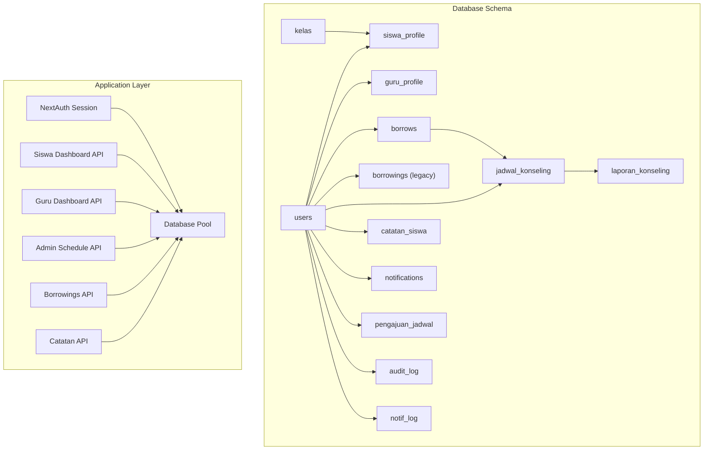
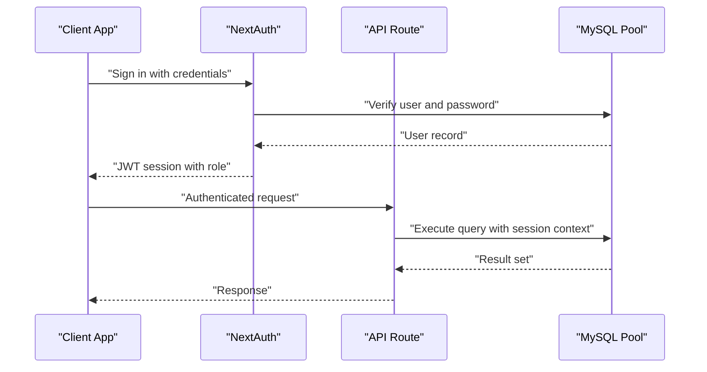
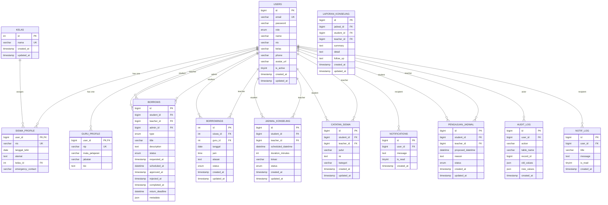
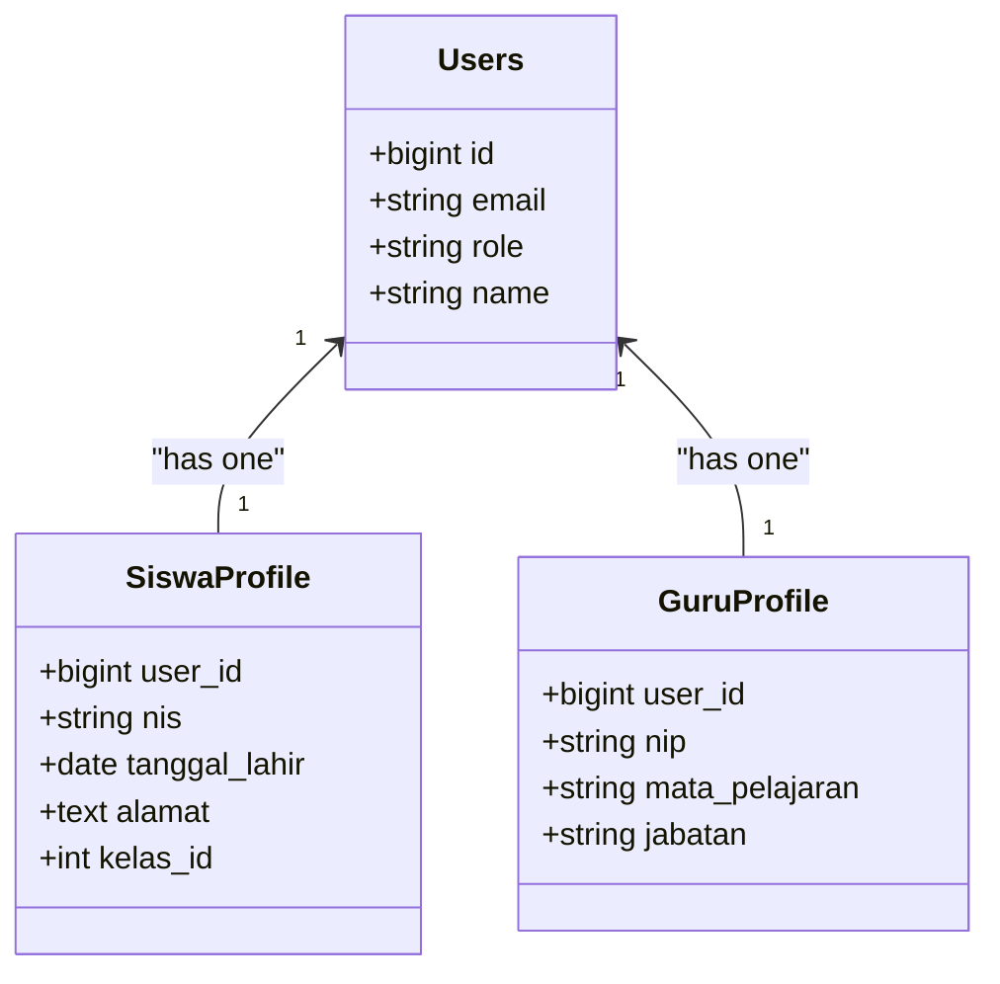
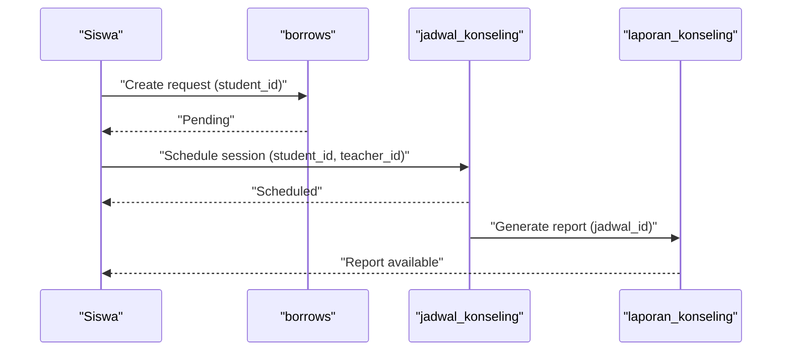
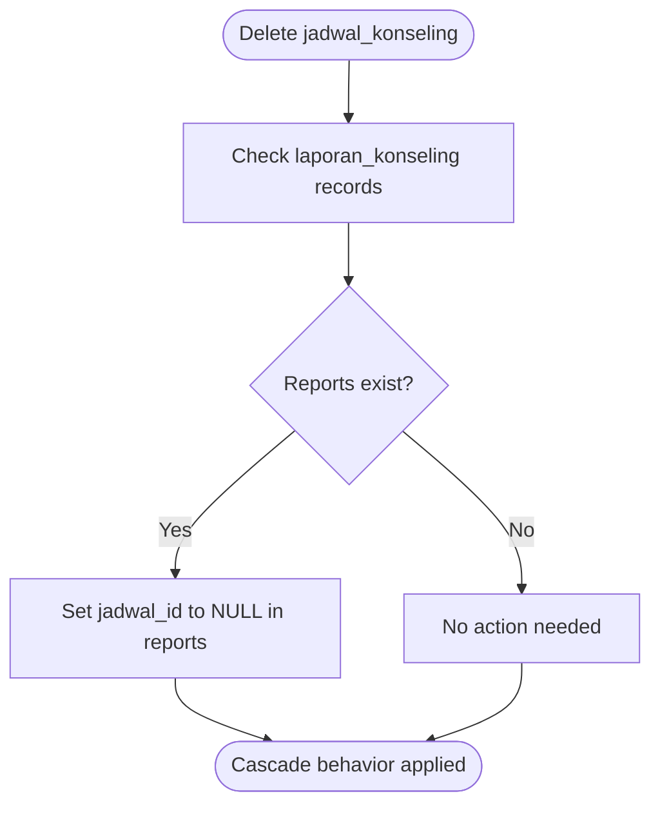
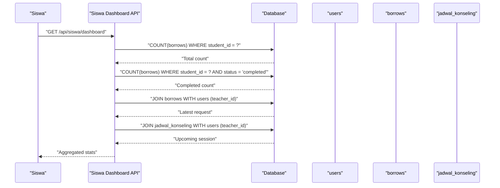
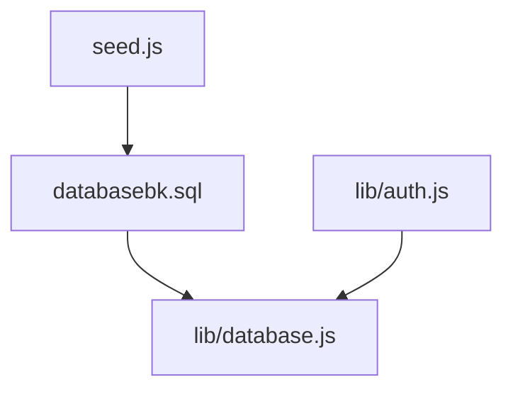

# Entity Relationships

<cite>
**Referenced Files in This Document**
- [databasebk.sql](file://databasebk.sql)
- [lib/database.js](file://lib/database.js)
- [lib/auth.js](file://lib/auth.js)
- [seed.js](file://seed.js)
- [app/api/siswa/dashboard/route.js](file://app/api/siswa/dashboard/route.js)
- [app/api/guru/dashboard/route.js](file://app/api/guru/dashboard/route.js)
- [app/api/admin/jadwal/route.js](file://app/api/admin/jadwal/route.js)
- [app/api/borrowings/route.js](file://app/api/borrowings/route.js)
- [app/api/catatan/create/route.js](file://app/api/catatan/create/route.js)
</cite>

## Table of Contents
1. [Introduction](#introduction)
2. [Project Structure](#project-structure)
3. [Core Components](#core-components)
4. [Architecture Overview](#architecture-overview)
5. [Detailed Component Analysis](#detailed-component-analysis)
6. [Dependency Analysis](#dependency-analysis)
7. [Performance Considerations](#performance-considerations)
8. [Troubleshooting Guide](#troubleshooting-guide)
9. [Conclusion](#conclusion)

## Introduction
This document provides comprehensive entity relationship documentation for the E-BK (School Counseling Management) database. It focuses on how tables interact and depend on each other, detailing foreign key relationships, referential integrity constraints, cascade behaviors, and the business logic that drives the application. The relationships covered include:
- User hierarchy: users → siswa_profile, users → guru_profile
- Appointment flow: users → borrows → jadwal_konseling
- Reporting relationships: jadwal_konseling → laporan_konseling
- Additional supporting relationships: users → notifications, users → catatan_siswa, users → pengajuan_jadwal, and class relationships via kelas

## Project Structure
The E-BK database is defined in a single SQL script that creates and seeds the schema. Application logic interacts with the database through a MySQL connection pool abstraction and NextAuth-based authentication.

**Diagram sources**
- [databasebk.sql:14-183](file://databasebk.sql#L14-L183)
- [lib/database.js:1-23](file://lib/database.js#L1-L23)
- [lib/auth.js:1-77](file://lib/auth.js#L1-L77)

**Section sources**
- [databasebk.sql:1-636](file://databasebk.sql#L1-L636)
- [lib/database.js:1-23](file://lib/database.js#L1-L23)
- [lib/auth.js:1-77](file://lib/auth.js#L1-L77)

## Core Components
This section outlines the primary entities and their roles in the E-BK system:
- users: Central identity and role holder for admin, guru, and siswa
- kelas: Academic class container for students
- siswa_profile: Student-specific profile linked to users
- guru_profile: Teacher-specific profile linked to users
- borrows: Modern counseling booking/appointment requests
- borrowings: Legacy scheduling table (deprecated in favor of borrows + jadwal_konseling)
- jadwal_konseling: Scheduled counseling sessions
- laporan_konseling: Post-session reports linked to jadwal_konseling
- catatan_siswa: Notes created by teachers for students
- notifications: Notification records for users
- pengajuan_jadwal: Student-teacher schedule proposals
- audit_log: Audit trail entries referencing users
- notif_log: Notification log entries for users

Key constraints and behaviors:
- Primary keys are auto-incremented integers or unsigned bigints depending on the schema variant
- Foreign keys enforce referential integrity with cascading and SET NULL behaviors as documented below
- Indexes are defined for performance on frequently queried columns

**Section sources**
- [databasebk.sql:14-183](file://databasebk.sql#L14-L183)

## Architecture Overview
The application architecture integrates NextAuth for session management and a MySQL connection pool for database operations. APIs leverage session data to enforce role-based access and perform CRUD operations against the schema-defined entities.

**Diagram sources**
- [lib/auth.js:14-42](file://lib/auth.js#L14-L42)
- [lib/database.js:13-21](file://lib/database.js#L13-L21)

## Detailed Component Analysis

### Entity Relationship Model
The following ER diagram captures the core relationships among entities, highlighting foreign keys, cascade behaviors, and cardinalities.

**Diagram sources**
- [databasebk.sql:14-183](file://databasebk.sql#L14-L183)

### Foreign Key Relationships and Cascade Behaviors
This section documents each foreign key relationship, its referenced table/column, and the cascade behavior enforced by the schema.

- users → siswa_profile (user_id → users.id): CASCADE DELETE
  - When a user is deleted, the associated student profile is automatically removed.
- users → guru_profile (user_id → users.id): CASCADE DELETE
  - When a user is deleted, the associated teacher profile is automatically removed.
- users → borrows (student_id → users.id): CASCADE DELETE
  - Deleting a user removes all borrowing requests where they were the student.
- users → borrows (teacher_id → users.id): SET NULL
  - If a teacher user is deleted, the teacher_id in existing borrowing requests becomes NULL.
- users → borrows (admin_id → users.id): SET NULL
  - If an admin user is deleted, the admin_id in borrowing requests becomes NULL.
- users → borrowings (siswa_id → users.id): CASCADE DELETE
  - Deleting a user removes legacy borrowing records where they were the student.
- users → borrowings (guru_id → users.id): CASCADE DELETE
  - Deleting a user removes legacy borrowing records where they were the teacher.
- users → jadwal_konseling (student_id → users.id): CASCADE DELETE
  - Deleting a user removes all scheduled sessions where they were the student.
- users → jadwal_konseling (teacher_id → users.id): CASCADE DELETE
  - Deleting a user removes all scheduled sessions where they were the teacher.
- jadwal_konseling → laporan_konseling (jadwal_id → jadwal_konseling.id): SET NULL
  - Deleting a schedule sets the report’s jadwal_id to NULL, preserving the report while breaking the link.
- users → laporan_konseling (student_id → users.id): CASCADE DELETE
  - Deleting a user removes reports where they were the student.
- users → laporan_konseling (teacher_id → users.id): CASCADE DELETE
  - Deleting a user removes reports where they were the teacher.
- users → catatan_siswa (student_id → users.id): CASCADE DELETE
  - Deleting a user removes notes where they were the student.
- users → catatan_siswa (teacher_id → users.id): CASCADE DELETE
  - Deleting a user removes notes where they were the teacher.
- users → notifications (user_id → users.id): CASCADE DELETE
  - Deleting a user removes their notification records.
- users → pengajuan_jadwal (student_id → users.id): CASCADE DELETE
  - Deleting a user removes their schedule proposals where they were the student.
- users → pengajuan_jadwal (teacher_id → users.id): CASCADE DELETE
  - Deleting a user removes their schedule proposals where they were the teacher.
- users → audit_log (user_id → users.id): SET NULL
  - Deleting a user sets audit_log.user_id to NULL, preserving audit history.
- users → notif_log (user_id → users.id): CASCADE DELETE
  - Deleting a user removes their notification logs.
- kelas → siswa_profile (kelas_id → kelas.id): SET NULL
  - Deleting a class sets student profiles’ class references to NULL, preserving profiles while removing class association.

Cardinalities:
- One-to-one: users ↔ siswa_profile, users ↔ guru_profile
- One-to-many: users → borrows (student), users → borrows (teacher), users → borrows (admin)
- Many-to-one: siswa_profile → users, guru_profile → users, borrows → users, jadwal_konseling → users, laporan_konseling → users, catatan_siswa → users, notifications → users, pengajuan_jadwal → users, audit_log → users, notif_log → users
- Many-to-one with SET NULL: jadwal_konseling → laporan_konseling (via jadwal_id)

**Section sources**
- [databasebk.sql:43-124](file://databasebk.sql#L43-L124)

### User Hierarchy: users → siswa_profile, users → guru_profile
- Purpose: Extend the base users table with role-specific attributes.
- Relationship: One-to-one via user_id primary key in both profiles.
- Cascade behavior: CASCADE DELETE ensures profile deletion when the user is removed.
- Business impact: Supports role-based UI and data access while maintaining referential integrity.

**Diagram sources**
- [databasebk.sql:43-65](file://databasebk.sql#L43-L65)

**Section sources**
- [databasebk.sql:43-65](file://databasebk.sql#L43-L65)

### Appointment Flow: users → borrows → jadwal_konseling
- Purpose: Manage counseling requests and schedules.
- Flow:
  - siswa initiates a request via borrows (student_id references users)
  - Admin/Guru approves and schedules via jadwal_konseling (student_id and teacher_id reference users)
  - Reports are generated post-session in laporan_konseling linked to jadwal_konseling
- Cascade behaviors:
  - borrows.student_id → users: CASCADE DELETE
  - borrows.teacher_id → users: SET NULL
  - borrows.admin_id → users: SET NULL
  - jadwal_konseling.student_id → users: CASCADE DELETE
  - jadwal_konseling.teacher_id → users: CASCADE DELETE
  - laporan_konseling.jadwal_id → jadwal_konseling: SET NULL

**Diagram sources**
- [databasebk.sql:68-124](file://databasebk.sql#L68-L124)

**Section sources**
- [databasebk.sql:68-124](file://databasebk.sql#L68-L124)

### Reporting Relationships: jadwal_konseling → laporan_konseling
- Purpose: Capture post-session summaries, details, and follow-up actions.
- Relationship: Many-to-one from laporan_konseling to jadwal_konseling via jadwal_id.
- Cascade behavior: SET NULL preserves reports when schedules are deleted, enabling historical reporting.

**Diagram sources**
- [databasebk.sql:110-124](file://databasebk.sql#L110-L124)

**Section sources**
- [databasebk.sql:110-124](file://databasebk.sql#L110-L124)

### Supporting Relationships
- users → notifications: One-to-many; CASCADE DELETE ensures cleanup upon user removal.
- users → catatan_siswa: One-to-many; CASCADE DELETE maintains data consistency.
- users → pengajuan_jadwal: One-to-many; CASCADE DELETE for both directions.
- users → audit_log: One-to-many; SET NULL preserves audit trail integrity.
- users → notif_log: One-to-many; CASCADE DELETE for user cleanup.
- kelas → siswa_profile: Many-to-one; SET NULL allows class removal without deleting profiles.

**Section sources**
- [databasebk.sql:143-183](file://databasebk.sql#L143-L183)

### API Integration and Business Logic
- Authentication and session management:
  - NextAuth validates credentials against users and attaches role to JWT/session.
  - Role checks gate access to specific dashboards and endpoints.
- Siswa dashboard:
  - Aggregates borrowing counts, latest request, and upcoming sessions using joins with users.
- Guru dashboard:
  - Computes statistics on pending/approved/completed requests, daily schedules, and monthly trends.
- Admin schedule management:
  - Lists all scheduled sessions and updates statuses.
- Borrowings API:
  - Validates student permissions, checks for conflicts, and inserts legacy borrowing records.
- Catatan API:
  - Creates student notes linking teacher and student via foreign keys.

**Diagram sources**
- [app/api/siswa/dashboard/route.js:18-51](file://app/api/siswa/dashboard/route.js#L18-L51)
- [lib/auth.js:14-42](file://lib/auth.js#L14-L42)

**Section sources**
- [app/api/siswa/dashboard/route.js:1-71](file://app/api/siswa/dashboard/route.js#L1-L71)
- [app/api/guru/dashboard/route.js:1-139](file://app/api/guru/dashboard/route.js#L1-L139)
- [app/api/admin/jadwal/route.js:1-38](file://app/api/admin/jadwal/route.js#L1-L38)
- [app/api/borrowings/route.js:1-81](file://app/api/borrowings/route.js#L1-L81)
- [app/api/catatan/create/route.js:1-24](file://app/api/catatan/create/route.js#L1-L24)
- [lib/auth.js:1-77](file://lib/auth.js#L1-L77)

## Dependency Analysis
The application depends on:
- Database schema defined in databasebk.sql
- MySQL connection pool abstraction in lib/database.js
- NextAuth for session and role management in lib/auth.js
- Seed script for initial data population in seed.js

**Diagram sources**
- [databasebk.sql:1-636](file://databasebk.sql#L1-L636)
- [lib/database.js:1-23](file://lib/database.js#L1-L23)
- [lib/auth.js:1-77](file://lib/auth.js#L1-L77)
- [seed.js:1-97](file://seed.js#L1-L97)

**Section sources**
- [databasebk.sql:1-636](file://databasebk.sql#L1-L636)
- [lib/database.js:1-23](file://lib/database.js#L1-L23)
- [lib/auth.js:1-77](file://lib/auth.js#L1-L77)
- [seed.js:1-97](file://seed.js#L1-L97)

## Performance Considerations
- Indexes are defined on frequently filtered columns:
  - users(role), users(email), users(nis)
  - borrows(student_id), borrows(teacher_id), borrows(status)
  - jadwal_konseling(student_id), jadwal_konseling(teacher_id)
  - catatan_siswa(student_id), catatan_siswa(teacher_id)
- Consider adding composite indexes for common join/filter patterns (e.g., borrows(student_id, status), jadwal_konseling(scheduled_datetime)).
- Monitor cascade delete operations for large datasets to prevent long-running transactions.

[No sources needed since this section provides general guidance]

## Troubleshooting Guide
Common issues and resolutions:
- Unauthorized access errors:
  - Verify session role and ensure NextAuth credentials match users records.
- Foreign key constraint violations:
  - Confirm referenced user IDs exist before insert/update operations.
- Cascade behavior expectations:
  - Understand that deleting a user removes related records in CASCADE scenarios; use SET NULL for optional relationships.
- Legacy table deprecation:
  - Prefer borrows + jadwal_konseling over borrowings for new workflows.

**Section sources**
- [lib/auth.js:14-42](file://lib/auth.js#L14-L42)
- [databasebk.sql:68-124](file://databasebk.sql#L68-L124)

## Conclusion
The E-BK database establishes a clear, normalized schema with well-defined foreign keys and cascade behaviors that support the school counseling workflow. The relationships enable:
- Role-based user hierarchy with specialized profiles
- Structured appointment requests and scheduling
- Comprehensive reporting tied to sessions
- Clean data lifecycle management through cascades and SET NULL policies

These designs ensure data consistency, maintainable business logic, and scalable performance through strategic indexing.