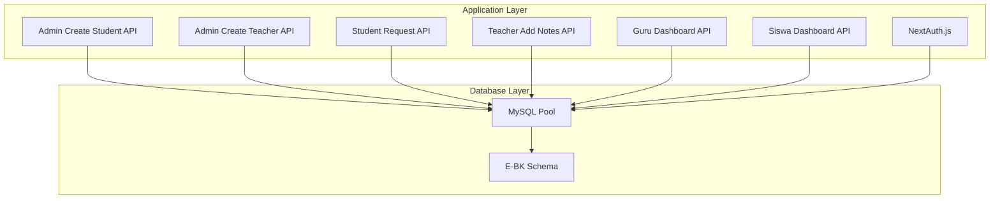
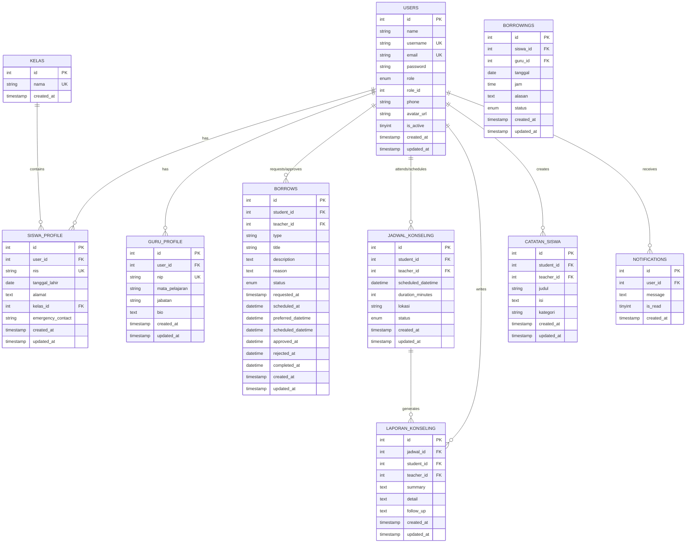
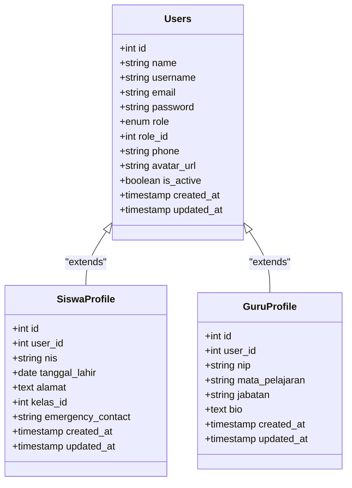
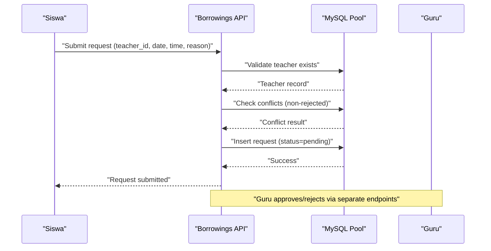
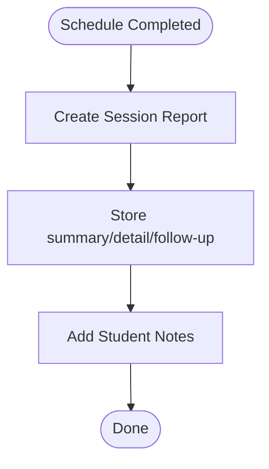
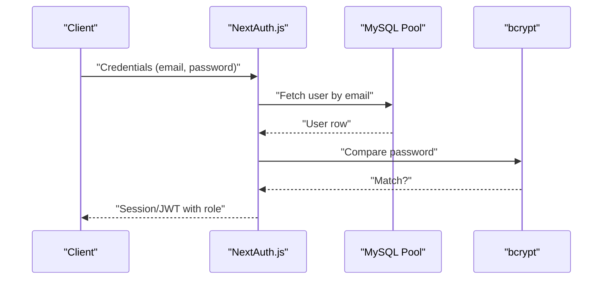
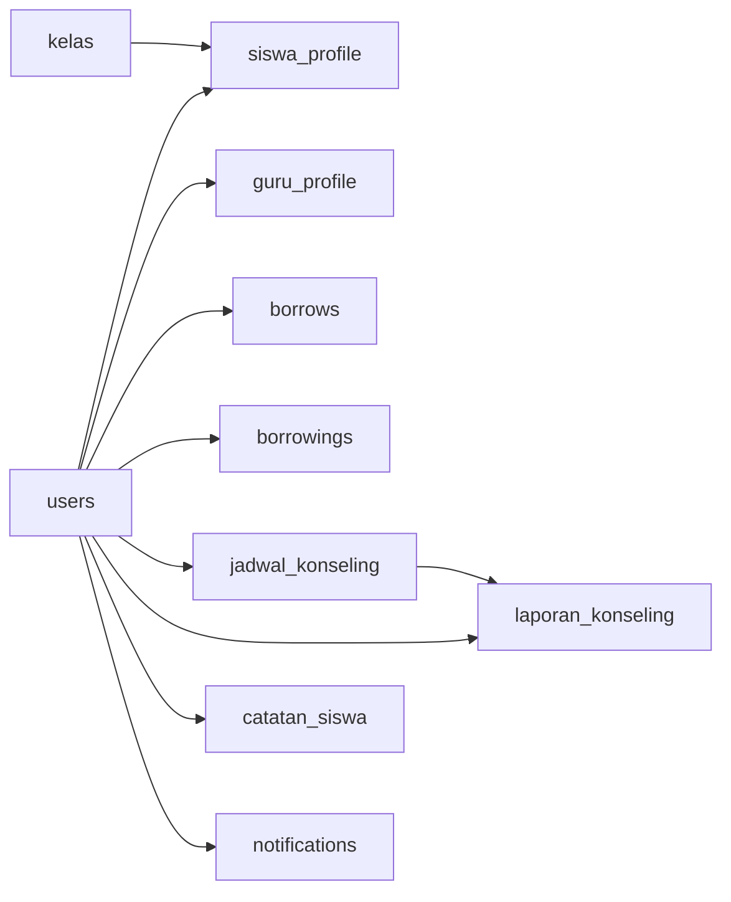

# Schema Overview

<cite>
**Referenced Files in This Document**
- [databasebk.sql](file://databasebk.sql)
- [database.js](file://lib/database.js)
- [seed.js](file://seed.js)
- [auth.js](file://lib/auth.js)
- [route.js](file://app/api/admin/create-student/route.js)
- [route.js](file://app/api/admin/create-teacher/route.js)
- [route.js](file://app/api/borrowings/route.js)
- [route.js](file://app/api/catatan/create/route.js)
- [route.js](file://app/api/guru/dashboard/route.js)
- [route.js](file://app/api/siswa/dashboard/route.js)
</cite>

## Table of Contents
1. [Introduction](#introduction)
2. [Project Structure](#project-structure)
3. [Core Components](#core-components)
4. [Architecture Overview](#architecture-overview)
5. [Detailed Component Analysis](#detailed-component-analysis)
6. [Dependency Analysis](#dependency-analysis)
7. [Performance Considerations](#performance-considerations)
8. [Troubleshooting Guide](#troubleshooting-guide)
9. [Conclusion](#conclusion)
10. [Appendices](#appendices)

## Introduction
This document presents a comprehensive schema overview of the E-BK (School Counseling Management) database. It explains the complete database structure across ten tables, their relationships, naming conventions, and organizational principles. It also covers initialization sequences, table creation order dependencies, schema evolution considerations, and visual diagrams of table relationships and data flow patterns.

## Project Structure
The E-BK system organizes its database schema in a single SQL script and integrates with a Next.js application via a MySQL connection pool abstraction. Authentication and authorization leverage NextAuth.js with JWT tokens stored in the users table. Sample data seeding is handled by a dedicated script that hashes passwords before insertion.

**Diagram sources**
- [database.js:1-23](file://lib/database.js#L1-L23)
- [auth.js:1-77](file://lib/auth.js#L1-L77)
- [route.js:1-22](file://app/api/admin/create-student/route.js#L1-L22)
- [route.js:1-22](file://app/api/admin/create-teacher/route.js#L1-L22)
- [route.js:1-81](file://app/api/borrowings/route.js#L1-L81)
- [route.js:1-24](file://app/api/catatan/create/route.js#L1-L24)
- [route.js:1-139](file://app/api/guru/dashboard/route.js#L1-L139)
- [route.js:1-71](file://app/api/siswa/dashboard/route.js#L1-L71)

**Section sources**
- [database.js:1-23](file://lib/database.js#L1-L23)
- [auth.js:1-77](file://lib/auth.js#L1-L77)

## Core Components
This section documents each of the ten tables, their purpose, scope, and primary keys/foreign keys. It also highlights naming conventions and constraints.

- kelas
  - Purpose: Stores class names for student enrollment and grouping.
  - Key attributes: id (PK), nama (unique), timestamps.
  - Scope: Reference table for siswa_profile.
  - Constraints: Unique class name; cascading deletes for dependent records.

- users
  - Purpose: Central identity and authentication table.
  - Key attributes: id (PK), name, username (unique), email (unique), password, role, role_id, contact info, avatar, activity flag, timestamps.
  - Scope: Base for all roles; foreign keys in profiles and transactional tables.
  - Constraints: Role enum with defaults; unique usernames and emails; active flag.

- siswa_profile
  - Purpose: Extends users with student-specific details.
  - Key attributes: id (PK), user_id (FK to users), nis (unique), date of birth, address, kelas_id (FK to kelas), emergency contact, timestamps.
  - Scope: Links students to classes and personal info.
  - Constraints: Cascades on user deletion; sets class to null on class deletion.

- guru_profile
  - Purpose: Extends users with counselor/teacher-specific details.
  - Key attributes: id (PK), user_id (FK to users), nip (unique), subject, position, bio, timestamps.
  - Scope: Identifies counselors and their professional details.
  - Constraints: Cascades on user deletion.

- borrows (Counseling Requests)
  - Purpose: Manages student requests and scheduling decisions.
  - Key attributes: id (PK), student_id (FK to users), teacher_id (FK to users), type, title, description, reason, status enum, timestamps, scheduling fields.
  - Scope: Core workflow for counseling requests and approvals.
  - Constraints: Cascades on user deletion; status enum supports lifecycle tracking.

- borrowings (Legacy Counseling Requests)
  - Purpose: Historical record of previous request format (date/time slots).
  - Key attributes: id (PK), siswa_id (FK to users), guru_id (FK to users), tanggal, jam, reason, status enum, timestamps.
  - Scope: Backward compatibility; superseded by borrows.
  - Constraints: Cascades on user deletion.

- jadwal_konseling (Scheduling)
  - Purpose: Tracks confirmed counseling sessions.
  - Key attributes: id (PK), student_id (FK to users), teacher_id (FK to users), scheduled_datetime, duration, location, status enum, timestamps.
  - Scope: Finalized schedules with completion tracking.
  - Constraints: Cascades on user deletion; status enum for lifecycle.

- laporan_konseling (Session Reports)
  - Purpose: Captures post-session summaries and follow-ups.
  - Key attributes: id (PK), jadwal_id (FK to jadwal_konseling), student_id (FK to users), teacher_id (FK to users), summary, detail, follow_up, timestamps.
  - Scope: Documentation of outcomes and action items.
  - Constraints: Sets jadwal_id to null on schedule deletion; cascades on user deletion.

- catatan_siswa (Student Notes)
  - Purpose: Stores teacher-created notes per student.
  - Key attributes: id (PK), student_id (FK to users), teacher_id (FK to users), title, content, category, timestamps.
  - Scope: General note-taking for student progress and observations.
  - Constraints: Cascades on user deletion.

- notifications
  - Purpose: Notification delivery per user.
  - Key attributes: id (PK), user_id (FK to users), message, read flag, timestamps.
  - Scope: User alerts and reminders.
  - Constraints: Cascades on user deletion.

**Section sources**
- [databasebk.sql:10-172](file://databasebk.sql#L10-L172)

## Architecture Overview
The E-BK schema follows a normalized relational model with explicit foreign key relationships. Users are the central entity, extended by role-specific profiles. Counseling workflows traverse from request (borrows/borrowings) to scheduling (jadwal_konseling) and reporting (laporan_konseling). Notes (catatan_siswa) complement ongoing support. Notifications provide user-centric communication.

**Diagram sources**
- [databasebk.sql:10-172](file://databasebk.sql#L10-L172)

## Detailed Component Analysis

### Users and Profiles
Users define identities and roles. Profiles extend users with role-specific attributes. This separation ensures clean normalization and avoids redundant columns.

**Diagram sources**
- [databasebk.sql:20-67](file://databasebk.sql#L20-L67)

**Section sources**
- [databasebk.sql:20-67](file://databasebk.sql#L20-L67)

### Counseling Request and Scheduling Workflow
The workflow spans request submission, approval, scheduling, and reporting. Two request formats coexist: a modern structured format (borrows) and a legacy date/time slot format (borrowings).

**Diagram sources**
- [route.js:1-81](file://app/api/borrowings/route.js#L1-L81)
- [databasebk.sql:70-109](file://databasebk.sql#L70-L109)

**Section sources**
- [route.js:1-81](file://app/api/borrowings/route.js#L1-L81)
- [databasebk.sql:70-109](file://databasebk.sql#L70-L109)

### Reporting and Notes
Post-session reports capture outcomes and follow-ups, while notes provide ongoing observations.

**Diagram sources**
- [databasebk.sql:128-160](file://databasebk.sql#L128-L160)

**Section sources**
- [databasebk.sql:128-160](file://databasebk.sql#L128-L160)

### Authentication and Authorization
Authentication relies on NextAuth.js with credentials provider, validating against the users table and hashing with bcrypt.

**Diagram sources**
- [auth.js:1-77](file://lib/auth.js#L1-L77)
- [databasebk.sql:20-35](file://databasebk.sql#L20-L35)

**Section sources**
- [auth.js:1-77](file://lib/auth.js#L1-L77)
- [databasebk.sql:20-35](file://databasebk.sql#L20-L35)

## Dependency Analysis
The schema exhibits clear dependency chains:
- Users are foundational; all role-specific tables depend on users.
- siswa_profile depends on kelas for class membership.
- borrows and borrowings both reference users for student/teacher roles.
- jadwal_konseling anchors session scheduling and links to laporan_konseling.
- catatan_siswa and notifications depend on users for authorship and delivery respectively.

**Diagram sources**
- [databasebk.sql:10-172](file://databasebk.sql#L10-L172)

**Section sources**
- [databasebk.sql:10-172](file://databasebk.sql#L10-L172)

## Performance Considerations
- Indexes are strategically placed on frequently filtered columns:
  - users(role), users(email), users(username)
  - siswa_profile(nis)
  - guru_profile(nip)
  - borrows(student_id, teacher_id, status)
  - borrowings(siswa_id, guru_id)
  - jadwal_konseling(student_id, teacher_id)
  - catatan_siswa(student_id, teacher_id)
- Timestamps enable efficient chronological queries for dashboards and histories.
- Consider partitioning or materialized views for high-volume reporting (e.g., guru dashboard analytics).

**Section sources**
- [databasebk.sql:175-191](file://databasebk.sql#L175-L191)

## Troubleshooting Guide
- Authentication failures:
  - Verify bcrypt-compatibile password storage and correct credential provider configuration.
  - Confirm users table contains the email and that the password hash matches.
- Request conflicts:
  - Ensure non-rejected overlapping schedules are prevented before insertion.
- Cascade behavior:
  - When deleting a user, confirm cascading deletes propagate to dependent tables.
  - When deleting a class, confirm kelas_id in siswa_profile becomes null.
- Seed script:
  - Use the provided seed script to insert hashed passwords and initial data safely.

**Section sources**
- [auth.js:1-77](file://lib/auth.js#L1-L77)
- [route.js:1-81](file://app/api/borrowings/route.js#L1-L81)
- [seed.js:1-89](file://seed.js#L1-L89)

## Conclusion
The E-BK schema provides a robust, normalized foundation for school counseling management. It cleanly separates identity and profiles, supports flexible request and scheduling workflows, and enables reporting and note-taking. Proper indexing, cascade policies, and secure authentication ensure scalability and maintainability.

## Appendices

### Database Initialization Sequence
- Create database and select it.
- Create tables in dependency order:
  1) kelas
  2) users
  3) siswa_profile (depends on users and kelas)
  4) guru_profile (depends on users)
  5) borrows (depends on users)
  6) borrowings (depends on users)
  7) jadwal_konseling (depends on users)
  8) laporan_konseling (depends on jadwal_konseling and users)
  9) catatan_siswa (depends on users)
  10) notifications (depends on users)
- Apply indexes.
- Seed initial data using the seed script.

**Section sources**
- [databasebk.sql:6-172](file://databasebk.sql#L6-L172)
- [seed.js:1-89](file://seed.js#L1-L89)

### Schema Evolution Considerations
- Introduce new enums or statuses carefully; ensure application logic handles unknown values gracefully.
- Add audit columns (created_by, updated_by) if needed for compliance.
- Monitor index usage and adjust composite indexes for evolving queries.
- Consider deprecating legacy tables (e.g., borrowings) after full adoption of borrows.

**Section sources**
- [databasebk.sql:70-109](file://databasebk.sql#L70-L109)
- [databasebk.sql:276-315](file://databasebk.sql#L276-L315)