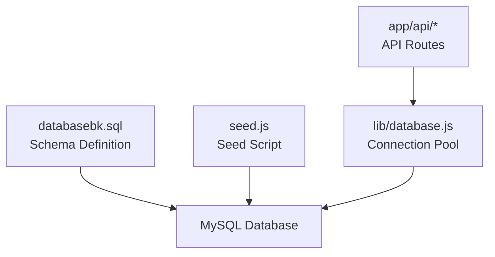
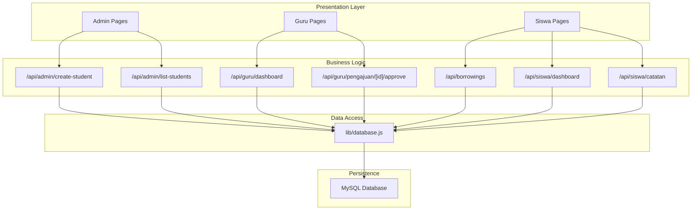
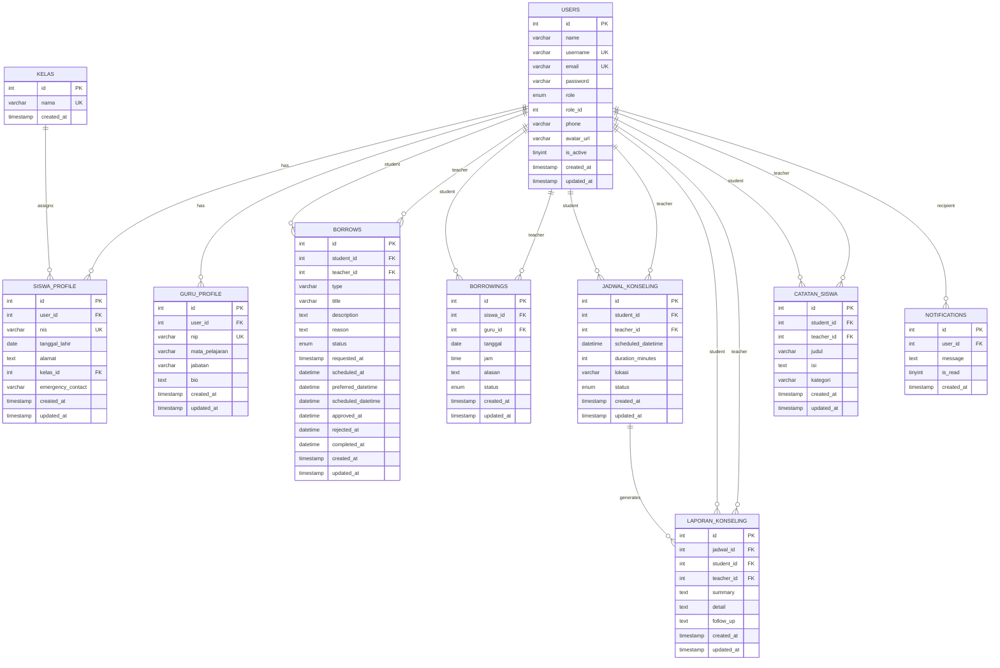

# Table Schemas

<cite>
**Referenced Files in This Document**
- [databasebk.sql](file://databasebk.sql)
- [seed.js](file://seed.js)
- [lib/database.js](file://lib/database.js)
- [app/api/admin/create-student/route.js](file://app/api/admin/create-student/route.js)
- [app/api/admin/list-students/route.js](file://app/api/admin/list-students/route.js)
- [app/api/borrowings/route.js](file://app/api/borrowings/route.js)
- [app/api/guru/dashboard/route.js](file://app/api/guru/dashboard/route.js)
- [app/api/guru/pengajuan/[id]/approve/route.js](file://app/api/guru/pengajuan/[id]/approve/route.js)
- [app/api/siswa/dashboard/route.js](file://app/api/siswa/dashboard/route.js)
- [app/api/siswa/catatan/route.js](file://app/api/siswa/catatan/route.js)
</cite>

## Table of Contents
1. [Introduction](#introduction)
2. [Project Structure](#project-structure)
3. [Core Components](#core-components)
4. [Architecture Overview](#architecture-overview)
5. [Detailed Component Analysis](#detailed-component-analysis)
6. [Dependency Analysis](#dependency-analysis)
7. [Performance Considerations](#performance-considerations)
8. [Troubleshooting Guide](#troubleshooting-guide)
9. [Conclusion](#conclusion)

## Introduction
This document provides comprehensive table schema documentation for the E-BK (School Counseling Management) system. It covers all 10 database tables, detailing field definitions, data types, constraints, defaults, primary keys, unique constraints, foreign key relationships, timestamps, auto-increment mechanisms, and audit trail capabilities. It also explains field-level validation rules, length restrictions, format requirements, and the rationale behind each field choice, along with typical values and edge cases.

## Project Structure
The database schema is defined in a SQL script and seeded via a Node.js script. Application APIs interact with the database through a MySQL connection pool abstraction.

**Diagram sources**
- [databasebk.sql:1-407](file://databasebk.sql#L1-L407)
- [seed.js:1-97](file://seed.js#L1-L97)
- [lib/database.js:1-23](file://lib/database.js#L1-L23)

**Section sources**
- [databasebk.sql:1-407](file://databasebk.sql#L1-L407)
- [seed.js:1-97](file://seed.js#L1-L97)
- [lib/database.js:1-23](file://lib/database.js#L1-L23)

## Core Components
- Database schema definition and indexes
- Sample data seeding with hashed passwords
- Database connection pool abstraction
- API routes that query and modify data

Key observations:
- Timestamps are managed via MySQL defaults and triggers.
- Auto-increment is used for primary keys across all tables.
- Foreign keys enforce referential integrity with cascading deletes where appropriate.
- Indexes are defined for performance on frequently queried columns.

**Section sources**
- [databasebk.sql:175-191](file://databasebk.sql#L175-L191)
- [seed.js:15-97](file://seed.js#L15-L97)
- [lib/database.js:1-23](file://lib/database.js#L1-L23)

## Architecture Overview
The system follows a layered architecture:
- Presentation layer: Next.js app pages and API routes
- Business logic: API route handlers
- Data access: MySQL connection pool abstraction
- Persistence: Relational schema with foreign keys and indexes

**Diagram sources**
- [lib/database.js:1-23](file://lib/database.js#L1-L23)
- [databasebk.sql:1-407](file://databasebk.sql#L1-L407)
- [app/api/admin/create-student/route.js:1-22](file://app/api/admin/create-student/route.js#L1-L22)
- [app/api/admin/list-students/route.js:1-29](file://app/api/admin/list-students/route.js#L1-L29)
- [app/api/borrowings/route.js:1-81](file://app/api/borrowings/route.js#L1-L81)
- [app/api/guru/dashboard/route.js:1-139](file://app/api/guru/dashboard/route.js#L1-L139)
- [app/api/guru/pengajuan/[id]/approve/route.js:1-73](file://app/api/guru/pengajuan/[id]/approve/route.js#L1-L73)
- [app/api/siswa/dashboard/route.js:1-71](file://app/api/siswa/dashboard/route.js#L1-L71)
- [app/api/siswa/catatan/route.js:1-38](file://app/api/siswa/catatan/route.js#L1-L38)

## Detailed Component Analysis

### Table: kelas
- Purpose: Stores class names for students.
- Primary Key: id (auto-increment)
- Unique Constraints: nama
- Timestamps: created_at (default CURRENT_TIMESTAMP)
- Audit Trail: No explicit updated_at column; relies on created_at.

Field Definitions
- id: INT, PK, AUTO_INCREMENT
- nama: VARCHAR(50), NOT NULL, UNIQUE
- created_at: TIMESTAMP, DEFAULT CURRENT_TIMESTAMP

Constraints and Defaults
- PRIMARY KEY (id)
- UNIQUE (nama)
- DEFAULT CURRENT_TIMESTAMP for created_at

Validation and Length
- nama: Max 50 characters

Typical Values
- "X RPL 1", "X RPL 2", "XI RPL 1", "XI RPL 2", "XII RPL 1", "XII RPL 2"

Edge Cases
- Duplicate nama values are prevented by unique constraint.
- created_at is automatically set on insert.

Rationale
- Supports grouping students by class and linking profiles to classes.

**Section sources**
- [databasebk.sql:12-17](file://databasebk.sql#L12-L17)
- [databasebk.sql:219-223](file://databasebk.sql#L219-L223)

### Table: users
- Purpose: Central user account table with roles (admin, guru, siswa).
- Primary Key: id (auto-increment)
- Unique Constraints: username, email
- Timestamps: created_at, updated_at (default CURRENT_TIMESTAMP with ON UPDATE CURRENT_TIMESTAMP)

Field Definitions
- id: INT, PK, AUTO_INCREMENT
- name: VARCHAR(100), NOT NULL
- username: VARCHAR(50), UNIQUE
- email: VARCHAR(100), NOT NULL, UNIQUE
- password: VARCHAR(255), NOT NULL
- role: ENUM('admin','guru','siswa'), DEFAULT 'siswa'
- role_id: INT, DEFAULT 3
- phone: VARCHAR(20)
- avatar_url: VARCHAR(255)
- is_active: TINYINT(1), DEFAULT 1
- created_at: TIMESTAMP, DEFAULT CURRENT_TIMESTAMP
- updated_at: TIMESTAMP, DEFAULT CURRENT_TIMESTAMP ON UPDATE CURRENT_TIMESTAMP

Constraints and Defaults
- PRIMARY KEY (id)
- UNIQUE (username)
- UNIQUE (email)
- DEFAULT 'siswa' for role
- DEFAULT 3 for role_id
- DEFAULT 1 for is_active
- DEFAULT CURRENT_TIMESTAMP for created_at
- DEFAULT CURRENT_TIMESTAMP ON UPDATE CURRENT_TIMESTAMP for updated_at

Validation and Length
- name: Max 100 characters
- username: Max 50 characters
- email: Max 100 characters
- password: Up to 255 characters (bcrypt hash)
- phone: Max 20 characters
- avatar_url: Max 255 characters

Typical Values
- name: "Administrator", "Guru BK 1", "Siswa 1"
- username: "admin", "guru1", "siswa1"
- email: "admin@school.com", "guru1@school.com", "siswa1@student.com"
- role: "admin", "guru", "siswa"
- role_id: 1, 2, 3
- is_active: 1

Edge Cases
- Duplicate usernames or emails are prevented by unique constraints.
- role_id aligns with role enumeration.
- Updated timestamp auto-refreshes on updates.

Rationale
- Provides unified identity and authentication for all users.
- Supports role-based access control and profile linkage.

**Section sources**
- [databasebk.sql:22-35](file://databasebk.sql#L22-L35)
- [databasebk.sql:228-241](file://databasebk.sql#L228-L241)
- [seed.js:32-52](file://seed.js#L32-L52)

### Table: siswa_profile
- Purpose: Student-specific profile linked to users.
- Primary Key: id (auto-increment)
- Unique Constraints: nis
- Foreign Keys: user_id -> users(id) CASCADE, kelas_id -> kelas(id) SET NULL
- Timestamps: created_at, updated_at

Field Definitions
- id: INT, PK, AUTO_INCREMENT
- user_id: INT, NOT NULL
- nis: VARCHAR(20), NOT NULL, UNIQUE
- tanggal_lahir: DATE
- alamat: TEXT
- kelas_id: INT
- emergency_contact: VARCHAR(20)
- created_at: TIMESTAMP, DEFAULT CURRENT_TIMESTAMP
- updated_at: TIMESTAMP, DEFAULT CURRENT_TIMESTAMP ON UPDATE CURRENT_TIMESTAMP

Constraints and Defaults
- PRIMARY KEY (id)
- UNIQUE (nis)
- FOREIGN KEY (user_id) REFERENCES users(id) ON DELETE CASCADE
- FOREIGN KEY (kelas_id) REFERENCES kelas(id) ON DELETE SET NULL
- DEFAULT CURRENT_TIMESTAMP for created_at
- DEFAULT CURRENT_TIMESTAMP ON UPDATE CURRENT_TIMESTAMP for updated_at

Validation and Length
- nis: Max 20 characters
- emergency_contact: Max 20 characters

Typical Values
- nis: "2024001", "2024002"
- tanggal_lahir: "2008-05-15", "2008-06-20"
- alamat: Address strings
- emergency_contact: Phone numbers

Edge Cases
- Deleting a user cascades deletion of the profile.
- Removing a class sets kelas_id to NULL for the profile.

Rationale
- Extends users with student-specific attributes and links to class.

**Section sources**
- [databasebk.sql:40-52](file://databasebk.sql#L40-L52)
- [databasebk.sql:246-258](file://databasebk.sql#L246-L258)
- [seed.js:62-80](file://seed.js#L62-L80)

### Table: guru_profile
- Purpose: Teacher/Guru-specific profile linked to users.
- Primary Key: id (auto-increment)
- Unique Constraints: nip
- Foreign Keys: user_id -> users(id) CASCADE
- Timestamps: created_at, updated_at

Field Definitions
- id: INT, PK, AUTO_INCREMENT
- user_id: INT, NOT NULL
- nip: VARCHAR(30), NOT NULL, UNIQUE
- mata_pelajaran: VARCHAR(100)
- jabatan: VARCHAR(100)
- bio: TEXT
- created_at: TIMESTAMP, DEFAULT CURRENT_TIMESTAMP
- updated_at: TIMESTAMP, DEFAULT CURRENT_TIMESTAMP ON UPDATE CURRENT_TIMESTAMP

Constraints and Defaults
- PRIMARY KEY (id)
- UNIQUE (nip)
- FOREIGN KEY (user_id) REFERENCES users(id) ON DELETE CASCADE
- DEFAULT CURRENT_TIMESTAMP for created_at
- DEFAULT CURRENT_TIMESTAMP ON UPDATE CURRENT_TIMESTAMP for updated_at

Validation and Length
- nip: Max 30 characters
- mata_pelajaran: Max 100 characters
- jabatan: Max 100 characters

Typical Values
- nip: "198501012010011001"
- mata_pelajaran: "Bimbingan Konseling"
- jabatan: "Guru BK"
- bio: Descriptive text

Edge Cases
- Deleting a user cascades deletion of the profile.

Rationale
- Extends users with teacher-specific attributes.

**Section sources**
- [databasebk.sql:57-67](file://databasebk.sql#L57-L67)
- [databasebk.sql:263-273](file://databasebk.sql#L263-L273)
- [seed.js:48-52](file://seed.js#L48-L52)

### Table: borrows (New Request Schema)
- Purpose: New counseling request workflow with flexible scheduling.
- Primary Key: id (auto-increment)
- Foreign Keys: student_id -> users(id) CASCADE, teacher_id -> users(id) CASCADE
- Timestamps: created_at, updated_at, requested_at, approved_at, rejected_at, completed_at, scheduled_at, preferred_datetime, scheduled_datetime

Field Definitions
- id: INT, PK, AUTO_INCREMENT
- student_id: INT, NOT NULL
- teacher_id: INT, NOT NULL
- type: VARCHAR(50), DEFAULT 'konseling'
- title: VARCHAR(255)
- description: TEXT
- reason: TEXT
- status: ENUM('pending','approved','rejected','completed'), DEFAULT 'pending'
- requested_at: TIMESTAMP, DEFAULT CURRENT_TIMESTAMP
- scheduled_at: DATETIME
- preferred_datetime: DATETIME
- scheduled_datetime: DATETIME
- approved_at: DATETIME
- rejected_at: DATETIME
- completed_at: DATETIME
- created_at: TIMESTAMP, DEFAULT CURRENT_TIMESTAMP
- updated_at: TIMESTAMP, DEFAULT CURRENT_TIMESTAMP ON UPDATE CURRENT_TIMESTAMP

Constraints and Defaults
- PRIMARY KEY (id)
- FOREIGN KEY (student_id) REFERENCES users(id) ON DELETE CASCADE
- FOREIGN KEY (teacher_id) REFERENCES users(id) ON DELETE CASCADE
- DEFAULT 'pending' for status
- DEFAULT 'konseling' for type
- DEFAULT CURRENT_TIMESTAMP for requested_at
- DEFAULT CURRENT_TIMESTAMP for created_at
- DEFAULT CURRENT_TIMESTAMP ON UPDATE CURRENT_TIMESTAMP for updated_at

Validation and Length
- type: Max 50 characters
- title: Max 255 characters
- status: Enumerated values

Typical Values
- type: "konseling"
- status: "pending", "approved", "rejected", "completed"
- requested_at: Current timestamp on creation

Edge Cases
- Status transitions enforced by application logic (approve/reject/update).
- Timestamps capture lifecycle events.

Rationale
- Centralized request management with status tracking and scheduling fields.

**Section sources**
- [databasebk.sql:72-92](file://databasebk.sql#L72-L92)
- [databasebk.sql:278-298](file://databasebk.sql#L278-L298)
- [app/api/guru/pengajuan/[id]/approve/route.js:49-57](file://app/api/guru/pengajuan/[id]/approve/route.js#L49-L57)
- [app/api/guru/dashboard/route.js:21-43](file://app/api/guru/dashboard/route.js#L21-L43)

### Table: borrowings (Legacy Request Schema)
- Purpose: Legacy counseling request table with date/time fields.
- Primary Key: id (auto-increment)
- Foreign Keys: siswa_id -> users(id) CASCADE, guru_id -> users(id) CASCADE
- Timestamps: created_at, updated_at

Field Definitions
- id: INT, PK, AUTO_INCREMENT
- siswa_id: INT, NOT NULL
- guru_id: INT, NOT NULL
- tanggal: DATE, NOT NULL
- jam: TIME, NOT NULL
- alasan: TEXT, NOT NULL
- status: ENUM('pending','approved','rejected','completed'), DEFAULT 'pending'
- created_at: TIMESTAMP, DEFAULT CURRENT_TIMESTAMP
- updated_at: TIMESTAMP, DEFAULT CURRENT_TIMESTAMP ON UPDATE CURRENT_TIMESTAMP

Constraints and Defaults
- PRIMARY KEY (id)
- FOREIGN KEY (siswa_id) REFERENCES users(id) ON DELETE CASCADE
- FOREIGN KEY (guru_id) REFERENCES users(id) ON DELETE CASCADE
- DEFAULT 'pending' for status
- DEFAULT CURRENT_TIMESTAMP for created_at
- DEFAULT CURRENT_TIMESTAMP ON UPDATE CURRENT_TIMESTAMP for updated_at

Validation and Length
- status: Enumerated values

Typical Values
- tanggal: Date values
- jam: Time values
- status: "pending", "approved", "rejected", "completed"

Edge Cases
- Conflict detection prevents overlapping bookings for the same teacher at the same time slot.

Rationale
- Historical schema retained for backward compatibility.

**Section sources**
- [databasebk.sql:97-109](file://databasebk.sql#L97-L109)
- [databasebk.sql:303-315](file://databasebk.sql#L303-L315)
- [app/api/borrowings/route.js:43-59](file://app/api/borrowings/route.js#L43-L59)

### Table: jadwal_konseling (Scheduling)
- Purpose: Finalized counseling schedules with duration and location.
- Primary Key: id (auto-increment)
- Foreign Keys: student_id -> users(id) CASCADE, teacher_id -> users(id) CASCADE
- Timestamps: created_at, updated_at

Field Definitions
- id: INT, PK, AUTO_INCREMENT
- student_id: INT, NOT NULL
- teacher_id: INT, NOT NULL
- scheduled_datetime: DATETIME, NOT NULL
- duration_minutes: INT, DEFAULT 60
- lokasi: VARCHAR(100)
- status: ENUM('scheduled','completed','cancelled'), DEFAULT 'scheduled'
- created_at: TIMESTAMP, DEFAULT CURRENT_TIMESTAMP
- updated_at: TIMESTAMP, DEFAULT CURRENT_TIMESTAMP ON UPDATE CURRENT_TIMESTAMP

Constraints and Defaults
- PRIMARY KEY (id)
- FOREIGN KEY (student_id) REFERENCES users(id) ON DELETE CASCADE
- FOREIGN KEY (teacher_id) REFERENCES users(id) ON DELETE CASCADE
- DEFAULT 60 for duration_minutes
- DEFAULT 'scheduled' for status
- DEFAULT CURRENT_TIMESTAMP for created_at
- DEFAULT CURRENT_TIMESTAMP ON UPDATE CURRENT_TIMESTAMP for updated_at

Validation and Length
- lokasi: Max 100 characters
- duration_minutes: Integer minutes

Typical Values
- scheduled_datetime: Future datetime
- duration_minutes: 60
- status: "scheduled", "completed", "cancelled"

Edge Cases
- Status reflects actual meeting outcomes.

Rationale
- Tracks confirmed sessions and outcomes.

**Section sources**
- [databasebk.sql:114-126](file://databasebk.sql#L114-L126)
- [databasebk.sql:320-332](file://databasebk.sql#L320-L332)
- [app/api/siswa/dashboard/route.js:42-51](file://app/api/siswa/dashboard/route.js#L42-L51)

### Table: laporan_konseling (Counseling Report)
- Purpose: Reports generated after sessions.
- Primary Key: id (auto-increment)
- Foreign Keys: jadwal_id -> jadwal_konseling(id) SET NULL, student_id -> users(id) CASCADE, teacher_id -> users(id) CASCADE
- Timestamps: created_at, updated_at

Field Definitions
- id: INT, PK, AUTO_INCREMENT
- jadwal_id: INT
- student_id: INT, NOT NULL
- teacher_id: INT, NOT NULL
- summary: TEXT
- detail: TEXT
- follow_up: TEXT
- created_at: TIMESTAMP, DEFAULT CURRENT_TIMESTAMP
- updated_at: TIMESTAMP, DEFAULT CURRENT_TIMESTAMP ON UPDATE CURRENT_TIMESTAMP

Constraints and Defaults
- PRIMARY KEY (id)
- FOREIGN KEY (jadwal_id) REFERENCES jadwal_konseling(id) ON DELETE SET NULL
- FOREIGN KEY (student_id) REFERENCES users(id) ON DELETE CASCADE
- FOREIGN KEY (teacher_id) REFERENCES users(id) ON DELETE CASCADE
- DEFAULT CURRENT_TIMESTAMP for created_at
- DEFAULT CURRENT_TIMESTAMP ON UPDATE CURRENT_TIMESTAMP for updated_at

Validation and Length
- summary, detail, follow_up: Text fields

Typical Values
- summary: Brief session summary
- detail: Detailed notes
- follow_up: Action items

Edge Cases
- If a schedule is deleted, report remains but loses direct schedule linkage.

Rationale
- Captures session outcomes and follow-up actions.

**Section sources**
- [databasebk.sql:131-144](file://databasebk.sql#L131-L144)
- [databasebk.sql:337-350](file://databasebk.sql#L337-L350)

### Table: catatan_siswa (Student Notes)
- Purpose: Notes created by teachers for students.
- Primary Key: id (auto-increment)
- Foreign Keys: student_id -> users(id) CASCADE, teacher_id -> users(id) CASCADE
- Timestamps: created_at, updated_at

Field Definitions
- id: INT, PK, AUTO_INCREMENT
- student_id: INT, NOT NULL
- teacher_id: INT, NOT NULL
- judul: VARCHAR(255), NOT NULL
- isi: TEXT, NOT NULL
- kategori: VARCHAR(100)
- created_at: TIMESTAMP, DEFAULT CURRENT_TIMESTAMP
- updated_at: TIMESTAMP, DEFAULT CURRENT_TIMESTAMP ON UPDATE CURRENT_TIMESTAMP

Constraints and Defaults
- PRIMARY KEY (id)
- FOREIGN KEY (student_id) REFERENCES users(id) ON DELETE CASCADE
- FOREIGN KEY (teacher_id) REFERENCES users(id) ON DELETE CASCADE
- DEFAULT CURRENT_TIMESTAMP for created_at
- DEFAULT CURRENT_TIMESTAMP ON UPDATE CURRENT_TIMESTAMP for updated_at

Validation and Length
- judul: Max 255 characters
- kategori: Max 100 characters

Typical Values
- judul: Note titles
- isi: Note content
- kategori: Category labels

Edge Cases
- Deleting a user cascades note deletion.

Rationale
- Enables teacher-student communication and documentation.

**Section sources**
- [databasebk.sql:149-160](file://databasebk.sql#L149-L160)
- [databasebk.sql:355-366](file://databasebk.sql#L355-L366)
- [app/api/siswa/catatan/route.js:15-30](file://app/api/siswa/catatan/route.js#L15-L30)

### Table: notifications
- Purpose: User notifications with read/unread status.
- Primary Key: id (auto-increment)
- Foreign Keys: user_id -> users(id) CASCADE
- Timestamps: created_at

Field Definitions
- id: INT, PK, AUTO_INCREMENT
- user_id: INT, NOT NULL
- message: TEXT, NOT NULL
- is_read: TINYINT(1), DEFAULT 0
- created_at: TIMESTAMP, DEFAULT CURRENT_TIMESTAMP

Constraints and Defaults
- PRIMARY KEY (id)
- FOREIGN KEY (user_id) REFERENCES users(id) ON DELETE CASCADE
- DEFAULT 0 for is_read
- DEFAULT CURRENT_TIMESTAMP for created_at

Validation and Length
- message: Text field
- is_read: Boolean-like integer (0/1)

Typical Values
- is_read: 0 (unread), 1 (read)
- message: Notification content

Edge Cases
- Deleting a user removes notifications.

Rationale
- Supports user communication and reminders.

**Section sources**
- [databasebk.sql:165-172](file://databasebk.sql#L165-L172)
- [databasebk.sql:371-378](file://databasebk.sql#L371-L378)

## Dependency Analysis
Foreign key relationships and indexes define data integrity and query performance.

**Diagram sources**
- [databasebk.sql:12-172](file://databasebk.sql#L12-L172)
- [databasebk.sql:219-378](file://databasebk.sql#L219-L378)

Indexes for performance
- Users: role, email, username
- Profiles: nis, nip
- Requests: student_id, teacher_id, status
- Legacy requests: siswa_id, guru_id
- Schedules: student_id, teacher_id
- Notes: student_id, teacher_id

**Section sources**
- [databasebk.sql:175-191](file://databasebk.sql#L175-L191)

## Performance Considerations
- Auto-increment primary keys provide efficient row identification.
- Unique indexes on usernames, emails, NIS, and NIP prevent duplicates and speed lookups.
- Foreign keys enable referential integrity with cascading deletes for clean data hygiene.
- Timestamp defaults reduce application logic overhead and ensure consistent audit trails.
- Indexes on frequently filtered columns (status, student_id, teacher_id) improve query performance.

[No sources needed since this section provides general guidance]

## Troubleshooting Guide
Common issues and resolutions:
- Duplicate entries: Unique constraints on username, email, nis, nip will cause errors on insert/update. Ensure uniqueness before write operations.
- Cascading deletes: Deleting a user deletes related profiles and notes. Confirm intended cascade behavior before delete operations.
- Role mismatches: APIs restrict access by role. Unauthorized access attempts return 401/403 errors.
- Schedule conflicts: Legacy booking logic checks for existing bookings at the same time and teacher. Adjust timing or teacher assignment to resolve conflicts.
- Password hashing: Seed script demonstrates bcrypt hashing. Ensure passwords are hashed before insertion.

**Section sources**
- [databasebk.sql:17-35](file://databasebk.sql#L17-L35)
- [databasebk.sql:40-67](file://databasebk.sql#L40-L67)
- [databasebk.sql:72-126](file://databasebk.sql#L72-L126)
- [databasebk.sql:131-172](file://databasebk.sql#L131-L172)
- [seed.js:26-30](file://seed.js#L26-L30)
- [app/api/borrowings/route.js:30-59](file://app/api/borrowings/route.js#L30-L59)
- [app/api/guru/pengajuan/[id]/approve/route.js:11-47](file://app/api/guru/pengajuan/[id]/approve/route.js#L11-L47)

## Conclusion
The E-BK system’s relational schema supports a robust counseling management workflow with clear separation of concerns across users, profiles, requests, schedules, reports, notes, and notifications. The schema enforces data integrity through constraints and indexes while providing comprehensive audit trails via timestamps. Application APIs leverage these tables to deliver role-specific functionality, ensuring secure and efficient operation.