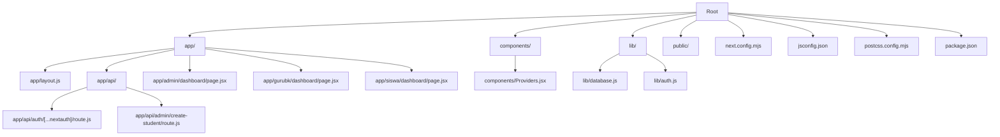
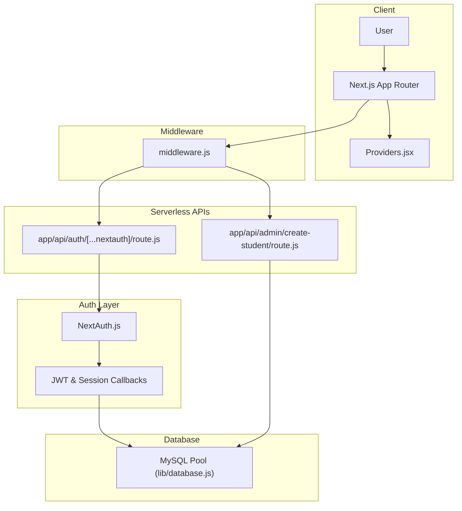
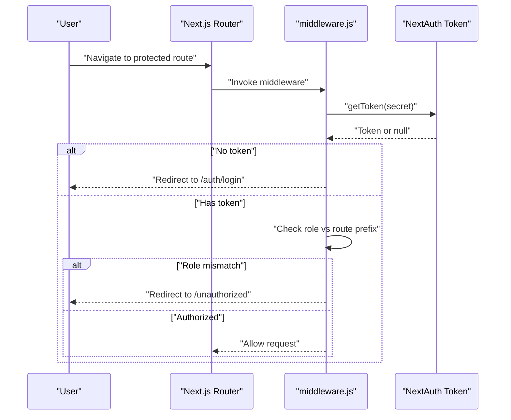
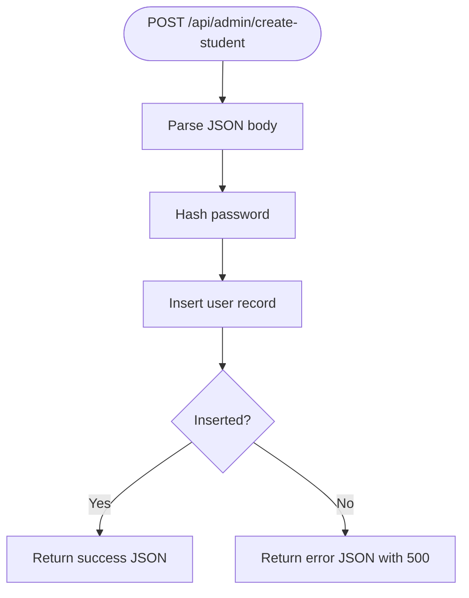

# Deployment & Configuration

<cite>
**Referenced Files in This Document**
- [package.json](file://package.json)
- [next.config.mjs](file://next.config.mjs)
- [jsconfig.json](file://jsconfig.json)
- [postcss.config.mjs](file://postcss.config.mjs)
- [README.md](file://README.md)
- [lib/database.js](file://lib/database.js)
- [lib/auth.js](file://lib/auth.js)
- [app/api/auth/[...nextauth]/route.js](file://app/api/auth/[...nextauth]/route.js)
- [middleware.js](file://middleware.js)
- [app/layout.js](file://app/layout.js)
- [components/Providers.jsx](file://components/Providers.jsx)
- [app/admin/dashboard/page.jsx](file://app/admin/dashboard/page.jsx)
- [app/gurubk/dashboard/page.jsx](file://app/gurubk/dashboard/page.jsx)
- [app/siswa/dashboard/page.jsx](file://app/siswa/dashboard/page.jsx)
- [app/api/admin/create-student/route.js](file://app/api/admin/create-student/route.js)
</cite>

## Table of Contents
1. [Introduction](#introduction)
2. [Project Structure](#project-structure)
3. [Core Components](#core-components)
4. [Architecture Overview](#architecture-overview)
5. [Detailed Component Analysis](#detailed-component-analysis)
6. [Dependency Analysis](#dependency-analysis)
7. [Performance Considerations](#performance-considerations)
8. [Troubleshooting Guide](#troubleshooting-guide)
9. [Conclusion](#conclusion)
10. [Appendices](#appendices)

## Introduction
This document provides comprehensive deployment and configuration guidance for the E-BK application. It covers Next.js configuration, build optimization, environment settings, database connectivity, authentication and security, static generation, and production deployment strategies across Vercel, AWS, and traditional hosting providers. It also outlines CI/CD, testing, monitoring, performance optimization, caching, CDN integration, troubleshooting, backups, disaster recovery, and maintenance tasks.

## Project Structure
The application follows a Next.js App Router structure with:
- Feature-based routes under app/
- API routes under app/api/*
- Shared UI components under components/
- Utility libraries under lib/
- Global styles and fonts configured via app/layout.js and next/font
- Tailwind CSS integration via postcss.config.mjs and jsconfig.json path aliases



**Diagram sources**
- [app/layout.js:1-31](file://app/layout.js#L1-L31)
- [components/Providers.jsx:1-14](file://components/Providers.jsx#L1-L14)
- [lib/database.js:1-23](file://lib/database.js#L1-L23)
- [lib/auth.js:1-77](file://lib/auth.js#L1-L77)
- [app/api/auth/[...nextauth]/route.js:1-102](file://app/api/auth/[...nextauth]/route.js#L1-L102)
- [app/api/admin/create-student/route.js:1-22](file://app/api/admin/create-student/route.js#L1-L22)
- [next.config.mjs:1-15](file://next.config.mjs#L1-L15)
- [jsconfig.json:1-10](file://jsconfig.json#L1-L10)
- [postcss.config.mjs:1-8](file://postcss.config.mjs#L1-L8)
- [package.json:1-44](file://package.json#L1-L44)

**Section sources**
- [README.md:1-37](file://README.md#L1-L37)
- [package.json:1-44](file://package.json#L1-L44)
- [next.config.mjs:1-15](file://next.config.mjs#L1-L15)
- [jsconfig.json:1-10](file://jsconfig.json#L1-L10)
- [postcss.config.mjs:1-8](file://postcss.config.mjs#L1-L8)
- [app/layout.js:1-31](file://app/layout.js#L1-L31)
- [components/Providers.jsx:1-14](file://components/Providers.jsx#L1-L14)

## Core Components
- Next.js configuration: image optimization settings and remote pattern allowances
- Database connectivity: MySQL pool configuration and query wrapper
- Authentication: NextAuth.js configuration with JWT strategy and role-based callbacks
- Middleware: Route protection and role gating for admin, guru, and siswa areas
- Providers: Session provider and toast notifications for client-side UX
- API routes: Protected administrative actions and authentication handlers

Key configuration touchpoints:
- Environment variables consumed by database and authentication layers
- Build scripts and toolchain dependencies
- Font loading and Tailwind integration

**Section sources**
- [next.config.mjs:1-15](file://next.config.mjs#L1-L15)
- [lib/database.js:1-23](file://lib/database.js#L1-L23)
- [lib/auth.js:1-77](file://lib/auth.js#L1-L77)
- [app/api/auth/[...nextauth]/route.js:1-102](file://app/api/auth/[...nextauth]/route.js#L1-L102)
- [middleware.js:1-53](file://middleware.js#L1-L53)
- [components/Providers.jsx:1-14](file://components/Providers.jsx#L1-L14)
- [package.json:1-44](file://package.json#L1-L44)

## Architecture Overview
The system architecture integrates client-side routing, serverless API routes, middleware-based authorization, and a MySQL backend. Authentication leverages NextAuth.js with JWT tokens stored client-side. Role-based access control is enforced via middleware matchers.



**Diagram sources**
- [middleware.js:1-53](file://middleware.js#L1-L53)
- [app/api/auth/[...nextauth]/route.js:1-102](file://app/api/auth/[...nextauth]/route.js#L1-L102)
- [lib/auth.js:1-77](file://lib/auth.js#L1-L77)
- [lib/database.js:1-23](file://lib/database.js#L1-L23)
- [components/Providers.jsx:1-14](file://components/Providers.jsx#L1-L14)

## Detailed Component Analysis

### Next.js Configuration
- Image optimization: Remote patterns allow HTTPS images globally; images are marked unoptimized to avoid unnecessary processing for local assets.
- Build and runtime scripts: Standard Next.js commands for development, build, and production start.
- Path aliases: Base URL and @/* alias simplify imports across the codebase.

Recommendations:
- Keep images.unoptimized enabled for local images to prevent unnecessary transformations.
- Consider enabling minimal image optimization selectively if CDN-hosted images are used later.
- Add output: 'experimental-serverless-trace' for AWS deployments if needed.

**Section sources**
- [next.config.mjs:1-15](file://next.config.mjs#L1-L15)
- [jsconfig.json:1-10](file://jsconfig.json#L1-L10)
- [package.json:1-44](file://package.json#L1-L44)

### Database Connection Configuration
- Connection pool: Host, user, password, database, limits, and queue settings are loaded from environment variables.
- Query wrapper: Centralized async query execution with error logging and rethrow behavior.
- Security: Sensitive credentials are sourced from environment variables; ensure secrets are managed securely in deployment environments.

Operational notes:
- Configure DB_HOST, DB_USER, DB_PASS, DB_NAME in your platform’s environment variables.
- Monitor pool usage and adjust connectionLimit and queueLimit based on traffic and database capacity.

**Section sources**
- [lib/database.js:1-23](file://lib/database.js#L1-L23)

### Authentication and Security Settings
- NextAuth.js configuration:
  - Credentials provider with flexible identifier support (email/NIS/NIP).
  - JWT session strategy with callbacks to enrich tokens and sessions.
  - Secret sourced from NEXTAUTH_SECRET environment variable.
- Middleware protection:
  - Public paths excluded from authentication checks.
  - Role-based redirection for admin, guru, and siswa routes.
  - Token retrieval using the same secret as NextAuth.

Security hardening tips:
- Rotate NEXTAUTH_SECRET regularly and keep it out of version control.
- Enforce HTTPS in production and configure secure cookies via NextAuth options.
- Sanitize user inputs in API routes and apply rate limiting for authentication endpoints.

**Section sources**
- [lib/auth.js:1-77](file://lib/auth.js#L1-L77)
- [app/api/auth/[...nextauth]/route.js:1-102](file://app/api/auth/[...nextauth]/route.js#L1-L102)
- [middleware.js:1-53](file://middleware.js#L1-L53)

### Middleware Authorization Flow


**Diagram sources**
- [middleware.js:1-53](file://middleware.js#L1-L53)

**Section sources**
- [middleware.js:1-53](file://middleware.js#L1-L53)

### Providers and Client-Side Session Management
- SessionProvider wraps the app to enable client-side session management.
- Toast notifications via react-hot-toast for user feedback.

Best practices:
- Ensure NEXTAUTH_SECRET is consistent across server and middleware.
- Avoid rendering sensitive data until after middleware validation.

**Section sources**
- [components/Providers.jsx:1-14](file://components/Providers.jsx#L1-L14)
- [app/layout.js:1-31](file://app/layout.js#L1-L31)

### API Routes and Data Access
- Admin student creation endpoint demonstrates:
  - JSON parsing from request body.
  - Password hashing prior to persistence.
  - Database insertion via shared query wrapper.
  - JSON response with error handling and status codes.



**Diagram sources**
- [app/api/admin/create-student/route.js:1-22](file://app/api/admin/create-student/route.js#L1-L22)
- [lib/database.js:1-23](file://lib/database.js#L1-L23)

**Section sources**
- [app/api/admin/create-student/route.js:1-22](file://app/api/admin/create-student/route.js#L1-L22)
- [lib/database.js:1-23](file://lib/database.js#L1-L23)

### Role-Based Dashboard Pages
Protected dashboards under admin, gurubk, and siswa namespaces rely on middleware for role enforcement. Ensure NEXTAUTH_SECRET is set so middleware can validate tokens.

**Section sources**
- [middleware.js:1-53](file://middleware.js#L1-L53)
- [app/admin/dashboard/page.jsx](file://app/admin/dashboard/page.jsx)
- [app/gurubk/dashboard/page.jsx](file://app/gurubk/dashboard/page.jsx)
- [app/siswa/dashboard/page.jsx](file://app/siswa/dashboard/page.jsx)

## Dependency Analysis
Runtime and build-time dependencies include Next.js, React, NextAuth.js, MySQL driver, Tailwind CSS, and related UI libraries. Scripts define standard development, build, and production start commands.

```mermaid
graph LR
Pkg["package.json"] --> NX["next"]
Pkg --> RA["react / react-dom"]
Pkg --> NA2["next-auth"]
Pkg --> DB["mysql2"]
Pkg --> TW["tailwindcss"]
Pkg --> UI["@radix-ui/*", "lucide-react", "framer-motion"]
```

**Diagram sources**
- [package.json:1-44](file://package.json#L1-L44)

**Section sources**
- [package.json:1-44](file://package.json#L1-L44)

## Performance Considerations
- Build optimization:
  - Use Next.js automatic optimizations (static generation, ISR, SWC minification).
  - Keep images.unoptimized for local images to reduce build overhead.
- Asset optimization:
  - Prefer server-hosted images for CDN benefits; configure remotePatterns accordingly.
  - Lazy-load non-critical assets and split bundles via dynamic imports.
- Database performance:
  - Tune MySQL pool settings (connectionLimit, queueLimit) based on observed concurrency.
  - Index frequently queried columns (users.email, siswa_profile.nis, guru_profile.nip).
- Caching:
  - Enable Next.js caching for static routes and ISR where appropriate.
  - Use CDN for static assets and API responses where feasible.
- Monitoring:
  - Integrate application performance monitoring (APM) and database query tracing.
  - Set up health checks and synthetic transactions.

[No sources needed since this section provides general guidance]

## Troubleshooting Guide
Common deployment and configuration issues:

- Authentication failures:
  - Verify NEXTAUTH_SECRET is present and identical across server and middleware.
  - Confirm database credentials and user existence for credential provider.
- Middleware redirect loops:
  - Ensure public paths are correctly whitelisted and match actual routes.
  - Check that role claims are present in tokens and align with route prefixes.
- Database connection errors:
  - Validate DB_HOST, DB_USER, DB_PASS, DB_NAME environment variables.
  - Confirm network access and firewall rules for the database host.
- Build failures:
  - Ensure Node.js and npm versions satisfy Next.js requirements.
  - Clear node_modules and reinstall dependencies if lockfile conflicts occur.
- Static generation issues:
  - Review image optimization settings and remotePatterns for asset URLs.
  - Confirm font loading and Tailwind configuration if styles appear broken.

**Section sources**
- [lib/auth.js:1-77](file://lib/auth.js#L1-L77)
- [app/api/auth/[...nextauth]/route.js:1-102](file://app/api/auth/[...nextauth]/route.js#L1-L102)
- [middleware.js:1-53](file://middleware.js#L1-L53)
- [lib/database.js:1-23](file://lib/database.js#L1-L23)
- [next.config.mjs:1-15](file://next.config.mjs#L1-L15)
- [package.json:1-44](file://package.json#L1-L44)

## Conclusion
The E-BK application is structured for scalable deployment with Next.js, robust authentication via NextAuth.js, and a MySQL backend. By securing environment variables, enforcing role-based access control, optimizing builds and assets, and leveraging CDNs and monitoring, you can achieve reliable and performant operations across Vercel, AWS, and traditional hosts.

[No sources needed since this section summarizes without analyzing specific files]

## Appendices

### Environment Variables Reference
- NEXTAUTH_SECRET: Secret for signing NextAuth.js JWT tokens
- DB_HOST: MySQL server hostname
- DB_USER: MySQL username
- DB_PASS: MySQL password
- DB_NAME: MySQL database name

Ensure these variables are set consistently across development, staging, and production environments.

**Section sources**
- [lib/auth.js:74](file://lib/auth.js#L74)
- [lib/database.js:4-7](file://lib/database.js#L4-L7)

### Deployment Targets and Strategies

- Vercel:
  - Recommended for rapid deployment and scaling with Next.js.
  - Configure environment variables in Vercel dashboard.
  - Use Vercel’s preview and production deployments for CI/CD.
- AWS:
  - Use AWS Amplify Console or EC2 with PM2/Express behind Nginx.
  - Store secrets in AWS Systems Manager Parameter Store or Secrets Manager.
  - Use RDS for MySQL and CloudFront for CDN.
- Traditional Hosting:
  - Serve with Node.js runtime and reverse proxy (Nginx/Apache).
  - Manage environment variables via hosting provider controls.
  - Ensure HTTPS termination and proper SSL certificates.

[No sources needed since this section provides general guidance]

### CI/CD Pipeline Setup
- Build and test:
  - Run linting and unit tests in CI.
  - Execute Next.js build to catch configuration issues early.
- Secrets management:
  - Inject environment variables per environment.
- Deployment:
  - Automated deployment to preview/staging on pull requests.
  - Production deployment gated by manual approval or branch protection.

[No sources needed since this section provides general guidance]

### Monitoring and Observability
- Application metrics: Track response times, error rates, and throughput.
- Database metrics: Monitor query latency, slow queries, and pool saturation.
- Logs: Centralize logs and correlate authentication and API errors.
- Health checks: Expose readiness/liveness endpoints.

[No sources needed since this section provides general guidance]

### Backup and Disaster Recovery
- Database backups: Schedule regular logical backups (mysqldump) and test restore procedures.
- Secrets rotation: Periodically rotate NEXTAUTH_SECRET and update all environments.
- Artifact retention: Keep previous builds for rollback capability.
- DR plan: Define RTO/RPO targets and automate failover steps.

[No sources needed since this section provides general guidance]

### Maintenance Tasks
- Dependency updates: Regularly audit and update packages.
- Security patches: Apply security updates promptly.
- Database maintenance: Optimize tables, update statistics, and review slow logs.
- Performance tuning: Adjust pool sizes, cache policies, and CDN configurations based on telemetry.

[No sources needed since this section provides general guidance]