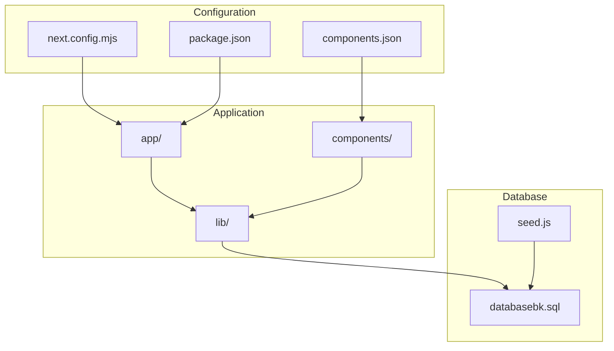
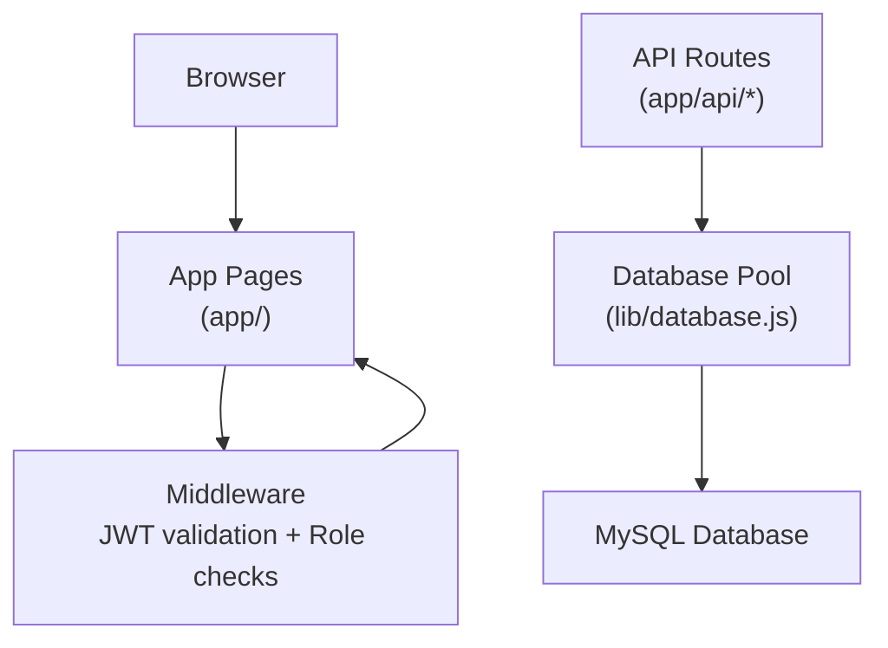
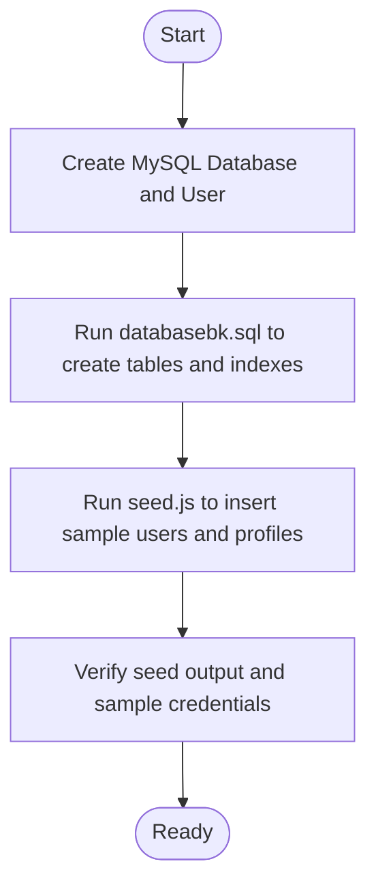
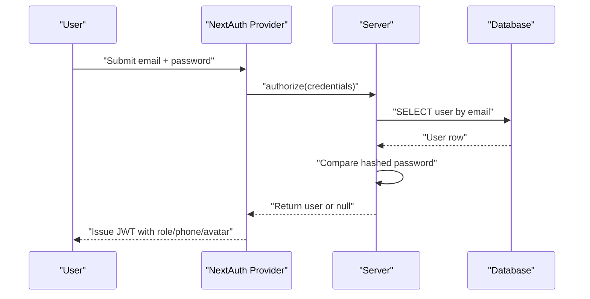
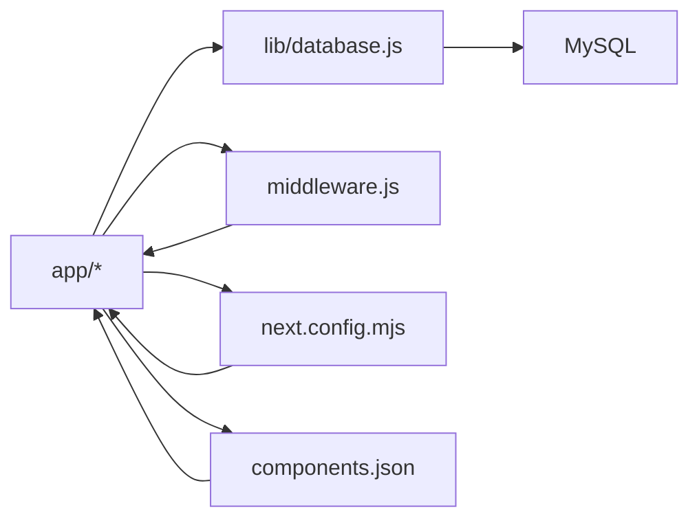

# Getting Started

<cite>
**Referenced Files in This Document**
- [package.json](file://package.json)
- [README.md](file://README.md)
- [lib/database.js](file://lib/database.js)
- [lib/auth.js](file://lib/auth.js)
- [middleware.js](file://middleware.js)
- [databasebk.sql](file://databasebk.sql)
- [seed.js](file://seed.js)
- [next.config.mjs](file://next.config.mjs)
- [components.json](file://components.json)
- [app/api/admin/create-student/route.js](file://app/api/admin/create-student/route.js)
- [app/api/admin/create-teacher/route.js](file://app/api/admin/create-teacher/route.js)
</cite>

## Table of Contents
1. [Introduction](#introduction)
2. [Project Structure](#project-structure)
3. [Core Components](#core-components)
4. [Architecture Overview](#architecture-overview)
5. [Detailed Component Analysis](#detailed-component-analysis)
6. [Dependency Analysis](#dependency-analysis)
7. [Performance Considerations](#performance-considerations)
8. [Troubleshooting Guide](#troubleshooting-guide)
9. [Conclusion](#conclusion)
10. [Appendices](#appendices)

## Introduction
This guide helps you set up the E-BK application locally for development. It covers installing prerequisites, configuring the database with MySQL, preparing environment variables, initializing the database schema and seed data, configuring NextAuth.js, and verifying the setup. The application is a Next.js 16 project using a MySQL backend and JWT-based authentication via NextAuth.js.

## Project Structure
E-BK follows a standard Next.js App Router layout with:
- Application pages under app/
- Shared UI components under components/
- Utility libraries under lib/
- Database schema and seeding scripts at the repository root
- Configuration files for Next.js, Tailwind, and ESLint

**Diagram sources**
- [package.json:1-44](file://package.json#L1-L44)
- [next.config.mjs:1-15](file://next.config.mjs#L1-L15)
- [components.json:1-23](file://components.json#L1-L23)
- [lib/database.js:1-23](file://lib/database.js#L1-L23)
- [databasebk.sql:1-407](file://databasebk.sql#L1-L407)
- [seed.js:1-89](file://seed.js#L1-L89)

**Section sources**
- [package.json:1-44](file://package.json#L1-L44)
- [next.config.mjs:1-15](file://next.config.mjs#L1-L15)
- [components.json:1-23](file://components.json#L1-L23)

## Core Components
- Database connectivity: A MySQL connection pool configured via environment variables.
- Authentication: NextAuth.js with Credentials provider and JWT callbacks.
- Middleware protection: Route guards enforcing role-based access control.
- API routes: Example admin endpoints for creating students and teachers.
- Database schema and seed: SQL script and Node-based seed script for initial data.

Key implementation references:
- Database pool and query wrapper: [lib/database.js:1-23](file://lib/database.js#L1-L23)
- NextAuth configuration: [lib/auth.js:1-77](file://lib/auth.js#L1-L77)
- Middleware role checks: [middleware.js:1-53](file://middleware.js#L1-L53)
- Admin endpoints: [app/api/admin/create-student/route.js:1-22](file://app/api/admin/create-student/route.js#L1-L22), [app/api/admin/create-teacher/route.js:1-22](file://app/api/admin/create-teacher/route.js#L1-L22)
- Schema and seed: [databasebk.sql:1-407](file://databasebk.sql#L1-L407), [seed.js:1-89](file://seed.js#L1-L89)

**Section sources**
- [lib/database.js:1-23](file://lib/database.js#L1-L23)
- [lib/auth.js:1-77](file://lib/auth.js#L1-L77)
- [middleware.js:1-53](file://middleware.js#L1-L53)
- [app/api/admin/create-student/route.js:1-22](file://app/api/admin/create-student/route.js#L1-L22)
- [app/api/admin/create-teacher/route.js:1-22](file://app/api/admin/create-teacher/route.js#L1-L22)
- [databasebk.sql:1-407](file://databasebk.sql#L1-L407)
- [seed.js:1-89](file://seed.js#L1-L89)

## Architecture Overview
High-level runtime flow:
- Client requests protected pages.
- Middleware validates JWT and enforces role-based access.
- Pages call server-side API routes or shared database queries.
- Database operations use a pooled connection configured from environment variables.

**Diagram sources**
- [middleware.js:1-53](file://middleware.js#L1-L53)
- [lib/database.js:1-23](file://lib/database.js#L1-L23)
- [app/api/admin/create-student/route.js:1-22](file://app/api/admin/create-student/route.js#L1-L22)
- [app/api/admin/create-teacher/route.js:1-22](file://app/api/admin/create-teacher/route.js#L1-L22)

## Detailed Component Analysis

### Environment Variables and Configuration
Required environment variables:
- Database: DB_HOST, DB_USER, DB_PASS, DB_NAME
- Authentication: NEXTAUTH_SECRET

Where they are used:
- Database pool reads DB_* variables: [lib/database.js:3-11](file://lib/database.js#L3-L11)
- NextAuth secret fallback and runtime usage: [lib/auth.js:74](file://lib/auth.js#L74), [middleware.js:19](file://middleware.js#L19)
- Seed script reads DB_* variables: [seed.js:8-13](file://seed.js#L8-L13)

Recommended approach:
- Create a .env.local file at the project root with the variables above.
- Keep NEXTAUTH_SECRET secure and unique in production.

Verification:
- Confirm environment variables are loaded by checking logs during startup and seed execution.

**Section sources**
- [lib/database.js:3-11](file://lib/database.js#L3-L11)
- [lib/auth.js:74](file://lib/auth.js#L74)
- [middleware.js:19](file://middleware.js#L19)
- [seed.js:8-13](file://seed.js#L8-L13)

### Database Setup and Initialization
Steps:
1. Install and start MySQL.
2. Create a database and user with appropriate privileges.
3. Initialize schema using the provided SQL file.
4. Seed the database with the Node-based seed script.

Schema and seed references:
- Schema definition and indexes: [databasebk.sql:1-407](file://databasebk.sql#L1-L407)
- Seed script hashing and inserts: [seed.js:1-89](file://seed.js#L1-L89)

**Diagram sources**
- [databasebk.sql:1-407](file://databasebk.sql#L1-L407)
- [seed.js:1-89](file://seed.js#L1-L89)

**Section sources**
- [databasebk.sql:1-407](file://databasebk.sql#L1-L407)
- [seed.js:1-89](file://seed.js#L1-L89)

### NextAuth.js Configuration
Highlights:
- Credentials provider for email/password login.
- JWT strategy with callbacks to attach role, phone, and avatar to tokens/sessions.
- Secret sourced from NEXTAUTH_SECRET with a fallback value in code.

References:
- Provider and callbacks: [lib/auth.js:6-75](file://lib/auth.js#L6-L75)
- Middleware relying on NEXTAUTH_SECRET: [middleware.js:19](file://middleware.js#L19)

**Diagram sources**
- [lib/auth.js:14-44](file://lib/auth.js#L14-L44)
- [lib/database.js:13-21](file://lib/database.js#L13-L21)

**Section sources**
- [lib/auth.js:6-75](file://lib/auth.js#L6-L75)
- [middleware.js:19](file://middleware.js#L19)

### API Routes and Database Interactions
Examples:
- Admin endpoints for creating students and teachers hash passwords and insert into users table.

References:
- Create student endpoint: [app/api/admin/create-student/route.js:1-22](file://app/api/admin/create-student/route.js#L1-L22)
- Create teacher endpoint: [app/api/admin/create-teacher/route.js:1-22](file://app/api/admin/create-teacher/route.js#L1-L22)
- Shared query wrapper: [lib/database.js:13-21](file://lib/database.js#L13-L21)

**Section sources**
- [app/api/admin/create-student/route.js:1-22](file://app/api/admin/create-student/route.js#L1-L22)
- [app/api/admin/create-teacher/route.js:1-22](file://app/api/admin/create-teacher/route.js#L1-L22)
- [lib/database.js:13-21](file://lib/database.js#L13-L21)

### Middleware and Access Control
Behavior:
- Public paths bypass checks.
- Other paths require a valid JWT signed with NEXTAUTH_SECRET.
- Role gates redirect non-admin users away from admin routes, similarly for guru and siswa.

References:
- Matcher and guards: [middleware.js:4-43](file://middleware.js#L4-L43)

**Section sources**
- [middleware.js:4-43](file://middleware.js#L4-L43)

## Dependency Analysis
Runtime dependencies relevant to setup:
- next, react, react-dom for the framework and rendering.
- next-auth for authentication.
- mysql2 for MySQL connectivity.
- bcryptjs for password hashing in seeds and auth.
- Additional UI and utility packages.

Installation and scripts:
- Scripts include dev, build, start, lint.
- Dev server runs on port 3000 by default.

References:
- Dependencies and scripts: [package.json:11-10](file://package.json#L11-L10)
- Getting started instructions: [README.md:3-17](file://README.md#L3-L17)

**Diagram sources**
- [package.json:11-10](file://package.json#L11-L10)
- [lib/database.js:1-23](file://lib/database.js#L1-23)
- [middleware.js:1-53](file://middleware.js#L1-L53)
- [next.config.mjs:1-15](file://next.config.mjs#L1-L15)
- [components.json:1-23](file://components.json#L1-L23)

**Section sources**
- [package.json:11-10](file://package.json#L11-L10)
- [README.md:3-17](file://README.md#L3-L17)

## Performance Considerations
- Use the provided indexes in the schema to optimize common lookups.
- Keep database connection pool limits reasonable for local development.
- Avoid logging sensitive data in production builds.

[No sources needed since this section provides general guidance]

## Troubleshooting Guide
Common issues and resolutions:
- Database connection errors
  - Cause: Incorrect DB_HOST, DB_USER, DB_PASS, or DB_NAME.
  - Action: Verify .env.local values and MySQL service status.
  - Reference: [lib/database.js:3-11](file://lib/database.js#L3-L11)
- Authentication failures
  - Cause: NEXTAUTH_SECRET mismatch or missing environment variable.
  - Action: Set NEXTAUTH_SECRET in .env.local and restart the server.
  - References: [lib/auth.js:74](file://lib/auth.js#L74), [middleware.js:19](file://middleware.js#L19)
- Seed fails to connect
  - Cause: DB_* variables not loaded by dotenv.
  - Action: Ensure .env.local exists and seed.js loads it.
  - Reference: [seed.js:5](file://seed.js#L5)
- Unauthorized access to protected routes
  - Cause: Missing or invalid JWT token, or role mismatch.
  - Action: Log in with correct credentials and verify role.
  - Reference: [middleware.js:21-40](file://middleware.js#L21-L40)
- Dev server not starting
  - Cause: Port 3000 in use or missing dependencies.
  - Action: Run install and free port 3000.
  - Reference: [README.md:5-15](file://README.md#L5-L15)

**Section sources**
- [lib/database.js:3-11](file://lib/database.js#L3-L11)
- [lib/auth.js:74](file://lib/auth.js#L74)
- [middleware.js:19](file://middleware.js#L19)
- [seed.js:5](file://seed.js#L5)
- [middleware.js:21-40](file://middleware.js#L21-L40)
- [README.md:5-15](file://README.md#L5-L15)

## Conclusion
You now have the essentials to run E-BK locally: install dependencies, configure MySQL, set environment variables, initialize the schema, seed data, and start the development server. Use the verification steps to confirm each phase and consult the troubleshooting section for quick fixes.

[No sources needed since this section summarizes without analyzing specific files]

## Appendices

### Step-by-Step Installation Checklist
- Prerequisites
  - Node.js installed.
  - MySQL installed and running.
- Clone repository and install dependencies
  - Install dependencies using your preferred package manager.
  - Reference: [README.md:5-15](file://README.md#L5-L15)
- Configure environment variables
  - Create .env.local with DB_HOST, DB_USER, DB_PASS, DB_NAME, NEXTAUTH_SECRET.
  - References: [lib/database.js:3-11](file://lib/database.js#L3-L11), [lib/auth.js:74](file://lib/auth.js#L74), [middleware.js:19](file://middleware.js#L19)
- Initialize database
  - Run databasebk.sql to create tables and indexes.
  - Run seed.js to insert sample users and profiles.
  - References: [databasebk.sql:1-407](file://databasebk.sql#L1-L407), [seed.js:1-89](file://seed.js#L1-L89)
- Start development server
  - Run the dev script and open http://localhost:3000.
  - Reference: [README.md:5-15](file://README.md#L5-L15)

**Section sources**
- [README.md:5-15](file://README.md#L5-L15)
- [lib/database.js:3-11](file://lib/database.js#L3-L11)
- [lib/auth.js:74](file://lib/auth.js#L74)
- [middleware.js:19](file://middleware.js#L19)
- [databasebk.sql:1-407](file://databasebk.sql#L1-L407)
- [seed.js:1-89](file://seed.js#L1-L89)