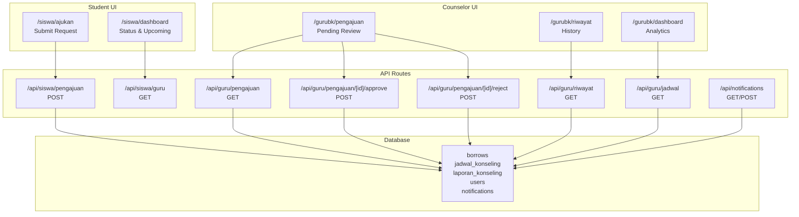
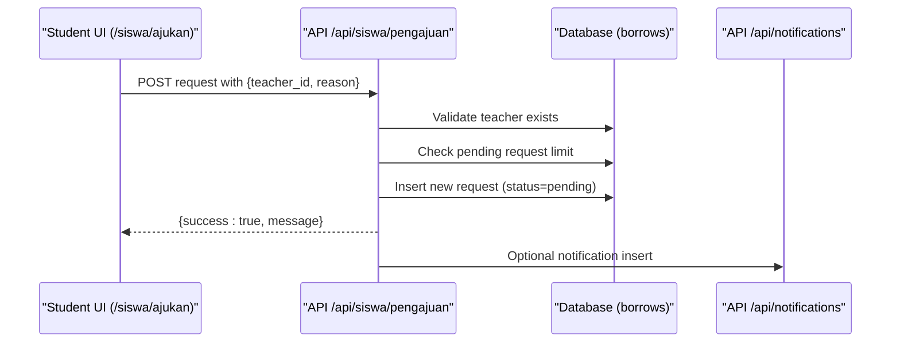
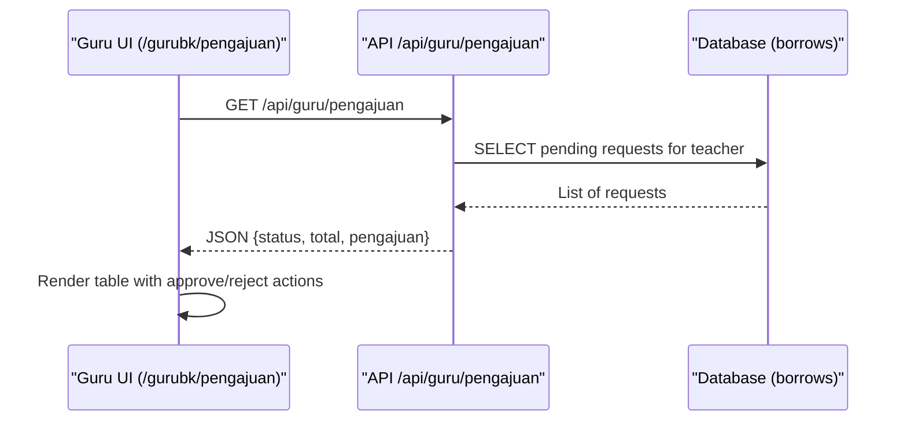
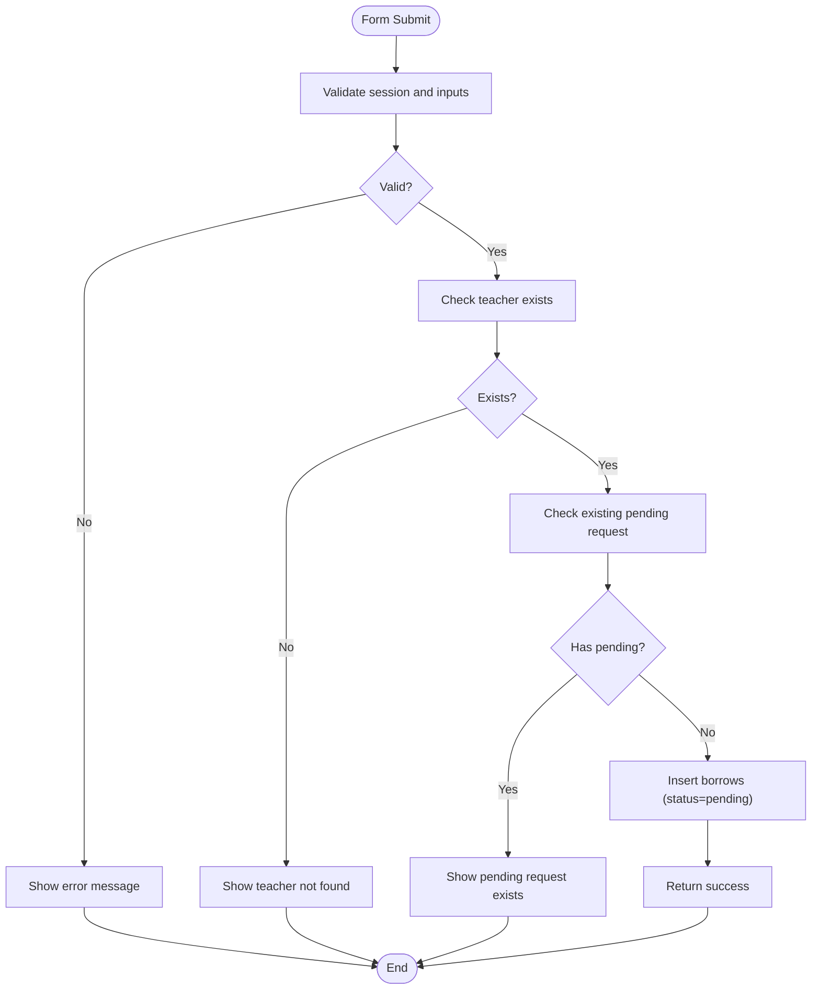
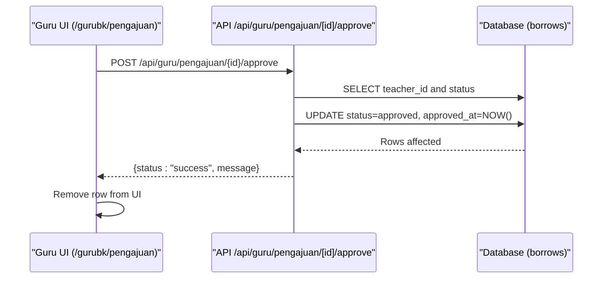
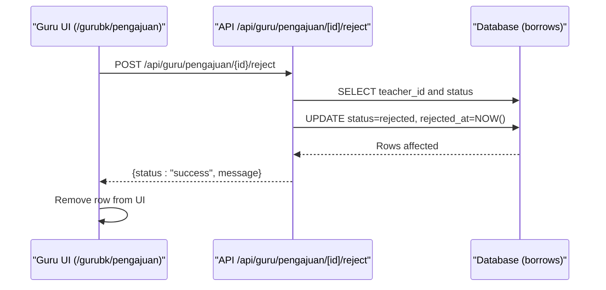
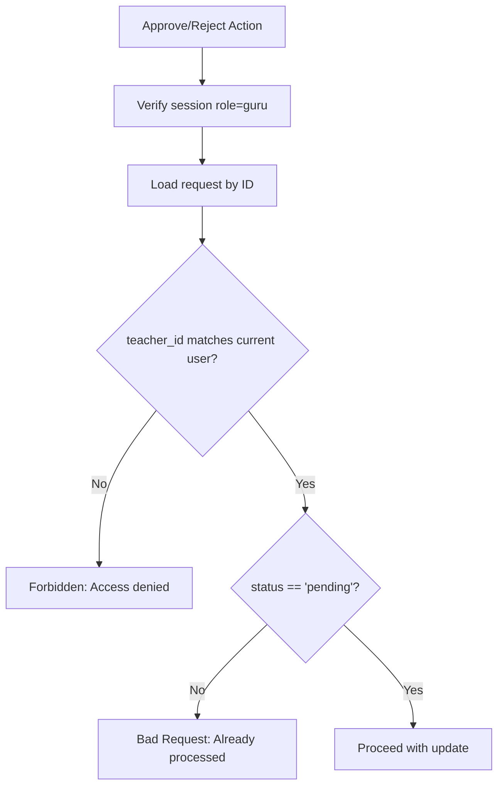
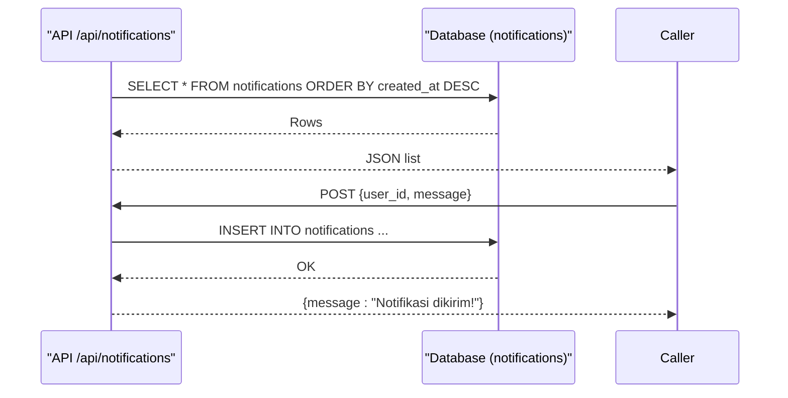
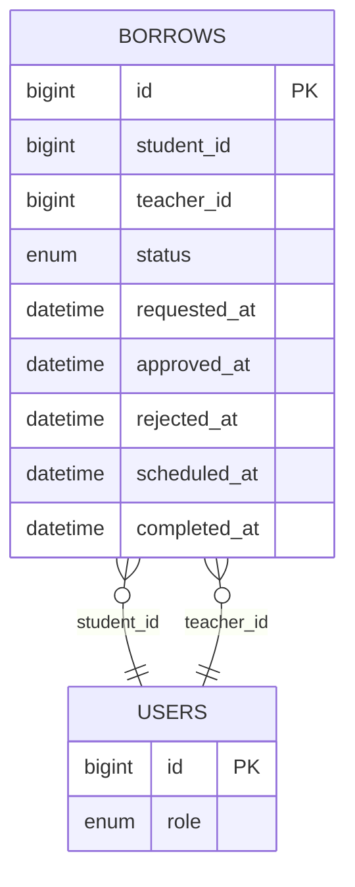
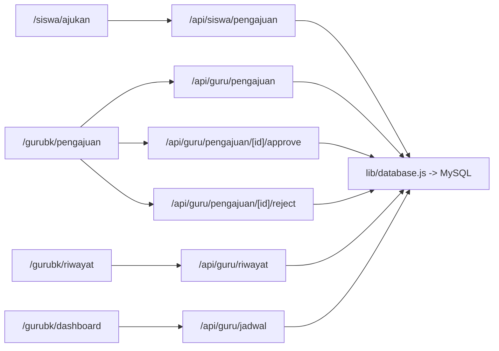

# Appointment Management & Requests

<cite>
**Referenced Files in This Document**
- [app/gurubk/pengajuan/page.jsx](file://app/gurubk/pengajuan/page.jsx)
- [app/siswa/ajukan/page.jsx](file://app/siswa/ajukan/page.jsx)
- [app/api/guru/pengajuan/route.js](file://app/api/guru/pengajuan/route.js)
- [app/api/guru/pengajuan/[id]/approve/route.js](file://app/api/guru/pengajuan/[id]/approve/route.js)
- [app/api/guru/pengajuan/[id]/reject/route.js](file://app/api/guru/pengajuan/[id]/reject/route.js)
- [app/api/siswa/pengajuan/route.js](file://app/api/siswa/pengajuan/route.js)
- [app/api/siswa/guru/route.js](file://app/api/siswa/guru/route.js)
- [app/api/guru/riwayat/route.js](file://app/api/guru/riwayat/route.js)
- [app/gurubk/riwayat/page.jsx](file://app/gurubk/riwayat/page.jsx)
- [app/api/guru/jadwal/route.js](file://app/api/guru/jadwal/route.js)
- [app/api/notifications/route.js](file://app/api/notifications/route.js)
- [app/siswa/dashboard/page.jsx](file://app/siswa/dashboard/page.jsx)
- [app/gurubk/dashboard/page.jsx](file://app/gurubk/dashboard/page.jsx)
- [lib/database.js](file://lib/database.js)
- [databasebk.sql](file://databasebk.sql)
</cite>

## Table of Contents
1. [Introduction](#introduction)
2. [Project Structure](#project-structure)
3. [Core Components](#core-components)
4. [Architecture Overview](#architecture-overview)
5. [Detailed Component Analysis](#detailed-component-analysis)
6. [Dependency Analysis](#dependency-analysis)
7. [Performance Considerations](#performance-considerations)
8. [Troubleshooting Guide](#troubleshooting-guide)
9. [Conclusion](#conclusion)
10. [Appendices](#appendices)

## Introduction
This document explains the Guru BK appointment management system for counseling requests. It covers how students submit requests, how counselors review and approve/reject them, how conflicts are handled, and how outcomes are communicated. It also documents the pending requests interface, categorization by status, and the impact on student records.

## Project Structure
The system is a Next.js application with:
- Client-side pages for students and counselors
- API routes for CRUD and workflow actions
- Database schema supporting requests, schedules, reports, and notifications

**Diagram sources**
- [app/siswa/ajukan/page.jsx:1-180](file://app/siswa/ajukan/page.jsx#L1-L180)
- [app/gurubk/pengajuan/page.jsx:1-104](file://app/gurubk/pengajuan/page.jsx#L1-L104)
- [app/api/siswa/pengajuan/route.js:1-79](file://app/api/siswa/pengajuan/route.js#L1-L79)
- [app/api/siswa/guru/route.js:1-43](file://app/api/siswa/guru/route.js#L1-L43)
- [app/api/guru/pengajuan/route.js:1-49](file://app/api/guru/pengajuan/route.js#L1-L49)
- [app/api/guru/pengajuan/[id]/approve/route.js](file://app/api/guru/pengajuan/[id]/approve/route.js#L1-L73)
- [app/api/guru/pengajuan/[id]/reject/route.js](file://app/api/guru/pengajuan/[id]/reject/route.js#L1-L73)
- [app/api/guru/riwayat/route.js:1-50](file://app/api/guru/riwayat/route.js#L1-L50)
- [app/api/guru/jadwal/route.js:1-48](file://app/api/guru/jadwal/route.js#L1-L48)
- [app/api/notifications/route.js:1-20](file://app/api/notifications/route.js#L1-L20)
- [databasebk.sql:68-89](file://databasebk.sql#L68-L89)

**Section sources**
- [app/siswa/ajukan/page.jsx:1-180](file://app/siswa/ajukan/page.jsx#L1-L180)
- [app/gurubk/pengajuan/page.jsx:1-104](file://app/gurubk/pengajuan/page.jsx#L1-L104)
- [app/api/siswa/pengajuan/route.js:1-79](file://app/api/siswa/pengajuan/route.js#L1-L79)
- [app/api/guru/pengajuan/route.js:1-49](file://app/api/guru/pengajuan/route.js#L1-L49)
- [databasebk.sql:68-89](file://databasebk.sql#L68-L89)

## Core Components
- Student request submission form with validation and session checks
- Counselor pending requests table with approve/reject actions
- Request lifecycle APIs enforcing authorization and status checks
- History and schedule retrieval for counselors
- Notifications endpoint for system-wide alerts
- Database schema supporting requests, schedules, reports, and notifications

**Section sources**
- [app/siswa/ajukan/page.jsx:1-180](file://app/siswa/ajukan/page.jsx#L1-L180)
- [app/gurubk/pengajuan/page.jsx:1-104](file://app/gurubk/pengajuan/page.jsx#L1-L104)
- [app/api/siswa/pengajuan/route.js:1-79](file://app/api/siswa/pengajuan/route.js#L1-L79)
- [app/api/guru/pengajuan/route.js:1-49](file://app/api/guru/pengajuan/route.js#L1-L49)
- [app/api/guru/pengajuan/[id]/approve/route.js](file://app/api/guru/pengajuan/[id]/approve/route.js#L1-L73)
- [app/api/guru/pengajuan/[id]/reject/route.js](file://app/api/guru/pengajuan/[id]/reject/route.js#L1-L73)
- [app/api/guru/riwayat/route.js:1-50](file://app/api/guru/riwayat/route.js#L1-L50)
- [app/api/guru/jadwal/route.js:1-48](file://app/api/guru/jadwal/route.js#L1-L48)
- [app/api/notifications/route.js:1-20](file://app/api/notifications/route.js#L1-L20)
- [databasebk.sql:68-89](file://databasebk.sql#L68-L89)

## Architecture Overview
The system follows a client-server pattern:
- Client pages handle user interactions and fetch data via API routes
- API routes validate sessions, enforce roles, and interact with the database
- Database stores requests, schedules, reports, and notifications

**Diagram sources**
- [app/siswa/ajukan/page.jsx:53-88](file://app/siswa/ajukan/page.jsx#L53-L88)
- [app/api/siswa/pengajuan/route.js:1-79](file://app/api/siswa/pengajuan/route.js#L1-L79)
- [app/api/notifications/route.js:1-20](file://app/api/notifications/route.js#L1-L20)
- [databasebk.sql:68-89](file://databasebk.sql#L68-L89)

## Detailed Component Analysis

### Pending Requests Interface (Counselor)
- Loads pending requests assigned to the logged-in counselor
- Displays student name/email, title, and timestamp
- Provides Approve and Reject buttons that trigger API endpoints

**Diagram sources**
- [app/gurubk/pengajuan/page.jsx:11-25](file://app/gurubk/pengajuan/page.jsx#L11-L25)
- [app/api/guru/pengajuan/route.js:1-49](file://app/api/guru/pengajuan/route.js#L1-L49)
- [databasebk.sql:68-89](file://databasebk.sql#L68-L89)

**Section sources**
- [app/gurubk/pengajuan/page.jsx:1-104](file://app/gurubk/pengajuan/page.jsx#L1-L104)
- [app/api/guru/pengajuan/route.js:1-49](file://app/api/guru/pengajuan/route.js#L1-L49)

### Student Request Submission
- Validates session (role=siswa), teacher selection, and reason presence
- Prevents multiple concurrent pending requests
- Inserts a new request with status “pending”

**Diagram sources**
- [app/siswa/ajukan/page.jsx:53-88](file://app/siswa/ajukan/page.jsx#L53-L88)
- [app/api/siswa/pengajuan/route.js:1-79](file://app/api/siswa/pengajuan/route.js#L1-L79)
- [databasebk.sql:68-89](file://databasebk.sql#L68-L89)

**Section sources**
- [app/siswa/ajukan/page.jsx:1-180](file://app/siswa/ajukan/page.jsx#L1-L180)
- [app/api/siswa/pengajuan/route.js:1-79](file://app/api/siswa/pengajuan/route.js#L1-L79)

### Approval Workflow
- Ensures counselor session, request ownership, and pending status
- Updates status to “approved” and records approval timestamp

**Diagram sources**
- [app/gurubk/pengajuan/page.jsx:17-25](file://app/gurubk/pengajuan/page.jsx#L17-L25)
- [app/api/guru/pengajuan/[id]/approve/route.js](file://app/api/guru/pengajuan/[id]/approve/route.js#L1-L73)
- [databasebk.sql:68-89](file://databasebk.sql#L68-L89)

**Section sources**
- [app/api/guru/pengajuan/[id]/approve/route.js](file://app/api/guru/pengajuan/[id]/approve/route.js#L1-L73)

### Rejection Procedure
- Ensures counselor session, request ownership, and pending status
- Updates status to “rejected” and records rejection timestamp

**Diagram sources**
- [app/gurubk/pengajuan/page.jsx:22-25](file://app/gurubk/pengajuan/page.jsx#L22-L25)
- [app/api/guru/pengajuan/[id]/reject/route.js](file://app/api/guru/pengajuan/[id]/reject/route.js#L1-L73)
- [databasebk.sql:68-89](file://databasebk.sql#L68-L89)

**Section sources**
- [app/api/guru/pengajuan/[id]/reject/route.js](file://app/api/guru/pengajuan/[id]/reject/route.js#L1-L73)

### Conflict Detection Mechanisms
- Pending request limit: Students cannot submit a new request if one is still pending
- Ownership: Counselors can only act on requests assigned to them
- Status guard: Approve/reject only work on “pending” requests

**Diagram sources**
- [app/api/guru/pengajuan/[id]/approve/route.js](file://app/api/guru/pengajuan/[id]/approve/route.js#L1-L73)
- [app/api/guru/pengajuan/[id]/reject/route.js](file://app/api/guru/pengajuan/[id]/reject/route.js#L1-L73)
- [databasebk.sql:68-89](file://databasebk.sql#L68-L89)

**Section sources**
- [app/api/siswa/pengajuan/route.js:42-52](file://app/api/siswa/pengajuan/route.js#L42-L52)
- [app/api/guru/pengajuan/[id]/approve/route.js](file://app/api/guru/pengajuan/[id]/approve/route.js#L18-L47)
- [app/api/guru/pengajuan/[id]/reject/route.js](file://app/api/guru/pengajuan/[id]/reject/route.js#L18-L47)

### Automated Notification Systems
- Notifications endpoint supports listing and posting notifications
- Can be extended to emit notifications upon approval/rejection events

**Diagram sources**
- [app/api/notifications/route.js:1-20](file://app/api/notifications/route.js#L1-L20)
- [databasebk.sql:143-152](file://databasebk.sql#L143-L152)

**Section sources**
- [app/api/notifications/route.js:1-20](file://app/api/notifications/route.js#L1-L20)
- [databasebk.sql:143-152](file://databasebk.sql#L143-L152)

### Request Categorization by Status
- Status values: pending, approved, rejected, completed
- Pending requests are visible to counselors; history lists approved/completed
- Schedule endpoint filters approved requests with scheduled dates

**Diagram sources**
- [databasebk.sql:68-89](file://databasebk.sql#L68-L89)

**Section sources**
- [databasebk.sql:68-89](file://databasebk.sql#L68-L89)
- [app/api/guru/riwayat/route.js:21-38](file://app/api/guru/riwayat/route.js#L21-L38)
- [app/api/guru/jadwal/route.js:17-37](file://app/api/guru/jadwal/route.js#L17-L37)

### Impact on Student Records
- Approved/completed requests appear in counselor’s history and student’s dashboard
- Pending requests influence submission eligibility
- Scheduling updates are reflected in schedule queries

**Section sources**
- [app/api/guru/riwayat/route.js:21-38](file://app/api/guru/riwayat/route.js#L21-L38)
- [app/siswa/dashboard/page.jsx:90-140](file://app/siswa/dashboard/page.jsx#L90-L140)
- [app/api/guru/jadwal/route.js:17-37](file://app/api/guru/jadwal/route.js#L17-L37)

### Examples of Common Scenarios
- Scenario A: Student submits a request; counselor sees it in pending list
- Scenario B: Student tries to submit another request while one is pending; blocked
- Scenario C: Counselor approves; student sees updated status and upcoming session
- Scenario D: Counselor rejects; student receives notification and can resubmit later

**Section sources**
- [app/siswa/ajukan/page.jsx:53-88](file://app/siswa/ajukan/page.jsx#L53-L88)
- [app/gurubk/pengajuan/page.jsx:17-25](file://app/gurubk/pengajuan/page.jsx#L17-L25)
- [app/api/siswa/pengajuan/route.js:42-52](file://app/api/siswa/pengajuan/route.js#L42-L52)

### Decision-Making Guidelines
- Approve when:
  - Request is legitimate and aligns with counselor’s availability
  - Student has provided sufficient reason and contact info
- Reject when:
  - Request is invalid, inappropriate, or outside scope
  - Student has not provided required information
- Always verify ownership and pending status before acting

**Section sources**
- [app/api/guru/pengajuan/[id]/approve/route.js](file://app/api/guru/pengajuan/[id]/approve/route.js#L18-L47)
- [app/api/guru/pengajuan/[id]/reject/route.js](file://app/api/guru/pengajuan/[id]/reject/route.js#L18-L47)

### Communication Templates
- Approval template: “Your counseling request has been approved. You will receive a calendar invite shortly.”
- Rejection template: “Your request has been reviewed and not approved. Please resubmit with additional details if needed.”

[No sources needed since this section provides general guidance]

## Dependency Analysis
- UI pages depend on API routes for data and actions
- API routes depend on database utilities for SQL execution
- Database schema defines relationships and constraints

**Diagram sources**
- [app/siswa/ajukan/page.jsx:1-180](file://app/siswa/ajukan/page.jsx#L1-L180)
- [app/gurubk/pengajuan/page.jsx:1-104](file://app/gurubk/pengajuan/page.jsx#L1-L104)
- [app/api/siswa/pengajuan/route.js:1-79](file://app/api/siswa/pengajuan/route.js#L1-L79)
- [app/api/guru/pengajuan/route.js:1-49](file://app/api/guru/pengajuan/route.js#L1-L49)
- [app/api/guru/pengajuan/[id]/approve/route.js](file://app/api/guru/pengajuan/[id]/approve/route.js#L1-L73)
- [app/api/guru/pengajuan/[id]/reject/route.js](file://app/api/guru/pengajuan/[id]/reject/route.js#L1-L73)
- [app/api/guru/riwayat/route.js:1-50](file://app/api/guru/riwayat/route.js#L1-L50)
- [app/api/guru/jadwal/route.js:1-48](file://app/api/guru/jadwal/route.js#L1-L48)
- [lib/database.js:1-23](file://lib/database.js#L1-L23)

**Section sources**
- [lib/database.js:1-23](file://lib/database.js#L1-L23)
- [databasebk.sql:68-89](file://databasebk.sql#L68-L89)

## Performance Considerations
- Database indexes on status, student_id, and teacher_id improve query performance
- Force dynamic responses ensure fresh data for pending lists and schedules
- Consider pagination for large histories and pending lists

**Section sources**
- [databasebk.sql:199-211](file://databasebk.sql#L199-L211)
- [app/api/guru/pengajuan/route.js:5-5](file://app/api/guru/pengajuan/route.js#L5-L5)
- [app/api/guru/jadwal/route.js:5-5](file://app/api/guru/jadwal/route.js#L5-L5)

## Troubleshooting Guide
- Unauthorized access: Ensure session role matches expected role (siswa/guru)
- Pending request conflicts: Students cannot submit while a pending exists
- Request not found or already processed: Verify ID and status
- Database errors: Check connection settings and query logs

**Section sources**
- [app/api/siswa/pengajuan/route.js:11-16](file://app/api/siswa/pengajuan/route.js#L11-L16)
- [app/api/guru/pengajuan/[id]/approve/route.js](file://app/api/guru/pengajuan/[id]/approve/route.js#L11-L13)
- [app/api/guru/pengajuan/[id]/reject/route.js](file://app/api/guru/pengajuan/[id]/reject/route.js#L11-L13)
- [lib/database.js:1-23](file://lib/database.js#L1-L23)

## Conclusion
The Guru BK appointment management system provides a clear, role-based workflow for submitting, reviewing, approving, and rejecting counseling requests. Its design emphasizes safety (ownership and status checks), transparency (pending lists and histories), and extensibility (notification hooks). By adhering to the documented guidelines and leveraging the provided APIs, stakeholders can maintain efficient and compliant counseling operations.

## Appendices
- Additional counselor analytics and quick actions are available in the counselor dashboard
- Student dashboard surfaces recent status and upcoming sessions

**Section sources**
- [app/gurubk/dashboard/page.jsx:1-158](file://app/gurubk/dashboard/page.jsx#L1-L158)
- [app/siswa/dashboard/page.jsx:1-209](file://app/siswa/dashboard/page.jsx#L1-L209)