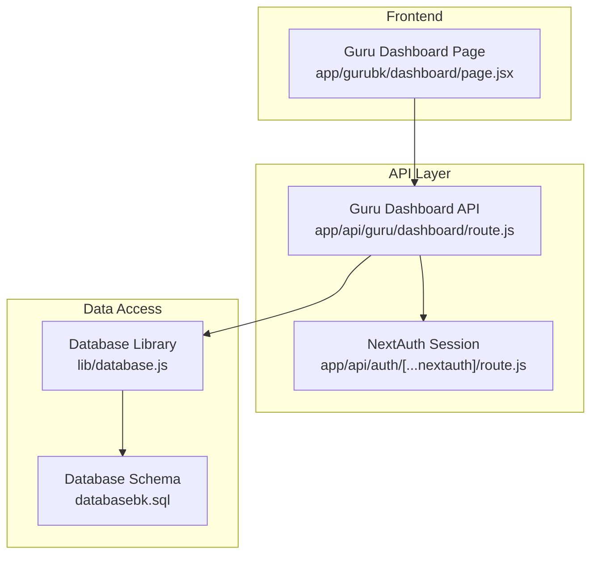
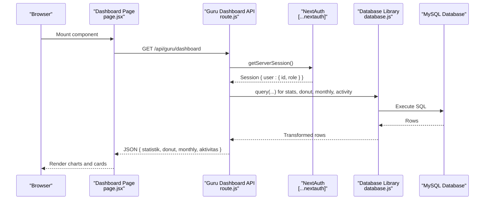
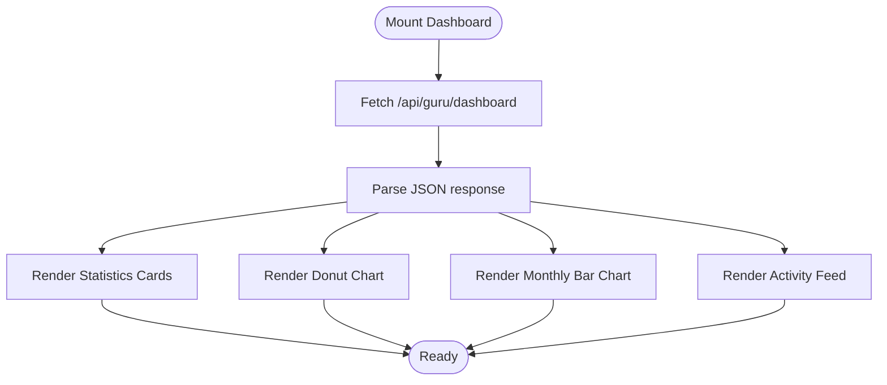
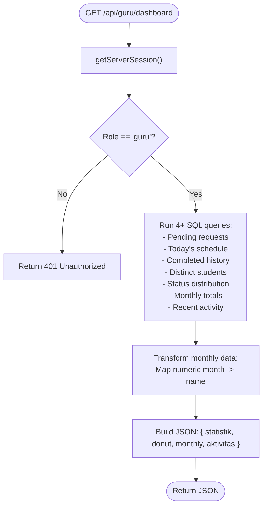
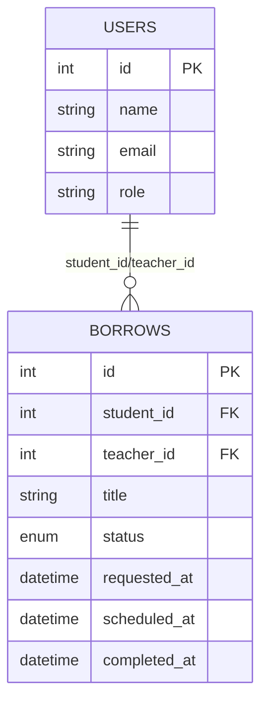
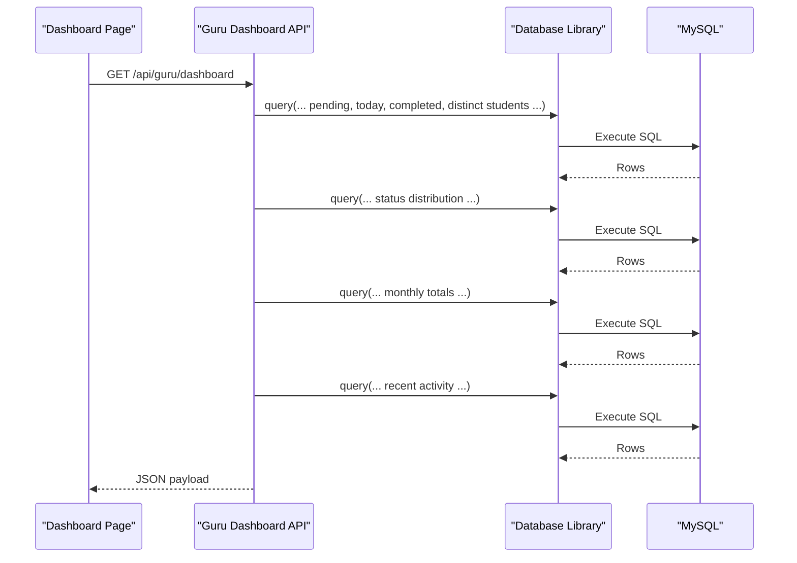
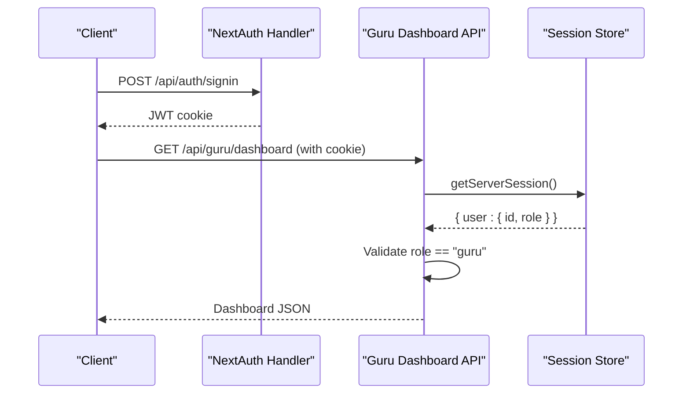
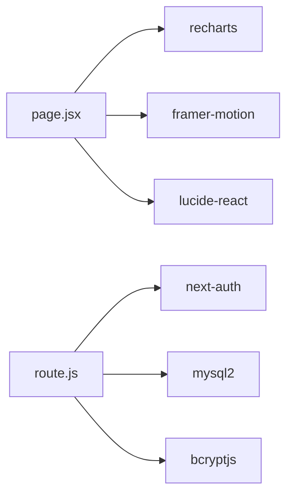

# Dashboard Analytics & Statistics

<cite>
**Referenced Files in This Document**
- [page.jsx](file://app/gurubk/dashboard/page.jsx)
- [route.js](file://app/api/guru/dashboard/route.js)
- [database.js](file://lib/database.js)
- [databasebk.sql](file://databasebk.sql)
- [auth.js](file://lib/auth.js)
- [route.js](file://app/api/auth/[...nextauth]/route.js)
- [package.json](file://package.json)
</cite>

## Table of Contents
1. [Introduction](#introduction)
2. [Project Structure](#project-structure)
3. [Core Components](#core-components)
4. [Architecture Overview](#architecture-overview)
5. [Detailed Component Analysis](#detailed-component-analysis)
6. [Dependency Analysis](#dependency-analysis)
7. [Performance Considerations](#performance-considerations)
8. [Troubleshooting Guide](#troubleshooting-guide)
9. [Conclusion](#conclusion)

## Introduction
This document explains the Guru BK Dashboard analytics and statistics functionality. It covers the dashboard overview with key metrics (pending requests, today's schedule, completed history, and students under guidance), visual analytics (donut charts for counseling status distribution and bar charts for monthly session trends), statistical data fetching and transformation, real-time update behavior, and the recent activity feed. It also provides practical examples of how counselors interpret dashboard metrics for decision-making and workload management.

## Project Structure
The Guru BK Dashboard is implemented as a Next.js client-side page that renders analytics and statistics, backed by a server-side API endpoint. The API endpoint authenticates the counselor session, queries the database for relevant metrics, transforms the data, and returns structured JSON consumed by the frontend.

**Diagram sources**
- [page.jsx:1-158](file://app/gurubk/dashboard/page.jsx#L1-L158)
- [route.js:1-139](file://app/api/guru/dashboard/route.js#L1-L139)
- [route.js:1-102](file://app/api/auth/[...nextauth]/route.js#L1-L102)
- [database.js:1-23](file://lib/database.js#L1-L23)
- [databasebk.sql:70-92](file://databasebk.sql#L70-L92)

**Section sources**
- [page.jsx:1-158](file://app/gurubk/dashboard/page.jsx#L1-L158)
- [route.js:1-139](file://app/api/guru/dashboard/route.js#L1-L139)
- [database.js:1-23](file://lib/database.js#L1-L23)
- [databasebk.sql:70-92](file://databasebk.sql#L70-L92)

## Core Components
- Dashboard Page (client): Renders statistics cards, two charts (donut and bar), and recent activity feed. Fetches data via a single API call on mount.
- Guru Dashboard API: Authenticates the counselor, computes counts and distributions, transforms monthly data, and returns structured JSON.
- Database Library: Provides a promise-based MySQL client and a wrapper for executing queries.
- Database Schema: Defines the borrows table (counseling requests/sessions) and related joins for activity feed.

Key metrics exposed by the dashboard:
- Pending requests
- Today's schedule
- Completed history
- Students under guidance

Visualizations:
- Donut chart: Counseling status distribution (pending, approved, completed)
- Bar chart: Monthly session totals

Activity feed:
- Recent student interactions with completion timestamps

**Section sources**
- [page.jsx:20-124](file://app/gurubk/dashboard/page.jsx#L20-L124)
- [route.js:17-132](file://app/api/guru/dashboard/route.js#L17-L132)
- [database.js:13-21](file://lib/database.js#L13-L21)
- [databasebk.sql:70-92](file://databasebk.sql#L70-L92)

## Architecture Overview
The dashboard follows a client-rendered UI pattern with server-side data fetching. Authentication is handled by NextAuth, ensuring only authorized counselors can access their analytics.

**Diagram sources**
- [page.jsx:23-28](file://app/gurubk/dashboard/page.jsx#L23-L28)
- [route.js:7-132](file://app/api/guru/dashboard/route.js#L7-L132)
- [route.js:1-102](file://app/api/auth/[...nextauth]/route.js#L1-L102)
- [database.js:13-21](file://lib/database.js#L13-L21)

## Detailed Component Analysis

### Dashboard Page (Client-Side Rendering)
Responsibilities:
- Fetch dashboard data on mount
- Render four statistics cards
- Render a donut chart for counseling status distribution
- Render a monthly bar chart
- Render recent activity feed with completion timestamps

Data consumption:
- Uses a single JSON payload containing:
  - statistik: pending requests, today’s schedule, completed history, students under guidance
  - donut: counts for pending/approved/completed
  - monthly: array of { month, total }
  - aktivitas: recent records with student name, title, and completion date

Real-time behavior:
- No polling or live updates; data is fetched once on mount.

**Diagram sources**
- [page.jsx:20-124](file://app/gurubk/dashboard/page.jsx#L20-L124)

**Section sources**
- [page.jsx:20-124](file://app/gurubk/dashboard/page.jsx#L20-L124)

### Guru Dashboard API Endpoint
Responsibilities:
- Authenticate counselor session
- Compute four statistics:
  - Pending requests
  - Today’s schedule
  - Completed history
  - Students under guidance (distinct student count)
- Build counseling status distribution (donut)
- Aggregate monthly sessions and convert numeric months to short names
- Retrieve recent activity records with student names and completion timestamps
- Return unified JSON response

Security:
- Enforces role-based access: only users with role "guru" are permitted.

Data transformations:
- Converts numeric month integers to abbreviated month names for chart readability.

**Diagram sources**
- [route.js:7-132](file://app/api/guru/dashboard/route.js#L7-L132)

**Section sources**
- [route.js:7-132](file://app/api/guru/dashboard/route.js#L7-L132)

### Database Schema and Relationships
The borrows table stores counseling requests/sessions with status and scheduling fields. The activity feed joins with users to present student names.

Key table and fields:
- borrows: id, student_id, teacher_id, title, status, requested_at, scheduled_at, completed_at
- users: id, name (joined for activity feed)

Indexes relevant to performance:
- Indexes on student_id, teacher_id, status, and timestamps improve query performance for filtering and aggregation.

**Diagram sources**
- [databasebk.sql:70-92](file://databasebk.sql#L70-L92)
- [databasebk.sql:228-241](file://databasebk.sql#L228-L241)

**Section sources**
- [databasebk.sql:70-92](file://databasebk.sql#L70-L92)
- [databasebk.sql:228-241](file://databasebk.sql#L228-L241)

### Data Fetching, Transformation, and Visualization
- Frontend fetch: Single GET request to the dashboard API endpoint.
- Backend transformation:
  - Aggregations for counts and distributions
  - Month name mapping for bar chart readability
  - Join for activity feed student names
- Visualization:
  - Donut chart: recharts PieChart with three segments
  - Bar chart: recharts BarChart with responsive container
  - Activity feed: list with completion dates

**Diagram sources**
- [page.jsx:23-28](file://app/gurubk/dashboard/page.jsx#L23-L28)
- [route.js:21-115](file://app/api/guru/dashboard/route.js#L21-L115)
- [database.js:13-21](file://lib/database.js#L13-L21)

**Section sources**
- [page.jsx:23-28](file://app/gurubk/dashboard/page.jsx#L23-L28)
- [route.js:21-115](file://app/api/guru/dashboard/route.js#L21-L115)
- [database.js:13-21](file://lib/database.js#L13-L21)

### Authentication and Authorization
- NextAuth handles credential-based login and session management.
- The dashboard API checks the session role and restricts access to counselors only.
- JWT strategy is used for session storage.

**Diagram sources**
- [route.js:16-49](file://app/api/auth/[...nextauth]/route.js#L16-L49)
- [route.js:9-13](file://app/api/guru/dashboard/route.js#L9-L13)
- [auth.js:55-71](file://lib/auth.js#L55-L71)

**Section sources**
- [route.js:16-49](file://app/api/auth/[...nextauth]/route.js#L16-L49)
- [route.js:9-13](file://app/api/guru/dashboard/route.js#L9-L13)
- [auth.js:55-71](file://lib/auth.js#L55-L71)

## Dependency Analysis
External libraries and their roles:
- recharts: Chart rendering (PieChart, BarChart)
- framer-motion: Smooth animations for cards and activity entries
- lucide-react: Icons for statistics cards
- next-auth: Authentication and session management
- mysql2: MySQL client for database connectivity
- bcryptjs: Password hashing verification

**Diagram sources**
- [page.jsx:6-18](file://app/gurubk/dashboard/page.jsx#L6-L18)
- [route.js:1-3](file://app/api/guru/dashboard/route.js#L1-L3)
- [package.json:11-33](file://package.json#L11-L33)

**Section sources**
- [package.json:11-33](file://package.json#L11-L33)

## Performance Considerations
- Database queries are executed synchronously within the API handler. Consider batching or caching frequently accessed aggregates if traffic increases.
- The monthly chart uses a simple GROUP BY on month; ensure appropriate indexes exist on teacher_id and scheduled_at for optimal performance.
- The frontend performs a single fetch on mount; no polling is implemented, reducing network overhead.
- Chart rendering uses responsive containers; keep datasets small to maintain smooth interactions.

## Troubleshooting Guide
Common issues and resolutions:
- Unauthorized access: Ensure the counselor is logged in and has role "guru". The API returns a 401 error otherwise.
- Empty or missing data: Verify database connectivity and that the counselor ID matches borrows records.
- Chart shows unexpected month labels: Confirm month number mapping aligns with database month values.
- Activity feed empty: Check that recent records exist and that the join with users resolves student names.

**Section sources**
- [route.js:11-13](file://app/api/guru/dashboard/route.js#L11-L13)
- [route.js:134-137](file://app/api/guru/dashboard/route.js#L134-L137)

## Conclusion
The Guru BK Dashboard provides a concise, role-authorized analytics overview for counselors. It combines straightforward statistics with intuitive visualizations and a recent activity feed. The current implementation focuses on reliability and simplicity, with room to enhance performance and interactivity as needs evolve.