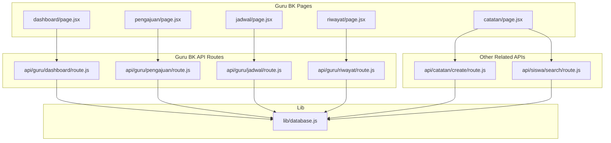
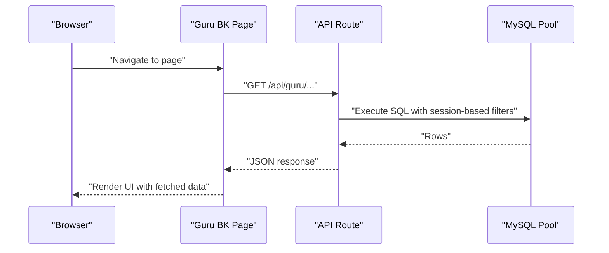
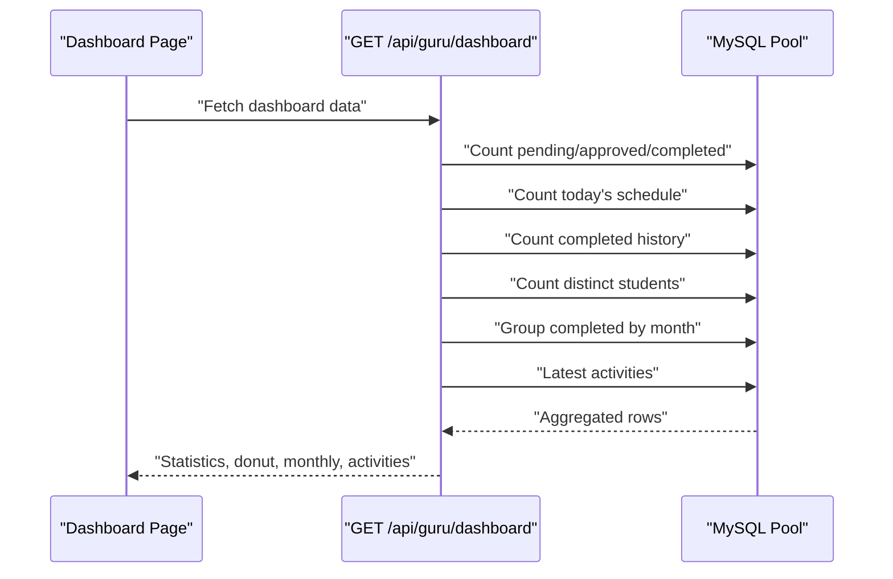
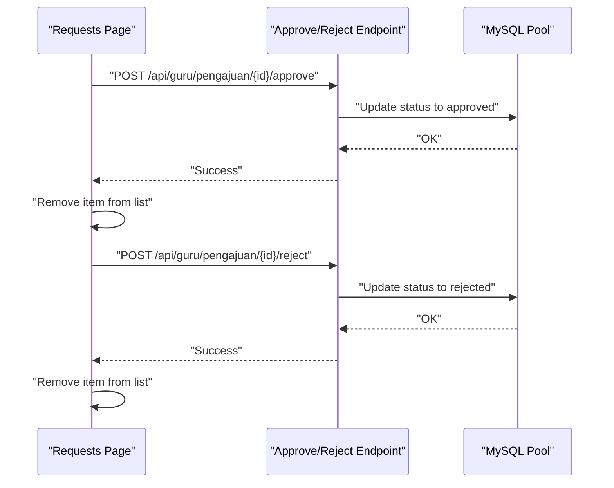
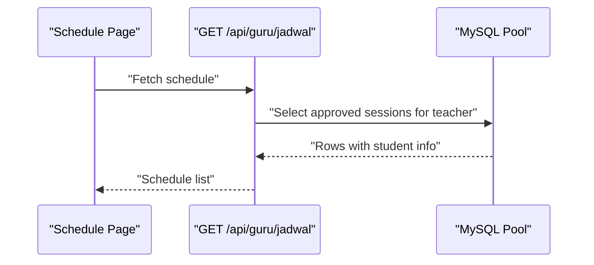
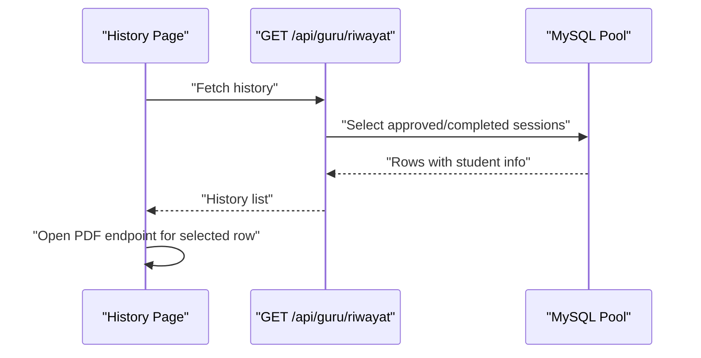
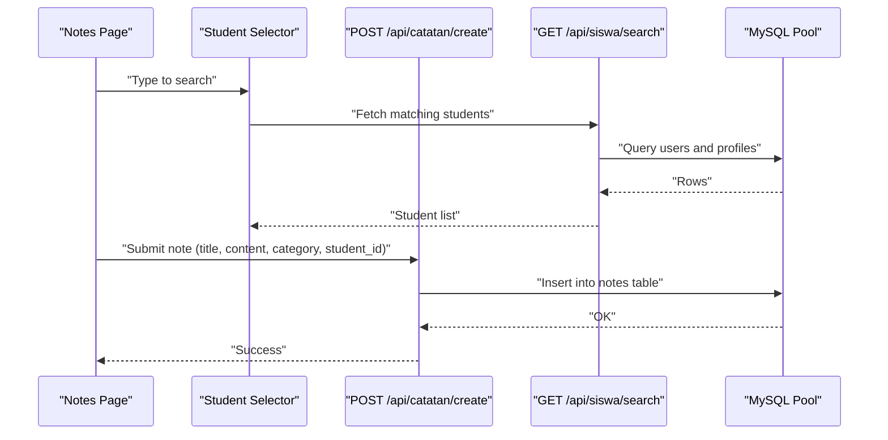
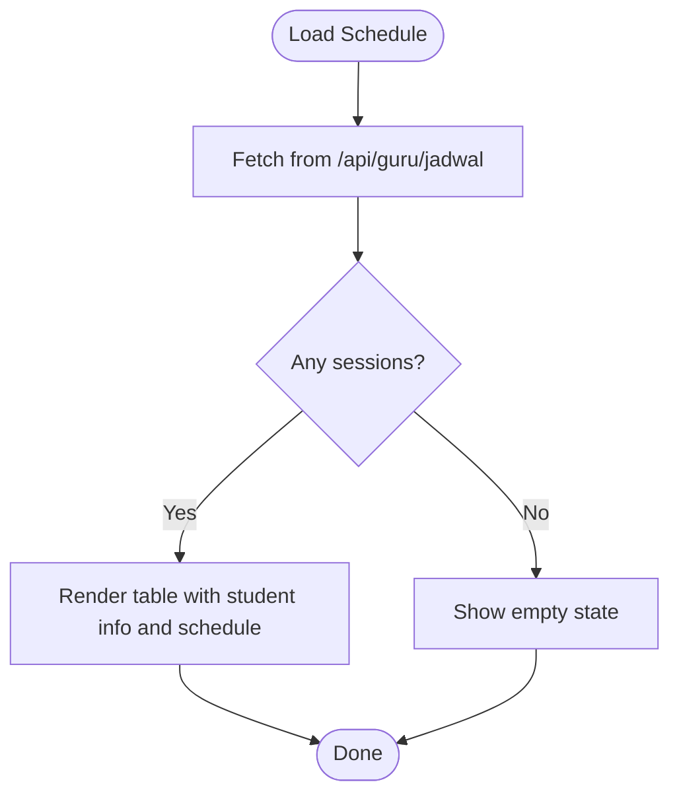
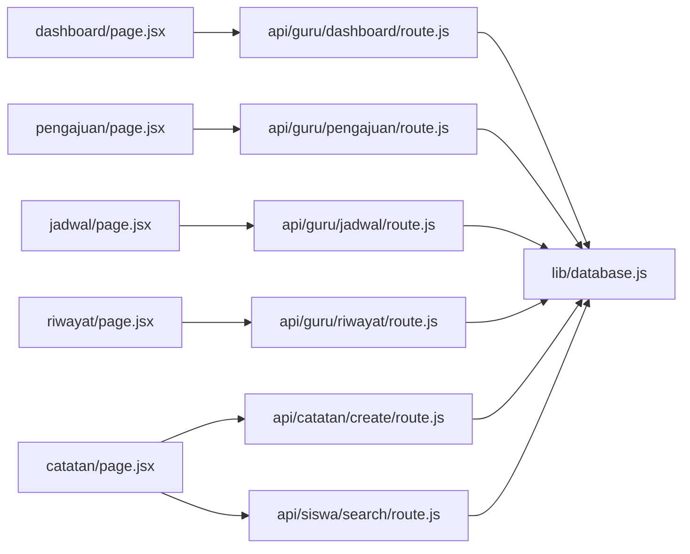

# Guru BK Dashboard

<cite>
**Referenced Files in This Document**
- [app/gurubk/dashboard/page.jsx](file://app/gurubk/dashboard/page.jsx)
- [app/gurubk/pengajuan/page.jsx](file://app/gurubk/pengajuan/page.jsx)
- [app/gurubk/jadwal/page.jsx](file://app/gurubk/jadwal/page.jsx)
- [app/gurubk/riwayat/page.jsx](file://app/gurubk/riwayat/page.jsx)
- [app/gurubk/catatan/page.jsx](file://app/gurubk/catatan/page.jsx)
- [app/gurubk/catatan/components/SiswaSelector.jsx](file://app/gurubk/catatan/components/SiswaSelector.jsx)
- [app/api/guru/dashboard/route.js](file://app/api/guru/dashboard/route.js)
- [app/api/guru/pengajuan/route.js](file://app/api/guru/pengajuan/route.js)
- [app/api/guru/jadwal/route.js](file://app/api/guru/jadwal/route.js)
- [app/api/guru/riwayat/route.js](file://app/api/guru/riwayat/route.js)
- [app/api/catatan/create/route.js](file://app/api/catatan/create/route.js)
- [app/api/siswa/search/route.js](file://app/api/siswa/search/route.js)
- [lib/database.js](file://lib/database.js)
</cite>

## Table of Contents
1. [Introduction](#introduction)
2. [Project Structure](#project-structure)
3. [Core Components](#core-components)
4. [Architecture Overview](#architecture-overview)
5. [Detailed Component Analysis](#detailed-component-analysis)
6. [Dependency Analysis](#dependency-analysis)
7. [Performance Considerations](#performance-considerations)
8. [Troubleshooting Guide](#troubleshooting-guide)
9. [Conclusion](#conclusion)

## Introduction
This document describes the Guru BK (School Counselor) Dashboard functionality. It covers the counselor interface for managing student appointments, reviewing requests, maintaining session schedules, and viewing analytics. It also documents the note-taking system for documenting counseling sessions, the history tracking system for completed sessions, and the weekly schedule overview. Examples of counselor workflows, decision-making processes, and communication with students are included, along with time management features, conflict resolution, and session rescheduling capabilities.

## Project Structure
The Guru BK module is organized into pages under the `/app/gurubk` directory, each backed by dedicated API routes under `/app/api/guru`. The note-taking feature spans a page and a reusable selector component, with its own API endpoint. Shared database utilities are centralized in the `lib` folder.

**Diagram sources**
- [app/gurubk/dashboard/page.jsx:1-158](file://app/gurubk/dashboard/page.jsx#L1-L158)
- [app/gurubk/pengajuan/page.jsx:1-104](file://app/gurubk/pengajuan/page.jsx#L1-L104)
- [app/gurubk/jadwal/page.jsx:1-94](file://app/gurubk/jadwal/page.jsx#L1-L94)
- [app/gurubk/riwayat/page.jsx:1-105](file://app/gurubk/riwayat/page.jsx#L1-L105)
- [app/gurubk/catatan/page.jsx:1-128](file://app/gurubk/catatan/page.jsx#L1-L128)
- [app/api/guru/dashboard/route.js:1-139](file://app/api/guru/dashboard/route.js#L1-L139)
- [app/api/guru/pengajuan/route.js:1-49](file://app/api/guru/pengajuan/route.js#L1-L49)
- [app/api/guru/jadwal/route.js:1-48](file://app/api/guru/jadwal/route.js#L1-L48)
- [app/api/guru/riwayat/route.js:1-50](file://app/api/guru/riwayat/route.js#L1-L50)
- [app/api/catatan/create/route.js:1-24](file://app/api/catatan/create/route.js#L1-L24)
- [app/api/siswa/search/route.js:1-20](file://app/api/siswa/search/route.js#L1-L20)
- [lib/database.js:1-23](file://lib/database.js#L1-L23)

**Section sources**
- [app/gurubk/dashboard/page.jsx:1-158](file://app/gurubk/dashboard/page.jsx#L1-L158)
- [app/gurubk/pengajuan/page.jsx:1-104](file://app/gurubk/pengajuan/page.jsx#L1-L104)
- [app/gurubk/jadwal/page.jsx:1-94](file://app/gurubk/jadwal/page.jsx#L1-L94)
- [app/gurubk/riwayat/page.jsx:1-105](file://app/gurubk/riwayat/page.jsx#L1-L105)
- [app/gurubk/catatan/page.jsx:1-128](file://app/gurubk/catatan/page.jsx#L1-L128)
- [app/api/guru/dashboard/route.js:1-139](file://app/api/guru/dashboard/route.js#L1-L139)
- [app/api/guru/pengajuan/route.js:1-49](file://app/api/guru/pengajuan/route.js#L1-L49)
- [app/api/guru/jadwal/route.js:1-48](file://app/api/guru/jadwal/route.js#L1-L48)
- [app/api/guru/riwayat/route.js:1-50](file://app/api/guru/riwayat/route.js#L1-L50)
- [app/api/catatan/create/route.js:1-24](file://app/api/catatan/create/route.js#L1-L24)
- [app/api/siswa/search/route.js:1-20](file://app/api/siswa/search/route.js#L1-L20)
- [lib/database.js:1-23](file://lib/database.js#L1-L23)

## Core Components
- Dashboard: Presents counselor summary cards, status distribution pie chart, monthly trend bar chart, and recent activity feed. Fetches analytics via a dedicated API route.
- Pending Requests: Lists incoming requests requiring approval, with actions to approve or reject each request.
- Schedule: Displays the counselor’s weekly schedule with student details, title, date, and time.
- History: Shows completed and approved sessions with summary and PDF export capability.
- Notes: Allows creation of student notes with category selection and student search.

**Section sources**
- [app/gurubk/dashboard/page.jsx:20-124](file://app/gurubk/dashboard/page.jsx#L20-L124)
- [app/gurubk/pengajuan/page.jsx:8-103](file://app/gurubk/pengajuan/page.jsx#L8-L103)
- [app/gurubk/jadwal/page.jsx:8-93](file://app/gurubk/jadwal/page.jsx#L8-L93)
- [app/gurubk/riwayat/page.jsx:8-104](file://app/gurubk/riwayat/page.jsx#L8-L104)
- [app/gurubk/catatan/page.jsx:9-127](file://app/gurubk/catatan/page.jsx#L9-L127)

## Architecture Overview
The Guru BK frontend pages communicate with backend API routes using fetch. The API routes validate the session role, query the database via a shared MySQL pool, and return structured JSON responses. The note-taking flow integrates a student search API to populate the selector.

**Diagram sources**
- [app/gurubk/dashboard/page.jsx:23-28](file://app/gurubk/dashboard/page.jsx#L23-L28)
- [app/api/guru/dashboard/route.js:7-138](file://app/api/guru/dashboard/route.js#L7-L138)
- [lib/database.js:13-21](file://lib/database.js#L13-L21)

## Detailed Component Analysis

### Dashboard Analytics
The dashboard aggregates counselor statistics, visualizes status distribution, shows monthly trends, and lists recent activities. It fetches data from a single API route that computes counts and charts server-side.

**Diagram sources**
- [app/gurubk/dashboard/page.jsx:23-28](file://app/gurubk/dashboard/page.jsx#L23-L28)
- [app/api/guru/dashboard/route.js:21-115](file://app/api/guru/dashboard/route.js#L21-L115)

**Section sources**
- [app/gurubk/dashboard/page.jsx:20-124](file://app/gurubk/dashboard/page.jsx#L20-L124)
- [app/api/guru/dashboard/route.js:7-138](file://app/api/guru/dashboard/route.js#L7-L138)

### Appointment Approval Workflow
The pending requests page displays incoming requests and allows the counselor to approve or reject them. Approve/reject actions trigger POST endpoints that update the request state and remove it from the list client-side.

**Diagram sources**
- [app/gurubk/pengajuan/page.jsx:17-25](file://app/gurubk/pengajuan/page.jsx#L17-L25)
- [app/api/guru/pengajuan/route.js:1-49](file://app/api/guru/pengajuan/route.js#L1-L49)

**Section sources**
- [app/gurubk/pengajuan/page.jsx:8-103](file://app/gurubk/pengajuan/page.jsx#L8-L103)

### Schedule Management
The schedule page fetches and displays the counselor’s approved sessions with student details, title, date, and time. The API filters by teacher ID, status, and non-null scheduled datetime.

**Diagram sources**
- [app/gurubk/jadwal/page.jsx:12-20](file://app/gurubk/jadwal/page.jsx#L12-L20)
- [app/api/guru/jadwal/route.js:17-37](file://app/api/guru/jadwal/route.js#L17-L37)

**Section sources**
- [app/gurubk/jadwal/page.jsx:8-93](file://app/gurubk/jadwal/page.jsx#L8-L93)
- [app/api/guru/jadwal/route.js:7-47](file://app/api/guru/jadwal/route.js#L7-L47)

### Student Session Tracking and History
The history page lists completed and approved sessions, shows completion timestamps, and supports exporting a PDF via a dedicated endpoint. The API returns filtered rows ordered by creation time.

**Diagram sources**
- [app/gurubk/riwayat/page.jsx:12-20](file://app/gurubk/riwayat/page.jsx#L12-L20)
- [app/api/guru/riwayat/route.js:21-38](file://app/api/guru/riwayat/route.js#L21-L38)

**Section sources**
- [app/gurubk/riwayat/page.jsx:8-104](file://app/gurubk/riwayat/page.jsx#L8-L104)
- [app/api/guru/riwayat/route.js:7-49](file://app/api/guru/riwayat/route.js#L7-L49)

### Note-Taking System
The notes page enables counselors to create notes for students. It includes:
- A student selector that queries students by name or NIS.
- A form to capture title, content, and category.
- Submission to a dedicated API endpoint that persists the note.

**Diagram sources**
- [app/gurubk/catatan/page.jsx:15-43](file://app/gurubk/catatan/page.jsx#L15-L43)
- [app/gurubk/catatan/components/SiswaSelector.jsx:8-42](file://app/gurubk/catatan/components/SiswaSelector.jsx#L8-L42)
- [app/api/catatan/create/route.js:4-23](file://app/api/catatan/create/route.js#L4-L23)
- [app/api/siswa/search/route.js:4-18](file://app/api/siswa/search/route.js#L4-L18)

**Section sources**
- [app/gurubk/catatan/page.jsx:9-127](file://app/gurubk/catatan/page.jsx#L9-L127)
- [app/gurubk/catatan/components/SiswaSelector.jsx:4-77](file://app/gurubk/catatan/components/SiswaSelector.jsx#L4-L77)
- [app/api/catatan/create/route.js:4-23](file://app/api/catatan/create/route.js#L4-L23)
- [app/api/siswa/search/route.js:4-18](file://app/api/siswa/search/route.js#L4-L18)

### Weekly Schedule Overview
The schedule page presents a tabular overview of upcoming sessions, including student contact, title, date, and time. It is populated by the schedule API route.

**Diagram sources**
- [app/gurubk/jadwal/page.jsx:12-20](file://app/gurubk/jadwal/page.jsx#L12-L20)
- [app/api/guru/jadwal/route.js:17-37](file://app/api/guru/jadwal/route.js#L17-L37)

**Section sources**
- [app/gurubk/jadwal/page.jsx:8-93](file://app/gurubk/jadwal/page.jsx#L8-L93)

### Conflict Resolution and Rescheduling
While the current schedule API focuses on approved sessions, rescheduling can be integrated by:
- Extending the schedule API to include pending sessions and preferred dates.
- Adding endpoints to update scheduled datetime and notify students.
- Implementing conflict checks against existing approved slots.

[No sources needed since this section provides general guidance]

### Communication with Students
- Pending requests page allows counselors to approve or reject requests, removing them from the list after action.
- Notes system enables persistent documentation categorized by personal, behavioral, attendance, academic, or other categories.
- History page provides a searchable archive of completed sessions with printable summaries.

**Section sources**
- [app/gurubk/pengajuan/page.jsx:17-25](file://app/gurubk/pengajuan/page.jsx#L17-L25)
- [app/gurubk/catatan/page.jsx:101-114](file://app/gurubk/catatan/page.jsx#L101-L114)
- [app/gurubk/riwayat/page.jsx:84-94](file://app/gurubk/riwayat/page.jsx#L84-L94)

## Dependency Analysis
The frontend pages depend on their respective API routes, which in turn depend on the shared database utility for executing SQL queries. The notes flow additionally depends on the student search API.

**Diagram sources**
- [app/gurubk/dashboard/page.jsx:23-28](file://app/gurubk/dashboard/page.jsx#L23-L28)
- [app/gurubk/pengajuan/page.jsx:11-15](file://app/gurubk/pengajuan/page.jsx#L11-L15)
- [app/gurubk/jadwal/page.jsx:12-19](file://app/gurubk/jadwal/page.jsx#L12-L19)
- [app/gurubk/riwayat/page.jsx:12-19](file://app/gurubk/riwayat/page.jsx#L12-L19)
- [app/gurubk/catatan/page.jsx:23-33](file://app/gurubk/catatan/page.jsx#L23-L33)
- [app/api/guru/dashboard/route.js:3-26](file://app/api/guru/dashboard/route.js#L3-L26)
- [app/api/guru/pengajuan/route.js:3-34](file://app/api/guru/pengajuan/route.js#L3-L34)
- [app/api/guru/jadwal/route.js:3-37](file://app/api/guru/jadwal/route.js#L3-L37)
- [app/api/guru/riwayat/route.js:3-38](file://app/api/guru/riwayat/route.js#L3-L38)
- [app/api/catatan/create/route.js:2-13](file://app/api/catatan/create/route.js#L2-L13)
- [app/api/siswa/search/route.js:2-16](file://app/api/siswa/search/route.js#L2-L16)
- [lib/database.js:3-21](file://lib/database.js#L3-L21)

**Section sources**
- [lib/database.js:1-23](file://lib/database.js#L1-L23)

## Performance Considerations
- Freshness: API routes are configured to bypass caching to ensure fresh data for counselors.
- Pagination: Consider adding pagination for long histories and large request lists.
- Rendering: Use virtualized lists for large datasets to improve UI responsiveness.
- Network: Debounce search input in the student selector to reduce unnecessary API calls.

**Section sources**
- [app/api/guru/dashboard/route.js:5-5](file://app/api/guru/dashboard/route.js#L5-L5)
- [app/gurubk/catatan/components/SiswaSelector.jsx:8-14](file://app/gurubk/catatan/components/SiswaSelector.jsx#L8-L14)

## Troubleshooting Guide
- Unauthorized Access: API routes check the session role and return 401 if not authorized.
- Database Errors: Queries are wrapped with error logging; verify credentials and connection settings.
- Network Failures: Student search handles network errors gracefully by clearing results.
- UI Loading States: Pages show loading indicators until data is fetched.

**Section sources**
- [app/api/guru/dashboard/route.js:11-13](file://app/api/guru/dashboard/route.js#L11-L13)
- [lib/database.js:17-21](file://lib/database.js#L17-L21)
- [app/gurubk/catatan/components/SiswaSelector.jsx:16-42](file://app/gurubk/catatan/components/SiswaSelector.jsx#L16-L42)

## Conclusion
The Guru BK Dashboard provides a comprehensive interface for counselors to manage student appointments, review requests, maintain schedules, track sessions, and document progress. The modular frontend pages, backed by robust API routes and a shared database utility, enable efficient day-to-day operations with clear analytics and reporting capabilities.