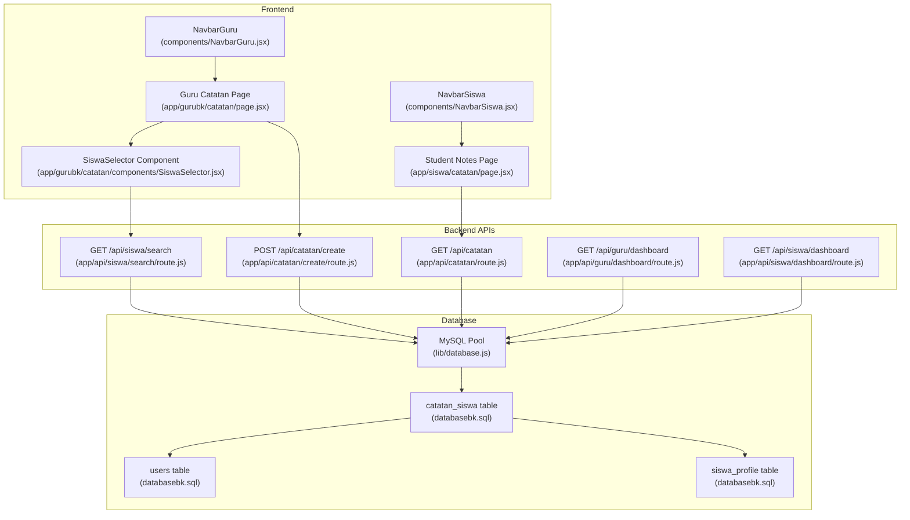
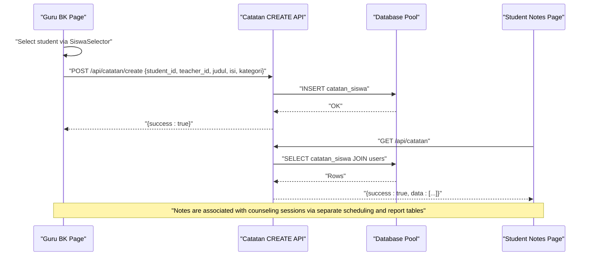
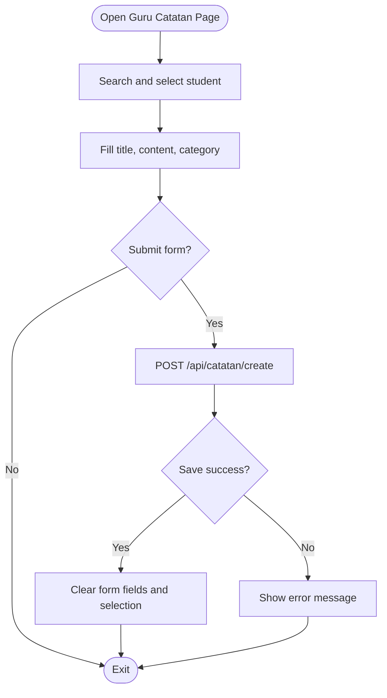
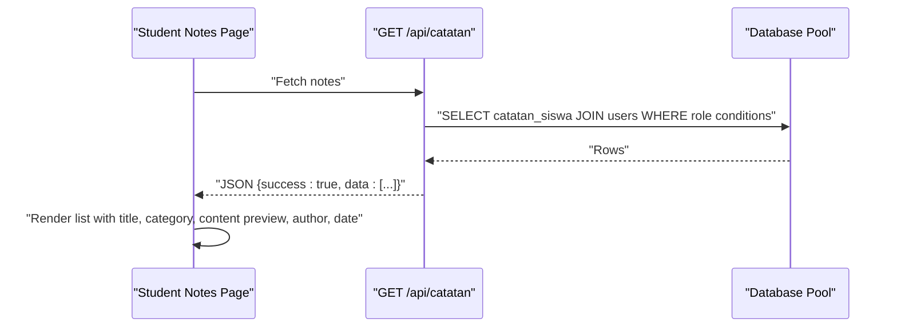
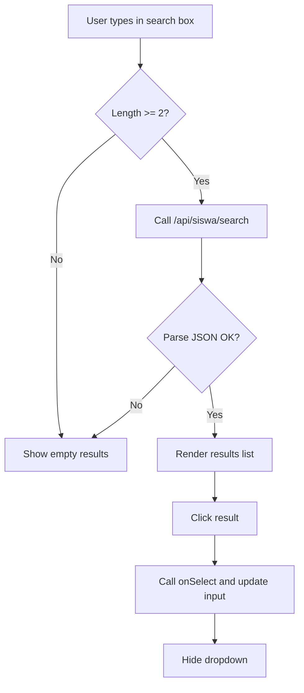
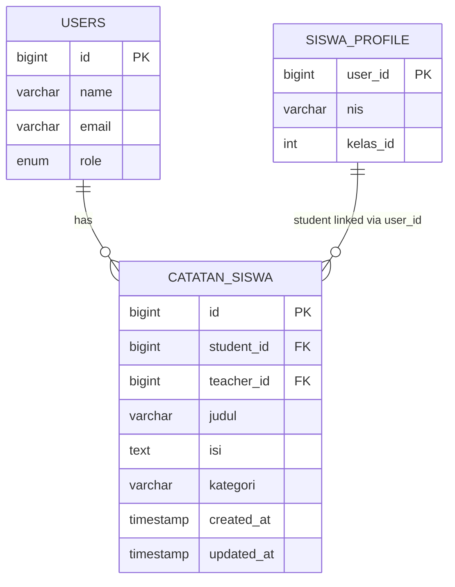
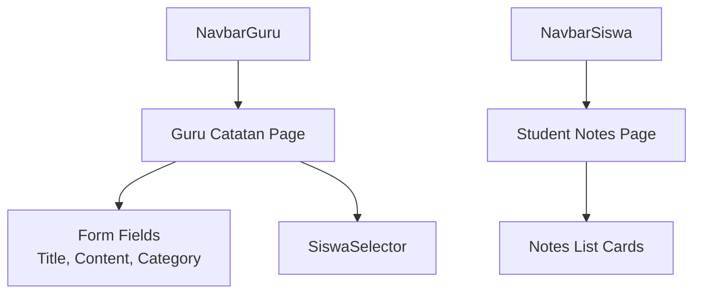
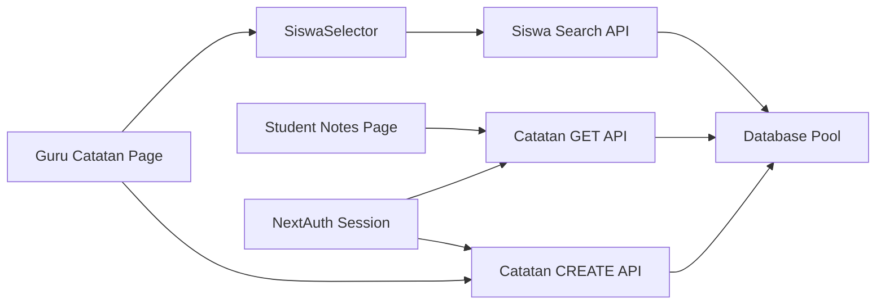

# Note Taking & Documentation System

<cite>
**Referenced Files in This Document**
- [CatatanBKPage](file://app/gurubk/catatan/page.jsx)
- [SiswaSelector](file://app/gurubk/catatan/components/SiswaSelector.jsx)
- [Catatan API GET](file://app/api/catatan/route.js)
- [Catatan API CREATE](file://app/api/catatan/create/route.js)
- [Siswa Search API](file://app/api/siswa/search/route.js)
- [Database Schema](file://databasebk.sql)
- [Auth Config](file://app/api/auth/[...nextauth]/route.js)
- [Student Notes Page](file://app/siswa/catatan/page.jsx)
- [Database Utility](file://lib/database.js)
- [Guru Dashboard](file://app/gurubk/dashboard/page.jsx)
- [Student Dashboard](file://app/siswa/dashboard/page.jsx)
- [Guru Dashboard API](file://app/api/guru/dashboard/route.js)
- [Student Dashboard API](file://app/api/siswa/dashboard/route.js)
- [NavbarGuru](file://components/NavbarGuru.jsx)
- [NavbarSiswa](file://components/NavbarSiswa.jsx)
</cite>

## Table of Contents
1. [Introduction](#introduction)
2. [Project Structure](#project-structure)
3. [Core Components](#core-components)
4. [Architecture Overview](#architecture-overview)
5. [Detailed Component Analysis](#detailed-component-analysis)
6. [Dependency Analysis](#dependency-analysis)
7. [Performance Considerations](#performance-considerations)
8. [Troubleshooting Guide](#troubleshooting-guide)
9. [Conclusion](#conclusion)
10. [Appendices](#appendices)

## Introduction
This document describes the Guru BK note-taking and documentation system within the educational records platform. It explains how counselors create, edit, and organize student progress notes and session documentation, how templates and formatting are applied, how the system integrates with the student tracking system, and how notes are categorized, tagged, and searched. It also outlines UI components used for note entry, the user experience design, and documentation standards aligned with educational record compliance.

## Project Structure
The note-taking system spans frontend pages, shared UI components, and backend APIs backed by a relational database. Key areas include:
- Guru BK note creation page and selector component
- Student notes viewing page
- Backend APIs for creating and retrieving notes
- Authentication and session management
- Database schema for storing notes and related entities

**Diagram sources**
- [CatatanBKPage:1-128](file://app/gurubk/catatan/page.jsx#L1-L128)
- [SiswaSelector:1-78](file://app/gurubk/catatan/components/SiswaSelector.jsx#L1-L78)
- [Catatan API GET:1-49](file://app/api/catatan/route.js#L1-L49)
- [Catatan API CREATE:1-24](file://app/api/catatan/create/route.js#L1-L24)
- [Siswa Search API:1-20](file://app/api/siswa/search/route.js#L1-L20)
- [Database Utility:1-23](file://lib/database.js#L1-L23)
- [Database Schema:126-140](file://databasebk.sql#L126-L140)
- [Student Notes Page:1-41](file://app/siswa/catatan/page.jsx#L1-L41)
- [Guru Dashboard:1-158](file://app/gurubk/dashboard/page.jsx#L1-L158)
- [Student Dashboard:1-209](file://app/siswa/dashboard/page.jsx#L1-L209)
- [Guru Dashboard API:1-139](file://app/api/guru/dashboard/route.js#L1-L139)
- [Student Dashboard API:1-71](file://app/api/siswa/dashboard/route.js#L1-L71)
- [NavbarGuru:1-210](file://components/NavbarGuru.jsx#L1-L210)
- [NavbarSiswa:1-191](file://components/NavbarSiswa.jsx#L1-L191)

**Section sources**
- [CatatanBKPage:1-128](file://app/gurubk/catatan/page.jsx#L1-L128)
- [SiswaSelector:1-78](file://app/gurubk/catatan/components/SiswaSelector.jsx#L1-L78)
- [Catatan API GET:1-49](file://app/api/catatan/route.js#L1-L49)
- [Catatan API CREATE:1-24](file://app/api/catatan/create/route.js#L1-L24)
- [Siswa Search API:1-20](file://app/api/siswa/search/route.js#L1-L20)
- [Database Utility:1-23](file://lib/database.js#L1-L23)
- [Database Schema:126-140](file://databasebk.sql#L126-L140)
- [Student Notes Page:1-41](file://app/siswa/catatan/page.jsx#L1-L41)
- [Guru Dashboard:1-158](file://app/gurubk/dashboard/page.jsx#L1-L158)
- [Student Dashboard:1-209](file://app/siswa/dashboard/page.jsx#L1-L209)
- [Guru Dashboard API:1-139](file://app/api/guru/dashboard/route.js#L1-L139)
- [Student Dashboard API:1-71](file://app/api/siswa/dashboard/route.js#L1-L71)
- [NavbarGuru:1-210](file://components/NavbarGuru.jsx#L1-L210)
- [NavbarSiswa:1-191](file://components/NavbarSiswa.jsx#L1-L191)

## Core Components
- Guru BK Note Creation Page: Provides form fields for title, content, category selection, and a student picker. Submits to the create API endpoint.
- SiswaSelector Component: Implements live search for students by name or NIS, returning selectable results.
- Student Notes Page: Displays a list of notes visible to the logged-in student, including title, category, content preview, author, and timestamp.
- Backend APIs:
  - GET /api/catatan: Retrieves notes filtered by role and optionally by student ID.
  - POST /api/catatan/create: Inserts a new note linking a student and teacher.
  - GET /api/siswa/search: Returns matching students for the selector.
- Database: Stores notes in catatan_siswa with foreign keys to users (students and teachers).

**Section sources**
- [CatatanBKPage:9-43](file://app/gurubk/catatan/page.jsx#L9-L43)
- [SiswaSelector:4-42](file://app/gurubk/catatan/components/SiswaSelector.jsx#L4-L42)
- [Student Notes Page:6-36](file://app/siswa/catatan/page.jsx#L6-L36)
- [Catatan API GET:5-48](file://app/api/catatan/route.js#L5-L48)
- [Catatan API CREATE:4-22](file://app/api/catatan/create/route.js#L4-L22)
- [Siswa Search API:4-18](file://app/api/siswa/search/route.js#L4-L18)
- [Database Schema:126-140](file://databasebk.sql#L126-L140)

## Architecture Overview
The note system follows a client-server pattern:
- Client-side React pages manage UI and user interactions.
- Next.js App Router routes handle API requests.
- Database utility executes SQL via a MySQL connection pool.
- Authentication via NextAuth ensures role-based access control.

**Diagram sources**
- [CatatanBKPage:15-43](file://app/gurubk/catatan/page.jsx#L15-L43)
- [Catatan API CREATE:4-22](file://app/api/catatan/create/route.js#L4-L22)
- [Database Utility:13-21](file://lib/database.js#L13-L21)
- [Student Notes Page:9-16](file://app/siswa/catatan/page.jsx#L9-L16)
- [Catatan API GET:5-48](file://app/api/catatan/route.js#L5-L48)
- [Database Schema:126-140](file://databasebk.sql#L126-L140)

## Detailed Component Analysis

### Guru BK Note Creation Workflow
- User selects a student using the SiswaSelector, which queries the student search API.
- The note creation form captures title, content, and category.
- On submission, the page posts to the create API endpoint with teacher and student identifiers.
- On success, the form clears and resets state.

**Diagram sources**
- [CatatanBKPage:15-43](file://app/gurubk/catatan/page.jsx#L15-L43)
- [SiswaSelector:8-42](file://app/gurubk/catatan/components/SiswaSelector.jsx#L8-L42)
- [Catatan API CREATE:4-22](file://app/api/catatan/create/route.js#L4-L22)

**Section sources**
- [CatatanBKPage:9-43](file://app/gurubk/catatan/page.jsx#L9-L43)
- [SiswaSelector:4-42](file://app/gurubk/catatan/components/SiswaSelector.jsx#L4-L42)
- [Catatan API CREATE:4-22](file://app/api/catatan/create/route.js#L4-L22)

### Student Notes Retrieval and Display
- The student notes page fetches notes via the GET /api/catatan endpoint.
- The API applies role-based filtering: students see only their own notes; counselors can filter by student if needed.
- Results include teacher name and timestamps for provenance.

**Diagram sources**
- [Student Notes Page:9-36](file://app/siswa/catatan/page.jsx#L9-L36)
- [Catatan API GET:5-48](file://app/api/catatan/route.js#L5-L48)
- [Database Utility:13-21](file://lib/database.js#L13-L21)

**Section sources**
- [Student Notes Page:6-36](file://app/siswa/catatan/page.jsx#L6-L36)
- [Catatan API GET:5-48](file://app/api/catatan/route.js#L5-L48)

### Student Search Selector
- Implements debounced search when the user types two or more characters.
- Calls the student search API and renders a scrollable dropdown of results.
- On selection, updates the parent form state and clears the dropdown.

**Diagram sources**
- [SiswaSelector:8-42](file://app/gurubk/catatan/components/SiswaSelector.jsx#L8-L42)
- [Siswa Search API:4-18](file://app/api/siswa/search/route.js#L4-L18)

**Section sources**
- [SiswaSelector:4-78](file://app/gurubk/catatan/components/SiswaSelector.jsx#L4-L78)
- [Siswa Search API:1-20](file://app/api/siswa/search/route.js#L1-L20)

### Data Model: Notes and Related Entities
The notes system stores entries in the catatan_siswa table with foreign keys to users for both student and teacher. Additional tables support scheduling and reporting that complement note-taking.

**Diagram sources**
- [Database Schema:126-140](file://databasebk.sql#L126-L140)
- [Database Schema:25-52](file://databasebk.sql#L25-L52)

**Section sources**
- [Database Schema:126-140](file://databasebk.sql#L126-L140)
- [Database Schema:25-52](file://databasebk.sql#L25-L52)

### UI Components and User Experience
- Guru BK Page: Clean form layout with animated transitions, category dropdown, and back navigation.
- Student Notes Page: Card-based list with metadata and responsive design.
- Navigation Bars: Role-specific menus with profile dropdowns and logout actions.

**Diagram sources**
- [CatatanBKPage:45-127](file://app/gurubk/catatan/page.jsx#L45-L127)
- [Student Notes Page:18-38](file://app/siswa/catatan/page.jsx#L18-L38)
- [NavbarGuru:51-151](file://components/NavbarGuru.jsx#L51-L151)
- [NavbarSiswa:46-136](file://components/NavbarSiswa.jsx#L46-L136)

**Section sources**
- [CatatanBKPage:45-127](file://app/gurubk/catatan/page.jsx#L45-L127)
- [Student Notes Page:18-38](file://app/siswa/catatan/page.jsx#L18-L38)
- [NavbarGuru:51-151](file://components/NavbarGuru.jsx#L51-L151)
- [NavbarSiswa:46-136](file://components/NavbarSiswa.jsx#L46-L136)

## Dependency Analysis
- Guru BK Note Creation depends on:
  - SiswaSelector for student lookup
  - Catatan API CREATE for persistence
  - Auth for session and role checks
- Student Notes Page depends on:
  - Catatan API GET for retrieval
  - Auth for role-based filtering
- Database utility abstracts connection pooling and query execution.

**Diagram sources**
- [CatatanBKPage:3-4](file://app/gurubk/catatan/page.jsx#L3-L4)
- [SiswaSelector:1-2](file://app/gurubk/catatan/components/SiswaSelector.jsx#L1-L2)
- [Catatan API CREATE:2-2](file://app/api/catatan/create/route.js#L2-L2)
- [Catatan API GET:1-3](file://app/api/catatan/route.js#L1-L3)
- [Siswa Search API:1-2](file://app/api/siswa/search/route.js#L1-L2)
- [Database Utility:1-11](file://lib/database.js#L1-L11)
- [Auth Config:1-101](file://app/api/auth/[...nextauth]/route.js#L1-L101)

**Section sources**
- [CatatanBKPage:3-4](file://app/gurubk/catatan/page.jsx#L3-L4)
- [SiswaSelector:1-2](file://app/gurubk/catatan/components/SiswaSelector.jsx#L1-L2)
- [Catatan API CREATE:2-2](file://app/api/catatan/create/route.js#L2-L2)
- [Catatan API GET:1-3](file://app/api/catatan/route.js#L1-L3)
- [Siswa Search API:1-2](file://app/api/siswa/search/route.js#L1-L2)
- [Database Utility:1-11](file://lib/database.js#L1-L11)
- [Auth Config:1-101](file://app/api/auth/[...nextauth]/route.js#L1-L101)

## Performance Considerations
- Debounced search in the selector reduces API calls during typing.
- Database indexes exist on note and user tables to improve retrieval performance.
- Connection pooling limits concurrent connections and prevents overload.

Recommendations:
- Add server-side pagination for long note lists.
- Consider caching frequently accessed note summaries.
- Monitor slow queries and add appropriate indexes if needed.

**Section sources**
- [SiswaSelector:8-42](file://app/gurubk/catatan/components/SiswaSelector.jsx#L8-L42)
- [Database Schema:198-211](file://databasebk.sql#L198-L211)
- [Database Utility:3-11](file://lib/database.js#L3-L11)

## Troubleshooting Guide
Common issues and resolutions:
- Unauthorized access: Ensure the user is authenticated and has the correct role. The APIs check session and role before processing requests.
- Empty search results: Verify the search term length and confirm the student exists in the database.
- Submission errors: Confirm required fields are filled and network connectivity is stable.
- Display problems: Refresh the notes page to reload data from the API.

**Section sources**
- [Catatan API GET:7-10](file://app/api/catatan/route.js#L7-L10)
- [Catatan API CREATE:16-22](file://app/api/catatan/create/route.js#L16-L22)
- [SiswaSelector:16-42](file://app/gurubk/catatan/components/SiswaSelector.jsx#L16-L42)
- [Student Notes Page:9-16](file://app/siswa/catatan/page.jsx#L9-L16)

## Conclusion
The Guru BK note-taking system provides a streamlined workflow for counselors to capture student progress notes, integrate with the broader student tracking ecosystem, and maintain clear audit trails through teacher attribution and timestamps. The modular frontend components, robust backend APIs, and role-aware data access ensure usability and compliance. Extending categorization, tagging, and search capabilities would further enhance documentation standards and record management.

## Appendices

### Note Categories and Formatting Options
- Categories supported by the form: personal, behavior, attendance, academics, others.
- Formatting: Plain text content area; no rich text editor is present in the current implementation.

**Section sources**
- [CatatanBKPage:101-114](file://app/gurubk/catatan/page.jsx#L101-L114)

### Integration with Counseling Sessions
- Notes are stored independently in catatan_siswa with student and teacher links.
- Scheduling and reporting are handled by separate tables (jadwal_konseling and laporan_konseling), enabling traceability between sessions and documentation.

**Section sources**
- [Database Schema:92-124](file://databasebk.sql#L92-L124)
- [Database Schema:126-140](file://databasebk.sql#L126-L140)

### Effective Note-Taking Practices and Standards
- Use concise, objective titles and structured content aligned with categories.
- Record observations consistently and include actionable insights.
- Maintain confidentiality and avoid sensitive identifiers in public contexts.
- Keep notes current and link to relevant session dates where applicable.

[No sources needed since this section provides general guidance]