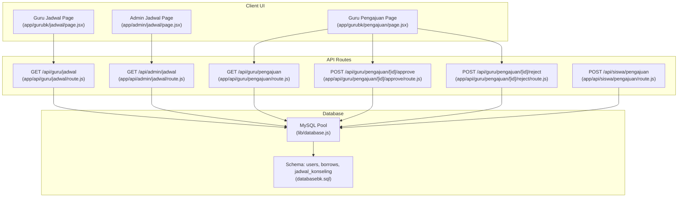
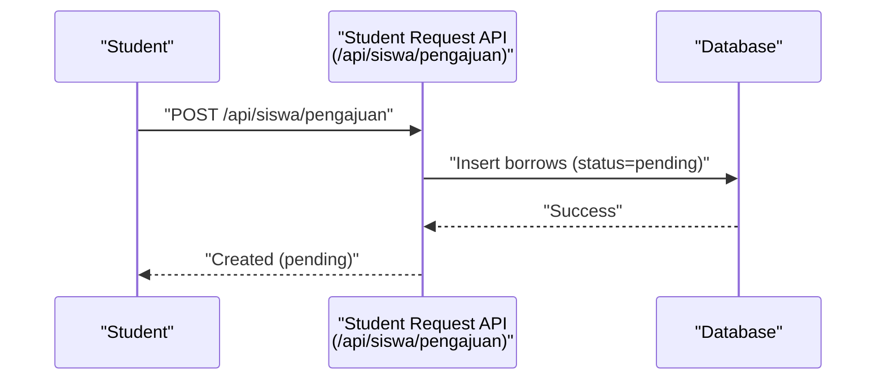
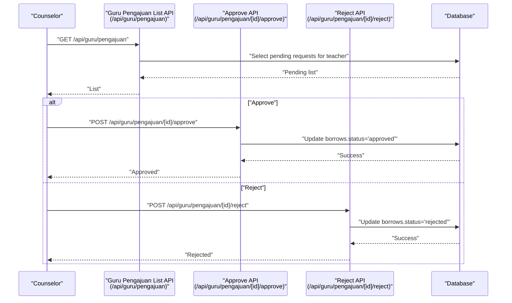
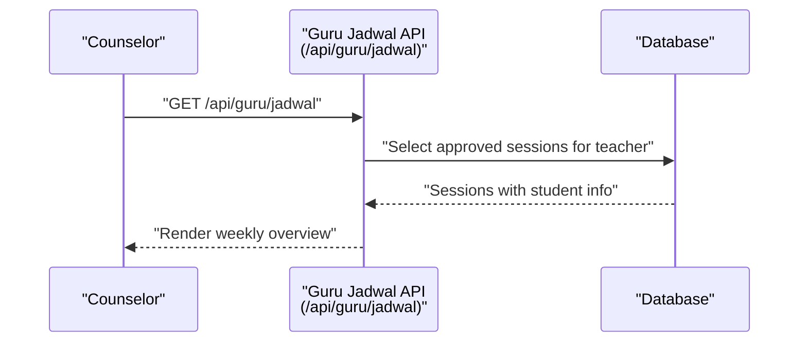
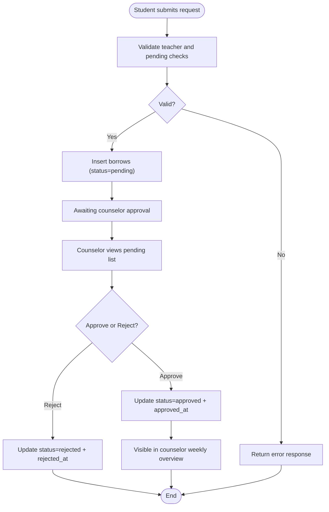
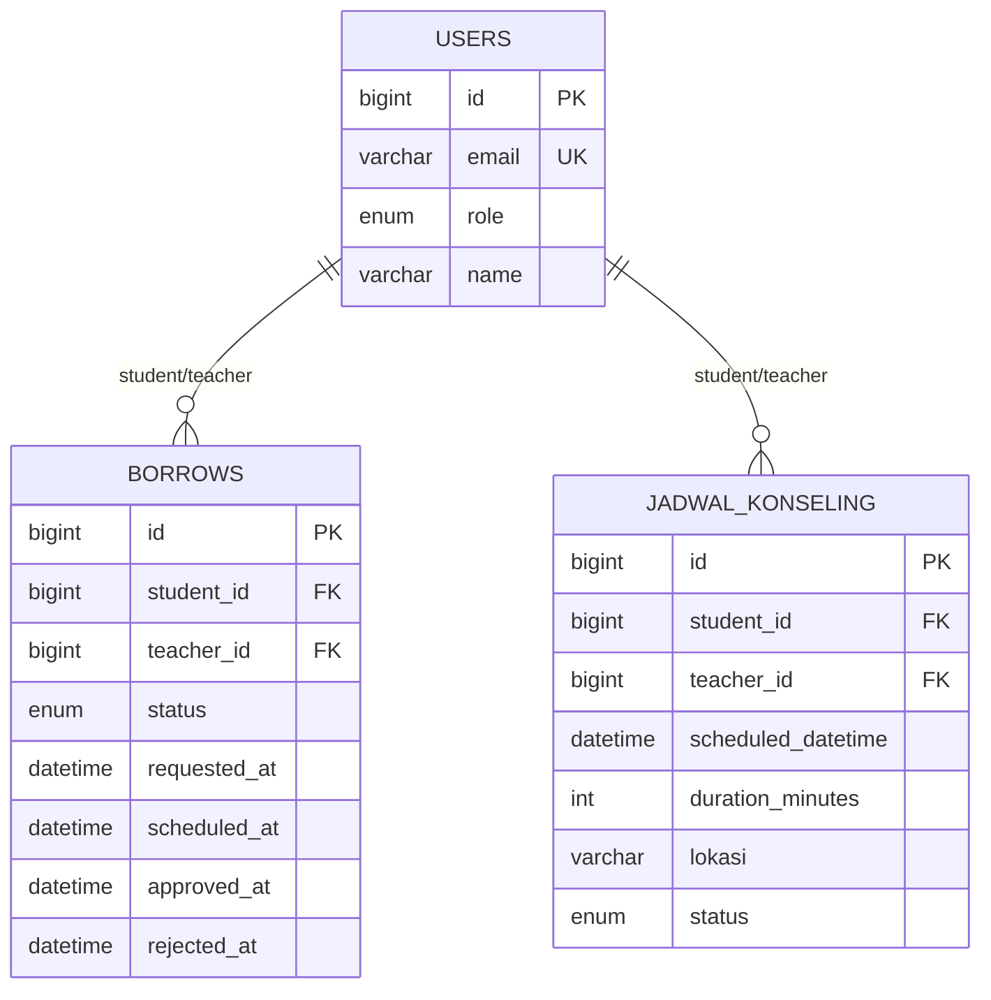
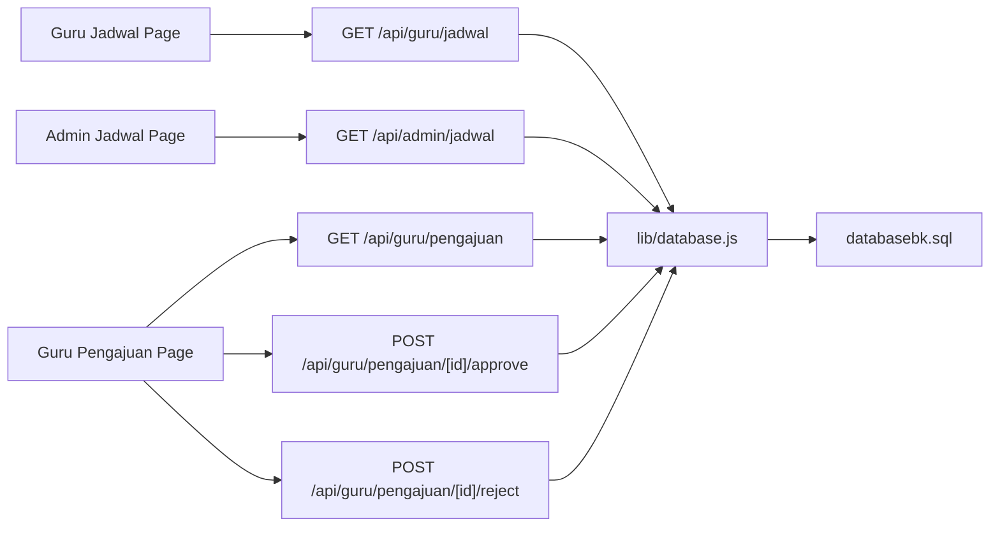

# Schedule Administration & Weekly Overview

<cite>
**Referenced Files in This Document**
- [app/gurubk/jadwal/page.jsx](file://app/gurubk/jadwal/page.jsx)
- [app/api/guru/jadwal/route.js](file://app/api/guru/jadwal/route.js)
- [app/admin/jadwal/page.jsx](file://app/admin/jadwal/page.jsx)
- [app/api/admin/jadwal/route.js](file://app/api/admin/jadwal/route.js)
- [app/gurubk/pengajuan/page.jsx](file://app/gurubk/pengajuan/page.jsx)
- [app/api/guru/pengajuan/route.js](file://app/api/guru/pengajuan/route.js)
- [app/api/guru/pengajuan/[id]/approve/route.js](file://app/api/guru/pengajuan/[id]/approve/route.js)
- [app/api/guru/pengajuan/[id]/reject/route.js](file://app/api/guru/pengajuan/[id]/reject/route.js)
- [app/api/siswa/pengajuan/route.js](file://app/api/siswa/pengajuan/route.js)
- [lib/database.js](file://lib/database.js)
- [databasebk.sql](file://databasebk.sql)
</cite>

## Table of Contents
1. [Introduction](#introduction)
2. [Project Structure](#project-structure)
3. [Core Components](#core-components)
4. [Architecture Overview](#architecture-overview)
5. [Detailed Component Analysis](#detailed-component-analysis)
6. [Dependency Analysis](#dependency-analysis)
7. [Performance Considerations](#performance-considerations)
8. [Troubleshooting Guide](#troubleshooting-guide)
9. [Conclusion](#conclusion)

## Introduction
This document explains the Guru BK (Guidance Teacher) schedule administration functionality. It covers how counselors view their weekly schedule, how requests are processed and approved, and how approved sessions appear in the counselor’s schedule. The system integrates with the appointment/request management module so that when a student request is approved, the counselor’s schedule automatically reflects the confirmed session. The documentation also outlines the weekly overview interface, approval workflows, and practical strategies for managing peak hours and emergencies.

## Project Structure
The schedule administration spans three primary areas:
- Counselor weekly overview: displays approved sessions assigned to the logged-in counselor.
- Admin scheduling dashboard: approves or rejects student requests and manages overall schedule visibility.
- Request management: handles student requests, counselor approvals, and persistence in the database.

**Diagram sources**
- [app/gurubk/jadwal/page.jsx:1-94](file://app/gurubk/jadwal/page.jsx#L1-L94)
- [app/admin/jadwal/page.jsx:1-215](file://app/admin/jadwal/page.jsx#L1-L215)
- [app/gurubk/pengajuan/page.jsx:1-104](file://app/gurubk/pengajuan/page.jsx#L1-L104)
- [app/api/guru/jadwal/route.js:1-48](file://app/api/guru/jadwal/route.js#L1-L48)
- [app/api/admin/jadwal/route.js:1-38](file://app/api/admin/jadwal/route.js#L1-L38)
- [app/api/guru/pengajuan/route.js:1-49](file://app/api/guru/pengajuan/route.js#L1-L49)
- [app/api/guru/pengajuan/[id]/approve/route.js:1-73](file://app/api/guru/pengajuan/[id]/approve/route.js#L1-L73)
- [app/api/guru/pengajuan/[id]/reject/route.js:1-73](file://app/api/guru/pengajuan/[id]/reject/route.js#L1-L73)
- [app/api/siswa/pengajuan/route.js:1-79](file://app/api/siswa/pengajuan/route.js#L1-L79)
- [lib/database.js:1-23](file://lib/database.js#L1-L23)
- [databasebk.sql:1-636](file://databasebk.sql#L1-L636)

**Section sources**
- [app/gurubk/jadwal/page.jsx:1-94](file://app/gurubk/jadwal/page.jsx#L1-L94)
- [app/admin/jadwal/page.jsx:1-215](file://app/admin/jadwal/page.jsx#L1-L215)
- [app/gurubk/pengajuan/page.jsx:1-104](file://app/gurubk/pengajuan/page.jsx#L1-L104)
- [app/api/guru/jadwal/route.js:1-48](file://app/api/guru/jadwal/route.js#L1-L48)
- [app/api/admin/jadwal/route.js:1-38](file://app/api/admin/jadwal/route.js#L1-L38)
- [app/api/guru/pengajuan/route.js:1-49](file://app/api/guru/pengajuan/route.js#L1-L49)
- [app/api/guru/pengajuan/[id]/approve/route.js:1-73](file://app/api/guru/pengajuan/[id]/approve/route.js#L1-L73)
- [app/api/guru/pengajuan/[id]/reject/route.js:1-73](file://app/api/guru/pengajuan/[id]/reject/route.js#L1-L73)
- [app/api/siswa/pengajuan/route.js:1-79](file://app/api/siswa/pengajuan/route.js#L1-L79)
- [lib/database.js:1-23](file://lib/database.js#L1-L23)
- [databasebk.sql:1-636](file://databasebk.sql#L1-L636)

## Core Components
- Counselor Weekly Overview
  - Fetches and renders the counselor’s approved sessions, displaying student, title, date, and time.
  - Uses a dedicated API endpoint to return structured data for the UI.
- Admin Scheduling Dashboard
  - Lists all counseling schedules, supports filtering by status, and allows approving or rejecting pending requests.
  - Updates the status of requests and persists changes to the database.
- Request Management
  - Students submit requests via a dedicated API endpoint.
  - Counselors review and approve/reject requests; approved requests are reflected in the counselor’s weekly overview.
- Database Layer
  - Centralized MySQL pool and a convenience query wrapper for consistent database access.
  - Schema defines the core tables for users, borrowing requests, and scheduled sessions.

Key implementation references:
- [Weekly overview UI:1-94](file://app/gurubk/jadwal/page.jsx#L1-L94)
- [Admin dashboard UI:1-215](file://app/admin/jadwal/page.jsx#L1-L215)
- [Counselor weekly API:1-48](file://app/api/guru/jadwal/route.js#L1-L48)
- [Admin scheduling API:1-38](file://app/api/admin/jadwal/route.js#L1-L38)
- [Student request API:1-79](file://app/api/siswa/pengajuan/route.js#L1-L79)
- [Counselor request list API:1-49](file://app/api/guru/pengajuan/route.js#L1-L49)
- [Approve request API:1-73](file://app/api/guru/pengajuan/[id]/approve/route.js#L1-L73)
- [Reject request API:1-73](file://app/api/guru/pengajuan/[id]/reject/route.js#L1-L73)
- [Database pool and query:1-23](file://lib/database.js#L1-L23)
- [Schema definition:1-636](file://databasebk.sql#L1-L636)

**Section sources**
- [app/gurubk/jadwal/page.jsx:1-94](file://app/gurubk/jadwal/page.jsx#L1-L94)
- [app/admin/jadwal/page.jsx:1-215](file://app/admin/jadwal/page.jsx#L1-L215)
- [app/api/guru/jadwal/route.js:1-48](file://app/api/guru/jadwal/route.js#L1-L48)
- [app/api/admin/jadwal/route.js:1-38](file://app/api/admin/jadwal/route.js#L1-L38)
- [app/api/guru/pengajuan/route.js:1-49](file://app/api/guru/pengajuan/route.js#L1-L49)
- [app/api/guru/pengajuan/[id]/approve/route.js:1-73](file://app/api/guru/pengajuan/[id]/approve/route.js#L1-L73)
- [app/api/guru/pengajuan/[id]/reject/route.js:1-73](file://app/api/guru/pengajuan/[id]/reject/route.js#L1-L73)
- [app/api/siswa/pengajuan/route.js:1-79](file://app/api/siswa/pengajuan/route.js#L1-L79)
- [lib/database.js:1-23](file://lib/database.js#L1-L23)
- [databasebk.sql:1-636](file://databasebk.sql#L1-L636)

## Architecture Overview
The system follows a clear separation of concerns:
- UI pages render schedule data and collect user actions.
- API routes enforce authorization, validate inputs, and interact with the database.
- Database schema supports both the legacy borrowing model and the formal scheduled sessions table.

**Diagram sources**
- [app/api/siswa/pengajuan/route.js:1-79](file://app/api/siswa/pengajuan/route.js#L1-L79)

**Diagram sources**
- [app/api/guru/pengajuan/route.js:1-49](file://app/api/guru/pengajuan/route.js#L1-L49)
- [app/api/guru/pengajuan/[id]/approve/route.js:1-73](file://app/api/guru/pengajuan/[id]/approve/route.js#L1-L73)
- [app/api/guru/pengajuan/[id]/reject/route.js:1-73](file://app/api/guru/pengajuan/[id]/reject/route.js#L1-L73)

**Diagram sources**
- [app/api/guru/jadwal/route.js:1-48](file://app/api/guru/jadwal/route.js#L1-L48)

## Detailed Component Analysis

### Counselor Weekly Overview
- Purpose: Display the counselor’s confirmed sessions for the week.
- Data source: API endpoint that filters approved sessions and joins with user data for student details.
- UI rendering: Clean table with icons for user, calendar, and clock; loading and empty-state handling.

Implementation highlights:
- Fetches data from the counselor’s schedule endpoint.
- Renders student name/email, session title, date, and time.
- Uses animations for smooth row appearance.

References:
- [UI page:1-94](file://app/gurubk/jadwal/page.jsx#L1-L94)
- [API route:1-48](file://app/api/guru/jadwal/route.js#L1-L48)
- [Database schema for sessions:92-106](file://databasebk.sql#L92-L106)

**Section sources**
- [app/gurubk/jadwal/page.jsx:1-94](file://app/gurubk/jadwal/page.jsx#L1-L94)
- [app/api/guru/jadwal/route.js:1-48](file://app/api/guru/jadwal/route.js#L1-L48)
- [databasebk.sql:92-106](file://databasebk.sql#L92-L106)

### Admin Scheduling Dashboard
- Purpose: Allow administrators to view, filter, and approve/reject counseling requests.
- Features: Search by student/guardian/location, filter by status, approve or reject pending entries.
- Persistence: Updates the status of requests in the database.

Implementation highlights:
- Loads all schedules and formats dates/times for display.
- Approve/reject actions trigger PATCH requests and update the UI state.
- Status badges reflect current status visually.

References:
- [Admin dashboard page:1-215](file://app/admin/jadwal/page.jsx#L1-L215)
- [Admin API route:1-38](file://app/api/admin/jadwal/route.js#L1-L38)
- [Database schema for schedules:92-106](file://databasebk.sql#L92-L106)

**Section sources**
- [app/admin/jadwal/page.jsx:1-215](file://app/admin/jadwal/page.jsx#L1-L215)
- [app/api/admin/jadwal/route.js:1-38](file://app/api/admin/jadwal/route.js#L1-L38)
- [databasebk.sql:92-106](file://databasebk.sql#L92-L106)

### Request Management (Student → Counselor → Schedule)
- Student request submission:
  - Validates teacher existence and prevents multiple pending requests.
  - Inserts a new borrowing record with status “pending”.
- Counselor request handling:
  - Lists pending requests assigned to the counselor.
  - Approves or rejects requests; updates timestamps accordingly.
- Schedule reflection:
  - Approved requests are shown in the counselor’s weekly overview.

**Diagram sources**
- [app/api/siswa/pengajuan/route.js:1-79](file://app/api/siswa/pengajuan/route.js#L1-L79)
- [app/api/guru/pengajuan/route.js:1-49](file://app/api/guru/pengajuan/route.js#L1-L49)
- [app/api/guru/pengajuan/[id]/approve/route.js:1-73](file://app/api/guru/pengajuan/[id]/approve/route.js#L1-L73)
- [app/api/guru/pengajuan/[id]/reject/route.js:1-73](file://app/api/guru/pengajuan/[id]/reject/route.js#L1-L73)
- [app/api/guru/jadwal/route.js:1-48](file://app/api/guru/jadwal/route.js#L1-L48)

**Section sources**
- [app/api/siswa/pengajuan/route.js:1-79](file://app/api/siswa/pengajuan/route.js#L1-L79)
- [app/api/guru/pengajuan/route.js:1-49](file://app/api/guru/pengajuan/route.js#L1-L49)
- [app/api/guru/pengajuan/[id]/approve/route.js:1-73](file://app/api/guru/pengajuan/[id]/approve/route.js#L1-L73)
- [app/api/guru/pengajuan/[id]/reject/route.js:1-73](file://app/api/guru/pengajuan/[id]/reject/route.js#L1-L73)
- [app/api/guru/jadwal/route.js:1-48](file://app/api/guru/jadwal/route.js#L1-L48)

### Database Schema and Relationships
The system relies on two key tables:
- Users: stores roles and personal info.
- Borrows: captures counseling requests with status and timestamps.
- Jadwal Konseling: formal scheduled sessions with date/time, duration, location, and status.

**Diagram sources**
- [databasebk.sql:25-38](file://databasebk.sql#L25-L38)
- [databasebk.sql:70-89](file://databasebk.sql#L70-L89)
- [databasebk.sql:94-106](file://databasebk.sql#L94-L106)

**Section sources**
- [databasebk.sql:25-38](file://databasebk.sql#L25-L38)
- [databasebk.sql:70-89](file://databasebk.sql#L70-L89)
- [databasebk.sql:94-106](file://databasebk.sql#L94-L106)

## Dependency Analysis
- UI pages depend on API routes for data fetching and mutation.
- API routes depend on the database layer for SQL operations.
- The counselor weekly overview depends on approved requests being persisted and linked to the counselor.

**Diagram sources**
- [app/gurubk/jadwal/page.jsx:1-94](file://app/gurubk/jadwal/page.jsx#L1-L94)
- [app/admin/jadwal/page.jsx:1-215](file://app/admin/jadwal/page.jsx#L1-L215)
- [app/gurubk/pengajuan/page.jsx:1-104](file://app/gurubk/pengajuan/page.jsx#L1-L104)
- [app/api/guru/jadwal/route.js:1-48](file://app/api/guru/jadwal/route.js#L1-L48)
- [app/api/admin/jadwal/route.js:1-38](file://app/api/admin/jadwal/route.js#L1-L38)
- [app/api/guru/pengajuan/route.js:1-49](file://app/api/guru/pengajuan/route.js#L1-L49)
- [app/api/guru/pengajuan/[id]/approve/route.js:1-73](file://app/api/guru/pengajuan/[id]/approve/route.js#L1-L73)
- [app/api/guru/pengajuan/[id]/reject/route.js:1-73](file://app/api/guru/pengajuan/[id]/reject/route.js#L1-L73)
- [lib/database.js:1-23](file://lib/database.js#L1-L23)
- [databasebk.sql:1-636](file://databasebk.sql#L1-L636)

**Section sources**
- [app/gurubk/jadwal/page.jsx:1-94](file://app/gurubk/jadwal/page.jsx#L1-L94)
- [app/admin/jadwal/page.jsx:1-215](file://app/admin/jadwal/page.jsx#L1-L215)
- [app/gurubk/pengajuan/page.jsx:1-104](file://app/gurubk/pengajuan/page.jsx#L1-L104)
- [app/api/guru/jadwal/route.js:1-48](file://app/api/guru/jadwal/route.js#L1-L48)
- [app/api/admin/jadwal/route.js:1-38](file://app/api/admin/jadwal/route.js#L1-L38)
- [app/api/guru/pengajuan/route.js:1-49](file://app/api/guru/pengajuan/route.js#L1-L49)
- [app/api/guru/pengajuan/[id]/approve/route.js:1-73](file://app/api/guru/pengajuan/[id]/approve/route.js#L1-L73)
- [app/api/guru/pengajuan/[id]/reject/route.js:1-73](file://app/api/guru/pengajuan/[id]/reject/route.js#L1-L73)
- [lib/database.js:1-23](file://lib/database.js#L1-L23)
- [databasebk.sql:1-636](file://databasebk.sql#L1-L636)

## Performance Considerations
- Database pooling: The MySQL pool limits concurrent connections and queues requests to prevent overload.
- Indexes: Strategic indexes on users and borrows improve query performance for frequent lookups.
- Dynamic route enforcement: APIs marked as force-dynamic ensure fresh data for counselor and admin views.
- UI responsiveness: Client-side loading states and minimal re-renders keep the interface snappy.

Recommendations:
- Add pagination for admin dashboards if the number of records grows large.
- Consider caching approved weekly schedules per counselor for read-heavy scenarios.
- Monitor slow queries and add composite indexes if needed for complex filters.

**Section sources**
- [lib/database.js:1-23](file://lib/database.js#L1-L23)
- [databasebk.sql:200-211](file://databasebk.sql#L200-L211)
- [app/api/guru/jadwal/route.js:5-5](file://app/api/guru/jadwal/route.js#L5-L5)
- [app/api/admin/jadwal/route.js:5-5](file://app/api/admin/jadwal/route.js#L5-L5)

## Troubleshooting Guide
Common issues and resolutions:
- Unauthorized access
  - Ensure the session role matches the expected role for counselor/admin endpoints.
  - References: [Counselor API guard:11-13](file://app/api/guru/jadwal/route.js#L11-L13), [Admin API guard:5-5](file://app/api/admin/jadwal/route.js#L5-L5)
- Request not found or already processed
  - Approve/reject endpoints validate existence and status before updating.
  - References: [Approve validation:28-47](file://app/api/guru/pengajuan/[id]/approve/route.js#L28-L47), [Reject validation:28-47](file://app/api/guru/pengajuan/[id]/reject/route.js#L28-L47)
- Duplicate pending requests
  - Student request API prevents multiple pending submissions.
  - Reference: [Student request validation:42-52](file://app/api/siswa/pengajuan/route.js#L42-L52)
- Database connectivity errors
  - Verify environment variables and pool configuration.
  - Reference: [Database pool:3-11](file://lib/database.js#L3-L11)

**Section sources**
- [app/api/guru/jadwal/route.js:11-13](file://app/api/guru/jadwal/route.js#L11-L13)
- [app/api/admin/jadwal/route.js:5-5](file://app/api/admin/jadwal/route.js#L5-L5)
- [app/api/guru/pengajuan/[id]/approve/route.js:28-47](file://app/api/guru/pengajuan/[id]/approve/route.js#L28-L47)
- [app/api/guru/pengajuan/[id]/reject/route.js:28-47](file://app/api/guru/pengajuan/[id]/reject/route.js#L28-L47)
- [app/api/siswa/pengajuan/route.js:42-52](file://app/api/siswa/pengajuan/route.js#L42-L52)
- [lib/database.js:3-11](file://lib/database.js#L3-L11)

## Conclusion
The Guru BK schedule administration system provides a clear workflow from student request to counselor approval and weekly schedule visibility. Counselors can quickly review their confirmed sessions, while administrators oversee and approve requests. The database schema supports both legacy and formalized scheduling, and the APIs enforce proper authorization and validation. With the recommended enhancements, the system can scale efficiently and remain responsive under varying loads.