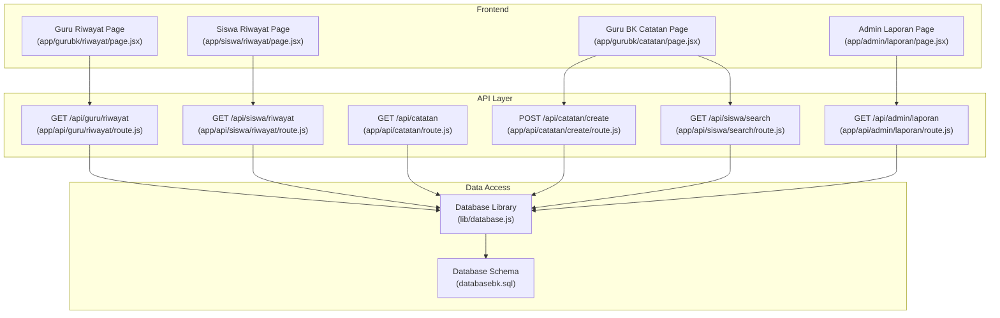
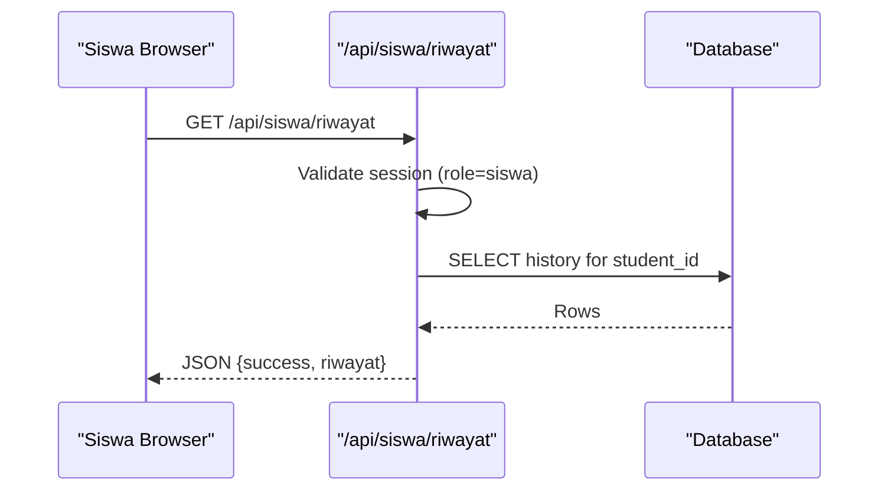
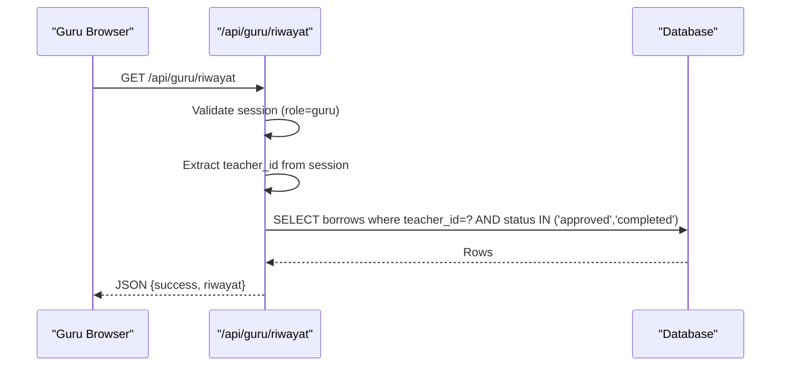
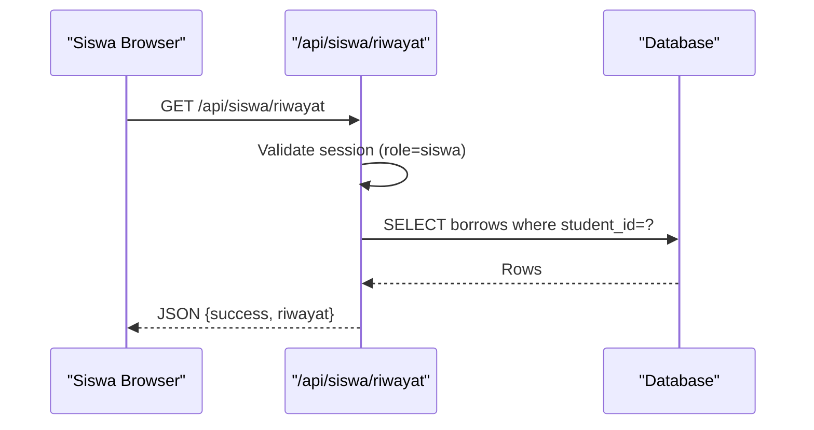
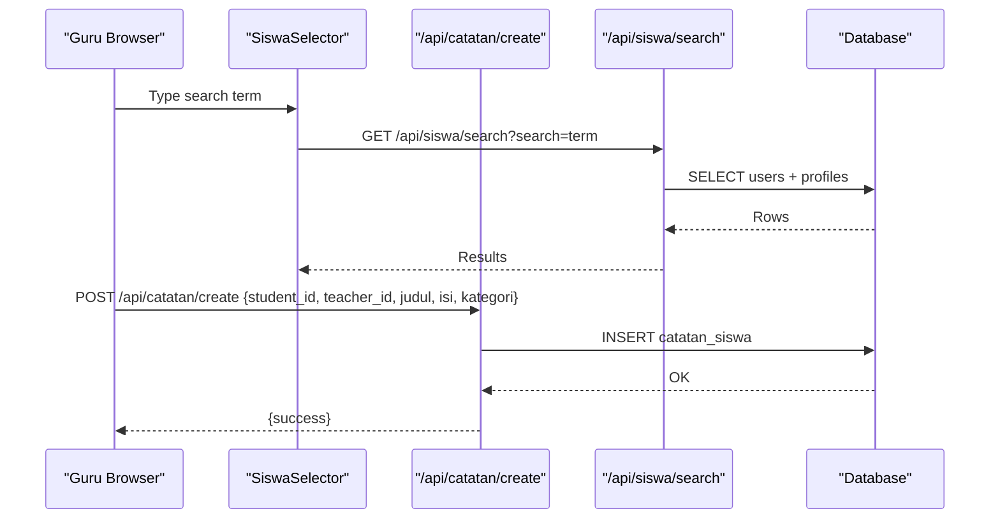
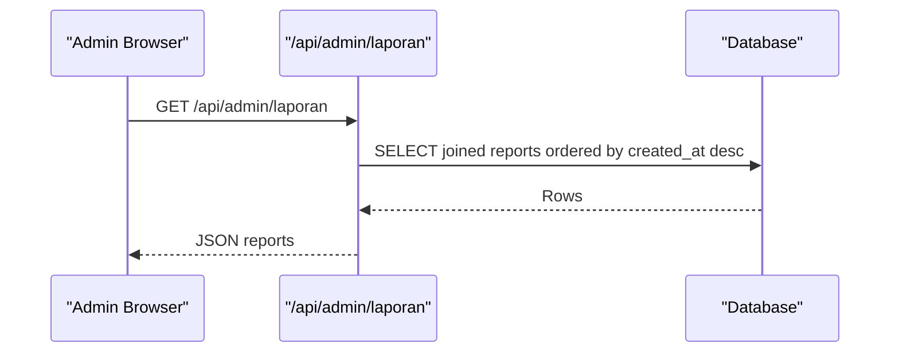
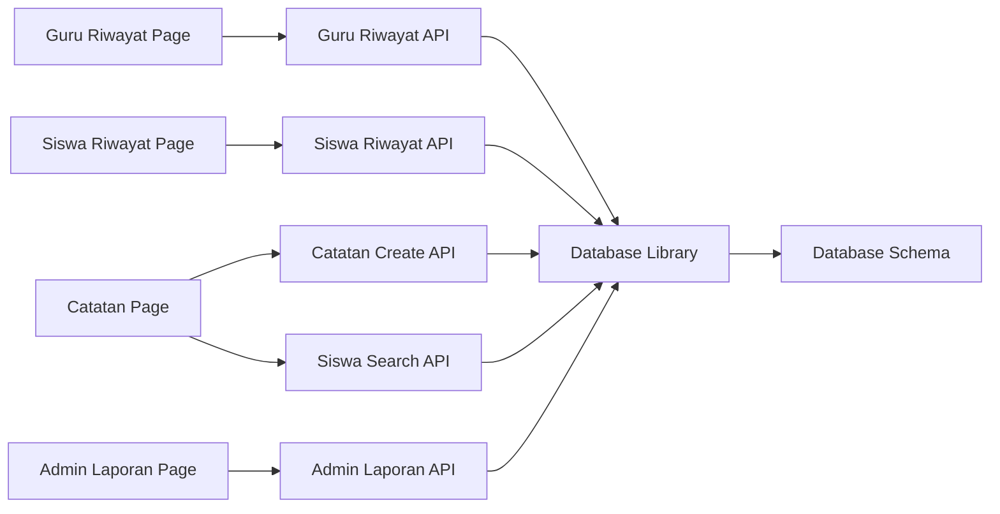
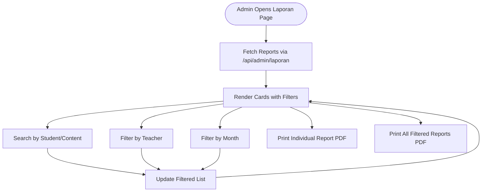

# Student Progress Tracking & History

<cite>
**Referenced Files in This Document**
- [app/gurubk/riwayat/page.jsx](file://app/gurubk/riwayat/page.jsx)
- [app/siswa/riwayat/page.jsx](file://app/siswa/riwayat/page.jsx)
- [app/api/guru/riwayat/route.js](file://app/api/guru/riwayat/route.js)
- [app/api/siswa/riwayat/route.js](file://app/api/siswa/riwayat/route.js)
- [app/gurubk/catatan/page.jsx](file://app/gurubk/catatan/page.jsx)
- [app/gurubk/catatan/components/SiswaSelector.jsx](file://app/gurubk/catatan/components/SiswaSelector.jsx)
- [app/api/catatan/route.js](file://app/api/catatan/route.js)
- [app/api/catatan/create/route.js](file://app/api/catatan/create/route.js)
- [app/api/siswa/search/route.js](file://app/api/siswa/search/route.js)
- [app/admin/laporan/page.jsx](file://app/admin/laporan/page.jsx)
- [app/api/admin/laporan/route.js](file://app/api/admin/laporan/route.js)
- [lib/database.js](file://lib/database.js)
- [databasebk.sql](file://databasebk.sql)
</cite>

## Table of Contents
1. [Introduction](#introduction)
2. [Project Structure](#project-structure)
3. [Core Components](#core-components)
4. [Architecture Overview](#architecture-overview)
5. [Detailed Component Analysis](#detailed-component-analysis)
6. [Dependency Analysis](#dependency-analysis)
7. [Performance Considerations](#performance-considerations)
8. [Security and Privacy](#security-and-privacy)
9. [Reporting Features](#reporting-features)
10. [Troubleshooting Guide](#troubleshooting-guide)
11. [Conclusion](#conclusion)

## Introduction
This document explains the Guru BK (Guidance Teacher) student progress tracking and history management system. It covers how completed counseling sessions are recorded, how student progress documentation is maintained, and how session outcomes are tracked. It also documents filtering and search capabilities for accessing past sessions, student-specific histories, and progress trends, along with reporting features for generating progress summaries and performance metrics. Guidance for secure handling of sensitive student information and anonymization considerations is included.

## Project Structure
The system is organized around three primary areas:
- Student-facing history views
- Guru BK progress documentation and selection
- Admin reporting and analytics

Key frontend pages:
- Guru BK history page: displays counselor sessions for the logged-in teacher
- Student history page: shows personal counseling requests and statuses
- Guru BK progress documentation page: allows creation of student progress notes
- Admin reporting page: aggregates and filters counseling reports

Backend APIs:
- History retrieval for Guru BK and Students
- Progress note creation and filtering
- Student search for selection
- Admin report aggregation

**Diagram sources**
- [app/gurubk/riwayat/page.jsx:1-105](file://app/gurubk/riwayat/page.jsx#L1-L105)
- [app/siswa/riwayat/page.jsx:1-127](file://app/siswa/riwayat/page.jsx#L1-L127)
- [app/gurubk/catatan/page.jsx:1-128](file://app/gurubk/catatan/page.jsx#L1-L128)
- [app/admin/laporan/page.jsx:1-195](file://app/admin/laporan/page.jsx#L1-L195)
- [app/api/guru/riwayat/route.js:1-50](file://app/api/guru/riwayat/route.js#L1-L50)
- [app/api/siswa/riwayat/route.js:1-52](file://app/api/siswa/riwayat/route.js#L1-L52)
- [app/api/catatan/route.js:1-49](file://app/api/catatan/route.js#L1-L49)
- [app/api/catatan/create/route.js:1-24](file://app/api/catatan/create/route.js#L1-L24)
- [app/api/siswa/search/route.js:1-20](file://app/api/siswa/search/route.js#L1-L20)
- [app/api/admin/laporan/route.js:1-29](file://app/api/admin/laporan/route.js#L1-L29)
- [lib/database.js:1-23](file://lib/database.js#L1-L23)
- [databasebk.sql:1-636](file://databasebk.sql#L1-L636)

**Section sources**
- [app/gurubk/riwayat/page.jsx:1-105](file://app/gurubk/riwayat/page.jsx#L1-L105)
- [app/siswa/riwayat/page.jsx:1-127](file://app/siswa/riwayat/page.jsx#L1-L127)
- [app/gurubk/catatan/page.jsx:1-128](file://app/gurubk/catatan/page.jsx#L1-L128)
- [app/admin/laporan/page.jsx:1-195](file://app/admin/laporan/page.jsx#L1-L195)
- [app/api/guru/riwayat/route.js:1-50](file://app/api/guru/riwayat/route.js#L1-L50)
- [app/api/siswa/riwayat/route.js:1-52](file://app/api/siswa/riwayat/route.js#L1-L52)
- [app/api/catatan/route.js:1-49](file://app/api/catatan/route.js#L1-L49)
- [app/api/catatan/create/route.js:1-24](file://app/api/catatan/create/route.js#L1-L24)
- [app/api/siswa/search/route.js:1-20](file://app/api/siswa/search/route.js#L1-L20)
- [app/api/admin/laporan/route.js:1-29](file://app/api/admin/laporan/route.js#L1-L29)
- [lib/database.js:1-23](file://lib/database.js#L1-L23)
- [databasebk.sql:1-636](file://databasebk.sql#L1-L636)

## Core Components
- Guru BK History Page: Lists sessions where the teacher was involved and the status is approved or completed, with links to printable PDFs.
- Student History Page: Shows the requester’s own counseling requests with status badges and timestamps.
- Progress Notes Creation: Allows Guru BK to create categorized notes for selected students, with search and selection of students.
- Admin Reporting: Aggregates counseling reports with filtering by student, teacher, and month, and supports PDF export.

**Section sources**
- [app/gurubk/riwayat/page.jsx:8-105](file://app/gurubk/riwayat/page.jsx#L8-L105)
- [app/siswa/riwayat/page.jsx:7-127](file://app/siswa/riwayat/page.jsx#L7-L127)
- [app/gurubk/catatan/page.jsx:9-128](file://app/gurubk/catatan/page.jsx#L9-L128)
- [app/admin/laporan/page.jsx:61-195](file://app/admin/laporan/page.jsx#L61-L195)

## Architecture Overview
The system follows a layered architecture:
- Frontend pages render data and collect user actions.
- API routes handle authentication, authorization, and data queries.
- Database library encapsulates connection and query execution.
- Database schema defines entities for users, borrowing requests, schedules, reports, and notes.

**Diagram sources**
- [app/api/siswa/riwayat/route.js:5-52](file://app/api/siswa/riwayat/route.js#L5-L52)
- [lib/database.js:13-21](file://lib/database.js#L13-L21)

**Section sources**
- [app/api/siswa/riwayat/route.js:5-52](file://app/api/siswa/riwayat/route.js#L5-L52)
- [lib/database.js:1-23](file://lib/database.js#L1-L23)

## Detailed Component Analysis

### Guru BK History Management
Purpose:
- Display counselor sessions where the teacher was involved and the status is approved or completed.
- Provide quick access to printable PDFs of session records.

Key behaviors:
- Fetches data via GET /api/guru/riwayat.
- Filters to approved/completed sessions only.
- Renders a table with student name, title, completion date, summary preview, and a print action.

**Diagram sources**
- [app/api/guru/riwayat/route.js:7-43](file://app/api/guru/riwayat/route.js#L7-L43)
- [lib/database.js:13-21](file://lib/database.js#L13-L21)

**Section sources**
- [app/gurubk/riwayat/page.jsx:8-105](file://app/gurubk/riwayat/page.jsx#L8-L105)
- [app/api/guru/riwayat/route.js:7-43](file://app/api/guru/riwayat/route.js#L7-L43)

### Student History Management
Purpose:
- Allow students to review their own counseling requests, including status and timestamps.
- Provide a clean, user-friendly timeline of their interactions.

Key behaviors:
- Fetches data via GET /api/siswa/riwayat.
- Uses COALESCE to safely handle missing teacher names.
- Renders a card layout with status badges and descriptive details.

**Diagram sources**
- [app/api/siswa/riwayat/route.js:5-42](file://app/api/siswa/riwayat/route.js#L5-L42)
- [lib/database.js:13-21](file://lib/database.js#L13-L21)

**Section sources**
- [app/siswa/riwayat/page.jsx:7-127](file://app/siswa/riwayat/page.jsx#L7-L127)
- [app/api/siswa/riwayat/route.js:5-42](file://app/api/siswa/riwayat/route.js#L5-L42)

### Progress Notes Creation and Filtering
Purpose:
- Enable Guru BK to create categorized progress notes for students.
- Provide a searchable selector for students to attach notes to.

Key behaviors:
- Student search endpoint supports name/NIS search with pagination-friendly limit.
- Notes creation endpoint inserts into catatan_siswa.
- Notes listing endpoint supports role-based filtering and optional student_id filtering.

**Diagram sources**
- [app/gurubk/catatan/components/SiswaSelector.jsx:8-42](file://app/gurubk/catatan/components/SiswaSelector.jsx#L8-L42)
- [app/api/siswa/search/route.js:4-18](file://app/api/siswa/search/route.js#L4-L18)
- [app/api/catatan/create/route.js:4-22](file://app/api/catatan/create/route.js#L4-L22)
- [lib/database.js:13-21](file://lib/database.js#L13-L21)

**Section sources**
- [app/gurubk/catatan/page.jsx:9-128](file://app/gurubk/catatan/page.jsx#L9-L128)
- [app/gurubk/catatan/components/SiswaSelector.jsx:4-78](file://app/gurubk/catatan/components/SiswaSelector.jsx#L4-L78)
- [app/api/catatan/route.js:5-48](file://app/api/catatan/route.js#L5-L48)
- [app/api/catatan/create/route.js:4-22](file://app/api/catatan/create/route.js#L4-L22)
- [app/api/siswa/search/route.js:4-18](file://app/api/siswa/search/route.js#L4-L18)

### Admin Reporting and Analytics
Purpose:
- Aggregate counseling reports for monitoring and reporting.
- Support filtering by student name or report content, teacher, and month.
- Export individual or aggregated reports to PDF.

Key behaviors:
- Admin endpoint joins laporan_konseling with jadwal_konseling and users to produce a flat report dataset.
- Frontend applies client-side filtering and renders printable cards with PDF download links.

**Diagram sources**
- [app/api/admin/laporan/route.js:5-28](file://app/api/admin/laporan/route.js#L5-L28)
- [lib/database.js:13-21](file://lib/database.js#L13-L21)

**Section sources**
- [app/admin/laporan/page.jsx:61-195](file://app/admin/laporan/page.jsx#L61-L195)
- [app/api/admin/laporan/route.js:5-28](file://app/api/admin/laporan/route.js#L5-L28)

## Dependency Analysis
- Pages depend on API routes for data fetching.
- API routes depend on the database library for SQL execution.
- Database library depends on environment variables for connection configuration.
- Database schema defines foreign keys and indexes supporting efficient queries.

**Diagram sources**
- [app/gurubk/riwayat/page.jsx:12-20](file://app/gurubk/riwayat/page.jsx#L12-L20)
- [app/siswa/riwayat/page.jsx:11-26](file://app/siswa/riwayat/page.jsx#L11-L26)
- [app/gurubk/catatan/page.jsx:23-43](file://app/gurubk/catatan/page.jsx#L23-L43)
- [app/gurubk/catatan/components/SiswaSelector.jsx:17-42](file://app/gurubk/catatan/components/SiswaSelector.jsx#L17-L42)
- [app/admin/laporan/page.jsx:71-81](file://app/admin/laporan/page.jsx#L71-L81)
- [app/api/guru/riwayat/route.js:21-38](file://app/api/guru/riwayat/route.js#L21-L38)
- [app/api/siswa/riwayat/route.js:20-37](file://app/api/siswa/riwayat/route.js#L20-L37)
- [app/api/catatan/create/route.js:9-13](file://app/api/catatan/create/route.js#L9-L13)
- [app/api/siswa/search/route.js:7-16](file://app/api/siswa/search/route.js#L7-L16)
- [app/api/admin/laporan/route.js:7-22](file://app/api/admin/laporan/route.js#L7-L22)
- [lib/database.js:3-11](file://lib/database.js#L3-L11)
- [databasebk.sql:68-89](file://databasebk.sql#L68-L89)

**Section sources**
- [lib/database.js:1-23](file://lib/database.js#L1-L23)
- [databasebk.sql:68-89](file://databasebk.sql#L68-L89)

## Performance Considerations
- Indexes on borrows, jadwal_konseling, and catatan_siswa improve query performance for history and notes retrieval.
- Client-side filtering in admin reporting reduces server load but may increase payload sizes; consider server-side pagination for very large datasets.
- Using LIMIT in student search prevents excessive result sets.
- Dynamic route option is set to force-dynamic for history endpoints; ensure caching policies align with privacy requirements.

**Section sources**
- [databasebk.sql:199-211](file://databasebk.sql#L199-L211)
- [app/api/siswa/search/route.js:13-16](file://app/api/siswa/search/route.js#L13-L16)
- [app/api/guru/riwayat/route.js:5](file://app/api/guru/riwayat/route.js#L5)

## Security and Privacy
- Authentication and authorization:
  - Session-based validation ensures only authorized roles access endpoints.
  - Role checks enforce that Guru BK history is teacher-specific and that student history is student-specific.
- Data exposure:
  - Student history uses COALESCE to avoid exposing missing teacher data.
  - Notes listing restricts visibility by role; students see only their own notes; teachers see their own notes and optionally filter by student when acting in a supervisory capacity.
- Sensitive data handling:
  - The schema includes an audit_log table suitable for logging access and modifications.
  - Consider implementing data retention policies aligned with institutional guidelines (e.g., retain notes and reports for a defined period, then anonymize or purge according to policy).
- Secure storage:
  - Environment variables are used for database credentials in the connection pool.

**Section sources**
- [app/api/guru/riwayat/route.js:9-19](file://app/api/guru/riwayat/route.js#L9-L19)
- [app/api/siswa/riwayat/route.js:7-15](file://app/api/siswa/riwayat/route.js#L7-L15)
- [app/api/catatan/route.js:23-37](file://app/api/catatan/route.js#L23-L37)
- [databasebk.sql:171-183](file://databasebk.sql#L171-L183)
- [lib/database.js:3-11](file://lib/database.js#L3-L11)

## Reporting Features
- Admin reporting page:
  - Loads aggregated reports from the admin API.
  - Supports live filtering by student name or report content, teacher, and month.
  - Provides per-report and aggregated PDF downloads using @react-pdf/renderer.
- Guru BK history page:
  - Offers print access for completed sessions via PDF generation endpoints.
- Student history page:
  - Presents a chronological view of requests with status indicators for self-monitoring.

**Diagram sources**
- [app/admin/laporan/page.jsx:68-98](file://app/admin/laporan/page.jsx#L68-L98)
- [app/admin/laporan/page.jsx:114-126](file://app/admin/laporan/page.jsx#L114-L126)
- [app/admin/laporan/page.jsx:144-182](file://app/admin/laporan/page.jsx#L144-L182)
- [app/api/admin/laporan/route.js:5-28](file://app/api/admin/laporan/route.js#L5-L28)

**Section sources**
- [app/admin/laporan/page.jsx:61-195](file://app/admin/laporan/page.jsx#L61-L195)
- [app/api/admin/laporan/route.js:5-28](file://app/api/admin/laporan/route.js#L5-L28)

## Troubleshooting Guide
Common issues and resolutions:
- Unauthorized access:
  - Ensure the session includes the correct role; otherwise, API routes return 401.
- Missing data:
  - Student history uses COALESCE to prevent null teacher names; verify user joins.
- Network errors during search:
  - The selector handles network and JSON parse errors gracefully by clearing results.
- Database connectivity:
  - Verify environment variables for DB_HOST, DB_USER, DB_PASS, DB_NAME.
- API errors:
  - Inspect console logs for “API ERROR” or “RIWAYAT ERROR” messages and return status codes.

**Section sources**
- [app/api/guru/riwayat/route.js:11-19](file://app/api/guru/riwayat/route.js#L11-L19)
- [app/api/siswa/riwayat/route.js:10-15](file://app/api/siswa/riwayat/route.js#L10-L15)
- [app/gurubk/catatan/components/SiswaSelector.jsx:16-42](file://app/gurubk/catatan/components/SiswaSelector.jsx#L16-L42)
- [app/api/catatan/create/route.js:16-22](file://app/api/catatan/create/route.js#L16-L22)
- [app/api/guru/riwayat/route.js:45-48](file://app/api/guru/riwayat/route.js#L45-L48)
- [lib/database.js:3-11](file://lib/database.js#L3-L11)

## Conclusion
The Guru BK student progress tracking and history management system integrates student-facing history views, teacher documentation tools, and admin reporting capabilities. It leverages role-based access control, structured database relations, and practical filtering to support efficient progress monitoring and reporting. For robust operations, maintain strong authentication, apply appropriate data retention and anonymization policies, and consider server-side pagination for large datasets.