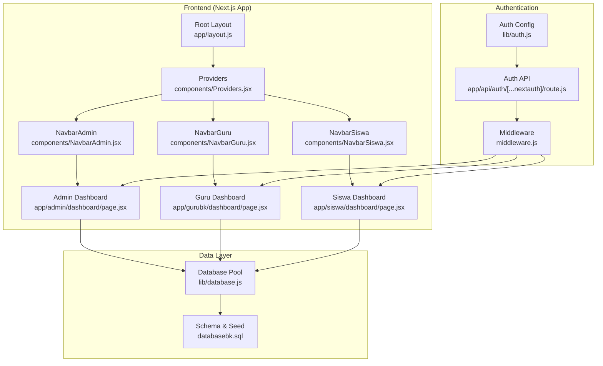
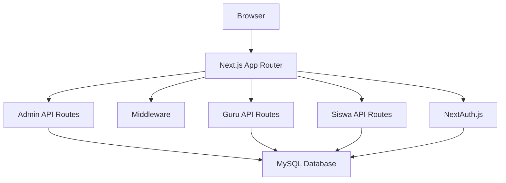
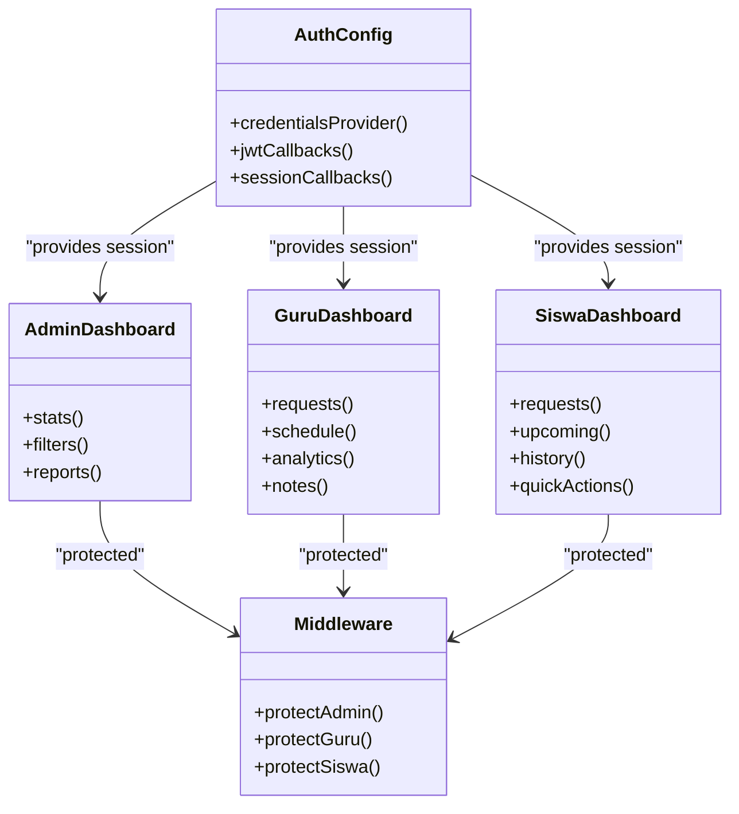
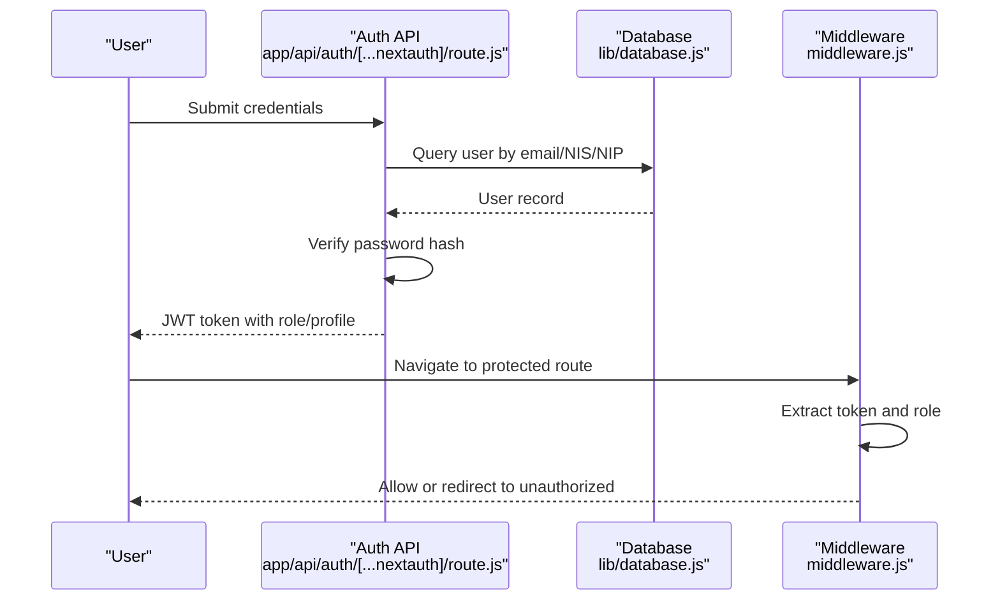
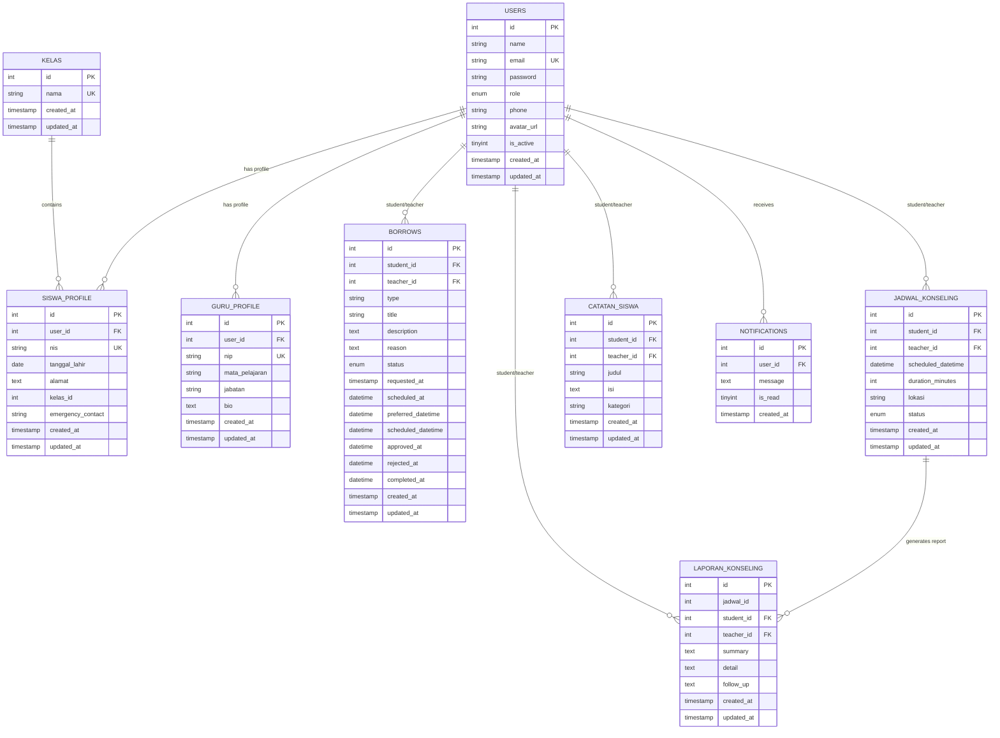
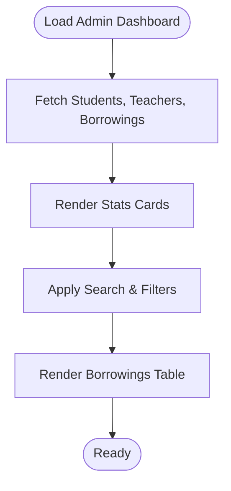
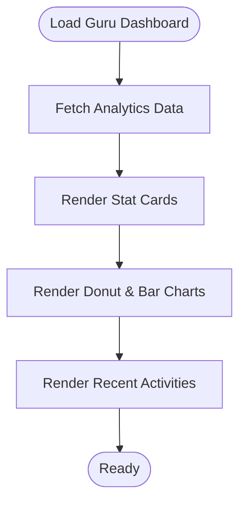
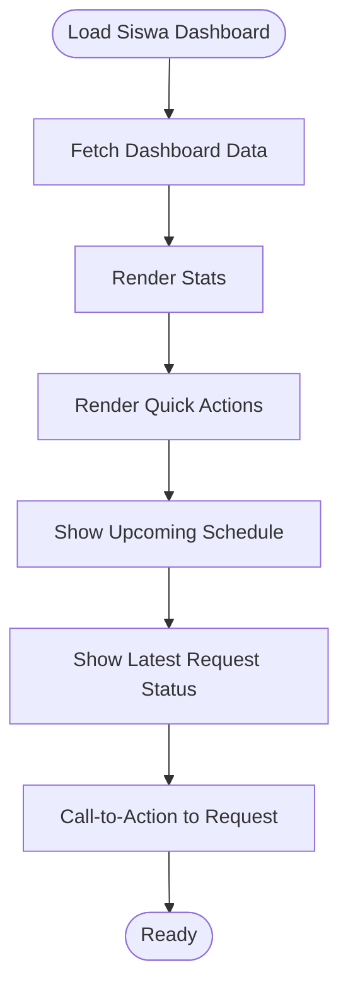
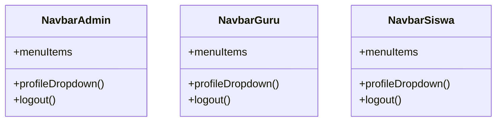
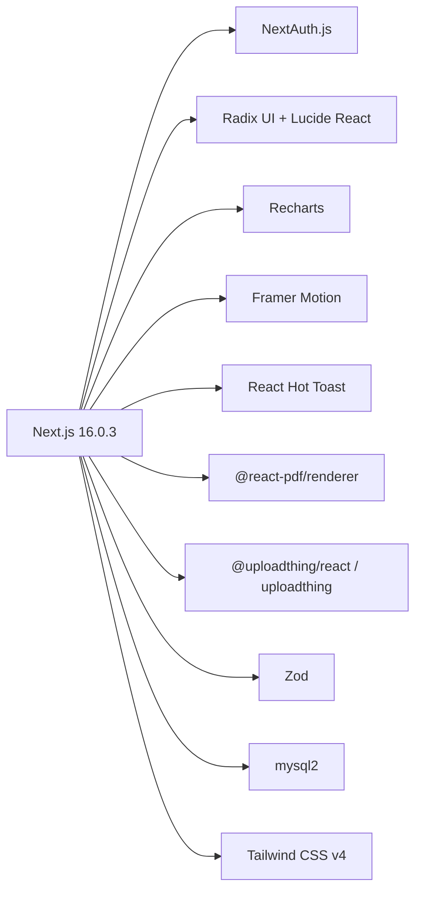

# Project Overview

<cite>
**Referenced Files in This Document**
- [package.json](file://package.json)
- [README.md](file://README.md)
- [lib/auth.js](file://lib/auth.js)
- [lib/database.js](file://lib/database.js)
- [middleware.js](file://middleware.js)
- [databasebk.sql](file://databasebk.sql)
- [app/layout.js](file://app/layout.js)
- [components/Providers.jsx](file://components/Providers.jsx)
- [app/admin/dashboard/page.jsx](file://app/admin/dashboard/page.jsx)
- [app/siswa/dashboard/page.jsx](file://app/siswa/dashboard/page.jsx)
- [app/gurubk/dashboard/page.jsx](file://app/gurubk/dashboard/page.jsx)
- [app/api/auth/[...nextauth]/route.js](file://app/api/auth/[...nextauth]/route.js)
- [components/NavbarAdmin.jsx](file://components/NavbarAdmin.jsx)
- [components/NavbarGuru.jsx](file://components/NavbarGuru.jsx)
- [components/NavbarSiswa.jsx](file://components/NavbarSiswa.jsx)
</cite>

## Table of Contents
1. [Introduction](#introduction)
2. [Project Structure](#project-structure)
3. [Core Components](#core-components)
4. [Architecture Overview](#architecture-overview)
5. [Detailed Component Analysis](#detailed-component-analysis)
6. [Dependency Analysis](#dependency-analysis)
7. [Performance Considerations](#performance-considerations)
8. [Troubleshooting Guide](#troubleshooting-guide)
9. [Conclusion](#conclusion)

## Introduction
Educational Booking Application (E-BK) is a school counseling management system designed to streamline the end-to-end process of student counseling sessions. It targets three primary user roles: administrators, counselors (Guru BK), and students (Siswa). The platform centralizes appointment requests, scheduling, progress documentation, reporting, and notifications to improve operational efficiency and support student wellbeing.

Core value proposition:
- Simplified appointment booking and scheduling for students with visibility into counselor availability and session status
- Centralized dashboards for counselors to manage incoming requests, schedule sessions, and maintain progress notes
- Administrative oversight with reporting, user management, and system analytics
- Secure, role-based access ensuring appropriate permissions and data privacy

Educational domain context:
Schools often struggle with manual, paper-based or fragmented systems for managing counseling sessions. E-BK addresses these challenges by digitizing the entire lifecycle—from request submission to session completion and follow-up reporting—while maintaining compliance with institutional policies and user privacy.

## Project Structure
The application follows a Next.js App Router structure with a clear separation of concerns:
- app/: Route handlers, pages, and nested layouts organized by role and feature
- components/: Reusable UI components and providers
- lib/: Shared utilities for authentication, database connectivity, and helpers
- public/uploads/: Static assets for user avatars and uploads
- Database schema defined via SQL script with normalized tables for users, profiles, schedules, reports, and notifications

**Diagram sources**
- [app/layout.js:1-31](file://app/layout.js#L1-L31)
- [components/Providers.jsx:1-14](file://components/Providers.jsx#L1-L14)
- [app/admin/dashboard/page.jsx:1-255](file://app/admin/dashboard/page.jsx#L1-L255)
- [app/gurubk/dashboard/page.jsx:1-158](file://app/gurubk/dashboard/page.jsx#L1-L158)
- [app/siswa/dashboard/page.jsx:1-209](file://app/siswa/dashboard/page.jsx#L1-L209)
- [components/NavbarAdmin.jsx:1-231](file://components/NavbarAdmin.jsx#L1-L231)
- [components/NavbarGuru.jsx:1-210](file://components/NavbarGuru.jsx#L1-L210)
- [components/NavbarSiswa.jsx:1-191](file://components/NavbarSiswa.jsx#L1-L191)
- [lib/auth.js:1-77](file://lib/auth.js#L1-L77)
- [app/api/auth/[...nextauth]/route.js:1-102](file://app/api/auth/[...nextauth]/route.js#L1-L102)
- [middleware.js:1-53](file://middleware.js#L1-L53)
- [lib/database.js:1-23](file://lib/database.js#L1-L23)
- [databasebk.sql:1-407](file://databasebk.sql#L1-L407)

**Section sources**
- [README.md:1-37](file://README.md#L1-L37)
- [package.json:1-44](file://package.json#L1-L44)
- [app/layout.js:1-31](file://app/layout.js#L1-L31)
- [components/Providers.jsx:1-14](file://components/Providers.jsx#L1-L14)
- [lib/auth.js:1-77](file://lib/auth.js#L1-L77)
- [app/api/auth/[...nextauth]/route.js:1-102](file://app/api/auth/[...nextauth]/route.js#L1-L102)
- [middleware.js:1-53](file://middleware.js#L1-L53)
- [lib/database.js:1-23](file://lib/database.js#L1-L23)
- [databasebk.sql:1-407](file://databasebk.sql#L1-L407)

## Core Components
- Role-based authentication and session management using NextAuth.js with JWT strategy
- Middleware enforcing role-specific routing protection
- Centralized database pool abstraction for MySQL connectivity
- Role-specific dashboards with charts, filters, and actionable navigation
- Shared navigation components for Admin, Guru BK, and Siswa

Key capabilities:
- Appointment booking and status tracking for students
- Counselor dashboard with analytics and activity feeds
- Admin oversight with reporting and user management
- Real-time notifications and status updates

**Section sources**
- [lib/auth.js:1-77](file://lib/auth.js#L1-L77)
- [app/api/auth/[...nextauth]/route.js:1-102](file://app/api/auth/[...nextauth]/route.js#L1-L102)
- [middleware.js:1-53](file://middleware.js#L1-L53)
- [lib/database.js:1-23](file://lib/database.js#L1-L23)
- [app/admin/dashboard/page.jsx:1-255](file://app/admin/dashboard/page.jsx#L1-L255)
- [app/gurubk/dashboard/page.jsx:1-158](file://app/gurubk/dashboard/page.jsx#L1-L158)
- [app/siswa/dashboard/page.jsx:1-209](file://app/siswa/dashboard/page.jsx#L1-L209)

## Architecture Overview
The system employs a layered architecture:
- Presentation layer: Next.js App Router pages and shared UI components
- Authentication layer: NextAuth.js with custom credentials provider and JWT callbacks
- Business logic layer: Route handlers under app/api implementing CRUD and analytics
- Data access layer: MySQL2 pool with centralized query execution
- Middleware layer: Role-based access control protecting protected routes

**Diagram sources**
- [app/api/auth/[...nextauth]/route.js:1-102](file://app/api/auth/[...nextauth]/route.js#L1-L102)
- [middleware.js:1-53](file://middleware.js#L1-L53)
- [lib/database.js:1-23](file://lib/database.js#L1-L23)
- [databasebk.sql:1-407](file://databasebk.sql#L1-L407)

## Detailed Component Analysis

### Role-Based Architecture
The application defines three user roles with distinct dashboards and permissions:
- Admin: Manages users, schedules, and generates reports
- Guru BK: Reviews requests, schedules sessions, and maintains notes
- Siswa: Submits requests, tracks status, and views personal history

**Diagram sources**
- [app/admin/dashboard/page.jsx:1-255](file://app/admin/dashboard/page.jsx#L1-L255)
- [app/gurubk/dashboard/page.jsx:1-158](file://app/gurubk/dashboard/page.jsx#L1-L158)
- [app/siswa/dashboard/page.jsx:1-209](file://app/siswa/dashboard/page.jsx#L1-L209)
- [middleware.js:1-53](file://middleware.js#L1-L53)
- [lib/auth.js:1-77](file://lib/auth.js#L1-L77)

**Section sources**
- [middleware.js:1-53](file://middleware.js#L1-L53)
- [lib/auth.js:1-77](file://lib/auth.js#L1-L77)

### Authentication and Authorization Flow
The authentication system supports login via email/NIS/NIP with password verification against hashed credentials stored in the database. JWT tokens carry role and profile attributes to enable middleware-based route protection and UI customization.

**Diagram sources**
- [app/api/auth/[...nextauth]/route.js:1-102](file://app/api/auth/[...nextauth]/route.js#L1-L102)
- [lib/database.js:1-23](file://lib/database.js#L1-L23)
- [middleware.js:1-53](file://middleware.js#L1-L53)

**Section sources**
- [app/api/auth/[...nextauth]/route.js:1-102](file://app/api/auth/[...nextauth]/route.js#L1-L102)
- [lib/database.js:1-23](file://lib/database.js#L1-L23)
- [middleware.js:1-53](file://middleware.js#L1-L53)

### Data Model Overview
The schema supports users, profiles, counseling requests, schedules, reports, and notifications. Indexes are defined for performance on frequently queried columns.

**Diagram sources**
- [databasebk.sql:1-407](file://databasebk.sql#L1-L407)

**Section sources**
- [databasebk.sql:1-407](file://databasebk.sql#L1-L407)

### Admin Dashboard Features
The Admin dashboard aggregates counts for students and teachers, lists borrowing transactions with filtering and search, and presents statistics in a responsive layout.

**Diagram sources**
- [app/admin/dashboard/page.jsx:1-255](file://app/admin/dashboard/page.jsx#L1-L255)

**Section sources**
- [app/admin/dashboard/page.jsx:1-255](file://app/admin/dashboard/page.jsx#L1-L255)

### Guru Dashboard Features
The Guru dashboard displays request intake, daily schedule, historical completions, student count, and recent activities with charts for status distribution and monthly volume.

**Diagram sources**
- [app/gurubk/dashboard/page.jsx:1-158](file://app/gurubk/dashboard/page.jsx#L1-L158)

**Section sources**
- [app/gurubk/dashboard/page.jsx:1-158](file://app/gurubk/dashboard/page.jsx#L1-L158)

### Siswa Dashboard Features
The Siswa dashboard shows total requests, completed sessions, latest status, quick actions (notes, history, request), upcoming schedule, and a call-to-action to submit a new request.

**Diagram sources**
- [app/siswa/dashboard/page.jsx:1-209](file://app/siswa/dashboard/page.jsx#L1-L209)

**Section sources**
- [app/siswa/dashboard/page.jsx:1-209](file://app/siswa/dashboard/page.jsx#L1-L209)

### Navigation Components
Each role has a dedicated navbar with menu items, profile dropdown, and logout functionality. Avatars are resolved from uploaded URLs or defaults.

**Diagram sources**
- [components/NavbarAdmin.jsx:1-231](file://components/NavbarAdmin.jsx#L1-L231)
- [components/NavbarGuru.jsx:1-210](file://components/NavbarGuru.jsx#L1-L210)
- [components/NavbarSiswa.jsx:1-191](file://components/NavbarSiswa.jsx#L1-L191)

**Section sources**
- [components/NavbarAdmin.jsx:1-231](file://components/NavbarAdmin.jsx#L1-L231)
- [components/NavbarGuru.jsx:1-210](file://components/NavbarGuru.jsx#L1-L210)
- [components/NavbarSiswa.jsx:1-191](file://components/NavbarSiswa.jsx#L1-L191)

## Dependency Analysis
Technology stack highlights:
- Frontend framework: Next.js 16.0.3
- Authentication: NextAuth.js with custom credentials provider
- Backend data access: mysql2 promise pool
- UI primitives: Radix UI components
- Icons: Lucide React
- Charts: Recharts
- Animations: Framer Motion
- Notifications: react-hot-toast
- PDF rendering: @react-pdf/renderer
- Uploads: uploadthing and @uploadthing/react
- Validation: zod
- Styling: Tailwind CSS v4

**Diagram sources**
- [package.json:11-34](file://package.json#L11-L34)

**Section sources**
- [package.json:11-34](file://package.json#L11-L34)

## Performance Considerations
- Database pooling: The pool limits concurrent connections and queues requests to prevent overload
- Indexes: Strategic indexes on users, borrowing, and schedule tables improve query performance
- Client-side memoization: Filtering logic in Admin dashboard uses memoization to avoid unnecessary re-computation
- Lazy loading: Charts and animations are rendered only when data is available
- CDN/static assets: Avatars and logos are served efficiently via static/public paths

[No sources needed since this section provides general guidance]

## Troubleshooting Guide
Common issues and resolutions:
- Authentication failures: Verify NEXTAUTH_SECRET environment variable and ensure bcrypt-compatibile password hashes in the database
- Middleware redirects: Confirm role-based routes align with user roles and that tokens are present
- Database connectivity: Check DB_HOST, DB_USER, DB_PASS, DB_NAME environment variables and pool configuration
- CORS/upload issues: Validate uploadthing configuration and public uploads directory permissions

**Section sources**
- [lib/auth.js:1-77](file://lib/auth.js#L1-L77)
- [app/api/auth/[...nextauth]/route.js:1-102](file://app/api/auth/[...nextauth]/route.js#L1-L102)
- [middleware.js:1-53](file://middleware.js#L1-L53)
- [lib/database.js:1-23](file://lib/database.js#L1-L23)

## Conclusion
E-BK delivers a cohesive, role-focused solution for school counseling session management. Its modular architecture, robust authentication, and intuitive dashboards enable administrators to oversee operations, counselors to manage caseloads effectively, and students to easily book and track sessions. The technology stack balances modern frontend capabilities with reliable backend services, providing a scalable foundation for future enhancements.