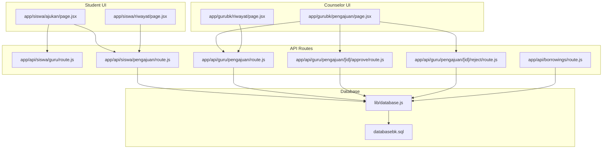
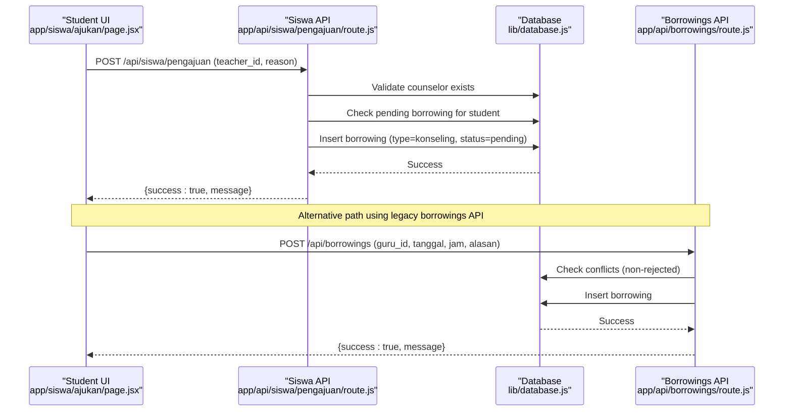
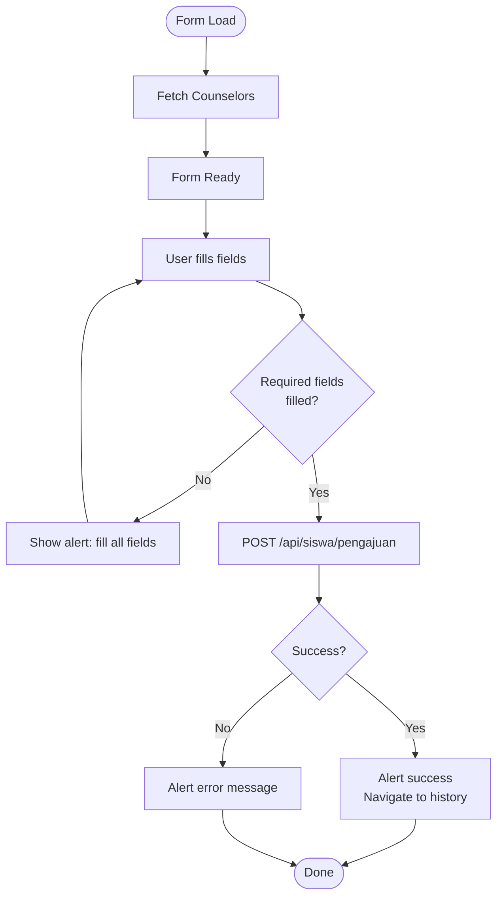
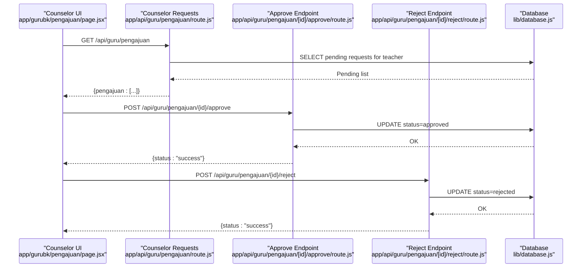
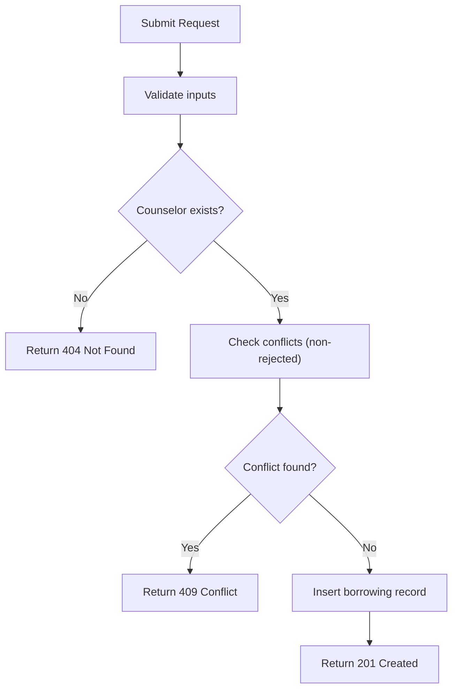
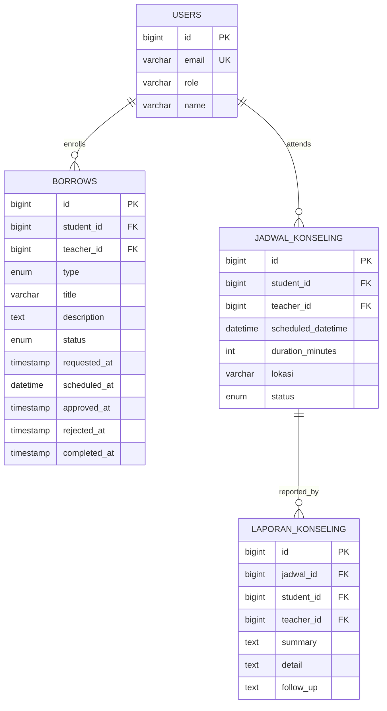
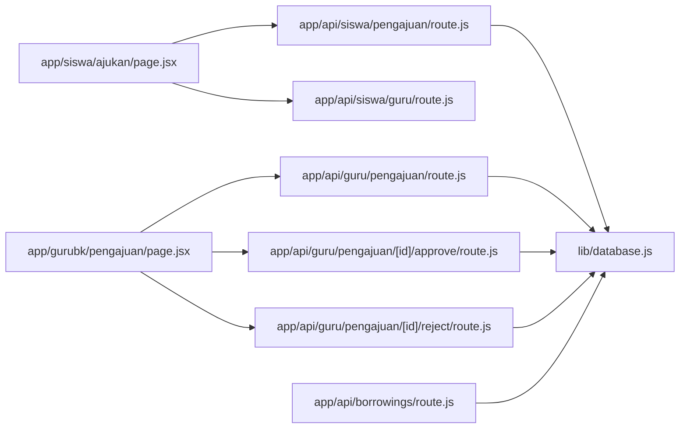

# Appointment Request System

<cite>
**Referenced Files in This Document**
- [page.jsx](file://app/siswa/ajukan/page.jsx)
- [route.js](file://app/api/siswa/pengajuan/route.js)
- [route.js](file://app/api/siswa/guru/route.js)
- [page.jsx](file://app/gurubk/pengajuan/page.jsx)
- [route.js](file://app/api/guru/pengajuan/route.js)
- [route.js](file://app/api/guru/pengajuan/[id]/approve/route.js)
- [route.js](file://app/api/guru/pengajuan/[id]/reject/route.js)
- [page.jsx](file://app/siswa/riwayat/page.jsx)
- [page.jsx](file://app/gurubk/riwayat/page.jsx)
- [route.js](file://app/api/borrowings/route.js)
- [database.js](file://lib/database.js)
- [databasebk.sql](file://databasebk.sql)
</cite>

## Table of Contents
1. [Introduction](#introduction)
2. [Project Structure](#project-structure)
3. [Core Components](#core-components)
4. [Architecture Overview](#architecture-overview)
5. [Detailed Component Analysis](#detailed-component-analysis)
6. [Dependency Analysis](#dependency-analysis)
7. [Performance Considerations](#performance-considerations)
8. [Troubleshooting Guide](#troubleshooting-guide)
9. [Conclusion](#conclusion)

## Introduction
This document describes the student appointment request system for counseling sessions. It covers the form interface for submitting requests (including date/time selection, reason description, and counselor preferences), validation rules, submission workflow, and response handling. It also documents integration with the borrowing system, conflict detection, and the approval process for counselors. Examples of form fields, validation rules, success/error states, and user feedback mechanisms are included.

## Project Structure
The system spans frontend pages and backend API routes:
- Student-facing request form and history pages
- Counselor-facing approval pages and endpoints
- Shared borrowing model for storing requests and scheduling
- Database schema supporting users, profiles, borrowing requests, schedules, and reports

**Diagram sources**
- [page.jsx](file://app/siswa/ajukan/page.jsx)
- [route.js](file://app/api/siswa/pengajuan/route.js)
- [route.js](file://app/api/siswa/guru/route.js)
- [page.jsx](file://app/gurubk/pengajuan/page.jsx)
- [route.js](file://app/api/guru/pengajuan/route.js)
- [route.js](file://app/api/guru/pengajuan/[id]/approve/route.js)
- [route.js](file://app/api/guru/pengajuan/[id]/reject/route.js)
- [page.jsx](file://app/siswa/riwayat/page.jsx)
- [page.jsx](file://app/gurubk/riwayat/page.jsx)
- [route.js](file://app/api/borrowings/route.js)
- [database.js](file://lib/database.js)
- [databasebk.sql](file://databasebk.sql)

**Section sources**
- [page.jsx](file://app/siswa/ajukan/page.jsx)
- [route.js](file://app/api/siswa/pengajuan/route.js)
- [route.js](file://app/api/siswa/guru/route.js)
- [page.jsx](file://app/gurubk/pengajuan/page.jsx)
- [route.js](file://app/api/guru/pengajuan/route.js)
- [route.js](file://app/api/guru/pengajuan/[id]/approve/route.js)
- [route.js](file://app/api/guru/pengajuan/[id]/reject/route.js)
- [page.jsx](file://app/siswa/riwayat/page.jsx)
- [page.jsx](file://app/gurubk/riwayat/page.jsx)
- [route.js](file://app/api/borrowings/route.js)
- [database.js](file://lib/database.js)
- [databasebk.sql](file://databasebk.sql)

## Core Components
- Student request form: collects counselor selection, preferred date/time, and reason, validates locally and submits to the backend.
- Backend request endpoint: validates session, ensures counselor exists, checks for pending borrowing requests, and inserts a new borrowing record with status pending.
- Counselor approval panel: lists pending requests assigned to the logged-in counselor and allows approve/reject actions.
- Borrowing system integration: uses a unified borrowing table to track requests and their statuses.
- Conflict detection: prevents double-booking by checking existing non-rejected entries for the same counselor and time slot.
- History pages: show student and counselor request histories with status badges and timestamps.

**Section sources**
- [page.jsx](file://app/siswa/ajukan/page.jsx)
- [route.js](file://app/api/siswa/pengajuan/route.js)
- [route.js](file://app/api/siswa/guru/route.js)
- [page.jsx](file://app/gurubk/pengajuan/page.jsx)
- [route.js](file://app/api/guru/pengajuan/route.js)
- [route.js](file://app/api/guru/pengajuan/[id]/approve/route.js)
- [route.js](file://app/api/guru/pengajuan/[id]/reject/route.js)
- [route.js](file://app/api/borrowings/route.js)
- [page.jsx](file://app/siswa/riwayat/page.jsx)
- [page.jsx](file://app/gurubk/riwayat/page.jsx)

## Architecture Overview
The system follows a client-server pattern with React client pages and Next.js API routes. Data persistence uses a MySQL database accessed via a shared query utility. Requests are stored in a borrowing table with distinct types and statuses. Counselors approve or reject pending requests, which updates the borrowing record accordingly.

**Diagram sources**
- [page.jsx](file://app/siswa/ajukan/page.jsx)
- [route.js](file://app/api/siswa/pengajuan/route.js)
- [route.js](file://app/api/borrowings/route.js)
- [database.js](file://lib/database.js)

## Detailed Component Analysis

### Student Request Form
- Fields:
  - Counselor selection: dropdown populated from the counselor list endpoint.
  - Preferred date/time: datetime-local input.
  - Reason: multiline text area.
- Validation:
  - Client-side: prevents submission if any required field is empty.
  - Server-side: requires counselor existence and non-empty reason; blocks submissions if the student has a pending borrowing.
- Submission:
  - Sends a POST request to the student request endpoint with teacher_id, reason, and preferred_datetime.
  - On success, shows an alert and navigates to the student history page; otherwise shows an error alert.
- User feedback:
  - Loading indicators during counselor list fetch and submission.
  - Alerts for success and error messages returned by the backend.

**Diagram sources**
- [page.jsx](file://app/siswa/ajukan/page.jsx)
- [route.js](file://app/api/siswa/pengajuan/route.js)

**Section sources**
- [page.jsx](file://app/siswa/ajukan/page.jsx)
- [route.js](file://app/api/siswa/pengajuan/route.js)

### Counselor Approval Panel
- Retrieves pending requests assigned to the logged-in counselor via the counselor request endpoint.
- Provides Approve and Reject buttons for each pending request.
- On action, posts to the respective approve/reject endpoint and removes the item from the list.

**Diagram sources**
- [page.jsx](file://app/gurubk/pengajuan/page.jsx)
- [route.js](file://app/api/guru/pengajuan/route.js)
- [route.js](file://app/api/guru/pengajuan/[id]/approve/route.js)
- [route.js](file://app/api/guru/pengajuan/[id]/reject/route.js)
- [database.js](file://lib/database.js)

**Section sources**
- [page.jsx](file://app/gurubk/pengajuan/page.jsx)
- [route.js](file://app/api/guru/pengajuan/route.js)
- [route.js](file://app/api/guru/pengajuan/[id]/approve/route.js)
- [route.js](file://app/api/guru/pengajuan/[id]/reject/route.js)

### Borrowing System Integration and Conflict Detection
- Unified borrowing table supports multiple types (konseling, pinjam, lainnya) and statuses (pending, approved, rejected, completed).
- Conflict detection prevents double-booking by excluding rejected records when checking for existing bookings at the same time and for the same counselor.
- The system integrates with two submission paths:
  - New student request endpoint writes to the borrowing table with type konseling and status pending.
  - Legacy borrowings endpoint validates inputs, checks conflicts, and inserts borrowing records.

**Diagram sources**
- [route.js](file://app/api/siswa/pengajuan/route.js)
- [route.js](file://app/api/borrowings/route.js)
- [database.js](file://lib/database.js)
- [databasebk.sql](file://databasebk.sql)

**Section sources**
- [route.js](file://app/api/siswa/pengajuan/route.js)
- [route.js](file://app/api/borrowings/route.js)
- [database.js](file://lib/database.js)
- [databasebk.sql](file://databasebk.sql)

### Data Model Overview
The borrowing table stores request metadata, status, and timestamps. Additional related tables support scheduling, reports, and notes.

**Diagram sources**
- [databasebk.sql](file://databasebk.sql)

**Section sources**
- [databasebk.sql](file://databasebk.sql)

## Dependency Analysis
- Frontend pages depend on NextAuth session management and Next.js routing.
- API routes depend on the shared database query utility and NextAuth session extraction.
- The borrowing endpoint depends on the database pool and performs SQL queries to validate counselors, check conflicts, and insert records.
- Counselor endpoints depend on session validation and join queries to present pending requests.

**Diagram sources**
- [page.jsx](file://app/siswa/ajukan/page.jsx)
- [route.js](file://app/api/siswa/pengajuan/route.js)
- [route.js](file://app/api/siswa/guru/route.js)
- [page.jsx](file://app/gurubk/pengajuan/page.jsx)
- [route.js](file://app/api/guru/pengajuan/route.js)
- [route.js](file://app/api/guru/pengajuan/[id]/approve/route.js)
- [route.js](file://app/api/guru/pengajuan/[id]/reject/route.js)
- [route.js](file://app/api/borrowings/route.js)
- [database.js](file://lib/database.js)

**Section sources**
- [page.jsx](file://app/siswa/ajukan/page.jsx)
- [route.js](file://app/api/siswa/pengajuan/route.js)
- [route.js](file://app/api/siswa/guru/route.js)
- [page.jsx](file://app/gurubk/pengajuan/page.jsx)
- [route.js](file://app/api/guru/pengajuan/route.js)
- [route.js](file://app/api/guru/pengajuan/[id]/approve/route.js)
- [route.js](file://app/api/guru/pengajuan/[id]/reject/route.js)
- [route.js](file://app/api/borrowings/route.js)
- [database.js](file://lib/database.js)

## Performance Considerations
- Database connections are pooled and reused via a shared query utility.
- Indexes exist on frequently queried columns (users role/email, borrows student/teacher/status) to improve lookup performance.
- Dynamic route settings ensure fresh data retrieval for counselor request lists.
- Consider adding pagination for counselor request lists and student history if datasets grow large.

[No sources needed since this section provides general guidance]

## Troubleshooting Guide
Common issues and resolutions:
- Unauthorized access: Ensure the user role is validated on both client and server; redirect unauthenticated users appropriately.
- Missing counselor: Verify the counselor ID exists and belongs to a user with role guru.
- Pending request conflict: Prevent submission if the student already has a pending borrowing; prompt the user to resolve the conflict first.
- Conflict detection failures: Confirm that the conflict check excludes rejected records and matches the same counselor and time slot.
- Server errors: Inspect server logs for detailed error messages returned by the backend.

**Section sources**
- [route.js](file://app/api/siswa/pengajuan/route.js)
- [route.js](file://app/api/borrowings/route.js)
- [database.js](file://lib/database.js)

## Conclusion
The appointment request system provides a streamlined workflow for students to submit counseling requests, with robust validation, conflict detection, and a clear approval process for counselors. The unified borrowing model centralizes request management, while separate UIs serve student and counselor needs effectively. Extending the system could involve adding scheduling confirmations, notifications, and richer reporting capabilities.