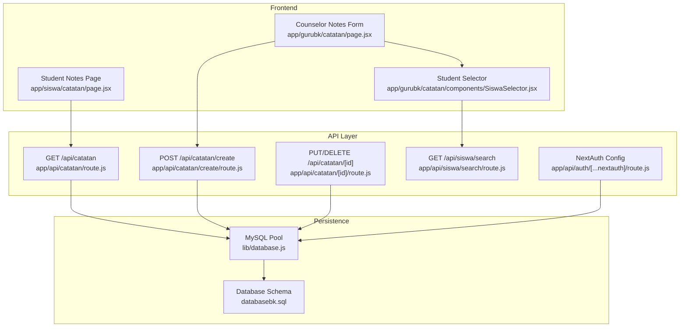
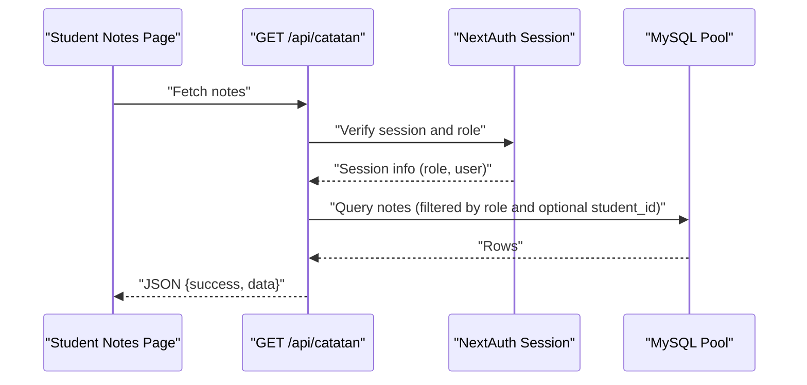
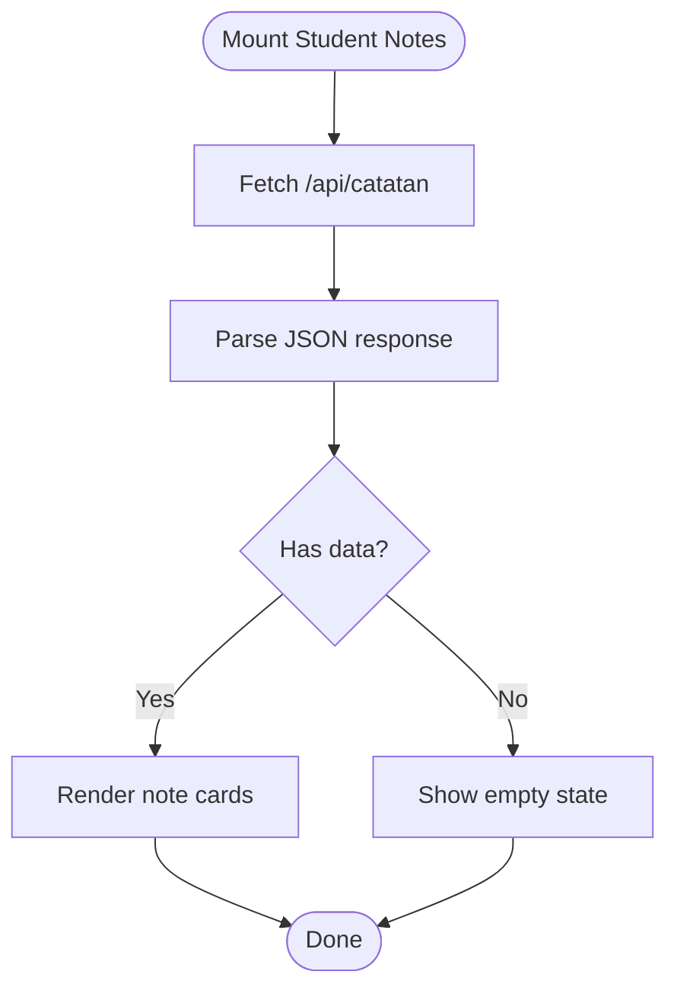
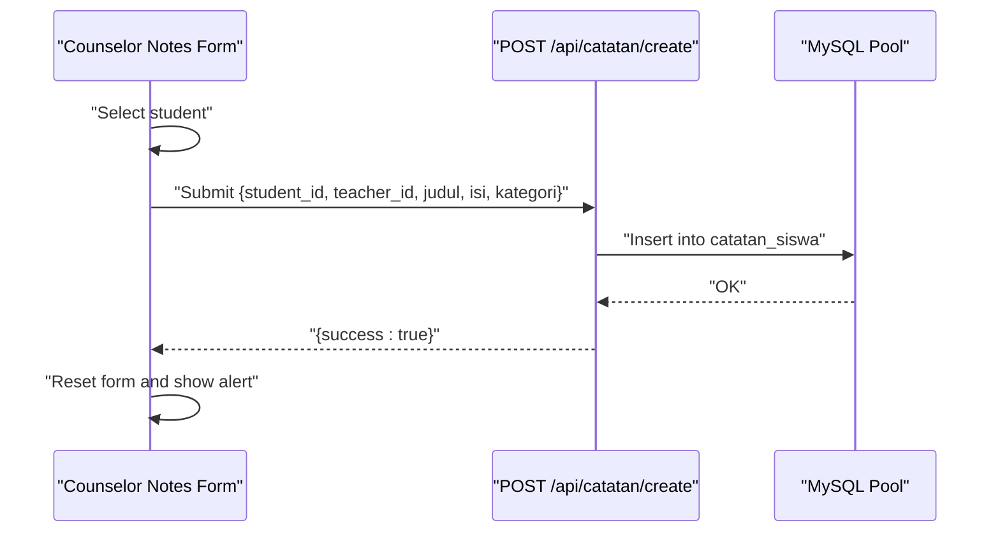
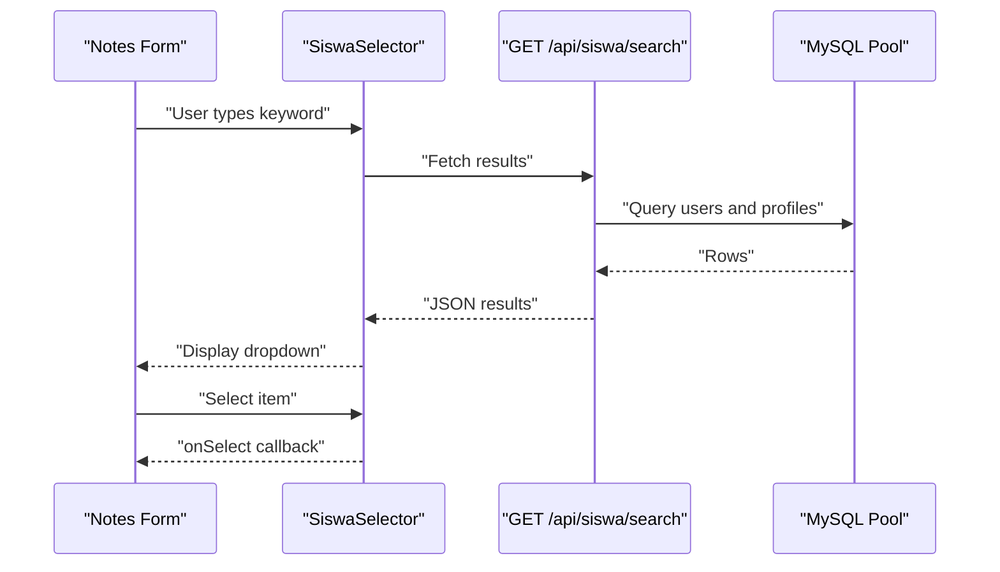
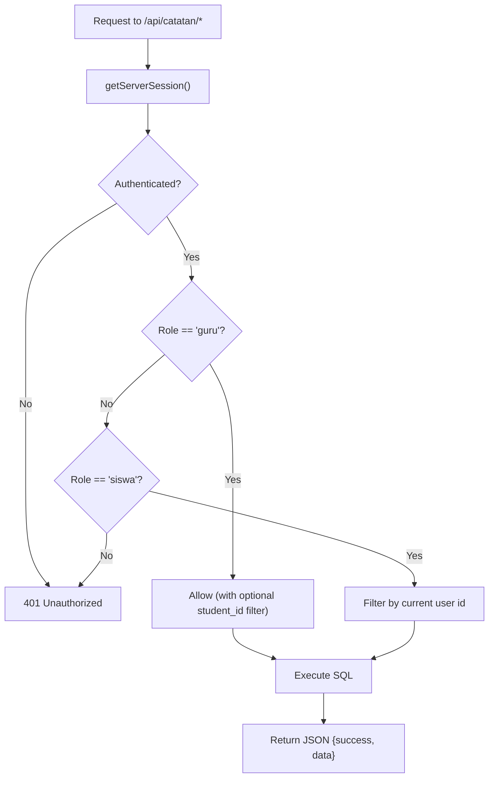
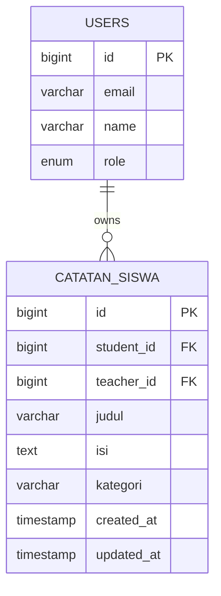
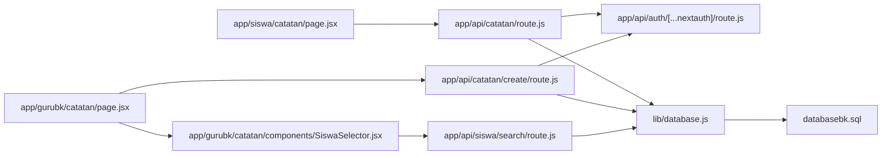

# Personal Notes & Documentation

<cite>
**Referenced Files in This Document**
- [app/siswa/catatan/page.jsx](file://app/siswa/catatan/page.jsx)
- [app/gurubk/catatan/page.jsx](file://app/gurubk/catatan/page.jsx)
- [app/gurubk/catatan/components/SiswaSelector.jsx](file://app/gurubk/catatan/components/SiswaSelector.jsx)
- [app/api/catatan/route.js](file://app/api/catatan/route.js)
- [app/api/catatan/create/route.js](file://app/api/catatan/create/route.js)
- [app/api/catatan/[id]/route.js](file://app/api/catatan/[id]/route.js)
- [app/api/siswa/search/route.js](file://app/api/siswa/search/route.js)
- [app/api/auth/[...nextauth]/route.js](file://app/api/auth/[...nextauth]/route.js)
- [lib/database.js](file://lib/database.js)
- [databasebk.sql](file://databasebk.sql)
</cite>

## Table of Contents
1. [Introduction](#introduction)
2. [Project Structure](#project-structure)
3. [Core Components](#core-components)
4. [Architecture Overview](#architecture-overview)
5. [Detailed Component Analysis](#detailed-component-analysis)
6. [Dependency Analysis](#dependency-analysis)
7. [Performance Considerations](#performance-considerations)
8. [Troubleshooting Guide](#troubleshooting-guide)
9. [Conclusion](#conclusion)

## Introduction
This document describes the student personal notes and documentation system. It covers how counselors and teachers create, view, edit, and delete notes; how notes are categorized; how search works for selecting students; and how privacy and access control are enforced via authentication and authorization. It also explains the integration with the /api/catatan endpoints, note rendering, and attachment handling, along with privacy controls and export options.

## Project Structure
The notes system spans frontend React pages, a shared student selector component, and backend API routes. Authentication is handled centrally, and database access is abstracted through a MySQL connection pool.

**Diagram sources**
- [app/siswa/catatan/page.jsx:1-41](file://app/siswa/catatan/page.jsx#L1-L41)
- [app/gurubk/catatan/page.jsx:1-128](file://app/gurubk/catatan/page.jsx#L1-L128)
- [app/gurubk/catatan/components/SiswaSelector.jsx:1-78](file://app/gurubk/catatan/components/SiswaSelector.jsx#L1-L78)
- [app/api/catatan/route.js:1-49](file://app/api/catatan/route.js#L1-L49)
- [app/api/catatan/create/route.js:1-24](file://app/api/catatan/create/route.js#L1-L24)
- [app/api/catatan/[id]/route.js:1-45](file://app/api/catatan/[id]/route.js#L1-L45)
- [app/api/siswa/search/route.js:1-20](file://app/api/siswa/search/route.js#L1-L20)
- [app/api/auth/[...nextauth]/route.js:1-101](file://app/api/auth/[...nextauth]/route.js#L1-L101)
- [lib/database.js:1-23](file://lib/database.js#L1-L23)
- [databasebk.sql:126-140](file://databasebk.sql#L126-L140)

**Section sources**
- [app/siswa/catatan/page.jsx:1-41](file://app/siswa/catatan/page.jsx#L1-L41)
- [app/gurubk/catatan/page.jsx:1-128](file://app/gurubk/catatan/page.jsx#L1-L128)
- [app/gurubk/catatan/components/SiswaSelector.jsx:1-78](file://app/gurubk/catatan/components/SiswaSelector.jsx#L1-L78)
- [app/api/catatan/route.js:1-49](file://app/api/catatan/route.js#L1-L49)
- [app/api/catatan/create/route.js:1-24](file://app/api/catatan/create/route.js#L1-L24)
- [app/api/catatan/[id]/route.js:1-45](file://app/api/catatan/[id]/route.js#L1-L45)
- [app/api/siswa/search/route.js:1-20](file://app/api/siswa/search/route.js#L1-L20)
- [app/api/auth/[...nextauth]/route.js:1-101](file://app/api/auth/[...nextauth]/route.js#L1-L101)
- [lib/database.js:1-23](file://lib/database.js#L1-L23)
- [databasebk.sql:126-140](file://databasebk.sql#L126-L140)

## Core Components
- Student Notes View: Fetches and renders notes for the logged-in student, displaying title, category, content, author, and creation date.
- Counselor Notes Creation: Provides a form to create notes for a selected student, including category selection and submission handling.
- Student Selector: Implements live search for students by name or NIS, returning selectable results.
- API Endpoints:
  - GET /api/catatan: Lists notes filtered by role and optionally by student ID.
  - POST /api/catatan/create: Creates a new note.
  - PUT/DELETE /api/catatan/[id]: Updates or deletes a note by the teacher who owns it.
  - GET /api/siswa/search: Searches students by name or NIS.
- Authentication and Authorization: Uses NextAuth with JWT to enforce role-based access and session-aware requests.

**Section sources**
- [app/siswa/catatan/page.jsx:6-40](file://app/siswa/catatan/page.jsx#L6-L40)
- [app/gurubk/catatan/page.jsx:9-127](file://app/gurubk/catatan/page.jsx#L9-L127)
- [app/gurubk/catatan/components/SiswaSelector.jsx:4-77](file://app/gurubk/catatan/components/SiswaSelector.jsx#L4-L77)
- [app/api/catatan/route.js:5-48](file://app/api/catatan/route.js#L5-L48)
- [app/api/catatan/create/route.js:4-23](file://app/api/catatan/create/route.js#L4-L23)
- [app/api/catatan/[id]/route.js:5-44](file://app/api/catatan/[id]/route.js#L5-L44)
- [app/api/siswa/search/route.js:4-19](file://app/api/siswa/search/route.js#L4-L19)
- [app/api/auth/[...nextauth]/route.js:6-96](file://app/api/auth/[...nextauth]/route.js#L6-L96)

## Architecture Overview
The system follows a client-server pattern:
- Client-side React pages fetch data from Next.js API routes.
- API routes validate sessions and roles, then query the database via a shared pool.
- The database stores notes, users, and related profiles.

**Diagram sources**
- [app/siswa/catatan/page.jsx:9-16](file://app/siswa/catatan/page.jsx#L9-L16)
- [app/api/catatan/route.js:7-43](file://app/api/catatan/route.js#L7-L43)
- [app/api/auth/[...nextauth]/route.js:57-88](file://app/api/auth/[...nextauth]/route.js#L57-L88)
- [lib/database.js:13-21](file://lib/database.js#L13-L21)

## Detailed Component Analysis

### Student Notes View
- Fetches notes on mount from /api/catatan.
- Renders each note with title, category, content, author name, and creation timestamp.
- Enforced privacy: only the logged-in student’s notes are returned when role is "siswa".

**Diagram sources**
- [app/siswa/catatan/page.jsx:9-36](file://app/siswa/catatan/page.jsx#L9-L36)
- [app/api/catatan/route.js:22-26](file://app/api/catatan/route.js#L22-L26)

**Section sources**
- [app/siswa/catatan/page.jsx:6-40](file://app/siswa/catatan/page.jsx#L6-L40)
- [app/api/catatan/route.js:22-26](file://app/api/catatan/route.js#L22-L26)

### Counselor Notes Creation
- Provides a form to select a student, enter title, content, and choose a category.
- Submits to POST /api/catatan/create with student_id, teacher_id, title, content, and category.
- On success, clears the form and shows a confirmation.

**Diagram sources**
- [app/gurubk/catatan/page.jsx:15-43](file://app/gurubk/catatan/page.jsx#L15-L43)
- [app/api/catatan/create/route.js:9-15](file://app/api/catatan/create/route.js#L9-L15)

**Section sources**
- [app/gurubk/catatan/page.jsx:9-127](file://app/gurubk/catatan/page.jsx#L9-L127)
- [app/api/catatan/create/route.js:4-23](file://app/api/catatan/create/route.js#L4-L23)

### Student Selector (Live Search)
- Implements live search by name or NIS via GET /api/siswa/search.
- Displays a dropdown with selectable results; on selection, updates the form with student info.

**Diagram sources**
- [app/gurubk/catatan/components/SiswaSelector.jsx:8-42](file://app/gurubk/catatan/components/SiswaSelector.jsx#L8-L42)
- [app/api/siswa/search/route.js:7-18](file://app/api/siswa/search/route.js#L7-L18)
- [lib/database.js:13-21](file://lib/database.js#L13-L21)

**Section sources**
- [app/gurubk/catatan/components/SiswaSelector.jsx:4-77](file://app/gurubk/catatan/components/SiswaSelector.jsx#L4-L77)
- [app/api/siswa/search/route.js:4-19](file://app/api/siswa/search/route.js#L4-L19)

### API Endpoints and Privacy Controls
- GET /api/catatan:
  - Requires authentication.
  - Role-based filtering:
    - "siswa": returns only their own notes.
    - "guru": returns their own notes; optional student_id filter supported.
  - Sorts by created_at descending.
- POST /api/catatan/create:
  - Inserts a new note with provided fields.
- PUT /api/catatan/[id]:
  - Updates a note owned by the authenticated teacher.
- DELETE /api/catatan/[id]:
  - Deletes a note owned by the authenticated teacher.
- Authentication:
  - NextAuth with JWT strategy.
  - Session includes role and user identity for server-side checks.

**Diagram sources**
- [app/api/catatan/route.js:7-43](file://app/api/catatan/route.js#L7-L43)
- [app/api/catatan/[id]/route.js:7-43](file://app/api/catatan/[id]/route.js#L7-L43)
- [app/api/auth/[...nextauth]/route.js:57-88](file://app/api/auth/[...nextauth]/route.js#L57-L88)

**Section sources**
- [app/api/catatan/route.js:5-48](file://app/api/catatan/route.js#L5-L48)
- [app/api/catatan/create/route.js:4-23](file://app/api/catatan/create/route.js#L4-L23)
- [app/api/catatan/[id]/route.js:5-44](file://app/api/catatan/[id]/route.js#L5-L44)
- [app/api/auth/[...nextauth]/route.js:6-96](file://app/api/auth/[...nextauth]/route.js#L6-L96)

### Data Model and Categories
- Notes table schema supports:
  - student_id, teacher_id, title, content, category, timestamps.
- Categories exposed in the counselor form include: personal, behavior, attendance, academics, others.

**Diagram sources**
- [databasebk.sql:126-140](file://databasebk.sql#L126-L140)

**Section sources**
- [databasebk.sql:126-140](file://databasebk.sql#L126-L140)
- [app/gurubk/catatan/page.jsx:101-114](file://app/gurubk/catatan/page.jsx#L101-L114)

## Dependency Analysis
- Frontend pages depend on:
  - NextAuth session for role checks.
  - API routes for CRUD operations.
  - Shared components for UX consistency.
- API routes depend on:
  - NextAuth for session validation.
  - Database pool for queries.
- Database depends on:
  - Users and notes tables with foreign keys.

**Diagram sources**
- [app/siswa/catatan/page.jsx:10-13](file://app/siswa/catatan/page.jsx#L10-L13)
- [app/gurubk/catatan/page.jsx:23-33](file://app/gurubk/catatan/page.jsx#L23-L33)
- [app/gurubk/catatan/components/SiswaSelector.jsx:17-36](file://app/gurubk/catatan/components/SiswaSelector.jsx#L17-L36)
- [app/api/catatan/route.js:7-43](file://app/api/catatan/route.js#L7-L43)
- [app/api/catatan/create/route.js:6-13](file://app/api/catatan/create/route.js#L6-L13)
- [app/api/siswa/search/route.js:7-18](file://app/api/siswa/search/route.js#L7-L18)
- [app/api/auth/[...nextauth]/route.js:7-49](file://app/api/auth/[...nextauth]/route.js#L7-L49)
- [lib/database.js:3-21](file://lib/database.js#L3-L21)
- [databasebk.sql:126-140](file://databasebk.sql#L126-L140)

**Section sources**
- [app/siswa/catatan/page.jsx:10-13](file://app/siswa/catatan/page.jsx#L10-L13)
- [app/gurubk/catatan/page.jsx:23-33](file://app/gurubk/catatan/page.jsx#L23-L33)
- [app/gurubk/catatan/components/SiswaSelector.jsx:17-36](file://app/gurubk/catatan/components/SiswaSelector.jsx#L17-L36)
- [app/api/catatan/route.js:7-43](file://app/api/catatan/route.js#L7-L43)
- [app/api/catatan/create/route.js:6-13](file://app/api/catatan/create/route.js#L6-L13)
- [app/api/siswa/search/route.js:7-18](file://app/api/siswa/search/route.js#L7-L18)
- [app/api/auth/[...nextauth]/route.js:7-49](file://app/api/auth/[...nextauth]/route.js#L7-L49)
- [lib/database.js:3-21](file://lib/database.js#L3-L21)
- [databasebk.sql:126-140](file://databasebk.sql#L126-L140)

## Performance Considerations
- Indexes on catatan_siswa (student_id, teacher_id) improve filtering and join performance.
- Limit search results (e.g., limit 10) to reduce payload size.
- Prefer server-side filtering by role and optional student_id to minimize client-side processing.
- Use pagination for large datasets if needed.

**Section sources**
- [databasebk.sql:199-211](file://databasebk.sql#L199-L211)
- [app/api/siswa/search/route.js:15](file://app/api/siswa/search/route.js#L15)
- [app/api/catatan/route.js:22-37](file://app/api/catatan/route.js#L22-L37)

## Troubleshooting Guide
- Unauthorized Access:
  - Symptom: 401 responses from /api/catatan endpoints.
  - Cause: Missing or invalid session.
  - Resolution: Ensure user is logged in and role is set correctly.
- Role Restrictions:
  - Symptom: Students cannot see other students’ notes; counselors cannot edit/delete others’ notes.
  - Cause: Server-side role checks.
  - Resolution: Verify session.user.role and ownership conditions.
- Network/API Errors:
  - Symptom: Empty results or errors in student search.
  - Cause: API failure or JSON parse issues.
  - Resolution: Check network tab, verify API availability, and handle non-OK responses gracefully.
- Database Errors:
  - Symptom: Internal server errors on create/update/delete.
  - Cause: SQL exceptions or constraint violations.
  - Resolution: Inspect logs and ensure required fields are provided.

**Section sources**
- [app/api/catatan/route.js:8-10](file://app/api/catatan/route.js#L8-L10)
- [app/api/catatan/[id]/route.js:8-10](file://app/api/catatan/[id]/route.js#L8-L10)
- [app/gurubk/catatan/components/SiswaSelector.jsx:16-41](file://app/gurubk/catatan/components/SiswaSelector.jsx#L16-L41)
- [app/api/catatan/create/route.js:16-22](file://app/api/catatan/create/route.js#L16-L22)

## Conclusion
The personal notes and documentation system provides a secure, role-aware interface for students and counselors. Students can view their own notes, while counselors can create, update, and delete notes for selected students. Search functionality streamlines student selection, and privacy controls ensure appropriate access. The backend APIs integrate with NextAuth and a MySQL database to maintain data integrity and performance.