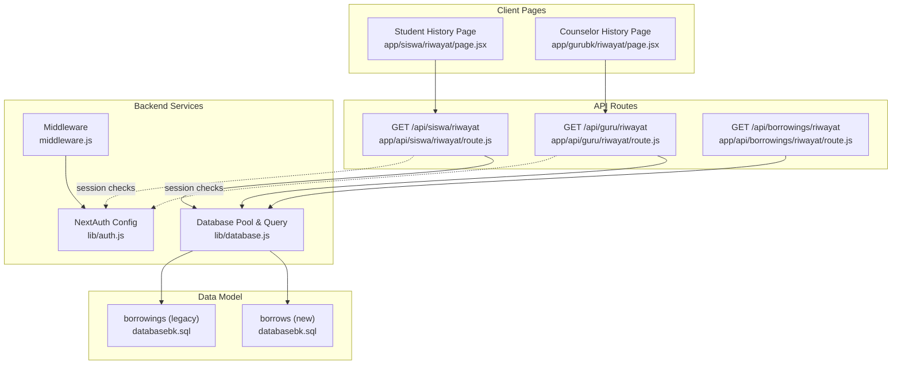
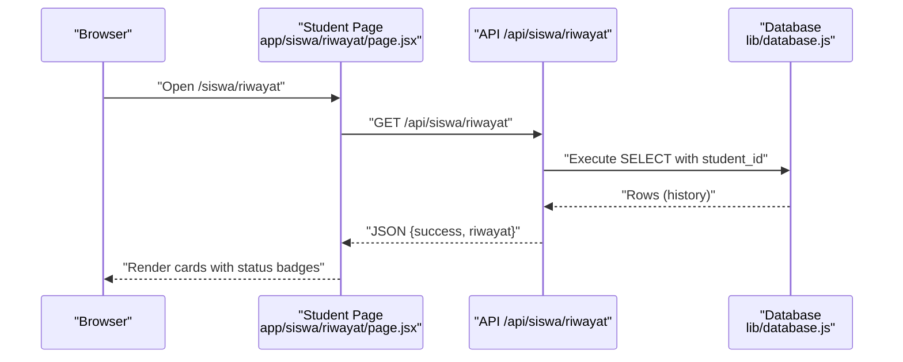
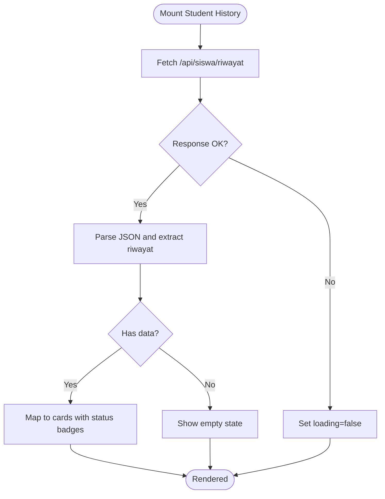
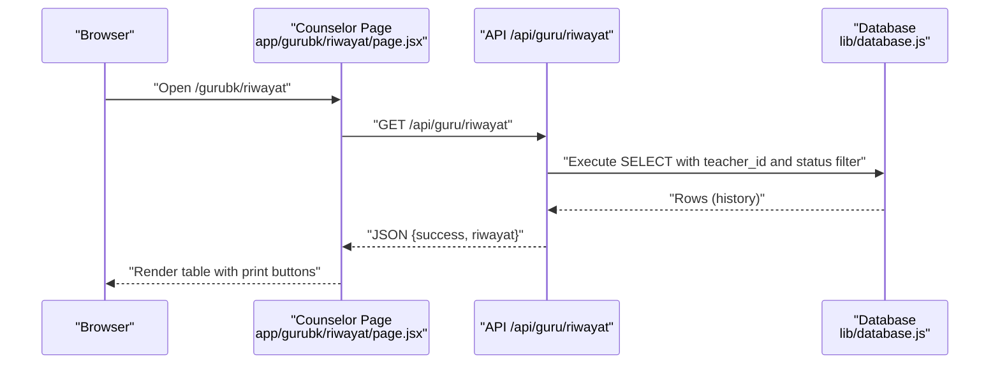
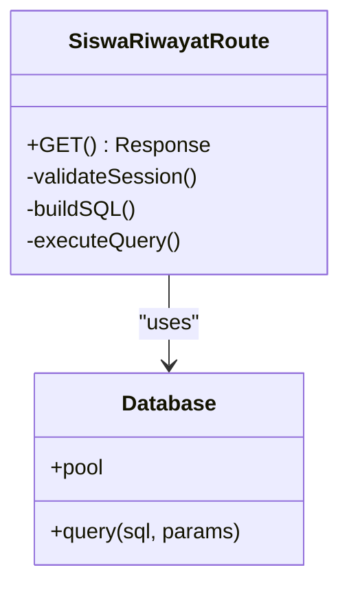
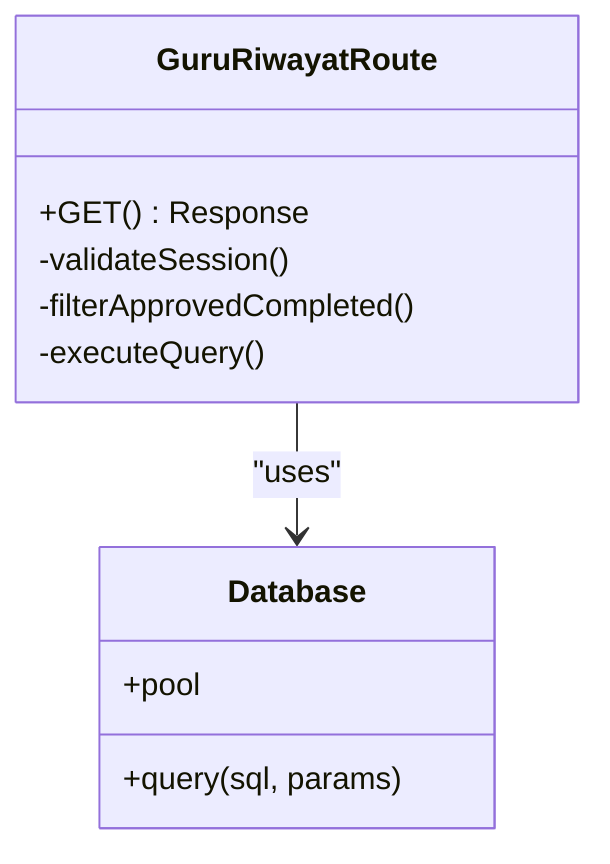
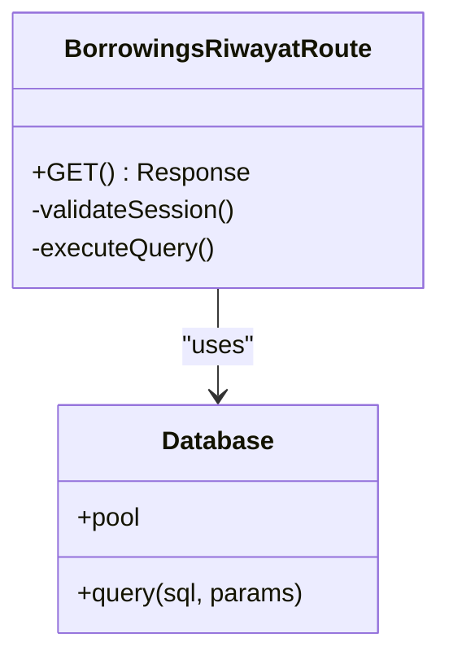
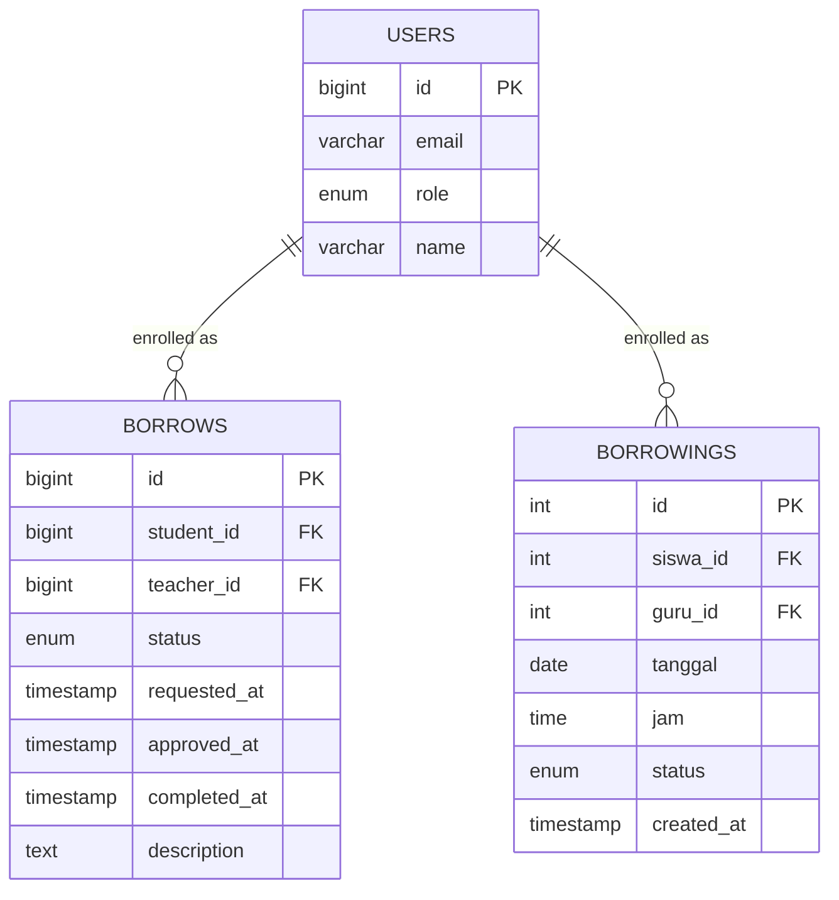
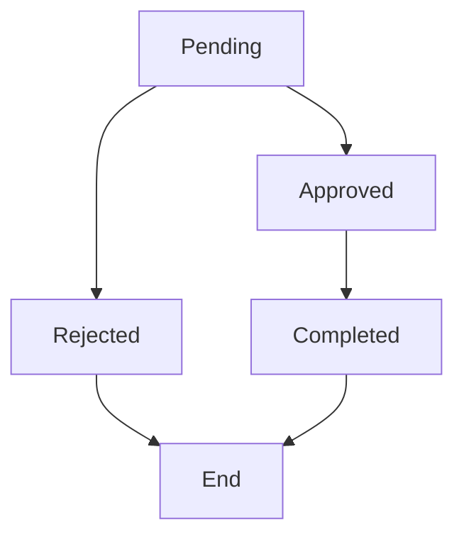
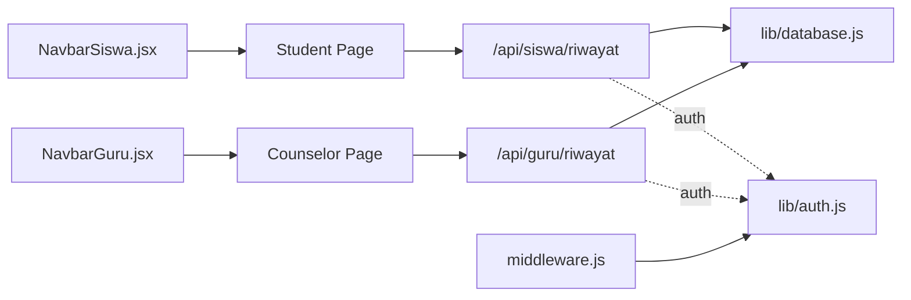

# Progress Tracking & History

<cite>
**Referenced Files in This Document**
- [page.jsx](file://app/siswa/riwayat/page.jsx)
- [page.jsx](file://app/gurubk/riwayat/page.jsx)
- [route.js](file://app/api/siswa/riwayat/route.js)
- [route.js](file://app/api/guru/riwayat/route.js)
- [route.js](file://app/api/borrowings/riwayat/route.js)
- [database.js](file://lib/database.js)
- [databasebk.sql](file://databasebk.sql)
- [auth.js](file://lib/auth.js)
- [middleware.js](file://middleware.js)
- [NavbarSiswa.jsx](file://components/NavbarSiswa.jsx)
- [NavbarGuru.jsx](file://components/NavbarGuru.jsx)
</cite>

## Table of Contents
1. [Introduction](#introduction)
2. [Project Structure](#project-structure)
3. [Core Components](#core-components)
4. [Architecture Overview](#architecture-overview)
5. [Detailed Component Analysis](#detailed-component-analysis)
6. [Dependency Analysis](#dependency-analysis)
7. [Performance Considerations](#performance-considerations)
8. [Troubleshooting Guide](#troubleshooting-guide)
9. [Conclusion](#conclusion)

## Introduction
This document describes the student progress tracking and history system for counseling sessions. It focuses on:
- Appointment history interface for students and counselors
- Status tracking (pending, approved, completed)
- Timeline visualization of session events
- Data retrieval via REST endpoints
- Filtering and pagination considerations
- Session details presentation and navigation

The system supports two primary views:
- Student view: personal history cards with status badges and timestamps
- Counselor view: tabular history with printable summaries

## Project Structure
The history system spans frontend pages, API routes, and shared database utilities. Key locations:
- Student history page: app/siswa/riwayat/page.jsx
- Counselor history page: app/gurubk/riwayat/page.jsx
- API endpoints:
  - Student history: app/api/siswa/riwayat/route.js
  - Counselor history: app/api/guru/riwayat/route.js
  - Legacy endpoint: app/api/borrowings/riwayat/route.js
- Shared database utilities: lib/database.js
- Authentication and middleware: lib/auth.js, middleware.js
- Navigation bars: components/NavbarSiswa.jsx, components/NavbarGuru.jsx
- Database schema: databasebk.sql

**Diagram sources**
- [page.jsx:1-127](file://app/siswa/riwayat/page.jsx#L1-L127)
- [page.jsx:1-105](file://app/gurubk/riwayat/page.jsx#L1-L105)
- [route.js:1-52](file://app/api/siswa/riwayat/route.js#L1-L52)
- [route.js:1-50](file://app/api/guru/riwayat/route.js#L1-L50)
- [route.js:1-38](file://app/api/borrowings/riwayat/route.js#L1-L38)
- [database.js:1-23](file://lib/database.js#L1-L23)
- [databasebk.sql:68-89](file://databasebk.sql#L68-L89)
- [databasebk.sql:324-338](file://databasebk.sql#L324-L338)
- [auth.js:1-77](file://lib/auth.js#L1-L77)
- [middleware.js:1-53](file://middleware.js#L1-L53)

**Section sources**
- [page.jsx:1-127](file://app/siswa/riwayat/page.jsx#L1-L127)
- [page.jsx:1-105](file://app/gurubk/riwayat/page.jsx#L1-L105)
- [route.js:1-52](file://app/api/siswa/riwayat/route.js#L1-L52)
- [route.js:1-50](file://app/api/guru/riwayat/route.js#L1-L50)
- [route.js:1-38](file://app/api/borrowings/riwayat/route.js#L1-L38)
- [database.js:1-23](file://lib/database.js#L1-L23)
- [databasebk.sql:68-89](file://databasebk.sql#L68-L89)
- [databasebk.sql:324-338](file://databasebk.sql#L324-L338)
- [auth.js:1-77](file://lib/auth.js#L1-L77)
- [middleware.js:1-53](file://middleware.js#L1-L53)

## Core Components
- Student History Page
  - Fetches data from GET /api/siswa/riwayat
  - Renders a list of session cards with status badges and timestamps
  - Uses localized date formatting for Indonesian locale
- Counselor History Page
  - Fetches data from GET /api/guru/riwayat
  - Renders a table with student name, title, completion date, summary, and print action
  - Supports PDF generation via a dedicated API route
- API Endpoints
  - Student endpoint validates role "siswa" and returns structured history
  - Counselor endpoint filters to approved/completed sessions and returns minimal fields
  - Legacy endpoint exists for backward compatibility
- Database Utilities
  - MySQL pool and query wrapper for safe SQL execution
- Authentication and Middleware
  - NextAuth JWT-based session with role-aware middleware
- Navigation Bars
  - Provide quick access to history pages for both roles

**Section sources**
- [page.jsx:7-126](file://app/siswa/riwayat/page.jsx#L7-L126)
- [page.jsx:8-104](file://app/gurubk/riwayat/page.jsx#L8-L104)
- [route.js:5-51](file://app/api/siswa/riwayat/route.js#L5-L51)
- [route.js:7-49](file://app/api/guru/riwayat/route.js#L7-L49)
- [route.js:7-37](file://app/api/borrowings/riwayat/route.js#L7-L37)
- [database.js:13-21](file://lib/database.js#L13-L21)
- [auth.js:55-75](file://lib/auth.js#L55-L75)
- [middleware.js:11-42](file://middleware.js#L11-L42)
- [NavbarSiswa.jsx:20-25](file://components/NavbarSiswa.jsx#L20-L25)
- [NavbarGuru.jsx:28-34](file://components/NavbarGuru.jsx#L28-L34)

## Architecture Overview
The system follows a clean separation of concerns:
- Frontend pages handle UI rendering and user interactions
- API routes encapsulate data retrieval and role-based filtering
- Database utilities centralize connection and query logic
- Authentication ensures secure access per role

**Diagram sources**
- [page.jsx:11-26](file://app/siswa/riwayat/page.jsx#L11-L26)
- [route.js:5-51](file://app/api/siswa/riwayat/route.js#L5-L51)
- [database.js:13-21](file://lib/database.js#L13-L21)

## Detailed Component Analysis

### Student History Page
Responsibilities:
- Fetch history on mount
- Render loading state
- Display empty state when no records
- Present each session as a card with:
  - Counselor name
  - Status badge (pending, approved, rejected, completed)
  - Requested and approval timestamps
  - Optional description

Key behaviors:
- Uses useEffect to call /api/siswa/riwayat
- Applies a helper to compute badge class based on status
- Formats dates using Indonesian locale

**Diagram sources**
- [page.jsx:11-26](file://app/siswa/riwayat/page.jsx#L11-L26)
- [page.jsx:28-39](file://app/siswa/riwayat/page.jsx#L28-L39)

**Section sources**
- [page.jsx:7-126](file://app/siswa/riwayat/page.jsx#L7-L126)

### Counselor History Page
Responsibilities:
- Fetch counselor history on mount
- Render a responsive table with:
  - Student name
  - Title
  - Completion date (localized)
  - Summary (fallback to dash if empty)
  - Print action (opens PDF route)

Key behaviors:
- Uses motion animations for row appearance
- Filters to approved/completed sessions
- Opens a PDF route for printing

**Diagram sources**
- [page.jsx:12-20](file://app/gurubk/riwayat/page.jsx#L12-L20)
- [page.jsx:49-96](file://app/gurubk/riwayat/page.jsx#L49-L96)
- [route.js:21-43](file://app/api/guru/riwayat/route.js#L21-L43)

**Section sources**
- [page.jsx:8-104](file://app/gurubk/riwayat/page.jsx#L8-L104)

### API: Student History (/api/siswa/riwayat)
- Validates session and enforces role "siswa"
- Joins borrows with users to resolve teacher name
- Returns ordered list by requested_at descending
- Handles null teacher gracefully using COALESCE

**Diagram sources**
- [route.js:5-51](file://app/api/siswa/riwayat/route.js#L5-L51)
- [database.js:13-21](file://lib/database.js#L13-L21)

**Section sources**
- [route.js:5-51](file://app/api/siswa/riwayat/route.js#L5-L51)

### API: Counselor History (/api/guru/riwayat)
- Validates session and enforces role "guru"
- Filters to approved and completed sessions
- Returns minimal fields suitable for listing
- Sets dynamic route behavior to bypass caching

**Diagram sources**
- [route.js:7-49](file://app/api/guru/riwayat/route.js#L7-L49)
- [database.js:13-21](file://lib/database.js#L13-L21)

**Section sources**
- [route.js:7-49](file://app/api/guru/riwayat/route.js#L7-L49)

### API: Legacy History (/api/borrowings/riwayat)
- Provides legacy endpoint for backward compatibility
- Returns data array under a data key
- Orders by created_at descending

**Diagram sources**
- [route.js:7-37](file://app/api/borrowings/riwayat/route.js#L7-L37)
- [database.js:13-21](file://lib/database.js#L13-L21)

**Section sources**
- [route.js:7-37](file://app/api/borrowings/riwayat/route.js#L7-L37)

### Data Model: Sessions and Timeline
The system tracks counseling sessions in two related tables:
- borrows (new): modern schema with rich timestamps and status lifecycle
- borrowings (legacy): older schema with date/time fields

Timeline visualization:
- Students see requested_at and approved_at timestamps
- Counselors see completed_at for finalized sessions
- Status transitions: pending -> approved -> completed (with rejected as applicable)

**Diagram sources**
- [databasebk.sql:68-89](file://databasebk.sql#L68-L89)
- [databasebk.sql:324-338](file://databasebk.sql#L324-L338)

**Section sources**
- [databasebk.sql:68-89](file://databasebk.sql#L68-L89)
- [databasebk.sql:324-338](file://databasebk.sql#L324-L338)

### Status Tracking and Indicators
- Student view: status badges with color-coded classes
- Counselor view: status filter applied server-side to approved/completed
- Timeline: timestamps reflect lifecycle events

[No sources needed since this diagram shows conceptual workflow, not actual code structure]

## Dependency Analysis
- Pages depend on API routes for data
- API routes depend on database utilities
- Authentication middleware protects protected routes
- Navigation bars route users to appropriate history pages

**Diagram sources**
- [page.jsx:1-127](file://app/siswa/riwayat/page.jsx#L1-L127)
- [page.jsx:1-105](file://app/gurubk/riwayat/page.jsx#L1-L105)
- [route.js:1-52](file://app/api/siswa/riwayat/route.js#L1-L52)
- [route.js:1-50](file://app/api/guru/riwayat/route.js#L1-L50)
- [database.js:1-23](file://lib/database.js#L1-L23)
- [auth.js:1-77](file://lib/auth.js#L1-L77)
- [middleware.js:1-53](file://middleware.js#L1-L53)
- [NavbarSiswa.jsx:1-191](file://components/NavbarSiswa.jsx#L1-L191)
- [NavbarGuru.jsx:1-210](file://components/NavbarGuru.jsx#L1-L210)

**Section sources**
- [page.jsx:1-127](file://app/siswa/riwayat/page.jsx#L1-L127)
- [page.jsx:1-105](file://app/gurubk/riwayat/page.jsx#L1-L105)
- [route.js:1-52](file://app/api/siswa/riwayat/route.js#L1-L52)
- [route.js:1-50](file://app/api/guru/riwayat/route.js#L1-L50)
- [database.js:1-23](file://lib/database.js#L1-L23)
- [auth.js:1-77](file://lib/auth.js#L1-L77)
- [middleware.js:1-53](file://middleware.js#L1-L53)
- [NavbarSiswa.jsx:1-191](file://components/NavbarSiswa.jsx#L1-L191)
- [NavbarGuru.jsx:1-210](file://components/NavbarGuru.jsx#L1-L210)

## Performance Considerations
- Pagination: Current implementations do not include pagination. For large histories, consider adding limit/offset or cursor-based pagination to reduce payload size and improve responsiveness.
- Indexes: Database schema includes indexes on borrows and users tables that support filtering and ordering. Ensure these remain aligned with query patterns.
- Caching: The counselor route is configured as force-dynamic; consider cache policies for read-heavy endpoints if acceptable.
- Rendering: Student cards render inline; for long lists, virtualization can improve scroll performance.

[No sources needed since this section provides general guidance]

## Troubleshooting Guide
Common issues and resolutions:
- Unauthorized Access
  - Symptom: 401 responses from history endpoints
  - Cause: Missing or invalid session/token, wrong role
  - Resolution: Verify login, ensure role is "siswa" or "guru" respectively
- Empty History
  - Symptom: Empty state messages
  - Cause: No matching records for the user or filtered statuses
  - Resolution: Confirm account associations and session lifecycle
- Date Formatting
  - Symptom: Unexpected date display
  - Cause: Locale differences or missing fallbacks
  - Resolution: Use provided localized formatting helpers
- Legacy Endpoint Differences
  - Symptom: Different response shape
  - Cause: Legacy vs new schema
  - Resolution: Prefer newer endpoints for new development

**Section sources**
- [route.js:9-15](file://app/api/siswa/riwayat/route.js#L9-L15)
- [route.js:11-13](file://app/api/guru/riwayat/route.js#L11-L13)
- [page.jsx:58-66](file://app/siswa/riwayat/page.jsx#L58-L66)
- [page.jsx:32-36](file://app/gurubk/riwayat/page.jsx#L32-L36)

## Conclusion
The progress tracking and history system provides role-specific views for counseling sessions:
- Students receive a timeline-centric card layout with status badges and localized timestamps
- Counselors get a concise table with printable summaries for approved/completed sessions
- Underlying APIs enforce role-based access and return structured data aligned with the database schema
- Future enhancements could include pagination, improved filtering, and expanded timeline details

[No sources needed since this section summarizes without analyzing specific files]