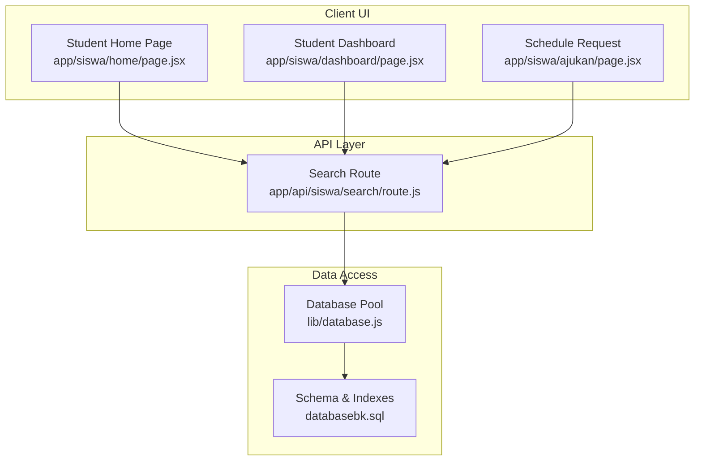
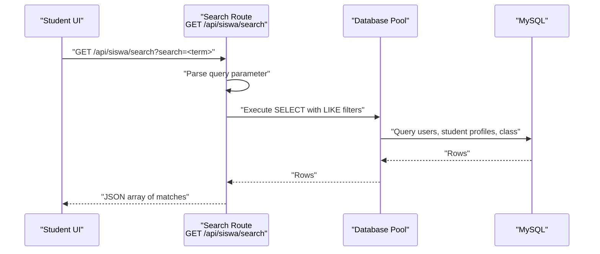
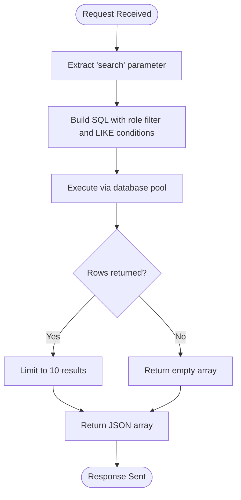
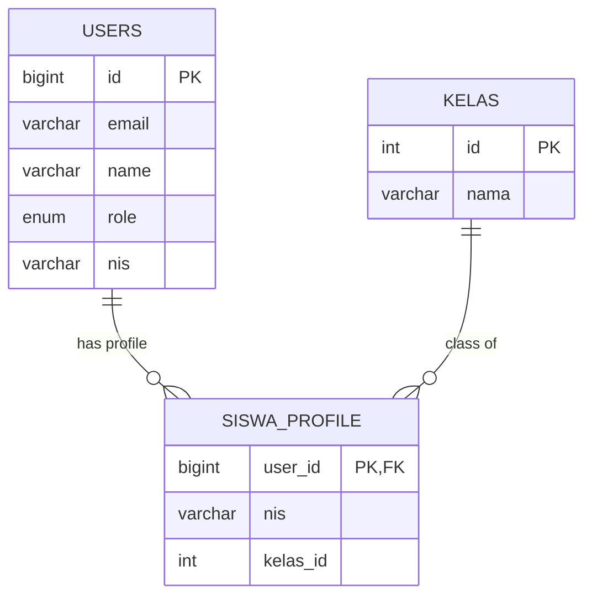
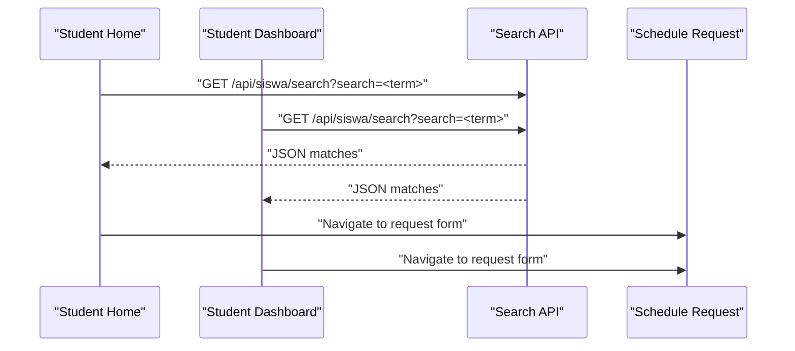
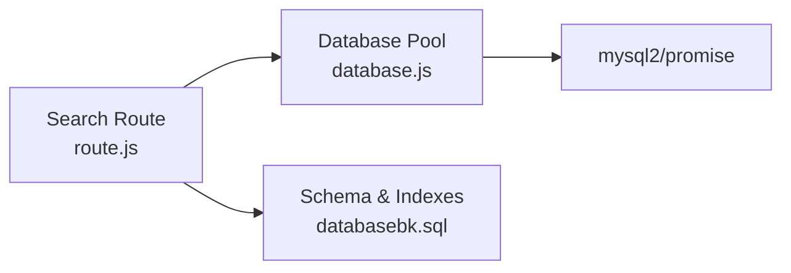

# Search & Discovery

<cite>
**Referenced Files in This Document**
- [route.js](file://app/api/siswa/search/route.js)
- [database.js](file://lib/database.js)
- [databasebk.sql](file://databasebk.sql)
- [page.jsx](file://app/siswa/home/page.jsx)
- [page.jsx](file://app/siswa/dashboard/page.jsx)
- [page.jsx](file://app/siswa/ajukan/page.jsx)
</cite>

## Table of Contents
1. [Introduction](#introduction)
2. [Project Structure](#project-structure)
3. [Core Components](#core-components)
4. [Architecture Overview](#architecture-overview)
5. [Detailed Component Analysis](#detailed-component-analysis)
6. [Dependency Analysis](#dependency-analysis)
7. [Performance Considerations](#performance-considerations)
8. [Troubleshooting Guide](#troubleshooting-guide)
9. [Conclusion](#conclusion)

## Introduction
This document explains the student search and discovery functionality implemented in the application. It focuses on the search API endpoint for finding students (not counselors or sessions as initially described), details query parameter handling, result formatting, and how the search integrates with the student user interface. It also outlines navigation from search results to detailed views and provides guidance on extending the search to support counselors and sessions in the future.

## Project Structure
The search capability is exposed via a Next.js App Router API route under `/app/api/siswa/search/route.js`. The route queries the MySQL database using a connection pool defined in `lib/database.js`. The database schema is defined in `databasebk.sql`. Student-facing pages demonstrate how search results can be integrated into the UI, particularly in the landing/home page where quick actions and navigation to scheduling are presented.

**Diagram sources**
- [route.js:1-20](file://app/api/siswa/search/route.js#L1-L20)
- [database.js:1-23](file://lib/database.js#L1-L23)
- [databasebk.sql:1-636](file://databasebk.sql#L1-L636)
- [page.jsx:1-196](file://app/siswa/home/page.jsx#L1-L196)
- [page.jsx:1-209](file://app/siswa/dashboard/page.jsx#L1-L209)
- [page.jsx:1-180](file://app/siswa/ajukan/page.jsx#L1-L180)

**Section sources**
- [route.js:1-20](file://app/api/siswa/search/route.js#L1-L20)
- [database.js:1-23](file://lib/database.js#L1-L23)
- [databasebk.sql:1-636](file://databasebk.sql#L1-L636)
- [page.jsx:1-196](file://app/siswa/home/page.jsx#L1-L196)
- [page.jsx:1-209](file://app/siswa/dashboard/page.jsx#L1-L209)
- [page.jsx:1-180](file://app/siswa/ajukan/page.jsx#L1-L180)

## Core Components
- Search API route (`/api/siswa/search`)
  - Accepts a single query parameter named `search`.
  - Performs a case-insensitive search across student names and NIS.
  - Returns a JSON array of matching student records with selected fields.
- Database access
  - Uses a MySQL connection pool configured in `lib/database.js`.
  - Executes a query joining users, student profiles, and class information.
- UI integration points
  - The student home page demonstrates quick-access actions and navigation to scheduling.
  - The dashboard page displays upcoming schedules and recent statuses.
  - The schedule request page allows selecting a counselor and submitting a request.

**Section sources**
- [route.js:4-19](file://app/api/siswa/search/route.js#L4-L19)
- [database.js:3-11](file://lib/database.js#L3-L11)
- [page.jsx:102-140](file://app/siswa/home/page.jsx#L102-L140)
- [page.jsx:90-140](file://app/siswa/dashboard/page.jsx#L90-L140)
- [page.jsx:21-35](file://app/siswa/ajukan/page.jsx#L21-L35)

## Architecture Overview
The search feature follows a straightforward request-response pattern:
- The client sends a GET request to `/api/siswa/search?search=<term>`.
- The route extracts the query parameter and executes a SQL query against the database.
- The response is returned as JSON.

**Diagram sources**
- [route.js:4-19](file://app/api/siswa/search/route.js#L4-L19)
- [database.js:13-21](file://lib/database.js#L13-L21)

## Detailed Component Analysis

### Search API Endpoint
- Endpoint: `GET /api/siswa/search`
- Query parameter:
  - `search`: Required. The term used to match student names and NIS.
- Processing logic:
  - Extracts the `search` parameter from the URL query string.
  - Constructs a SQL query that:
    - Filters users by role equal to "siswa".
    - Matches either the user name or the student NIS using case-insensitive LIKE.
    - Joins student profile and class information.
    - Limits results to 10 entries.
  - Executes the query using the shared database pool.
  - Returns the rows as JSON.
- Response format:
  - Array of objects containing:
    - `id`: User identifier.
    - `name`: Full name of the student.
    - `nis`: National Student Identifier.
    - `kelas`: Class name associated with the student.

**Diagram sources**
- [route.js:4-19](file://app/api/siswa/search/route.js#L4-L19)

**Section sources**
- [route.js:4-19](file://app/api/siswa/search/route.js#L4-L19)

### Database Schema and Indexes
- Relevant tables and relationships:
  - `users`: Contains user identities, roles, and personal details.
  - `siswa_profile`: Links to `users` and stores NIS and class association.
  - `kelas`: Stores class names linked to student profiles.
- Indexes supporting search:
  - Index on `users(role)` improves filtering by role.
  - Index on `users(nis)` supports efficient NIS lookups.
- The search route leverages these indexes implicitly through the LIKE filters and joins.

**Diagram sources**
- [databasebk.sql:25-52](file://databasebk.sql#L25-L52)
- [databasebk.sql:448-487](file://databasebk.sql#L448-L487)
- [databasebk.sql:449-452](file://databasebk.sql#L449-L452)

**Section sources**
- [databasebk.sql:25-52](file://databasebk.sql#L25-L52)
- [databasebk.sql:448-487](file://databasebk.sql#L448-L487)
- [databasebk.sql:449-452](file://databasebk.sql#L449-L452)

### UI Integration and Navigation
- Student Home Page:
  - Presents quick-access cards for common actions, including scheduling a counseling session.
  - Demonstrates how search results could be surfaced alongside these actions.
- Student Dashboard:
  - Shows upcoming counseling schedules and recent statuses, guiding users to relevant pages.
- Schedule Request Page:
  - Loads counselor lists and allows submitting requests after selection.
  - Provides a natural extension point to integrate search results for counselor discovery.

**Diagram sources**
- [page.jsx:102-140](file://app/siswa/home/page.jsx#L102-L140)
- [page.jsx:90-140](file://app/siswa/dashboard/page.jsx#L90-L140)
- [route.js:4-19](file://app/api/siswa/search/route.js#L4-L19)
- [page.jsx:21-35](file://app/siswa/ajukan/page.jsx#L21-L35)

**Section sources**
- [page.jsx:102-140](file://app/siswa/home/page.jsx#L102-L140)
- [page.jsx:90-140](file://app/siswa/dashboard/page.jsx#L90-L140)
- [page.jsx:21-35](file://app/siswa/ajukan/page.jsx#L21-L35)
- [route.js:4-19](file://app/api/siswa/search/route.js#L4-L19)

## Dependency Analysis
- Internal dependencies:
  - The search route depends on the database pool exported from `lib/database.js`.
  - The database pool encapsulates connection configuration and exposes a simple query function.
- External dependencies:
  - MySQL via `mysql2/promise` for asynchronous database operations.
- Coupling and cohesion:
  - The search route is cohesive and focused, with low coupling to the rest of the application.
  - The database layer centralizes connection concerns, improving maintainability.

**Diagram sources**
- [route.js:1-2](file://app/api/siswa/search/route.js#L1-L2)
- [database.js:1-23](file://lib/database.js#L1-L23)
- [databasebk.sql:1-636](file://databasebk.sql#L1-L636)

**Section sources**
- [route.js:1-2](file://app/api/siswa/search/route.js#L1-L2)
- [database.js:1-23](file://lib/database.js#L1-L23)
- [databasebk.sql:1-636](file://databasebk.sql#L1-L636)

## Performance Considerations
- Current limitations:
  - The search is constrained to students (role filter) and uses two LIKE clauses, which can be inefficient on large datasets.
  - There is no explicit relevance ranking; results are limited to 10 without ordering.
- Recommended improvements:
  - Add indexes on frequently filtered columns if not already present (already indexed in the schema).
  - Introduce relevance scoring (e.g., exact name match > partial match > NIS match) and order results accordingly.
  - Consider pagination for large result sets.
  - Normalize search terms (lowercase, trim) to improve matching consistency.
  - Add a dedicated counselor search endpoint and extend the UI to support counselor discovery and session search.

[No sources needed since this section provides general guidance]

## Troubleshooting Guide
- Symptoms: No results returned.
  - Verify the `search` parameter is present and non-empty.
  - Confirm that student records exist with matching names or NIS.
- Symptoms: Unexpectedly large result sets.
  - The current limit is 10; ensure UI does not request more than intended.
- Symptoms: Slow response times.
  - Ensure database indexes are in place and monitor query execution plans.
- Symptoms: Errors during database operations.
  - Check database credentials and availability in the environment variables referenced by the pool configuration.

**Section sources**
- [route.js:4-19](file://app/api/siswa/search/route.js#L4-L19)
- [database.js:13-21](file://lib/database.js#L13-L21)
- [databasebk.sql:201-211](file://databasebk.sql#L201-L211)

## Conclusion
The current search implementation provides a focused, role-specific lookup for students using a simple query parameter and returns a compact JSON payload suitable for UI rendering. While it satisfies immediate needs, extending the search to support counselors and sessions would require adding new endpoints, updating UI components, and refining search logic with relevance ranking and pagination. The existing database schema and indexing strategy offer a solid foundation for such enhancements.