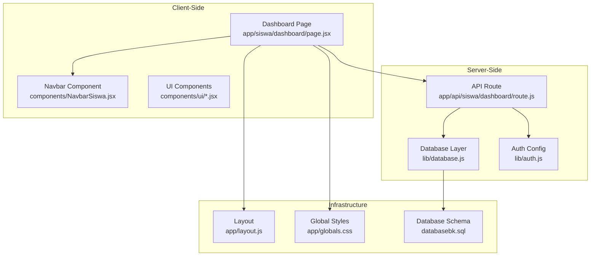
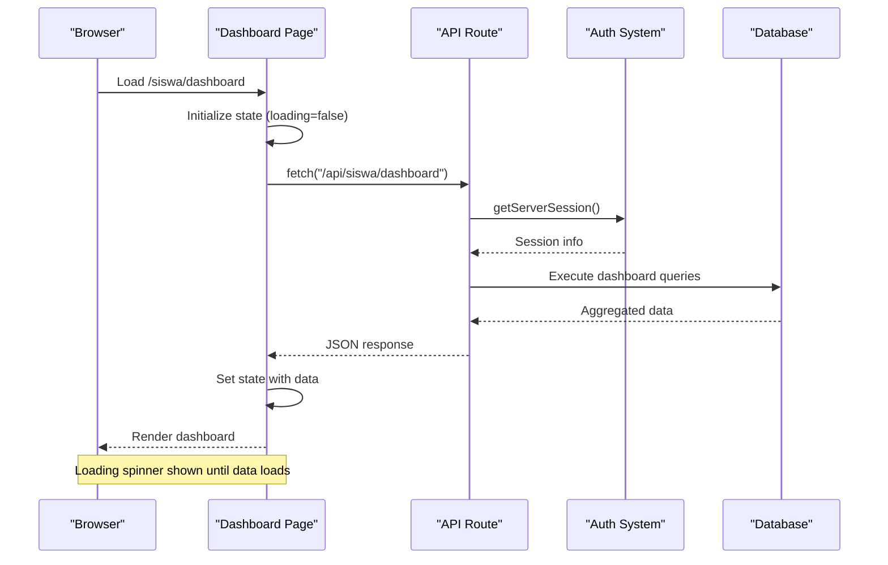
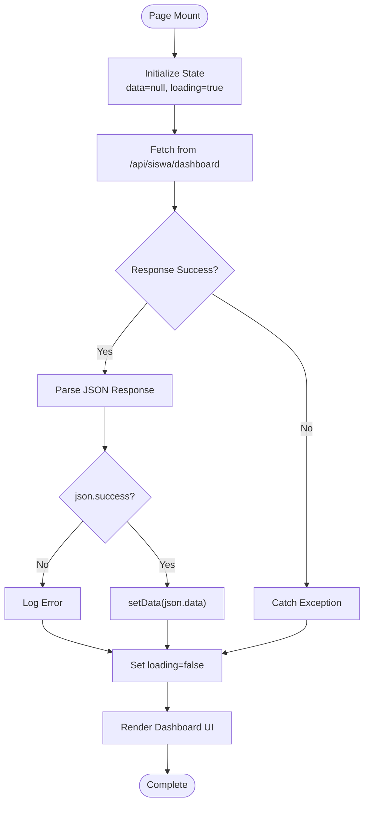
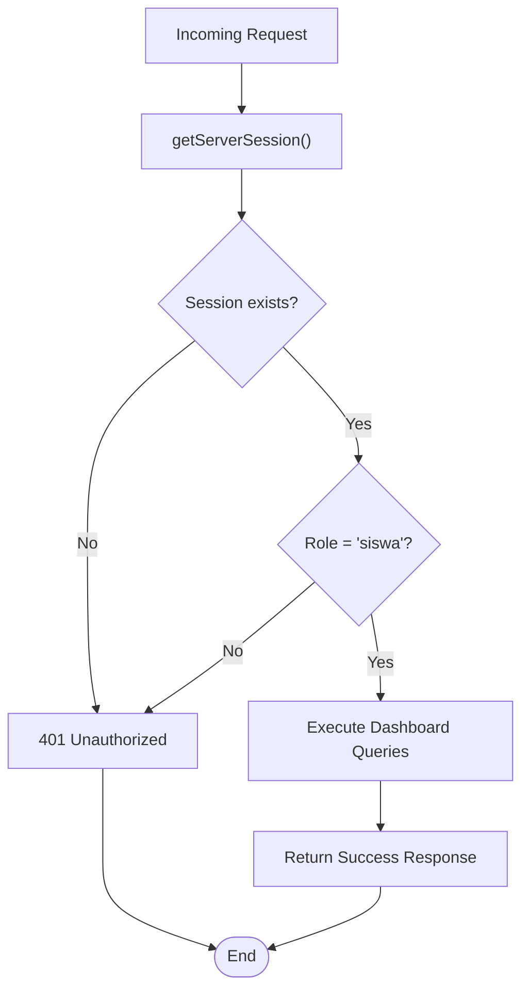
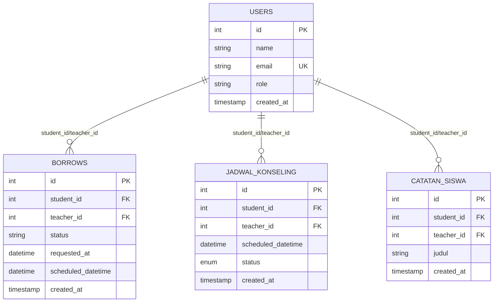
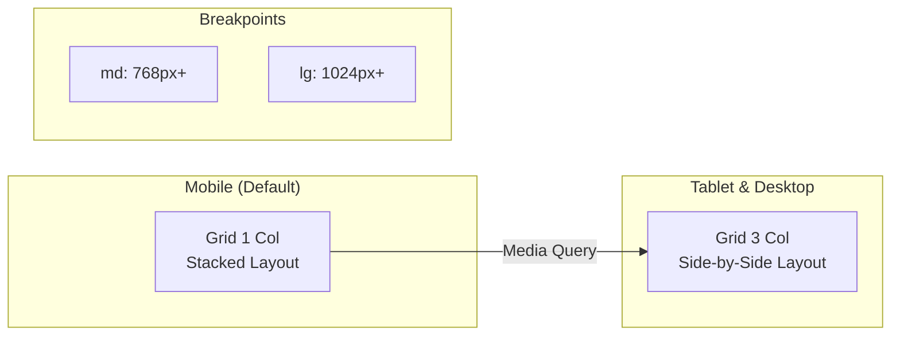
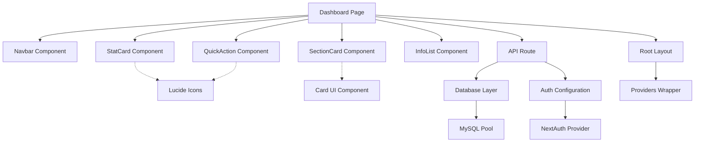

# Student Dashboard

<cite>
**Referenced Files in This Document**
- [page.jsx](file://app/siswa/dashboard/page.jsx)
- [route.js](file://app/api/siswa/dashboard/route.js)
- [NavbarSiswa.jsx](file://components/NavbarSiswa.jsx)
- [database.js](file://lib/database.js)
- [auth.js](file://lib/auth.js)
- [databasebk.sql](file://databasebk.sql)
- [layout.js](file://app/layout.js)
- [globals.css](file://app/globals.css)
- [card.jsx](file://components/ui/card.jsx)
</cite>

## Table of Contents
1. [Introduction](#introduction)
2. [Project Structure](#project-structure)
3. [Core Components](#core-components)
4. [Architecture Overview](#architecture-overview)
5. [Detailed Component Analysis](#detailed-component-analysis)
6. [Dependency Analysis](#dependency-analysis)
7. [Performance Considerations](#performance-considerations)
8. [Troubleshooting Guide](#troubleshooting-guide)
9. [Conclusion](#conclusion)

## Introduction
The Student Dashboard is the primary landing page for students, providing a centralized overview of their counseling activities. It displays key statistics, quick access actions, upcoming schedules, and recent application statuses. The implementation follows a modern Next.js pattern with client-side data fetching, server-side authentication, and responsive design using Tailwind CSS.

## Project Structure
The dashboard implementation spans several key files that work together to deliver a cohesive user experience:

**Diagram sources**
- [page.jsx:1-209](file://app/siswa/dashboard/page.jsx#L1-L209)
- [route.js:1-71](file://app/api/siswa/dashboard/route.js#L1-L71)
- [NavbarSiswa.jsx:1-191](file://components/NavbarSiswa.jsx#L1-L191)

**Section sources**
- [page.jsx:1-209](file://app/siswa/dashboard/page.jsx#L1-L209)
- [layout.js:1-31](file://app/layout.js#L1-L31)
- [globals.css:1-123](file://app/globals.css#L1-L123)

## Core Components
The dashboard consists of three primary reusable components that handle different aspects of the interface:

### StatCard Component
Displays statistical information with icons and formatted values. Supports two display modes - standard cards for counts and smaller cards for single values like status.

### SectionCard Component
Provides a consistent container for grouped content sections with standardized styling and typography.

### QuickAction Component
Creates interactive action buttons for quick navigation to key features like personal notes, history, and new requests.

### InfoList Component
Formats key-value pairs of information in a clean, readable layout suitable for displaying schedule details and application status.

**Section sources**
- [page.jsx:159-209](file://app/siswa/dashboard/page.jsx#L159-L209)

## Architecture Overview
The dashboard follows a client-server architecture pattern with clear separation of concerns:

**Diagram sources**
- [page.jsx:11-24](file://app/siswa/dashboard/page.jsx#L11-L24)
- [route.js:5-70](file://app/api/siswa/dashboard/route.js#L5-L70)
- [auth.js:55-75](file://lib/auth.js#L55-L75)

The architecture ensures proper authentication enforcement and efficient data aggregation through optimized SQL queries.

**Section sources**
- [page.jsx:1-209](file://app/siswa/dashboard/page.jsx#L1-L209)
- [route.js:1-71](file://app/api/siswa/dashboard/route.js#L1-L71)

## Detailed Component Analysis

### Data Fetching Mechanism
The dashboard implements a robust client-side data fetching strategy:

**Diagram sources**
- [page.jsx:11-24](file://app/siswa/dashboard/page.jsx#L11-L24)

The implementation includes comprehensive error handling and loading state management for optimal user experience.

### Authentication and Authorization
The backend enforces strict role-based access control:

**Diagram sources**
- [route.js:7-14](file://app/api/siswa/dashboard/route.js#L7-L14)
- [auth.js:55-75](file://lib/auth.js#L55-L75)

**Section sources**
- [page.jsx:1-209](file://app/siswa/dashboard/page.jsx#L1-L209)
- [route.js:1-71](file://app/api/siswa/dashboard/route.js#L1-L71)
- [auth.js:1-77](file://lib/auth.js#L1-L77)

### Database Schema and Relationships
The dashboard relies on several interconnected tables that support the counseling workflow:

**Diagram sources**
- [databasebk.sql:22-160](file://databasebk.sql#L22-L160)

**Section sources**
- [databasebk.sql:70-126](file://databasebk.sql#L70-L126)
- [database.js:1-23](file://lib/database.js#L1-L23)

### Responsive Design Implementation
The dashboard employs a mobile-first responsive design strategy:

The design uses Tailwind's responsive utility classes to adapt the grid layout from single-column on mobile devices to three-column layouts on larger screens.

**Section sources**
- [page.jsx:44-66](file://app/siswa/dashboard/page.jsx#L44-L66)
- [page.jsx:69-88](file://app/siswa/dashboard/page.jsx#L69-L88)
- [globals.css:1-123](file://app/globals.css#L1-L123)

## Dependency Analysis
The dashboard has clear dependency relationships that ensure maintainable code structure:

**Diagram sources**
- [page.jsx:1-209](file://app/siswa/dashboard/page.jsx#L1-L209)
- [NavbarSiswa.jsx:1-191](file://components/NavbarSiswa.jsx#L1-L191)
- [card.jsx:1-102](file://components/ui/card.jsx#L1-L102)

**Section sources**
- [page.jsx:1-209](file://app/siswa/dashboard/page.jsx#L1-L209)
- [NavbarSiswa.jsx:1-191](file://components/NavbarSiswa.jsx#L1-L191)
- [card.jsx:1-102](file://components/ui/card.jsx#L1-L102)

## Performance Considerations
The dashboard implementation incorporates several performance optimization strategies:

### Database Query Optimization
- Uses indexed columns for efficient lookups
- Implements LIMIT clauses for recent records
- Leverages JOIN operations for related data retrieval
- Applies appropriate WHERE conditions for filtering

### Client-Side Performance
- Minimal re-renders through proper state management
- Efficient grid layout using CSS Grid
- Lazy loading of images through Next.js Image optimization
- Optimized bundle sizes through modular imports

### Caching Strategy
- Session-based caching through NextAuth
- Efficient data structures preventing unnecessary computations
- Proper cleanup of event listeners and subscriptions

## Troubleshooting Guide

### Common Issues and Solutions

**Dashboard Not Loading**
- Verify API endpoint accessibility at `/api/siswa/dashboard`
- Check browser network tab for 401/403 errors
- Ensure user session is properly established

**Missing Data Display**
- Confirm database connectivity in `lib/database.js`
- Verify table relationships in `databasebk.sql`
- Check query execution permissions

**Navigation Problems**
- Validate route configurations in Next.js app router
- Ensure proper linking in `NavbarSiswa.jsx`
- Check for broken href attributes

**Styling Issues**
- Verify Tailwind CSS configuration in `globals.css`
- Check responsive breakpoint implementations
- Ensure proper font loading and CSS variables

**Section sources**
- [page.jsx:11-32](file://app/siswa/dashboard/page.jsx#L11-L32)
- [route.js:63-69](file://app/api/siswa/dashboard/route.js#L63-L69)
- [database.js:13-21](file://lib/database.js#L13-L21)

## Conclusion
The Student Dashboard represents a well-architected solution that effectively combines modern frontend development practices with robust backend functionality. The implementation demonstrates strong separation of concerns, comprehensive error handling, and responsive design principles. The modular component structure facilitates maintainability and future enhancements, while the authentication and authorization mechanisms ensure secure access to student-specific data.

Key strengths include the efficient data fetching pattern, clear component boundaries, and thoughtful user experience design. The dashboard serves as an excellent foundation for further customization and extension of student-facing features within the educational institution's counseling management system.