# Student Interface

<cite>
**Referenced Files in This Document**
- [app/siswa/dashboard/page.jsx](file://app/siswa/dashboard/page.jsx)
- [app/siswa/home/page.jsx](file://app/siswa/home/page.jsx)
- [app/siswa/riwayat/page.jsx](file://app/siswa/riwayat/page.jsx)
- [app/siswa/catatan/page.jsx](file://app/siswa/catatan/page.jsx)
- [app/siswa/ajukan/page.jsx](file://app/siswa/ajukan/page.jsx)
- [app/api/siswa/dashboard/route.js](file://app/api/siswa/dashboard/route.js)
- [app/api/siswa/riwayat/route.js](file://app/api/siswa/riwayat/route.js)
- [app/api/siswa/pengajuan/route.js](file://app/api/siswa/pengajuan/route.js)
- [app/api/siswa/guru/route.js](file://app/api/siswa/guru/route.js)
- [app/api/catatan/route.js](file://app/api/catatan/route.js)
- [lib/database.js](file://lib/database.js)
- [lib/auth.js](file://lib/auth.js)
- [components/NavbarSiswa.jsx](file://components/NavbarSiswa.jsx)
- [databasebk.sql](file://databasebk.sql)
- [app/api/notifications/route.js](file://app/api/notif/route.js)
</cite>

## Table of Contents
1. [Introduction](#introduction)
2. [Project Structure](#project-structure)
3. [Core Components](#core-components)
4. [Architecture Overview](#architecture-overview)
5. [Detailed Component Analysis](#detailed-component-analysis)
6. [Dependency Analysis](#dependency-analysis)
7. [Performance Considerations](#performance-considerations)
8. [Troubleshooting Guide](#troubleshooting-guide)
9. [Conclusion](#conclusion)
10. [Appendices](#appendices)

## Introduction
This document describes the Student Interface functionality in the E-BK application. It covers the student portal for requesting counseling sessions, viewing schedules, tracking progress, and accessing counselor feedback. It also documents the appointment booking workflow, dashboard statistics, note viewing, and the notification system. The goal is to provide a clear understanding of how students interact with the system, from registration to session completion, and how the frontend components integrate with backend APIs and the database.

## Project Structure
The student interface is organized around dedicated pages under the student namespace and supporting API routes. The frontend uses Next.js app routing with client-side React components, while the backend exposes REST-like API endpoints secured via NextAuth.js. Data persistence is handled by a MySQL database with prepared queries.

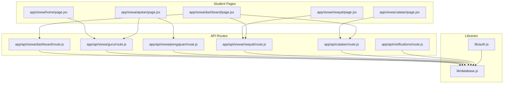

**Diagram sources**
- [app/siswa/home/page.jsx:1-196](file://app/siswa/home/page.jsx#L1-L196)
- [app/siswa/dashboard/page.jsx:1-209](file://app/siswa/dashboard/page.jsx#L1-L209)
- [app/siswa/ajukan/page.jsx:1-180](file://app/siswa/ajukan/page.jsx#L1-L180)
- [app/siswa/riwayat/page.jsx:1-127](file://app/siswa/riwayat/page.jsx#L1-L127)
- [app/siswa/catatan/page.jsx:1-41](file://app/siswa/catatan/page.jsx#L1-L41)
- [app/api/siswa/dashboard/route.js:1-71](file://app/api/siswa/dashboard/route.js#L1-L71)
- [app/api/siswa/guru/route.js:1-43](file://app/api/siswa/guru/route.js#L1-L43)
- [app/api/siswa/pengajuan/route.js:1-79](file://app/api/siswa/pengajuan/route.js#L1-L79)
- [app/api/siswa/riwayat/route.js:1-52](file://app/api/siswa/riwayat/route.js#L1-L52)
- [app/api/catatan/route.js:1-49](file://app/api/catatan/route.js#L1-L49)
- [app/api/notifications/route.js:1-20](file://app/api/notifications/route.js#L1-L20)
- [lib/auth.js:1-77](file://lib/auth.js#L1-L77)
- [lib/database.js:1-23](file://lib/database.js#L1-L23)

**Section sources**
- [app/siswa/home/page.jsx:1-196](file://app/siswa/home/page.jsx#L1-L196)
- [app/siswa/dashboard/page.jsx:1-209](file://app/siswa/dashboard/page.jsx#L1-L209)
- [app/siswa/ajukan/page.jsx:1-180](file://app/siswa/ajukan/page.jsx#L1-L180)
- [app/siswa/riwayat/page.jsx:1-127](file://app/siswa/riwayat/page.jsx#L1-L127)
- [app/siswa/catatan/page.jsx:1-41](file://app/siswa/catatan/page.jsx#L1-L41)
- [app/api/siswa/dashboard/route.js:1-71](file://app/api/siswa/dashboard/route.js#L1-L71)
- [app/api/siswa/guru/route.js:1-43](file://app/api/siswa/guru/route.js#L1-L43)
- [app/api/siswa/pengajuan/route.js:1-79](file://app/api/siswa/pengajuan/route.js#L1-L79)
- [app/api/siswa/riwayat/route.js:1-52](file://app/api/siswa/riwayat/route.js#L1-L52)
- [app/api/catatan/route.js:1-49](file://app/api/catatan/route.js#L1-L49)
- [app/api/notifications/route.js:1-20](file://app/api/notifications/route.js#L1-L20)
- [lib/auth.js:1-77](file://lib/auth.js#L1-L77)
- [lib/database.js:1-23](file://lib/database.js#L1-L23)

## Core Components
- Student Dashboard: Displays statistics, quick actions, upcoming schedule, and latest application status.
- Home Page: Welcomes the student, provides quick access links, and lists available counselors.
- Application Form: Allows students to select a counselor, choose a date/time, and submit a reason for counseling.
- History Page: Shows past counseling requests with status badges and timestamps.
- Notes Page: Displays counselor feedback and progress documentation for the logged-in student.
- Navigation Bar: Provides internal navigation and profile/logout controls.

Key responsibilities:
- Authentication and session management via NextAuth.js.
- API-driven data fetching and submission for dashboard, history, notes, and applications.
- Role-based access control ensuring only students can access student-specific endpoints.

**Section sources**
- [app/siswa/dashboard/page.jsx:1-209](file://app/siswa/dashboard/page.jsx#L1-L209)
- [app/siswa/home/page.jsx:1-196](file://app/siswa/home/page.jsx#L1-L196)
- [app/siswa/ajukan/page.jsx:1-180](file://app/siswa/ajukan/page.jsx#L1-L180)
- [app/siswa/riwayat/page.jsx:1-127](file://app/siswa/riwayat/page.jsx#L1-L127)
- [app/siswa/catatan/page.jsx:1-41](file://app/siswa/catatan/page.jsx#L1-L41)
- [components/NavbarSiswa.jsx:1-191](file://components/NavbarSiswa.jsx#L1-L191)
- [lib/auth.js:1-77](file://lib/auth.js#L1-L77)

## Architecture Overview
The student interface follows a client-server pattern:
- Client-side React components render UI and manage local state.
- API routes handle authentication checks, data retrieval, and submissions.
- Database queries are executed via a shared MySQL pool abstraction.
- Notifications are stored in a dedicated table and exposed via an API endpoint.

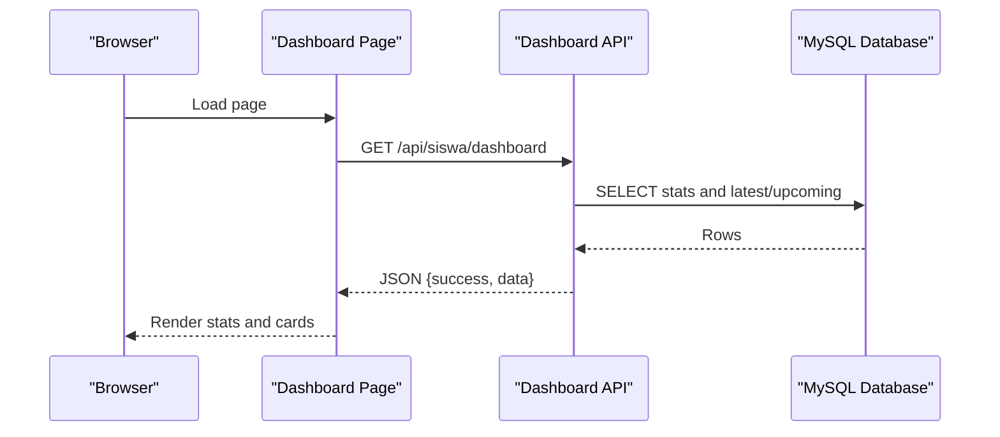

**Diagram sources**
- [app/siswa/dashboard/page.jsx:11-24](file://app/siswa/dashboard/page.jsx#L11-L24)
- [app/api/siswa/dashboard/route.js:5-70](file://app/api/siswa/dashboard/route.js#L5-L70)
- [lib/database.js:13-21](file://lib/database.js#L13-L21)

## Detailed Component Analysis

### Student Dashboard
The dashboard aggregates:
- Total requests count
- Completed sessions count
- Latest application status and metadata
- Upcoming scheduled session

Rendering logic:
- Fetches data on mount via a client-side fetch to the dashboard API.
- Uses helper components for statistics, quick actions, and info lists.
- Displays localized date/time strings for readability.

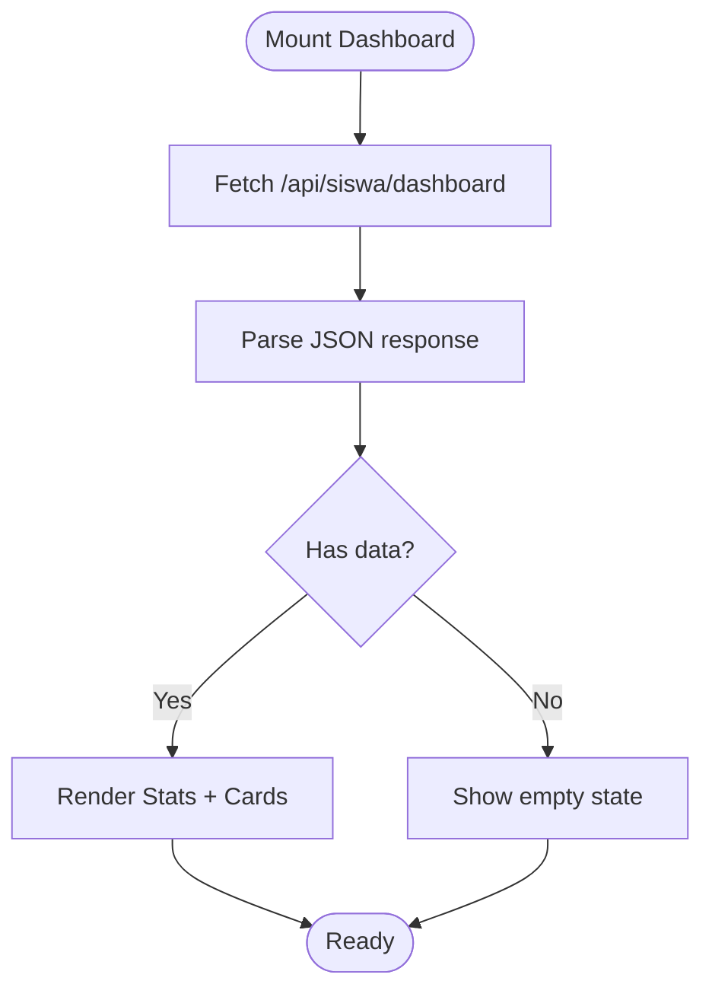

**Diagram sources**
- [app/siswa/dashboard/page.jsx:11-24](file://app/siswa/dashboard/page.jsx#L11-L24)
- [app/api/siswa/dashboard/route.js:53-61](file://app/api/siswa/dashboard/route.js#L53-L61)

**Section sources**
- [app/siswa/dashboard/page.jsx:1-209](file://app/siswa/dashboard/page.jsx#L1-L209)
- [app/api/siswa/dashboard/route.js:1-71](file://app/api/siswa/dashboard/route.js#L1-L71)

### Home Page
The home page:
- Welcomes the student by name from the session.
- Provides quick action buttons to apply, view history, and access notes.
- Lists available counselors with profile quotes and a direct “Book Appointment” action.

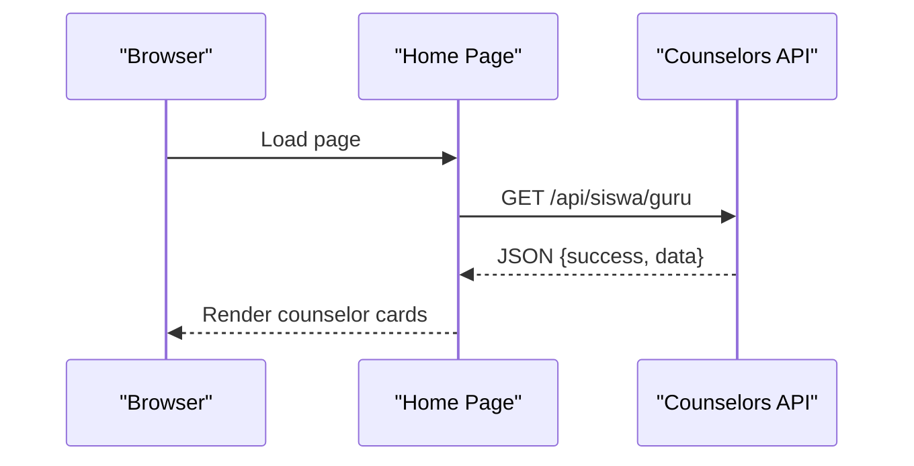

**Diagram sources**
- [app/siswa/home/page.jsx:16-45](file://app/siswa/home/page.jsx#L16-L45)
- [app/api/siswa/guru/route.js:17-33](file://app/api/siswa/guru/route.js#L17-L33)

**Section sources**
- [app/siswa/home/page.jsx:1-196](file://app/siswa/home/page.jsx#L1-L196)
- [app/api/siswa/guru/route.js:1-43](file://app/api/siswa/guru/route.js#L1-L43)

### Application Form (Booking Counseling)
The booking form:
- Loads counselor options from the counselor API.
- Validates presence of counselor selection, preferred datetime, and reason.
- Submits a new request to the application API and navigates to history on success.

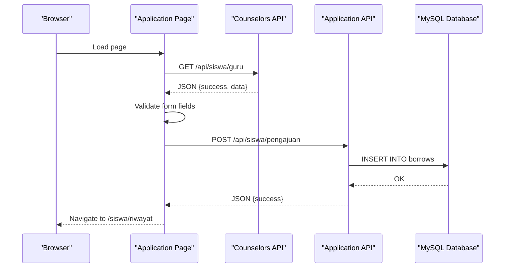

**Diagram sources**
- [app/siswa/ajukan/page.jsx:22-35](file://app/siswa/ajukan/page.jsx#L22-L35)
- [app/siswa/ajukan/page.jsx:53-88](file://app/siswa/ajukan/page.jsx#L53-L88)
- [app/api/siswa/guru/route.js:17-33](file://app/api/siswa/guru/route.js#L17-L33)
- [app/api/siswa/pengajuan/route.js:30-61](file://app/api/siswa/pengajuan/route.js#L30-L61)
- [lib/database.js:13-21](file://lib/database.js#L13-L21)

Validation and submission workflow:
- Frontend validation ensures required fields are present.
- Backend validation checks:
  - Session role is student.
  - Teacher exists and is a counselor.
  - No pending application exists for the student.
  - Inserts a new record with status pending.

**Section sources**
- [app/siswa/ajukan/page.jsx:1-180](file://app/siswa/ajukan/page.jsx#L1-L180)
- [app/api/siswa/pengajuan/route.js:1-79](file://app/api/siswa/pengajuan/route.js#L1-L79)

### History Page
The history page:
- Fetches all counseling requests for the current student.
- Renders each request with status badges and timestamps.
- Uses localized date formatting for readability.

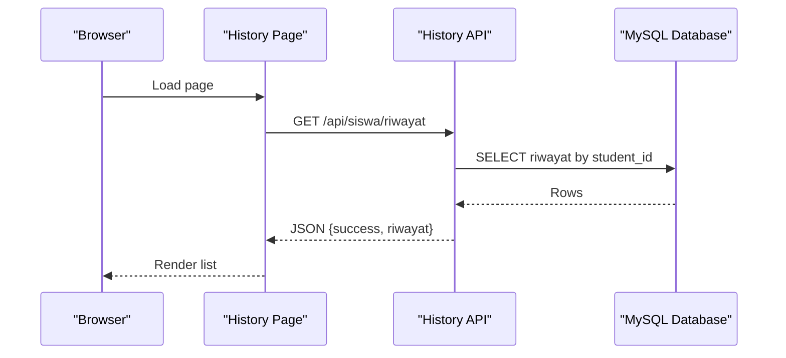

**Diagram sources**
- [app/siswa/riwayat/page.jsx:11-26](file://app/siswa/riwayat/page.jsx#L11-L26)
- [app/api/siswa/riwayat/route.js:19-42](file://app/api/siswa/riwayat/route.js#L19-L42)
- [lib/database.js:13-21](file://lib/database.js#L13-L21)

**Section sources**
- [app/siswa/riwayat/page.jsx:1-127](file://app/siswa/riwayat/page.jsx#L1-L127)
- [app/api/siswa/riwayat/route.js:1-52](file://app/api/siswa/riwayat/route.js#L1-L52)

### Notes Page
The notes page:
- Fetches notes filtered by the current student’s ID when role is student.
- Displays note title, category, content, author, and creation timestamp.

**Diagram sources**
- [app/siswa/catatan/page.jsx:9-16](file://app/siswa/catatan/page.jsx#L9-L16)
- [app/api/catatan/route.js:23-43](file://app/api/catatan/route.js#L23-L43)
- [lib/database.js:13-21](file://lib/database.js#L13-L21)

**Section sources**
- [app/siswa/catatan/page.jsx:1-41](file://app/siswa/catatan/page.jsx#L1-L41)
- [app/api/catatan/route.js:1-49](file://app/api/catatan/route.js#L1-L49)

### Navigation Bar
The navigation bar:
- Provides desktop and mobile menus.
- Includes quick links to home, dashboard, application, history, and profile/settings.
- Handles logout via NextAuth.

**Section sources**
- [components/NavbarSiswa.jsx:1-191](file://components/NavbarSiswa.jsx#L1-L191)

## Dependency Analysis
- Authentication: NextAuth.js manages credentials, JWT tokens, and session callbacks.
- Database: A shared MySQL pool executes queries across all API routes.
- Routing: Next.js app router maps pages to handlers and static assets.
- UI: Shared components and icons provide consistent navigation and interactions.

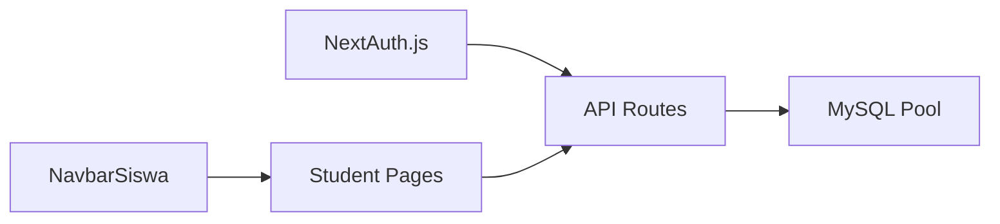

**Diagram sources**
- [lib/auth.js:1-77](file://lib/auth.js#L1-L77)
- [lib/database.js:1-23](file://lib/database.js#L1-L23)
- [components/NavbarSiswa.jsx:1-191](file://components/NavbarSiswa.jsx#L1-L191)

**Section sources**
- [lib/auth.js:1-77](file://lib/auth.js#L1-L77)
- [lib/database.js:1-23](file://lib/database.js#L1-L23)
- [components/NavbarSiswa.jsx:1-191](file://components/NavbarSiswa.jsx#L1-L191)

## Performance Considerations
- Database indexing: Indexes exist on users and borrowing tables to optimize lookups by role, student ID, teacher ID, and status.
- Query efficiency: API routes use targeted SELECT statements with appropriate joins and limits.
- Client caching: Consider adding client-side caching for counselor lists and dashboard summaries to reduce repeated network calls.
- Pagination: History and notes lists can grow; implement pagination for large datasets.

[No sources needed since this section provides general guidance]

## Troubleshooting Guide
Common issues and resolutions:
- Unauthorized access: Ensure the session role is student for student-only endpoints. Verify NextAuth configuration and cookies.
- Empty counselor list: Confirm counselor records exist and role filtering is applied correctly.
- Pending application blocking: The backend prevents multiple pending applications; resolve existing pending requests before submitting a new one.
- Database errors: Check connection parameters and query syntax; review logs for constraint violations or missing indexes.
- Notification delivery: Use the notifications API to insert messages and confirm ordering by creation timestamp.

**Section sources**
- [app/api/siswa/pengajuan/route.js:11-26](file://app/api/siswa/pengajuan/route.js#L11-L26)
- [app/api/siswa/pengajuan/route.js:42-52](file://app/api/siswa/pengajuan/route.js#L42-L52)
- [app/api/notifications/route.js:1-20](file://app/api/notifications/route.js#L1-L20)
- [lib/database.js:1-23](file://lib/database.js#L1-L23)

## Conclusion
The Student Interface integrates seamlessly with Next.js pages and API routes, leveraging NextAuth for secure access and a MySQL database for persistent data. Students can easily book sessions, track their history, view counselor notes, and access a dashboard summarizing their counseling journey. The system’s modular design supports future enhancements such as reminders, advanced search, and expanded communication features.

[No sources needed since this section summarizes without analyzing specific files]

## Appendices

### Database Schema Overview
Key tables and relationships:
- users: Stores roles and credentials.
- borrows: Tracks counseling requests and statuses.
- jadwal_konseling: Stores scheduled sessions.
- catatan_siswa: Stores counselor notes per student.
- notifications: Stores user notifications.

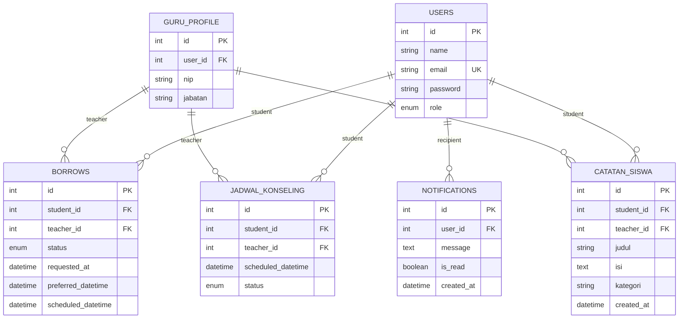

**Diagram sources**
- [databasebk.sql:22-35](file://databasebk.sql#L22-L35)
- [databasebk.sql:70-92](file://databasebk.sql#L70-L92)
- [databasebk.sql:112-126](file://databasebk.sql#L112-L126)
- [databasebk.sql:147-160](file://databasebk.sql#L147-L160)
- [databasebk.sql:163-172](file://databasebk.sql#L163-L172)

### Example Workflows

#### Workflow: Register and Request First Session
- Login via credentials provider.
- Access home page and click “Book Appointment.”
- Select a counselor, pick a date/time, and submit a reason.
- On success, navigate to history and see pending status.

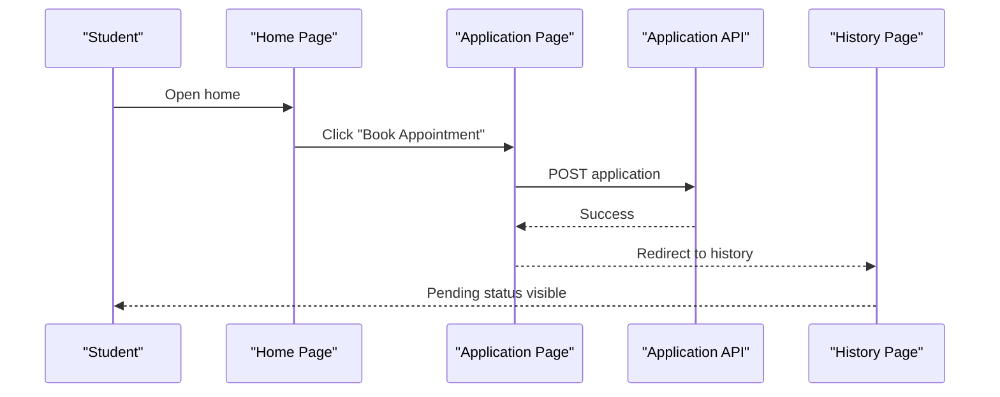

**Diagram sources**
- [app/siswa/home/page.jsx:79-92](file://app/siswa/home/page.jsx#L79-L92)
- [app/siswa/ajukan/page.jsx:53-88](file://app/siswa/ajukan/page.jsx#L53-L88)
- [app/api/siswa/pengajuan/route.js:55-61](file://app/api/siswa/pengajuan/route.js#L55-L61)
- [app/siswa/riwayat/page.jsx:69-122](file://app/siswa/riwayat/page.jsx#L69-L122)

#### Workflow: View Notes and Progress
- Navigate to notes page.
- Fetch notes filtered by current student ID.
- Read counselor feedback and categories.

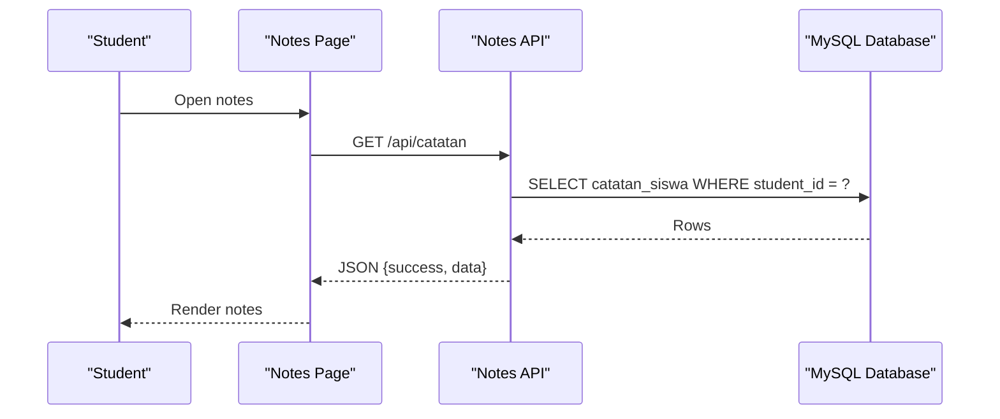

**Diagram sources**
- [app/siswa/catatan/page.jsx:9-16](file://app/siswa/catatan/page.jsx#L9-L16)
- [app/api/catatan/route.js:23-43](file://app/api/catatan/route.js#L23-L43)
- [lib/database.js:13-21](file://lib/database.js#L13-L21)

### Notification System
- Retrieve all notifications via GET endpoint.
- Send a new notification via POST with user ID and message.
- Notifications are ordered by creation timestamp.

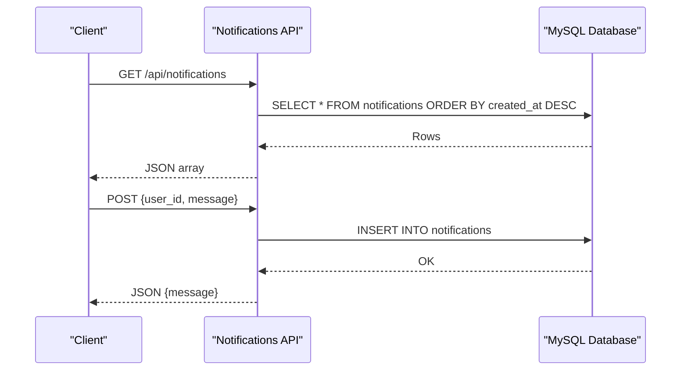

**Diagram sources**
- [app/api/notifications/route.js:4-6](file://app/api/notifications/route.js#L4-L6)
- [app/api/notifications/route.js:9-19](file://app/api/notifications/route.js#L9-L19)
- [lib/database.js:13-21](file://lib/database.js#L13-L21)

**Section sources**
- [app/api/notifications/route.js:1-20](file://app/api/notifications/route.js#L1-L20)
- [lib/database.js:1-23](file://lib/database.js#L1-L23)