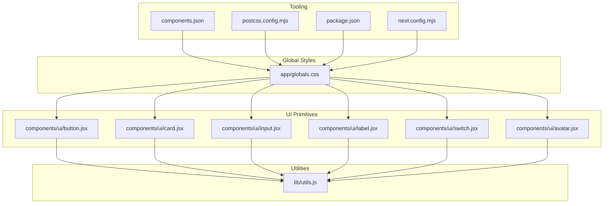
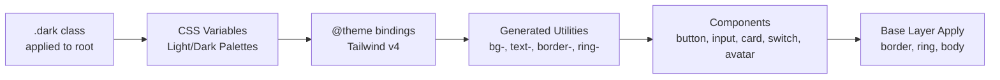
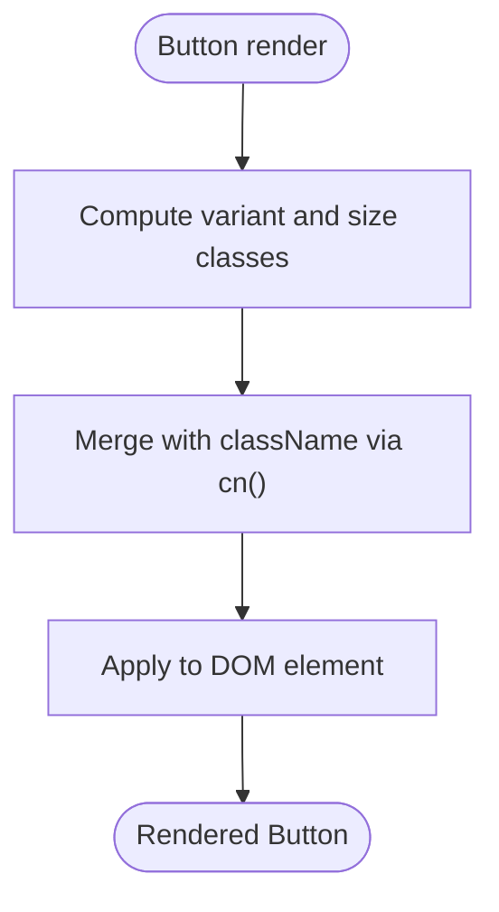
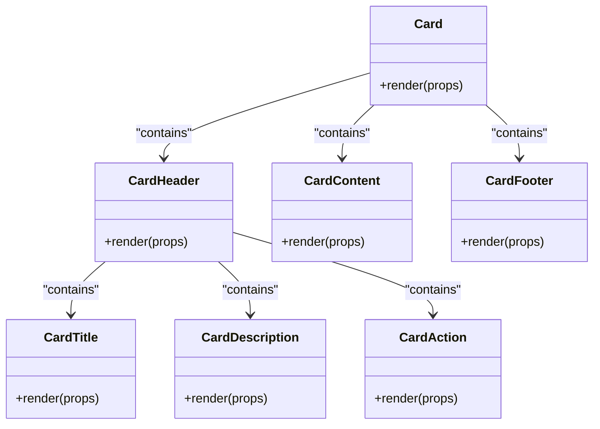
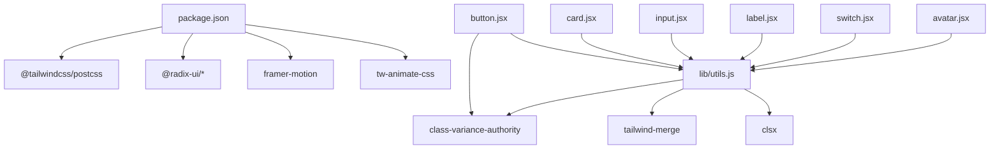

# Styling & Theming

<cite>
**Referenced Files in This Document**
- [app/globals.css](file://app/globals.css)
- [components/ui/button.jsx](file://components/ui/button.jsx)
- [components/ui/card.jsx](file://components/ui/card.jsx)
- [components/ui/input.jsx](file://components/ui/input.jsx)
- [components/ui/label.jsx](file://components/ui/label.jsx)
- [components/ui/switch.jsx](file://components/ui/switch.jsx)
- [components/ui/avatar.jsx](file://components/ui/avatar.jsx)
- [components/ButtonPrimary.jsx](file://components/ButtonPrimary.jsx)
- [components/Providers.jsx](file://components/Providers.jsx)
- [lib/utils.js](file://lib/utils.js)
- [components.json](file://components.json)
- [postcss.config.mjs](file://postcss.config.mjs)
- [package.json](file://package.json)
- [next.config.mjs](file://next.config.mjs)
</cite>

## Table of Contents
1. [Introduction](#introduction)
2. [Project Structure](#project-structure)
3. [Core Components](#core-components)
4. [Architecture Overview](#architecture-overview)
5. [Detailed Component Analysis](#detailed-component-analysis)
6. [Dependency Analysis](#dependency-analysis)
7. [Performance Considerations](#performance-considerations)
8. [Accessibility Considerations](#accessibility-considerations)
9. [Troubleshooting Guide](#troubleshooting-guide)
10. [Conclusion](#conclusion)
11. [Appendices](#appendices)

## Introduction
This document explains the styling and theming system of the E-BK application. It covers Tailwind CSS v4 configuration, design tokens, color schemes, global and component-level styles, responsive patterns, dark/light mode, typography, and utility class usage. It also outlines extension guidelines, accessibility practices, and performance considerations derived from the repository’s current setup.

## Project Structure
The styling system centers around a single global stylesheet that defines theme tokens and Tailwind v4 directives, a set of UI primitives built with class variance authority (CVA), and shared utility helpers. PostCSS integrates Tailwind, while shadcn/ui configuration aligns component aliases and CSS variable usage.

**Diagram sources**
- [app/globals.css:1-123](file://app/globals.css#L1-L123)
- [components/ui/button.jsx:1-57](file://components/ui/button.jsx#L1-L57)
- [components/ui/card.jsx:1-102](file://components/ui/card.jsx#L1-L102)
- [components/ui/input.jsx:1-25](file://components/ui/input.jsx#L1-L25)
- [components/ui/label.jsx:1-24](file://components/ui/label.jsx#L1-L24)
- [components/ui/switch.jsx:1-30](file://components/ui/switch.jsx#L1-L30)
- [components/ui/avatar.jsx:1-48](file://components/ui/avatar.jsx#L1-L48)
- [lib/utils.js:1-7](file://lib/utils.js#L1-L7)
- [components.json:1-23](file://components.json#L1-L23)
- [postcss.config.mjs:1-8](file://postcss.config.mjs#L1-L8)
- [package.json:1-44](file://package.json#L1-L44)
- [next.config.mjs:1-15](file://next.config.mjs#L1-L15)

**Section sources**
- [app/globals.css:1-123](file://app/globals.css#L1-L123)
- [components.json:1-23](file://components.json#L1-L23)
- [postcss.config.mjs:1-8](file://postcss.config.mjs#L1-L8)
- [package.json:1-44](file://package.json#L1-L44)
- [next.config.mjs:1-15](file://next.config.mjs#L1-L15)

## Core Components
- Design tokens and theme
  - CSS variables define color roles and radii for light and dark modes.
  - Tailwind v4 @theme and @custom-variant directives bind CSS variables to Tailwind utilities.
- Global base layer
  - Base layer applies border and ring outlines globally and sets body background and text colors from tokens.
- Utility helper
  - clsx and tailwind-merge are combined into a single cn() utility to merge and deduplicate classes efficiently.

Key implementation references:
- Theme tokens and dark variant: [app/globals.css:6-44](file://app/globals.css#L6-L44), [app/globals.css:81-113](file://app/globals.css#L81-L113)
- Base layer and global apply: [app/globals.css:115-122](file://app/globals.css#L115-L122)
- Utility composition: [lib/utils.js:4-6](file://lib/utils.js#L4-L6)

**Section sources**
- [app/globals.css:6-44](file://app/globals.css#L6-L44)
- [app/globals.css:81-113](file://app/globals.css#L81-L113)
- [app/globals.css:115-122](file://app/globals.css#L115-L122)
- [lib/utils.js:4-6](file://lib/utils.js#L4-L6)

## Architecture Overview
The theming architecture uses CSS variables for tokens, Tailwind v4 for utility generation, and CVA for component variants. Dark mode toggles via a .dark class applied to the root element. The system supports:
- Light/dark color palettes via CSS variables
- Semantic color roles (primary, secondary, muted, destructive, border, ring)
- Responsive sizing and spacing tokens
- Focus, invalid, and interactive states wired to tokens

**Diagram sources**
- [app/globals.css:4](file://app/globals.css#L4)
- [app/globals.css:6-44](file://app/globals.css#L6-L44)
- [app/globals.css:115-122](file://app/globals.css#L115-L122)

## Detailed Component Analysis

### Button
- Variants and sizes use CVA to compose stateful classes from tokens.
- Focus-visible ring and destructive states integrate with theme tokens.
- SVG sizing and alignment handled consistently.

Implementation references:
- Variant composition and defaults: [components/ui/button.jsx:7-37](file://components/ui/button.jsx#L7-L37)
- Focus and invalid states: [components/ui/button.jsx:8](file://components/ui/button.jsx#L8)
- Usage of cn(): [components/ui/button.jsx:51](file://components/ui/button.jsx#L51)

**Diagram sources**
- [components/ui/button.jsx:39-54](file://components/ui/button.jsx#L39-L54)
- [lib/utils.js:4-6](file://lib/utils.js#L4-L6)

**Section sources**
- [components/ui/button.jsx:7-37](file://components/ui/button.jsx#L7-L37)
- [components/ui/button.jsx:39-54](file://components/ui/button.jsx#L39-L54)
- [lib/utils.js:4-6](file://lib/utils.js#L4-L6)

### Card
- Semantic subcomponents: header, title, description, action, content, footer.
- Grid-based header layout adapts to presence of actions.
- Uses card background and foreground tokens.

Implementation references:
- Card container and subcomponents: [components/ui/card.jsx:5-101](file://components/ui/card.jsx#L5-L101)

**Diagram sources**
- [components/ui/card.jsx:5-101](file://components/ui/card.jsx#L5-L101)

**Section sources**
- [components/ui/card.jsx:5-101](file://components/ui/card.jsx#L5-L101)

### Input
- Inherits focus-visible ring and destructive states from tokens.
- Placeholder and selection colors derive from tokens.
- Responsive text sizing and focus ring integration.

Implementation references:
- Input class composition: [components/ui/input.jsx:14-21](file://components/ui/input.jsx#L14-L21)

**Section sources**
- [components/ui/input.jsx:14-21](file://components/ui/input.jsx#L14-L21)

### Label
- Typography and interaction states for form labels.
- Integrates with disabled and peer states.

Implementation references:
- Label class composition: [components/ui/label.jsx:15-19](file://components/ui/label.jsx#L15-L19)

**Section sources**
- [components/ui/label.jsx:15-19](file://components/ui/label.jsx#L15-L19)

### Switch
- Thumb transitions and checked/unchecked backgrounds from tokens.
- Focus-visible ring and disabled states.

Implementation references:
- Switch and thumb classes: [components/ui/switch.jsx:15-25](file://components/ui/switch.jsx#L15-L25)

**Section sources**
- [components/ui/switch.jsx:15-25](file://components/ui/switch.jsx#L15-L25)

### Avatar
- Avatar, image, and fallback components with consistent sizing and background tokens.

Implementation references:
- Avatar classes: [components/ui/avatar.jsx:15](file://components/ui/avatar.jsx#L15), [components/ui/avatar.jsx:27](file://components/ui/avatar.jsx#L27), [components/ui/avatar.jsx:40](file://components/ui/avatar.jsx#L40)

**Section sources**
- [components/ui/avatar.jsx:15](file://components/ui/avatar.jsx#L15)
- [components/ui/avatar.jsx:27](file://components/ui/avatar.jsx#L27)
- [components/ui/avatar.jsx:40](file://components/ui/avatar.jsx#L40)

### Primary Button (Custom)
- A custom primary button component with explicit color and hover behavior.
- Useful for quick actions outside the CVA system.

Implementation references:
- Custom primary button: [components/ButtonPrimary.jsx:1-10](file://components/ButtonPrimary.jsx#L1-L10)

**Section sources**
- [components/ButtonPrimary.jsx:1-10](file://components/ButtonPrimary.jsx#L1-L10)

## Dependency Analysis
- Tooling
  - Tailwind v4 via @tailwindcss/postcss plugin.
  - tw-animate-css imported for animations.
- UI library
  - Radix UI primitives underpin interactive components.
  - Framer Motion present in dependencies but not currently used in styling.
- Utilities
  - clsx and tailwind-merge merged into cn().

**Diagram sources**
- [package.json:11-33](file://package.json#L11-L33)
- [lib/utils.js:1-7](file://lib/utils.js#L1-7)
- [components/ui/button.jsx:3](file://components/ui/button.jsx#L3)
- [components/ui/card.jsx:3](file://components/ui/card.jsx#L3)
- [components/ui/input.jsx:3](file://components/ui/input.jsx#L3)
- [components/ui/label.jsx:4](file://components/ui/label.jsx#L4)
- [components/ui/switch.jsx:4](file://components/ui/switch.jsx#L4)
- [components/ui/avatar.jsx:4](file://components/ui/avatar.jsx#L4)

**Section sources**
- [package.json:11-33](file://package.json#L11-L33)
- [lib/utils.js:1-7](file://lib/utils.js#L1-L7)
- [postcss.config.mjs:1-8](file://postcss.config.mjs#L1-L8)

## Performance Considerations
- Token-driven theming minimizes repeated declarations and reduces CSS payload.
- Using CSS variables for colors and radii enables efficient dark/light switching without duplicating styles.
- Utility-first approach keeps component styles compact; avoid generating excessive variants.
- Keep animations scoped and prefer hardware-accelerated properties when adding motion.

[No sources needed since this section provides general guidance]

## Accessibility Considerations
- Contrast and readability
  - Ensure sufficient contrast between foreground and background tokens in both light and dark modes.
  - Verify focus rings meet WCAG guidelines; the current setup applies ring tokens on focus.
- Interactive states
  - Destructive and invalid states use ring tokens to signal errors; maintain consistent visual feedback.
- Form controls
  - Labels and inputs are connected semantically; keep label text meaningful and visible.
- Motion preferences
  - Respect reduced motion settings; introduce motion carefully and allow opting out.

[No sources needed since this section provides general guidance]

## Troubleshooting Guide
- Dark mode not applying
  - Confirm the .dark class is toggled on the root element and CSS variables update accordingly.
  - Verify @custom-variant dark is declared and @theme bindings exist.
  - References: [app/globals.css:4](file://app/globals.css#L4), [app/globals.css:6-44](file://app/globals.css#L6-L44), [app/globals.css:81-113](file://app/globals.css#L81-L113)
- Focus ring missing
  - Ensure focus-visible utilities target ring tokens and are not overridden by local styles.
  - References: [components/ui/button.jsx:8](file://components/ui/button.jsx#L8), [components/ui/input.jsx:16](file://components/ui/input.jsx#L16)
- Conflicting styles
  - Use the cn() utility to merge and deduplicate classes; avoid stacking conflicting Tailwind utilities.
  - References: [lib/utils.js:4-6](file://lib/utils.js#L4-L6)
- Animations not working
  - tw-animate-css is imported; confirm usage of supported animation utilities.
  - References: [app/globals.css:2](file://app/globals.css#L2), [package.json:41](file://package.json#L41)

**Section sources**
- [app/globals.css:4](file://app/globals.css#L4)
- [app/globals.css:6-44](file://app/globals.css#L6-L44)
- [app/globals.css:81-113](file://app/globals.css#L81-L113)
- [components/ui/button.jsx:8](file://components/ui/button.jsx#L8)
- [components/ui/input.jsx:16](file://components/ui/input.jsx#L16)
- [lib/utils.js:4-6](file://lib/utils.js#L4-L6)
- [app/globals.css:2](file://app/globals.css#L2)
- [package.json:41](file://package.json#L41)

## Conclusion
The E-BK application employs a clean, token-driven theming system powered by Tailwind CSS v4 and CSS variables. Components are styled with CVA for consistent variants and states, while a shared cn() utility ensures predictable class merging. Dark/light mode is supported via a .dark class and dual palettes. The system is extensible and accessible when followed by the guidelines below.

[No sources needed since this section summarizes without analyzing specific files]

## Appendices

### Tailwind CSS Configuration and Tooling
- Tailwind v4 via @tailwindcss/postcss plugin.
- tw-animate-css imported for animation utilities.
- shadcn/ui configured with CSS variables and aliases.

References:
- [postcss.config.mjs:1-8](file://postcss.config.mjs#L1-L8)
- [package.json:40-41](file://package.json#L40-L41)
- [components.json:3-22](file://components.json#L3-L22)

**Section sources**
- [postcss.config.mjs:1-8](file://postcss.config.mjs#L1-L8)
- [package.json:40-41](file://package.json#L40-L41)
- [components.json:3-22](file://components.json#L3-L22)

### Extending the Styling System
- Add new tokens
  - Define CSS variables in :root and .dark blocks, then bind via @theme.
  - Reference: [app/globals.css:6-44](file://app/globals.css#L6-L44), [app/globals.css:46-79](file://app/globals.css#L46-L79), [app/globals.css:81-113](file://app/globals.css#L81-L113)
- Create new components
  - Use CVA for variants and sizes; compose with cn().
  - Reference: [components/ui/button.jsx:7-37](file://components/ui/button.jsx#L7-L37), [lib/utils.js:4-6](file://lib/utils.js#L4-L6)
- Introduce animations
  - Import tw-animate-css and apply animation utilities; avoid heavy JS animations for performance.
  - Reference: [app/globals.css:2](file://app/globals.css#L2), [package.json:41](file://package.json#L41)
- Maintain design consistency
  - Prefer tokens over hardcoded values; reuse component primitives; keep focus and state styles uniform.

[No additional sources needed beyond those cited above]