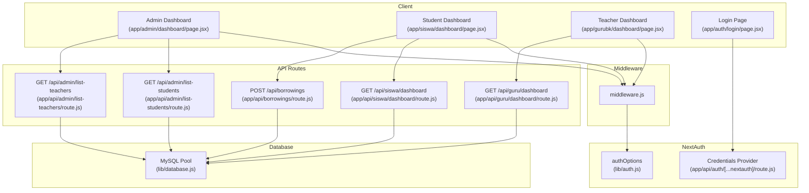
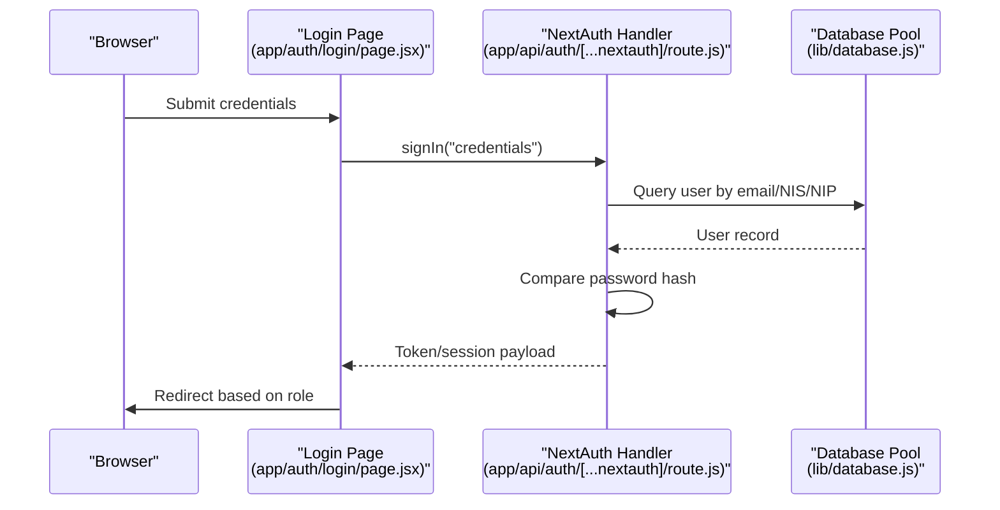
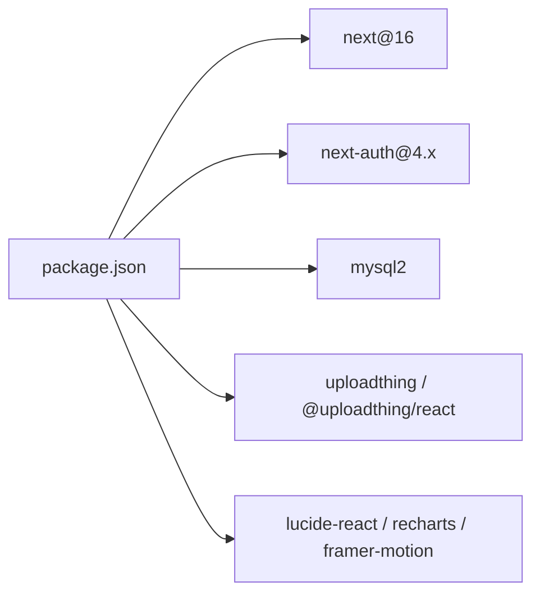

# Troubleshooting & FAQ

<cite>
**Referenced Files in This Document**
- [package.json](file://package.json)
- [next.config.mjs](file://next.config.mjs)
- [lib/database.js](file://lib/database.js)
- [lib/auth.js](file://lib/auth.js)
- [middleware.js](file://middleware.js)
- [app/api/auth/[...nextauth]/route.js](file://app/api/auth/[...nextauth]/route.js)
- [app/auth/login/page.jsx](file://app/auth/login/page.jsx)
- [app/api/borrowings/route.js](file://app/api/borrowings/route.js)
- [app/api/siswa/dashboard/route.js](file://app/api/siswa/dashboard/route.js)
- [app/api/guru/dashboard/route.js](file://app/api/guru/dashboard/route.js)
- [app/admin/dashboard/page.jsx](file://app/admin/dashboard/page.jsx)
- [app/siswa/dashboard/page.jsx](file://app/siswa/dashboard/page.jsx)
- [app/gurubk/dashboard/page.jsx](file://app/gurubk/dashboard/page.jsx)
- [app/api/admin/list-students/route.js](file://app/api/admin/list-students/route.js)
- [app/api/admin/list-teachers/route.js](file://app/api/admin/list-teachers/route.js)
</cite>

## Table of Contents
1. [Introduction](#introduction)
2. [Project Structure](#project-structure)
3. [Core Components](#core-components)
4. [Architecture Overview](#architecture-overview)
5. [Detailed Component Analysis](#detailed-component-analysis)
6. [Dependency Analysis](#dependency-analysis)
7. [Performance Considerations](#performance-considerations)
8. [Troubleshooting Guide](#troubleshooting-guide)
9. [FAQ](#faq)
10. [Conclusion](#conclusion)
11. [Appendices](#appendices)

## Introduction
This document provides comprehensive troubleshooting and FAQ guidance for the E-BK application. It focuses on diagnosing and resolving common issues such as database connectivity, authentication failures, routing errors, and performance bottlenecks. It also covers debugging techniques using browser developer tools, server logs, and Next.js features, along with solutions for environment configuration, dependency conflicts, and build errors. Security, data migration, upgrades, performance tuning, and maintenance procedures are included to support system stability and scalability.

## Project Structure
The E-BK application is a Next.js 16 application using React 19. Authentication is handled via NextAuth.js with JWT strategy and a custom credentials provider. Data access is performed through a MySQL pool configured in lib/database.js. Middleware enforces role-based access control across protected routes. API routes under app/api handle administrative, student, teacher, and borrowing-related operations.

**Diagram sources**
- [app/admin/dashboard/page.jsx:1-255](file://app/admin/dashboard/page.jsx#L1-L255)
- [app/siswa/dashboard/page.jsx:1-209](file://app/siswa/dashboard/page.jsx#L1-L209)
- [app/gurubk/dashboard/page.jsx:1-158](file://app/gurubk/dashboard/page.jsx#L1-L158)
- [app/auth/login/page.jsx:1-110](file://app/auth/login/page.jsx#L1-L110)
- [middleware.js:1-53](file://middleware.js#L1-L53)
- [lib/auth.js:1-77](file://lib/auth.js#L1-L77)
- [app/api/auth/[...nextauth]/route.js](file://app/api/auth/[...nextauth]/route.js#L1-L102)
- [app/api/borrowings/route.js:1-81](file://app/api/borrowings/route.js#L1-L81)
- [app/api/siswa/dashboard/route.js:1-71](file://app/api/siswa/dashboard/route.js#L1-L71)
- [app/api/guru/dashboard/route.js:1-139](file://app/api/guru/dashboard/route.js#L1-L139)
- [app/api/admin/list-students/route.js:1-29](file://app/api/admin/list-students/route.js#L1-L29)
- [app/api/admin/list-teachers/route.js:1-29](file://app/api/admin/list-teachers/route.js#L1-L29)
- [lib/database.js:1-23](file://lib/database.js#L1-L23)

**Section sources**
- [package.json:1-44](file://package.json#L1-L44)
- [next.config.mjs:1-15](file://next.config.mjs#L1-L15)
- [lib/database.js:1-23](file://lib/database.js#L1-L23)
- [lib/auth.js:1-77](file://lib/auth.js#L1-L77)
- [middleware.js:1-53](file://middleware.js#L1-L53)
- [app/api/auth/[...nextauth]/route.js](file://app/api/auth/[...nextauth]/route.js#L1-L102)
- [app/auth/login/page.jsx:1-110](file://app/auth/login/page.jsx#L1-L110)
- [app/api/borrowings/route.js:1-81](file://app/api/borrowings/route.js#L1-L81)
- [app/api/siswa/dashboard/route.js:1-71](file://app/api/siswa/dashboard/route.js#L1-L71)
- [app/api/guru/dashboard/route.js:1-139](file://app/api/guru/dashboard/route.js#L1-L139)
- [app/admin/dashboard/page.jsx:1-255](file://app/admin/dashboard/page.jsx#L1-L255)
- [app/siswa/dashboard/page.jsx:1-209](file://app/siswa/dashboard/page.jsx#L1-L209)
- [app/gurubk/dashboard/page.jsx:1-158](file://app/gurubk/dashboard/page.jsx#L1-L158)
- [app/api/admin/list-students/route.js:1-29](file://app/api/admin/list-students/route.js#L1-L29)
- [app/api/admin/list-teachers/route.js:1-29](file://app/api/admin/list-teachers/route.js#L1-L29)

## Core Components
- Database Layer: A MySQL connection pool with configurable limits and queue behavior. Queries are executed via a wrapper that logs errors and rethrows exceptions.
- Authentication: NextAuth.js with a custom credentials provider supporting login by email, NIS, or NIP. Session strategy uses JWT with callbacks to enrich tokens and sessions.
- Middleware: Enforces public/private paths and role-based redirection for admin, guru, and siswa routes.
- API Routes: Provide CRUD and analytics endpoints for administrators, students, and teachers, including borrowing requests and dashboards.
- Client Dashboards: Render role-specific summaries and charts, fetching data from API routes.

**Section sources**
- [lib/database.js:1-23](file://lib/database.js#L1-L23)
- [lib/auth.js:1-77](file://lib/auth.js#L1-L77)
- [middleware.js:1-53](file://middleware.js#L1-L53)
- [app/api/auth/[...nextauth]/route.js](file://app/api/auth/[...nextauth]/route.js#L1-L102)
- [app/api/borrowings/route.js:1-81](file://app/api/borrowings/route.js#L1-L81)
- [app/api/siswa/dashboard/route.js:1-71](file://app/api/siswa/dashboard/route.js#L1-L71)
- [app/api/guru/dashboard/route.js:1-139](file://app/api/guru/dashboard/route.js#L1-L139)
- [app/admin/dashboard/page.jsx:1-255](file://app/admin/dashboard/page.jsx#L1-L255)
- [app/siswa/dashboard/page.jsx:1-209](file://app/siswa/dashboard/page.jsx#L1-L209)
- [app/gurubk/dashboard/page.jsx:1-158](file://app/gurubk/dashboard/page.jsx#L1-L158)

## Architecture Overview
The system follows a layered architecture:
- Presentation: Role-specific pages and dashboards.
- Routing/Middleware: Enforce authentication and authorization.
- Authentication: NextAuth.js with JWT and custom provider.
- Application: API routes encapsulate business logic.
- Data Access: MySQL pool abstraction.

**Diagram sources**
- [app/auth/login/page.jsx:1-110](file://app/auth/login/page.jsx#L1-L110)
- [app/api/auth/[...nextauth]/route.js](file://app/api/auth/[...nextauth]/route.js#L1-L102)
- [lib/database.js:1-23](file://lib/database.js#L1-L23)

## Detailed Component Analysis

### Database Connectivity
Common symptoms:
- Application fails to load dashboards or lists.
- API routes return 500 with database errors.
- Console logs show “Database query error”.

Root causes and fixes:
- Missing or incorrect environment variables for DB_HOST, DB_USER, DB_PASS, DB_NAME.
- Database server unreachable or credentials invalid.
- Pool exhaustion due to high concurrency or long-running queries.

Diagnostic steps:
- Verify environment variables locally and in hosting platform.
- Test connectivity externally (e.g., CLI/mysql client).
- Review pool configuration and adjust connectionLimit and queueLimit if needed.
- Inspect server logs for “Database query error” entries.

Operational tips:
- Keep connectionLimit aligned with database capacity.
- Monitor queue length and latency; consider scaling the database tier.

**Section sources**
- [lib/database.js:1-23](file://lib/database.js#L1-L23)

### Authentication Failures
Symptoms:
- Login redirects to /auth/login despite correct credentials.
- Role-based redirects to /unauthorized.
- Toast indicates “Identifier or password salah!” on login.

Root causes:
- NEXTAUTH_SECRET missing or inconsistent across environments.
- User not found by identifier (email/NIS/NIP).
- Incorrect password hash comparison.
- Middleware denies access due to missing or invalid token.

Diagnostic steps:
- Confirm NEXTAUTH_SECRET is set and identical across deployments.
- Validate user exists and password hash matches.
- Check middleware matcher and role checks.
- Inspect NextAuth callback flows for token/session enrichment.

**Section sources**
- [app/api/auth/[...nextauth]/route.js](file://app/api/auth/[...nextauth]/route.js#L1-L102)
- [lib/auth.js:1-77](file://lib/auth.js#L1-L77)
- [middleware.js:1-53](file://middleware.js#L1-L53)
- [app/auth/login/page.jsx:1-110](file://app/auth/login/page.jsx#L1-L110)

### Routing and Authorization Errors
Symptoms:
- Redirect loop to /auth/login or /unauthorized.
- Protected pages accessible by unauthorized roles.

Root causes:
- Public paths mismatch or middleware matcher not covering intended routes.
- Role mismatch between token and route protection.
- Misconfigured authOptions pages.signIn.

Diagnostic steps:
- Review PUBLIC_PATHS and middleware matcher.
- Verify token presence and role extraction.
- Confirm authOptions.pages.signIn and client-side redirects.

**Section sources**
- [middleware.js:1-53](file://middleware.js#L1-L53)
- [lib/auth.js:1-77](file://lib/auth.js#L1-L77)

### Borrowing Requests (Student Booking)
Symptoms:
- “Lengkapi semua data” errors.
- “Guru tidak ditemukan” errors.
- “Jam sudah dibooking siswa lain” conflicts.

Root causes:
- Missing or malformed request body.
- Non-existent teacher ID or wrong role.
- Overlapping schedule conflict excluding rejected bookings.

Diagnostic steps:
- Validate client form submission and request payload.
- Confirm teacher existence and role.
- Check existing bookings for date/time conflicts.

**Section sources**
- [app/api/borrowings/route.js:1-81](file://app/api/borrowings/route.js#L1-L81)

### Student Dashboard API
Symptoms:
- Unauthorized response for non-student sessions.
- Empty or partial statistics.

Root causes:
- Session not present or role mismatch.
- Missing or incorrect SQL joins.

Diagnostic steps:
- Ensure session validated as role “siswa”.
- Verify SQL queries and column references.

**Section sources**
- [app/api/siswa/dashboard/route.js:1-71](file://app/api/siswa/dashboard/route.js#L1-L71)

### Teacher Dashboard API
Symptoms:
- Unauthorized response for non-teacher sessions.
- Charts/graphs render empty data.

Root causes:
- Session not present or role mismatch.
- Dynamic rendering and timezone considerations.

Diagnostic steps:
- Confirm session validated as role “guru”.
- Validate dynamic option and time zone handling.

**Section sources**
- [app/api/guru/dashboard/route.js:1-139](file://app/api/guru/dashboard/route.js#L1-L139)

### Admin Dashboard and Lists
Symptoms:
- Empty tables or loading indicators persist.
- Filtering/search does not update results.

Root causes:
- API endpoints failing with 500.
- Client-side filtering not triggered by state updates.

Diagnostic steps:
- Check /api/admin/list-students and /api/admin/list-teachers responses.
- Verify client-side useMemo and state updates for filters.

**Section sources**
- [app/admin/dashboard/page.jsx:1-255](file://app/admin/dashboard/page.jsx#L1-L255)
- [app/api/admin/list-students/route.js:1-29](file://app/api/admin/list-students/route.js#L1-L29)
- [app/api/admin/list-teachers/route.js:1-29](file://app/api/admin/list-teachers/route.js#L1-L29)

## Dependency Analysis
External dependencies relevant to troubleshooting:
- next, react, react-dom: Ensure versions align with Next.js 16 compatibility.
- next-auth: Secret and provider configuration must be consistent.
- mysql2: Connection parameters and pool limits affect reliability.
- uploadthing, @uploadthing/react: File handling and storage configuration.
- lucide-react, recharts, framer-motion: UI libraries; misconfiguration typically affects rendering but not core logic.

**Diagram sources**
- [package.json:1-44](file://package.json#L1-L44)

**Section sources**
- [package.json:1-44](file://package.json#L1-L44)

## Performance Considerations
- Database pool sizing: Adjust connectionLimit and queueLimit based on workload and database capacity.
- Client-side filtering: useMemo reduces recomputation for large datasets in admin dashboards.
- Image optimization: next.config.mjs disables optimized images for local images; confirm remotePattern for production assets.
- API caching: Consider caching static lists (students/teachers) at the edge or CDN if applicable.
- Logging: Prefer structured logging and avoid excessive console.error in hot paths.

[No sources needed since this section provides general guidance]

## Troubleshooting Guide

### Step-by-Step Diagnostic Procedures
- Environment Variables
  - Verify DB_HOST, DB_USER, DB_PASS, DB_NAME, NEXTAUTH_SECRET are set consistently across development and production.
  - Confirm secrets match across deployment instances.
- Database Connectivity
  - Test external connectivity using a MySQL client.
  - Review pool configuration and adjust limits if timeouts occur.
  - Inspect server logs for “Database query error” messages.
- Authentication
  - Reproduce login with known valid credentials.
  - Check NEXTAUTH_SECRET and provider configuration.
  - Validate token presence and role in middleware.
- Routing and Authorization
  - Add console logs in middleware to inspect token and pathname.
  - Confirm matcher patterns and public paths.
- API Endpoints
  - Use curl or Postman to test endpoints with proper headers and payloads.
  - Capture 401/403/409/500 responses and inspect returned error messages.
- Client-Side Issues
  - Open browser developer tools: Network tab to inspect failed requests, Console for JS errors, and Application/Storage for cookies/tokens.
  - Check Next.js runtime logs for server-side errors.

### Debugging Techniques
- Browser Developer Tools
  - Network: Identify failed API calls, status codes, and payloads.
  - Console: Locate thrown errors and stack traces.
  - Storage: Confirm NextAuth cookies and JWT presence.
- Server Logs
  - Tail application logs during reproduction of issues.
  - Look for “Database query error”, “Login error”, and API error logs.
- Next.js Debugging Features
  - Enable Next.js debug mode if needed for deeper insights.
  - Use Next.js profiler to identify slow components.

### Solutions for Common Problems
- Database Connection Problems
  - Set correct DB_* variables and ensure network access.
  - Increase pool.queueLimit temporarily to observe queue growth.
- Authentication Failures
  - Set NEXTAUTH_SECRET and keep it unchanged across deploys.
  - Ensure user records exist and passwords are hashed.
- Routing Errors
  - Align middleware matcher with route patterns.
  - Confirm authOptions.pages.signIn points to the correct login page.
- Performance Bottlenecks
  - Optimize queries and add indexes on frequent join/filter columns.
  - Use client-side memoization for computed lists.
  - Reduce concurrent heavy requests.

**Section sources**
- [lib/database.js:1-23](file://lib/database.js#L1-L23)
- [lib/auth.js:1-77](file://lib/auth.js#L1-L77)
- [middleware.js:1-53](file://middleware.js#L1-L53)
- [app/api/auth/[...nextauth]/route.js](file://app/api/auth/[...nextauth]/route.js#L1-L102)
- [app/admin/dashboard/page.jsx:1-255](file://app/admin/dashboard/page.jsx#L1-L255)

## FAQ

### User Roles and Access
- How are roles enforced?
  - Middleware extracts token and redirects unauthorized users to /unauthorized. Protected prefixes include /admin, /guru, /siswa, and /auth.
- Why am I redirected to /unauthorized?
  - Your token lacks the required role for the requested route.

**Section sources**
- [middleware.js:1-53](file://middleware.js#L1-L53)

### Appointment Booking Workflow
- How does a student submit a request?
  - Students send a POST to /api/borrowings with guru_id, tanggal, jam, and alasan. The system validates inputs, checks teacher existence, and prevents overlapping schedules.
- What happens after submission?
  - On success, the system returns a success message; otherwise, it returns appropriate errors (missing data, teacher not found, or schedule conflict).

**Section sources**
- [app/api/borrowings/route.js:1-81](file://app/api/borrowings/route.js#L1-L81)

### System Limitations
- What are the current constraints?
  - Borrowing conflicts exclude rejected bookings.
  - Dashboard APIs rely on session validation by role.
  - Client-side filtering uses client-side arrays; very large datasets may benefit from server-side pagination.

**Section sources**
- [app/api/borrowings/route.js:1-81](file://app/api/borrowings/route.js#L1-L81)
- [app/api/siswa/dashboard/route.js:1-71](file://app/api/siswa/dashboard/route.js#L1-L71)
- [app/api/guru/dashboard/route.js:1-139](file://app/api/guru/dashboard/route.js#L1-L139)
- [app/admin/dashboard/page.jsx:1-255](file://app/admin/dashboard/page.jsx#L1-L255)

### Security Concerns
- Secrets and tokens
  - NEXTAUTH_SECRET must be strong and identical across environments.
  - Sessions use JWT; ensure secure cookie policies in production.
- Input validation
  - API routes validate inputs and check teacher existence before insertion.
- Role-based access
  - Middleware protects routes by role; ensure matcher patterns are comprehensive.

**Section sources**
- [lib/auth.js:1-77](file://lib/auth.js#L1-L77)
- [middleware.js:1-53](file://middleware.js#L1-L53)
- [app/api/borrowings/route.js:1-81](file://app/api/borrowings/route.js#L1-L81)

### Data Migration and Upgrades
- Migration
  - Apply schema changes to databasebk.sql and seed data if needed.
  - Back up before applying migrations.
- Upgrading Dependencies
  - Review Next.js and related library changelogs.
  - Run lint and tests after upgrades; fix breaking changes.

**Section sources**
- [package.json:1-44](file://package.json#L1-L44)

### Performance Tuning Guidelines
- Database
  - Indexes on join/filter columns (users.id, borrowings.guru_id, borrowings.tanggal, borrowings.jam).
  - Monitor pool queue and adjust limits.
- Client
  - Use useMemo for filtered lists; debounce search inputs.
  - Lazy-load heavy charts until needed.
- Images
  - Configure remotePatterns appropriately; avoid unnecessary optimization for local images.

**Section sources**
- [app/admin/dashboard/page.jsx:1-255](file://app/admin/dashboard/page.jsx#L1-L255)
- [next.config.mjs:1-15](file://next.config.mjs#L1-L15)

### Maintenance and Preventive Measures
- Monitoring
  - Track API error rates and response times.
  - Watch for recurring “Database query error” or authentication failures.
- Health Checks
  - Periodically hit /api/admin/list-students and /api/admin/list-teachers to ensure data endpoints are healthy.
- Rotating Secrets
  - Change NEXTAUTH_SECRET carefully and coordinate with deployments.

**Section sources**
- [app/api/admin/list-students/route.js:1-29](file://app/api/admin/list-students/route.js#L1-L29)
- [app/api/admin/list-teachers/route.js:1-29](file://app/api/admin/list-teachers/route.js#L1-L29)

## Conclusion
By systematically validating environment configuration, verifying database connectivity, ensuring authentication and authorization are correctly configured, and applying the diagnostic procedures outlined above, most issues in the E-BK application can be identified and resolved quickly. Adopting the recommended performance and maintenance practices will improve reliability and scalability.

[No sources needed since this section summarizes without analyzing specific files]

## Appendices

### Environment Variables Checklist
- DB_HOST, DB_USER, DB_PASS, DB_NAME
- NEXTAUTH_SECRET

**Section sources**
- [lib/database.js:1-23](file://lib/database.js#L1-L23)
- [lib/auth.js:1-77](file://lib/auth.js#L1-L77)