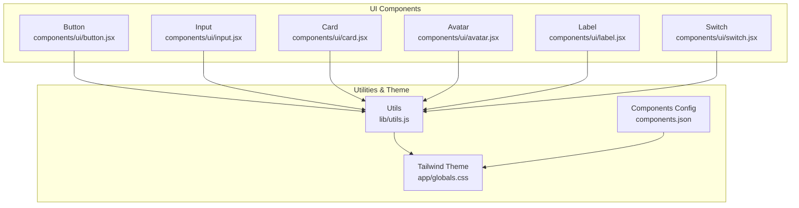
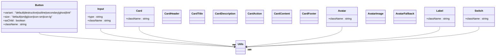
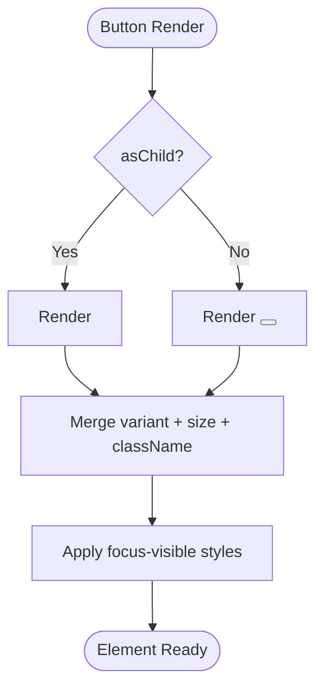
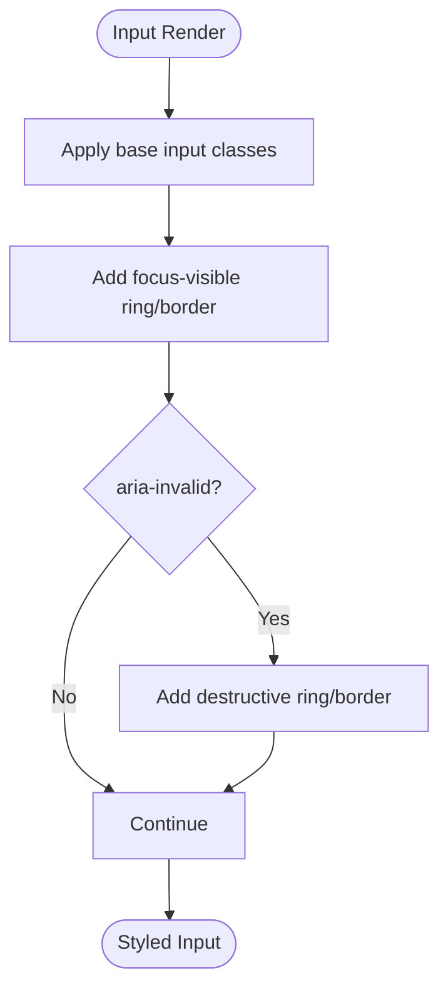
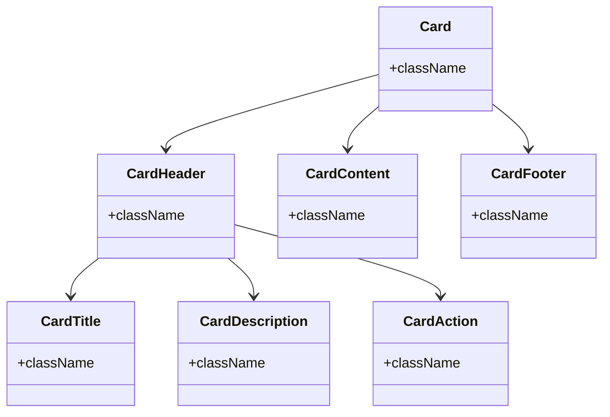
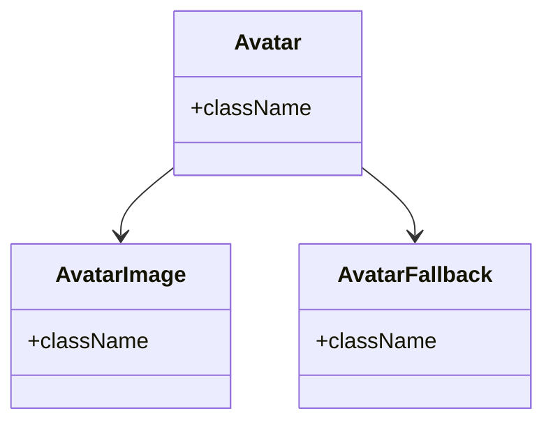
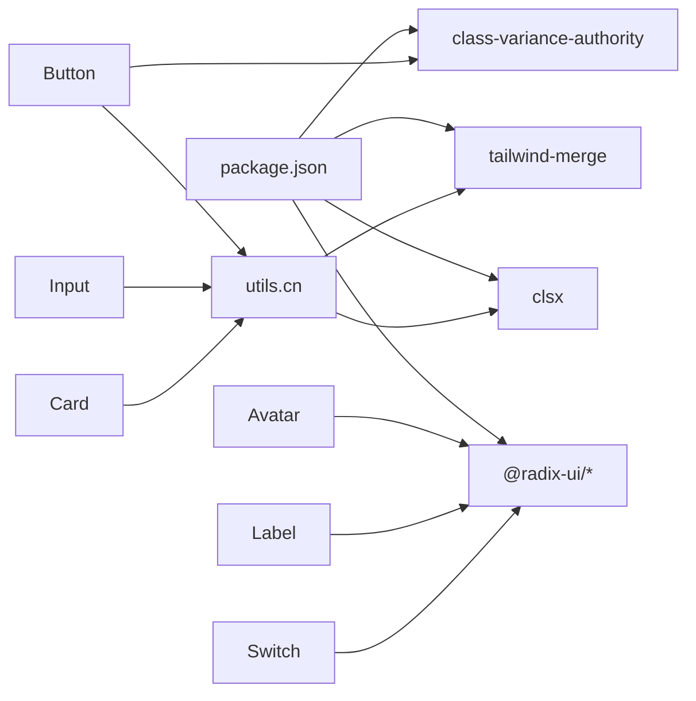

# Core UI Components

<cite>
**Referenced Files in This Document**
- [button.jsx](file://components/ui/button.jsx)
- [input.jsx](file://components/ui/input.jsx)
- [card.jsx](file://components/ui/card.jsx)
- [avatar.jsx](file://components/ui/avatar.jsx)
- [label.jsx](file://components/ui/label.jsx)
- [switch.jsx](file://components/ui/switch.jsx)
- [utils.js](file://lib/utils.js)
- [globals.css](file://app/globals.css)
- [components.json](file://components.json)
- [package.json](file://package.json)
- [profile/page.jsx](file://app/profile/page.jsx)
- [settings/page.jsx](file://app/settings/page.jsx)
</cite>

## Table of Contents
1. [Introduction](#introduction)
2. [Project Structure](#project-structure)
3. [Core Components](#core-components)
4. [Architecture Overview](#architecture-overview)
5. [Detailed Component Analysis](#detailed-component-analysis)
6. [Dependency Analysis](#dependency-analysis)
7. [Performance Considerations](#performance-considerations)
8. [Accessibility Features](#accessibility-features)
9. [Responsive Behavior](#responsive-behavior)
10. [Customization Options](#customization-options)
11. [Usage Examples](#usage-examples)
12. [Troubleshooting Guide](#troubleshooting-guide)
13. [Conclusion](#conclusion)

## Introduction
This document provides comprehensive documentation for the core UI components library used in the project. It covers the Button, Input, Card, Avatar, Label, and Switch components, detailing their props, variants, sizes, styling options, and usage patterns. The documentation emphasizes Tailwind CSS integration, accessibility features, responsive behavior, and customization options, with practical examples drawn from the codebase.

## Project Structure
The UI components are organized under the components/ui directory and are built using:
- Radix UI primitives for accessible base components
- Class Variance Authority (CVA) for variant and size systems
- Tailwind CSS for styling with a custom theme
- Utility functions for merging class names

**Diagram sources**
- [button.jsx:1-57](file://components/ui/button.jsx#L1-L57)
- [input.jsx:1-25](file://components/ui/input.jsx#L1-L25)
- [card.jsx:1-102](file://components/ui/card.jsx#L1-L102)
- [avatar.jsx:1-48](file://components/ui/avatar.jsx#L1-L48)
- [label.jsx:1-24](file://components/ui/label.jsx#L1-L24)
- [switch.jsx:1-30](file://components/ui/switch.jsx#L1-L30)
- [utils.js:1-7](file://lib/utils.js#L1-L7)
- [globals.css:1-123](file://app/globals.css#L1-L123)
- [components.json:1-23](file://components.json#L1-L23)

**Section sources**
- [components.json:1-23](file://components.json#L1-L23)
- [package.json:1-44](file://package.json#L1-L44)

## Core Components
This section summarizes each component's purpose, key props, and styling characteristics.

- Button: A flexible button component supporting multiple variants and sizes, with optional slot composition for semantic markup.
- Input: A styled input field with focus and invalid states, designed for form usage.
- Card: A composite component set including header, title, description, action area, content, and footer for structured content grouping.
- Avatar: A three-part component for user images with fallback handling.
- Label: An accessible label component for form elements with disabled state support.
- Switch: A toggle component with accessible semantics and visual feedback.

**Section sources**
- [button.jsx:39-56](file://components/ui/button.jsx#L39-L56)
- [input.jsx:5-22](file://components/ui/input.jsx#L5-L22)
- [card.jsx:5-101](file://components/ui/card.jsx#L5-L101)
- [avatar.jsx:8-47](file://components/ui/avatar.jsx#L8-L47)
- [label.jsx:8-21](file://components/ui/label.jsx#L8-L21)
- [switch.jsx:8-27](file://components/ui/switch.jsx#L8-L27)

## Architecture Overview
The components follow a consistent pattern:
- Props spread for extensibility
- Conditional rendering via asChild for semantic composition
- CVA-based variant and size systems
- Tailwind utility classes for styling
- Accessible primitives from Radix UI

**Diagram sources**
- [button.jsx:7-37](file://components/ui/button.jsx#L7-L37)
- [input.jsx:5-22](file://components/ui/input.jsx#L5-L22)
- [card.jsx:5-101](file://components/ui/card.jsx#L5-L101)
- [avatar.jsx:8-47](file://components/ui/avatar.jsx#L8-L47)
- [label.jsx:8-21](file://components/ui/label.jsx#L8-L21)
- [switch.jsx:8-27](file://components/ui/switch.jsx#L8-L27)
- [utils.js:4-6](file://lib/utils.js#L4-L6)

## Detailed Component Analysis

### Button Component
- Purpose: Provides actionable elements with consistent styling and behavior across variants and sizes.
- Props:
  - variant: Controls color scheme and hover effects.
  - size: Controls dimensions and padding, including icon variants.
  - asChild: Renders using a slot for semantic composition.
  - className: Additional Tailwind classes.
- Variants:
  - default: Primary brand color with hover adjustments.
  - destructive: Red-based variant with dark mode enhancements.
  - outline: Border and background with accent hover.
  - secondary: Secondary palette with subtle hover.
  - ghost: Transparent hover effect.
  - link: Underlined text link.
- Sizes:
  - default, sm, lg: Standard sizing with adjusted heights and paddings.
  - icon, icon-sm, icon-lg: Fixed square sizes for icons.
- Accessibility and Focus:
  - Includes focus-visible ring and border styles.
  - Supports aria-invalid for form integration.
- Usage Patterns:
  - Combine with icons using the has-[>svg] utility.
  - Use asChild to render as anchor tags or other elements.

**Diagram sources**
- [button.jsx:39-56](file://components/ui/button.jsx#L39-L56)

**Section sources**
- [button.jsx:7-37](file://components/ui/button.jsx#L7-L37)
- [button.jsx:39-56](file://components/ui/button.jsx#L39-L56)

### Input Component
- Purpose: Styled input field optimized for forms with focus and validation states.
- Props:
  - type: HTML input type.
  - className: Additional Tailwind classes.
- Validation States:
  - Uses aria-invalid for invalid state styling.
  - Focus-visible ring and border highlighting.
- Styling:
  - Responsive font sizing (md:text-sm).
  - Disabled state handling.
  - Selection and placeholder color utilities.

**Diagram sources**
- [input.jsx:14-22](file://components/ui/input.jsx#L14-L22)

**Section sources**
- [input.jsx:5-22](file://components/ui/input.jsx#L5-L22)

### Card Component
- Purpose: Structured content container with header, title, description, action area, content, and footer.
- Composition:
  - Card: Outer container with rounded corners and shadow.
  - CardHeader: Grid layout for title and actions.
  - CardTitle: Semantic title element.
  - CardDescription: Subtitle/description with muted color.
  - CardAction: Right-aligned action area.
  - CardContent: Inner content padding.
  - CardFooter: Footer area with optional top border.
- Props: All accept className for customization.

**Diagram sources**
- [card.jsx:5-101](file://components/ui/card.jsx#L5-L101)

**Section sources**
- [card.jsx:5-101](file://components/ui/card.jsx#L5-L101)

### Avatar Component
- Purpose: User representation with image and fallback handling.
- Parts:
  - Avatar: Root container with rounded-full and overflow-hidden.
  - AvatarImage: Aspect-ratio constrained image.
  - AvatarFallback: Centered fallback content with background.
- Props: Accept className for customization.

**Diagram sources**
- [avatar.jsx:8-47](file://components/ui/avatar.jsx#L8-L47)

**Section sources**
- [avatar.jsx:8-47](file://components/ui/avatar.jsx#L8-L47)

### Label Component
- Purpose: Accessible label for form controls with disabled state support.
- Props:
  - className: Additional Tailwind classes.
- Accessibility:
  - Integrates with form controls via peer/for semantics.
  - Disabled state handling for both group and peer contexts.

**Section sources**
- [label.jsx:8-21](file://components/ui/label.jsx#L8-L21)

### Switch Component
- Purpose: Boolean toggle control with accessible semantics.
- Props:
  - className: Additional Tailwind classes.
- Styling:
  - Uses data-state attributes for checked/unchecked visuals.
  - Thumb translation for slider animation.
  - Focus-visible ring and disabled state handling.

**Section sources**
- [switch.jsx:8-27](file://components/ui/switch.jsx#L8-L27)

## Dependency Analysis
The components rely on external libraries and internal utilities:
- Radix UI: Avatar, Label, and Switch primitives for accessibility.
- Class Variance Authority: Variant and size system for Button.
- Tailwind Merge and clsx: Safe class merging.
- Tailwind CSS: Utility-first styling with a custom theme.

**Diagram sources**
- [package.json:11-33](file://package.json#L11-L33)
- [button.jsx:1-6](file://components/ui/button.jsx#L1-L6)
- [input.jsx:1-4](file://components/ui/input.jsx#L1-L4)
- [card.jsx:1-4](file://components/ui/card.jsx#L1-L4)
- [avatar.jsx:1-7](file://components/ui/avatar.jsx#L1-L7)
- [label.jsx:1-7](file://components/ui/label.jsx#L1-L7)
- [switch.jsx:1-7](file://components/ui/switch.jsx#L1-L7)
- [utils.js:1-7](file://lib/utils.js#L1-L7)

**Section sources**
- [package.json:11-33](file://package.json#L11-L33)
- [utils.js:1-7](file://lib/utils.js#L1-L7)

## Performance Considerations
- Prefer variant and size props over ad-hoc classes to leverage CVA caching.
- Use asChild judiciously to avoid unnecessary DOM nodes while preserving semantics.
- Keep className additions minimal to reduce Tailwind class churn.
- Utilize the shared cn utility to merge classes efficiently.

## Accessibility Features
- Buttons:
  - Focus-visible ring and border for keyboard navigation.
  - aria-invalid integration for form validation feedback.
- Inputs:
  - Focus-visible ring and aria-invalid for invalid states.
- Labels:
  - Group and peer disabled states for form control integration.
- Avatars and Switches:
  - Built-in accessibility from Radix UI primitives.

**Section sources**
- [button.jsx:8-8](file://components/ui/button.jsx#L8-L8)
- [input.jsx:15-18](file://components/ui/input.jsx#L15-L18)
- [label.jsx:15-18](file://components/ui/label.jsx#L15-L18)
- [avatar.jsx:13-16](file://components/ui/avatar.jsx#L13-L16)
- [switch.jsx:15-18](file://components/ui/switch.jsx#L15-L18)

## Responsive Behavior
- Inputs:
  - Use md:text-sm for improved readability on larger screens.
- Cards:
  - Responsive grid layouts in CardHeader adapt to content presence.
- General:
  - Tailwind utilities enable consistent responsive scaling across components.

**Section sources**
- [input.jsx:15-15](file://components/ui/input.jsx#L15-L15)
- [card.jsx:28-30](file://components/ui/card.jsx#L28-L30)

## Customization Options
- Variant and Size Systems:
  - Button variants and sizes are defined centrally and can be extended via CVA.
- Tailwind Theme:
  - Custom CSS variables define color tokens for backgrounds, borders, and accents.
  - Dark mode variants adjust colors for contrast and readability.
- Utilities:
  - cn merges classes safely, preventing conflicts and duplicates.

**Section sources**
- [button.jsx:7-37](file://components/ui/button.jsx#L7-L37)
- [globals.css:6-44](file://app/globals.css#L6-L44)
- [globals.css:46-113](file://app/globals.css#L46-L113)
- [utils.js:4-6](file://lib/utils.js#L4-L6)

## Usage Examples
Below are example usages extracted from the project pages:

- Button usage with Card and Input in Profile page:
  - See [profile/page.jsx:134-135](file://app/profile/page.jsx#L134-L135) for Card container usage.
  - See [profile/page.jsx:161-170](file://app/profile/page.jsx#L161-L170) for Input usage.
  - See [profile/page.jsx:285-285](file://app/profile/page.jsx#L285-L285) for Button usage.

- Card and Button usage in Settings page:
  - See [settings/page.jsx:39-46](file://app/settings/page.jsx#L39-L46) for Card and Button usage.
  - See [settings/page.jsx:53-58](file://app/settings/page.jsx#L53-L58) for another Card and Button usage.

These examples demonstrate:
- Combining Card with Input and Button for form-like layouts.
- Using Button variants and sizes for emphasis and alignment.
- Applying custom className overrides for branding and spacing.

**Section sources**
- [profile/page.jsx:134-135](file://app/profile/page.jsx#L134-L135)
- [profile/page.jsx:161-170](file://app/profile/page.jsx#L161-L170)
- [profile/page.jsx:285-285](file://app/profile/page.jsx#L285-L285)
- [settings/page.jsx:39-46](file://app/settings/page.jsx#L39-L46)
- [settings/page.jsx:53-58](file://app/settings/page.jsx#L53-L58)

## Troubleshooting Guide
- Button focus styles not visible:
  - Ensure focus-visible ring utilities are present and Tailwind is configured correctly.
  - Verify that aria-invalid is not overriding focus styles unintentionally.
- Input focus or invalid states not applying:
  - Confirm aria-invalid is set on the input element.
  - Check that focus-visible utilities are included in the class chain.
- Card layout issues:
  - Use CardHeader grid classes and ensure data-slot attributes are preserved.
  - Verify that CardAction placement aligns with grid expectations.
- Avatar fallback not showing:
  - Ensure AvatarFallback is rendered and className does not hide content.
- Label not associated with input:
  - Pair Label with form controls using proper htmlFor/peer semantics.
- Switch thumb misalignment:
  - Confirm data-state attributes are applied and translate classes are intact.

**Section sources**
- [button.jsx:8-8](file://components/ui/button.jsx#L8-L8)
- [input.jsx:15-18](file://components/ui/input.jsx#L15-L18)
- [card.jsx:28-30](file://components/ui/card.jsx#L28-L30)
- [avatar.jsx:39-43](file://components/ui/avatar.jsx#L39-L43)
- [label.jsx:15-18](file://components/ui/label.jsx#L15-L18)
- [switch.jsx:15-24](file://components/ui/switch.jsx#L15-L24)

## Conclusion
The core UI components library provides a cohesive, accessible, and customizable foundation for building forms, cards, and interactive controls. By leveraging CVA for variants and sizes, Radix UI for accessibility, and Tailwind CSS for styling, the components offer consistent behavior across the application. The examples in the project illustrate practical usage patterns, while the documented props, variants, and customization options enable rapid iteration and adaptation to design requirements.