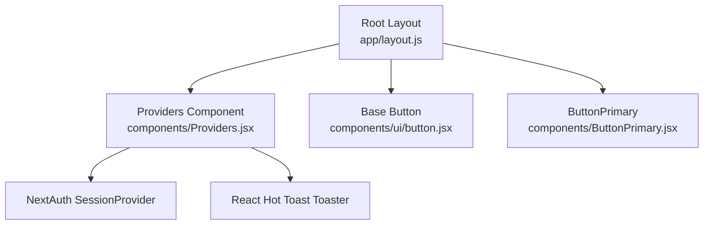
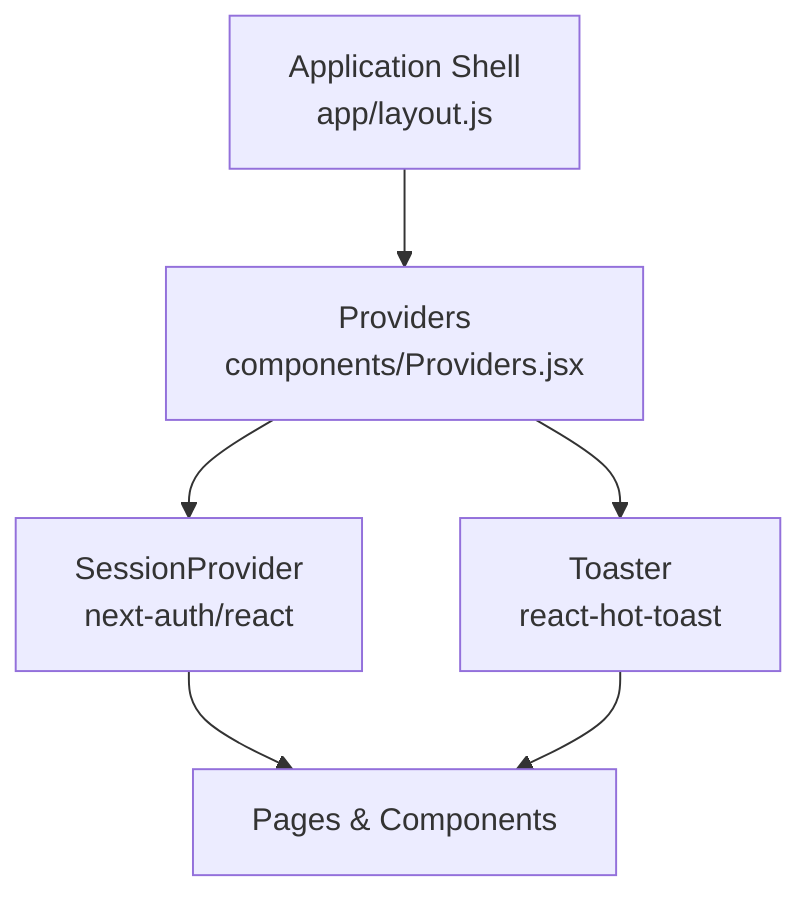
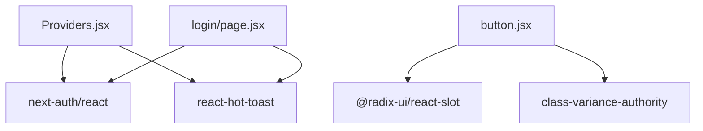

# Custom Components

<cite>
**Referenced Files in This Document**
- [ButtonPrimary.jsx](file://components/ButtonPrimary.jsx)
- [Providers.jsx](file://components/Providers.jsx)
- [button.jsx](file://components/ui/button.jsx)
- [layout.js](file://app/layout.js)
- [auth.js](file://lib/auth.js)
- [login/page.jsx](file://app/auth/login/page.jsx)
- [package.json](file://package.json)
</cite>

## Table of Contents
1. [Introduction](#introduction)
2. [Project Structure](#project-structure)
3. [Core Components](#core-components)
4. [Architecture Overview](#architecture-overview)
5. [Detailed Component Analysis](#detailed-component-analysis)
6. [Dependency Analysis](#dependency-analysis)
7. [Performance Considerations](#performance-considerations)
8. [Troubleshooting Guide](#troubleshooting-guide)
9. [Conclusion](#conclusion)

## Introduction
This document focuses on two custom components in the E-BK application: ButtonPrimary and Providers. It explains ButtonPrimary’s enhanced styling and usage patterns, and clarifies when to use it versus the base Button component. It also documents Providers’ role in wrapping the application with authentication and toast notification contexts, and outlines integration patterns, composition, and best practices for extending these components.

## Project Structure
The custom components live under the components directory and are consumed by the root layout. Providers is imported at the root level to wrap the entire application, ensuring authentication and toast contexts are available globally. The base Button component is provided by the ui module and offers a flexible, theme-aware variant system.

**Diagram sources**
- [layout.js:20-30](file://app/layout.js#L20-L30)
- [Providers.jsx:6-13](file://components/Providers.jsx#L6-L13)
- [button.jsx:39-56](file://components/ui/button.jsx#L39-L56)
- [ButtonPrimary.jsx:1-11](file://components/ButtonPrimary.jsx#L1-L11)

**Section sources**
- [layout.js:1-31](file://app/layout.js#L1-L31)
- [Providers.jsx:1-14](file://components/Providers.jsx#L1-L14)
- [button.jsx:1-57](file://components/ui/button.jsx#L1-L57)
- [ButtonPrimary.jsx:1-11](file://components/ButtonPrimary.jsx#L1-L11)

## Core Components
- ButtonPrimary: A minimal, opinionated primary button tailored for quick actions requiring strong visual emphasis. It encapsulates a fixed set of styles and exposes only children and onClick props.
- Providers: A client-side wrapper that injects NextAuth’s SessionProvider and react-hot-toast’s Toaster into the application tree, enabling authentication state and toast notifications across all routes.

Key differences and usage guidance:
- Use ButtonPrimary for prominent actions where a consistent, branded primary style is desired and customization is not required.
- Use the base Button component when you need variant and size flexibility, consistent theming via Tailwind classes, and integration with the design system.

**Section sources**
- [ButtonPrimary.jsx:1-11](file://components/ButtonPrimary.jsx#L1-L11)
- [button.jsx:39-56](file://components/ui/button.jsx#L39-L56)
- [Providers.jsx:6-13](file://components/Providers.jsx#L6-L13)

## Architecture Overview
Providers ensures that:
- Authentication state is available via NextAuth’s SessionProvider.
- Toast notifications are globally enabled via react-hot-toast’s Toaster.
- These contexts are available to all pages and components rendered below the Providers boundary.

**Diagram sources**
- [layout.js:20-30](file://app/layout.js#L20-L30)
- [Providers.jsx:3-12](file://components/Providers.jsx#L3-L12)

**Section sources**
- [layout.js:1-31](file://app/layout.js#L1-L31)
- [Providers.jsx:1-14](file://components/Providers.jsx#L1-L14)

## Detailed Component Analysis

### ButtonPrimary Component
ButtonPrimary is a thin wrapper around a native button element that applies a consistent primary style and hover/transition effects. It accepts children and an onClick handler, exposing a minimal API suitable for straightforward actions.

Usage patterns:
- Prefer ButtonPrimary for primary CTA buttons that require immediate visual prominence.
- Avoid when variant or size customization is needed; use the base Button component instead.

Integration examples:
- LoginPage demonstrates a native styled button for form submission. For a themed primary button, replace it with ButtonPrimary to align with the design system while keeping the click handler intact.

Best practices:
- Keep labels concise and actionable.
- Pair with appropriate spacing and alignment in layouts.
- Reserve for high-priority actions; avoid overusing to maintain visual hierarchy.

**Section sources**
- [ButtonPrimary.jsx:1-11](file://components/ButtonPrimary.jsx#L1-L11)
- [login/page.jsx:97-103](file://app/auth/login/page.jsx#L97-L103)

### Providers Component
Providers is a client-side component that:
- Wraps children with NextAuth’s SessionProvider to enable authentication state management.
- Renders react-hot-toast’s Toaster to support global toast notifications.

Context and behavior:
- SessionProvider makes useSession and related hooks available throughout the app.
- Toaster provides a global toast container for success/error/info notifications.

Integration pattern:
- Imported and rendered in the root layout so all pages inherit authentication and toast capabilities.

Extensibility:
- Add additional context providers inside Providers if new global services are needed.
- Centralize provider configuration here to keep pages clean and consistent.

**Section sources**
- [Providers.jsx:1-14](file://components/Providers.jsx#L1-L14)
- [layout.js:1-31](file://app/layout.js#L1-L31)

### Base Button Component (Comparison)
The base Button component offers:
- A variant system (default, destructive, outline, secondary, ghost, link).
- A size system (default, sm, lg, icon sizes).
- Consistent focus, disabled, and icon handling via class variance authority and Radix slots.
- Theming integration through design tokens and Tailwind utilities.

When to choose:
- Choose base Button for reusable, theme-consistent buttons across the app.
- Choose ButtonPrimary for specific, branded primary actions that do not require variant/size flexibility.

**Section sources**
- [button.jsx:7-37](file://components/ui/button.jsx#L7-L37)
- [button.jsx:39-56](file://components/ui/button.jsx#L39-L56)

## Dependency Analysis
External dependencies relevant to these components:
- next-auth/react: Provides SessionProvider and authentication hooks used by Providers and consumed by pages/components.
- react-hot-toast: Provides Toaster for toast notifications used by Providers and consumed by pages/components.
- @radix-ui/react-slot and class-variance-authority: Power the base Button component’s variant and slot behavior.

**Diagram sources**
- [Providers.jsx:3-4](file://components/Providers.jsx#L3-L4)
- [button.jsx:2-3](file://components/ui/button.jsx#L2-L3)
- [login/page.jsx:4-5](file://app/auth/login/page.jsx#L4-L5)
- [package.json:25-29](file://package.json#L25-L29)

**Section sources**
- [package.json:11-33](file://package.json#L11-L33)
- [Providers.jsx:1-14](file://components/Providers.jsx#L1-L14)
- [button.jsx:1-57](file://components/ui/button.jsx#L1-L57)
- [login/page.jsx:1-110](file://app/auth/login/page.jsx#L1-L110)

## Performance Considerations
- Providers adds minimal overhead; it only renders wrappers and a single Toaster instance.
- ButtonPrimary is lightweight and does not introduce heavy computations.
- Prefer the base Button component for complex UIs where variant/size logic is frequently reused to reduce duplication and improve maintainability.

## Troubleshooting Guide
Common issues and resolutions:
- Authentication state not available:
  - Ensure Providers is rendered at the root and marked as a client component.
  - Verify that pages/components consuming useSession are also client components.
- Toasts not appearing:
  - Confirm Toaster is rendered within Providers.
  - Ensure react-hot-toast is installed and imported correctly.
- Button styling conflicts:
  - Use the base Button component for consistent theming and variant support.
  - Avoid mixing raw Tailwind classes with ButtonPrimary when variant/size behavior is needed.

**Section sources**
- [layout.js:1-31](file://app/layout.js#L1-L31)
- [Providers.jsx:1-14](file://components/Providers.jsx#L1-L14)
- [login/page.jsx:1-110](file://app/auth/login/page.jsx#L1-L110)

## Conclusion
ButtonPrimary and Providers serve focused roles in the E-BK application: ButtonPrimary delivers a consistent primary action style, while Providers centralizes authentication and toast contexts for the entire app. Use ButtonPrimary for high-priority actions and the base Button for reusable, theme-aware components. Keep Providers at the root to ensure global availability of authentication and notifications, and extend it thoughtfully as the application grows.