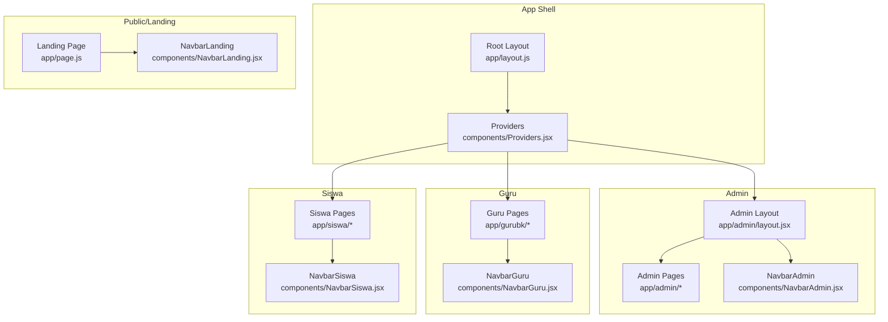
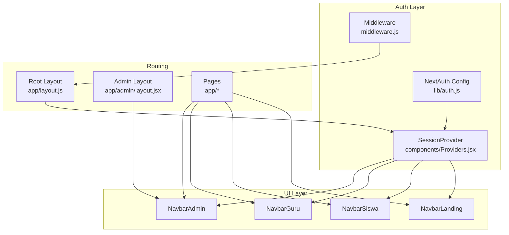
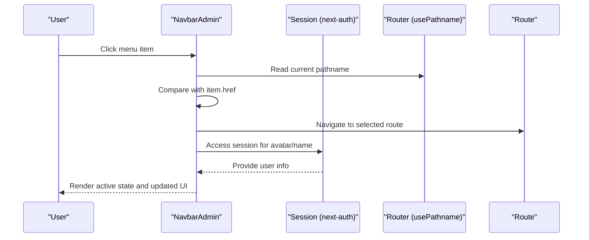
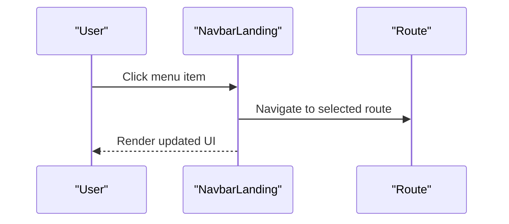
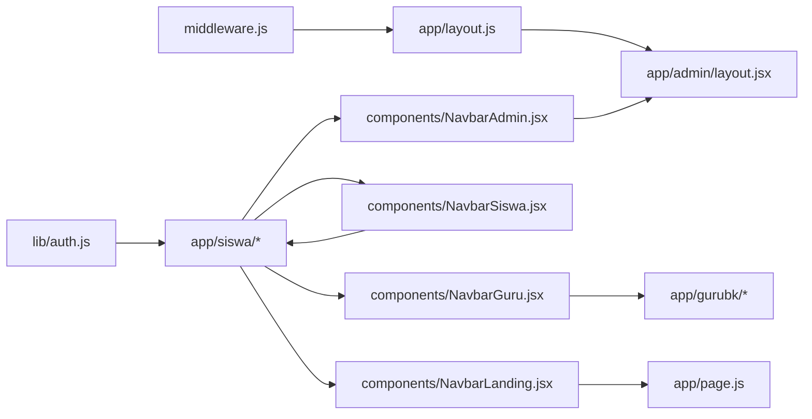

# Navigation Components

<cite>
**Referenced Files in This Document**
- [NavbarAdmin.jsx](file://components/NavbarAdmin.jsx)
- [NavbarGuru.jsx](file://components/NavbarGuru.jsx)
- [NavbarLanding.jsx](file://components/NavbarLanding.jsx)
- [NavbarSiswa.jsx](file://components/NavbarSiswa.jsx)
- [auth.js](file://lib/auth.js)
- [Providers.jsx](file://components/Providers.jsx)
- [middleware.js](file://middleware.js)
- [layout.js](file://app/layout.js)
- [admin/layout.jsx](file://app/admin/layout.jsx)
- [page.js](file://app/page.js)
- [settings/page.jsx](file://app/settings/page.jsx)
</cite>

## Table of Contents
1. [Introduction](#introduction)
2. [Project Structure](#project-structure)
3. [Core Components](#core-components)
4. [Architecture Overview](#architecture-overview)
5. [Detailed Component Analysis](#detailed-component-analysis)
6. [Dependency Analysis](#dependency-analysis)
7. [Performance Considerations](#performance-considerations)
8. [Troubleshooting Guide](#troubleshooting-guide)
9. [Conclusion](#conclusion)

## Introduction
This document provides comprehensive documentation for the navigation components used in the E-BK application: NavbarAdmin, NavbarGuru, NavbarLanding, and NavbarSiswa. It explains each navbar’s role in role-based navigation, menu items, and user interface patterns. It also highlights the differences between landing page navigation and role-specific navigation bars, details component props, styling variations, and integration with authentication state. Examples of navigation patterns, active state management, and responsive behavior are included, along with component composition, route integration, customization options for different user roles, and the relationship between navbars and the overall application layout.

## Project Structure
The navigation components are React client-side components located under the components directory. They are integrated into various application layouts and pages:
- NavbarAdmin is used within the admin layout and pages.
- NavbarGuru is used within the gurubk pages.
- NavbarSiswa is used within the siswa pages.
- NavbarLanding is used on the landing page.

**Diagram sources**
- [layout.js:20-30](file://app/layout.js#L20-L30)
- [Providers.jsx:6-13](file://components/Providers.jsx#L6-L13)
- [admin/layout.jsx:7-16](file://app/admin/layout.jsx#L7-L16)
- [page.js:1-12](file://app/page.js#L1-L12)
- [NavbarAdmin.jsx:9](file://components/NavbarAdmin.jsx#L9)
- [NavbarGuru.jsx:20](file://components/NavbarGuru.jsx#L20)
- [NavbarSiswa.jsx:12](file://components/NavbarSiswa.jsx#L12)
- [NavbarLanding.jsx:5](file://components/NavbarLanding.jsx#L5)

**Section sources**
- [layout.js:20-30](file://app/layout.js#L20-L30)
- [Providers.jsx:6-13](file://components/Providers.jsx#L6-L13)
- [admin/layout.jsx:7-16](file://app/admin/layout.jsx#L7-L16)
- [page.js:1-12](file://app/page.js#L1-L12)

## Core Components
This section summarizes each navbar’s purpose, menu items, and UI patterns.

- NavbarAdmin
  - Purpose: Role-based navigation for administrators managing students, teachers, schedules, and reports.
  - Menu Items: Dashboard, Manage Students, Manage Teachers, Counseling Schedule, Counseling Reports.
  - UI Patterns: Fixed header, desktop horizontal menu with icons, profile dropdown with avatar, mobile hamburger menu, active state highlighting via pathname comparison, logout via next-auth.

- NavbarGuru
  - Purpose: Role-based navigation for counselors guiding teacher activities and requests.
  - Menu Items: Home, Incoming Requests, Counseling Schedule, History, Dashboard.
  - UI Patterns: Similar to NavbarAdmin with profile dropdown and mobile menu.

- NavbarSiswa
  - Purpose: Role-based navigation for students requesting counseling, viewing history, and accessing dashboard.
  - Menu Items: Home, Request Counseling, History, Dashboard.
  - UI Patterns: Similar to others with profile dropdown and mobile menu.

- NavbarLanding
  - Purpose: Public landing page navigation for anonymous visitors.
  - Menu Items: Home, Features, About, Login (button).
  - UI Patterns: Backdrop blur, gradient buttons for CTA, mobile slide-down menu.

Key shared patterns across role-specific navbars:
- Authentication integration via next-auth session and signOut.
- Responsive behavior with mobile toggle and desktop-only menus.
- Active state management using Next.js usePathname and href comparison.
- Profile dropdown with avatar fallback and logout action.

**Section sources**
- [NavbarAdmin.jsx:17-23](file://components/NavbarAdmin.jsx#L17-L23)
- [NavbarAdmin.jsx:41-229](file://components/NavbarAdmin.jsx#L41-L229)
- [NavbarGuru.jsx:28-34](file://components/NavbarGuru.jsx#L28-L34)
- [NavbarGuru.jsx:51-207](file://components/NavbarGuru.jsx#L51-L207)
- [NavbarSiswa.jsx:20-25](file://components/NavbarSiswa.jsx#L20-L25)
- [NavbarSiswa.jsx:46-189](file://components/NavbarSiswa.jsx#L46-L189)
- [NavbarLanding.jsx:8-13](file://components/NavbarLanding.jsx#L8-L13)
- [NavbarLanding.jsx:15-95](file://components/NavbarLanding.jsx#L15-L95)

## Architecture Overview
The navigation components are integrated into the application shell and role-specific layouts. Authentication state is provided via SessionProvider and consumed by navbars through next-auth hooks. Middleware enforces role-based access to protected routes.

**Diagram sources**
- [auth.js:6-75](file://lib/auth.js#L6-L75)
- [middleware.js:11-42](file://middleware.js#L11-L42)
- [Providers.jsx:6-13](file://components/Providers.jsx#L6-L13)
- [layout.js:20-30](file://app/layout.js#L20-L30)
- [admin/layout.jsx:7-16](file://app/admin/layout.jsx#L7-L16)
- [NavbarAdmin.jsx:9](file://components/NavbarAdmin.jsx#L9)
- [NavbarGuru.jsx:20](file://components/NavbarGuru.jsx#L20)
- [NavbarSiswa.jsx:12](file://components/NavbarSiswa.jsx#L12)
- [NavbarLanding.jsx:5](file://components/NavbarLanding.jsx#L5)

## Detailed Component Analysis

### NavbarAdmin
- Role: Administrator
- Props: None (uses next-auth session and next/navigation)
- Active State: Compares current pathname with menu item href
- Styling: Fixed header, blue branding, profile dropdown with blue header, hover effects, mobile menu overlay
- Integration: Used in admin layout and pages; relies on session for avatar and name fallback

**Diagram sources**
- [NavbarAdmin.jsx:9-11](file://components/NavbarAdmin.jsx#L9-L11)
- [NavbarAdmin.jsx:55-78](file://components/NavbarAdmin.jsx#L55-L78)
- [NavbarAdmin.jsx:176-227](file://components/NavbarAdmin.jsx#L176-L227)

**Section sources**
- [NavbarAdmin.jsx:9-23](file://components/NavbarAdmin.jsx#L9-L23)
- [NavbarAdmin.jsx:41-229](file://components/NavbarAdmin.jsx#L41-L229)

### NavbarGuru
- Role: Counselor
- Props: None (uses next-auth session and next/navigation)
- Active State: Compares current pathname with menu item href
- Styling: Fixed header, blue branding, profile dropdown with blue header, mobile menu overlay
- Integration: Used in gurubk pages; relies on session for avatar and name fallback

**Diagram sources**
- [NavbarGuru.jsx:20-22](file://components/NavbarGuru.jsx#L20-L22)
- [NavbarGuru.jsx:65-88](file://components/NavbarGuru.jsx#L65-L88)
- [NavbarGuru.jsx:154-205](file://components/NavbarGuru.jsx#L154-L205)

**Section sources**
- [NavbarGuru.jsx:20-34](file://components/NavbarGuru.jsx#L20-L34)
- [NavbarGuru.jsx:51-207](file://components/NavbarGuru.jsx#L51-L207)

### NavbarSiswa
- Role: Student
- Props: None (uses next-auth session and next/navigation)
- Active State: Compares current pathname with menu item href
- Styling: Fixed header, blue branding, profile dropdown with gradient header, mobile menu overlay
- Integration: Used in siswa pages; relies on session for avatar and name fallback

**Diagram sources**
- [NavbarSiswa.jsx:12-14](file://components/NavbarSiswa.jsx#L12-L14)
- [NavbarSiswa.jsx:60-79](file://components/NavbarSiswa.jsx#L60-L79)
- [NavbarSiswa.jsx:139-187](file://components/NavbarSiswa.jsx#L139-L187)

**Section sources**
- [NavbarSiswa.jsx:12-25](file://components/NavbarSiswa.jsx#L12-L25)
- [NavbarSiswa.jsx:46-189](file://components/NavbarSiswa.jsx#L46-L189)

### NavbarLanding
- Role: Public (anonymous)
- Props: None (no session dependency)
- Active State: Not applicable (static links)
- Styling: Backdrop blur, gradient CTA button, mobile slide-down menu
- Integration: Used on the landing page

**Diagram sources**
- [NavbarLanding.jsx:5-13](file://components/NavbarLanding.jsx#L5-L13)
- [NavbarLanding.jsx:64-93](file://components/NavbarLanding.jsx#L64-L93)

**Section sources**
- [NavbarLanding.jsx:5-13](file://components/NavbarLanding.jsx#L5-L13)
- [NavbarLanding.jsx:15-95](file://components/NavbarLanding.jsx#L15-L95)

## Dependency Analysis
- Authentication and session
  - NextAuth configuration defines JWT callbacks and session shape, exposing role, phone, and avatar_url.
  - Providers wraps the app with SessionProvider to make session data available.
  - Navbars consume session via next-auth hooks and render profile-related UI.

- Routing and active state
  - Navbars use Next.js usePathname to compute active state against menu item hrefs.
  - Middleware enforces role-based access to protected routes (/admin, /guru, /siswa).

- Component composition
  - Root layout composes Providers, which wraps all pages.
  - Role-specific layouts (e.g., admin layout) compose the appropriate navbar and provide page content area spacing.

**Diagram sources**
- [auth.js:6-75](file://lib/auth.js#L6-L75)
- [Providers.jsx:6-13](file://components/Providers.jsx#L6-L13)
- [NavbarAdmin.jsx:9](file://components/NavbarAdmin.jsx#L9)
- [NavbarGuru.jsx:20](file://components/NavbarGuru.jsx#L20)
- [NavbarSiswa.jsx:12](file://components/NavbarSiswa.jsx#L12)
- [NavbarLanding.jsx:5](file://components/NavbarLanding.jsx#L5)
- [middleware.js:11-42](file://middleware.js#L11-L42)
- [layout.js:20-30](file://app/layout.js#L20-L30)
- [admin/layout.jsx:7-16](file://app/admin/layout.jsx#L7-L16)

**Section sources**
- [auth.js:6-75](file://lib/auth.js#L6-L75)
- [Providers.jsx:6-13](file://components/Providers.jsx#L6-L13)
- [middleware.js:11-42](file://middleware.js#L11-L42)
- [layout.js:20-30](file://app/layout.js#L20-L30)
- [admin/layout.jsx:7-16](file://app/admin/layout.jsx#L7-L16)

## Performance Considerations
- Active state computation: Using usePathname and string comparisons for each menu item is lightweight; avoid unnecessary re-renders by keeping menu arrays static.
- Dropdown click-outside handler: Cleanup event listeners on unmount to prevent memory leaks.
- Avatar fallback: Prefer static fallback images to reduce network requests when user avatar is unavailable.
- Mobile menu: Conditional rendering reduces DOM overhead on desktop; ensure smooth transitions for better UX.
- Session access: Access session data minimally; avoid deep object drilling in render paths.

## Troubleshooting Guide
- Active state not updating
  - Verify usePathname is imported and used correctly.
  - Ensure menu item hrefs match actual routes.

- Profile dropdown not closing
  - Confirm click-outside handler is attached and cleaned up.
  - Check dropdownRef is properly assigned.

- Logout not working
  - Ensure signOut is imported from next-auth/react and invoked with a valid callbackUrl.

- Unauthorized redirects
  - Middleware protects role-specific paths; confirm token presence and role value.
  - Adjust middleware matchers if new protected routes are added.

- Session not available in navbars
  - Ensure Providers wraps the application.
  - Confirm next-auth configuration includes JWT callbacks and session strategy.

**Section sources**
- [NavbarAdmin.jsx:25-33](file://components/NavbarAdmin.jsx#L25-L33)
- [NavbarGuru.jsx:36-44](file://components/NavbarGuru.jsx#L36-L44)
- [NavbarSiswa.jsx:27-35](file://components/NavbarSiswa.jsx#L27-L35)
- [auth.js:55-71](file://lib/auth.js#L55-L71)
- [Providers.jsx:6-13](file://components/Providers.jsx#L6-L13)
- [middleware.js:19-42](file://middleware.js#L19-L42)

## Conclusion
The E-BK navigation components implement a consistent, role-aware, and responsive navigation system. NavbarAdmin, NavbarGuru, and NavbarSiswa share common UI patterns and active-state management while reflecting role-specific responsibilities. NavbarLanding serves the public landing page with a distinct style and purpose. Together with NextAuth and middleware, they form a cohesive navigation and access-control architecture that scales across user roles and device sizes.