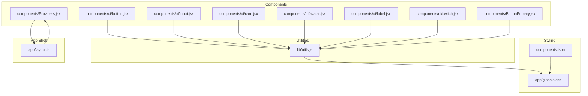
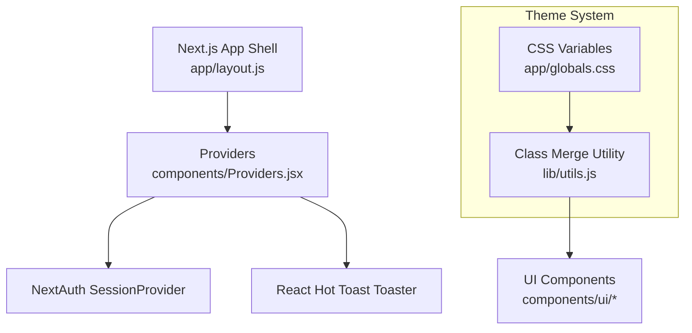
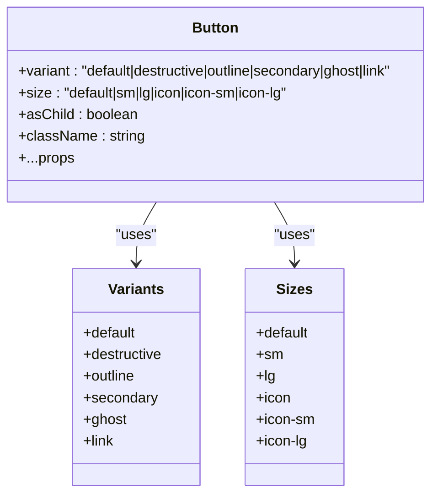
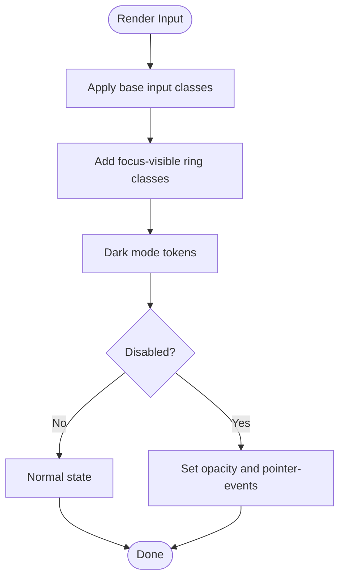
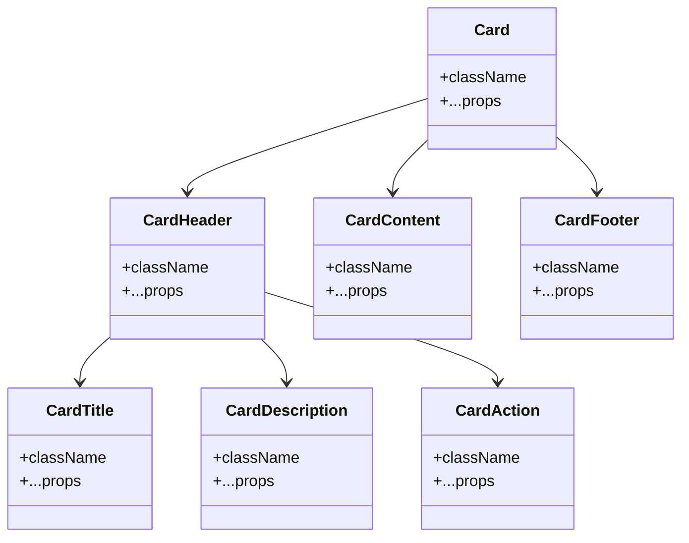
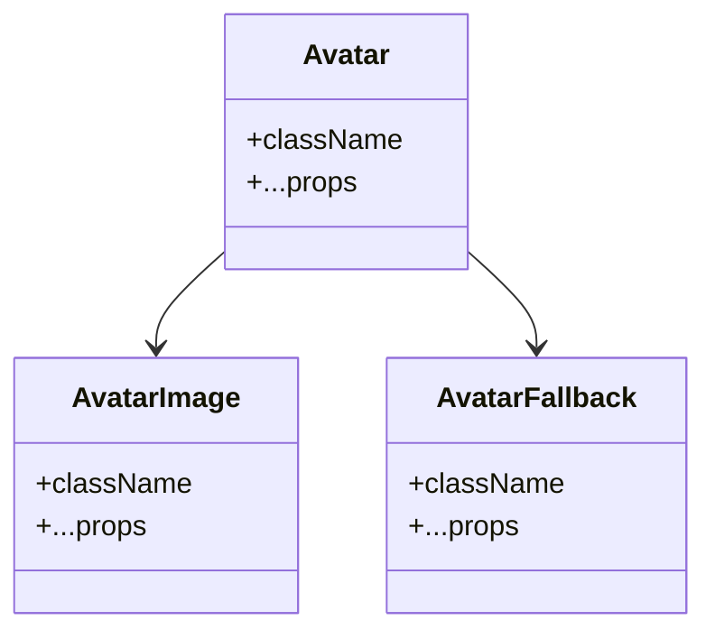
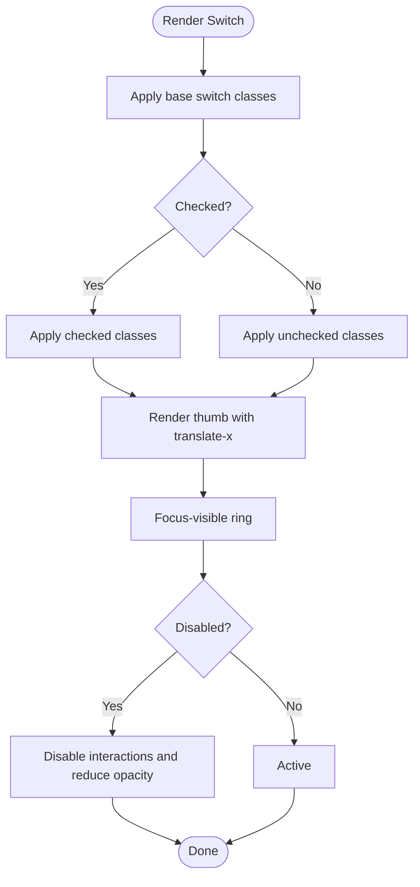
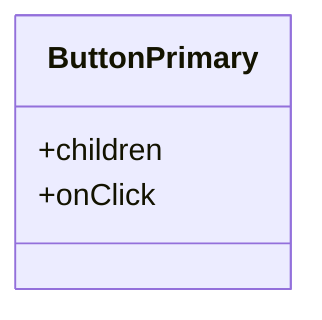
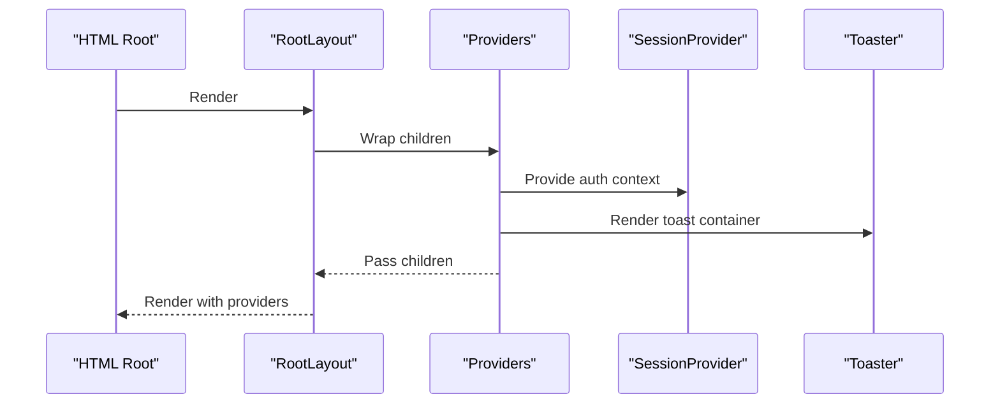
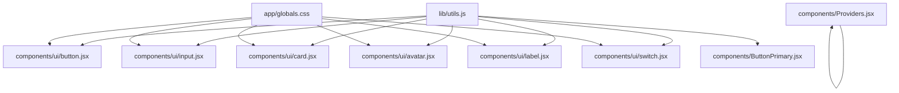

# UI Components

<cite>
**Referenced Files in This Document**
- [button.jsx](file://components/ui/button.jsx)
- [input.jsx](file://components/ui/input.jsx)
- [card.jsx](file://components/ui/card.jsx)
- [avatar.jsx](file://components/ui/avatar.jsx)
- [label.jsx](file://components/ui/label.jsx)
- [switch.jsx](file://components/ui/switch.jsx)
- [ButtonPrimary.jsx](file://components/ButtonPrimary.jsx)
- [Providers.jsx](file://components/Providers.jsx)
- [utils.js](file://lib/utils.js)
- [globals.css](file://app/globals.css)
- [components.json](file://components.json)
- [package.json](file://package.json)
- [layout.js](file://app/layout.js)
- [profile/page.jsx](file://app/profile/page.jsx)
- [settings/page.jsx](file://app/settings/page.jsx)
</cite>

## Table of Contents
1. [Introduction](#introduction)
2. [Project Structure](#project-structure)
3. [Core Components](#core-components)
4. [Architecture Overview](#architecture-overview)
5. [Detailed Component Analysis](#detailed-component-analysis)
6. [Dependency Analysis](#dependency-analysis)
7. [Performance Considerations](#performance-considerations)
8. [Accessibility Features](#accessibility-features)
9. [Responsive Behavior](#responsive-behavior)
10. [Integration Patterns](#integration-patterns)
11. [Extending Components](#extending-components)
12. [Troubleshooting Guide](#troubleshooting-guide)
13. [Conclusion](#conclusion)

## Introduction
This document describes the reusable UI component library used in the E-BK application. It covers the visual appearance, behavior, props, variants, customization options, and usage patterns for Button, Input, Card, Avatar, Label, Switch, and the specialized ButtonPrimary component. It also documents the Providers component for authentication and notification context, along with Tailwind CSS integration, accessibility features, responsive behavior, and extension guidelines.

## Project Structure
The UI components are organized under the components directory, with shared utilities and global styles supporting consistent theming and styling across the application.



**Diagram sources**
- [button.jsx:1-57](file://components/ui/button.jsx#L1-L57)
- [input.jsx:1-25](file://components/ui/input.jsx#L1-L25)
- [card.jsx:1-102](file://components/ui/card.jsx#L1-L102)
- [avatar.jsx:1-48](file://components/ui/avatar.jsx#L1-L48)
- [label.jsx:1-24](file://components/ui/label.jsx#L1-L24)
- [switch.jsx:1-30](file://components/ui/switch.jsx#L1-L30)
- [ButtonPrimary.jsx:1-11](file://components/ButtonPrimary.jsx#L1-L11)
- [Providers.jsx:1-14](file://components/Providers.jsx#L1-L14)
- [utils.js:1-7](file://lib/utils.js#L1-L7)
- [globals.css:1-123](file://app/globals.css#L1-L123)
- [components.json:1-23](file://components.json#L1-L23)
- [layout.js:1-31](file://app/layout.js#L1-L31)

**Section sources**
- [components.json:1-23](file://components.json#L1-L23)
- [layout.js:1-31](file://app/layout.js#L1-L31)

## Core Components
This section summarizes the primary UI components and their roles in the application.

- Button: A versatile action component with variants and sizes, supporting slot composition and focus-visible states.
- Input: A styled text input with focus-visible rings, dark mode support, and invalid state styling.
- Card: A composite container with header, title, description, action, content, and footer slots for structured layouts.
- Avatar: A three-part component (root, image, fallback) for user avatars with Radix UI primitives.
- Label: A labeled control component built on Radix UI with disabled and peer state support.
- Switch: A toggle component with focus-visible styling and checked/unchecked states.
- ButtonPrimary: A simplified primary button with fixed styling and click handler.
- Providers: A wrapper that injects NextAuth session provider and toast notifications.

**Section sources**
- [button.jsx:1-57](file://components/ui/button.jsx#L1-L57)
- [input.jsx:1-25](file://components/ui/input.jsx#L1-L25)
- [card.jsx:1-102](file://components/ui/card.jsx#L1-L102)
- [avatar.jsx:1-48](file://components/ui/avatar.jsx#L1-L48)
- [label.jsx:1-24](file://components/ui/label.jsx#L1-L24)
- [switch.jsx:1-30](file://components/ui/switch.jsx#L1-L30)
- [ButtonPrimary.jsx:1-11](file://components/ButtonPrimary.jsx#L1-L11)
- [Providers.jsx:1-14](file://components/Providers.jsx#L1-L14)

## Architecture Overview
The UI components rely on a shared utility function for merging Tailwind classes and a centralized theme system defined via CSS variables. Providers wrap the application to enable authentication and toast notifications.



**Diagram sources**
- [layout.js:1-31](file://app/layout.js#L1-L31)
- [Providers.jsx:1-14](file://components/Providers.jsx#L1-L14)
- [globals.css:1-123](file://app/globals.css#L1-L123)
- [utils.js:1-7](file://lib/utils.js#L1-L7)

## Detailed Component Analysis

### Button
- Purpose: Standard action element with multiple variants and sizes.
- Props:
  - variant: default | destructive | outline | secondary | ghost | link
  - size: default | sm | lg | icon | icon-sm | icon-lg
  - asChild: render as a Radix Slot to compose with links or other elements
  - className: additional Tailwind classes
  - ...rest: forwarded to the underlying element or slot
- Variants and Sizes:
  - Variant palette integrates with theme tokens (primary, secondary, destructive, etc.).
  - Size tokens adjust height, padding, and icon spacing consistently.
- Accessibility:
  - Focus-visible ring and border styling for keyboard navigation.
  - aria-invalid styling for form integration.
- Composition:
  - Supports asChild to wrap anchor tags or other interactive elements.
- Usage patterns:
  - Combine variant and size to match UI hierarchy.
  - Use icon variants for compact actions.
  - Apply className for overrides while preserving base styles.



**Diagram sources**
- [button.jsx:7-37](file://components/ui/button.jsx#L7-L37)

**Section sources**
- [button.jsx:1-57](file://components/ui/button.jsx#L1-L57)

### Input
- Purpose: Text input field with consistent styling and focus states.
- Props:
  - type: input type (text, email, password, etc.)
  - className: additional Tailwind classes
  - ...rest: forwarded to the native input
- Styling highlights:
  - Focus-visible ring and border highlight.
  - Dark mode input background and border tokens.
  - Disabled state opacity and pointer events.
  - Selection color integration with theme.
- Accessibility:
  - Proper focus-visible indicators.
  - aria-invalid support for form validation feedback.
- Usage patterns:
  - Pair with Label for accessible forms.
  - Use placeholder tokens for hints.
  - Combine with Button for search or submit actions.



**Diagram sources**
- [input.jsx:14-20](file://components/ui/input.jsx#L14-L20)

**Section sources**
- [input.jsx:1-25](file://components/ui/input.jsx#L1-L25)

### Card
- Purpose: Structured content container with semantic regions.
- Subcomponents:
  - Card: outer container
  - CardHeader: top area with optional action alignment
  - CardTitle: main heading
  - CardDescription: secondary text
  - CardAction: supplemental controls (e.g., menu, close)
  - CardContent: main body content
  - CardFooter: bottom area (e.g., buttons)
- Props:
  - className: additional Tailwind classes for each subcomponent
  - ...rest: forwarded to the underlying div
- Layout features:
  - Grid-based header layout supports single or dual-column arrangement.
  - Action placement aligns to the top-right when present.
- Usage patterns:
  - Use CardHeader/CardTitle for page or panel titles.
  - Place controls in CardAction for contextual actions.
  - Stack multiple CardContent blocks for complex forms or lists.



**Diagram sources**
- [card.jsx:5-101](file://components/ui/card.jsx#L5-L101)

**Section sources**
- [card.jsx:1-102](file://components/ui/card.jsx#L1-L102)

### Avatar
- Purpose: User identity display with image and fallback.
- Subcomponents:
  - Avatar: root container
  - AvatarImage: image slot
  - AvatarFallback: fallback content (e.g., initials)
- Props:
  - className: additional Tailwind classes
  - ...rest: forwarded to the underlying primitive
- Accessibility:
  - Uses Radix UI primitives for proper semantics and keyboard handling.
- Usage patterns:
  - Render AvatarImage with src and alt.
  - AvatarFallback appears when the image fails to load.
  - Combine with Label or Button for interactive user entries.



**Diagram sources**
- [avatar.jsx:8-47](file://components/ui/avatar.jsx#L8-L47)

**Section sources**
- [avatar.jsx:1-48](file://components/ui/avatar.jsx#L1-L48)

### Label
- Purpose: Associates text with form controls for accessibility.
- Props:
  - className: additional Tailwind classes
  - ...rest: forwarded to the Radix label root
- States:
  - Disabled groups and peer-disabled states supported.
- Usage patterns:
  - Wrap inputs or switches with Label for clickable labels.
  - Use with Input and Switch to improve usability.

```mermermaid
classDiagram
  class Label {
    +className
    +...props
  }
```

**Diagram sources**
- [label.jsx:8-23](file://components/ui/label.jsx#L8-L23)

**Section sources**
- [label.jsx:1-24](file://components/ui/label.jsx#L1-L24)

### Switch
- Purpose: Toggle control with visual feedback.
- Props:
  - className: additional Tailwind classes
  - ...rest: forwarded to the Radix switch root
- Styling:
  - Checked and unchecked states mapped to theme tokens.
  - Thumb translates horizontally to indicate state.
  - Focus-visible ring and disabled state handling.
- Usage patterns:
  - Pair with Label for on/off toggles.
  - Use in settings panels or preference forms.



**Diagram sources**
- [switch.jsx:15-26](file://components/ui/switch.jsx#L15-L26)

**Section sources**
- [switch.jsx:1-30](file://components/ui/switch.jsx#L1-L30)

### ButtonPrimary
- Purpose: Simplified primary action with a fixed brand color scheme.
- Props:
  - children: button content
  - onClick: click handler
- Styling:
  - Fixed padding, rounded corners, and shadow.
  - Hover effect and transition for interactivity.
- Usage patterns:
  - Use for prominent actions where a consistent primary style is desired.
  - Prefer Button for more nuanced variants and sizes.



**Diagram sources**
- [ButtonPrimary.jsx:1-11](file://components/ButtonPrimary.jsx#L1-L11)

**Section sources**
- [ButtonPrimary.jsx:1-11](file://components/ButtonPrimary.jsx#L1-L11)

### Providers
- Purpose: Application-wide context provider for authentication and notifications.
- Responsibilities:
  - Wraps children with NextAuth’s SessionProvider.
  - Renders react-hot-toast Toaster for notifications.
- Placement:
  - Mounted at the root layout level to ensure global availability.
- Usage patterns:
  - Wrap pages or page trees requiring auth or toast feedback.



**Diagram sources**
- [layout.js:20-29](file://app/layout.js#L20-L29)
- [Providers.jsx:6-12](file://components/Providers.jsx#L6-L12)

**Section sources**
- [Providers.jsx:1-14](file://components/Providers.jsx#L1-L14)
- [layout.js:1-31](file://app/layout.js#L1-L31)

## Dependency Analysis
The UI components depend on shared utilities and the theme system. Providers depend on external libraries for authentication and notifications.



**Diagram sources**
- [utils.js:1-7](file://lib/utils.js#L1-L7)
- [globals.css:1-123](file://app/globals.css#L1-L123)
- [button.jsx:1-57](file://components/ui/button.jsx#L1-L57)
- [input.jsx:1-25](file://components/ui/input.jsx#L1-L25)
- [card.jsx:1-102](file://components/ui/card.jsx#L1-L102)
- [avatar.jsx:1-48](file://components/ui/avatar.jsx#L1-L48)
- [label.jsx:1-24](file://components/ui/label.jsx#L1-L24)
- [switch.jsx:1-30](file://components/ui/switch.jsx#L1-L30)
- [ButtonPrimary.jsx:1-11](file://components/ButtonPrimary.jsx#L1-L11)
- [Providers.jsx:1-14](file://components/Providers.jsx#L1-L14)

**Section sources**
- [package.json:11-33](file://package.json#L11-L33)
- [components.json:6-12](file://components.json#L6-L12)

## Performance Considerations
- Prefer variant and size props over ad-hoc className merges to leverage precomputed styles.
- Use asChild in Button to avoid unnecessary DOM wrappers when composing with anchors.
- Minimize deep nesting inside Card to keep rendering efficient.
- Defer heavy computations in onClick handlers; use Providers for lightweight context injection.

## Accessibility Features
- Focus management:
  - Buttons and inputs expose focus-visible rings for keyboard navigation.
  - Switch and Label integrate with peer and group disabled states.
- Semantic markup:
  - Label wraps inputs and switches to associate text with controls.
  - Avatar uses Radix primitives for accessible ARIA roles.
- Form integration:
  - Inputs and buttons support aria-invalid for validation feedback.

**Section sources**
- [button.jsx:8-8](file://components/ui/button.jsx#L8-L8)
- [input.jsx:15-17](file://components/ui/input.jsx#L15-L17)
- [label.jsx:16-16](file://components/ui/label.jsx#L16-L16)
- [avatar.jsx:15-15](file://components/ui/avatar.jsx#L15-L15)
- [switch.jsx:16-16](file://components/ui/switch.jsx#L16-L16)

## Responsive Behavior
- Typography scales with responsive text utilities; inputs adapt padding and font size across breakpoints.
- Cards use flexible spacing and grid layouts to accommodate varying widths.
- Buttons and inputs maintain consistent padding and sizing across viewport widths.

**Section sources**
- [input.jsx:15-15](file://components/ui/input.jsx#L15-L15)
- [card.jsx:28-28](file://components/ui/card.jsx#L28-L28)

## Integration Patterns
- Theming:
  - CSS variables define theme tokens; Tailwind utilities consume these tokens for consistent colors.
  - Dark mode variant adjusts token values for contrast and readability.
- Utilities:
  - cn merges and deduplicates Tailwind classes safely.
- Layout:
  - Root layout wraps the app with Providers to ensure auth and toast contexts are available globally.

**Section sources**
- [globals.css:6-44](file://app/globals.css#L6-L44)
- [utils.js:4-6](file://lib/utils.js#L4-L6)
- [layout.js:20-29](file://app/layout.js#L20-L29)

## Extending Components
- Adding new variants/sizes:
  - Extend buttonVariants with new keys and corresponding Tailwind classes.
  - Keep variants scoped to the component to avoid global side effects.
- Custom styling:
  - Use className to override defaults; rely on cn to merge safely.
- New composite components:
  - Follow the pattern of Card subcomponents to encapsulate layout concerns.
- Theming extensions:
  - Add new CSS variables and update tokens in :root and .dark selectors.
- Provider augmentation:
  - Introduce new context providers alongside Providers while keeping minimal coupling.

**Section sources**
- [button.jsx:7-37](file://components/ui/button.jsx#L7-L37)
- [card.jsx:20-91](file://components/ui/card.jsx#L20-L91)
- [globals.css:46-113](file://app/globals.css#L46-L113)
- [utils.js:4-6](file://lib/utils.js#L4-L6)

## Troubleshooting Guide
- Button not responding to clicks:
  - Verify asChild is not preventing event bubbling; ensure the underlying element supports the intended interaction.
- Input focus ring not visible:
  - Confirm focus-visible utilities are applied and that the browser supports focus-visible.
- Card layout misalignment:
  - Check presence of CardAction; its inclusion affects header grid layout.
- Avatar fallback not showing:
  - Ensure AvatarImage has a broken src or alt set; fallback renders when images fail.
- Switch state not updating:
  - Confirm controlled vs uncontrolled usage and that state is properly managed in parent components.
- Notifications not appearing:
  - Ensure Providers is wrapping the application root and Toaster is rendered.

**Section sources**
- [button.jsx:46-53](file://components/ui/button.jsx#L46-L53)
- [input.jsx:15-17](file://components/ui/input.jsx#L15-L17)
- [card.jsx:66-69](file://components/ui/card.jsx#L66-L69)
- [avatar.jsx:39-43](file://components/ui/avatar.jsx#L39-L43)
- [Providers.jsx:6-12](file://components/Providers.jsx#L6-L12)

## Conclusion
The E-BK UI component library emphasizes consistency, accessibility, and composability. Components leverage a shared utility for class merging and a robust theme system defined via CSS variables. Providers centralize authentication and notification contexts. By following the documented patterns and extension guidelines, teams can maintain design consistency while adding new capabilities.